# About Mesh Commands

Meshes can be either

- **•** conforming with a geometry, or
- **•** define their own geometric model.

The first category involves models that have a geometry sequence with either imported CAD or created in the software. One or several meshes are then generated based on this geometry. Meshes that define their own geometric model typically involve imported meshes or operations that edit a mesh. If such a mesh defines the component's geometric model, the physics can then be defined on the geometric entities of the mesh. For more information, see Geometric Model.

Table 4-1 is an overview of all available mesh operations. The two rightmost columns give information about if an operation is supported for meshes conforming with geometry and meshes defining their own geometric model.

TABLE 4-1: AVAILABLE MESH OPERATIONS.

| FEATURE TYPE     | DESCRIPTION                                                                                            | DEFAULT<br>TAG IN GUI | MESH<br>CONFORMING<br>WITH<br>GEOMETRY | MESH DEFINING<br>ITS OWN<br>GEOMETRIC<br>MODEL |
|------------------|--------------------------------------------------------------------------------------------------------|-----------------------|----------------------------------------|------------------------------------------------|
| Adapt            | Adaptive mesh modification                                                                             | ada                   | √                                      | √                                              |
| Ball             | Partition geometric entities of the mesh by an<br>element set defined by a ball                        | ball                  | √                                      | √                                              |
| BndLayer         | Generate boundary layer mesh                                                                           | bl                    | √                                      | √                                              |
| Box              | Partition geometric entities of the mesh by an<br>element set defined by a box                         | box                   |                                        | √                                              |
| CollapseEntities | Collapse geometric entities of the mesh                                                                | col                   |                                        | √                                              |
| Convert          | Convert nonsimplex elements in the mesh to<br>simplex elements                                         | conv                  | √                                      | √                                              |
| Copy             | Copy a mesh from a meshing sequence                                                                    | copy                  | √                                      |                                                |
| CopyEdge         | Copy mesh between edges                                                                                | cpe                   | √                                      |                                                |
| CopyFace         | Copy mesh between faces                                                                                | cpf                   | √                                      |                                                |
| CopyDomain       | Copy mesh between domains                                                                              | cpd                   | √                                      |                                                |
| CreateDomains    | Create one domain for each finite void region<br>defined by the mesh                                   | dom                   |                                        | √                                              |
| CreateEdges      | Create new edges in the mesh                                                                           | edg                   |                                        | √                                              |
| CreateFaces      | Create new faces in the mesh                                                                           | fac                   |                                        | √                                              |
| CreateVertices   | Create new geometric vertices in the mesh                                                              | vtx                   |                                        | √                                              |
| Cylinder         | Partition geometric entities of the mesh by an<br>element set defined by a cylinder                    | cyl                   |                                        | √                                              |
| DeleteEntities   | Delete geometric entities from the mesh                                                                | dele                  |                                        | √                                              |
| DetectFaces      | Partition faces of the mesh by searching for<br>shapes that are likely to constitute separate<br>faces | detf                  |                                        | √                                              |
| Edge             | Generate mesh for edges                                                                                | edg                   | √                                      |                                                |
| FillHoles        | Repair holes in faces of the mesh                                                                      | fill                  |                                        | √                                              |
| FreeTet          | Generate unstructured tetrahedral mesh                                                                 | ftet                  | √                                      | √                                              |
| FreeTri          | Generate unstructured triangular mesh                                                                  | ftri                  | √                                      | √                                              |

TABLE 4-1: AVAILABLE MESH OPERATIONS.

| FEATURE TYPE      | DESCRIPTION                                                                                   | DEFAULT<br>TAG IN GUI | MESH<br>CONFORMING<br>WITH<br>GEOMETRY | MESH DEFINING<br>ITS OWN<br>GEOMETRIC<br>MODEL |  |
|-------------------|-----------------------------------------------------------------------------------------------|-----------------------|----------------------------------------|------------------------------------------------|--|
| FreeQuad          | Generate unstructured quadrilateral mesh                                                      | fq                    | √                                      | √                                              |  |
| Import            | Import mesh from file or other source                                                         | imp                   |                                        | √                                              |  |
| IntersectLine     | Intersect the mesh with a line (2D)                                                           | lin                   |                                        | √                                              |  |
| IntersectPlane    | Intersect the mesh with a plane (3D)                                                          | pln                   |                                        | √                                              |  |
| JoinEntities      | Join adjacent geometric entities of the mesh                                                  | join                  |                                        | √                                              |  |
| LogicalExpression | Partition geometric entities of the mesh by an<br>element set defined by a logical expression | le                    |                                        | √                                              |  |
| Map               | Generate structured quadrilateral mesh                                                        | map                   | √                                      | √                                              |  |
| MergeEntities     | Merge geometric entities in the mesh                                                          | mrg                   |                                        | √                                              |  |
| Vertex            | Generate a point mesh                                                                         | vtx                   | √                                      |                                                |  |
| Reference         | Refer to another meshing sequence                                                             | rf                    | √                                      |                                                |  |
| Refine            | Refine the mesh                                                                               | ref                   | √                                      | √                                              |  |
| Sweep             | Generate swept mesh                                                                           | swe                   | √                                      | √                                              |  |
| Union             | Unite geometric entities by intersecting mesh<br>elements and merging overlapping elements    | uni                   |                                        | √                                              |  |

Table 4-2 contains an overview of mesh attributes to control the mesh element sizing, layer distributions, scaling, and position of an imported mesh. The two rightmost columns give information about if an attribute is supported for meshes conforming with geometry and meshes defining their own geometric model.

TABLE 4-2: AVAILABLE MESH ATTRIBUTES.

| FEATURE TYPE     | DESCRIPTION                        |     | MESH<br>CONFORMING<br>WITH<br>GEOMETRY | MESH DEFINING<br>ITS OWN<br>GEOMETRIC<br>MODEL |
|------------------|------------------------------------|-----|----------------------------------------|------------------------------------------------|
| BndLayerProp     | Boundary Layer Properties          | blp | √                                      | √                                              |
| CornerRefinement | Corner Refinement                  | cr  | √                                      |                                                |
| Distribution     | Distribution                       | dis | √                                      | √                                              |
| EdgeGroup        | Edge Groups                        | eg  | √                                      |                                                |
| EdgeMap          | Edge Map                           | em  | √                                      |                                                |
| OnePointMap      | One-Point Map                      | pm  | √                                      |                                                |
| Scale            | Scale                              |     | √                                      |                                                |
| Size             | Size                               |     | √                                      | √                                              |
| SizeExpression   | Size Expression                    |     | √                                      |                                                |
| TwoPointMap      | Two-Point Map                      | ppm | √                                      |                                                |
| Transform        | Position, rotate, or scale a mesh. | tr  |                                        | √                                              |

# Working with a Meshing Sequence

This section describes how to build meshes using Java® methods. A *mesh* is defined by a *meshing sequence* consisting of *mesh features*. A meshing feature is either an *attribute feature* or an *operation feature*. Each operation feature modifies the mesh when you *build* the feature using properties defined by attribute features.

An attribute feature is defined on a geometric entity selection and has a set of properties. Running an attribute feature does not change the mesh, but affects the subsequent operation features in the sequence. For example, the FreeTet operation feature, that creates a tetrahedral mesh, uses properties from the Distribution, Scale, and Size attribute features, that define the size and distribution of the mesh elements. You can add an attribute feature directly to the meshing sequence, this is referred to as a *global attribute feature*, or add it to an operation feature, this is referred to as a *local attribute feature*. Properties defined in local attribute features of an operation feature overrides corresponding properties defined in preceding global feature properties (on the same selection).

An operation features makes operations on the mesh as defined by the meshing sequence. Some operation features, like FreeTet and Sweep *generate* new mesh. Other operation features, like Refine and Convert *modify* existing mesh.

## In this section:

- **•** Adding a Meshing Sequence
- **•** Adding a Mesh Feature
- **•** Editing a Mesh Feature
- **•** Building Mesh Features
- **•** Using Mesh Parts
- **•** Using Mesh-Based Geometries
- **•** Feature Status
- **•** Deleting Mesh Features
- **•** Disabling Mesh Features
- **•** Clearing Meshes
- **•** Locking Meshes
- **•** Units
- **•** Selections

| model.mesh() — Information about the main model.mesh command. |  |
|---------------------------------------------------------------|--|

# *Adding a Meshing Sequence*

To add a new meshing sequence to a model object model, enter model.component(*<ctag>*).mesh().create(*<mtag>*,*<gtag>*); where mTag is the mesh's tag (an identifier of your choice) and gTag is the tag of the associated geometry. If you want to import a mesh, you must specify an empty geometry sequence; the geometry is then defined by the mesh.


The syntax that includes the component level, such as model.component(*<ctag>*).mesh()... is the default and is used throughout this chapter. To use the earlier model.mesh()... syntax, clear the **Generate code using component syntax** checkbox on the **Application Builder** > **Methods** page in the **Preferences** window.

# *Adding a Mesh Feature*

To add a feature to a mesh with tag *<tag>*, enter

```
model.component(<ctag>).mesh(<tag>).create(<ftag>,ftype);
```

where *<ftag>* is the feature's tag (an identifier of your choice), and *ftype* is the feature's type. Feature types are capitalized and case-sensitive (for example, FreeTet).

When you add a feature, it is inserted after the *current feature*. You can get the tag of the current feature type by entering

```
String ftag = model.component(<ctag>).mesh(<tag>).current();
```

If ftag is the empty string, the current feature is the beginning of the meshing sequence, that is, the empty state before all features. Adding a meshing feature, it automatically becomes current, but it is not built automatically.

For some operation features it is possible to add attribute features. To add an attribute feature to an operation feature, enter

```
model.component(<ctag>).mesh(<tag>).feature(<ftag>).create(<ftag1>,ftype);
```

where *<ftag1>* is the attribute feature's tag (an identifier of your choice), and *ftype* is the attribute feature's type.

All properties in a new feature get a default value.

## *Editing a Mesh Feature*

To change a property value in a feature, enter

```
model.component(<ctag>).mesh(<tag>).feature(<ftag>).set(property,<value>);
```

where *property* is a property name and *<value>* is a property value.

All numeric properties can be given either as a numeric value or as a string expression that can contain parameters defined in model.param(). When building the feature, the string expressions are evaluated using the current values of the parameters.

To get the value of a property, enter one of the following, depending on the property type:

```
double d = model.component(<ctag>).mesh(<tag>).feature(<ftag>).getDouble(property);
String s = model.component(<ctag>).mesh(<tag>).feature(<ftag>).getString(property);
double[] da = model.component(<ctag>).mesh(<mtag>).feature(<ftag>).
              getDoubleArray(property);
String[] sa = model.component(<ctag>).mesh(<tag>).feature(<ftag>).
              getStringArray(property);
```

If you request a numerical value for a string property, it is evaluated using the current values of the parameters in model.param().

To modify the mesh, you must *build* an operation feature. Enter

```
model.component(<ctag>).mesh(<tag>).run(<ftag>);
```

to build the feature *<ftag>* and all its preceding features (the features are built in the order from the first to the last). When the build has completed, the feature *<ftag>* becomes the current feature.

To build all features, enter

```
model.component(<ctag>).mesh(<tag>).run();
```

# *Using Mesh Parts*

For a description of mesh parts, see Mesh Parts in the *COMSOL Multiphysics Reference Manual*.

A mesh part is defined by a model component of MeshComponent type (a *mesh component*). A mesh component contains a single meshing sequence and a geometry that defines the dimension, selections, and geometrical properties such as the length and angular unit. When you work with a Mesh Part node in the user interface, you can modify the meshing sequence of the mesh component. When working with the API it is important to be aware of the corresponding mesh component and its geometry.

To create a mesh part, enter

```
model.modelNode().create(<mcomptag>, "MeshComponent");
model.geom().create(<mgeomtag>, sDim);
model.mesh().create(<tag>, <mgeomtag>);
```

where *<mcomptag>* is the tag of the mesh component, *<mgeomtag>* is the tag of the geometry, sDim is its space dimension (1, 2, or 3), and *<tag>* is the mesh part's tag.

Use model.component(*<ctag>*).geom(*<mgeomtag>*) to access the geometry properties, such as length units (see model.geom(*<tag>*)).

To work with the mesh part, use model.mesh(*<tag>*), see the sections above in Working with a Meshing Sequence and Table 4-1, the column with header Mesh Defining its Own Geometric Model, for details.

For using a mesh part in a model component, see Import Mesh Part or Meshing Sequence under Geometry Commands to create a geometry from the part, or Import under Mesh Commands to use the resulting mesh as an imported mesh.

To remove a mesh part, use model.modelNode().remove(*<mcomptag>*);

## *Using Mesh-Based Geometries*

A mesh-based geometry is sometimes used by the automatic cleanup. For more information, see Geometry Cleanup. See also Geometric Model.

To create a meshing sequence or a mesh-based geometry sequence, use

```
model.mesh().create(<mtag>,<type>,<gtag>);
```

where *<mtag>* is the mesh's tag (an identifier of your choice) and *<gtag>* is the tag of the associated geometry. Set *<type>* to Sequence to create an ordinary meshing sequence and set it to Geometry to create a mesh-based geometry sequence.

Use

```
model.mesh(<mtag>).isGeometry();
```

to check if the meshing sequence *<mtag>* is a mesh-based geometry.

# *Feature Status*

The *status* of a feature can be one of the following:

- **•** *Built*. This means that the none of the feature's properties have changed since the feature was last built, and the features of the input objects are all built. The feature can contain warning messages.
- **•** *Edited*. This means that some of the feature's properties have changed since the feature was last built.
- **•** *Needs rebuild*. This means that any of the preceding features is edited.
- **•** *Error*. This means that the feature contains an error message.
- **•** *Warning*. This means that the feature contains a warning message.

You can examine the status of a feature by entering

```
boolean built = model.component(<ctag>).mesh(<tag>).feature(<ftag>).isBuilt();
boolean edited = model.component(<ctag>).mesh(<tag>).feature(<ftag>).isEdited();
boolean hasError = model.component(<ctag>).mesh(<tag>).feature(<ftag>).hasError();
boolean hasWarning = model.component(<ctag>).mesh(<tag>).feature(<ftag>).hasWarning();
boolean needsRebuild = !(built || edited || hasError || hasWarning);
```

# *Deleting Mesh Features*

To delete a feature, enter

```
model.component(<ctag>).mesh(<tag>).feature().remove(<ftag>);
```

## *Disabling Mesh Features*

To disable a feature, enter

```
model.component(<ctag>).mesh(<tag>).feature(<ftag>).active(false);
```

To enable a disabled feature, enter

```
model.component(<ctag>).mesh(<tag>).feature(<ftag>).active(true);
```

You can get the enabled/disabled status of a feature by entering

```
boolean isEnabled = model.component(<ctag>).mesh(<tag>).feature(<ftag>).active();
```

## *Clearing Meshes*

To clear the built mesh of a sequence while keeping all features and settings in the sequence, enter

```
model.component(<ctag>).mesh(<tag>).clearMesh();
```

To clear the built mesh and remove all features in a sequence, enter

```
model.component(<ctag>).mesh(<tag>).feature().clear();
```

To clear all built meshes in a component while keeping all features and settings in the sequences, enter

```
model.component(<ctag>).mesh().clearMeshes();
```

To clear all built meshes in a model while keeping all features and settings in the sequences, enter

```
model.mesh().clearMeshes();
```

Lock a mesh to make it independent of any other data in the model. Locking a mesh is useful if you, for example, want to keep an adapted mesh but need to clear the solution data that generated the adapted mesh. To lock a mesh, enter

```
model.component(<ctag>).mesh(<tag>).lockMesh();
You can examine the status of a mesh by entering
  boolean locked = model.component(<ctag>).mesh(<tag>).isLocked();
Use the command
  model.component(<ctag>).mesh(<tag>).geometricModel("");
```

to disconnect the mesh from the geometry. See the section Geometric Model for more information.

# *Units*

The meshing sequence uses the same base unit system as the geometry sequence. The string versions of setters and getters support units and unit conversion using the standard machinery.

# *Selections*

Most mesh features have entity selections, to specify where they operate. To access a feature's entity selection, use the syntax

```
model.component(<ctag>).mesh(<tag>).feature(<ftag>).selection();
To specify the entire geometry, write
  model.component(<ctag>).mesh(<tag>).feature(<ftag>).selection().allGeom();
To specify all geometric entities in dimension <dim>, write
  model.component(<ctag>).mesh(<tag>).feature(<ftag>).selection().geom(<dim>).all();
To specify the geometric entities that remains to be meshed when the feature is about to be built, use
  model.component(<ctag>).mesh(<tag>).feature(<ftag>).selection().remaining();
```

It is not possible to retrieve the geometric entities of this selection, unless the feature is built.

If entities is an integer array of geometric entities in dimension dim, use the following syntax to select these entities

```
model.component(<ctag>).mesh(<tag>).feature(<ftag>).selection().geom(dim).set(entities);
For example, to selection domain 1 and 2 in a 3D geometry, write
```

```
model.component(<ctag>).mesh(<tag>).feature(<ftag>).selection().geom(3).
      set(new int[]{1,2});
```

To add the geometric entities specified in the integer array *<entities>* in dimension *<dim>* to the selection, write

```
model.component(<ctag>).mesh(<tag>).feature(<ftag>).selection().geom(<dim>).
      add(<entities>);
```

To remove the geometric entities specified in the integer array *<entities>* in dimension *<dim>* from the selection, write

```
model.component(<ctag>).mesh(<tag>).feature(<ftag>).selection().geom(<dim>).
      remove(<entities>);
```

To clear the selection in dimension *<dim>*, write

```
model.component(<ctag>).mesh(<tag>).feature(<ftag>).selection().geom(<dim>).clear();
```

Some features have more than one selection, for example sweep, where it is possible to specify source and destination faces. Use the following syntax to access these selections.

```
model.component(<ctag>).mesh(<tag>).feature(<ftag>).selection(<property>);
```

Thus, to specify boundary 5 as source face on the sweep feature swe1, write

```
model.component(<ctag>).mesh(<tag>).feature(<ftag>).selection("sourceface").
      geom(2).set(5);
```

#### **NAMED SELECTIONS**

To specify a named selection, *<stag>*, for the selection of the feature *<ftag>*, use

```
model.component(<ctag>).mesh(<tag>).feature(<ftag>).selection().named(<stag>);
```

For meshes that are coupled to a geometry, you can use selections defined under definitions and selections defined by the geometry. See model.selection() and Named Selections for more information about selections defined under definitions and by the geometry, respectively.

For meshes that define their own geometric model, use the following methods to get hold of the tags *<stag>* for named selections. For more information, see Geometric Model. Both methods return empty string arrays if there are no named selections. Selections defined under Definitions cannot be used.

model.component(*<ctag>*).mesh(*<tag>*).feature(*<ftag>*).outputSelection() returns the tags of named selections (selection output objects) that are defined.

model.component(*<ctag>*).mesh(*<tag>*).feature(*<ftag>*).componentSelection() returns tags of the selection in model.selection() that are derived from the selections in the feature. If the sequence does not define the geometrical model of the component, componentSelection() returns an empty result. For more information about using named selections in the component, see the section Selections.

# Mesh Settings

This section describes general settings that relates to a meshing sequence. In this section:

- **•** Automatic Rebuild
- **•** Length and Angular Units
- **•** Geometric Model

# *Automatic Rebuild*

The autoRebuild setting is a GUI setting which controls if the mesh sequence is automatically rebuilt when clicking a node in the model tree outside the mesh sequence where the mesh is used. You can change it by entering:

```
model.component(<ctag>).mesh(<tag>).autoRebuild(<newAutoRebuild>);
```

where *<newAutoRebuild>* is on or off. The setting will only be available in the GUI and have effect if the mesh *<tag>* defines its own geometric model and the physics is defined on this geometric model. To control on which geometric model to define the physics, use:

```
model.component(<ctag>).definedByMesh(<tag>);
```

where *<tag>* corresponds to the same mesh as for autoRebuild.

## *Length and Angular Units*

The length and angular units are determined by the corresponding geometry properties. See the sections Length Unit and Angular Unit for more information.

# *Geometric Model*

A meshing sequence that defines its own geometric model defines its own set of entities and is not connected to a geometry sequence. The most common example is a meshing sequence including an Import feature. The meshing features listed in the See Also section can only be added to meshing sequences that define their own geometric model.


To get information, such as number of entities, adjacency, and more on the geometric model, see Information on the Geometric Model.

To get the geometric model used in the meshing sequence *<tag>*, use

```
String geomModel = model.component(<ctag>).mesh(<tag>).geometricModel();
```

The method returns a string with the tag of the geometry or meshing sequence with the prefix geom/ or mesh/ to indicate if it is a geometry or mesh. It returns an empty string if the sequence defines its own geometric model.

Enter

```
model.component(<ctag>).mesh(<tag>).geometricModel(String);
```

to specify if the meshing sequence *<tag>* defines its own geometric model, is operating on a geometry, or is operating on a mesh. For example, use

```
model.component("comp1").mesh("mesh1").geometricModel("geom/geom1");
to specify that mesh1 is operating on the geometric model defined by geom1. Use
  model.component("comp1").mesh("mesh2").geometricModel("");
to specify that mesh2 is defining its own geometric model. Use
  model.component("comp1").mesh("mesh3").geometricModel("mesh/mesh1");
to specify that mesh3 is operating on the geometric model of mesh1. See also Using Mesh-Based Geometries.
The physics is defined on the component's geometric model. For more information, see model.component().
```

#### **SEE ALSO**

Import, Ball, Box, CreateDomains, CreateEdges, CreateFaces, CreateVertices, Cylinder, DeleteEntities, DetectFaces, FillHoles, IntersectLine, IntersectPlane, JoinEntities, LogicalExpression, Union

# Physics-Controlled Meshing


When a physics-controlled sequence is built, a sequence of ordinary meshing features is created. This sequence can be customized by editing these features. However, do not assume the existence of a certain feature in a Java program designed to run with future versions of COMSOL Multiphysics. The actual contents of the sequence might change.

A physics-controlled meshing sequence examines the physics to automatically determine size attributes and sequence operations needed to create a mesh adapted to the geometry and the problem. The physics-controlled sequence is based on heuristics and knowledge built-in by mesh and application experts. It is not adapted by numerical error estimates — that type of adaptation is provided by mesh adaptation in the solver sequence.

When a mesh is built or a problem solved, the physics-controlled sequence is updated to match the currently active physics. If the sequence is in any other state than physics-controlled, it is not updated or modified before it is built.

By default, a meshing sequence is in the physics-controlled state. If you manually add a feature to the sequence or edit a feature, the sequence automatically switches to the user-controlled state. It is also possible to explicitly switch to user-controlled state by entering

```
model.component(<ctag>).mesh(<tag>).automatic(false);
```

To switch back to physics-controlled mesh, enter

```
model.component(<ctag>).mesh(<tag>).automatic(true);
```

The current sequence is then modified or overwritten next time the sequence is built or the problem is solved.

Use model.component(*<ctag>*).mesh(*<tag>*).isAutomatic() to determine in which state the sequence is.

You can adjust the overall size of a physics-induced mesh by using the method

```
model.component(<ctag>).mesh(<tag>).autoMeshSize(<size>);
```

The value 5 of *<size>* corresponds to the default size, the values 4, 3, 2, and 1 give you an increasingly finer mesh, whereas the values 6, 7, 8, and 9 give you a coarser mesh. The method model.component(*<ctag>*).mesh(*<tag>*).autoMeshSize() returns the current size adjustment.

## *Geometric Analysis, Detail Size Contribution*

Use the method below to control if the geometric analysis will contribute to the physics-controlled mesh.

```
model.component(<ctag>).mesh(<tag>).contribute("geom/detail",<contribute>);
```

## *Selecting Contributing Physics*

You can control which physics interface that contributes to the physics-controlled mesh using

```
model.component(<ctag>).mesh(<tag>).contribute(<interface>,<contribute>);
```

The argument contribute (true or false) value is used to specify if the interface contributes or not.

The interface can be a physics interface, a multiphysics coupling, or a common feature, specified according to the following table:

TABLE 4-3: INTERFACE TYPES.

| TYPE                  | INTERFACE SPECIFICATION            | EXAMPLE           |
|-----------------------|------------------------------------|-------------------|
| Physics interface     | <tag> or physics/<tag></tag></tag> | ht                |
| Multiphysics coupling | multiphysics/ <tag></tag>          | multiphysics/emb1 |
| Common feature        | common/ <tag></tag>                | common/free1      |

To check if an interface is currently contributing to the physics controlled mesh, use

```
model.component(<ctag>).mesh(<tag>).contributing(<interface>);
```

The following code shows some examples of how to use these methods, assuming there is a Heat Transfer interface tagged ht and an Electromagnetic Heating multiphysics coupling tagged emh1:

```
model.component(<ctag>).mesh("mesh1").contribute("ht", false);
model.component(<ctag>).mesh("mesh1").contribute("multiphysics/emh1", true);
boolean isActivated = model.component(<ctag>).mesh("mesh1").contributing("ht");
```

# Adaptively Refined Meshes

A meshing sequence can represent an adaptively refined mesh controlled by an Adaption study feature. The following method is available to return the tag of the study and study feature with adaptation that controls the meshing sequence:

```
model.component(<ctag>).mesh(<tag>).adaptationStudyFeature();
```

If no such study exists, this method returns an empty string.

To specify the study feature with adaptation that controls the meshing sequence, use

```
model.component(<ctag>).mesh(<tag>).adaptationStudyFeature(<studytag>)
```

where *<studytag>* is a path of tags to the Adaptation study feature. Use an empty string to disable study control.

# Information and Statistics

## In this section:

- **•** Statistics
- **•** Number and Types of Elements
- **•** Quality of Elements
- **•** Volume of Elements and Mesh
- **•** Mesh Status
- **•** Mesh Plot
- **•** Measurements
- **•** Information on the Geometric Model

## *Statistics*

Use the stat() method on the meshing sequence to determine the number of elements of different types and the quality of elements. For information about number of entities, see Information on the Geometric Model.

The stat() method returns an object with a collection of methods that can be queried for statistical information about the current mesh. There is also a selection,

```
model.component(<ctag>).mesh(<tag>).stat().selection()
```

which is used to select geometric entities for which the statistics is calculated. The default selection is the entire geometry. The methods described below also exist directly on the meshing sequence. These methods always return statistics for the entire geometry.

Statistics can be requested per element type. The type is given as a string, denoted *type*, and the possible types are listed in the following table.

TABLE 4-4: ELEMENT TYPES.

| STRING | ELEMENT                                            | ELEMENT DIMENSION |
|--------|----------------------------------------------------|-------------------|
| vtx    | Vertex element                                     | 0                 |
| edg    | Edge element                                       | 1                 |
| tri    | Triangular element                                 | 2                 |
| quad   | Quadrilateral element                              | 2                 |
| tet    | Tetrahedral element                                | 3                 |
| pyr    | Pyramid element                                    | 3                 |
| prism  | Prism element                                      | 3                 |
| hex    | Hexahedral element                                 | 3                 |
| all    | All elements of maximal dimension in the selection |                   |

The parameter string all gives statistics for all elements with the same dimension as the maximal dimension of the current selection. For example, if the entire geometry is selected in 2D, the parameter all provides combined statistics for triangular and quadrilateral elements.

To specify the mesh quality measure to use, use the setQualityMeasure method. For example,

```
model.component(<ctag>).mesh(<tag>).stat().setQualityMeasure("maxangle")
```

To get the current mesh quality measure, use the getQualityMeasure method:

```
String model.component(<ctag>).mesh(<tag>).stat().getQualityMeasure()
```

The following mesh quality measures are available:

TABLE 4-5: MESH QUALITY MEASURES.

| NAME                                                                                                                                                                         | DESCRIPTION                                                                                                                                                                                |  |  |  |  |
|------------------------------------------------------------------------------------------------------------------------------------------------------------------------------|--------------------------------------------------------------------------------------------------------------------------------------------------------------------------------------------|--|--|--|--|
| skewness<br>Skewness. This measure is based on a calculation of the mesh elements' equiangular skew.                                                                         |                                                                                                                                                                                            |  |  |  |  |
| maxangle                                                                                                                                                                     | Maximum angle. This measure is based on the largest angle in the element.                                                                                                                  |  |  |  |  |
| volcircum<br>Volume versus circumradius. This measure is based on a quotient of the element volume and the<br>radius of the circumscribed sphere (or circle) of the element. |                                                                                                                                                                                            |  |  |  |  |
| vollength                                                                                                                                                                    | Volume versus length. This measure is based on a quotient of element edge lengths and element<br>volume.                                                                                   |  |  |  |  |
| condition                                                                                                                                                                    | Condition number. This measure is based on the element dimension divided by the condition<br>number (in the Frobenius norm) of the matrix transforming the element to a reference element. |  |  |  |  |
| growth                                                                                                                                                                       | Neighbor growth rate. This measure is based on a mesh element growth rate calculation.                                                                                                     |  |  |  |  |
| curvedskewness                                                                                                                                                               | Curved skewness. This measure is defined as the elementwise product of skewness and<br>reldetjacmin, which is a measure of the deformation when generating the higher-order<br>element.    |  |  |  |  |
| custom                                                                                                                                                                       | A custom mesh quality expression.                                                                                                                                                          |  |  |  |  |


- **•** Geometry Object Information
- **•** Selections

# *Number and Types of Elements*

To determine the number of elements of a certain type, use

```
int model.component(<ctag>).mesh(<tag>).stat().getNumElem(type);
```

To get the number of elements of all types, use

```
int model.component(<ctag>).mesh(<tag>).stat().getNumElem();
```

To determine the element types, use

```
String[] model.component(<ctag>).mesh(<tag>).stat().getTypes();
```

If the current selection is not the entire geometry, only elements and types in the current selection is returned. You can also use the methods

```
int model.component(<ctag>).mesh(<tag>).getNumElem(String type);
int model.component(<ctag>).mesh(<tag>).getNumElem();
int[] model.component(<ctag>).mesh(<tag>).getGeomEntities(String type);
String[] model.component(<ctag>).mesh(<tag>).getTypes();
```

to obtain information about the entire mesh.

To check whether the mesh contains any second-order element, use

```
boolean model.component(<ctag>).mesh(<tag>).hasSecondOrderElements();
```

## *Quality of Elements*

COMSOL Multiphysics includes several different mesh quality measures. The absolute value of the mesh element quality is always between 0 and 1, where 0.0 represents a degenerated element and 1.0 represents the best possible element. A negative value means a contradiction to the COMSOL Multiphysics numbering convention for mesh

element vertices (see Mesh Element Numbering Conventions), and the element is then referred to as an *inverted element*. The following mesh quality measures are available:

- **•** The *skewness* (skewness), which is based on the mesh elements' equiangular skew.
- **•** The *maximum angle* (maxangle), which is based on the largest angle in the element. If no angle is larger than the largest angle of the corresponding optimal element, the quality is one; otherwise, the measure shows how much larger the angle is. This quality measure is insensitive to element anisotropy.
- **•** The *volume versus circumradius* (volcircum), which is the default quality measure, is based on the ratios of the inscribed and circumscribed circles' or spheres' radii for the simplex corresponding to each corner of the element. If the simplex cannot be clearly determined (an apex of the pyramid, for example), the corresponding corner is excluded from the consideration.
- **•** The *volume versus length* (vollength), which is based on a quotient of element edge lengths and element volume. This quality measure is primarily sensitive to anisotropy.
- **•** The *condition number* (condition), which is based on the element dimension divided by the condition number (in the Frobenius norm) of the matrix transforming the element to a reference element.
- **•** The *growth rate* (growth), which is based on the mesh elements' local (anisotropic) growth rate.
- **•** The *curved skewness* (curvedskewness), which is defined as the elementwise product of skewness and reldetjacmin, which is a measure of the deformation when generating the higher-order element.

There is also a *custom* quality measure (custom), which is based on a user-defined expression for the mesh element quality.

To retrieve the minimal quality, use

```
double model.component(<ctag>).mesh(<tag>).stat().getMinQuality(type);
  double model.component(<ctag>).mesh(<tag>).stat().getMinQuality();
To retrieve the mean quality, use
  double model.component(<ctag>).mesh(<tag>).stat().getMeanQuality(type);
  double model.component(<ctag>).mesh(<tag>).stat().getMeanQuality();
To calculate a distribution of qualities, use the getQualityDistr method.
  int[] model.component(<ctag>).mesh(<tag>).stat().getQualityDistr(type, <size>);
  int[] model.component(<ctag>).mesh(<tag>).stat().getQualityDistr(<size>);
```

The size parameter is a positive integer determining how detailed the distribution is and equals the size of the output array. The distribution can by used to plot a histogram of the element quality. For example, if size equals 10, the first entry in the returned array is the number of elements with quality less than 0.1, and the last entry is the number of elements with quality better than 0.9.

The following methods are available directly on the sequence and provide mesh quality statistics, using the volume versus circumradius quality measure, for the entire geometry:

```
double model.component(<ctag>).mesh(<tag>).getMinQuality(type);
double model.component(<ctag>).mesh(<tag>).getMinQuality();
double model.component(<ctag>).mesh(<tag>).getMeanQuality(type);
double model.component(<ctag>).mesh(<tag>).getMeanQuality();
int[] model.component(<ctag>).mesh(<tag>).getQualityDistr(type, <size>);
int[] model.component(<ctag>).mesh(<tag>).getQualityDistr(<size>);
```

The following methods are available for retrieving and specifying the mesh quality measure, respectively:

```
String model.component(<ctag>).mesh(<tag>).getQualityMeasure();
model.component(<ctag>).mesh(<tag>).setQualityMeasure(String measure);
```

To determine minimum element volume, area, or length of a certain type, use the method getMinVolume:

```
double model.component(<ctag>).mesh(<tag>).stat().getMinVolume(type);
double model.component(<ctag>).mesh(<tag>).stat().getMinVolume();
```

To determine maximum element volume, area, or length of a certain type, use the method getMaxVolume:

```
double model.component(<ctag>).mesh(<tag>).stat().getMaxVolume(type);
double model.component(<ctag>).mesh(<tag>).stat().getMaxVolume();
```

To determine the volume, area, or length of the mesh, use the method getVolume:

```
double model.component(<ctag>).mesh(<tag>).stat().getVolume(type);
double model.component(<ctag>).mesh(<tag>).stat().getVolume();
```

The following methods are available directly on the sequence and provide volume information about the entire geometry:

```
double model.component(<ctag>).mesh(<tag>).getMinVolume(type);
double model.component(<ctag>).mesh(<tag>).getMinVolume();
double model.component(<ctag>).mesh(<tag>).getMaxVolume(type);
double model.component(<ctag>).mesh(<tag>).getMaxVolume();
double model.component(<ctag>).mesh(<tag>).getVolume(type);
double model.component(<ctag>).mesh(<tag>).getVolume();
```

# *Growth Rate in Mesh*

The growth rate value is a local measure greater than or equal to 1 indicating the maximum element size growth rate between two neighboring elements.

To retrieve the maximal growth rate value for a selection, use

```
double model.component(<ctag>).mesh(<tag>).stat().getMaxGrowthRate();
```

To retrieve the average growth rate for a selection, use

```
double model.component(<ctag>).mesh(<tag>).stat().getMeanGrowthRate();
```

The following methods are available directly on the sequence and provide statistics for the entire geometry:

```
double model.component(<ctag>).mesh(<tag>).getMaxGrowthRate();
double model.component(<ctag>).mesh(<tag>).getMeanGrowthRate();
```

## *Mesh Status*

You can check if the entire selected geometry has a mesh by calling the isComplete method.

```
boolean model.component(<ctag>).mesh(<tag>).stat().isComplete();
```

To check if the entire geometry is meshed, use

```
boolean model.component(<ctag>).mesh(<tag>).isComplete();
```

You can also check if the selected geometry has an empty mesh by calling the isEmpty method.

```
boolean model.component(<ctag>).mesh(<tag>).stat().isEmpty();
```

To check if the entire geometry has an empty mesh, use

```
boolean model.component(<ctag>).mesh(<tag>).isEmpty();
```

# *Mesh Plot*

Create a mesh plot by calling the createPlot method.

```
model.component(<ctag>).mesh(<tag>).createPlot(<dtag>, <ptag>);
```

where dtag is the tag of the mesh dataset that the plot will refer to. If such a dataset already exists, and it refers to a mesh sequence, it is used. Otherwise, a new mesh dataset with tag dtag is created. The method creates and returns a plot group with the tag ptag. The mesh plot is generated from one or more mesh plot features in this plot group.

## *Measurements*

To measure geometric entities in a mesh, use

```
model.component(<ctag>).mesh(<tag>).measure().measurementMethod;
where <ctag> is the component and <tag> is the mesh.
```

The methods return the volume, area, length, vertex coordinates, average coordinates, or distance between two vertices according to the entity selection. Measurements are performed on the output mesh from the last built mesh feature. For a list of the available measurement methods to use, see Measurement Methods. For information about methods to select entities, see the section Selections.

# *Information on the Geometric Model*

Use the info() method to get information on the geometric model (number of entities, adjacency, and more). For a mesh that defines its own geometric model, use infoCurrent() to obtain topological information about the current (last built) mesh feature. Use info() to obtain the same information about the finalized mesh. See Geometric Model for more information about meshes that define their own geometric models.

```
int nDomains = model.component(<ctag>).mesh(<tag>).infoCurrent().getNDomains();
int nFaces = model.component(<ctag>).mesh(<tag>).infoCurrent().getNFaces();
int nEdges = model.component(<ctag>).mesh(<tag>).infoCurrent().getNEdges();
int nVertices = model.component(<ctag>).mesh(<tag>).infoCurrent().getNVertices();
```

See Geometric Model Information Methods for a complete list of available methods.

For a mesh that is conforming with a geometry sequence, info() returns information about the currently meshed entities only. This means that, for example, the adjacency relations can be a subset of the adjacency relations in the full geometric model. Since the numbering of entities is the same as in the complete geometric model, there might be gaps or unused entries in the returned data arrays.

For a mesh that defines its own geometric model, infoCurrent() returns geometric information on the output of the last built mesh operation, while info() returns geometric information for the finalized mesh. The geometric model of the finalized mesh is the geometric model used by physics and it is updated only when the finalize feature is built.

# Getting and Setting Mesh Data

The data in the mesh object can be accessed and manipulated via *getters and setters*. You can get vertex coordinates, elements, and for each element the number of its geometric entity. The element matrix consists of indexes into the vertex list. The entity list contains the entity number of each element. There is one element matrix and one entity number list for each type.

# *Accessing Mesh Data*

To get the number of mesh vertices, use

```
int model.component(<ctag>).mesh(<tag>).getNumVertex();
```

To get the coordinates of the mesh vertices, use

```
double[][] model.component(<ctag>).mesh(<tag>).getVertex();
```

which gives you a matrix where each column corresponds to a mesh vertex.

To get the element types in the mesh, use

```
String[] model.component(<ctag>).mesh(<tag>).getTypes();
```

The following table lists the possible types. See Mesh Element Numbering Conventions for an explanation of each type.

TABLE 4-6: MESH ELEMENT TYPES.

| STRING | ELEMENT               | DIMENSION | NUMBER OF NODES |
|--------|-----------------------|-----------|-----------------|
| vtx    | Vertex element        | 0         | 1               |
| edg    | Edge element          | 1         | 2               |
| tri    | Triangular element    | 2         | 3               |
| quad   | Quadrilateral element | 2         | 4               |
| tet    | Tetrahedral element   | 3         | 4               |
| pyr    | Pyramid element       | 3         | 5               |
| prism  | Prism element         | 3         | 6               |
| hex    | Hexahedral element    | 3         | 8               |

To get the number of elements of a specific type, use

```
int model.component(<ctag>).mesh(<tag>).getNumElem(type);
```

To get the elements for a specific type, use

```
int[][] model.component(<ctag>).mesh(<tag>).getElem(type);
```

which gives you a matrix where each column contains the mesh vertex indices of an element's corners.

To get the geometric entity number for the elements of a specific type, use

```
int[] model.component(<ctag>).mesh(<tag>).getElemEntity(type);
```

To return the tags of imported mesh selections, use

```
String[] outputSelection();
```

The tag for the corresponding selection feature can then be derived by adding component tag and feature tag in front of the mesh selection tag. For example, if a mesh selection feature is imported by a feature imp1 in component comp1, and its tag (returned by the function outputSelection()) is mytag, the tag of the selection feature is comp1\_imp1\_mytag.


Information and Statistics

# *Setting or Modifying Mesh Data*

You can modify the mesh object of a meshing sequence via the data() method. Using this method you access a temporary object (MeshData) storing mesh data. When you use the data() method the first time the MeshData object is empty. You can fill it with mesh data by using various set methods or by transferring mesh data from the mesh of the meshing sequence. Call the method data().createMesh to construct a complete mesh from the MeshData object and store it in the meshing sequence. If the geometry is not empty, the new mesh is checked to ensure that it matches the geometry. Thus, to create an arbitrary mesh, you need to create an empty geometry sequence and a corresponding empty meshing sequence and construct the mesh on the empty meshing sequence.

To set the mesh vertices, use

```
model.component(<ctag>).mesh(<tag>).data().setVertex(double[][]);
```

where each column of the input matrix contains the coordinates of a mesh vertex.

To set the elements of a specific type, use

```
model.component(<ctag>).mesh(<tag>).data().setElem(type, int[][]);
```

where each column of input element matrix contains the mesh vertex indices of an element's corners.

If you want to specify the geometric entity number for the elements of a specific type, use

```
model.component(<ctag>).mesh(<tag>).data().setElemEntity(type, int[]);
```

The MeshData object has the same access methods as the meshing sequence.

```
int model.component(<ctag>).mesh(<tag>.data().getNumVertex();
double[][] model.component(<ctag>).mesh(<tag>).data().getVertex();
String[] model.component(<ctag>).mesh(<tag>).data().getTypes();
int model.component(<ctag>).mesh(<tag>).data().getNumElem(type);
int[][] model.component(<ctag>).mesh(<tag>).data().getElem(type);
int[] model.component(<ctag>).mesh(<tag>).data().getElemEntity(type);
```


## Accessing Mesh Data

It is also possible to fill the MeshData object with mesh data from the mesh of a meshing sequence. To transfer the mesh from the current meshing sequence into the MeshData object, use

```
model.component(<ctag>).mesh(<tag>).data().transferMesh();
```

To transfer the mesh from another meshing sequence, specified by *mtag*, into the MeshData object, use

```
model.component(<ctag>).mesh(<tag>).data().transferMesh(mtag);
```

To clear the MeshData object, use

```
model.component(<ctag>).mesh(<tag>).data().clearData();
```

To create a complete mesh from the MeshData object and store it in the sequence, use

```
model.component(<ctag>).mesh(<tag>).data().createMesh();
```

This method uses several properties when creating a complete mesh from the specified mesh data. To set a property, use

```
model.component(<ctag>).mesh(<tag>).data().set(property, <value>);
To get a property, use
  model.component(<ctag>).mesh(<tag>).data().getType(property);
```

Running the createMesh() method from provided, possibly incomplete, mesh data is equivalent to importing possibly incomplete mesh data from file. See Importing Externally Generated Mesh Data in the *COMSOL Multiphysics Reference Manual* for more information.

The following properties are available.

TABLE 4-7: VALID PROPERTY/VALUE PAIRS.

| PROPERTY      | VALUE  | DEFAULT        | 2D | 3D | DESCRIPTION                                                                                                                                 |
|---------------|--------|----------------|----|----|---------------------------------------------------------------------------------------------------------------------------------------------|
| extrangle     | double | 0.6<br>degrees |    | √  | Maximum angle between boundary element normal and<br>extrusion plane that causes the element to be a part the<br>extruded face if possible. |
| faceangle     | double | 360<br>degrees |    | √  | Maximum angle between any two boundary elements in the<br>same face.                                                                        |
| facecleanup   | double | 0.01           |    | √  | Avoid creating small faces. Faces with an area less than<br>Facecleanup * the mean face area, are merged with adjacent<br>faces.            |
| facecurv      | double | 10<br>degrees  |    | √  | Maximum relative angle deviation between any two boundary<br>elements in the same face.                                                     |
| minareacurv   | double | 1              |    | √  | Minimum relative area of face to be considered as a face with<br>constant curvature.                                                        |
| minareaextr   | double | 0.05           |    | √  | Minimum relative area of face to be considered extruded.                                                                                    |
| minareaeplane | double | 0.005          | √  | √  | Minimum relative area of face to be considered planar.                                                                                      |
| neighangle    | double | 20<br>degrees  | √  | √  | Maximum angle between a boundary element and a neighbor<br>that causes the elements to be part of the same boundary<br>domain if possible.  |
| planarangle   | double | 0.6<br>degrees | √  | √  | Maximum angle between boundary element normal and a<br>neighbor that causes the element to be a part the planar face<br>if possible         |

# **EXAMPLES OF SETTING OR MODIFYING MESH DATA**

The following examples create a triangular mesh on a square, extracts the vertices and the triangles. Then the vertices are transformed and inserted into a new meshing sequence.

```
Code for Use with Java
  Model model = ModelUtil.create("Model");
  model.component().create("comp1");
  model.component("comp1").geom().create("geom1", 2);
  MeshSequence m = model.component("comp1").mesh().create("mesh1", "geom1");
  // Create a rectangle and a mesh
  model.component("comp1").geom("geom1").create("r1", "Rectangle");
  m.create("ftri1", "FreeTri");
  m.run();
  double[][] vtx = m.getVertex();
  int[][] tri = m.getElem("tri");
  // Transform x-coordinates
```

```
for (int k=0; k<vtx[0].length; k++)
    vtx[0][k] *= 0.5;
  // Create a new geometry and mesh
  model.component("comp1").geom().create("geom2", 2);
  MeshSequence m2 = model.component("comp1").mesh().create("mesh2", "geom2");
  // Insert vertices and triangles and create mesh
  m2.data().setElem("tri", tri);
  m2.data().setVertex(vtx);
  m2.data().createMesh();
Code for Use with MATLAB
  model = ModelUtil.create('Model');
  model.component.create('comp1');
  model.component('comp1').geom.create('geom1', 2);
  m = model.component('comp1').mesh.create('mesh1', 'geom1');
  % Create a rectangle and a mesh
  model.component('comp1').geom('geom1').create('r1', 'Rectangle');
  m.create('ftri1', 'FreeTri');
  m.run;
  vtx = m.getVertex;
  tri = m.getElem('tri');
  % Transform x-coordinates
  vtx(1,:) = vtx(1,:)*0.5;
  % Create a new geometry and mesh
  model.component('comp1').geom.create('geom2', 2);
  m2 = model.component('comp1').mesh.create('mesh2', 'geom2');
  % Insert vertices and triangles and create mesh
  m2.data.setElem('tri', tri);
  m2.data.setVertex(vtx);
  m2.data.createMesh;
```

# *Block Versions*

Since the amount of available Java memory might be limited, there are block versions of the mesh setters and getters, which sets or gets a subset of the data. The getters take a *position* argument, which specifies the first item to get, and a *number* argument, which specifies the number of items to get. The setters takes only the position argument; the number of items is determined by the size of the provided data. When working with the setters, remember that it is more efficient to set the data at the last position first, since sufficient space is then allocated directly and no copying and reallocation is needed.

```
double[][] model.component(<ctag>).mesh(<tag>).getVertex(int position, int number);
int[][] model.component(<ctag>).mesh(<tag>).getElem(String type, int position, int number);
int[] model.component(<ctag>).mesh(<tag>).getElemEntity(String type, int position,
            int number);
model.component(<ctag>).mesh(<tag>).data().setVertex(double[][], int position);
model.component(<ctag>).mesh(<tag>).data().setElem(String type, int position, int[][]);
model.component(<ctag>).mesh(<tag>).data().setElemEntity(String type, int[], int position);
double[][] model.component(<ctag>).mesh(<tag>).data().getVertex(int position, int number);
int[][] model.component(<ctag>).mesh(<tag>).data().getElem(String type, int position,
            int number);
int[] model.component(<ctag>).mesh(<tag>).data().getElemEntity(String type, int position,
            int number);
```

The (local) numbering of the corners of a mesh element is defined according to the following.

Edge element (edg) as a first-order element (left) and a second-order element (right):

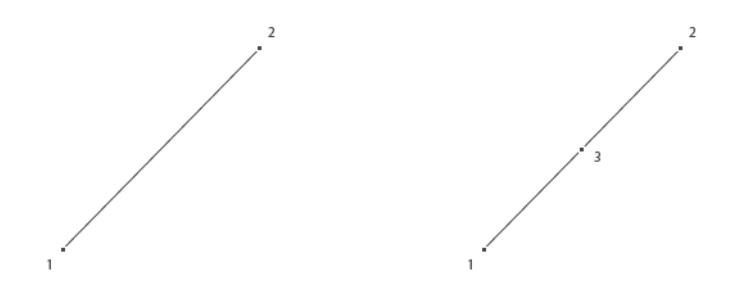

Triangular element (tri) as a first-order element (left) and a second-order element (right):

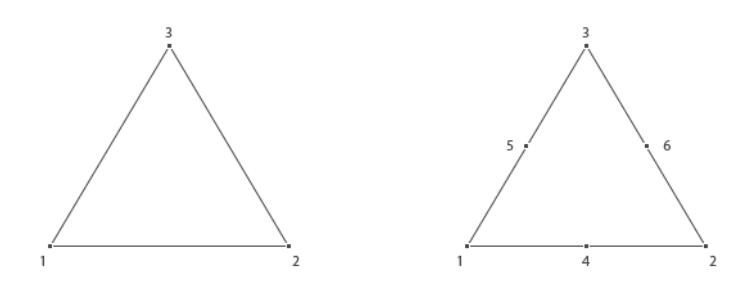

Quadrilateral element (quad) as a first-order element (left) and a second-order element (right):

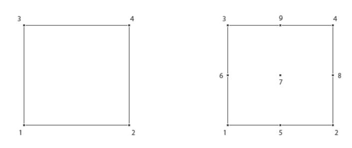

Tetrahedral element (tet) as a first-order element (left) and a second-order element (right):

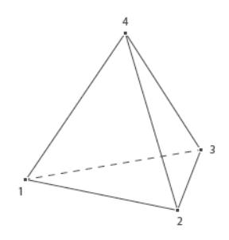

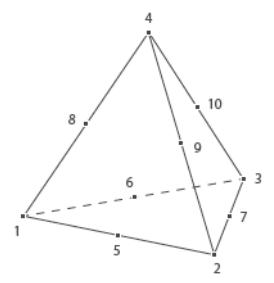

Pyramid element (pyr) as a first-order element (left) and a second-order element (right):

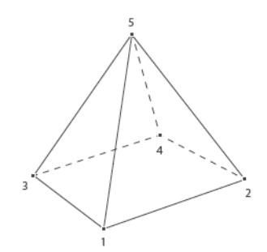

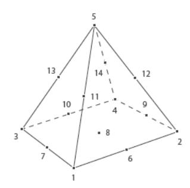

Prism element (prism) as a first-order element (left) and a second-order element (right):

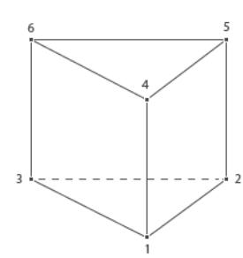

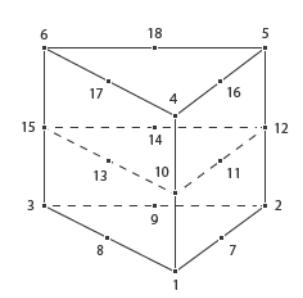

Hexahedral element (hex) as a first-order element (left) and a second-order element (right):

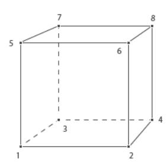

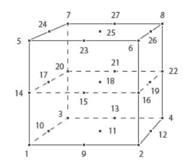

# Errors, Warnings, and Information

COMSOL Multiphysics treats problems encountered when building a meshing feature in two different ways depending on if it is possible to avoid the problem and continue the operation or if the operation must be stopped.

See also Errors and Warnings in the *General Commands* chapter.

# *Encountering Problems when Building the Mesh*

In most cases when you build a mesh feature that generates mesh and problems are detected on some geometric entities, those entities and adjacent entities are meshed if possible, otherwise they are left unprocessed. When the mesher fails to mesh some entities, the operation continues meshing the remaining entities and stores information about the encountered problems in the feature. A feature that encountered this type of problems during the build gets a warning status (but with error nodes). If you build several mesh features in a sequence, the build is not stopped by a feature that fails to process some of its entities. However, some errors are considered as fatal and therefore stop the build process. Failure to process one or more entities in some operation will always result in an issue exception when all specified features are built, even if the build process was not stopped directly.

# *Continue Meshing*

Use the continue property to control whether a meshing feature should avoid encountered problems and continue to mesh or if it should stop at the first encountered problem.

# *Operations Stopping if Errors*

When you build a feature other than any of the BndLayer, FreeTri, FreeQuad, FreeTet, Map, or Sweep features, the operation always stops if an error is encountered. This means that no changes are made to the mesh. The feature gets an error status and if it is part of a sequence build the build stops and the preceding feature becomes the current feature. Information on the error is stored in the feature. Refer to the section Retrieving Mesh Problem Information for more information on accessing this information.

## *Retrieving Mesh Problem Information*

There are three categories of problems that can appear in a meshing sequence: MeshInformation, MeshWarning, and MeshError features. They all contain a message describing the problem and can be equipped with a selection defining the geometric entities or coordinate values specifying a position related to the error. All of these features can have a subfeature of the same type that contains low-level problem information. This means that a problem can be represented by a stack of features that reflects the stack trace of the problem.

For more information about the severity of the problems and possible ways to fix them, see the section Information, Warning, and Error Nodes for Meshing Operations.

Use

```
boolean problem = model.component(<ctag>).mesh(<tag>).feature(<ftag>).hasProblems();
to find out if the feature <ftag> has any reported problems. There are similar methods, hasWarnings() and 
hasErrors(), for warnings and errors, respectively. The following method returns the tags of the problems as well 
as tags that refer to information:
```

```
String[] problemTags = model.component(<ctag>).mesh(<tag>).feature(<ftag>).problems();
Similarly, use the methods warnings() and errors() to get access to only warning and error tags, respectively.
```

The following two methods return the message and any entity selection of the problem *<ptag>*.

```
String problemMessage = model.component(<ctag>).mesh(<tag>).feature(<ftag>).
                         problem(<ptag>).message();
MeshSelection sel = model.component(<ctag>).mesh(<tag>).feature(<ftag>).
                         problem(<ptag>).selection();
```

To retrieve the full stack trace, repeat the above methods until all levels of reported problems have been accessed. See the section Retrieving Problem Information for an example of how to retrieve mesh warnings recursively.

## *Retrieving Information About the Latest Build*

The following methods are available to retrieve the information specific to the build of a mesh feature.

To see the COMSOL version number (and architecture) used for the latest build of the feature, use

```
String version = model.component(<ctag>).mesh(<tag>).feature(<ftag>).
                         buildComsolVersion();
```

To get access to the date and time of the last time a feature was built, enter

```
String date = model.component(<ctag>).mesh(<tag>).feature(<ftag>).buildDate();
```

For information specific to a particular feature, use

```
String info[] = model.component(<ctag>).mesh(<tag>).feature(<ftag>).buildInfo();
```

All above methods return empty strings if the feature has not yet been built. Use

```
int time = model.component(<ctag>).mesh(<tag>).feature(<ftag>).buildTime();
```

to get the time (in seconds) it took to build the feature the last time it was built. In case the feature has not been built, it will return -1. Enter

```
String output[][] = model.component(<ctag>).mesh(<tag>).feature(<ftag>).buildOutput();
```

to get an N-by-2 matrix with output information from the build. The matrix will be empty if the feature does not save output information or if the feature has not yet been built.

# Exporting Meshes to Files

## *Exporting Mesh to a File*

To export a mesh to a file, enter

model.component(*<ctag>*).mesh(*<tag>*).export(*<filename>*);

where *<filename>* is a string or a file location URI used to identify a file version in a Model Manager database. The file can be any of the following formats.

TABLE 4-8: VALID FILE FORMATS.

| FILE FORMAT                | NOTE | FILE EXTENSIONS            |
|----------------------------|------|----------------------------|
| COMSOL Multiphysics Binary |      | .mphbin                    |
| COMSOL Multiphysics Text   |      | .mphtxt                    |
| NASTRAN file               |      | .nas, .bdf, .nastran, .dat |
| STL Binary (3D)            | 1    | .stl                       |
| STL Text (3D)              | 1    | .stl                       |
| Sectionwise                |      | .txt                       |
| PLY Binary (3D)            | 2    | .ply                       |
| PLY Text (3D)              | 2    | .ply                       |
| 3MF (3D)                   |      | .3mf                       |

<sup>1</sup> Use model.mesh(*<tag>*).export().set("stlformat",*<format>*) to specify the STL file format ("binary" or "text")

# *Exporting Mesh to a COMSOL Multiphysics File*

To specify the dimensions of the elements to export or to choose to include or exclude the geometric entity information, enter

model.component(*<ctag>*).mesh(*<tag>*).export().set(*<property>,<value>*);

The following table lists the available properties:

| PROPERTY        | VALUE    | DEFAULT | DESCRIPTION                                                                         |
|-----------------|----------|---------|-------------------------------------------------------------------------------------|
| domelem         | on   off | on      | Specify if domain elements are exported.                                            |
| bndelem         | on   off | on      | Specify if boundary elements are exported.                                          |
| edgelem         | on   off | on      | Specify if edge elements are exported (3D only).                                    |
| vtxelem         | on   off | on      | Specify if vertex elements are exported (2D and 3D only).                           |
| geominfo        | on   off | on      | Specify if geometric entity information for each element is<br>exported.            |
| nativequadratic | on   off | off     | Specify if elements are exported as linear or second-order<br>(quadratic) elements. |
| selection       | on   off | off     | Specify if mesh selections are exported.                                            |

# *Exporting Mesh to a NASTRAN*® *File*

To specify the dimensions of the elements to export, to choose to include or exclude the geometric entity information, or to set the file field format or element order, enter

<sup>2</sup> Use model.mesh(*<tag>*).export().set("plyformat",*<format>*) to specify the PLY file format ("binary" or "text")

model.component(*<ctag>*).mesh(*<tag>*).export().set(*<property>,<value>*);

The following table lists the available properties:

TABLE 4-9: AVAILABLE NASTRAN MESH EXPORT PROPERTIES AND THEIR VALID VALUES.

| PROPERTY         | VALUE                | DEFAULT | DESCRIPTION                                                                         |
|------------------|----------------------|---------|-------------------------------------------------------------------------------------|
| solidelem        | on   off             | on      | Specify if domain elements are exported.                                            |
| shellelem        | on   off             | off     | Specify if boundary elements are exported (3D only).                                |
| geominfo_nastran | on   off             | on      | Specify if geometric entity information for each<br>element is exported.            |
| fieldformat      | small   large   free | large   | Specify file field format.                                                          |
| nastranquadratic | on   off             | on      | Specify if elements are exported as linear or<br>second-order (quadratic) elements. |

## *Exporting Mesh to a Sectionwise Format*

To specify the geometric entity level for the sectionwise format, use

model.component(*<ctag>*).mesh(*<tag>*).export().set(*<property>,<value>*);

The following table lists the available property:

TABLE 4-10: AVAILABLE COMSOL SECTIONWISE MESH EXPORT PROPERTY AND ITS VALID VALUES.

| PROPERTY | VALUE                    | DEFAULT | DESCRIPTION                        |
|----------|--------------------------|---------|------------------------------------|
| level    | domain   boundary   edge | domain  | Specify the geometry entity level. |

## *Exporting Mesh to a 3MF Format*

To specify the 3MF data to export on the 3MF format, use

model.component(*<ctag>*).mesh(*<tag>*).export().set(*<property>,<value>*);

The following table lists the available property:

TABLE 4-11: AVAILABLE 3MF MESH EXPORT PROPERTY AND ITS VALID VALUES.

| PROPERTY | VALUE             | DEFAULT  | DESCRIPTION                    |
|----------|-------------------|----------|--------------------------------|
| 3mfdata  | domain   boundary | boundary | Specify if the data to export. |

# Mesh Commands

The following list includes the available commands for creating and modifying meshes (listed in alphabetical order):

- **•** Adapt
- **•** AdjacentSelection
- **•** Ball
- **•** BndLayer
- **•** BndLayerProp
- **•** Box
- **•** CollapseEntities
- **•** Convert
- **•** CopyEdge
- **•** CopyFace
- **•** CopyDomain
- **•** Copy
- **•** CornerProp
- **•** CornerRefinement
- **•** CreateDomains
- **•** CreateEdges
- **•** CreateFaces
- **•** CreateVertices
- **•** Cylinder
- **•** DeleteEntities
- **•** DetectFaces
- **•** Distribution
- **•** Edge
- **•** EdgeGroup
- **•** EdgeMap
- **•** ExplicitSelection
- **•** FillHoles

- **•** FixedMesh
- **•** FreeQuad
- **•** FreeTet
- **•** FreeTri
- **•** IdenticalMesh
- **•** Import
- **•** Imprint
- **•** IntersectLine
- **•** IntersectPlane
- **•** JoinEntities
- **•** LogicalExpression
- **•** Map
- **•** MergeEntities
- **•** OnePointMap
- **•** Reference
- **•** Refine
- **•** RemeshDomains
- **•** RemeshEdges
- **•** RemeshFaces
- **•** Scale
- **•** Size
- **•** SizeExpression
- **•** Sweep
- **•** Transform
- **•** TwoPointMap
- **•** Union
- **•** Vertex

## *Adapt*

Set up an adaptive mesh refinement.

## **SYNTAX**

```
model.component(<ctag>).mesh(<tag>).create(<ftag>,"Adapt");
model.component(<ctag>).mesh(<tag>).feature(<ftag>).selection();
model.component(<ctag>).mesh(<tag>).feature(<ftag>).importData();
model.component(<ctag>).mesh(<tag>).feature(<ftag>).set(property,<value>);
model.component(<ctag>).mesh(<tag>).feature(<ftag>).getType(property);
```

## **DESCRIPTION**

Use model.component(*<ctag>*).mesh(*<tag>*).create(*<ftag>*,"Adapt") to set up a mesh adaptation based on some expressions and criteria. The adaptive mesh refinement feature is also available for imported meshing sequences.

Use model.component(*<ctag>*).mesh(*<tag>*).feature(*<ftag>*).selection() to specify geometric entities to perform adaptive mesh refinement in. If you do not specify the selection, the feature operates on the entire geometry.

To use an anisotropic metric for the type of expression to base the adaptive mesh refinement on, use the following code for a 2D anisotropic expression in the local mesh size h:

```
model.component(<ctag>).mesh(<tag>).feature(<ftag>).set("method", "modify");
model.component(<ctag>).mesh(<tag>).feature("ada1").set("exprtype", "metric");
model.component(<ctag>).mesh(<tag>).feature("ada1").
   set("metric", new String[][]{{"2/h", "0"}, {"0", "1/h"}});
```

You can use mesh.feature(*<ftag>*).importData() to rebuild the adapted mesh, taking an updated model into account.

The following properties are available.

TABLE 4-12: AVAILABLE PROPERTIES FOR ADAPT.

| PROPERTY        | VALUE                           | DEFAULT                                                                        | DESCRIPTION                                                                                                                                |
|-----------------|---------------------------------|--------------------------------------------------------------------------------|--------------------------------------------------------------------------------------------------------------------------------------------|
| adapsolnum      | Integer array (positive values) | 1                                                                              | Solution number indices, determining<br>which solutions in a parametric or<br>eigenvalue simulation to use for the<br>adaptation.          |
| allowcoarsening | on   off                        | on                                                                             | Controls if the mesh can be coarsened<br>by the general modification method<br>(that is, method set to modify).                            |
| elementspar     | Positive scalar                 | Empty                                                                          | Controls refinement if elselect =<br>elements.                                                                                             |
| elselect        | globalmin   worst  <br>elements | Empty                                                                          | Method to select elements to refine.                                                                                                       |
| errorexpr       | String                          | Empty                                                                          | Error expression.                                                                                                                          |
| exprtype        | size   error   metric           | error, if added in<br>a component and<br>a solution exists;<br>otherwise, size | Type of expression for the adaptive<br>mesh generation: an absolute size, an<br>error expression, or (2D and 3D) an<br>anisotropic metric. |
| facerep         | curved   linear                 | curved                                                                         | Specify face representation when<br>placing moved or new mesh vertices<br>for meshes that define their own<br>geometric models.            |
| globalminparam  | Positive scalar                 | Empty                                                                          | Controls refinement if elselect =<br>globalmin.                                                                                            |
| horder          | Double array                    | 0                                                                              | Error orders (see below).                                                                                                                  |
| maxcoarsening   | Positive integer                | 5                                                                              | The maximum coarsening factor (if<br>method is set to modify and<br>allowcoarsening is on).                                                |
| maxrefinement   | Positive integer                | 5                                                                              | The maximum number of mesh<br>refinements.                                                                                                 |

TABLE 4-12: AVAILABLE PROPERTIES FOR ADAPT.

| PROPERTY        | VALUE                                                 | DEFAULT                            | DESCRIPTION                                                                                                                                          |
|-----------------|-------------------------------------------------------|------------------------------------|------------------------------------------------------------------------------------------------------------------------------------------------------|
| method          | modify   regular   longest                            | longest                            | The refinement method for mesh<br>adaptation (general mesh modification,<br>regular refinement, or longest edge<br>refinement)                       |
| metric          | 2-by-2 (2D) or 3-by-3 (3D)<br>symmetric string matrix | {{"1/h",<br>"0"}, {"0",<br>"1/h"}} |                                                                                                                                                      |
| selection       | first   last   all   manual                           | last                               | Solution selection: the first or last<br>solution, a sum of the selection, or<br>manual, using weights and solution<br>number indices in adapsolnum. |
| sizeexpr        | String                                                | Empty                              | Mesh size expression.                                                                                                                                |
| solution        | String                                                | Empty                              | The tag of the solution defining the<br>mesh adaptation, or none to evaluate<br>on the input mesh.                                                   |
| updatecondition | A parameter name                                      | Empty                              | Name of a parameter used to trigger<br>an update.                                                                                                    |
| weights         | Double array (positive values)                        | 1.0                                | Weight for each selected solution.                                                                                                                   |
| worstpar        | Positive scalar                                       | Empty                              | Controls refinement if elselect =<br>worst.                                                                                                          |

The facerep property is only used for meshes that define their own geometric model. For example, when having an imported mesh. Use curved to place new or moved mesh vertices on a curved surface approximation of the input mesh. Use linear to place new or moved mesh vertices on the input mesh.

### **SEE ALSO**

Refine, SizeExpression

## *AdjacentSelection*

Define a selection of entities that are adjacent to a specified selection.

## **SYNTAX**

```
model.component(<ctag>).mesh(<tag>).create(<ftag>,"AdjacentSelection");
model.component(<ctag>).mesh(<tag>).feature(<ftag>).selection();
model.component(<ctag>).mesh(<tag>).feature(<ftag>).set(property,<value>);
model.component(<ctag>).mesh(<tag>).feature(<ftag>).getType(property);
```

## **DESCRIPTION**

Supported for meshes that define their own geometric model, such as imported meshes. For more information, see Geometric Model.

Use model.component(*<ctag>*).mesh(*<tag>*).create(*<ftag>*,"AdjacentSelection") to create a named selection for one or more entities.

Use model.component(*<ctag>*).mesh(*<tag>*).feature(*<ftag>*).selection() to specify the input entities for the selection. For information about specifying a named selection as input, see Selections.

The following properties are available:

TABLE 4-13: AVAILABLE PROPERTIES FOR ADJACENTSELECTION.

| PROPERTY     | VALUE                                                                                 | DEFAULT                       | DESCRIPTION                                                                                                                                           |
|--------------|---------------------------------------------------------------------------------------|-------------------------------|-------------------------------------------------------------------------------------------------------------------------------------------------------|
| angletol     | double                                                                                | 15                            | Angle tolerance for continuity evaluation. Used<br>when groupcontang is on.                                                                           |
| color        | none   custom   integer<br>between 1 and the number of<br>colors in the current theme | none                          | The color of the selection, either given as an<br>integer indicating a color in the color theme, or<br>as a custom color in the customcolor property. |
| customcolor  | RGB-triplet                                                                           | Next available<br>theme color | The color to use. Active when color is set to<br>custom.                                                                                              |
| groupcontang | on   off                                                                              | off                           | Specify to group faces (in 3D) or edges by<br>continuous tangent.                                                                                     |
| exterior     | on   off                                                                              | on                            | Include output entities that are exterior to the<br>union of the input selections.                                                                    |
| interior     | on   off                                                                              | off                           | Include output entities that are interior to the<br>union of the input selections.                                                                    |
| outputdim    | 0   1   2   3                                                                         | space<br>dimension - 1        | Dimension of entities in the output selection.                                                                                                        |
| selshow      | on   off                                                                              | on                            | Show selection in physics, materials, and so on.<br>For mesh parts, this option shows selection<br>outside the part.                                  |

#### **SEE ALSO**

ExplicitSelection

# *Ball*

Split geometric entities of an imported mesh by a ball.

#### **SYNTAX**

```
model.component(<ctag>).mesh(<tag>).create(<ftag>,"Ball");
model.component(<ctag>).mesh(<tag>).feature(<ftag>).selection();
model.component(<ctag>).mesh(<tag>).feature(<ftag>).set(property,<value>);
model.component(<ctag>).mesh(<tag>).feature(<ftag>).getType(property);
```

# **DESCRIPTION**

Use model.component(*<ctag>*).mesh(*<tag>*).create(*<ftag>*,"Ball") to split geometric entities of an imported 2D or 3D mesh by an element set defined by a ball.

Use model.component(*<ctag>*).mesh(*<tag>*).feature(*<ftag>*).selection() to specify geometric entities to split. If you do not specify the selection, the feature operates on the entire geometry.

The following properties are available:

TABLE 4-14: AVAILABLE PROPERTIES.

| PROPERTY  | VALUE                    | DEFAULT     | DESCRIPTION                            |
|-----------|--------------------------|-------------|----------------------------------------|
| condition | allvertices   somevertex | allvertices | Condition for inclusion of an element. |
| posx      | double                   | 0           | Center, first coordinate.              |
| posy      | double                   | 0           | Center, second coordinate.             |
| posz      | double                   | 0           | Center, third coordinate.              |
| r         | double                   | 1           | Radius.                                |

TABLE 4-14: AVAILABLE PROPERTIES.

| PROPERTY   | VALUE    | DEFAULT | DESCRIPTION                                           |
|------------|----------|---------|-------------------------------------------------------|
| selinside  | on   off | off     | Create selection of all entities inside the<br>ball.  |
| seloutside | on   off | off     | Create selection of all entities outside the<br>ball. |

TABLE 4-15: AVAILABLE ADDITIONAL PROPERTIES WHEN SELINSIDE AND SELOUTSIDE ARE SET TO ON.

| PROPERTY           | VALUE                                                                                    | DEFAULT                       | DESCRIPTION                                                                                                                                                            |
|--------------------|------------------------------------------------------------------------------------------|-------------------------------|------------------------------------------------------------------------------------------------------------------------------------------------------------------------|
| colorinside        | none   custom  <br>integer between 1 and<br>the number of colors<br>in the current theme | none                          | The color of the domain selection, either<br>given as an integer indicating a color in the<br>color theme, or as a custom color in the<br>customcolorinside property.  |
| coloroutside       | none   custom  <br>integer between 1 and<br>the number of colors<br>in the current theme | none                          | The color of the domain selection, either<br>given as an integer indicating a color in the<br>color theme, or as a custom color in the<br>customcoloroutside property. |
| customcolorinside  | RGB-triplet                                                                              | Next available<br>theme color | The color to use. Active when colorinside<br>is set to custom.                                                                                                         |
| customcoloroutside | RGB-triplet                                                                              | Next available<br>theme color | The color to use. Active when<br>coloroutside is set to custom.                                                                                                        |
| selinsideshow      | all   dom   bnd   pnt  <br>off                                                           | dom                           | Show the selection on the specified entity<br>level in physics, materials, and so on. For<br>mesh parts, this option shows selection<br>outside the part.              |
| seloutsideshow     | all   dom   bnd   pnt  <br>off                                                           | dom                           | Show the selection on the specified entity<br>level in physics, materials, and so on. For<br>mesh parts, this option shows selection<br>outside the part.              |

Import, Box, Cylinder, DetectFaces, LogicalExpression

## *BndLayer*

Create a boundary layer mesh. Supported for domains in 2D and 3D as well as for faces in 3D. For imported meshes, the domains must contain a mesh. Use FreeTet to fill unmeshed domains before creating a boundary layer mesh.

# **SYNTAX**

```
model.component(<ctag>).mesh(<tag>).create(<ftag>,"BndLayer");
model.component(<ctag>).mesh(<tag>).feature(<ftag>).selection();
model.component(<ctag>).mesh(<tag>).feature(<ftag>).set(property,<value>);
model.component(<ctag>).mesh(<tag>).feature(<ftag>).getType(property);
model.component(<ctag>).mesh(<tag>).feature(<ftag>).create(<ftag1>,"BndLayerProp");
```

See set(), setIndex(), and Methods Associated to Set, SetIndex, and the Various Get Methods for more information.

## **DESCRIPTION**

Use model.component(*<ctag>*).mesh(*<tag>*).create(*<ftag>*,"BndLayer") to create a boundary layer mesh in domains in 2D and 3D, and on faces in 3D.

Use model.component(*<ctag>*).mesh(*<tag>*).feature(*<ftag>*).selection() to specify the domain or boundary selection. If you do not specify the selection, the feature operates on all domains or on all boundaries depending on the selection dimension of the corresponding BndLayerProp attribute.

Use model.component(*<ctag>*).mesh(*<tag>*).feature(*<ftag>*).create(*<ftag1>*,"BndLayerProp") to add a BndLayerProp attribute feature defining the locations and properties of the boundary layers.

The feature reads properties from the BndLayerProp attribute feature.

The following properties are available:

TABLE 4-16: AVAILABLE PROPERTIES FOR BNDLAYER.

| PROPERTY         | VALUE                              | DEFAULT  | DESCRIPTION                                                                                                                                    |
|------------------|------------------------------------|----------|------------------------------------------------------------------------------------------------------------------------------------------------|
| sharpcorners     | none   split  <br>trim             | split    | Specifies the handling of sharp corners in 2D and<br>sharp edges in 3D.                                                                        |
| layerdec         | integer                            | 2        | Maximum difference in number of boundary layers<br>between neighboring points on boundary layer<br>boundaries. For all values of sharpcorners. |
| method           | latest  <br>legacy60  <br>legacy61 | latest   | Specify the boundary layer method to use.                                                                                                      |
| smoothtransition | on   off                           | on       | Specifies if the operation smooths the transition to<br>interior mesh.                                                                         |
| splitangle       | double                             | 240[deg] | Minimum angle between boundary layer boundaries<br>to introduce a boundary layer split. When<br>sharpcorners is split.                         |
| splitdivangle    | double                             | 100[deg] | Maximum angle per split. When sharpcorners is<br>split.                                                                                        |
| trimmaxangle     | double                             | 50[deg]  | Maximum angle for boundary layer trimming in<br>narrow corners. For all values of sharpcorners.                                                |
| trimminangle     | double                             | 240[deg] | Minimum angle between boundary layer boundaries<br>for boundary layer trimming. When<br>sharpcorners is trim.                                  |
| smoothmaxiter    | integer                            | 4        | Specifies the number of smoothing iterations.<br>When smoothtransition is on.                                                                  |
| smoothmaxdepth   | integer                            | 6        | Specifies the maximum element smoothing depth.<br>When smoothtransition is on.                                                                 |

## **EXAMPLES**

Insert boundary layers to an existing mesh containing both quadrilateral elements and triangular elements.

*Code for Use with Java*

```
Model model = ModelUtil.create("Model");
model.component().create("comp1");
GeomSequence g = model.component("comp1").geom().create("geom1", 2);
MeshSequence m = model.component("comp1").mesh().create("mesh1", "geom1");
g.create("sq1", "Square");
g.create("sq2", "Square");
g.feature("sq2").setIndex("pos", "1", 0);
g.create("c1", "Circle");
g.feature("c1").set("r", "0.2");
g.feature("c1").setIndex("pos", "1.5", 0);
g.feature("c1").setIndex("pos", "0.5", 1);
g.create("co1", "Compose");
g.feature("co1").selection("input").init().set(new String[]{"c1", "sq1", "sq2"});
g.feature("co1").set("formula", "sq1+sq2-c1");
```

```
g.run();
  m.create("map1", "Map");
  m.feature("map1").selection().geom("geom1", 2);
  m.feature("map1").selection().set(new int[]{1});
  m.create("ftri1", "FreeTri");
  m.create("bl1", "BndLayer");
  m.feature("bl1").create("blp", "BndLayerProp");
  m.feature("bl1").feature("blp").selection().set(new int[]{2, 3, 5, 6, 8, 9, 10, 11});
  m.run();
Code for Use with MATLAB
  model = ModelUtil.create('Model');
  model.component.create('comp1');
  g = model.component('comp1').geom.create('geom1', 2);
  m = model.component('comp1').mesh.create('mesh1', 'geom1');
  g.create('sq1', 'Square');
  g.create('sq2', 'Square');
  g.feature('sq2').setIndex('pos', '1', 0);
  g.create('c1', 'Circle');
  g.feature('c1').set('r', '0.2');
  g.feature('c1').setIndex('pos', '1.5', 0);
  g.feature('c1').setIndex('pos', '0.5', 1);
  g.create('co1', 'Compose');
  g.feature('co1').selection('input').init.set({'c1', 'sq1', 'sq2'});
  g.feature('co1').set('formula', 'sq1+sq2-c1');
  g.run;
  m.create('map1', 'Map');
  m.feature('map1').selection.geom('geom1', 2);
  m.feature('map1').selection.set(1);
  m.create('ftri1', 'FreeTri');
  m.create('bl1', 'BndLayer');
  m.feature('bl1').create('blp', 'BndLayerProp');
  m.feature('bl1').feature('blp').selection.set([2, 3, 5, 6, 8, 9, 10, 11]);
  m.run;
Create a boundary layer mesh consisting of prism elements along the boundary layer boundaries and tetrahedral 
elements in the interior:
Code for Use with Java
  Model model = ModelUtil.create("Model");
  model.component().create("comp1");
  GeomSequence g = model.component("comp1").geom().create("geom1", 3);
  MeshSequence m = model.component("comp1").mesh().create("mesh1", "geom1");
  g.create("blk1", "Block");
  g.feature("blk1").setIndex("size", "10", 0);
  g.feature("blk1").setIndex("size", "5", 1);
  g.feature("blk1").setIndex("size", "5", 2);
  g.create("sph1", "Sphere");
  g.feature("sph1").setIndex("pos", "3", 0);
  g.feature("sph1").setIndex("pos", "2.5", 1);
  g.feature("sph1").setIndex("pos", "2.5", 2);
  g.create("dif1", "Difference");
  g.feature("dif1").selection("input").init().set(new String[]{"blk1"});
  g.feature("dif1").selection("input2").init().set(new String[]{"sph1"});
  g.run();
  m.create("ftet1", "FreeTet");
  m.create("bl1", "BndLayer");
  m.feature("bl1").create("blp", "BndLayerProp");
  m.feature("bl1").feature("blp").selection().
   set(new int[]{2, 3, 4, 5, 6, 7, 8, 9, 10, 11, 12, 13});
```

```
m.run();
Code for Use with MATLAB
  model = ModelUtil.create('Model');
  model.component.create('comp1');
  g = model.component('comp1').geom.create('geom1', 3);
  m = model.component('comp1').mesh.create('mesh1', 'geom1');
  g.create('blk1', 'Block');
  g.feature('blk1').setIndex('size', '10', 0);
  g.feature('blk1').setIndex('size', '5', 1);
  g.feature('blk1').setIndex('size', '5', 2);
  g.create('sph1', 'Sphere');
  g.feature('sph1').setIndex('pos', '3', 0);
  g.feature('sph1').setIndex('pos', '2.5', 1);
  g.feature('sph1').setIndex('pos', '2.5', 2);
  g.create('dif1', 'Difference');
  g.feature('dif1').selection('input').init.set({'blk1'});
  g.feature('dif1').selection('input2').init.set({'sph1'});
  g.run;
  m.create('ftet1', 'FreeTet');
  m.create('bl1', 'BndLayer');
  m.feature('bl1').create('blp', 'BndLayerProp');
  m.feature('bl1').feature('blp').selection.set(2:13);
  m.run;
```

BndLayerProp, Map, Sweep

# *BndLayerProp*

Set the boundary layer meshing properties.

## **SYNTAX**

```
model.component(<ctag>).mesh(<tag>).feature(<ftag>).create(<ftag1>,"BndLayerProp");
model.component(<ctag>).mesh(<tag>).feature(<ftag>).feature(<ftag1>).selection();
model.component(<ctag>).mesh(<tag>).feature(<ftag>).feature(<ftag1>).
      set(property,<value>);
model.component(<ctag>).mesh(<tag>).feature(<ftag>).feature(<ftag1>).getType(property);
```

## **DESCRIPTION**

Use model.component(*<ctag>*).mesh(*<tag>*).feature(*<ftag>*).create(*<ftag1>*,"BndLayerProp") to define boundary layer properties for the BndLayer feature *<ftag>*.

Use model.component(*<ctag>*).mesh(*<tag>*).feature(*<ftag>*).feature(*<ftag1>*).selection() to specify the boundary or edge selection. If you do not specify the selection, it is empty.

The following properties are available:

TABLE 4-17: AVAILABLE PROPERTIES.

| PROPERTY   | VALUE                           | DEFAULT    | DESCRIPTION                                                                       |
|------------|---------------------------------|------------|-----------------------------------------------------------------------------------|
| blnlayers  | Integer                         | 8          | Number of boundary layers                                                         |
| blstretch  | Double                          | 1.2        | Boundary layer stretching factor                                                  |
| inittype   | blhminfact   blhmin  <br>blhtot | blhminfact | Specifies how the thickness of the boundary<br>layer mesh is calculated.          |
| blhminfact | Double                          | 1          | Factor used to adjust the default thickness.<br>Used when inittype is blhminfact. |

TABLE 4-17: AVAILABLE PROPERTIES.

| PROPERTY | VALUE  | DEFAULT | DESCRIPTION                                                                  |
|----------|--------|---------|------------------------------------------------------------------------------|
| blhmin   | Double |         | Thickness of first boundary layer. Used when<br>inittype is blhmin.          |
| blhtot   | Double |         | Total thickness of the boundary layer mesh.<br>Used when inittype is blhtot. |

The value of blnlayers is a positive integer scalar, or a string that evaluates to a positive integer.

The values of blhmin, blhminfact, blhtot, and blstretch are positive real scalars, or strings that evaluate to positive real scalars.

Use the properties blhmin, blstretch, and blnlayers to specify the distribution of the boundary layers. blhmin specifies the thickness of the initial boundary layer, blhtot specifies the total thickness of the boundary layer mesh, blstretch a stretching factor, and blnlayers the number of boundary layers. The thickness of the *m*th boundary layer (*m*=1 to blnlayers) is blstretch(*m*−1) blhmin*.* The number of boundary layers and the thickness of the boundary layers might be automatically reduced in thin regions.

The default values of blhmin and blhtot are determined from the specified element size in the sequence.

It is also possible to specify the thickness of the initial layer by using the blhminfact property. Use this property to specify a scaling factor that multiplies the thickness of the first boundary layer.

The property inittype determines which of blhminfact, blhmin, or blhtot that is used. You do not need to set it explicitly because the feature automatically changes it when you set one of blhminfact, blhmin, or blhtot.

## **SEE ALSO**

BndLayer, Scale, Size

## *Box*

Split geometric entities of an imported mesh by a box.

## **SYNTAX**

```
model.component(<ctag>).mesh(<tag>).create(<ftag>,"Box");
model.component(<ctag>).mesh(<tag>).feature(<ftag>).selection();
model.component(<ctag>).mesh(<tag>).feature(<ftag>).set(property,<value>);
model.component(<ctag>).mesh(<tag>).feature(<ftag>).getType(property);
```

## **DESCRIPTION**

Use model.component(*<ctag>*).mesh(*<tag>*).create(*<ftag>*,"Box") to split geometric entities of an imported 2D or 3D mesh by an element set defined by a box.

Use model.component(*<ctag>*).mesh(*<tag>*).feature(*<ftag>*).selection() to specify geometric entities to split. If you do not specify the selection, the feature operates on the entire geometry.

The following properties are available:

TABLE 4-18: AVAILABLE PROPERTIES.

| PROPERTY  | VALUE                    | DEFAULT     | DESCRIPTION                           |
|-----------|--------------------------|-------------|---------------------------------------|
| condition | allvertices   somevertex | allvertices | Condition for inclusion of an element |
| xmin      | double                   | -inf        | Minimum x-coordinate of box           |
| xmax      | double                   | inf         | Maximum x-coordinate of box           |
| ymin      | double                   | -inf        | Minimum y-coordinate of box           |
| ymax      | double                   | inf         | Maximum y-coordinate of box           |

TABLE 4-18: AVAILABLE PROPERTIES.

| PROPERTY   | VALUE    | DEFAULT | DESCRIPTION                                          |
|------------|----------|---------|------------------------------------------------------|
| zmin       | double   | -inf    | Minimum z-coordinate of box                          |
| zmax       | double   | inf     | Maximum z-coordinate of box                          |
| selinside  | on   off | off     | Create selection of all entities inside<br>the box.  |
| seloutside | on   off | off     | Create selection of all entities outside<br>the box. |

TABLE 4-19: AVAILABLE ADDITIONAL PROPERTIES WHEN SELINSIDE AND SELOUTSIDE ARE SET TO ON.

| PROPERTY           | VALUE                                                                                    | DEFAULT                       | DESCRIPTION                                                                                                                                                            |
|--------------------|------------------------------------------------------------------------------------------|-------------------------------|------------------------------------------------------------------------------------------------------------------------------------------------------------------------|
| colorinside        | none   custom  <br>integer between 1 and<br>the number of colors<br>in the current theme | none                          | The color of the domain selection, either<br>given as an integer indicating a color in the<br>color theme, or as a custom color in the<br>customcolorinside property.  |
| coloroutside       | none   custom  <br>integer between 1 and<br>the number of colors<br>in the current theme | none                          | The color of the domain selection, either<br>given as an integer indicating a color in the<br>color theme, or as a custom color in the<br>customcoloroutside property. |
| customcolorinside  | RGB-triplet                                                                              | Next available<br>theme color | The color to use. Active when colorinside<br>is set to custom.                                                                                                         |
| customcoloroutside | RGB-triplet                                                                              | Next available<br>theme color | The color to use. Active when<br>coloroutside is set to custom.                                                                                                        |
| selinsideshow      | all   dom   bnd   pnt  <br>off                                                           | dom                           | Show the selection on the specified entity<br>level in physics, materials, and so on. For<br>mesh parts, this option shows selection<br>outside the part.              |
| seloutsideshow     | all   dom   bnd   pnt  <br>off                                                           | dom                           | Show the selection on the specified entity<br>level in physics, materials, and so on. For<br>mesh parts, this option shows selection<br>outside the part.              |

Import, Ball, Cylinder, DetectFaces, LogicalExpression

## *CollapseEntities*

Collapse geometric entities of the mesh. The operation can collapse edges and boundaries smaller than a tolerance. If all boundaries around an unmeshed domain are collapsed, the domain will also be collapsed.

#### **SYNTAX**

```
model.component(<ctag>).mesh(<tag>).create(<ftag>,"CollapseEntities");
model.component(<ctag>).mesh(<tag>).feature(<ftag>).selection();
model.component(<ctag>).mesh(<tag>).feature(<ftag>).set(property,<value>);
model.component(<ctag>).mesh(<tag>).feature(<ftag>).getType(property);
```

#### **DESCRIPTION**

Use model.component(*<ctag>*).mesh(*<tag>*).create(*<ftag>*,"CollapseEntities") to collapse entities in 3D mesh. Supported input: entire geometry, boundaries, and edges.

The following properties are available:

TABLE 4-20: AVAILABLE PROPERTIES.

| PROPERTY   | VALUE                      | DEFAULT | DESCRIPTION                                               |
|------------|----------------------------|---------|-----------------------------------------------------------|
| sizetype   | auto   relative   absolute | auto    | Specifies the type of maximum size.                       |
| maxabssize | double                     |         | Specifies the absolute size when sizetype is<br>absolute. |
| maxrelsize | double                     | 0.01    | Specifies the relative size when sizetype is<br>relative. |

#### **SEE ALSO**

MergeEntities, JoinEntities, DeleteEntities, Import

# *Convert*

Convert a mesh to a simplex mesh.

#### **SYNTAX**

```
model.component(<ctag>).mesh(<tag>).create(<ftag>,"Convert");
model.component(<ctag>).mesh(<tag>).feature(<ftag>).selection();
model.component(<ctag>).mesh(<tag>).feature(<ftag>).set(property,<value>);
model.component(<ctag>).mesh(<tag>).feature(<ftag>).getType(property);
```

## **DESCRIPTION**

Use model.component(*<ctag>*).mesh(*<tag>*).create(*<ftag>*,"Convert") to convert nonsimplex elements in a 2D or 3D mesh to simplex elements, that is, triangles and tetrahedra. The convert feature is also available for imported meshing sequences.

Use model.component(*<ctag>*).mesh(*<tag>*).feature(*<ftag>*).selection() to specify the domain or face selection. If you do not specify the selection the feature converts all quadrilateral, pyramidal, prismatic, and hexahedral elements in the mesh.

The following properties are available:

TABLE 4-21: AVAILABLE PROPERTIES.

| PROPERTY    | VALUE             | DEFAULT  | DESCRIPTION                                             |
|-------------|-------------------|----------|---------------------------------------------------------|
| splitmethod | diagonal   center | diagonal | Split method for quadrilateral and hexahedral elements. |

Use the property splitmethod to specify how to split quadrilateral and hexahedral elements into triangular and tetrahedral elements, respectively. Use the diagonal option to split each quadrilateral element into two triangular elements and each hexahedral element into five tetrahedral element. Use the center option to split each quadrilateral element into four triangular elements and each hexahedral element into 28 tetrahedral elements. The conversion also affects quadrilateral elements on the boundaries of the specified domains in 3D, which are converted into two triangular elements (when the option diagonal is used) or four triangular elements (when the option center is used).

### **EXAMPLES**

Create a mapped quad mesh on a unit rectangle and convert each quadrilateral element into four triangular elements:

```
Code for Use with Java
```

```
Model model = ModelUtil.create("Model");
model.component().create("comp1");
GeomSequence g = model.component("comp1").geom().create("geom1", 2);
MeshSequence m = model.component("comp1").mesh().create("mesh1", "geom1");
```

```
g.create("r1", "Rectangle");
  g.run();
  m.create("map1", "Map");
  m.create("conv1", "Convert");
  m.run();
Code for Use with MATLAB
  model = ModelUtil.create('Model');
  model.component.create('comp1');
  g = model.component('comp1').geom.create('geom1', 2);
  m = model.component('comp1').mesh.create('mesh1', 'geom1');
  g.create('r1', 'Rectangle');
  g.run;
  m.create('map1', 'Map');
  m.create('conv1', 'Convert');
  m.run;
Create a prism mesh and then convert each prism into three tetrahedral elements:
Code for Use with Java
  Model model = ModelUtil.create("Model");
  model.component().create("comp1");
  GeomSequence g = model.component("comp1").geom().create("geom1", 3);
  MeshSequence m = model.component("comp1").mesh().create("mesh1", "geom1");
  g.create("blk1", "Block");
  g.run();
  m.create("ftri1", "FreeTri");
  m.feature("ftri1").selection().set(new int[]{1});
  m.create("swe1", "Sweep");
  m.create("conv1", "Convert");
  m.run();
Code for Use with MATLAB
  model = ModelUtil.create('Model');
  model.component.create('comp1');
  g = model.component('comp1').geom.create('geom1', 3);
  m = model.component('comp1').mesh.create('mesh1', 'geom1');
  g.create('blk1', 'Block');
  g.run;
  m.create('ftri1', 'FreeTri');
  m.feature('ftri1').selection().set(1);
  m.create('swe1', 'Sweep');
  m.create('conv1', 'Convert');
  m.run;
SEE ALSO
BndLayer, Map, Refine, Sweep
CopyEdge
```

Copy an edge mesh to copy meshes on edges.

#### **SYNTAX**

```
model.component(<ctag>).mesh(<tag>).create(<ftag>,"CopyEdge");
model.component(<ctag>).mesh(<tag>).feature(<ftag>).selection(property);
model.component(<ctag>).mesh(<tag>).feature(<ftag>).set(property,<value>);
model.component(<ctag>).mesh(<tag>).feature(<ftag>).getType(property);
```

#### **DESCRIPTION**

Use model.component(*<ctag>*).mesh(*<tag>*).create(*<ftag>*,"CopyEdge") to copy mesh between edges in a 2D or 3D geometry.

The following properties are available:

TABLE 4-22: AVAILABLE PROPERTIES FOR COPYEDGE.

| PROPERTY       | VALUE                         | DEFAULT | DESCRIPTION                                                                     |
|----------------|-------------------------------|---------|---------------------------------------------------------------------------------|
| copymethod     | auto   singlecopy   arraycopy | auto    | Type of copy operation.                                                         |
| direction      | auto   same   opposite        | auto    | Direction of the copied mesh.                                                   |
| source         | Selection                     | Empty   | Source edges.                                                                   |
| destination    | Selection                     | Empty   | Destination edges.                                                              |
| smoothcontrol  | on   off                      | on      | Specifies if the operation smooths the mesh<br>across removed control entities. |
| smoothmaxdepth | integer                       | 4       | Specifies the maximum element smoothing<br>depth.                               |
| smoothmaxiter  | integer                       | 4       | Specifies the number of smoothing iterations.                                   |

Use the properties source and destination to specify the source and destination edges. The copymethod property determines which type of copy is used: single copy (all-to-one), array copy (one-to-one), or automatic detection. The value auto lets the software choose between single copy (all-to-one), array copy (one-to-one), or a mixture of the two. The direction property controls the orientation of the copied mesh, and is relative the direction of the source edge with smallest number and the direction of the destination edge.

Copying a mesh is only possible if the destination edge is not adjacent to a meshed domain. The copy feature overwrites any existing mesh on the destination edge.

## **EXAMPLE**

Mesh Edge 1 and copy the mesh to Edges 2, 3, and 4.

```
Code for Use with Java
  Model model = ModelUtil.create("Model");
  model.component().create("comp1");
  GeomSequence g = model.component("comp1").geom().create("geom1", 2);
  MeshSequence m = model.component("comp1").mesh().create("mesh1", "geom1");
  g.create("sq1", "Square");
  g.run();
  m.create("edg1", "Edge");
  m.feature("edg1").selection().set(new int[]{1});
  m.create("cpe1", "CopyEdge");
  m.feature("cpe1").selection("source").set(new int[]{1});
  m.feature("cpe1").selection("destination").set(new int[]{2, 3, 4});
  m.run();
Code for Use with MATLAB
  model = ModelUtil.create('Model');
  model.component.create('comp1');
  g = model.component('comp1').geom.create('geom1', 2);
  m = model.component('comp1').mesh.create('mesh1', 'geom1');
```

```
g.create('sq1', 'Square');
g.run;
m.create('edg1', 'Edge');
m.feature('edg1').selection().set(1);
m.create('cpe1', 'CopyEdge');
m.feature('cpe1').selection('source').set(1);
m.feature('cpe1').selection('destination').set(2:4);
m.run;
```

IdenticalMesh, CopyFace, CopyDomain, Copy

# *CopyFace*

Copy a face mesh to copy meshes on faces using a rigid body transformation with a scale factor. Use the attributes EdgeMap, OnePointMap, TwoPointMap to control the orientation of the source mesh on the destination.

## **SYNTAX**

```
model.component(<ctag>).mesh(<tag>).create(<ftag>,"CopyFace");
model.component(<ctag>).mesh(<tag>).feature(<ftag>).selection(property);
model.component(<ctag>).mesh(<tag>).feature(<ftag>).create(<ftag1>,maptype);
```

## **DESCRIPTION**

Use model.component(*<ctag>*).mesh(*<tag>*).create(*<ftag>*,"CopyFace") to copy mesh between faces in a 3D geometry.

If you want to specify the orientation of the source mesh on the destination, use model.component(*<ctag>*).mesh(*<tag>*).feature(*<ftag>*).create(*<ftag1>*,*maptype*) to add an EdgeMap, OnePointMap, or TwoPointMap attribute feature.

The following properties are available:

TABLE 4-23: AVAILABLE PROPERTIES FOR COPYFACE

| PROPERTY       | VALUE                         | DEFAULT | DESCRIPTION                                                                     |
|----------------|-------------------------------|---------|---------------------------------------------------------------------------------|
| copymethod     | auto   singlecopy   arraycopy | auto    | Type of copy operation.                                                         |
| source         | Selection                     | Empty   | Source boundaries.                                                              |
| destination    | Selection                     | Empty   | Destination boundary.                                                           |
| smoothcontrol  | on   off                      | on      | Specifies if the operation smooths the mesh<br>across removed control entities. |
| smoothmaxiter  | integer                       | 4       | Specifies the number of smoothing iterations.                                   |
| smoothmaxdepth | integer                       | 4       | Specifies the maximum element smoothing<br>depth.                               |

Use the properties source and destination to specify the source and destination boundaries. The copymethod property determines which type of copy is used: single copy (all-to-one), array copy (one-to-one), or automatic detection. The value auto lets the software choose between single copy (all-to-one), array copy (one-to-one), or a mixture of the two.

## **EXAMPLE**

Mesh Face 1 of a block and copy the mesh to the opposite Face 6.

```
Code for Use with Java
  Model model = ModelUtil.create("Model");
  model.component().create("comp1");
```

```
GeomSequence g = model.component("comp1").geom().create("geom1", 3);
  MeshSequence m= model.component("comp1").mesh().create("mesh1", "geom1");
  g.create("blk1", "Block");
  g.run();
  m.create("ftri1", "FreeTri");
  m.feature("ftri1").selection().set(new int[]{1});
  m.create("cpf1", "CopyFace");
  m.feature("cpf1").selection("source").set(new int[]{1});
  m.feature("cpf1").selection("destination").set(new int[]{6});
  m.run();
Code for Use with MATLAB
  model = ModelUtil.create('Model');
  model.component.create('comp1');
  g = model.component('comp1').geom.create('geom1', 3);
  m = model.component('comp1').mesh.create('mesh1', 'geom1');
  g.create('blk1', 'Block');
  g.run;
  m.create('ftri1', 'FreeTri');
  m.feature('ftri1').selection().set(1);
  m.create('cpf1', 'CopyFace');
  m.feature('cpf1').selection('source').set(1);
  m.feature('cpf1').selection('destination').set(6);
  m.run;
```

IdenticalMesh, CopyEdge, CopyDomain, Copy, EdgeMap, OnePointMap, TwoPointMap

## *CopyDomain*

Copy a domain mesh to copy meshes on domains using a rigid body transformation with a scale factor. Use the attributes EdgeMap, OnePointMap, TwoPointMap to control the orientation of the source mesh on the destination.

## **SYNTAX**

```
model.component(<ctag>).mesh(<tag>).create(<ftag>,"CopyDomain");
model.component(<ctag>).mesh(<tag>).feature(<ftag>).selection(property);
model.component(<ctag>).mesh(<tag>).feature(<ftag>).create(<ftag1>,maptype);
```

# **DESCRIPTION**

Use model.component(*<ctag>*).mesh(*<tag>*).create(*<ftag>*,"CopyDomain") to copy mesh between domains in a 2D or 3D geometry.

If you want to specify the orientation of the source mesh on the destination, use model.component(*<ctag>*).mesh(*<tag>*).feature(*<ftag>*).create(*<ftag1>*,*maptype*) to add an EdgeMap, OnePointMap, or TwoPointMap attribute feature.

The following properties are available:

TABLE 4-24: AVAILABLE PROPERTIES FOR COPYDOMAIN.

| PROPERTY    | VALUE                         | DEFAULT | DESCRIPTION             |
|-------------|-------------------------------|---------|-------------------------|
| copymethod  | auto   singlecopy   arraycopy | auto    | Type of copy operation. |
| source      | Selection                     | Empty   | Source domains.         |
| destination | Selection                     | Empty   | Destination domains.    |

TABLE 4-24: AVAILABLE PROPERTIES FOR COPYDOMAIN.

| PROPERTY       | VALUE    | DEFAULT | DESCRIPTION                                                                     |
|----------------|----------|---------|---------------------------------------------------------------------------------|
| smoothcontrol  | on   off | on      | Specifies if the operation smooths the mesh<br>across removed control entities. |
| smoothmaxiter  | integer  | 4       | Specifies the number of smoothing iterations.                                   |
| smoothmaxdepth | integer  | 4       | Specifies the maximum element smoothing<br>depth.                               |

Use the properties source and destination to specify the source and destination boundaries. The copymethod property determines which type of copy is used: single copy (all-to-one), array copy (one-to-one), or automatic detection. The value auto lets the software choose between single copy (all-to-one), array copy (one-to-one), or a mixture of the two.

#### **EXAMPLE**

Mesh block 1 and copy the mesh to block 2.

```
Code for Use with Java
  Model model = ModelUtil.create("Model");
  model.component().create("comp1");
  GeomSequence g = model.component("comp1").geom().create("geom1", 3);
  MeshSequence m = model.component("comp1").mesh().create("mesh1", "geom1");
  g.create("blk1", "Block");
  g.create("blk2", "Block");
  g.feature("blk2").setIndex("pos", "2", 0);
  g.run();
  m.create("ftet1", "FreeTet");
  m.feature("ftet1").selection().set(new int[]{1});
  m.create("cpd1", "CopyDomain");
  m.feature("cpd1").selection("source").set(new int[]{1});
  m.feature("cpd1").selection("destination").set(new int[]{2});
  m.run();
Code for Use with MATLAB
  model = ModelUtil.create('Model');
  model.component.create('comp1');
  g = model.component('comp1').geom.create('geom1', 3);
  m = model.component('comp1').mesh.create('mesh1', 'geom1');
  g.create('blk1', 'Block');
  g.create('blk2', 'Block');
  g.feature('blk2').setIndex('pos', '2', 0);
  g.run;
  m.create('ftet1', 'FreeTet');
  m.feature('ftet1').selection().set(1);
  m.create('cpd1', 'CopyDomain');
  m.feature('cpd1').selection('source').set(1);
  m.feature('cpd1').selection('destination').set(2);
  m.run;
```

# **SEE ALSO**

IdenticalMesh, CopyEdge, CopyFace, Copy, EdgeMap, OnePointMap, TwoPointMap

Copy a mesh between edges, boundaries, domains, or between different meshing sequences. In 2D and 3D, use the attributes EdgeMap, OnePointMap, TwoPointMap to control the orientation of the source mesh on the destination.

## **SYNTAX**

```
model.component(<ctag>).mesh(<tag>).create(<ftag>,"Copy");
model.component(<ctag>).mesh(<tag>).feature(<ftag>).selection(property);
model.component(<ctag>).mesh(<tag>).feature(<ftag>).create(<ftag1>,maptype);
```

## **DESCRIPTION**

Use model.component(*<ctag>*).mesh(*<tag>*).create(*<ftag>*,"Copy") to copy a mesh between meshing sequences. Any meshing sequence can be used as the source of the operation, whereas the destination sequence cannot contain an imported mesh. The dimension of the source sequence must be less than or equal to the dimension of the destination sequence.

The following properties are available (for 1D meshes, only the mesh property is available):

TABLE 4-25: AVAILABLE PROPERTIES FOR COPY.

| PROPERTY       | VALUE                         | DEFAULT                               | DESCRIPTION                                                                                    |
|----------------|-------------------------------|---------------------------------------|------------------------------------------------------------------------------------------------|
| mesh           | String   none                 | Native<br>sequence<br>(none in<br>1D) | Specifies the source mesh.                                                                     |
| copymethod     | auto   singlecopy   arraycopy | auto                                  | Type of copy operation.                                                                        |
| dimension      | all, 1, 2, or 3 (in 3D)       | 2 in 2D,<br>3 in 3D                   | Specifies the dimension for the operation. all<br>means that the entire mesh should be copied. |
| source         | Selection                     | Empty                                 | Specifies the selection of source entities.                                                    |
| buildsource    | on   off                      | off                                   | Build source mesh automatically.                                                               |
| destination    | Selection                     | Empty                                 | Specifies the selection of destination entities.                                               |
| smoothcontrol  | on   off                      | on                                    | Specifies if the operation smooths the mesh<br>across removed control entities.                |
| smoothmaxiter  | integer                       | 4                                     | Specifies the number of smoothing iterations.                                                  |
| smoothmaxdepth | integer                       | 4                                     | Specifies the maximum element smoothing<br>depth.                                              |

Use the properties source and destination to specify the geometric entities of the source and destination (except when the dimension is set to copy the entire geometry). The copymethod property determines which type of copy is used: single copy (all-to-one), array copy (one-to-one), or automatic detection. The value auto lets the software choose between single copy (all-to-one), array copy (one-to-one), or a mixture of the two.

## **EXAMPLE**

The following example shows how to use the Copy feature with a modified geometry from an imported mesh:

```
Code for Use with Java
  Model model = ModelUtil.create("Model");
  model.component().create("comp1");
  GeomSequence geom1 = model.component("comp1").geom().create("geom1", 2);
  geom1.create("c1", "Circle");
  MeshSequence mesh1 = model.component("comp1").mesh().create("mesh1", "geom1");
  mesh1.run();
  model.component().create("comp2");
```

```
GeomSequence geom2 = model.component("comp2").geom().create("geom2", 2);
  GeomFeature imp1 = geom2.create("imp1", "Import");
  imp1.set("type", "mesh");
  imp1.set("mesh", "mesh1");
  GeomFeature r1 = geom2.create("r1", "Rectangle");
  r1.set("size", new String[]{"3", "3"});
  r1.set("base", "center");
  MeshSequence mesh2 = model.component("comp2").mesh().create("mesh2", "geom2");
  MeshFeature copy1 = mesh2.create("copy1", "Copy");
  copy1.set("mesh", "mesh1");
  copy1.set("dimension", 2);
  copy1.selection("source").set(1);
  copy1.selection("destination").set(2);
  mesh2.run();
Code for Use with MATLAB
  model = ModelUtil.create('Model');
  model.component.create('comp1');
  geom1 = model.component('comp1').geom.create('geom1', 2);
  geom1.create('c1', 'Circle');
  mesh1 = model.component('comp1').mesh.create('mesh1', 'geom1');
  mesh1.run;
  model.component.create('comp2');
  geom2 = model.component('comp2').geom.create('geom2', 2);
  imp1 = geom2.create('imp1', 'Import');
  imp1.set('type', 'mesh');
  imp1.set('mesh', 'mesh1');
  r1 = geom2.create('r1', 'Rectangle');
  r1.set('size', {'3', '3'});
  r1.set('base', 'center');
  mesh2 = model.component('comp2').mesh.create('mesh2', 'geom2');
  copy1 = mesh2.create('copy1', 'Copy');
  copy1.set('mesh', 'mesh1');
  copy1.set('dimension', 2);
  copy1.selection('source').set(1);
  copy1.selection('destination').set(2);
  mesh2.run;
```

IdenticalMesh, CopyEdge, CopyFace, CopyDomain, EdgeMap, OnePointMap, TwoPointMap

## *CornerProp*

To override the corner settings of BndLayer for a selection of corners.

#### **SYNTAX**

```
model.component(<ctag>).mesh(<tag>).feature(<ftag>).create(<ftag1>,"CornerProp");
model.component(<ctag>).mesh(<tag>).feature(<ftag>).feature(<ftag1>).selection();
model.component(<ctag>).mesh(<tag>).feature(<ftag>).feature(<ftag1>).
  set(property,<value>);
model.component(<ctag>).mesh(<tag>).feature(<ftag>).feature(<ftag1>).getType(property);
```

#### **DESCRIPTION**

Use model.component(*<ctag>*).mesh(*<tag>*).feature(*<ftag>*).create(*<ftag1>*,"CornerProp") to override the corner settings for the feature *<ftag>* that can be of the type BndLayer.

Use model.component(*<ctag>*).mesh(*<tag>*).feature(*<ftag>*).feature(*<ftag1>*).selection() to specify the vertex selection in 2D and the vertex or edge selection in 3D. The selection is empty by default.

The following properties are available:

TABLE 4-26: VALID PROPERTIES.

| NAME              | VALUE                  | DEFAULT | DESCRIPTION                                                                                                                                                                             |
|-------------------|------------------------|---------|-----------------------------------------------------------------------------------------------------------------------------------------------------------------------------------------|
| cornerhandling    | trim   split  <br>none | trim    | Specify how to handle sharp corners for vertices in 2D<br>and edges in 3D.                                                                                                              |
| cornerhandlingvtx | trim   none            | trim    | Specify how to handle sharp corners for vertices in 3D.<br>Used if the parent BndLayer feature has a domain<br>selection.                                                               |
| splitcondition    | on   off               | off     | Specify if to use an angle condition for the split. Used if<br>cornerhandling is split. Not supported for vertices<br>in 3D when the parent BndLayer feature has a domain<br>selection. |
| splitdivangle     | double                 | 100     | Maximum angle for split. Used if cornerhandling is<br>split.                                                                                                                            |
| splitminangle     | double                 | 240     | Split for angles greater than specified value. Used if<br>splitcondition is on.                                                                                                         |
| trimcondition     | on   off               | off     | Specify if to use angle conditions for the trimming. Used if<br>cornerhandling is trim. Not supported for vertices in<br>3D when the parent BndLayer feature has a domain<br>selection. |
| trimmaxangle      | double                 | 50      | Trim for angles less than specified value. Used if<br>trimcondition is on.                                                                                                              |
| trimminangle      | double                 | 240     | Trim for angles greater than specified value. Used if<br>trimcondition is on.                                                                                                           |

It can be useful to filter out the corners of CornerProp in a CornerRefinement feature to either include them in the refinement if trim is used, or to exclude them if split or none is used.

# **SEE ALSO**

BndLayer, BndLayerProp, CornerRefinement

## *CornerRefinement*

Decrease element size at sharp corners.

## **SYNTAX**

```
model.component(<ctag>).mesh(<tag>).create(<ftag>,"CornerRefinement");
model.component(<ctag>).mesh(<tag>).feature(<ftag>).selection();
model.component(<ctag>).vmesh(<tag>).feature(<ftag>).selection(property);
model.component(<ctag>).mesh(<tag>).feature(<ftag>).set(property,<value>);
model.component(<ctag>).mesh(<tag>).feature(<ftag>).getType(property);
model.component(<ctag>).mesh(<tag>).feature(<ftag>).create(<ftag1>,"CornerRefinement");
model.component(<ctag>).mesh(<tag>).feature(<ftag>).feature(<ftag1>).selection();
model.component(<ctag>).mesh(<tag>).feature(<ftag>).feature(<ftag1>).selection(property);
model.component(<ctag>).mesh(<tag>).feature(<ftag>).feature(<ftag1>).
  set(property,<value>);
model.component(<ctag>).mesh(<tag>).feature(<ftag>).feature(<ftag1>).getType(property);
```

# **DESCRIPTION**

Use model.component(*<ctag>*).mesh(*<tag>*).create(*<ftag>*,"CornerRefinement") to decrease the element size defined in the sequence at vertices in 2D and edges in 3D that define a sharp corner. Use model.component(*<ctag>*).mesh(*<tag>*).feature(*<ftag>*).create(*<ftag1>*,"CornerRefinement") to decrease the element size for the feature *<ftag>* that can be any of the types Edge, FreeQuad, FreeTri, or FreeTet.

Use model.component(*<ctag>*).mesh(*<tag>*).feature(*<ftag>*).selection() or model.component(*<ctag>*).mesh(*<tag>*).feature(*<ftag>*).feature(*<ftag1>*).selection() to specify the domain selection. If you do not specify any selection, the feature is defined on the entire geometry.

Use model.component(*<ctag>*).mesh(*<tag>*).feature(*<ftag>*).selection("corner").set() to specify a selection of corners to include or exclude from the automatic selection of corners.

The following properties are available:

TABLE 4-27: VALID PROPERTIES.

| NAME       | VALUE             | DEFAULT                   | DESCRIPTION                                                                             |
|------------|-------------------|---------------------------|-----------------------------------------------------------------------------------------|
| boundary   | Selection         |                           | Boundary selection.                                                                     |
| corner     | Selection         |                           | Corners to include or exclude.                                                          |
| filter     | include   exclude |                           | Exclude or include only selected corners.                                               |
| minangle   | double            | 240 [deg]                 | Minimum angle between two boundaries (sharp corner) for<br>decreasing the element size. |
| refinement | double            | 0.25 in 2D,<br>0.35 in 3D | Factor multiplying the element size at sharp corners. The<br>valid range is [0 1].      |
| usefilter  | on   off          | off                       | Filter implicitly defined corners.                                                      |

#### **SEE ALSO**

BndLayer, BndLayerProp, CornerProp

# *CreateDomains*

Create a domain for each (connected) finite void region that is defined by a 3D mesh that defines its own geometric model, such as an imported mesh. For more information, see Geometric Model.

## **SYNTAX**

model.component(*<ctag>*).mesh(*<tag>*).create(*<ftag>*,"CreateDomains");

## **DESCRIPTION**

Use model.component(*<ctag>*).mesh(*<tag>*).create(*<ftag>*,"CreateDomains") to creates a domain for each (connected) finite void region that is defined by an imported 3D mesh. There are no additional selections or properties for the CreateDomains operation.

TABLE 4-28: VALID PROPERTIES

| PROPERTY       | VALUE                                                                                    | DEFAULT                       | DESCRIPTION                                                                                                                                                                              |
|----------------|------------------------------------------------------------------------------------------|-------------------------------|------------------------------------------------------------------------------------------------------------------------------------------------------------------------------------------|
| colordom       | none   custom  <br>integer between 1 and<br>the number of colors<br>in the current theme | none                          | The color of the domain selection, either given as an<br>integer indicating a color in the color theme, or as a<br>custom color in the customcolordom property.<br>Used if seldom is on. |
| customcolordom | RGB-triplet                                                                              | Next available<br>theme color | The color to use. Active when colordom is set to<br>custom.                                                                                                                              |
| seldom         | on   off                                                                                 | on                            | Specifies if to create a selection of resulting<br>domains.                                                                                                                              |
| seldomshow     | on   off                                                                                 | on                            | Show domain selection in physics, materials, and so<br>on. For mesh parts, this option shows selection<br>outside the part. Used if seldom is on.                                        |

Import, CreateEdges, CreateFaces, CreateVertices

## *CreateEdges*

Create geometrical edges of a selection of mesh edges or between two vertices.

#### **SYNTAX**

```
model.component(<ctag>).mesh(<tag>).create(<ftag>,"CreateEdges");
model.component(<ctag>).mesh(<tag>).feature(<ftag>).selection();
model.component(<ctag>).mesh(<tag>).feature(<ftag>).set(property,<value>);
model.component(<ctag>).mesh(<tag>).feature(<ftag>).getType(property);
```

#### **DESCRIPTION**

Use model.component(*<ctag>*).mesh(*<tag>*).create(*<ftag>*,"CreateEdges") to create additional edges in a mesh that defines its own geometric model. For more information, see Geometric Model.

Choose between creating new meshed edges between vertices or converting existing mesh edges into edge elements. In the general case, converting mesh edges is most easily done by clicking in the Graphics window, as the midpoint coordinates must be exact.

When specifying start/end vertices, specify the size distribution in four different ways: by specifying the number of elements only, by specifying the maximum element size, by specifying the element distribution explicitly, or by specifying the number of elements together with properties determining the distribution of the elements. The property type determines which of the four alternatives you want to use.

The following properties are available:

TABLE 4-29: AVAILABLE PROPERTIES FOR CREATEEDGES.

| PROPERTY     | VALUE                                    | DEFAULT  | DESCRIPTION                                                                                                                             |
|--------------|------------------------------------------|----------|-----------------------------------------------------------------------------------------------------------------------------------------|
| edgespec     | vertices   meshedge                      | vertices | Specifies how to create edges. Either give<br>selections of start/end vertices, or give exact<br>coordinates of a mesh edge's midpoint. |
| start        | Selection                                |          | Starting vertices to create edges from when<br>edgespec is vertices.                                                                    |
| end          | Selection                                |          | End vertices to create edges to when<br>edgespec is vertices.                                                                           |
| type         | size   number  <br>explicit   predefined | size     | Size distribution type when edgespec is<br>vertices.                                                                                    |
| coordsel     | double[][]                               | {}       | Enter exact midpoint coordinates of mesh<br>edge when edgespec is meshedges.                                                            |
| groupcontang | on   off                                 | off      | Specifies if a selection of a mesh edge is<br>propagated to tangent edges. Used if<br>edgespec is meshedge.                             |
| angletol     | double                                   | 10       | Specifies which mesh edges are considered<br>tangent when groupcontang is on.                                                           |
| seldom       | on   off                                 | off      | Specifies if to create a selection of resulting<br>small domains. Used in 2D.                                                           |
| seledg       | on   off                                 | off      | Specifies if to create a selection of resulting<br>edges.                                                                               |
| selfac       | on   off                                 | off      | Specifies if to create a selection of resulting<br>small faces. Used in 3D.                                                             |

TABLE 4-30: AVAILABLE ADDITIONAL PROPERTY WHEN TYPE IS SET TO SIZE.

| PROPERTY | VALUE  | DEFAULT                                                         | DESCRIPTION           |
|----------|--------|-----------------------------------------------------------------|-----------------------|
| size     | double | 0.1*(size of bounding box) (3D); (size of bounding box)/15 (2D) | Maximum element size. |

TABLE 4-31: AVAILABLE ADDITIONAL PROPERTY WHEN TYPE IS NUMBER.

| PROPERTY | VALUE   | DEFAULT | DESCRIPTION         |
|----------|---------|---------|---------------------|
| numelem  | integer | 1       | Number of elements. |

TABLE 4-32: AVAILABLE ADDITIONAL PROPERTIES WHEN TYPE IS EXPLICIT.

| PROPERTY | VALUE    | DEFAULT | DESCRIPTION                                                |
|----------|----------|---------|------------------------------------------------------------|
| explicit | double[] | {0,1}   | Specify the relative placement of vertices along the edge. |
| reverse  | on   off | on      | Reverse the direction of the explicit distribution.        |

TABLE 4-33: AVAILABLE ADDITIONAL PROPERTIES WHEN TYPE IS PREDEFINED.

| PROPERTY  | VALUE                     | DEFAULT    | DESCRIPTION                                                                                                               |
|-----------|---------------------------|------------|---------------------------------------------------------------------------------------------------------------------------|
| elemcount | integer                   | 5          | Number of elements.                                                                                                       |
| elemratio | double                    | 1          | Specify the ratio in size between the last element and first<br>element along the edge.                                   |
| method    | arithmetic  <br>geometric | arithmetic | Specifies if the element size is linearly growing (arithmetic<br>sequence) or exponentially growing (geometric sequence). |
| reverse   | on   off                  | off        | Specify if the distribution is defined in the opposite edge<br>direction for the edge in the selection with lowest index. |
| symmetric | on   off                  | off        | Specify if the distribution is made symmetric.                                                                            |

TABLE 4-34: AVAILABLE ADDITIONAL PROPERTY WHEN SELEDG IS SET TO ON.

| PROPERTY   | VALUE    | DEFAULT | DESCRIPTION                                                                                                                                     |
|------------|----------|---------|-------------------------------------------------------------------------------------------------------------------------------------------------|
| seledgshow | on   off | on      | Show edge selection in physics, materials, and so on.<br>For mesh parts, this option shows selection outside<br>the part. Used if seledg is on. |

TABLE 4-35: AVAILABLE ADDITIONAL PROPERTIES WHEN SELFAC AND SELDOM ARE SET TO ON.

| PROPERTY         | VALUE                                                                                    | DEFAULT                       | DESCRIPTION                                                                                                                                                                                     |
|------------------|------------------------------------------------------------------------------------------|-------------------------------|-------------------------------------------------------------------------------------------------------------------------------------------------------------------------------------------------|
| colorcompl       | none   custom   integer<br>between 1 and the<br>number of colors in the<br>current theme | none                          | The color of the entity selection, either given<br>as an integer indicating a color in the color<br>theme, or as a custom color in the<br>customcolorcompl property. Used if<br>selcompl is on. |
| colorfac         | none   custom   integer<br>between 1 and the<br>number of colors in the<br>current theme | none                          | The color of the entity selection, either given<br>as an integer indicating a color in the color<br>theme, or as a custom color in the<br>customcolorfac property. Used if selfac<br>is on.     |
| customcolorcompl | RGB-triplet                                                                              | Next available<br>theme color | The color to use. Active when colorcompl is<br>set to custom.                                                                                                                                   |
| customcolorfac   | RGB-triplet                                                                              | Next available<br>theme color | The color to use. Active when colorfac is<br>set to custom.                                                                                                                                     |
| selareafraction  | double                                                                                   | 0.1                           | Maximum area of a small face (3D) or domain<br>(2D) as a fraction of the total area of the input<br>faces. Used when selfac or seldom,<br>respectively, is on.                                  |
| selcompl         | on   off                                                                                 | off                           | Specifies if to create a complement selection<br>of resulting faces (3D) or domains (2D) when<br>selfac or seldom, respectively, is on.                                                         |

TABLE 4-35: AVAILABLE ADDITIONAL PROPERTIES WHEN SELFAC AND SELDOM ARE SET TO ON.

| PROPERTY     | VALUE    | DEFAULT | DESCRIPTION                                                                                                                                            |
|--------------|----------|---------|--------------------------------------------------------------------------------------------------------------------------------------------------------|
| selcomplshow | on   off | on      | Show entity selection in physics, materials, and<br>so on. For mesh parts, this option shows<br>selection outside the part. Used if selcompl<br>is on. |
| seldomshow   | on   off | on      | Show domain selection in physics, materials,<br>and so on. For mesh parts, this option shows<br>selection outside the part. Used if seldom is<br>on.   |
| selfac       | on   off | off     | Specifies if to create a selection of resulting<br>small faces. Used in 3D.                                                                            |
| selfacshow   | on   off | on      | Show face selection in physics, materials, and<br>so on. For mesh parts, this option shows<br>selection outside the part. Used if selfac is<br>on.     |

CreateDomains, CreateFaces, CreateVertices

# *CreateFaces*

Create additional faces in a 3D mesh that defines its own geometric model. For more information, see Geometric Model.

#### **SYNTAX**

```
model.component(<ctag>).mesh(<tag>).create(<ftag>,"CreateFaces");
model.component(<ctag>).mesh(<tag>).feature(<ftag>).selection();
model.component(<ctag>).mesh(<tag>).feature(<ftag>).set(property,<value>);
model.component(<ctag>).mesh(<tag>).feature(<ftag>).getType(property);
```

## **DESCRIPTION**

Use model.component(*<ctag>*).mesh(*<tag>*).create(*<ftag>*,"CreateFaces") to create additional faces by selecting bounding edges. Use model.component(*<ctag>*).mesh(*<tag>*).feature(*<ftag>*).selection() to specify the bounding edges. If you do not specify the selection, it is left empty.

The following property is available:

TABLE 4-36: AVAILABLE PROPERTY FOR CREATEFACES.

| PROPERTY    | VALUE    | DEFAULT | DESCRIPTION                                                              |
|-------------|----------|---------|--------------------------------------------------------------------------|
| createdom   | on   off | off     | Specify if to create domains for each (connected)<br>finite void region. |
| groupadjedg | on   off | on      | Group adjacent edges.                                                    |
| seldom      | on   off | on      | Specifies if to create a selection of resulting<br>domains.              |
| selfac      | on   off | on      | Specifies if to create a selection of resulting faces.                   |

TABLE 4-37: AVAILABLE ADDITIONAL PROPERTIES WHEN SELDOM AND SELFAC ARE SET TO ON.

| PROPERTY       | VALUE                                                                                    | DEFAULT                       | DESCRIPTION                                                                                                                                                     |
|----------------|------------------------------------------------------------------------------------------|-------------------------------|-----------------------------------------------------------------------------------------------------------------------------------------------------------------|
| colordom       | none   custom  <br>integer between 1 and<br>the number of colors<br>in the current theme | none                          | The color of the domain selection, either given as an<br>integer indicating a color in the color theme, or as a<br>custom color in the customcolordom property. |
| colorfac       | none   custom  <br>integer between 1 and<br>the number of colors<br>in the current theme | none                          | The color of the face selection, either given as an<br>integer indicating a color in the color theme, or as a<br>custom color in the customcolorfac property.   |
| customcolordom | RGB-triplet                                                                              | Next available<br>theme color | The color to use. Active when colordom is set to<br>custom.                                                                                                     |
| customcolorfac | RGB-triplet                                                                              | Next available<br>theme color | The color to use. Active when colordom is set to<br>custom.                                                                                                     |
| seldomshow     | on   off                                                                                 | on                            | Show domain selection in physics, materials, and so<br>on. For mesh parts, this option shows selection<br>outside the part. Used if seldom is on.               |
| selfacshow     | on   off                                                                                 | on                            | Show face selection in physics, materials, and so on.<br>For mesh parts, this option shows selection outside<br>the part. Used if selfac is on.                 |

Import, CreateDomains, CreateEdges, CreateVertices, FillHoles

# *CreateVertices*

Create vertices in a mesh that defines its own geometric model.

## **SYNTAX**

```
model.component(<ctag>).mesh(<tag>).create(<ftag>,"CreateVertices");
model.component(<ctag>).mesh(<tag>).feature(<ftag>).set(property,<value>);
model.component(<ctag>).mesh(<tag>).feature(<ftag>).getType(property);
```

#### **DESCRIPTION**

Use model.component(*<ctag>*).mesh(*<tag>*).create(*<ftag>*,"CreateVertices") to create additional vertices in a mesh that defines its own geometric model. For more information, see Geometric Model.

Convert existing mesh vertices into vertex elements, refine existing elements by inserting points into them, or create new vertex elements in void or in unmeshed domains. In the general case, converting mesh vertices is most easily done setting the coord value due to the snapping tolerance. This option also makes it possible to create vertices that are not connected to an existing mesh.

The following properties are available:

TABLE 4-38: AVAILABLE PROPERTIES FOR CREATEVERTICES.

| PROPERTY    | VALUE                 | DEFAULT   | DESCRIPTION                                                                                                                                   |
|-------------|-----------------------|-----------|-----------------------------------------------------------------------------------------------------------------------------------------------|
| vertexspec  | coord  <br>meshvertex | coord     | Specify if to enter approximate point coordinates or to specify<br>the exact mesh vertex coordinates.                                         |
| coordformat | component  <br>point  | component | Specify if to enter arrays of the x, y, and z components or if to<br>specify a matrix containing all points. Use when vertexspec is<br>coord. |
| x           | double[]              | {}        | Enter x-coordinates when coordformat is component.                                                                                            |
| y           | double[]              | {}        | Enter y-coordinates when coordformat is component.                                                                                            |

TABLE 4-38: AVAILABLE PROPERTIES FOR CREATEVERTICES.

| PROPERTY   | VALUE      | DEFAULT | DESCRIPTION                                                                                                                                         |
|------------|------------|---------|-----------------------------------------------------------------------------------------------------------------------------------------------------|
| z          | double[]   | {}      | Enter z-coordinates (3D only) when coordformat is<br>component.                                                                                     |
| points     | double[][] | {}      | Enter the point coordinates when coordformat is point.<br>Specify, x, y, and z (3D only) values.                                                    |
| relsnaptol | double     | 0.001   | The snapping tolerance relative to diameter of the mesh<br>bounding box diameter. Enter value between 0 and 1. Is used<br>when vertexspec is coord. |
| coordsel   | double[][] | {}      | Enter exact coordinates of mesh vertex when vertexspec is<br>meshvertex. Specify, x, y, and z (3D only) values.                                     |
| selvtx     | on   off   | on      | Specifies if to create a selection of resulting vertices.                                                                                           |
| selvtxshow | on   off   | on      | Show vertex selection in physics, materials, and so on. For mesh<br>parts, this option shows selection outside the part. Used if<br>selvtx is on.   |

CreateDomains, CreateEdges, CreateFaces

## *Cylinder*

Split geometric entities of an imported mesh by a cylinder.

## **SYNTAX**

```
model.component(<ctag>).mesh(<tag>).create(<ftag>,"Cylinder");
model.component(<ctag>).mesh(<tag>).feature(<ftag>).selection();
model.component(<ctag>).mesh(<tag>).feature(<ftag>).set(property,<value>);
model.component(<ctag>).mesh(<tag>).feature(<ftag>).getType(property);
```

## **DESCRIPTION**

Use model.component(*<ctag>*).mesh(*<tag>*).create(*<ftag>*,"Cylinder") to split geometric entities of an imported 3D mesh by an element set defined by a cylinder.

Use model.component(*<ctag>*).mesh(*<tag>*).feature(*<ftag>*).selection() to specify geometric entities to split. If you do not specify the selection, the feature operates on the entire geometry.

The following properties are available:

TABLE 4-39: AVAILABLE PROPERTIES.

| PROPERTY  | VALUE                                | DEFAULT     | DESCRIPTION                                                                                                    |
|-----------|--------------------------------------|-------------|----------------------------------------------------------------------------------------------------------------|
| r         | double                               | 1           | Radius of the cylinder.                                                                                        |
| top       | double                               | inf         | Coordinate of upper boundary circle in local coordinate<br>system.                                             |
| bottom    | double                               | -inf        | Coordinate of lower boundary circle in local coordinate<br>system.                                             |
| pos       | double[]                             | {0,0,0}     | Position of the cylinder.                                                                                      |
| axistype  | x   y   z   Cartesian  <br>spherical | z           | Coordinate system used for axis. The value is<br>synchronized with axis.                                       |
| axis      | double[]                             | {0,0,1}     | Direction of the axis. Vector has length 3 if axistype is<br>cartesian, and length 2 if axistype is spherical. |
| condition | allvertices  <br>somevertex          | allvertices | Condition for inclusion of an element.                                                                         |

TABLE 4-39: AVAILABLE PROPERTIES.

| PROPERTY   | VALUE    | DEFAULT | DESCRIPTION                                            |
|------------|----------|---------|--------------------------------------------------------|
| selinside  | on   off | off     | Create selection of all entities inside the cylinder.  |
| seloutside | on   off | off     | Create selection of all entities outside the cylinder. |

TABLE 4-40: AVAILABLE ADDITIONAL PROPERTIES WHEN SELINSIDE AND SELOUTSIDE ARE SET TO ON.

| PROPERTY           | VALUE                                                                                    | DEFAULT                       | DESCRIPTION                                                                                                                                                            |
|--------------------|------------------------------------------------------------------------------------------|-------------------------------|------------------------------------------------------------------------------------------------------------------------------------------------------------------------|
| colorinside        | none   custom  <br>integer between 1 and<br>the number of colors<br>in the current theme | none                          | The color of the domain selection, either<br>given as an integer indicating a color in the<br>color theme, or as a custom color in the<br>customcolorinside property.  |
| coloroutside       | none   custom  <br>integer between 1 and<br>the number of colors<br>in the current theme | none                          | The color of the domain selection, either<br>given as an integer indicating a color in the<br>color theme, or as a custom color in the<br>customcoloroutside property. |
| customcolorinside  | RGB-triplet                                                                              | Next available<br>theme color | The color to use. Active when colorinside<br>is set to custom.                                                                                                         |
| customcoloroutside | RGB-triplet                                                                              | Next available<br>theme color | The color to use. Active when<br>coloroutside is set to custom.                                                                                                        |
| selinsideshow      | all   dom   bnd   pnt  <br>off                                                           | dom                           | Show the selection on the specified entity<br>level in physics, materials, and so on. For<br>mesh parts, this option shows selection<br>outside the part.              |
| seloutsideshow     | all   dom   bnd   pnt  <br>off                                                           | dom                           | Show the selection on the specified entity<br>level in physics, materials, and so on. For<br>mesh parts, this option shows selection<br>outside the part.              |

Import, Ball, Box, DetectFaces, LogicalExpression

# *DeleteEntities*

Delete geometric entities from an imported mesh.

#### **SYNTAX**

```
model.component(<ctag>).mesh(<tag>).create(<ftag>,"DeleteEntities");
model.component(<ctag>).mesh(<tag>).feature(<ftag>).selection();
model.component(<ctag>).mesh(<tag>).feature(<ftag>).set(property,<value>);
model.component(<ctag>).mesh(<tag>).feature(<ftag>).getType(property);
```

#### **DESCRIPTION**

Use model.component(*<ctag>*).mesh(*<tag>*).create(*<ftag>*,"DeleteEntities") to delete geometric entities from an imported 2D or 3D mesh.

Use model.component(*<ctag>*).mesh(*<tag>*).feature(*<ftag>*).selection() to specify geometric entities to delete.

The following property is available:

TABLE 4-41: AVAILABLE PROPERTY FOR DELETEENTITIES.

| PROPERTY    | VALUE   | DEFAULT | DESCRIPTION                                                                                                                                                                                                       |
|-------------|---------|---------|-------------------------------------------------------------------------------------------------------------------------------------------------------------------------------------------------------------------|
| unmesheddom | Boolean | false   | Specifies whether to remove domain elements, while keeping the<br>domains as unmeshed as well as keeping adjacent meshed boundaries.<br>Only available in 3D and only valid when dimension of the selection is 3. |
| deleteadj   | Boolean | true    | Specifies if the operation removes lower dimensional adjacent entities.<br>Ignored if unmesheddom is valid and set to true                                                                                        |

#### **SEE ALSO**

Import, JoinEntities

## *DetectFaces*

Split geometric boundary entities by detecting faces in the mesh.

#### **SYNTAX**

```
model.component(<ctag>).mesh(<tag>).create(<ftag>,"DetectFaces");
model.component(<ctag>).mesh(<tag>).feature(<ftag>).selection();
model.component(<ctag>).mesh(<tag>).feature(<ftag>).set(property,<value>);
model.component(<ctag>).mesh(<tag>).feature(<ftag>).getType(property);
```

## **DESCRIPTION**

Use model.component(*<ctag>*).mesh(*<tag>*).create(*<ftag>*,"DetectFaces") to split geometric boundary entities of an imported 3D mesh by detecting shapes in the mesh that are likely to constitute faces.

Use model.component(*<ctag>*).mesh(*<tag>*).feature(*<ftag>*).selection() to specify the boundary entities to split. If you do not specify the selection, it is left empty.

The following properties are available:

TABLE 4-42: VALID PROPERTY/VALUE PAIRS FOR DETECTFACES.

| PROPERTY                  | VALUE    | DEFAULT     | DESCRIPTION                                                                               |
|---------------------------|----------|-------------|-------------------------------------------------------------------------------------------|
| detectadjfillets          | on   off | on          | Whether to detect cylindrical faces adjacent to<br>the detected planar faces.             |
| detectfacesplanar         | on   off | on          | Whether to detect planar faces.                                                           |
| facemaxangle              | double   | 40 degrees  | Maximum tolerated angle between neighboring<br>boundary elements in the same face.        |
| planarfacemaxangle        | double   | 0.6 degrees | Maximum tolerated angle between neighboring<br>boundary elements in the same planar face. |
| planarfaceminareafraction | double   | 0.005       | Minimum relative area for a planar face to be<br>created.                                 |

#### **SEE ALSO**

Import, Ball, Box, Cylinder, LogicalExpression

# *Distribution*

Mesh attribute to specify an element distribution along an edge (3D), a boundary (2D), or along the direction to sweep a mesh in a domain (3D).

#### **SYNTAX**

```
model.component(<ctag>).mesh(<tag>).create(<ftag>,"Distribution");
model.component(<ctag>).mesh(<tag>).feature(<ftag>).selection();
model.component(<ctag>).mesh(<tag>).feature(<ftag>).set(property,<value>);
model.component(<ctag>).mesh(<tag>).feature(<ftag>).getType(property);
model.component(<ctag>).mesh(<tag>).feature(<ftag>).create(<ftag1>,"Distribution");
model.component(<ctag>).mesh(<tag>).feature(<ftag>).feature(<ftag1>).selection();
model.component(<ctag>).mesh(<tag>).feature(<ftag>).feature(<ftag1>).
      set(property,<value>);
model.component(<ctag>).mesh(<tag>).feature(<ftag>).feature(<ftag1>).getType(property);
```

#### **DESCRIPTION**

Use model.component(*<ctag>*).mesh(*<tag>*).create(*<ftag>*,"Distribution") to specify element distribution properties in the sequence. Use

model.component(*<ctag>*).mesh(*<tag>*).feature(*<ftag>*).create(*<ftag1>*,"Distribution") to specify element distribution properties for the feature *<ftag>* that can be any of the types Edge, FreeQuad, FreeTri, FreeTet, Map, or Sweep.

Use model.component(*<ctag>*).mesh(*<tag>*).feature(*<ftag>*).selection() or model.component(*<ctag>*).mesh(*<tag>*).feature(*<ftag>*).feature(*<ftag1>*).selection() to specify the edge (3D), boundary (2D), or domain selection (1D and 3D).

You can specify a mesh element distribution in three different ways: by specifying the number of elements only, by specifying the number of elements together with properties determining the distribution of the elements, or by specifying the element distribution explicitly. The property type determines which of the three alternatives you want to use. However, you need not set type manually since it is automatically updated when you set a property from one of the three groups below.

TABLE 4-43: AVAILABLE PROPERTIES.

| PROPERTY | VALUE                                | DEFAULT | DESCRIPTION                                                                                                                                 |
|----------|--------------------------------------|---------|---------------------------------------------------------------------------------------------------------------------------------------------|
| type     | number  <br>explicit  <br>predefined | number  | Specifies the distribution method: fixed number of elements,<br>explicit, user-defined element distribution, or predefined<br>distribution. |

The following group of properties are available:

TABLE 4-44: AVAILABLE PROPERTIES WHEN TYPE IS NUMBER.

| PROPERTY    | VALUE    | DEFAULT | DESCRIPTION                                                                           |
|-------------|----------|---------|---------------------------------------------------------------------------------------|
| numelem     | integer  | 5       | Number of elements.                                                                   |
| equidistant | on   off | off     | Specifies if to create an equidistant mesh along edges in 3D and<br>boundaries in 2D. |

Use the property numelem to specify the number of elements, but let the algorithm determine a suitable distribution, taking geometry and surrounding mesh into account.

TABLE 4-45: AVAILABLE PROPERTIES WHEN TYPE IS EXPLICIT.

| PROPERTY | VALUE    | DEFAULT | DESCRIPTION                                                  |
|----------|----------|---------|--------------------------------------------------------------|
| explicit | double[] | {0, 1}  | Specifies the relative placement of vertices along the edge. |
| reverse  | on   off | off     | Reverse the direction of the explicit distribution.          |

Use the explicit property to specify an explicit element distribution. The value of this property is an array with increasing values starting at 0.

TABLE 4-46: AVAILABLE PROPERTIES WHEN TYPE IS PREDEFINED.

| PROPERTY  | VALUE                     | DEFAULT    | DESCRIPTION                                                                                                                 |
|-----------|---------------------------|------------|-----------------------------------------------------------------------------------------------------------------------------|
| elemcount | integer                   | 5          | Number of elements.                                                                                                         |
| elemratio | double                    | 1          | Specifies the ratio in size between the last element and first<br>element along the edge.                                   |
| method    | arithmetic  <br>geometric | arithmetic | Specifies if the element size is linearly growing (arithmetic<br>sequence) or exponentially growing (geometric sequence).   |
| reverse   | on   off                  | off        | Specifies if the distribution is defined in the opposite edge<br>direction for the edge in the selection with lowest index. |
| symmetric | on   off                  | off        | Specifies if the distribution is made symmetric.                                                                            |

When the type is predefined, the distribution as calculated from the parameters given above.

This Distribution feature can be assigned to edges in 2D and 3D, or domains in 1D and 3D. The FreeTet, FreeTri, FreeQuad, Edge, and Map features use this property when defined on edges, the Sweep feature uses this property defined on domains.

#### **SEE ALSO**

Scale, Size

# *Edge*

Create an edge mesh.

# **SYNTAX**

```
model.component(<ctag>).mesh(<tag>).create(<ftag>,"Edge");
model.component(<ctag>).mesh(<tag>).feature(<ftag>).selection();
model.component(<ctag>).mesh(<tag>).feature(<ftag>).set(property,<value>);
model.component(<ctag>).mesh(<tag>).feature(<ftag>).getType(property);
model.component(<ctag>).mesh(<tag>).feature(<ftag>).create(<ftag1>,ftype);
```

# **DESCRIPTION**

Use model.component(*<ctag>*).mesh(*<tag>*).create(*<ftag>*,"Edge") to create an edge mesh.

Use model.component(*<ctag>*).mesh(*<tag>*).feature(*<ftag>*).selection() to specify the edge selection. If you do not specify a selection, the feature creates a mesh on the remaining entities in 1D. In 3D and 2D, the default selection is empty.

Use model.component(*<ctag>*).mesh(*<tag>*).feature(*<ftag>*).create(*<ftag1>*,*ftype*) to add Size or Distribution attribute features.

The following properties are available:

TABLE 4-47: AVAILABLE PROPERTIES FOR EDGE.

| PROPERTY       | VALUE    | DEFAULT | DESCRIPTION                                                                     |
|----------------|----------|---------|---------------------------------------------------------------------------------|
| smoothcontrol  | on   off | on      | Specifies if the operation smooths the mesh across removed<br>control entities. |
| smoothmaxiter  | integer  | 4       | Specifies the number of smoothing iterations.                                   |
| smoothmaxdepth | integer  | 4       | Specifies the maximum element smoothing depth.                                  |

## **SEE ALSO**

Distribution, Vertex, Size

Define edge groups for mapped meshes.

#### **SYNTAX**

```
model.component(<ctag>).mesh(<tag>).feature(<ftag>).create(<ftag1>,"EdgeGroup");
model.component(<ctag>).mesh(<tag>).feature(<ftag>).feature(<ftag1>).selection();
model.component(<ctag>).mesh(<tag>).feature(<ftag>).feature(<ftag1>).selection(property);
```

#### **DESCRIPTION**

Use model.component(*<ctag>*).mesh(*<tag>*).feature(*<ftag>*).create(*<ftag1>*,"EdgeGroup") to define edge groups for the Map feature *<ftag>*.

Use model.component(*<ctag>*).mesh(*<tag>*).feature(*<ftag>*).feature(*<ftag1>*).selection() to specify the domain.

The following properties are available:

TABLE 4-48: AVAILABLE PROPERTIES.

| PROPERTY | VALUE     | DEFAULT | DESCRIPTION           |
|----------|-----------|---------|-----------------------|
| edge1    | Selection |         | First group of edges. |
| edge2    | Selection |         | Second group of edge. |
| edge3    | Selection |         | Third group of edge.  |
| edge4    | Selection |         | Fourth group of edge. |

The value of each property is an edge selection that combines edges to defines a logical side of the corresponding domain (in 2D) or boundary (in 3D). No specific ordering of the edges is required.

#### **SEE ALSO**

Distribution, Map, Size

# *EdgeMap*

Specify an edge map for the copy operations and the IdenticalMesh feature to control the orientation of the source mesh on the destination.

## **SYNTAX**

```
model.component(<ctag>).mesh(<tag>).create(<ftag1>,"EdgeMap");
model.component(<ctag>).mesh(<tag>).feature(<ftag>).feature(<ftag1>).selection(property);
model.component(<ctag>).mesh(<tag>).feature(<ftag>).feature(<ftag1>).
      set(property,<value>);
model.component(<ctag>).mesh(<tag>).feature(<ftag>).feature(<ftag1>).getType(property);
```

## **DESCRIPTION**

Use model.component(*<ctag>*).mesh(*<tag>*).feature(*<ftag>*).create(*<ftag1>*,"EdgeMap") to define an edge mapping for CopyFace or CopyDomain feature *<ftag>*.

The following properties are available:

TABLE 4-49: AVAILABLE PROPERTIES.

| PROPERTY  | VALUE                  | DEFAULT | DESCRIPTION                                |
|-----------|------------------------|---------|--------------------------------------------|
| direction | auto   same   opposite | auto    | The direction of dstedge relative srcedge. |
| dstedge   | Selection              |         | Edge on destination face/domain.           |
| srcedge   | Selection              |         | Edge on source face/domain.                |

Use the EdgeMap feature if you need to control how the source and destination faces/domains are matched in a copy mesh operation and in an IdenticalMesh feature. When this feature is present, the source mesh is transformed so that srcedge is mapped onto dstedge. The relative orientation of the edges is specified by the direction property.

#### **EXAMPLE**

Create a block and then mesh Face 1 with a fine mesh on Edge 1. Copy this mesh to face 6 and ensure that the fine mesh of Edge 1 ends up on Edge 12.

```
Code for Use with Java
  Model model = ModelUtil.create("Model");
  model.component().create("comp1");
  GeomSequence g = model.component("comp1").geom().create("geom1", 3);
  MeshSequence m= model.component("comp1").mesh().create("mesh1", "geom1");
  g.create("blk1", "Block");
  g.run();
  m.create("ftri1", "FreeTri");
  m.feature("ftri1").selection().set(new int[]{1});
  m.feature("ftri1").create("size1", "Size");
  m.feature("ftri1").feature("size1").selection().geom("geom1", 1).set(new int[]{1});
  m.feature("ftri1").feature("size1").set("hmax", "0.01");
  m.create("cpf1", "CopyFace");
  m.feature("cpf1").selection("source").set(new int[]{1});
  m.feature("cpf1").selection("destination").set(new int[]{6});
  m.feature("cpf1").create("em1", "EdgeMap");
  m.feature("cpf1").feature("em1").selection("dstedge").set(new int[]{1});
  m.feature("cpf1").feature("em1").selection("dstedge").set(new int[]{12});
  m.run();
Code for Use with MATLAB
  model = ModelUtil.create('Model');
  model.component.create('comp1');
  g = model.component('comp1').geom.create('geom1', 3);
  m = model.component('comp1').mesh.create('mesh1', 'geom1');
  g.create('blk1', 'Block');
  g.run;
  m.create('ftri1', 'FreeTri');
  m.feature('ftri1').selection().set(1);
  m.feature('ftri1').create('size1', 'Size');
  m.feature('ftri1').feature('size1').selection().geom('geom1', 1).set(1);
  m.feature('ftri1').feature('size1').set('hmax', '0.01');
  m.create('cpf1', 'CopyFace');
  m.feature('cpf1').selection('source').set(1);
  m.feature('cpf1').selection('destination').set(6);
  m.feature('cpf1').create('em1', 'EdgeMap');
  m.feature('cpf1').feature('em1').selection('dstedge').set(1);
  m.feature('cpf1').feature('em1').selection('dstedge').set(12);
  m.run;
```

#### **SEE ALSO**

Copy, CopyFace, CopyDomain, OnePointMap, TwoPointMap, IdenticalMesh

## *ExplicitSelection*

To create a named selection for individual geometric entities on the geometric entity level chosen. Supported for meshes that define their own geometric model.

#### **SYNTAX**

```
model.component(<ctag>).mesh(<tag>).create(<ftag>,"ExplicitSelection");
model.component(<ctag>).mesh(<tag>).feature(<ftag>).selection();
model.component(<ctag>).mesh(<tag>).feature(<ftag>).set(property,<value>);
model.component(<ctag>).mesh(<tag>).feature(<ftag>).getType(property);
```

## **DESCRIPTION**

Supported for meshes that define their own geometric model, such as imported meshes. For more information, see Geometric Model.

Use model.component(*<ctag>*).mesh(*<tag>*).create(*<ftag>*,"ExplicitSelection") to create a named selection for one or more entities.

Use model.component(*<ctag>*).mesh(*<tag>*).feature(*<ftag>*).selection() to specify the input entities for the selection.

The following properties are available:

TABLE 4-50: AVAILABLE PROPERTIES FOR EXPLICITSELECTION.

| PROPERTY     | VALUE                                                                                 | DEFAULT                       | DESCRIPTION                                                                                                                                              |
|--------------|---------------------------------------------------------------------------------------|-------------------------------|----------------------------------------------------------------------------------------------------------------------------------------------------------|
| angletol     | double                                                                                | 15                            | Angle tolerance for continuity evaluation.<br>Used when groupcontang is on.                                                                              |
| groupcontang | on   off                                                                              | off                           | Specify to group faces (in 3D) or edges by<br>continuous tangent.                                                                                        |
| color        | none   custom   integer<br>between 1 and the number of<br>colors in the current theme | none                          | The color of the selection, either given as an<br>integer indicating a color in the color theme,<br>or as a custom color in the customcolor<br>property. |
| customcolor  | RGB-triplet                                                                           | Next available<br>theme color | The color to use. Active when color is set<br>to custom.                                                                                                 |
| selshow      | on   off                                                                              | on                            | Show selection in physics, materials, and so<br>on. For mesh parts, this option shows<br>selection outside the part.                                     |

For more information, see the section Selections.

## **SEE ALSO**

AdjacentSelection

# *FillHoles*

Repair an imported surface mesh that might have minor holes by filling those holes.

#### **SYNTAX**

```
model.component(<ctag>).mesh(<tag>).create(<ftag>,"FillHoles");
model.component(<ctag>).mesh(<tag>).feature(<ftag>).selection();
model.component(<ctag>).mesh(<tag>).feature(<ftag>).set(property,<value>);
model.component(<ctag>).mesh(<tag>).feature(<ftag>).getType(property);
```

#### **DESCRIPTION**

Use model.component(*<ctag>*).mesh(*<tag>*).create(*<ftag>*,"FillHoles") to fill small holes on surfaces (boundaries) of an imported mesh.

Use model.component(*<ctag>*).mesh(*<tag>*).feature(*<ftag>*).selection() to specify the faces for which the holes are filled. If you do not specify the selection, it is left empty.

The following properties are available:

TABLE 4-51: AVAILABLE PROPERTIES FOR FILLHOLES.

| PROPERTY       | VALUE                                                                                    | DEFAULT                       | DESCRIPTION                                                                                                                                           |
|----------------|------------------------------------------------------------------------------------------|-------------------------------|-------------------------------------------------------------------------------------------------------------------------------------------------------|
| colordom       | none   custom  <br>integer between 1 and<br>the number of colors<br>in the current theme | none                          | The color of the selection, either given as an integer<br>indicating a color in the color theme, or as a custom<br>color in the customcolor property. |
| createdom      | on   off                                                                                 | off                           | Specify if to create domains for each (connected)<br>finite void region.                                                                              |
| customcolordom | RGB-triplet                                                                              | Next available<br>theme color | The color to use. Active when colordom is set to<br>custom.                                                                                           |
| fillholestol   | auto   manual                                                                            | auto                          | Use an automatic or manual tolerance for the<br>maximum perimeter of a hole to be filled.                                                             |
| join           | on   off                                                                                 | on                            | Join with filled holes.                                                                                                                               |
| perimeter      | double scalar                                                                            | 0.01                          | The maximum perimeter of a hole to be filled when<br>fillholestol is set to manual.                                                                   |
| seldom         | on   off                                                                                 | on                            | Specifies if to create a selection of resulting domains.                                                                                              |
| seldomshow     | on   off                                                                                 | on                            | Show domain selection in physics, materials, and so<br>on. For mesh parts, this option shows selection<br>outside the part. Used if seldom is on.     |

#### **SEE ALSO**

Import, CreateFaces

# *FixedMesh*

Use FixedMesh to keep the mesh fixed on edges (3D) or boundaries (2D) while remeshing the faces (3D) or domains (2D).

## **SYNTAX**

```
model.component(<ctag>).mesh(<tag>).feature(<ftag>).create(<ftag1>,"FixedMesh");
model.component(<ctag>).mesh(<tag>).feature(<ftag>).feature(<ftag1>).selection();
```

#### **DESCRIPTION**

Use model.component(<ctag>).mesh(<tag>).feature(<ftag>).create(<ftag1>,"FixedMesh") to keep meshes on a selection of edges (3D) or boundaries (2D) fixed for the feature *<ftag1>* that can be any of the types RemeshFaces or RemeshDomains, respectively.

Use model.component(*<ctag>*).mesh(*<tag>*).feature(*<ftag>*).feature(*<ftag1>*).selection() to specify the edge (3D) or boundary (2D) selection.

# **SEE ALSO**

RemeshDomains, RemeshFaces

Create an unstructured quadrilateral mesh.

#### **SYNTAX**

```
model.component(<ctag>).mesh(<tag>).create(<ftag>,"FreeQuad");
model.component(<ctag>).mesh(<tag>).feature(<ftag>).selection();
model.component(<ctag>).mesh(<tag>).feature(<ftag>).set(property,<value>);
model.component(<ctag>).mesh(<tag>).feature(<ftag>).getType(property);
model.component(<ctag>).mesh(<tag>).feature(<ftag>).create(<ftag1>,ftype);
```

#### **DESCRIPTION**

Use model.component(*<ctag>*).mesh(*<tag>***).**create(*<ftag>*,"FreeQuad") to create an unstructured quadrilateral mesh.

Use model.component(*<ctag>*).mesh(*<tag>*).feature(*<ftag>*).selection() to specify the domain (boundary in 3D) selection. If you do not specify any selection the feature creates a mesh on the remaining geometric entities in 2D. In 3D, the default selection is empty.

Use model.component(*<ctag>*).mesh(*<tag>*).feature(*<ftag>*).create(*<ftag1>*,*ftype*) to add attribute features.

The following properties are available:

TABLE 4-52: AVAILABLE PROPERTIES FOR FREEQUAD.

| PROPERTY       | VALUE                                           | DEFAULT                                                                  | DESCRIPTION                                                                                                                            |
|----------------|-------------------------------------------------|--------------------------------------------------------------------------|----------------------------------------------------------------------------------------------------------------------------------------|
| defectremoval  | double                                          | 1.0                                                                      | Relative size factor for identification local defects. Only<br>available for imported meshes in 3D.                                    |
| method         | auto  <br>legacy52  <br>legacy52a  <br>legacy54 | auto in new<br>models;<br>legacy52a or<br>legacy54 in<br>migrated models | The quad meshing algorithm to use.                                                                                                     |
| simplifymesh   | on   off                                        | on                                                                       | Boolean specifying if the original mesh should be<br>simplified. Only available for imported meshes in 3D.                             |
| simplifytol    | double                                          | 0.01                                                                     | Relative simplification tolerance. Only available for<br>imported meshes in 3D.                                                        |
| smoothcontrol  | on   off                                        | on                                                                       | Specifies if the operation smooths the mesh across<br>removed control entities. Only available when generating<br>mesh for a geometry. |
| smoothmaxdepth | integer                                         | 4                                                                        | Specifies the maximum element smoothing depth. Only<br>available when generating mesh for a geometry.                                  |
| smoothmaxiter  | integer                                         | 4                                                                        | Specifies the number of smoothing iterations. Only<br>available when generating mesh for a geometry.                                   |
| xscale         | double                                          | 1                                                                        | Scale geometry in x direction before meshing.                                                                                          |
| yscale         | double                                          | 1                                                                        | Scale geometry in y direction before meshing.                                                                                          |
| zscale         | double                                          | 1                                                                        | Scale geometry in z direction before meshing.                                                                                          |

See the FreeTet feature for more information on the properties.

The following attribute features are used:

TABLE 4-53: ATTRIBUTE FEATURES FOR FREEQUAD.

| FEATURE          | REMARKS                                                                                    |  |
|------------------|--------------------------------------------------------------------------------------------|--|
| CornerRefinement | Used when generating mesh on faces. Only available when generating mesh for a<br>geometry, |  |
| Distribution     | Used when defined on edges.                                                                |  |
| Size             | All properties are used.                                                                   |  |
| SizeExpression   | All properties are used. Only available when generating mesh for a geometry.               |  |

For imported meshes, there is a default size attribute under the FreeQuad feature with the tag size. You can access it using model.component(*<ctag>*).mesh(*<tag>*).feature(*<ftag>*).feature("size").

#### **COMPATIBILITY**

See FreeTet.

#### **SEE ALSO**

Size, SizeExpression, CornerRefinement, Distribution, IdenticalMesh, FreeTri, RemeshFaces

## *FreeTet*

Create an unstructured tetrahedral mesh.

## **SYNTAX**

```
model.component(<ctag>).mesh(<tag>).create(<ftag>,"FreeTet");
model.component(<ctag>).mesh(<tag>).feature(<ftag>).selection();
model.component(<ctag>).mesh(<tag>).feature(<ftag>).set(property,<value>);
model.component(<ctag>).mesh(<tag>).feature(<ftag>).getType(property);
model.component(<ctag>).mesh(<tag>).feature(<ftag>).create(<ftag1>,ftype);
```

## **DESCRIPTION**

Use model.component(*<ctag>*).mesh(*<tag>*).create(*<ftag>*,"FreeTet") to create an unstructured tetrahedral mesh.

Use model.component(*<ctag>*).mesh(*<tag>*).feature(*<ftag>*).selection() to specify the domain selection. If you do not specify any selection the feature creates a mesh on the remaining geometric entities.

Use model.component(*<ctag>*).mesh(*<tag>*).feature(*<ftag>*).create(*<ftag1>*,*ftype*) to add attribute features.

The following properties are available:

TABLE 4-54: AVAILABLE PROPERTIES FOR FREETET.

| PROPERTY      | VALUE                       | DEFAULT | DESCRIPTION                                                                                                                            |
|---------------|-----------------------------|---------|----------------------------------------------------------------------------------------------------------------------------------------|
| method        | auto   del  <br>dellegacy52 | auto    | Delaunay meshing algorithm to use.                                                                                                     |
| optlevel      | basic   medium  <br>high    | basic   | Optimization level for the mesh element quality.                                                                                       |
| optcurved     | on   off                    | on      | Avoid inverted curved mesh elements.                                                                                                   |
| optlarge      | on   off                    | off     | Avoid mesh elements that are too large.                                                                                                |
| optsmall      | on   off                    | off     | Avoid mesh elements that are too small.                                                                                                |
| smoothcontrol | on   off                    | on      | Specifies if the operation smooths the mesh across<br>removed control entities. Only available when<br>generating mesh for a geometry. |

TABLE 4-54: AVAILABLE PROPERTIES FOR FREETET.

| PROPERTY       | VALUE   | DEFAULT | DESCRIPTION                                                                                           |
|----------------|---------|---------|-------------------------------------------------------------------------------------------------------|
| smoothmaxiter  | integer | 4       | Specifies the number of smoothing iterations. Only<br>available when generating mesh for a geometry.  |
| smoothmaxdepth | integer | 4       | Specifies the maximum element smoothing depth.<br>Only available when generating mesh for a geometry. |
| xscale         | double  | 1       | Scale geometry in x direction before meshing.                                                         |
| yscale         | double  | 1       | Scale geometry in y direction before meshing.                                                         |
| zscale         | double  | 1       | Scale geometry in z direction before meshing.                                                         |

The mesher does not stop if it encounters an error. Instead, it continues to mesh remaining entities. Before finishing, all errors are collected and reported as feature problems. You can use the output to visually examine the partial mesh; this can help you understand what the problems are and how they can be fixed.

The method property determines the Delaunay tessellation algorithm to use. The default is auto, which makes the FreeTet mesh generator determine the best algorithm for each domain. The del1 Delaunay algorithm is the Delaunay algorithm used in earlier COMSOL versions. The del2 Delaunay algorithm is an alternative version of the algorithm, which under some conditions can modify the boundary mesh to simplify the meshing.

The properties xscale, yscale, and zscale specify scalar factors in each axis direction that the geometry is scaled by before meshing. The resulting mesh is then scaled back to fit the original geometry. The values of other properties correspond to the scaled geometry. By default, no scaling is done.

The following attribute features are used:

TABLE 4-55: ATTRIBUTE FEATURES FOR FREETET.

| FEATURE          | REMARKS                                                                                    |
|------------------|--------------------------------------------------------------------------------------------|
| CornerRefinement | Used when generating mesh on faces. Only available when generating mesh for a<br>geometry, |
| Distribution     | Used when defined on edges. Only available when generating mesh for a geometry.            |
| Size             | All properties are used.                                                                   |
| SizeExpression   | All properties are used. Only available when generating mesh for a geometry.               |

For imported meshes, there is a default size attribute under the FreeTet feature with the tag size. You can access it using model.component(*<ctag>*).mesh(*<tag>*).feature(*<ftag>*).feature("size").

#### **SEE ALSO**

Size, SizeExpression, CornerRefinement, Distribution, IdenticalMesh, FreeTri

# *FreeTri*

Create an unstructured triangular mesh in domains in 2D and on faces in 3D. Can also be used to remesh faces in a 3D surface mesh.

## **SYNTAX**

```
model.component(<ctag>).mesh(<tag>).create(<ftag>,"FreeTri");
model.component(<ctag>).mesh(<tag>).feature(<ftag>).selection();
model.component(<ctag>).mesh(<tag>).feature(<ftag>).set(property,<value>);
model.component(<ctag>).mesh(<tag>).feature(<ftag>).getType(property);
model.component(<ctag>).mesh(<tag>).feature(<ftag>).create(<ftag1>,ftype);
```

## **DESCRIPTION**

Use model.component(*<ctag>*).mesh(*<tag>*).create(*<ftag>*,"FreeTri") to create an unstructured triangular mesh.

Use model.component(*<ctag>*).mesh(*<tag>*).feature(*<ftag>*).selection() to specify the domain (boundary in 3D) selection. If you do not specify any selection the feature creates a mesh on the remaining geometric entities in 2D. In 3D, the default selection is empty.

Use model.component(*<ctag>*).mesh(*<tag>*).feature(*<ftag>*).create(*<ftag1>*,*ftype*) to add attribute features.

The following properties are available:

TABLE 4-56: AVAILABLE PROPERTIES FOR FREETRI.

| PROPERTY       | VALUE           | DEFAULT | DESCRIPTION                                                                                                                            |
|----------------|-----------------|---------|----------------------------------------------------------------------------------------------------------------------------------------|
| defectremoval  | double          | 1.0     | Relative size factor for identification local defects.<br>Only available 3D meshes that define their own<br>geometric model.           |
| method         | auto   af   del | auto    | Triangulation method to use.                                                                                                           |
| narrowreg      | on   off        | off     | Specifies if to resolve the mesh with respect to<br>adjacent narrow domain regions.                                                    |
| simplifymesh   | on   off        | on      | Boolean specifying if the original mesh should be<br>simplified. Only available 3D meshes that define their<br>own geometric model.    |
| simplifytol    | double          | 0.01    | Relative simplification tolerance. Only available 3D<br>meshes that define their own geometric model.                                  |
| smoothcontrol  | on   off        | on      | Specifies if the operation smooths the mesh across<br>removed control entities. Only available for meshes<br>conforming with geometry. |
| smoothmaxiter  | integer         | 4       | Specifies the number of smoothing iterations. Only<br>available for meshes conforming with geometry.                                   |
| smoothmaxdepth | integer         | 4       | Specifies the maximum element smoothing depth.<br>Only available for meshes conforming with geometry.                                  |
| xscale         | double          | 1       | Scale geometry in x direction before meshing.                                                                                          |
| yscale         | double          | 1       | Scale geometry in y direction before meshing.                                                                                          |
| zscale         | double          | 1       | Scale geometry in z direction before meshing.                                                                                          |

Use the property method to specify the method used to triangulate domains in 2D and faces in 3D. A Delaunay based method is used if the property is set to del and an advancing front method is used if the property is set to af. If method is set to auto, the program tries to choose the best method for each geometric entity.

The following attribute features are used:

TABLE 4-57: ATTRIBUTE FEATURES FOR FREETRI.

| FEATURE          | REMARKS                                                                                    |
|------------------|--------------------------------------------------------------------------------------------|
| CornerRefinement | Used when generating mesh on faces. Only available when generating mesh for a<br>geometry, |
| Distribution     | Used when defined on edges.                                                                |
| Size             | All properties are used.                                                                   |
| SizeExpression   | All properties are used. Only available when generating mesh for a geometry.               |

For imported meshes, there is a default size attribute under the FreeTri feature with the tag size. You can access it using model.component(*<ctag>*).mesh(*<tag>*).feature(*<ftag>*).feature("size").

## **COMPATIBILITY**

See FreeTet.

Size, SizeExpression, CornerRefinement, Distribution, IdenticalMesh, FreeTet, FreeQuad, RemeshFaces

# *IdenticalMesh*

Use this attribute to generate identical mesh on pairs of faces (3D) or edges.

#### **SYNTAX**

```
model.component(<ctag>).mesh(<tag>).create(<ftag>,"IdenticalMesh");
model.component(<ctag>).mesh(<tag>).feature(<ftag>).selection();
model.component(<ctag>).mesh(<tag>).feature(<ftag>).set(property,<value>);
model.component(<ctag>).mesh(<tag>).feature(<ftag>).getType(property);
```

#### **DESCRIPTION**

Use model.component(*<ctag>*).mesh(*<tag>*).create(*<ftag>*,"IdenticalMesh") to generate identical mesh on pairs of faces or edges in meshes that are conforming with geometry.

Use model.component(*<ctag>*).mesh(*<tag>*).feature(*<ftag1>*).create(*<ftag>*,"IdenticalMesh") generate identical mesh on pairs of faces or edges in meshes that define their own geometric models. IdenticalMesh is then a local attribute to the feature *<ftag1>* that can be any of the types RemeshFaces, and RemeshEdges. For more information, see Geometric Model.

Use model.component(*<ctag>*).mesh(*<tag>*).feature(*<ftag>*).selection(*property*).set() or model.component(*<ctag>*).mesh(*<tag>*).feature(*<ftag1>*).feature(*<ftag>*).*property*).set() to specify the geometric entity selection for the properties group1 and group2.

The following properties are available:

TABLE 4-58: FEATURE PROPERTIES DEFINED.

| PROPERTY  | VALUE     | DEFAULT | DESCRIPTION                                  |
|-----------|-----------|---------|----------------------------------------------|
| dimension | 1   2     | 2       | Entity level of the groups. Only used in 3D. |
| group1    | Selection |         | Selection first entity group.                |
| group2    | Selection |         | Selection second entity group.               |

## **SEE ALSO**

OnePointMap, TwoPointMap, EdgeMap, FreeTet, FreeTri, FreeQuad, RemeshFaces, RemeshDomains

## *Import*

Import mesh from a file, from another meshing sequence, from a geometry sequence, or from a Filter (Dataset) or Partition dataset. You can import a mesh from a COMSOL Multiphysics file and Sectionwise file. In 3D, you can also import meshes from 3MF, NASTRAN, PLY, STL, and VRML files. In 2D, you can also import meshes from NASTRAN (the third coordinate must then be the same for all mesh points) and COMSOL's native formats.

Use a Transform attribute to position, rotate, or scale an imported mesh.

#### **SYNTAX**

```
model.component(<ctag>).mesh(<tag>).create(<ftag>,"Import");
model.component(<ctag>).mesh(<tag>).feature(<ftag>).set(property,<value>);
model.component(<ctag>).mesh(<tag>).feature(<ftag>).getType(property);
model.component(<ctag>).mesh(<tag>).feature(<ftag>).importData();
```

See set(), setIndex(), and Methods Associated to Set, SetIndex, and the Various Get Methods for more information.

#### **DESCRIPTION**

Use model.component(*<ctag>*).mesh(*<tag>*).create(*<ftag>*,"Import") to import a mesh into a meshing sequence that defines its own geometrical model. See the section Geometric Model for more information. If the sequence already contains a mesh, the imported mesh is added to the existing mesh.

Use model.component(*<ctag>*).mesh(*<tag>*).feature(*<ftag>*).importData() to import the file again.

The following mesh formats are supported:

TABLE 4-1: SUPPORTED MESH FORMATS.

| FORMAT                          | FILE EXTENSION     |
|---------------------------------|--------------------|
| COMSOL Multiphysics text file   | .mphtxt            |
| COMSOL Multiphysics binary file | .mphbin            |
| NASTRAN file                    | .nas   .bdf   .dat |
| Sectionwise file                | .txt               |
| STL text file                   | .stl               |
| STL binary file                 | .stl               |
| PLY text file                   | .ply               |
| PLY binary file                 | .ply               |
| 3MF file                        | .3mf               |
| VRML file                       | .wrl   .vrml       |

The available properties are listed in the tables below. Table 4-2 lists properties common for many of the import sources:

TABLE 4-2: AVAILABLE PROPERTIES FOR THE MESH IMPORT.

| PROPERTY      | VALUES                                                                                                       | DEFAULT | DESCRIPTION                                                                                                                                                                                                 |
|---------------|--------------------------------------------------------------------------------------------------------------|---------|-------------------------------------------------------------------------------------------------------------------------------------------------------------------------------------------------------------|
| source        | 3mf   file  <br>geom   sequence<br>  dataset  <br>nastran  <br>native   ply  <br>stl   vrml  <br>sectionwise | file    | Source for the import. The value file specifies any<br>supported file type. The value native specifies<br>COMSOL Multiphysics file import.                                                                  |
| facepartition | auto   minimal  <br>detectfaces  <br>manual                                                                  | auto    | Boundary partitioning algorithm. detectfaces is only<br>available in 3D, and manual is only available in 2D.<br>Available when source is native, nastran, stl,<br>sectionwise, ply, 3mf, vrml, and dataset. |
| filename      | String                                                                                                       |         | Specify the filename when source is file, native,<br>nastran, stl, sectionwise, ply, or 3mf.                                                                                                                |

The following tables list additional properties depending on which source property is used.

TABLE 4-3: ADDITIONAL PROPERTIES WHEN SOURCE IS NASTRAN.

| PROPERTY            | VALUES     | DEFAULT | DESCRIPTION                                                                                                                   |
|---------------------|------------|---------|-------------------------------------------------------------------------------------------------------------------------------|
| allowshellpartition | on   off   | on      | Specifies whether the boundary entities that are defined<br>based on the data in the file can be split into smaller<br>parts. |
| data                | all   mesh | all     | Specifies the data to import from the NASTRAN file.                                                                           |
| domelemnastran      | on   off   | on      | Specifies if domain elements are imported. Use when<br>source is nastran.                                                     |
| linearelem          | on   off   | off     | Specifies if the elements in are imported as linear<br>elements. Available in 2D and 3D.                                      |

TABLE 4-3: ADDITIONAL PROPERTIES WHEN SOURCE IS NASTRAN.

| PROPERTY      | VALUES   | DEFAULT | DESCRIPTION                                                                                                                           |
|---------------|----------|---------|---------------------------------------------------------------------------------------------------------------------------------------|
| materialsplit | on   off | on      | Specifies if material data in the NASTRAN file is used to<br>determine the domain partitioning of the domain<br>elements.             |
| selcreation   | on   off | on      | Specifies whether selections corresponding to the<br>groups of domain and boundary elements in the<br>NASTRAN file should be created. |

TABLE 4-4: ADDITIONAL PROPERTIES WHEN SOURCE IS 3MF, PLY, STL, OR VRML.

| PROPERTY     | VALUES                             | DEFAULT | DESCRIPTION                                                                                                            |
|--------------|------------------------------------|---------|------------------------------------------------------------------------------------------------------------------------|
| createdom    | on   off                           | off     | Specify if to create domains for each (connected) finite<br>void region. Use when source is 3mf, ply, stl, or<br>vrml. |
| selectionstl | on   off                           | on      | Create boundary selections from an STL file.                                                                           |
| stltolabs    | Positive scalar                    | 1e-8    | Absolute tolerance for STL import, when stltoltype<br>is set to absolute.                                              |
| stltolrel    | Positive scalar,<br>1.0 or smaller | 1e-8    | Relative tolerance for STL import, when stltoltype is<br>set to relative.                                              |
| stltoltype   | auto   relative<br>  absolute      | auto    | STL file import tolerance type: automatic, relative, or<br>absolute.                                                   |
| mergepoints  | on   off                           | off     | Specify if to merge coinciding points. Use when source<br>is 3mf, ply, or vrml.                                        |
| toltype      | auto   relative<br>  absolute      | auto    | Specifies the type of tolerance to enter. Use when<br>mergepoints is on.                                               |
| reltol       | Positive scalar                    | 1e-8    | Relative tolerance for merging points. Use when<br>toltype is set to relative                                          |
| abstol       | Positive scalar                    | 1e-8    | Absolute tolerance for merging points. Use when<br>toltype is set to absolute.                                         |

TABLE 4-5: ADDITIONAL PROPERTIES WHEN SOURCE IS NATIVE, DATASET, OR SECTIONWISE.

| PROPERTY           | VALUES   | DEFAULT | DESCRIPTION                                                                                                       |
|--------------------|----------|---------|-------------------------------------------------------------------------------------------------------------------|
| dataset            | String   |         | Specify the tag of the dataset when source is dataset.                                                            |
| domelem            | on   off | on      | Specifies if domain elements are imported. Use when<br>source is native.                                          |
| domelemdataset     | on   off | off     | Specifies if domain elements are imported. Use when<br>source is dataset.                                         |
| domelemsectionwise | on   off | on      | Specifies if domain elements are imported. Use when<br>source is sectionwise.                                     |
| linearelem         | on   off | off     | Specifies if the elements in are imported as linear<br>elements. Available in 2D and 3D when source is<br>native. |
| selection          | on   off | on      | Import mesh selections when source is native or<br>dataset.                                                       |

TABLE 4-6: ADDITIONAL PROPERTIES WHEN SOURCE IS SEQUENCE.

| PROPERTY        | VALUES   | DEFAULT | DESCRIPTION                                                                                                                                                                             |
|-----------------|----------|---------|-----------------------------------------------------------------------------------------------------------------------------------------------------------------------------------------|
| buildsource     | on   off |         | Specifies if source mesh is automatically rebuilt and<br>imported when source is sequence. Default is on<br>when sequence specifies a mesh part and off for other<br>meshing sequences. |
| domelemsequence | on   off | on      | Specifies if domain elements are imported. Use when<br>source is sequence.                                                                                                              |
| sequence        | String   |         | Specify tag of the meshing sequence when source is<br>sequence.                                                                                                                         |
| unmesheddom     | on   off | off     | Specifies if unmeshed domains are imported. Use when<br>source is sequence                                                                                                              |

TABLE 4-7: ADDITIONAL PROPERTIES WHEN SOURCE IS GEOM.

| PROPERTY  | VALUES                     | DEFAULT | DESCRIPTION                                                                                                                                 |
|-----------|----------------------------|---------|---------------------------------------------------------------------------------------------------------------------------------------------|
| detail    | fine   normal  <br>coarse  | normal  | Specifies the level of detail to use when meshtype is<br>visualization.                                                                     |
| geom      | none   String              | none    | Specify tag of the geometry sequence when source is<br>geom.                                                                                |
| meshtype  | freetri  <br>visualization | freetri | Specifies the triangulation to use for the geometry<br>surfaces when source is geom.                                                        |
| meshsize  | 1-9                        | 5       | Specifies the predefined element size to use when<br>meshtype is freetri. 1 is the finest and 9 is the<br>coarsest predefined size setting. |
| narrowreg | on   off                   | on      | Specifies if narrow domain regions will be resolved by the<br>mesh when meshtype is freetri.                                                |
| resdetail | on   off                   | on      | Specifies if geometric details will be resolved by the mesh<br>when meshtype is freetri.                                                    |

*Properties for STL File Import*

The properties stltolabs, stltolrel, stltoltype, and selectionstl are only used for import of STL files. If selectionstl is active, the following tags are assigned to the created selections:

- **•** If a selection is named in the file, its tag is the name.
- **•** If it is unnamed, it gets the tag sel + the number of the unnamed selection (started with 1). If there is only one selection and it is unnamed, the tag is just sel.

The tags of the imported selections can also be obtained by calling the outputSelection() function on the mesh import feature.

The tag of the model selection becomes *<meshing sequence tag>*\_*<import node tag>*\_*<selection tag>*, such as mesh1\_imp1\_sel.

*Properties for Meshing Sequence Import*

The property buildsource is only used when source is sequence. If buildsource is active, the source sequence is always built and the current version of the source mesh is imported. This is required when running a parametric sweep that influences the source meshing sequence. If the property is deactivated, run the method importData() to manually build and reimport the source mesh sequence.

*Properties for NASTRAN File Import*

The properties linearelem, materialsplit, and data are only used for import of NASTRAN files. The properties selcreation and allowshellpartition are only used when materialsplit is on.

## *Additional Properties*

linearelem specifies if the elements in the NASTRAN or COMSOL Multiphysics file are imported as linear elements. If the value is on all imported elements are linear. Otherwise, the order of the imported elements is determined from the order of the elements in the file. The default value is off.

materialsplit determines if material data in the file is used (if available) to determine the domain partitioning of the domain elements. If the value is off all domain elements in the imported mesh belongs to the same domain if possible. The default value is off.

If you set facepartition to minimal, the operation keeps the original partition from the file (if any), adding minimal partitioning in order to satisfy topological requirements.

If you set facepartition to manual, you can use the following properties. If you set any of these properties without setting facepartition to manual, the operation automatically switches facepartition to manual.

TABLE 4-8: VALID PROPERTY/VALUE PAIRS FOR FACEPARTITION = MANUAL.

| PROPERTY     | VALUE    | DEFAULT     | DESCRIPTION                                                                                                                                |
|--------------|----------|-------------|--------------------------------------------------------------------------------------------------------------------------------------------|
| faceangle    | double   | 360 degrees | Maximum angle between any two boundary elements in the<br>same face.                                                                       |
| minareaplane | double   | 0.005       | Minimum relative area of face to be considered planar.                                                                                     |
| neighangle   | double   | 40 degrees  | Maximum angle between a boundary element and a neighbor<br>that causes the elements to be part of the same boundary<br>domain if possible. |
| planar       | on   off | on          | Detect planar faces.                                                                                                                       |
| planarangle  | double   | 0.6 degrees | Maximum angle between boundary element normal and a<br>neighbor that causes the element to be a part the planar face if<br>possible.       |

The following properties are available in 3D when facepartition is set to detectfaces:

TABLE 4-9: VALID PROPERTY/VALUE PAIRS FOR FACEPARTITION = DETECTFACES.

| PROPERTY            | VALUE                            | DEFAULT     | DESCRIPTION                                                                                                 |
|---------------------|----------------------------------|-------------|-------------------------------------------------------------------------------------------------------------|
| detectadjfillets    | on   off                         | on          | Whether to detect cylindrical faces adjacent to<br>the detected planar faces.                               |
| detectedgesplanar   | on   off                         | on          | Whether to detect planar edges.                                                                             |
| detectedgesstraight | on   off                         | on          | Whether to detect straight edges.                                                                           |
| detectfacesplanar   | on   off                         | on          | Whether to detect planar faces.                                                                             |
| edgemaxangle        | double                           | 60 degrees  | Maximum angle between an edge element and a<br>neighbor for the two elements to belong to the<br>same edge. |
| facemaxangle        | double                           | 40 degrees  | Maximum tolerated angle between neighboring<br>boundary elements in the same face.                          |
| minlengthtype       | auto  <br>relative  <br>absolute | auto        | Minimum edge length type: automatic, relative, or<br>absolute.                                              |
| minrellength        | double                           | 0.01        | Minimum relative edge length, relative to size of<br>geometry, if minlengthtype = relative.                 |
| minabslength        | double                           | 0           | Minimum absolute edge length, if<br>minlengthtype = absolute.                                               |
| planaredgeparam     | double                           | 0.5         | Parameter for planar edge detection (0–1).                                                                  |
| planarfacemaxangle  | double                           | 0.6 degrees | Maximum tolerated angle between neighboring<br>boundary elements in the same planar face.                   |

TABLE 4-9: VALID PROPERTY/VALUE PAIRS FOR FACEPARTITION = DETECTFACES.

| PROPERTY                  | VALUE  | DEFAULT | DESCRIPTION                                               |
|---------------------------|--------|---------|-----------------------------------------------------------|
| planarfaceminareafraction | double | 0.005   | Minimum relative area for a planar face to be<br>created. |
| straightedgeparam         | double | 0.5     | Parameter for straight edge detection (0–1).              |

The table below specifies the properties for selections imported when source is file, stl, or dataset.

TABLE 4-10: VALID PROPERTY/VALUE PAIRS WHEN SOURCE IS FILE, STL, OR DATASET.

| PROPERTY   | VALUE        | DEFAULT | DESCRIPTION                             |
|------------|--------------|---------|-----------------------------------------|
| outsel_dom | String array |         | Names of domain selections.             |
| outsel_bnd | String array |         | Names of boundary selections.           |
| outsel_edg | String array |         | Names of edge selections in 3D.         |
| outsel_pnt | String array |         | Names of point selections in 3D and 2D. |

Default values in the arrays are based on the names of the selections in the source. The length of the array can be determined by using

model.component(*<ctag>*).mesh(*<tag>*).feature(*<ftag>*).getStringArray(*property*).length;

If no selection of a certain dimension is imported, the length of the corresponding array is 0.

The values of the selection properties can be set using individual names accompanied by an index between 0 and length-1

```
model.component(<ctag>).mesh(<tag>).feature(<ftag>).setIndex(property,<nname>,<index>);
```

where *<nname>* is the new name for the selection on place *<index>* in the *property* array. An alternative is to set the entire string array at once

model.component(*<ctag>*).mesh(*<tag>*).feature(*<ftag>*).set(*property*,*<narray>*);

where *<narray>* is a new array of strings of correct length.

Values in each of the string arrays must be unique, while different string arrays may contain the same value. Values in the string arrays must be nonempty.

The table below specifies the supported NASTRAN bulk data entries.

TABLE 4-11: SUPPORTED NASTRAN BULK DATA ENTRIES.

| BULK DATA ENTRY |        |        |        |        |
|-----------------|--------|--------|--------|--------|
| CBAR            | CBEAM  | CORD2C | CQUAD4 | GRID   |
| CHEXA           | CORD2R | CQUAD8 | MAT1   | MAT10  |
| CORD1C          | CORD2S | CTETRA | PSHELL | PSOLID |
| CORD1R          | CPENTA | CTRIA3 | RBE2   | RBE3   |
| CORD1S          | CPYRAM | CTRIA6 |        |        |

The RBE entries (RBE2 and RBE3) define a fixed point and one or several dependent points (For RBE3, only the first set of dependent points is taken). Dependent points that are second-order points are ignored. A point selection is created for the fixed points of each RBE entry. In addition, a selection of each entity level may be created for each RBE entry in such a way that each mesh element, whose all first-order vertices are dependent points for the RBE entry, is part of the selection. If a dependent point selection associated with a RBE entry is not empty, the fixed point is also added to the selection.

The NASTRAN bulk data format uses reduced second-order elements; that is, the center node on quadrilateral mesh faces (quadNode) and the center node of hexahedral elements (hexNode) are missing. Importing a NASTRAN mesh with second-order elements, COMSOL Multiphysics interpolates the coordinates of these missing node

points from the surrounding node points using the following formulas: quadNode = 0.5\*quadEdgeNodes - 0.25\*quadCornerNodes, where quadEdgeNodes is the sum of the coordinates of the surrounding 4 edge nodes and quadCornerNodes is the sum of the coordinates of the surrounding 4 corner nodes, and hexNode = 0.25\*hexEdgeNodes-0.25\*hexCornerNodes, where hexEdgeNodes is the sum of the coordinates of the surrounding 12 edge nodes and hexCornerNodes is the sum of the coordinates of the surrounding 8 corner nodes.


The Import feature does not handle NASTRAN files in free field format where the data fields are separated by blanks.

## **COMPATIBILITY**

The source property value stlvrml has been replaced by separate stl and vrml values in version 5.5. The value stlvrml is also accepted for backward compatibility. If a filename is given and it ends with .vrml, source is then set to vrml. Otherwise, source is set to stl.

The elemsplit property from earlier versions is no longer available from version 5.3.

For 3D meshing sequences, the setting manual of the property facepartition in the mesh Import feature, as well as all the properties associated with this setting, are deprecated as of COMSOL 5.1 and may be removed in a future version. In COMSOL 5.1, these properties are still available with unchanged behavior for backward compatibility.

#### **SEE ALSO**

Transform, Ball, Box, CreateVertices, DeleteEntities, DetectFaces, JoinEntities, LogicalExpression, Filter (Dataset), Partition

# *Imprint*

Make imprints of faces, edges, or vertices onto another face in a 3D mesh.

## **SYNTAX**

```
model.component(<ctag>).mesh(<tag>).create(<ftag>,"Imprint");
model.component(<ctag>).mesh(<tag>).feature(<ftag>).selection();
model.component(<ctag>).mesh(<tag>).feature(<ftag>).selection(property);
model.component(<ctag>).mesh(<tag>).feature(<ftag>).set(property,<value>);
model.component(<ctag>).mesh(<tag>).feature(<ftag>).getType(property);
```

## **DESCRIPTION**

Use model.component(*<ctag>*).mesh(*<tag>*).create(*<ftag>*,"Imprint") to imprint entities onto faces in a 3D mesh. Supported source input: boundaries, edges, or points. Supported destination input: boundaries. Specify the source and destination entities of the imprint as specified in Table 4-12.

The following properties are available:

TABLE 4-12: AVAILABLE PROPERTIES FOR IMPRINT.

| PROPERTY    | VALUE           | DEFAULT | DESCRIPTION                                                                                                                    |
|-------------|-----------------|---------|--------------------------------------------------------------------------------------------------------------------------------|
| source      | Selection       |         | Entity selection of dimension 0,1, or 2.                                                                                       |
| destination | Selection       |         | Entity selection of dimension 2.                                                                                               |
| symmetric   | on   off        | off     | Specify if to imprint on destination only (off) or<br>both source and destination (on). Used when<br>source is of dimension 2. |
| placement   | linear   curved | curved  | Specifies the placement of mesh vertices on the<br>destination.                                                                |

TABLE 4-12: AVAILABLE PROPERTIES FOR IMPRINT.

| PROPERTY       | VALUE                      | DEFAULT | DESCRIPTION                                                                                                                                                           |
|----------------|----------------------------|---------|-----------------------------------------------------------------------------------------------------------------------------------------------------------------------|
| precision      | [0, 1]                     | 0.5     | Specifies the precision with which to make the<br>imprints. A value close to 1 gives a more exact<br>imprint. Used when source is of dimension 2.                     |
| groupadjedg    | on   off                   | off     | Group adjacent edges that seem to be part of<br>the loop. Used when source is of dimension 1.                                                                         |
| distancetype   | auto   absolute   relative | auto    | Specify how to control the maximum distance<br>to bridge when imprinting.                                                                                             |
| maxabsdistance | double                     |         | Absolute maximum distance between source<br>and destination. Used when distancetype is<br>absolute.                                                                   |
| maxreldistance | double                     | 0.01    | Specify a relative maximum distance. The value<br>is relative to the length of the longest side of the<br>mesh's bounding box. Used when<br>distancetype is relative. |

MergeEntities, DeleteEntities, Import

## *IntersectLine*

Intersect an imported 2D mesh with a straight line. The operation will partition geometric entities and intersect mesh elements to introduce straight boundaries in an intersected domain.

## **SYNTAX**

```
model.component(<ctag>).mesh(<tag>).create(<ftag>,"IntersectLine");
model.component(<ctag>).mesh(<tag>).feature(<ftag>).selection();
model.component(<ctag>).mesh(<tag>).feature(<ftag>).selection(property);
model.component(<ctag>).mesh(<tag>).feature(<ftag>).set(property,<value>);
model.component(<ctag>).mesh(<tag>).feature(<ftag>).getType(property);
```

#### **DESCRIPTION**

Use model.component(*<ctag>*).mesh(*<tag>*).create(*<ftag>*,"IntersectLine") to partition geometric entities and mesh elements of an imported mesh by specifying a straight line.

Use model.component(*<ctag>*).mesh(*<tag>*).feature(*<ftag>*).selection() to specify the geometric entities to split with the line. If you do not specify the selection, the feature operates on the entire geometry.

The following properties are available:

TABLE 4-13: AVAILABLE PROPERTIES.

| PROPERTY  | VALUE                      | DEFAULT | DESCRIPTION                                      |
|-----------|----------------------------|---------|--------------------------------------------------|
| point     | vertex   coord             | coord   | How the point is specified.                      |
| coord     | double[]                   | {0 0}   | Point on line, if point is coord.                |
| vertex    | vertex selection           |         | Specify the point by selection of vertex.        |
| direction | vertex   coord   vector    | vector  | How the direction is specified.                  |
| coord2    | double[]                   | {0 1}   | Second point on line, if direction is coord.     |
| dirvector | double[]                   | {0 1}   | Direction of line, if direction is vector.       |
| vertex2   | vertex selection           |         | Second point on line, if direction is<br>vertex. |
| toltype   | auto   relative   absolute | auto    | Snapping tolerance specification.                |

TABLE 4-13: AVAILABLE PROPERTIES.

| PROPERTY  | VALUE           | DEFAULT | DESCRIPTION                                                                |
|-----------|-----------------|---------|----------------------------------------------------------------------------|
| abstol    | double          |         | Absolute point snapping tolerance, if<br>toltype is absolute.              |
| reltol    | double          | 0.01    | Relative point snapping tolerance, if toltype<br>is relative.              |
| placement | linear   curved | curved  | Specifies the placement of mesh vertices in<br>the line intersection.      |
| selabove  | on   off        | off     | Specifies if to create a selection of resulting<br>domains above the line. |
| selbelow  | on   off        | off     | Specifies if to create a selection of resulting<br>domains below the line. |
| selinter  | on   off        | off     | Specifies if to create a selection of resulting<br>intersection edges.     |

TABLE 4-14: AVAILABLE ADDITIONAL PROPERTIES WHEN SELABOVE, SELBELOW. AND SELINTER ARE SET TO ON.

| PROPERTY         | VALUE                                                                                    | DEFAULT                       | DESCRIPTION                                                                                                                                                                                 |
|------------------|------------------------------------------------------------------------------------------|-------------------------------|---------------------------------------------------------------------------------------------------------------------------------------------------------------------------------------------|
| colorabove       | none   custom  <br>integer between 1 and<br>the number of colors<br>in the current theme | none                          | The color of the domain selection, either given<br>as an integer indicating a color in the color<br>theme, or as a custom color in the<br>customcolorabove property.                        |
| colorbelow       | none   custom  <br>integer between 1 and<br>the number of colors<br>in the current theme | none                          | The color of the domain selection, either given<br>as an integer indicating a color in the color<br>theme, or as a custom color in the<br>customcolorbelow property.                        |
| customcolorabove | RGB-triplet                                                                              | Next available<br>theme color | The color to use. Active when colorabove is<br>set to custom.                                                                                                                               |
| customcolorbelow | RGB-triplet                                                                              | Next available<br>theme color | The color to use. Active when colorbelow is<br>set to custom.                                                                                                                               |
| selaboveshow     | off   all   pnt   bnd  <br>dom                                                           | dom                           | Specifies on which geometric level the selection<br>is shown in physics, materials, and so on. For<br>mesh parts, this option shows selection outside<br>the part. Used if selabove is on.  |
| selbelowshow     | off   all   pnt   bnd  <br>dom                                                           | dom                           | Specifies on which geometric level the selection<br>is shown in physics,, materials, and so on. For<br>mesh parts, this option shows selection outside<br>the part. Used if selbelow is on. |
| selintershow     | on   off                                                                                 | on                            | Show edge selection in physics, materials, and so<br>on. For mesh parts, this option shows selection<br>outside the part. Used if selinter is on.                                           |

Import, IntersectPlane, Ball, Box, Cylinder, LogicalExpression

## *IntersectPlane*

Intersect an imported 3D mesh with a plane. The operation will partition geometric entities and intersect mesh entities to introduce planar intersections. Supported entities are unmeshed domains, boundaries, and edges. Meshed faces are created within the intersection edges if the edges form closed loops.

#### **SYNTAX**

```
model.component(<ctag>).mesh(<tag>).create(<ftag>,"IntersectPlane");
model.component(<ctag>).mesh(<tag>).feature(<ftag>).selection();
model.component(<ctag>).mesh(<tag>).feature(<ftag>).selection(property);
model.component(<ctag>).mesh(<tag>).feature(<ftag>).set(property,<value>);
model.component(<ctag>).mesh(<tag>).feature(<ftag>).getType(property);
```

#### **DESCRIPTION**

Use model.component(*<ctag>*).mesh(*<tag>*).create(*<ftag>*,"IntersectPlane") to partition geometric entities and mesh elements of an imported 3D mesh by specifying a plane.

The following properties are available:

TABLE 4-15: AVAILABLE PROPERTIES.

| PROPERTY        | VALUE                                                                                | DEFAULT | DESCRIPTION                                                                                                               |
|-----------------|--------------------------------------------------------------------------------------|---------|---------------------------------------------------------------------------------------------------------------------------|
| planetype       | quick   faceparallel  <br>edgeparallel  <br>normalvector   vertices  <br>coordinates | quick   | How the plane is specified. See tables<br>Table 4-17 to Table 4-23 for additional<br>properties.                          |
| additionalplane | on   off                                                                             | off     | Specify if to add additional parallel planes                                                                              |
| planedistance   | double[]                                                                             |         | Sequence of numbers specifying desired<br>offsets of additional planes. Both positive and<br>negative values are allowed. |
| reversedistance | on   off                                                                             | off     | Generate the additional planes in the opposite<br>direction                                                               |
| createface      | on   off                                                                             | on      | Generate faces for closed loops in the<br>intersection                                                                    |
| toltype         | auto   relative   absolute                                                           | auto    | How snapping tolerance is specified.                                                                                      |
| abstol          | double                                                                               |         | Absolute point snapping tolerance, if<br>toltype is absolute.                                                             |
| reltol          | double                                                                               | 0.01    | Relative point snapping tolerance, if toltype<br>is relative.                                                             |
| cleanup         | on   off                                                                             | on      | Cleanup of resulting mesh by collapsing mesh<br>edges within specified toltype tolerance.                                 |
| placement       | linear   curved                                                                      | curved  | Specifies the placement of mesh vertices in<br>the plane intersection.                                                    |
| selabove        | on   off                                                                             | off     | Specifies if to create a selection of resulting<br>domains above the plane.                                               |
| selbelow        | on   off                                                                             | off     | Specifies if to create a selection of resulting<br>domains below the plane.                                               |
| selinter        | on   off                                                                             | off     | Specifies if to create a face selection of<br>resulting boundaries in intersection plane.                                 |
| selinteredg     | on   off                                                                             | off     | Specifies if to create an edge selection of<br>resulting intersection edges in the plane.                                 |

## *Quick*

This defines a plane parallel to one of the global coordinate planes.

TABLE 4-16: VALID PROPERTIES, QUICK.

| PROPERTY   | VALUE                          | DEFAULT | DESCRIPTION                                           |
|------------|--------------------------------|---------|-------------------------------------------------------|
| quickplane | xy   yz   zx   yx  <br>zy   xz | xy      | Specify which coordinate plane to use.                |
| quickx     | double                         | 0       | x-coordinate for plane (used when plane is yz or zy). |

TABLE 4-16: VALID PROPERTIES, QUICK.

| PROPERTY        | VALUE                | DEFAULT  | DESCRIPTION                                           |
|-----------------|----------------------|----------|-------------------------------------------------------|
| quicky          | double               | 0        | y-coordinate for plane (used when plane is xz or zx). |
| quickz          | double               | 0        | z-coordinate for plane (used when plane is xy or yx). |
| quickoffsettype | distance  <br>vertex | distance | Type of offset specification.                         |
| offsetvertex    | Selection            |          | Specify vertex when quickoffsettype is vertex.        |

## *Face Parallel*

This specifies a plane that is parallel to a planar face in a mesh.

TABLE 4-17: VALID PROPERTIES, FACEPARALLEL.

| PROPERTY     | VALUE             | DEFAULT  | DESCRIPTION                                         |
|--------------|-------------------|----------|-----------------------------------------------------|
| face         | Selection         |          | Planar face selection.                              |
| offset       | double            | 0        | Specify offset in the normal direction of<br>plane. |
| reverse      | on   off          | off      | Reverse normal direction of plane.                  |
| offsettype   | distance   vertex | distance | Type of offset specification.                       |
| offsetvertex | Selection         |          | Specify vertex when offsettype is vertex.           |

## *Edge Parallel*

This defines a plane that is parallel to a planar edge in a mesh.

TABLE 4-18: VALID PROPERTIES, EDGEPARALLEL.

| PROPERTY     | VALUE             | DEFAULT  | DESCRIPTION                                      |
|--------------|-------------------|----------|--------------------------------------------------|
| planaredge   | Selection         |          | Planar edge selection.                           |
| offset       | double            | 0        | Specify offset in the normal direction of plane. |
| reverse      | on   off          | off      | Reverse normal direction of plane.               |
| offsettype   | distance   vertex | distance | Type of offset specification.                    |
| offsetvertex | Selection         |          | Specify vertex when offsettype is vertex.        |

# *Normal Vector*

This specifies a plane defined by a normal vector and a point on the plane.

TABLE 4-19: VALID PROPERTIES, NORMALVECTOR.

| PROPERTY     | VALUE          | DEFAULT | DESCRIPTION                                                            |
|--------------|----------------|---------|------------------------------------------------------------------------|
| normalvector | double[3]      | {0,0,1} | Normal vector specification.                                           |
| normalpoint  | coord   vertex | coord   | Point on plane (defined using coordinates or as a<br>geometry vertex). |
| normalcoord  | double[3]      | {0,0,1} | Coordinates of point, used when normalpoint is set<br>to coord.        |
| normalvertex | Selection      |         | Vertex for point, used when normalpoint is set to<br>vertex.           |

# *Vertices*

This creates a plane parallel to a plane through three vertices v1, v2, and v3.

TABLE 4-20: VALID PROPERTIES, VERTICES.

| PROPERTY | VALUE     | DEFAULT | DESCRIPTION                     |
|----------|-----------|---------|---------------------------------|
| vertex1  | Selection |         | Specification of first vertex.  |
| vertex2  | Selection |         | Specification of second vertex. |
| vertex3  | Selection |         | Specification of third vertex.  |

TABLE 4-20: VALID PROPERTIES, VERTICES.

| PROPERTY | VALUE    | DEFAULT | DESCRIPTION                                      |
|----------|----------|---------|--------------------------------------------------|
| offset   | double   | 0       | Specify offset in the normal direction of plane. |
| reverse  | on   off | off     | Reverse normal direction of plane.               |

## *Coordinates*

This creates a plane through three points p1, p2, and p3.

TABLE 4-21: VALID PROPERTY, COORDINATES.

| PROPERTY  | VALUE        | DEFAULT                   | DESCRIPTION              |
|-----------|--------------|---------------------------|--------------------------|
| genpoints | double[3][3] | {{0,0,0},{1,0,0},{0,1,0}} | Specification of points. |

genpoints[n][i] is the *i*th coordinate of the *n*th point.

TABLE 4-22: AVAILABLE ADDITIONAL PROPERTIES WHEN SELABOVE, SELBELOW. SELINTER AND SELINTEREDG ARE SET TO ON.

| PROPERTY         | VALUE                                                                                    | DEFAULT                       | DESCRIPTION                                                                                                                                                                                 |
|------------------|------------------------------------------------------------------------------------------|-------------------------------|---------------------------------------------------------------------------------------------------------------------------------------------------------------------------------------------|
| colorabove       | none   custom  <br>integer between 1 and<br>the number of colors<br>in the current theme | none                          | The color of the domain selection, either given<br>as an integer indicating a color in the color<br>theme, or as a custom color in the<br>customcolorabove property.                        |
| colorbelow       | none   custom  <br>integer between 1 and<br>the number of colors<br>in the current theme | none                          | The color of the domain selection, either given<br>as an integer indicating a color in the color<br>theme, or as a custom color in the<br>customcolorbelow property.                        |
| colorinter       | none   custom  <br>integer between 1 and<br>the number of colors<br>in the current theme | none                          | The color of the face selection, either given as<br>an integer indicating a color in the color theme,<br>or as a custom color in the customcolorinter<br>property.                          |
| customcolorabove | RGB-triplet                                                                              | Next available<br>theme color | The color to use. Active when colorabove is<br>set to custom.                                                                                                                               |
| customcolorbelow | RGB-triplet                                                                              | Next available<br>theme color | The color to use. Active when colorbelow is<br>set to custom.                                                                                                                               |
| customcolorinter | RGB-triplet                                                                              | Next available<br>theme color | The color to use. Active when colorinter is<br>set to custom.                                                                                                                               |
| selaboveshow     | off   all   pnt   edg  <br>bnd   dom                                                     | dom                           | Specifies on which geometric level the selection<br>is shown in physics, materials, and so on. For<br>mesh parts, this option shows selection outside<br>the part. Used if selabove is on.  |
| selbelowshow     | off   all   pnt   edg  <br>bnd   dom                                                     | dom                           | Specifies on which geometric level the selection<br>is shown in physics,, materials, and so on. For<br>mesh parts, this option shows selection outside<br>the part. Used if selbelow is on. |
| selintershow     | on   off                                                                                 | on                            | Show face selection in physics, materials, and so<br>on. For mesh parts, this option shows selection<br>outside the part. Used if selinter is on.                                           |
| selinteredgshow  | on   off                                                                                 | on                            | Show edge selection in physics, materials, and so<br>on. For mesh parts, this option shows selection<br>outside the part. Used if selinteredg is on.                                        |

## **SEE ALSO**

Import, IntersectLine, Ball, Box, Cylinder, LogicalExpression

Join geometric entities of an imported mesh.

#### **SYNTAX**

```
model.component(<ctag>).mesh(<tag>).create(<ftag>,"JoinEntities");
model.component(<ctag>).mesh(<tag>).feature(<ftag>).selection();
model.component(<ctag>).mesh(<tag>).feature(<ftag>).set(property,<value>);
model.component(<ctag>).mesh(<tag>).feature(<ftag>).getType(property);
```

#### **DESCRIPTION**

Use model.component(*<ctag>*).mesh(*<tag>*).create(*<ftag>*,"JoinEntities") to join adjacent geometric entities of an imported 2D or 3D mesh.

Use model.component(*<ctag>*).mesh(*<tag>*).feature(*<ftag>*).selection() to specify geometric entities to join.

The following properties are available:

TABLE 4-23: AVAILABLE PROPERTIES.

| PROPERTY | VALUE   | DEFAULT | DESCRIPTION                                                           |
|----------|---------|---------|-----------------------------------------------------------------------|
| joinadj  | Boolean | true    | Specifies if the operation joins lower dimensional adjacent entities. |

## **SEE ALSO**

Import, DeleteEntities

## *LogicalExpression*

Split geometric entities of an imported mesh by specifying a logical expression.

## **SYNTAX**

```
model.component(<ctag>).mesh(<tag>).create(<ftag>,"LogicalExpression");
model.component(<ctag>).mesh(<tag>).feature(<ftag>).selection();
model.component(<ctag>).mesh(<tag>).feature(<ftag>).set(property,<value>);
model.component(<ctag>).mesh(<tag>).feature(<ftag>).getType(property);
```

## **DESCRIPTION**

Use model.component(*<ctag>*).mesh(*<tag>*).create(*<ftag>*,"LogicalExpression") to split entities of an imported mesh by specifying an element set based on a logical expression.

Use model.component(*<ctag>*).mesh(*<tag>*).feature(*<ftag>*).selection() to specify the geometric entities for which you want to define an element selection. If you do not specify the selection, the feature operates on the entire geometry.

The following properties are available:

TABLE 4-24: AVAILABLE PROPERTIES.

| PROPERTY   | VALUE                    | DEFAULT     | DESCRIPTION                                                                                                                                            |
|------------|--------------------------|-------------|--------------------------------------------------------------------------------------------------------------------------------------------------------|
| expression | String                   | 1           | Logical expression, where the valid variables<br>are: x, y, and z; h and qual; and istri,<br>isquad, istet, ispyr, isprism, ishex, and<br>meshelement. |
| condition  | allvertices   somevertex | allvertices | Condition for inclusion of an element.                                                                                                                 |

TABLE 4-24: AVAILABLE PROPERTIES.

| PROPERTY | VALUE    | DEFAULT | DESCRIPTION                                                                              |
|----------|----------|---------|------------------------------------------------------------------------------------------|
| seltrue  | on   off | off     | Create selection of all entities in the region<br>where the logical expression is true.  |
| selfalse | on   off | off     | Create selection of all entities in the region<br>where the logical expression is false. |

TABLE 4-25: AVAILABLE ADDITIONAL PROPERTIES WHEN SELTRUE AND SELFALSE ARE SET TO ON.

| PROPERTY         | VALUE                                                                                    | DEFAULT                       | DESCRIPTION                                                                                                                                                          |
|------------------|------------------------------------------------------------------------------------------|-------------------------------|----------------------------------------------------------------------------------------------------------------------------------------------------------------------|
| colortrue        | none   custom  <br>integer between 1 and<br>the number of colors<br>in the current theme | none                          | The color of the domain selection, either<br>given as an integer indicating a color in the<br>color theme, or as a custom color in the<br>customcolortrue property.  |
| colorfalse       | none   custom  <br>integer between 1 and<br>the number of colors<br>in the current theme | none                          | The color of the domain selection, either<br>given as an integer indicating a color in the<br>color theme, or as a custom color in the<br>customcolorfalse property. |
| customcolortrue  | RGB-triplet                                                                              | Next available<br>theme color | The color to use. Active when colortrue is<br>set to custom.                                                                                                         |
| customcolorfalse | RGB-triplet                                                                              | Next available<br>theme color | The color to use. Active when colorfalse<br>is set to custom.                                                                                                        |
| seltrueshow      | all   dom   bnd   pnt  <br>off                                                           | dom                           | Show the selection on the specified entity<br>level in physics, materials, and so on. For<br>mesh parts, this option shows selection<br>outside the part.            |
| selfalseshow     | all   dom   bnd   pnt  <br>off                                                           | dom                           | Show the selection on the specified entity<br>level in physics, materials, and so on. For<br>mesh parts, this option shows selection<br>outside the part.            |

Import, Ball, Box, Cylinder, DetectFaces

## *Map*

Create a structured (mapped) quadrilateral mesh in domains in 2D and on faces in 3D. The mapped mesher maps a regular grid defined on a logical unit square onto each domain or face. The mapping method is based on transfinite interpolation. The operation can also be used to remesh meshes that define their own geometric model.

# **SYNTAX**

```
model.component(<ctag>).mesh(<tag>).create(<ftag>,"Map");
model.component(<ctag>).mesh(<tag>).feature(<ftag>).selection();
model.component(<ctag>).mesh(<tag>).feature(<ftag>).set(property,<value>);
model.component(<ctag>).mesh(<tag>).feature(<ftag>).getType(property);
model.component(<ctag>).mesh(<tag>).feature(<ftag>).create(<ftag1>,ftype);
```

# **DESCRIPTION**

Use model.component(*<ctag>*).mesh(*<tag>*).create(*<ftag>*,"Map") to create a structured quadrilateral mesh.

Use model.component(*<ctag>*).mesh(*<tag>*).feature(*<ftag>*).selection() to specify the domain (boundary in 3D) selection. If you do not specify any selection the feature creates a mesh on the remaining domains in 2D. In 3D, the default selection is empty.

Use model.component(*<ctag>*).mesh(*<tag>*).feature(*<ftag>*).create(*<ftag1>*,*ftype*) to add a Size, Distribution, or EdgeGroup attribute feature.

The following properties are available:

TABLE 4-26: AVAILABLE PROPERTIES FOR MAP.

| PROPERTY       | VALUE                                   | DEFAULT | DESCRIPTION                                                                                                                            |
|----------------|-----------------------------------------|---------|----------------------------------------------------------------------------------------------------------------------------------------|
| adjustedgdistr | on   off                                | off     | When enabled, the mapped mesher adjusts evenly<br>distributed edge mesh.                                                               |
| interpmethod   | auto   transfinite2D  <br>transfinite3D | auto    | Interpolation method (3D meshes only). Only<br>available for meshes conforming with geometry.                                          |
| smoothcontrol  | on   off                                | on      | Specifies if the operation smooths the mesh across<br>removed control entities. Only available for meshes<br>conforming with geometry. |
| smoothmaxiter  | integer                                 | 4       | Specifies the number of smoothing iterations. Used if<br>smoothcontrol is on.                                                          |
| smoothmaxdepth | integer                                 | 4       | Specifies the maximum element smoothing depth.<br>Used if smoothcontrol is on.                                                         |

The following attribute features are used:

TABLE 4-27: ATTRIBUTE FEATURES USED.

| FEATURE      | REMARKS                                           |
|--------------|---------------------------------------------------|
| EdgeGroup    | Defined on the domain/face to be meshed.          |
| Distribution | Used when defined on edges.                       |
| Scale        | Scales Size and Distribution.                     |
| Size         | Defined on domain/face. Uses only hauto and hmax. |

#### **SEE ALSO**

Distribution, Size, EdgeGroup, FreeTri, RemeshFaces, RemeshDomains

## *MergeEntities*

Merge geometric entities of the mesh. The operation can merge points, edges, and boundaries within a tolerance.

## **SYNTAX**

```
model.component(<ctag>).mesh(<tag>).create(<ftag>,"MergeEntities");
model.component(<ctag>).mesh(<tag>).feature(<ftag>).selection();
model.component(<ctag>).mesh(<tag>).feature(<ftag>).selection(property);
model.component(<ctag>).mesh(<tag>).feature(<ftag>).set(property,<value>);
model.component(<ctag>).mesh(<tag>).feature(<ftag>).getType(property);
```

## **DESCRIPTION**

Use model.component(*<ctag>*).mesh(*<tag>*).create(*<ftag>*,"MergeEntities") to merge entities in 3D mesh. Supported input: boundaries, edges, or points. Specify the entities to keep and the entities to be removed by the merge.

The following properties are available:

TABLE 4-28: AVAILABLE PROPERTIES.

| PROPERTY       | VALUE                      | DEFAULT | DESCRIPTION                                                                                                                                |
|----------------|----------------------------|---------|--------------------------------------------------------------------------------------------------------------------------------------------|
| deformation    | [0, 1]                     | 0       | Specifies how the deformation propagates in the<br>mesh adjacent to the removed entities. 1<br>specifies a translation of the remove side. |
| dimension      | 0   1   2                  | 2       | Specifies the dimension of what to merge. 2<br>specifies boundaries.                                                                       |
| distancetype   | auto   relative   absolute | auto    | Specifies the type maximum distance to enter.                                                                                              |
| keep           | Selection                  |         | Specification of the entities to keep after the<br>merge when pairing is manual.                                                           |
| maxabsdistance | double                     |         | Maximum absolute distance between entities to<br>merge. Used when distancetype is<br>maxabsdistance.                                       |
| maxreldistance | double                     | 0.01    | Maximum relative distance between entities to<br>merge. Used when distancetype is<br>maxreldistance.                                       |
| method         | imprint   one-to-one       | imprint | Specifies how to pair the entities. The option<br>imprint creates an imprint of the entities to<br>remove on the keep side.                |
| pairing        | auto   manual              | auto    | Specify how to pair the entities in the merge,<br>automatically or manual specification of entities<br>to keep and remove.                 |
| placement      | linear   curved            | curved  | Specifies the placement of mesh vertices on the<br>entities to keep.                                                                       |
| precision      | [0, 1]                     | 0.5     | Specifies the precision with which to make the<br>imprints. A value close to 1 gives a more exact<br>imprint. Used when method is imprint. |
| remove         | Selection                  |         | Specification of the entities to remove. Used<br>when pairing is manual.                                                                   |

#### **SEE ALSO**

CollapseEntities, JoinEntities, DeleteEntities, Imprint, Import

## *OnePointMap*

Specify a one-point map for the copy operations and the IdenticalMesh feature to control the orientation of the source mesh on the destination.

## **SYNTAX**

```
model.component(<ctag>).mesh(<tag>).feature(<ftag>).create(<ftag1>,"OnePointMap");
model.component(<ctag>).mesh(<tag>).feature(<ftag>).feature(<ftag1>).selection(property);
```

#### **DESCRIPTION**

Use model.component(*<ctag>*).mesh(*<tag>*).feature(*<ftag>*).create(*<ftag1>*,"OnePointMap") to define a one-point map for CopyFace or CopyDomain feature *<ftag>*.

The following properties are available:

TABLE 4-29: AVAILABLE PROPERTIES.

| PROPERTY  | VALUE     | DEFAULT | DESCRIPTION                       |
|-----------|-----------|---------|-----------------------------------|
| srcpoint1 | Selection |         | Point on source face/domain.      |
| dstpoint1 | Selection |         | Point on destination face/domain. |

Use the OnePointMap feature if you need to control how the source and destination faces/domains are matched in a copy operation or for an IdenticalMesh feature. When this feature is present, the source mesh is transformed so that srcpoint1 is mapped to dstpoint1.

#### **EXAMPLE**

Create a block and mesh face 4 with a fine mesh near point 8. Copy this mesh onto face 3 and ensure that the fine mesh near point 8 ends up near point 3:

```
Code for Use with Java
  Model model = ModelUtil.create("Model");
  model.component().create("comp1");
  GeomSequence g = model.component("comp1").geom().create("geom1", 3);
  MeshSequence m = model.component("comp1").mesh().create("mesh1", "geom1");
  g.create("blk1", "Block");
  g.run();
  m.create("ftri1", "FreeTri");
  m.feature("ftri1").selection().set(new int[]{4});
  m.feature("ftri1").create("size1", "Size");
  m.feature("ftri1").feature("size1").selection().geom("geom1", 0).set(new int[]{8});
  m.feature("ftri1").feature("size1").set("hmax", "0.01");
  m.create("cpf1", "CopyFace");
  m.feature("cpf1").selection("source").geom("geom1", 2).set(new int[]{4});
  m.feature("cpf1").selection("destination").geom("geom1", 2).set(new int[]{3});
  m.feature("cpf1").create("pm1", "OnePointMap");
  m.feature("cpf1").feature("pm1").selection("srcpoint1").set(new int[]{8});
  m.feature("cpf1").feature("pm1").selection("dstpoint1").set(new int[]{3});
  m.run();
Code for Use with MATLAB
  model = ModelUtil.create('Model');
  model.component.create('comp1');
  g = model.component('comp1').geom().create('geom1', 3);
  m = model.component('comp1').mesh().create('mesh1', 'geom1');
  g.create('blk1', 'Block');
  g.run();
  m.create('ftri1', 'FreeTri');
  m.feature('ftri1').selection().set(4);
  m.feature('ftri1').create('size1', 'Size');
  m.feature('ftri1').feature('size1').selection().geom('geom1', 0).set(8);
  m.feature('ftri1').feature('size1').set('hmax', '0.01');
  m.create('cpf1', 'CopyFace');
  m.feature('cpf1').selection('source').geom('geom1', 2).set(4);
  m.feature('cpf1').selection('destination').geom('geom1', 2).set(3);
  m.feature('cpf1').create('pm1', 'OnePointMap');
  m.feature('cpf1').feature('pm1').selection('srcpoint1').set(8);
  m.feature('cpf1').feature('pm1').selection('dstpoint1').set(3);
  m.run();
```

#### **SEE ALSO**

Copy, CopyFace, CopyDomain, EdgeMap, TwoPointMap, IdenticalMesh

Refer to another meshing sequence.

#### **SYNTAX**

```
model.component(<ctag>).mesh(<tag>).create(<ftag>,"Reference");
model.component(<ctag>).mesh(<tag>).feature(<ftag>).set(property,<value>);
model.component(<ctag>).mesh(<tag>).feature(<ftag>).getType(property);
model.component(<ctag>).mesh(<tag>).feature(<ftag>).expand();
model.component(<ctag>).mesh(<tag>).feature(<ftag>).create(<ftag1>,ftype);
```

#### **DESCRIPTION**

Use model.component(*<ctag>*).mesh(*<tag>*).create(*<ftag>*,"Reference") to refer to another meshing sequence. Use model.component(*<ctag>*).mesh(*<tag>*).feature(*<ftag>*).create(*<ftag1>*,*ftype*) to add Scale attribute features.

Use model.component(*<ctag>*).mesh(*<tag>*).feature(*<ftag>*).expand() to replace the reference with a copy of the referred sequence, where the attributes have been scaled with the scale attribute features of the reference.

The following properties are available:

TABLE 4-30: AVAILABLE PROPERTIES.

| PROPERTY | VALUE  | DEFAULT | DESCRIPTION               |
|----------|--------|---------|---------------------------|
| sequence | String |         | Tag of referred sequence. |

Use the sequence property to specify another meshing sequence on the same geometry. When running the feature, all features of the specified sequence are run in the current context.

It is not allowed to introduce circular references.

## **EXAMPLE**

Create a mixed mesh with quads and triangles on a geometry. Create a second meshing sequence with a scale feature and a reference to the first meshing sequence. The result is a coarser version of the first mesh.

```
Code for Use with Java
```

```
Model model = ModelUtil.create("Model");
model.component().create("comp1");
GeomSequence g = model.component("comp1").geom().create("geom1", 2);
MeshSequence m1 = model.component("comp1").mesh().create("mesh1", "geom1");
g.create("sq1", "Square");
g.create("sq2", "Square");
g.feature("sq2").set("size", "0.5");
g.run();
m1.create("map1", "Map");
m1.feature("map1").selection().geom("geom1", 2).set(new int[]{1});
m1.create("ftri1", "FreeTri");
m1.feature("ftri1").selection().geom("geom1", 2).set(new int[]{2});
m1.run();
MeshSequence m2 = model.mesh().create("mesh2", "geom1");
m2.create("sca1", "Scale");
m2.feature("sca1").set("scale", "2");
m2.create("rf1", "Reference");
m2.feature("rf1").set("sequence", "mesh1");
m2.run();
```

```
Code for Use with MATLAB
  model = ModelUtil.create('Model');
  model.component.create('comp1');
  g = model.component('comp1').geom.create('geom1', 2);
  m1 = model.component('comp1').mesh.create('mesh1', 'geom1');
  g.create('sq1', 'Square');
  g.create('sq2', 'Square');
  g.feature('sq2').set('size', '0.5');
  g.run();
  m1.create('map1', 'Map');
  m1.feature('map1').selection().geom('geom1', 2).set(1);
  m1.create('ftri1', 'FreeTri');
  m1.feature('ftri1').selection().geom('geom1', 2).set(2);
  m1.run();
  m2 = model.mesh().create('mesh2', 'geom1');
  m2.create('sca1', 'Scale');
  m2.feature('sca1').set('scale', '2');
  m2.create('rf1', 'Reference');
  m2.feature('rf1').set('sequence', 'mesh1');
  m2.run();
```

Scale

# *Refine*

Refine a mesh.

## **SYNTAX**

```
model.component(<ctag>).mesh(<tag>).create(<ftag>,"Refine");
model.component(<ctag>).mesh(<tag>).feature(<ftag>).selection();
model.component(<ctag>).mesh(<tag>).feature(<ftag>).set(property,<value>);
model.component(<ctag>).mesh(<tag>).feature(<ftag>).getType(property);
```

See set(), setIndex(), and Methods Associated to Set, SetIndex, and the Various Get Methods for more information.

# **DESCRIPTION**

Use model.component(*<ctag>*).mesh(*<tag>*).create(*<ftag>*,"Refine") to refine the mesh. Mesh refinement is available both for generated and imported meshes.

Use model.component(*<ctag>*).mesh(*<tag>*).feature(*<ftag>*).selection() to specify the domain selection. The default selection is the entire geometry, meaning that all elements in the mesh are refined.

The following properties are available:

TABLE 4-31: AVAILABLE PROPERTIES.

| PROPERTY  | VALUE                | DEFAULT   | DESCRIPTION                                                                                                                  |
|-----------|----------------------|-----------|------------------------------------------------------------------------------------------------------------------------------|
| rmethod   | longest  <br>regular | see below | Refinement method.                                                                                                           |
| numrefine | int or int[]         | 1         | Number of refinements.                                                                                                       |
| facerep   | curved   linear      | curved    | Specify face representation when placing moved or<br>new mesh vertices for meshes that define their own<br>geometric models. |

TABLE 4-31: AVAILABLE PROPERTIES.

| PROPERTY                              | VALUE    | DEFAULT | DESCRIPTION                                                               |
|---------------------------------------|----------|---------|---------------------------------------------------------------------------|
| boxcoord                              | on   off | off     | Use coordinates of a bounding box to determine the<br>elements to refine. |
| xmax, xmin, ymax, ymin,<br>zmax, zmin | double   |         | Coordinates of bounding box.                                              |

The default refinement method in 2D is regular refinement, where all edges of the element are bisected. Longest edge refinement, where the longest edge of each specified element is bisected, can be selected by giving longest as rmethod. Using regular as rmethod results in regular refinement. Some elements outside of the specified set can also be refined due to propagation.

In 3D, the default refinement method is longest. If the mesh contains nonsimplex elements, consider using regular refinement instead because this method preserves the structure of the mesh.

In 1D, regular refinement, where each element is divided into two elements of the same shape, is always used.

By default, all elements are refined once. The numrefine property specifies how many times the elements is refined.

The facerep property is only used for meshes that define their own geometric model. For example, when having an imported mesh. Use curved to place new or moved mesh vertices on a curved surface approximation of the input mesh. Use linear to place new or moved mesh vertices on the input mesh.

Use the boxcoord property to refine elements inside a bounding box. To define the bounding box, set the properties xmin, xmax, ymin, ymax, zmax, and zmin on the feature, where (xmin,ymin,zmin) defines the lower-left corner, and (xmax,ymax,zmax) defines the upper-right corner of the bounding box. The elements that have all its corner points in the bounding box are refined once. boxcoord is automatically set to on if one of the coordinates are set.

### **EXAMPLE**

Mesh two squares with an unstructured mesh. Refine the mesh on sq2 once and refine the elements inside a box in sq1 twice.

```
Code for Use with Java
  Model model = ModelUtil.create("Model");
  model.component().create("comp1");
  GeomSequence g = model.component("comp1").geom().create("geom1", 2);
  MeshSequence m = model.component("comp1").mesh().create("mesh1", "geom1");
  g.create("sq1", "Square");
  g.create("sq2", "Square");
  g.feature("sq2").setIndex("pos", "1", 0);
  g.run();
  m.create("ftri1", "FreeTri");
  m.create("ref1", "Refine");
  m.feature("ref1").selection().geom("geom1", 2).set(new int[]{2});
  m.create("ref2", "Refine");
  m.feature("ref2").set("xmin", "0.2");
  m.feature("ref2").set("xmax", "0.8");
  m.feature("ref2").set("ymin", "0.2");
  m.feature("ref2").set("ymax", "0.6");
  m.run();
Code for Use with MATLAB
  model = ModelUtil.create('Model');
  model.component().create('comp1');
  g = model.component('comp1').geom.create('geom1', 2);
  m = model.component('comp1').mesh.create('mesh1', 'geom1');
```

```
g.create('sq1', 'Square');
g.create('sq2', 'Square');
g.feature('sq2').setIndex('pos', '1', 0);
g.run;
m.create('ftri1', 'FreeTri');
m.create('ref1', 'Refine');
m.feature('ref1').selection().geom('geom1', 2).set(2);
m.create('ref2', 'Refine');
m.feature('ref2').set('xmin', '0.2');
m.feature('ref2').set('xmax', '0.8');
m.feature('ref2').set('ymin', '0.2');
m.feature('ref2').set('ymax', '0.6');
m.run();
```

Adapt, Convert

## *RemeshDomains*

Remesh domain in 2D meshes that define their own geometric model, such as imported meshes.

## **SYNTAX**

```
model.component(<ctag>).mesh(<tag>).create(<ftag>,"RemeshDomains");
model.component(<ctag>).mesh(<tag>).feature(<ftag>).selection();
model.component(<ctag>).mesh(<tag>).feature(<ftag>).set(property,<value>);
model.component(<ctag>).mesh(<tag>).feature(<ftag>).getType(property);
model.component(<ctag>).mesh(<tag>).feature(<ftag>).create(<ftag1>,ftype);
```

#### **DESCRIPTION**

Use model.component(*<ctag>*).mesh(*<tag>*).create(*<ftag>*,"RemeshDomains") remesh a selection of domains in 2D meshes that define their own geometric model. For more information, see Geometric Model.

Use model.component(*<ctag>*).mesh(*<tag>*).feature(*<ftag>*).selection() to specify the faces to remesh. The default selection is empty.

Use model.component(*<ctag>*).mesh(*<tag>*).feature(*<ftag>*).create(*<ftag1>*,*ftype*) to add attribute features. Supported attributes are listed under the See Also section.

To remesh domains in a 3D mesh, use RemeshFaces to remesh the boundaries and then FreeTet to fill the domains with a tetrahedral mesh.

#### **SEE ALSO**

CornerRefinement, Distribution, FixedMesh, IdenticalMesh, Size, RemeshEdges

## *RemeshEdges*

Remesh edges in 2D and 3D meshes that define their own geometric model, such as imported meshes.

## **SYNTAX**

```
model.component(<ctag>).mesh(<tag>).create(<ftag>,"RemeshEdges");
model.component(<ctag>).mesh(<tag>).feature(<ftag>).selection();
model.component(<ctag>).mesh(<tag>).feature(<ftag>).set(property,<value>);
model.component(<ctag>).mesh(<tag>).feature(<ftag>).getType(property);
model.component(<ctag>).mesh(<tag>).feature(<ftag>).create(<ftag1>,ftype);
```

#### **DESCRIPTION**

Use model.component(*<ctag>*).mesh(*<tag>*).create(*<ftag>*,"RemeshEdges") remesh a selection of edges in 2D or 3D meshes that define their own geometric model. For more information, see Geometric Model.

Use model.component(*<ctag>*).mesh(*<tag>*).feature(*<ftag>*).selection() to specify the faces to remesh. The default selection is empty.

Use model.component(*<ctag>*).mesh(*<tag>*).feature(*<ftag>*).create(*<ftag1>*,*ftype*) to add attribute features. Supported attributes are listed under the See Also section.

The following properties are available:

TABLE 4-32: AVAILABLE PROPERTIES FOR REMESHFACES.

| PROPERTY          | VALUE    | DEFAULT | DESCRIPTION                                                                              |
|-------------------|----------|---------|------------------------------------------------------------------------------------------|
| preservefaceshape | on   off | on      | Specifies if to use the shape of the adjacent faces to<br>improve the shape of the edge. |

#### **SEE ALSO**

CornerRefinement, Distribution, IdenticalMesh, Size, RemeshFaces, Import

# *RemeshFaces*

Remesh boundaries in 3D meshes that define their own geometric model, such as imported meshes.

#### **SYNTAX**

```
model.component(<ctag>).mesh(<tag>).create(<ftag>,"RemeshFaces");
model.component(<ctag>).mesh(<tag>).feature(<ftag>).selection();
model.component(<ctag>).mesh(<tag>).feature(<ftag>).set(property,<value>);
model.component(<ctag>).mesh(<tag>).feature(<ftag>).getType(property);
model.component(<ctag>).mesh(<tag>).feature(<ftag>).create(<ftag1>,ftype);
```

# **DESCRIPTION**

Use model.component(*<ctag>*).mesh(*<tag>*).create(*<ftag>*,"RemeshFaces") remesh a selection of faces in 3D meshes that define their own geometric model. For more information, see Geometric Model.

Use model.component(*<ctag>*).mesh(*<tag>*).feature(*<ftag>*).selection() to specify the faces to remesh. The default selection is empty.

Use model.component(*<ctag>*).mesh(*<tag>*).feature(*<ftag>*).create(*<ftag1>*,*ftype*) to add attribute features. Supported attributes are listed under the See Also section.

The following properties are available:

TABLE 4-33: AVAILABLE PROPERTIES FOR REMESHFACES.

| PROPERTY  | VALUE           | DEFAULT | DESCRIPTION                                                                                                                  |
|-----------|-----------------|---------|------------------------------------------------------------------------------------------------------------------------------|
| facerep   | curved   linear | curved  | Specify face representation when placing moved or<br>new mesh vertices for meshes that define their own<br>geometric models. |
| narrowreg | on   off        | on      | Specifies if to resolve the mesh with respect to<br>adjacent narrow domain regions.                                          |

After the faces are remeshed, use FreeTet to fill the domains with a tetrahedral mesh.

#### **SEE ALSO**

CornerRefinement, Distribution, FixedMesh, IdenticalMesh, Size, RemeshEdges, Import

Scale mesh size properties.

#### **SYNTAX**

```
model.component(<ctag>).mesh(<tag>).create(<ftag>,"Scale");
model.component(<ctag>).mesh(<tag>).feature(<ftag>).selection();
model.component(<ctag>).mesh(<tag>).feature(<ftag>).set(property,<value>);
model.component(<ctag>).mesh(<tag>).feature(<ftag>).getType(property);
model.component(<ctag>).mesh(<tag>).feature(<ftag>).create(<ftag1>,"Scale");
model.component(<ctag>).mesh(<tag>).feature(<ftag>).feature(<ftag1>).selection();
model.component(<ctag>).mesh(<tag>).feature(<ftag>).feature(<ftag1>).
      set(property,<value>);
model.component(<ctag>).mesh(<tag>).feature(<ftag>).feature(<ftag1>).getType(property);
```

## **DESCRIPTION**

Use model.component(*<ctag>*).mesh(*<tag>*).create(*<ftag>*,"Scale") to scale size properties defined in the sequence and use model.mesh(*<tag>*).feature(*<ftag>*).create(*<ftag1>*,"Scale") to scale size properties defined in the sequence referred to by the Reference feature *<ftag>*.

Use model.component(*<ctag>*).mesh(*<tag>*).feature(*<ftag>*).selection() or model.mesh(*<tag>*).component(*<ctag>*).feature(*<ftag>*).feature(*<ftag1>*).selection() to specify the geometric entity selection or the entire geometry (which is default).

The following properties are available:

TABLE 4-34: FEATURE PROPERTIES DEFINED.

| PROPERTY | VALUE  | DEFAULT | DESCRIPTION   |
|----------|--------|---------|---------------|
| scale    | double | 1       | Scale factor. |

Scale is a positive number. The feature scales mesh size properties, distribution properties, and boundary layer properties affecting mesh elements generated by features following the scale feature. The scale feature also affects size properties defined by Size, Distribution, and BndLayerProp features occurring later in the sequence.

A scale less than 1 gives smaller (more) elements; a scale greater than 1 gives larger (fewer) elements. The scale feature has no effect on any mesh generated earlier in the sequence.

If two or more scale features exist on the same selection, the resulting scale on that selection is the product of the given scales.

#### **EXAMPLE**

Create a block and mesh it with 10-by-10-by-10 hexahedra. Setting scale to 2 gives you a block with 5-by-5-by-5 hexahedra and setting the scale to 0.5 gives you a block with 20-by-20-by-20 hexahedra.

```
Code for Use with Java
  Model model = ModelUtil.create("Model");
  model.component().create("comp1");
  GeomSequence g = model.component("comp1").geom().create("geom1", 3);
  MeshSequence m = model.component("comp1").mesh().create("mesh1", "geom1");
  g.create("blk1", "Block");
  g.run();
  m.create("sca1", "Scale");
  m.create("map1", "Map");
  m.feature("map1").selection().set(new int[]{1});
  m.create("swe1", "Sweep");
  m.run();
```

```
m.feature("sca1").set("scale", "2");
  m.run();
  m.feature("sca1").set("scale", "0.5");
  m.run();
Code for Use with MATLAB
  model = ModelUtil.create('Model');
  model.component.create('comp1');
  g = model.component('comp1').geom.create('geom1', 3);
  m = model.component('comp1').mesh.create('mesh1', 'geom1');
  g.create('blk1', 'Block');
  g.run;
  m.create('sca1', 'Scale');
  m.create('map1', 'Map');
  m.feature('map1').selection().set(1);
  m.create('swe1', 'Sweep');
  m.run;
  m.feature('sca1').set('scale', '2');
  m.run;
  m.feature('sca1').set('scale', '0.5');
  m.run;
```

BndLayerProp, Distribution, Size

*Size*

Specify mesh size properties.

## **SYNTAX**

```
model.component(<ctag>).mesh(<tag>).create(<ftag>,"Size");
model.component(<ctag>).mesh(<tag>).feature(<ftag>).selection();
model.component(<ctag>).mesh(<tag>).feature(<ftag>).set(property,<value>);
model.component(<ctag>).mesh(<tag>).feature(<ftag>).getType(property);
model.component(<ctag>).mesh(<tag>).feature(<ftag>).create(<ftag1>,"Size");
model.component(<ctag>).mesh(<tag>).feature(<ftag>).feature(<ftag1>).selection();
model.component(<ctag>).mesh(<tag>).feature(<ftag>).feature(<ftag1>).
      set(property,<value>);
model.component(<ctag>).mesh(<tag>).feature(<ftag>).feature(<ftag1>).getType(property);
```

# **DESCRIPTION**

Use model.component(*<ctag>*).mesh(*<tag>*).create(*<ftag>*,"Size") to specify element size properties in the sequence. Use model.component(*<ctag>*).mesh(*<tag>*).feature(*<ftag>*).create(*<ftag1>*,"Size") to specify element size properties for the feature *<ftag>* that can be any of the types Edge, FreeQuad, FreeTri, FreeTet, Map, or Sweep.

Use model.component(*<ctag>*).mesh(*<tag>*).feature(*<ftag>*).selection() or model.component(*<ctag>*).mesh(*<tag>*).feature(*<ftag>*).feature(*<ftag1>*).selection() to specify the geometric entity selection. If you do not specify any selection the size feature is defined on all geometric entities. The selection is not available for the *default size feature*, tagged size.

The following properties are available:

TABLE 4-35: FEATURE PROPERTIES DEFINED.

| PROPERTY      | VALUE                                                                        | DEFAULT               | DESCRIPTION                                                                                                                                   |
|---------------|------------------------------------------------------------------------------|-----------------------|-----------------------------------------------------------------------------------------------------------------------------------------------|
| custom        | on   off                                                                     | off                   | Set custom to on to activate all mesh parameters.                                                                                             |
| hauto         | 1, 2, …,9                                                                    | 5                     | Specifies automatic settings for all mesh parameters<br>when custom is off. 1 is the finest and 9 is the<br>coarsest predefined size setting. |
| hcurve        | double                                                                       | 0.3   0.6             | Curvature mesh size.                                                                                                                          |
| hcurveactive  | on   off                                                                     | on                    | Specifies if hcurve is used.                                                                                                                  |
| hgrad         | double                                                                       | 1.3   1.5             | Element growth rate.                                                                                                                          |
| hgradactive   | on   off                                                                     | on                    | Specifies if hgrad is used.                                                                                                                   |
| hmax          | double                                                                       | geometry<br>dependent | Maximum element size.                                                                                                                         |
| hmaxactive    | on   off                                                                     | on                    | Specifies if hmax is used.                                                                                                                    |
| hmin          | double                                                                       | geometry<br>dependent | Minimum element size.                                                                                                                         |
| hminactive    | on   off                                                                     | on                    | Specifies if hmin is used.                                                                                                                    |
| hnarrow       | double                                                                       | 0.5                   | Resolution of narrow regions.                                                                                                                 |
| hnarrowactive | on   off                                                                     | on                    | Specifies if hnarrow is used.                                                                                                                 |
| table         | cfd   default  <br>plasma   semi  <br>coarseadaptation  <br>timeexplicitwave | default               | Specifies for which physics the element size is<br>calibrated.                                                                                |


The properties with names ending in active are not available for the default size feature.

The property table specifies the physics for which the element size is calibrated.

Hauto is a nonnegative scalar. This value is used to set several mesh parameters in order to get a mesh of desired size. Smaller values of hauto generate finer meshes with more elements. The integers between 1 and 9 has a special interpretation; they correspond to the mesh settings **Normal**, **Fine**, **Coarse**, and so forth in COMSOL Multiphysics. The value 5 correspond to **Normal**. When you set the property hauto, all other properties are set to their default value, according to the following tables (for table set to default). Other noninteger values provide mesh parameters that are interpolated from the values in the tables.

TABLE 4-36: MESH PARAMETERS SET BY THE PROPERTY HAUTO IN 2D (FOR DEFAULT TABLE).

| HAUTO | HMAXFACT | HCURVE | HGRAD | HMINFACT | HNARROW |
|-------|----------|--------|-------|----------|---------|
| 1     | 0.01     | 0.2    | 1.1   | 2e-5     | 1       |
| 2     | 0.02     | 0.25   | 1.2   | 7.5e-5   | 1       |
| 3     | 0.037    | 0.25   | 1.25  | 1.25e-4  | 1       |
| 4     | 0.053    | 0.3    | 1.3   | 3e-4     | 1       |
| 5     | 0.067    | 0.3    | 1.3   | 3e-4     | 1       |
| 6     | 0.1      | 0.4    | 1.4   | 0.002    | 1       |
| 7     | 0.13     | 0.6    | 1.5   | 0.006    | 1       |
| 8     | 0.2      | 0.8    | 1.8   | 0.016    | 1       |
| 9     | 0.33     | 1      | 2     | 0.05     | 0.9     |

TABLE 4-37: MESH PARAMETERS SET BY THE PROPERTY HAUTO IN 3D (FOR DEFAULT TABLE).

| HAUTO | HMAXFACT | HCURVE | HGRAD | HMINFACT | HNARROW |
|-------|----------|--------|-------|----------|---------|
| 1     | 0.02     | 0.2    | 1.3   | 2e-4     | 1       |
| 2     | 0.035    | 0.3    | 1.35  | 0.0015   | 0.85    |
| 3     | 0.055    | 0.4    | 1.4   | 0.004    | 0.7     |
| 4     | 0.08     | 0.5    | 1.45  | 0.01     | 0.6     |
| 5     | 0.1      | 0.6    | 1.5   | 0.018    | 0.5     |
| 6     | 0.15     | 0.7    | 1.6   | 0.028    | 0.4     |
| 7     | 0.19     | 0.8    | 1.7   | 0.04     | 0.3     |
| 8     | 0.3      | 0.9    | 1.85  | 0.054    | 0.2     |
| 9     | 0.5      | 1      | 2     | 0.07     | 0.1     |

The property hcurve is a real value that relates the mesh size to the curvature of the geometry boundaries. The Gaussian radius of curvature is multiplied by the hcurve factor to obtain the mesh size along the boundary. The specified hcurve is only used if hcurveactive is on, otherwise hcurve is taken from a preceding size feature in the sequence. In the default size feature, tagged size, hcurve is always active and there is no hcurveactive property.

The property hgrad tells how fast the element size — measured as the length of the longest edge of the element — can grow from a region with small elements to a region with larger elements. If two elements lie one unit length apart, the difference in element size can be at most hgrad. The specified hgrad is only used if hgradactive is on, otherwise hgrad is taken from a preceding size feature in the sequence. In the default size feature, hgrad is always active and there is no hcurvegrad property.

The hmax parameter controls the size of the elements in the mesh. The algorithm aims at creating a mesh where no element size exceeds hmax. The default hmax value is hmaxfact \* maxdist, where maxdist is the longest axis parallel distance in the geometry. The specified hmax is only used if hmaxactive is on, otherwise hmax is taken from a preceding size feature in the sequence. In the default size feature, hmax is always active and there is no hmaxactive property.

You can use hmin to control the minimum size of the elements. The main purpose of this parameter is to prevent the generation of many small elements near small curved parts of the geometry. The default hmin value is hminfact \* maxdist, where maxdist is the longest axis parallel distance in the geometry. The specified hmin is only used if hminactive is on, otherwise hmin is taken from a preceding size feature in the sequence. In the default size feature, hmin is always active and there is no hminactive property.

The hnarrow parameter controls the size of the elements in narrow regions. Increasing values of this property decrease the size of the elements in narrow regions. If the value of hnarrow is less than one, elements that are anisotropic in size might be generated in narrow regions. The specified hnarrow is only used if hnarrowactive is on, otherwise hnarrow is taken from a preceding size feature in the sequence. In the default size feature, hnarrow is always active and there is no hnarrowactive property.

The values of hauto, hcurve, hgrad, hmax, hmin, and hnarrow are positive real scalars, or strings that evaluate to positive real scalars, given the evaluation context provided by model.param().

It is not possible to specify coarser size settings on the boundary of a domain than on the domain. The finer settings on the domain is inherited by its boundaries and, in 3D, edges. A warning is issued when settings are overwritten by inheritance. If you need to create coarser mesh on a boundary, you should first mesh the boundary then add the finer size settings on the domain for the corresponding FreeTet, FreeTri, or FreeQuad operation.

## **SEE ALSO**

Distribution, Scale, SizeExpression

Specify a mesh size expression.

#### **SYNTAX**

```
model.component(<ctag>).mesh(<tag>).create(<ftag>,"SizeExpression");
model.component(<ctag>).mesh(<tag>).feature(<ftag>).selection();
model.component(<ctag>).mesh(<tag>).feature(<ftag>).set(property,<value>);
model.component(<ctag>).mesh(<tag>).feature(<ftag>).getType(property);
model.component(<ctag>).mesh(<tag>).feature(<ftag>).importData();
model.component(<ctag>).mesh(<tag>).feature(<ftag>).create(<ftag1>,"SizeExpression");
model.component(<ctag>).mesh(<tag>).feature(<ftag>).feature(<ftag1>).selection();
model.component(<ctag>).mesh(<tag>).feature(<ftag>).feature(<ftag1>).
      set(property,<value>);
model.component(<ctag>).mesh(<tag>).feature(<ftag>).feature(<ftag1>).getType(property);
```

## **DESCRIPTION**

Use model.component(*<ctag>*).mesh(*<tag>*).create(*<ftag>*,"SizeExpression") to specify a mesh element size expression in the sequence. Use

model.component(*<ctag>*).mesh(*<tag>*).feature(*<ftag>*).create(*<ftag1>*,"SizeExpression") to specify an element size expression for the feature *<ftag>* that can be any of the types Edge, FreeQuad, FreeTri, or FreeTet.

Use model.component(*<ctag>*).mesh(*<tag>*).feature(*<ftag>*).selection() or model.component(*<ctag>*).mesh(*<tag>*).feature(*<ftag>*).feature(*<ftag1>*).selection() to specify the geometric entity selection. If you do not specify any selection, the size expression feature is defined on all geometric entities.

You can use mesh.feature(*<ftag>*).importData() to reevaluate the size expression, taking an updated model into account.

The following properties are available.

TABLE 4-38: FEATURE PROPERTIES FOR SIZEEXPRESSION.

| PROPERTY       | VALUE                                  | DEFAULT                               | DESCRIPTION                                                                                         |
|----------------|----------------------------------------|---------------------------------------|-----------------------------------------------------------------------------------------------------|
| adapsolnum     | Array of integers>0                    | 1                                     | Solution number indices.                                                                            |
| cellsize       | Positive scalar                        | Geometry<br>bounding box size /<br>25 | Grid cell size.                                                                                     |
| elementspar    | Positive scalar                        |                                       | Controls refinement if elselect = elements.                                                         |
| elselect       | globalmin   worst  <br>elements        |                                       | Method to select elements to refine.                                                                |
| errorexpr      | String                                 |                                       | Error expression.                                                                                   |
| exprtype       | size   error                           | size                                  | Type of expression for the adaptive mesh<br>generation: an absolute size or an error<br>expression. |
| evaltype       | grid   solution  <br>initialexpression | grid                                  | Specification of mesh to evaluate on.                                                               |
| globalminparam | Positive scalar                        |                                       | Controls refinement if elselect =<br>globalmin.                                                     |
| gridtype       | cellresolution  <br>cellsize           | cellresolution                        | Grid specification.                                                                                 |
| hmeshgrad      | Scalar, 1.0 or greater                 | 1.4                                   | Maximum size field growth rate (1.4 means that<br>the mesh can grow by 40%, for example).           |
| horder         | Double array                           | 0                                     | Error orders (see below).                                                                           |

TABLE 4-38: FEATURE PROPERTIES FOR SIZEEXPRESSION.

| PROPERTY        | VALUE                            | DEFAULT                       | DESCRIPTION                                                                                                                              |
|-----------------|----------------------------------|-------------------------------|------------------------------------------------------------------------------------------------------------------------------------------|
| mesh            | auto   tag of other<br>mesh      | auto                          | Mesh for evaluation when evaltype is<br>initialcondition.                                                                                |
| numcell         | Integer                          | 25                            | Number of cells per dimension.                                                                                                           |
| selection       | first   last   all  <br>manual   | last                          | Solution selection: the first or last solution, all<br>solutions, or manual, using weights and<br>solution number indices in adapsolnum. |
| sizeexpr        | String                           | Geometry<br>bounding box size | Size expression to evaluate for the mesh size.                                                                                           |
| solution        | String                           |                               | The solution defining the mesh adaptation.                                                                                               |
| studystep       | none   tag path to<br>study step | none                          | The study step to use. Available when<br>evaltype is initialcondition.                                                                   |
| updatecondition | A parameter name                 |                               | Name of a parameter used to trigger an<br>update.                                                                                        |
| weights         | Double[] (positive<br>values)    | 1.0                           | Weight for each selected solution.                                                                                                       |
| worstpar        | Positive scalar                  |                               | Controls refinement if elselect = worst.                                                                                                 |

For the horder property, its value is automatically calculated in the adaptation algorithm. It is used only when the Element selection method is set to Rough global minimum.

### **SEE ALSO**

Adapt, Distribution, Scale, Size

## *Sweep*

Create a swept mesh in 3D by sweeping the mesh from the source face along the domain to an opposite destination face.

## **SYNTAX**

```
model.component(<ctag>).mesh(<tag>).create(<ftag>,"Sweep");
model.component(<ctag>).mesh(<tag>).feature(<ftag>).selection();
model.component(<ctag>).mesh(<tag>).feature(<ftag>).selection(property);
model.component(<ctag>).mesh(<tag>).feature(<ftag>).set(property,<value>);
model.component(<ctag>).mesh(<tag>).feature(<ftag>).getType(property);
model.component(<ctag>).mesh(<tag>).feature(<ftag>).create(<ftag1>,ftype);
```

#### **DESCRIPTION**

Use model.component(*<ctag>*).mesh(*<tag>*).create(*<ftag>*,"Sweep") to create a swept mesh in 3D.

Use model.component(*<ctag>*).mesh(*<tag>*).feature(*<ftag>*).selection() to specify the domain selection. If you do not specify any selection the feature creates a mesh on the remaining domains.

Use model.component(*<ctag>*).mesh(*<tag>*).feature(*<ftag>*).create(*<ftag1>*,*ftype*) to add a Size or Distribution attribute feature.

Use model.component(*<ctag>*).mesh(*<tag>*).feature(*<ftag>*).selection() to specify the 3D domain selection. If you do not specify any selection the feature creates a mesh on the remaining domains.

The following properties are available:

TABLE 4-39: AVAILABLE PROPERTIES FOR SWEEP.

| PROPERTY         | VALUE                                                                    | DEFAULT                                                                  | DESCRIPTION                                                                                                                     |
|------------------|--------------------------------------------------------------------------|--------------------------------------------------------------------------|---------------------------------------------------------------------------------------------------------------------------------|
| remeshsourceface | on   off                                                                 | on                                                                       | Specifies if source faces are remeshed when the<br>mesh defines its own geometric model.                                        |
| facemethod       | auto   tri   quad<br>  quadlegacy52  <br>quadlegacy52a  <br>quadlegacy54 | auto for new<br>models; quad or<br>legacyversions for<br>migrated models | Specifies the face meshing method. For meshes<br>defining their own geometric model, it is used<br>when remeshsourceface is on. |
| mapinterpmethod  | auto  <br>transfinite2D  <br>transfinite3D                               | auto                                                                     | Interpolation method for linking faces.                                                                                         |
| smoothcontrol    | on   off                                                                 | on                                                                       | Specifies if the operation smooths the mesh across<br>removed control entities.                                                 |
| smoothmaxiter    | integer                                                                  | 4                                                                        | Specifies the number of smoothing iterations. Used<br>when smoothcontrol is on.                                                 |
| smoothmaxdepth   | integer                                                                  | 4                                                                        | Specifies the maximum element smoothing depth.<br>Used when smoothcontrol is on.                                                |
| sourceface       | Selection                                                                |                                                                          | Source faces selection.                                                                                                         |
| sweeppath        | auto   straight<br>  circular  <br>general                               | auto                                                                     | Sweep path calculation.                                                                                                         |
| targetface       | Selection                                                                |                                                                          | Destination face selection.                                                                                                     |
| targetmesh       | auto   rigid  <br>morph   project                                        | auto                                                                     | Destination mesh method.                                                                                                        |

For more information about meshes that define their own geometric model, see the section Geometric Model.

Use the property sourceface and targetface to specify the source faces and the destination faces of the sweep, respectively. For domains in the feature selection where none of the surrounding faces are specified as either a source or a destination face, the software automatically tries to determine these faces.

Use the property sweeppath if you want to specify the shape of the sweep path. The string is either auto, straight, circular, or general. straight means that all interior mesh points are located on straight lines between the corresponding source and destination points. circular means that all interior mesh points are located on circular arcs between the corresponding source and destination points. general means that the positions of the interior mesh points are determined by a general interpolation procedure. auto, which is default, means that the sweeping algorithm automatically tries to determine if the sweep path is straight or circular. If this is the case sweeppath is set to straight or circular, respectively. Otherwise, sweeppath is set to general.

Any source face that is not meshed, is meshed automatically. The property facemethod controls which face meshing method is used:

- **•** If facemethod is auto, the algorithm tries to mesh the source faces with quads, but switches to triangles if quad meshing fails or if the element quality becomes too low.
- **•** If facemethod is quad, you get quadrilateral face mesh and therefore hexahedral domain mesh.
- **•** If facemethod is tri, you get triangular face mesh and prism elements in the domain.

Use the property targetmesh if you want to specify the method to be used for transferring the source mesh to the destination. See Swept for more information about the values and examples where they would be used.

The following attribute features are used:

TABLE 4-40: ATTRIBUTE FEATURES USED.

| FEATURE      | REMARKS                       |
|--------------|-------------------------------|
| Distribution | Used when defined on domains. |
| Scale        | Scales Size and Distribution. |
| Size         | Defined on domain.            |

If a Distribution feature is defined on a domain, it is used to determine the distribution of element layer in the sweep direction. Otherwise, equidistant element layers are generated.

#### **SEE ALSO**

Distribution, Size, FreeQuad, FreeTri, Map

# *Transform*

Transform an imported mesh by specifying a displacement, rotation angle, or scaling factor by adding an attribute to Import.

#### **SYNTAX**

```
model.component(<ctag>).mesh(<tag>).feature(<ftag>).create(<ftag1>,"Transform");
model.component(<ctag>).mesh(<tag>).feature(<ftag>).feature(<ftag1>).selection(property);
model.component(<ctag>).mesh(<tag>).feature(<ftag>).feature(<ftag1>)
  .set(property,<value>);
model.component(<ctag>).mesh(<tag>).feature(<ftag>).feature(<ftag1>).getType(property);
```

#### **DESCRIPTION**

Use model.component(*<ctag>*).mesh(*<tag>*).feature(*<ftag>*).create(*<ftag1>*,"Transform") to position, rotate, or scale an imported mesh.

The following properties are available:

TABLE 4-41: FEATURE PROPERTIES DEFINED.

| PROPERTY    | VALUE                                      | DEFAULT   | DESCRIPTION                                          |
|-------------|--------------------------------------------|-----------|------------------------------------------------------|
| displ       | double[sdim]                               | (0,0,0)   | Specify a displacement offset.                       |
| base        | origin   corner   center  <br>bottom   top | origin    | Base point position in source mesh.                  |
| anchor      | origin   vertex                            |           | Anchor point position to match.                      |
| vertex      | Selection                                  |           | Select anchor point, if anchor is<br>vertex          |
| axistype    | x   y   z   cartesian  <br>spherical       | z         | Axis type, 3D only.                                  |
| ax3         | double[3]                                  | (0,0,1)   | Specify cartesian axis. If axistype is<br>cartesian. |
| ax2         | double[2]                                  | (0,0)     | Specify theta and phi. If axistype is<br>spherical.  |
| rot         | double                                     | 0         | Rotation angle.                                      |
| scaletype   | isotropic   anisotropic                    | isotropic | Type of scaling.                                     |
| isotropic   | double                                     | 1         | Scaling factor                                       |
| anisotropic | double[sdim]                               | (1,1,1)   | Specify x, y, and z (if 3D) scaling<br>factors       |

Anchor is only valid for the import operations succeeding the first import operation in a meshing sequence.

The displacement offset is applied after the positions have been matched.


The positioning of imported mesh objects is supported for static positioning only. To parameterize the geometry and move objects around in a parametric sweep, use the option of Creating Geometry from Mesh to apply the parameterization in the geometry sequence.

The mesh is translated so that the specified position in source is moved to the position to match. After that, any specified rotation or scaling is applied, and, lastly, if an offset is specified, it is added to the translation.

A scaling factor less than 1 gives reduces the size of the geometry; a scale greater than 1 increases the geometry. Enter a negative scale to mirror the mesh. The scale is applied prior to any translation or rotation; the center used is the point specified using the base property.

#### **SEE ALSO**

Import

## *TwoPointMap*

Specify a two-point map for the copy operations and the IdenticalMesh feature to control the orientation of the source mesh on the destination.

#### **SYNTAX**

```
model.component(<ctag>).mesh(<tag>).feature(<ftag>).create(<ftag1>,"TwoPointMap")
model.component(<ctag>).mesh(<tag>).feature(<ftag>).feature(<ftag1>).selection(property)
```

#### **DESCRIPTION**

Use model.component(*<ctag>*).mesh(*<tag>*).feature(*<ftag>*).create(*<ftag1>*,"TwoPointMap") to define a two-point map for the CopyFace or CopyDomain feature *<ftag>*.

The following properties are available:

TABLE 4-42: AVAILABLE PROPERTIES.

| PROPERTY  | VALUE     | DESCRIPTION                              |
|-----------|-----------|------------------------------------------|
| srcpoint1 | Selection | First point on source face/domain.       |
| srcpoint2 | Selection | Second point on source face/domain.      |
| dstpoint1 | Selection | First point on destination face/domain.  |
| dstpoint2 | Selection | Second point on destination face/domain. |

Use the TwoPointMap feature if you need to control how the source and destination faces/domains are matched in a copy mesh operation and in an IdenticalMesh feature. When this feature is present, the source mesh is transformed so that srcpoint1 is mapped to dstpoint1 and srcpoint2 is mapped to dstpoint2.

## **EXAMPLE**

Create a block and mesh face 2. Copy this mesh onto the opposite face 5 and ensure that point 6 is mapped to point 4 and point 5 is mapped to Point 8.

```
Code for Use with Java
  Model model = ModelUtil.create("Model");
  model.component().create("comp1");
  GeomSequence g= model.component("comp1").geom().create("geom1", 3);
  MeshSequence m = model.component("comp1").mesh().create("mesh1", "geom1");
  g.create("blk1", "Block");
  g.run();
```

```
m.create("ftri1", "FreeTri");
  m.feature("ftri1").selection().set(new int[]{2});
  m.feature("ftri1").create("size1", "Size");
  m.feature("ftri1").feature("size1").selection().geom("geom1", 1).set(new int[]{9});
  m.feature("ftri1").feature("size1").set("hmax", "0.01");
  m.create("cpf1", "CopyFace");
  m.feature("cpf1").selection("source").geom("geom1", 2).set(new int[]{2});
  m.feature("cpf1").selection("destination").geom("geom1", 2).set(new int[]{5});
  m.feature("cpf1").create("ppm1", "TwoPointMap");
  m.feature("cpf1").feature("ppm1").selection("srcpoint1").set(new int[]{6});
  m.feature("cpf1").feature("ppm1").selection("dstpoint1").set(new int[]{4});
  m.feature("cpf1").feature("ppm1").selection("srcpoint2").set(new int[]{5});
  m.feature("cpf1").feature("ppm1").selection("dstpoint2").set(new int[]{8});
  m.run();
Code for Use with MATLAB
  model = ModelUtil.create('Model');
  model.component.create('comp1');
  g = model.component('comp1').geom.create('geom1', 3);
  m = model.component('comp1').mesh.create('mesh1', 'geom1');
  g.create('blk1', 'Block');
  g.run;
  m.create('ftri1', 'FreeTri');
  m.feature('ftri1').selection().set(2);
  m.feature('ftri1').create('size1', 'Size');
  m.feature('ftri1').feature('size1').selection().geom('geom1', 1).set(9);
  m.feature('ftri1').feature('size1').set('hmax', '0.01');
  m.create('cpf1', 'CopyFace');
  m.feature('cpf1').selection('source').geom('geom1', 2).set(2);
  m.feature('cpf1').selection('destination').geom('geom1', 2).set(5);
  m.feature('cpf1').create('ppm1', 'TwoPointMap');
  m.feature('cpf1').feature('ppm1').selection('srcpoint1').set(6);
  m.feature('cpf1').feature('ppm1').selection('dstpoint1').set(4);
  m.feature('cpf1').feature('ppm1').selection('srcpoint2').set(5);
  m.feature('cpf1').feature('ppm1').selection('dstpoint2').set(8);
  m.run;
```

Copy, CopyFace, CopyDomain, EdgeMap, OnePointMap, IdenticalMesh

## *Union*

Unite imported 3D surface meshes with each other. The operation will partition geometric entities and intersect mesh elements where the meshes intersect.

#### **SYNTAX**

```
model.component(<ctag>).mesh(<tag>).create(<ftag>,"Union");
model.component(<ctag>).mesh(<tag>).feature(<ftag>).selection();
model.component(<ctag>).mesh(<tag>).feature(<ftag>).selection(property);
model.component(<ctag>).mesh(<tag>).feature(<ftag>).set(property,<value>);
model.component(<ctag>).mesh(<tag>).feature(<ftag>).getType(property);
```

#### **DESCRIPTION**

Use model.component(*<ctag>*).mesh(*<tag>*).create(*<ftag>*,"Union") to unite meshed entities in 3D. Supported input: entire geometry, unmeshed domains, boundaries adjacent to unmeshed domains, isolated boundaries, isolated edges, and isolated points.


Use feature.selection() when dimension is 1, 2, or 3. Use feature(*<ftag>*).selection(*property*) when dimension is mixed.

Use DeleteEntities to delete domain elements while keeping the unmeshed domains. If a subset of the faces are selected for the operation, it might not be possible to update any existing domain information. Use CreateDomains to recreate the domains, if needed, FreeTri to remesh faces, and then FreeTet to generate a tetrahedral mesh in the domains.

The following properties are available:

TABLE 4-43: AVAILABLE PROPERTIES.

| PROPERTY  | VALUE                      | DEFAULT | DESCRIPTION                                                                                                                    |
|-----------|----------------------------|---------|--------------------------------------------------------------------------------------------------------------------------------|
| abstol    | double                     |         | Absolute point snapping tolerance, if toltype is<br>absolute.                                                                  |
| cleanup   | on   off                   | on      | Cleanup of the mesh before and after uniting the<br>selected entities, for example by collapsing small and<br>sliver elements. |
| dimension | 1   2   3   all   mixed    | all     | Specifies the entity dimension to be united. Default is<br>entire geometry.                                                    |
| domain    |                            |         | Specifies the domain selection if dimension is mixed.                                                                          |
| edge      |                            |         | Specifies the edge selection if dimension is mixed.                                                                            |
| face      |                            |         | Specifies the face selection if dimension is mixed.                                                                            |
| placement | linear   curved            | curved  | Specifies the placement of mesh vertices in the<br>intersection between united entities.                                       |
| reltol    | double                     | 0.001   | Relative point snapping tolerance, if toltype is<br>relative.                                                                  |
| toltype   | auto   relative   absolute | auto    | How the snapping tolerance is specified.                                                                                       |
| vertex    |                            |         | Specifies the vertex selection if dimension is mixed.                                                                          |

#### **SEE ALSO**

CreateDomains, DeleteEntities, FreeTri, FreeTet, IntersectLine, IntersectPlane, Import

## *Vertex*

Create a vertex mesh.

## **SYNTAX**

```
model.component(<ctag>).mesh(<tag>).create(<ftag>,"Vertex");
model.component(<ctag>).mesh(<tag>).feature(<ftag>).selection();
```

# **DESCRIPTION**

Use model.component(*<ctag>*).mesh(*<tag>*).create(*<ftag>*,"Vertex") to mesh geometrical points.

Use model.component(*<ctag>*).mesh(*<tag>*).feature(*<ftag>*).selection() to specify the point selection. If you do not specify any selection the feature creates a mesh on the remaining points.

Edge

# Elements and Shape Function Programming

This chapter contains reference information for using the API available for the shape functions (elements) in COMSOL Multiphysics. See also model.shape() in the *General Commands* chapter for details about the syntax for specifying shape functions. For an overview of the elements and shape functions, see Elements and Shape Functions in the *COMSOL Multiphysics Reference Manual*.