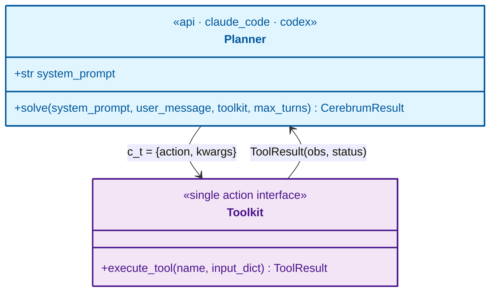

# Skill: Literature Review Note

Turn an academic paper (mostly robotics) into a dense, self-authored Obsidian review note. Follow the six steps in order.

This skill assumes and extends the [`obsidian-note`](../obsidian_note/SKILL.md) format skill.
All callout, math, figure, and Excalidraw conventions from that skill apply here unless overridden below.

## Directory Layout (target)

```
<...>/Literature-Review/
├── sources/
│   └── <PaperName>/
│       ├── Paper.md            # marker output, post-processed
│       └── media/              # all figures, PNG only
├── media/                      # figures used by the note (may reuse sources media)
├── drawings/                   # Excalidraw .md files (user-created)
└── <PaperName> Literature Review.md   # the summary note (Step 6)
```

`<PaperName>` is a short PascalCase identifier (e.g. `A2AFlowMatching`, `RPent`).

---

## Step 1 — Download from arXiv

If not done already, download **both** the PDF and the LaTeX source. arXiv rejects blank/default user agents, so always pass a browser-like `-A` string and follow redirects.

```bash
ID=2401.01234          # arXiv id
DL=/tmp/arxiv-$ID; mkdir -p "$DL"
UA="Mozilla/5.0 (X11; Linux x86_64) AppleWebKit/537.36"
curl -L -A "$UA" -o "$DL/paper.pdf"  "https://arxiv.org/pdf/$ID"
curl -L -A "$UA" -o "$DL/source.tar" "https://arxiv.org/e-print/$ID"
mkdir -p "$DL/src" && tar -xf "$DL/source.tar" -C "$DL/src"
```

`e-print` returns a gzipped tar (sometimes a bare `.tex`). If `tar` fails, try `tar -xzf`, or treat the file as a single `.tex`. The source tree holds the **high-resolution figures** used in Step 4.

## Step 2 — Convert the PDF to markdown

Follow the [`pdf`](../pdf/SKILL.md) skill — it owns the inspect → cut → `marker_single` procedure, the GPU page budget, and the troubleshooting table.
**Never** read the PDF with the Read tool.

Papers are almost always short and text-dominant enough to convert in one pass, so the usual case is a single direct call with the output going into the paper's `sources/<PaperName>/` folder:

```bash
conda run -n scientific marker_single "$DL/paper.pdf" \
  --output_format markdown \
  --output_dir "<...>/Literature-Review/sources/<PaperName>"
```

Marker writes `paper.md`, `paper_meta.json`, and `_page_N_Figure_M.jpeg` screenshots.
Rename the markdown to `Paper.md`. If the paper is unusually long (a survey, or a preprint with a 60-page appendix), split it per the `pdf` skill before converting.

## Step 3 — Sanity check

Marker produces a highly readable, well-formatted markdown with extracted figures.
Skim `Paper.md`: confirm equations rendered as LaTeX, tables converted, and section headers intact. This is the reading source for Step 6 — you do not rewrite it, you mine it.

## Step 4 — Post-process figures

Marker's `_page_N_Figure_M.jpeg` files are **page screenshots** — often blurry.
Upgrade them:

1. **Move real figures** into `sources/<PaperName>/media/`.
2. **Drop junk**: lab/brand logos, decorative photos, and redundant screenshots (see the keep/drop rule in Step 6's [Figures](#figures) section).
3. **Replace blurry screenshots with source figures.** Locate the original in `$DL/src` (look in `Figs/`, `figures/`, `assets/`).
   If it's a PDF or vector, **convert to PNG** at high DPI:

   ```bash
   pdftoppm -png -r 300 input.pdf outname        # -> outname-1.png
   # or, for a single cropped figure:
   pdftocairo -png -r 300 -singlefile input.pdf outname
   ```

   **All figures must end up as PNG** — no PDF/JPEG/SVG in the final `media/`.
4. Update image references in `Paper.md` to the cleaned PNG filenames.

## Step 5 — Finalize directory

- Markdown at `sources/<PaperName>/Paper.md`, all figures (PNG) under `sources/<PaperName>/media/`.
- Copy the figures the note will actually embed into `<...>/Literature-Review/media/`.

## Step 6 — Write the summary note

The note is `<...>/Literature-Review/<PaperName>.md`.

The goal is a **high-density reference for the user**, highlighting the math and the design decisions. This is the **exact opposite** of a generic-audience introduction. Do not drop technical details or use inaccurate metaphors to attempt to make it easier to understand. 

Preserve math, tricks, and design-decision rationale; cut the generic-audience padding.

### Metadata header

Open the file with a small header: arXiv link, authors as `John D. et al.`, venue, date, and a relative link back to the extracted source:

```markdown
> arXiv: [2401.01234](https://arxiv.org/abs/2401.01234) · John D. et al. · CoRL 2024 · 2024-01-03
> Source: [Paper.md](sources/<PaperName>/Paper.md)
```

### Section skeleton

Follow this order and callout mapping.
Try the standard skeleton first; **if a paper genuinely does not fit it, stop and ask the user** before improvising.

| Section | Callout | Length |
|---|---|---|
| TL;DR | `[!abstract]` | ~15% of total length; targeting 150 words |
| Methodology | `[!fact]` | ~40–60% of total length |
| Experiments & Findings | `[!hint]` | ~30–50% of total length |
| Reflection / "My Read" | `[!fact]` | user fills this |
| Codebase Status and Structure *(optional, last)* | `[!hint]` | Not counted in total length |

### TL;DR

Summary of the paper’s key innovation in methodology and results. This is strictly not a shortened version of the introduction and related work section; you must:

- **Avoid** Throat-clearing sentences (e.g., “imitation learning is one of the most promising paradigms…”)
- **Avoid** Redundant introductions to related work that are well-known to the field and that the user is likely familiar with.
- Inline a related work only if it’s a niche artifact from the authoring team (e.g. a bespoke infra library).
- **Always** cross-link with [[...]] when a relation exists — including baselines that have their own repo notes.
- **Drop** acknowledgements, funding, broad field-motivation padding, restated generic background and reviewer-pleasing hedging

### Methodology

This is the most important part, reserving ~40-60% of the total length. It extends beyond the typical structure of methodology:

- **Scope of the problem** — The problem setting the proposed solution addresses; this is often the benchmark used for testing.
  For example, when reviewing an algorithm paper benchmarked only in LIBERO, include the figure that shows the task types even if the paper places it in the experiments section.
- **System design** — The model architecture, algorithm pipeline, and related components.
  These are typically included in the paper's methodology.
- **Justification for design choices** — Include figures that show how an alternative to, or a variant of, the paper's algorithm functions differently.
  Include them here even if the paper places them under Experiments/Results, because they contextualize the design decisions.
-  **Strengthen** the paper’s unique innovations and decisions, and the subject-specific reason behind each.
- **Weaken/compress** methods the paper merely adapts and baselines it compares against — a link is enough (just like Related work in TL;DR).


Most importantly, do **not** write the detailed explanatory prose in this section.
Start with a 100-word overview that orients the discussion.
Then add the following technical scaffold:

- **Transcribe math** — Include most equations from the original paper.
  Use Obsidian `$$ ... $$` equation blocks, with one equation per block by default unless multiple lines must be grouped.
  Leave an empty line after every equation block.
  If a derivation is long, state its intent in a heading, fold the derivation body using Obsidian, then show the final result at the bottom and highlight it with $\boxed{...}$.

- **Explanation** — Add a **2-row, n-column symbol table** mapping each symbol to its meaning.
  Multiple equations often use the same symbols, so use one table per equation group; use multiple tables when the section has distinct symbol groups.
- **Attach fake code** (see instructions below) when a complex algorithm is introduced.
- **Attach illustrations** from the original paper whenever applicable.

After adding this scaffold:
- **Leave detailed explanations blank.** Reserve blank space after equations, code, and illustrations for the user's interpretation of the mechanics, design rationale, and trade-offs. The user writes that prose to strengthen their understanding.

### Implementation Tricks

“Implementation tricks” is an optional [!info] section that stands out from the methodology part to highlight special choices/techniques that the researchers documented. These are details that are easily overlooked, like freezing part of the model during different stages of training. But the core innovation of the paper is rarely considered an implementation trick, since it is already emphasized and cannot be overlooked.

### Experiments and Results

This is mostly summarizing the experiments presented in the original paper. The discussion is also done here; you should also discuss:

- Limitations that the authors acknowledge
- Limitations that you perceive, including: unverifiable results (no source code & dataset); overclaims; obvious signs of cherry-picking; suspected deliberate exclusion of tests/comparisons (A validation or baseline comparison that should be conducted but skipped intentionally)

### My read

This part is left for the user.


### Voice and Depth

Neutral, with slight critical edge.

- Quantitative results: preserve exact numbers.
Use a table when ≥3 comparable numbers, prose otherwise.
- Ablations: one line each — “what was removed → what it cost” — and only when it changes a takeaway.
A “trick” is a discrete decision uncommon in the field, imposed for a project-specific reason (e.g. keeping subjects mutually exclusive across train/val splits in a motion-to-age regressor).

### Notes on Math Equations

* Preserve the author’s exact notation and symbols — the note should read alongside the source PDF.
* For equations dense in notation, add a 2-row, n-column symbol table mapping each symbol to its meaning (see the obsidian-note conventions and existing SAPS note).
* Numbering: leave equations unnumbered when a reasonable name fits (refer to it as, e.g., “the VAE reconstruction loss”).
If the derivation is long or has too many equations to name, number them.
* All key math shown as multi-line $$ … $$ blocks.
* Expand custom TeX macros to standard LaTeX. Obsidian’s MathJax does not know a paper’s \newcommand definitions, so a macro like \piRLinf renders as literal text.
Inline the standard form instead — e.g., \pi_{\text{RLinf}}, not \piRLinf.
Check the TeX preamble for \newcommand / \def and substitute every use.

### Depth & fidelity

- **Quantitative results**: preserve exact numbers.
  Use a **table** when ≥3 comparable numbers, prose otherwise.
- **Ablations**: one line each — "what was removed → what it cost" — and only when it changes a takeaway.
- **Implementation tricks** — a dedicated `[!info]` subsection.
  A "trick" is a **discrete decision uncommon in the field, imposed for a project-specific reason** (e.g. keeping subjects mutually exclusive across train/val splits in a motion-to-age regressor).

### Related work & cross-linking

- Generic techniques the paper builds on (flow-matching, Q-learning, VAEs, …): **do not re-explain**.
  Link an existing repo note with `[[Note Name]]` if one exists; otherwise link a high-quality external tutorial/doc.
  Exclude the paper's generic related-work section from the note.
- Inline a related work **only** if it's a niche artifact from the authoring team (e.g. a bespoke infra library).
- **Always cross-link** with `[[...]]` when a relation exists — including baselines that have their own repo notes.

### Exclusions (paper side)

Always drop: acknowledgements, funding, broad field-motivation padding, restated generic background, reviewer-pleasing hedging, and generic related work (link instead).

### Math

- Preserve the author's **exact** notation and symbols — the note should read alongside the source PDF.
- **Numbering**: leave equations unnumbered when a reasonable name fits (refer to it as, e.g., "the VAE reconstruction loss").
  If the derivation is long or has too many equations to name, number them.
- All key math shown as multi-line `$$ … $$` blocks.
- **Expand custom TeX macros to standard LaTeX.** Obsidian's MathJax does not know a paper's `\newcommand` definitions, so a macro like `\piRLinf` renders as literal text.
  Inline the standard form instead — e.g. `\pi_{\text{RLinf}}`, not `\piRLinf`.
  Check the tex preamble for `\newcommand` / `\def` and substitute every use.

### Algorithms and code

Never reproduce pseudocode, even if the author used it.
Write **fake Python** instead — readable, strictly-typed, illustrative code that conveys the algorithm.
All illustrative code (algorithms *and* the codebase-analysis API signatures) follows these formatting rules, because Obsidian renders code verbatim and wraps long lines:

- **72-character hard line limit.** Obsidian wraps anything longer, which mangles alignment.
  Break signatures across lines and keep comment lines short.
- **Comments live on their own line, above the code they describe** — never a trailing `code  # note`.
- **Function-level commentary goes in a `''' … '''` block** (triple-quoted, even when it is not a strict docstring), placed as the first line of the body.
- **Signatures declare name + type only.** Always annotate every parameter and the return type (write as if under strict typing).
  Do **not** put explanations or array/tensor shapes in the signature (no `def f(x  # (B, T)`); shapes and meaning go in the `''' … '''` block instead.

### Figures

- **Keep**: architecture/pipeline diagrams, key result plots, illustrative task examples.
  **Drop**: decorative photos, logos, redundant qualitative screenshots.
- **Alt-text only** — descriptive `alt=`, no visible caption lines.
- **Always center** figures in a `<div align="center">`.
  Choose width by information density: `50%`, `80%`, or `100%`.
  Remember Obsidian renders at ~half screen width, so a `50%` figure is roughly `50% × 50% × (1 − 10% padding)` of a 16:9 screen — size up for detailed figures.

  ```markdown
  <div align="center"></div>
  ```

### Diagrams (Excalidraw)

Only when a **process/flow** is clearly better as a diagram, emit a `mermaid` block plus a placeholder for the user to one-shot-convert to Excalidraw:

```markdown
<!-- TODO: Convert the Mermaid below to Excalidraw and embed as ![[Drawing Name|100%]] -->
```

Otherwise **do not** invent diagrams — the user decides which drawings to create.

---

## Codebase analysis (optional section)

An **optional** final section, `## Codebase Status and Structure` under a `[!hint]` callout, placed **after Reflection**.
Include it **only for important open-source research the user explicitly asks to analyze** — if a repo exists but the user didn't ask, silently omit it.
The user will `git clone` the repo and give you the path; you have full read/execute access to that dir even though it lives outside the vault.
**Everything lands in the note** — do not create scratch files in the repo or vault (deep adaptation means diving into the real source anyway).

**Static by default.** Do **not** pull deps or run the code unless the user explicitly asks — getting a research codebase running usually needs user step-in, and env/time budget is specified per-project.
For exploring APIs (ML libraries drift fast past the model's knowledge cutoff), prefer static introspection: `stubgen -p <package>` (mypy) and `pdoc <module>` surface signatures without executing pipelines.

### Status & usability

Lead with a one-line **verdict**, then a compact table.
**Keep each cell to a single sentence** — Obsidian collapses a table cell onto one line, so anything longer becomes unreadable.
If an aspect genuinely needs more than a sentence, drop the table and use a `#### Completeness` subtitle per aspect instead (but prefer the one-sentence table).
Any longer caveat that doesn't fit — a methodology mismatch, a reproducibility gap — goes in its own **bold-lead paragraph below the table**, not crammed into a cell.

| Aspect | Assessment (one sentence each) |
|---|---|
| **Completeness** | All experiments/components present? Notable methodology mismatch with the paper? |
| **Adaptation** | Docs to replicate? Dataset available? Research-team-only vs. community-contributed / has real users? |
| **Dependency** | Depends on a niche infra toolchain (e.g. RLInf)? How portable? (Exclude common big-org toolchains — PyTorch, HF, etc.) |
| **Currency** | Modern libs, or pinned to a weird `torch 1.x + chumpy`? Last commit date? Active? |

Then a **replication-difficulty rating**:

- **Easy** — a few terminal commands, e.g. `uv sync && python main.py --params …`.
- **Moderate** — requires manual dataset/model pulls or manual install of another library (RPent is here).
- **Hard** — a real bottleneck, unclear instructions, or an unwieldy oversized codebase.

Add a one-sentence note on how hard it is to **adapt the key technique** into another codebase.

### Code pipeline breakdown

Purpose: a **Data Flow Diagram**, not an execution-flow chart.
Execution flow = what runs at startup (load model → enter loop).
**Data flow = the structure of data passing between layers of the API** — the communication protocol you'd need to graft a module into your own code.

**Order: diagram first, signatures second.** The data-flow diagram gives the reader the map; the signature blocks give the searchable, strictly-typed detail.
Keep **both** — they are complementary, not redundant (the diagram shows the topology and payloads; the signatures give exact types, tensor shapes, and a name you can grep in the IDE plus a source link).

- **Which APIs**: only **layer-boundary APIs** — the arrows in the paper's pipeline figure (most papers provide one; map each arrow to the function that carries that data).
  Ignore helpers like `resetController()`.

#### Data flow diagram (a styled `classDiagram`)

Draw the data flow as a **colored mermaid `classDiagram`**, not a plain flowchart — the class boxes give you two "tables" per layer for free: a **properties compartment** (the layer's owned state) and a **method compartment** (its boundary API with parameter names).
Directed, labeled associations carry the **payload (with shapes)** for each request/response hop, so the flow direction stays explicit.

Rules for the diagram:
- **One class per layer.** Fields = the state that layer owns; methods = only the boundary API(s).
  Add a `<<stereotype>>` line for the engine/backend or backend variants (e.g. `<<MuJoCo / Robosuite>>`, `<<api · claude_code · codex>>`).
- **Field syntax is type-first with no parens** (`+ndarray main_images`); parens make mermaid treat a member as a method.
  Put tensor shapes on the **edge labels** or in the signature blocks, not in fields.
- **One edge per hop, labeled with the payload** — show the round trip (request down, response up), e.g. `Toolkit --> Client : env_obs {images, states}` and `Client --> Toolkit : action chunk`.
- **Color one tier per layer** with the `style` directive (fill + stroke + text), reusing a palette like `#e1f5fe/#01579b` (blue), `#fff3e0/#e65100` (orange), `#f3e5f5/#4a148c` (purple), `#e8f5e9/#1b5e20` (green), `#fce4ec/#880e4f` (pink).
  Unicode is fine in labels (`fθ`, `Π`, `→`).
- **Render to verify before embedding.** mermaid-to-excalidraw silently drops a diagram with a syntax error, so confirm it renders first:

  ```bash
  printf '{"executablePath":"/usr/bin/google-chrome","args":["--no-sandbox"]}' > /tmp/pptr.json
  npx -y @mermaid-js/mermaid-cli -i diagram.mmd -o diagram.png -p /tmp/pptr.json -b white -s 2
  ```

- **Then the Excalidraw placeholder** (the user converts it to annotate their own interpretation):

  ```markdown
  <!-- TODO: Convert the Mermaid below to Excalidraw and embed as ![[<PaperName> Data Flow|100%]] -->
  ```

Skeleton:



#### Signature blocks (second)

A fake-Python code block per boundary API, following the code rules in *Algorithms and code* above (72-char lines, strict typing, no inline param comments).
Put every shape and description in a `''' … '''` block, **preserving the authors' original wording** for any real docstring and writing a concise one only where missing.
Keep these even though the diagram lists the same methods — they carry the exact types/shapes and a greppable name + source link.

```python
def forward(observation: Tensor,
            a_prev: Tensor) -> Tensor:
    '''
    <authors' own description of the policy forward pass>
    observation: (B, T_obs, C, H, W) RGB history
    a_prev:      (B, T_hist, 7) past actions
    returns:     (B, T_pred, 7) predicted action chunk
    '''
    ...
```

- **Cross-links**: link each key API to its source on GitHub — use the repo's **original URL, or the user's fork URL if they specify one** — and give local `path:line` references in prose.
