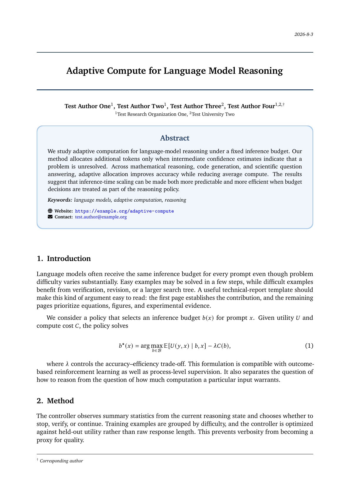

# Preprint Clean & Elegant Technical Report Template

A clean, single-column LaTeX template for preprints and technical reports. It
combines the comfortable XCharter-based typography and body layout inherited
from a class distributed with the public Gemini report source with a modern
front matter inspired by an industry-style preprint template.

> **Independent community project.** This is not an official Google, Google
> DeepMind, Stanford, or Stanford Digital Economy Lab template, and it is not
> affiliated with, sponsored by, or endorsed by those organizations. All
> institution-specific branding features from the upstream class have been
> removed. See [NOTICE.md](NOTICE.md).

> [中文说明](#中文说明)

## Preview

<p align="center">
  <a href="main.pdf"></a>
</p>

The compiled example is available as [main.pdf](main.pdf).

## Motivation

I created this template after repeatedly looking for a preprint format that felt
both comfortable to read and visually coherent. I especially liked the
typography and overall typesetting of the class distributed with Google
DeepMind's Gemini technical report, while the cover and abstract treatment in
the `industry-tech-report-template` project felt modern and polished. This
project brings those two strengths together in a neutral community template.

Many thanks to both upstream projects for sharing their work and for providing
the inspiration that made this template possible.

## References and acknowledgements

This repository builds on or takes visual inspiration from two sources:

1. **Class distributed with the Gemini technical report source** — included in
   the source of [*Gemini: A Family of Highly Capable Multimodal Models*](https://arxiv.org/abs/2312.11805)
   ([arXiv source package, v5](https://arxiv.org/src/2312.11805v5)). The upstream
   `googledeepmind.cls` file declares
   [CC BY-SA 4.0](https://creativecommons.org/licenses/by-sa/4.0/). This
   repository distributes a renamed derivative, `cleantechnicalreport.cls`,
   which retains its open typography and document layout while removing all
   institution-specific branding output.
2. **[industry-tech-report-template](https://github.com/ShenzheZhu/industry-tech-report-template)**
   — the visual reference for the title band, author composition, rounded
   abstract card, colors, and spacing proportions. The implementation lives in
   the separate `hybridfrontmatter.sty` package; no class code, institutional
   logos, or other repository assets are copied or distributed here.

See [ATTRIBUTION.md](ATTRIBUTION.md) for exact provenance, inspected versions,
checksums, modifications, and licensing boundaries.

## Brand-neutralization changes

The original class is not distributed under its original filename. The derived
`cleantechnicalreport.cls` makes these changes explicit:

- renames the class to a neutral project name;
- removes every hard-coded institutional logo path;
- removes institutional address and copyright output;
- removes internal/confidential report wording and report numbering;
- makes the legacy `logo`, `address`, `copyright`, and `internal` options raise
  an explanatory `\ClassError`, with no branded output implementation;
- retains XCharter/newtx/zlmtt typography, A4 geometry, body layout, sections,
  captions, tables, bibliography support, and generic page furniture.

The sample paper, bibliography, PDF, and preview use explicit test-only author
and institution names and contain no Google, Stanford, or Stanford Digital
Economy Lab branding. References to upstream organizations elsewhere in this
repository are informational attribution only.

## Design

Preserved from the neutralized base class:

- XCharter text and display typography
- newtxmath mathematics and zlmtt monospaced text
- A4 page geometry with 2.2 cm horizontal margins
- body paragraphs, sections, captions, tables, and later-page headers/footers

Added by the front-matter package:

- centered 16 pt title with full-width dark-blue rules
- title height that grows naturally when a long title wraps
- centered authors, with line breaks allowed between names but not at ordinary
  spaces within a literal name
- centered affiliations and a corresponding-author note in the first-page footer
- light-blue rounded abstract card
- optional Website and Contact rows
- optional slots for marks that the user owns or is authorized to use

## Build

Use pdfLaTeX:

```bash
latexmk -pdf main.tex
```

Clean generated build files with:

```bash
latexmk -C
```

## Front-matter API

```latex
\documentclass[11pt,onecolumn]{cleantechnicalreport}
\usepackage{hybridfrontmatter}

\title{Your title}
\author[1]{Test Author One}
\affil[1]{Test Institution One}

\reportauthornote{$^\dagger$ Corresponding author}
\reportwebsite{https://example.org/project}
\reportcontact{test.author@example.org}
\keywords{keyword one, keyword two}
```

Only use logos that you own or have permission to use:

```latex
\reportleftlogo[10mm]{figures/authorized-left-mark.pdf}
\reportrightlogo[10mm]{figures/authorized-right-mark.pdf}
```

If no right-side logo is configured, the report displays an ISO-formatted date.

The default front-matter sizes are 16/19 pt for the paper title, 10.5/14 pt for
author names, and 8.5/11 pt for affiliations. All remain in the inherited
XCharter family. They can be overridden in the preamble:

```latex
\renewcommand{\ReportTitleFont}{%
  \normalfont\bfseries\fontsize{15}{18}\selectfont}
\renewcommand{\ReportAuthorFont}{%
  \normalfont\bfseries\fontsize{10.5}{14}\selectfont}
```

With the recommended one-author-per-command syntax shown above, ordinary
top-level spaces in each literal `\author{...}` name are automatically made
nonbreaking. A multiword test name such as `Test Author Twenty` therefore stays
on one line, while line breaks may still occur between authors. Explicit
hyphenation points or author names generated by custom macros are not changed.
Load `hybridfrontmatter` before declaring any authors so this handling is active.
For an exceptionally long name that must wrap, restore breakable author text
for the document with:

```latex
\renewcommand{\ReportAuthorName}[1]{#1}
```

`\reportauthornote{...}` is placed below the full-width footer rule on the first
page. The note uses the full text width and wraps automatically when several
corresponding authors or long email addresses require a second line.

The abstract must appear before `\begin{document}`, because the base class
captures it in the preamble and renders it at `\maketitle`. Avoid nested
`\begin...\end` environments inside the abstract.

## License and rights-holder contact

This combined template is distributed under
[Creative Commons Attribution-ShareAlike 4.0 International](https://creativecommons.org/licenses/by-sa/4.0/)
to preserve the terms declared by the upstream class. See [LICENSE](LICENSE),
[ATTRIBUTION.md](ATTRIBUTION.md), and [NOTICE.md](NOTICE.md).

If you are a rights holder and believe that any material in this repository
infringes your rights, please [open an issue](https://github.com/SOMEAIDI/preprint-clean-elegant-technical-report-template/issues/new)
with enough information to identify the material and the relevant right. We
intend to review reasonably substantiated notices promptly. If our review
determines that affected material infringes a third party's rights, we will
remove or disable it without undue delay. This review policy does not claim
immunity from legal obligations and is not a substitute for obtaining
permission in advance.

## 中文说明

### 独立项目声明

本项目是独立维护的社区模板，不是 Google、Google DeepMind、Stanford University
或 Stanford Digital Economy Lab 的官方模板，也未获得上述机构的赞助、认可或背书。
上游 class 中所有机构专用的 Logo、地址、版权、内部报告和报告编号功能均已移除。

### 动机

我在寻找论文 preprint 模板时，一直没有找到一个字体足够舒服、整体又足够和谐的
方案。后来参考了两个很优秀的项目：Gemini 技术报告公开源码中 class 的字体和正文
排版非常耐看，而 `industry-tech-report-template` 项目在封面、标题和摘要区域的设计上
很现代。因此，我保留了前者的开放字体与正文体系，并重新实现了受后者启发的首页风格，
将两者融合成这个中性的单栏社区模板。

衷心感谢这两个项目公开分享相关内容，也感谢它们为本项目提供的灵感。

### 参考项目与处理范围

1. [Gemini 报告的 arXiv v5 源码](https://arxiv.org/src/2312.11805v5)：上游
   `googledeepmind.cls` 声明采用 CC BY-SA 4.0。本项目将其改名为
   `cleantechnicalreport.cls`，保留字体、数学排版、版心、正文、章节和通用页眉页脚，
   同时删除所有机构品牌专用功能，并在文件头逐项记录修改。
2. [industry-tech-report-template](https://github.com/ShenzheZhu/industry-tech-report-template)：
   本项目参考其首页版式、配色与间距比例，在独立的 style 文件中重新实现；没有复制
   其 class 源码、学校 Logo 或其他素材。

按推荐的“一位作者对应一个 `\author` 命令”写法，模板会自动禁止作者姓名中的普通
空格成为换行点，只允许在不同作者之间换行，从而避免复姓或多词姓氏（例如
`Test Author Twenty`）被拆到两行。通讯作者说明位于首页页脚，并可自动换为两行。

如权利人认为仓库中的任何内容侵犯其权利，请通过
[GitHub Issues](https://github.com/SOMEAIDI/preprint-clean-elegant-technical-report-template/issues/new)
联系我们。我们会及时审查具有合理依据的通知；如经审查确认相关内容侵犯第三方权利，
我们会在不无故拖延的情况下删除或停用相关内容。该处理机制不能替代事前获得授权，
也不构成法律免责。

更完整的来源、校验值、修改记录和许可说明见 [ATTRIBUTION.md](ATTRIBUTION.md)。
