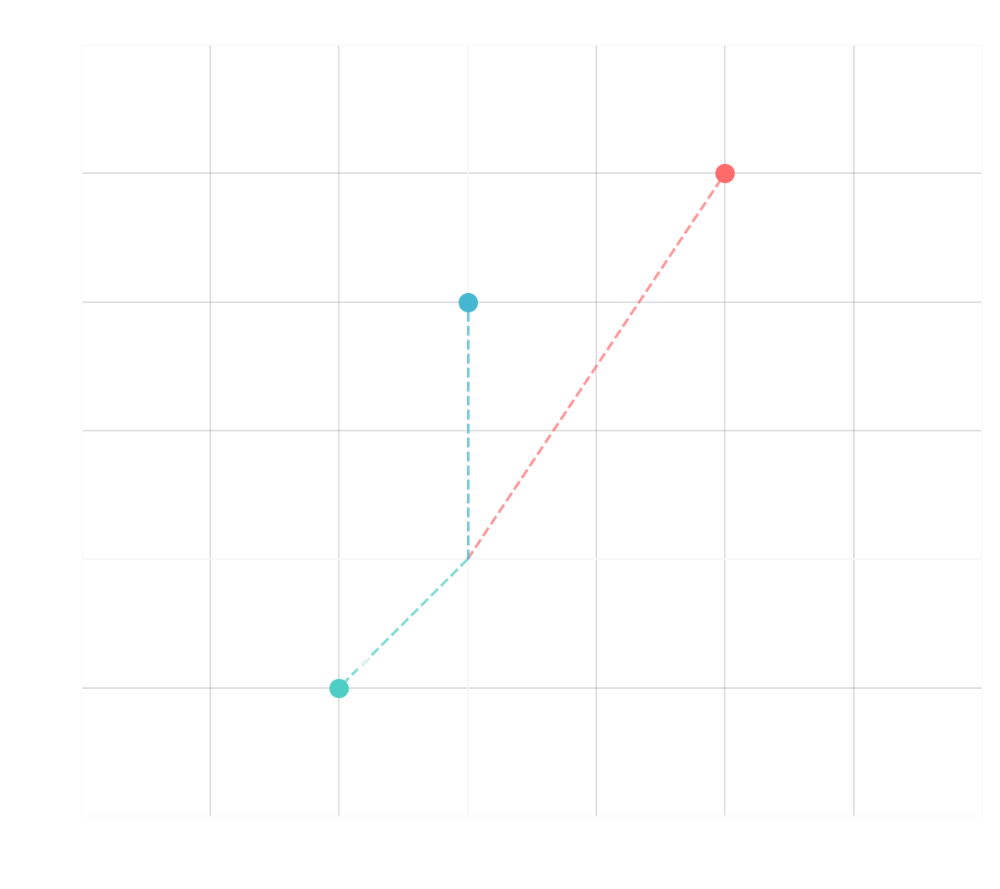

---

> [!quote] Definition
> ## Imaginary Unit

We call $i$ the <u><strong style="color:#dab1da">imaginary unit</strong></u> satisfying $i^2 = -1$.

**Warning**: Be careful when writing $\sqrt{-1} = i$ since you may be tempted to do something like:
$$-1 = i \cdot i = \sqrt{-1} \cdot \sqrt{-1} = \sqrt{(-1)(-1)} = \sqrt{1} = 1$$

The result $\sqrt{a} \cdot \sqrt{b} = \sqrt{ab}$ is only valid for **positive** $a$ and $b$. That being said, it is not uncommon to do something like $\sqrt{-4} = 2i$, especially when solving equations.

> [!quote] Definition
> ## Complex Numbers

A <u><strong style="color:#dab1da">complex number</strong></u> $z$ is defined as $z = x + iy$ where:
- $x \in \mathbb{R}$ is called the <u><strong style="color:#dab1da">real part</strong></u>, denoted by $\text{Re}(z)$
- $y \in \mathbb{R}$ is called the <u><strong style="color:#dab1da">imaginary part</strong></u>, denoted by $\text{Im}(z)$

The set of all complex numbers is denoted by $\mathbb{C}$.

> [!info] Info
> ## Complex Arithmetic

Given $z_1 = a + bi$ and $z_2 = c + di$ (where $a, b, c, d \in \mathbb{R}$), we define:

1. **Equality**: $z_1 = z_2$ if $a = c$ and $b = d$

2. **Addition**: $z_1 + z_2 = (a + c) + (b + d)i$

3. **Multiplication**: $z_1 z_2 = (a + bi)(c + di) = ac - bd + (ad + bc)i$

4. **Division**: 
$$\frac{z_1}{z_2} = \frac{a + bi}{c + di} = \frac{a + bi}{c + di} \cdot \frac{c - di}{c - di} = \frac{ac + bd + (bc - ad)i}{c^2 + d^2}$$

> [!hint] Hint
> ## Complex Plane

We can represent the complex number $z = a + bi$ graphically by plotting it as the ordered pair $(a, b)$ on the complex plane:

> [!quote] Definition
> ## Complex Conjugate

Given $z = a + bi$, we define $\bar{z} = a - bi$ as the <u><strong style="color:#dab1da">complex conjugate</strong></u>. Graphically, this represents a reflection across the real axis on the complex plane.

#### Properties of Complex Conjugate:
- $\overline{\bar{z}} = z$
- $z + \bar{z} = 2\text{Re}(z)$
- $z - \bar{z} = 2i\text{Im}(z)$
- If $\text{Im}(z) = 0$, then $\bar{z} = z$
- If $\text{Re}(z) = 0$, then $\bar{z} = -z$
- $\overline{z_1 + z_2} = \bar{z_1} + \bar{z_2}$
- $\overline{z_1 z_2} = \bar{z_1} \cdot \bar{z_2}$
- $z \bar{z} = [\text{Re}(z)]^2 + [\text{Im}(z)]^2$

> [!quote] Definition
> ## Complex Modulus

Given $z = a + bi$, we define $|z| = \sqrt{a^2 + b^2}$ as the <u><strong style="color:#dab1da">modulus</strong></u> (or absolute value). Graphically, this represents the distance to the origin on the complex plane.

#### Properties of Modulus:
- $z \bar{z} = |z|^2$
- $|\bar{z}| = |z|$
- $|z| \geq 0$
- If $|z| = 0$, then $z = 0$
- $|z_1 z_2| = |z_1| \cdot |z_2|$
- $\left|\frac{z_1}{z_2}\right| = \frac{|z_1|}{|z_2|}$
- $|z_1 + z_2| \leq |z_1| + |z_2|$ (Triangle Inequality)

> [!example] Example
> ## Finding Complex Solutions

Find all $z$ satisfying $|z| = |2 + i\bar{z}|$

> [!success]- Solution (Click to expand)
> Let $z = a + bi$, then we have:
> 
> $$2 + i\bar{z} = 2 + i(a - bi) = 2 + b + ai$$
> 
> So $|z|^2 = |2 + i\bar{z}|^2$ gives us:
> $$a^2 + b^2 = (2 + b)^2 + a^2$$
> $$b^2 = 4 + 4b + b^2$$
> $$4b = -4$$
> $$b = -1$$
> 
> Any complex number $z = a + bi = a - i$ will have the same modulus as $z_2 = 2 + i\bar{z} = 2 + b + ai = 1 + ai$.
> 
> The points satisfying $a = 1$ are represented by the vertical line below. The points satisfying $b = -1$ all lie on the horizontal line below.
> 
> [Insert graph: Complex plane showing horizontal line at $\text{Im}(z) = -1$ and vertical line at $\text{Re}(z) = 1$]