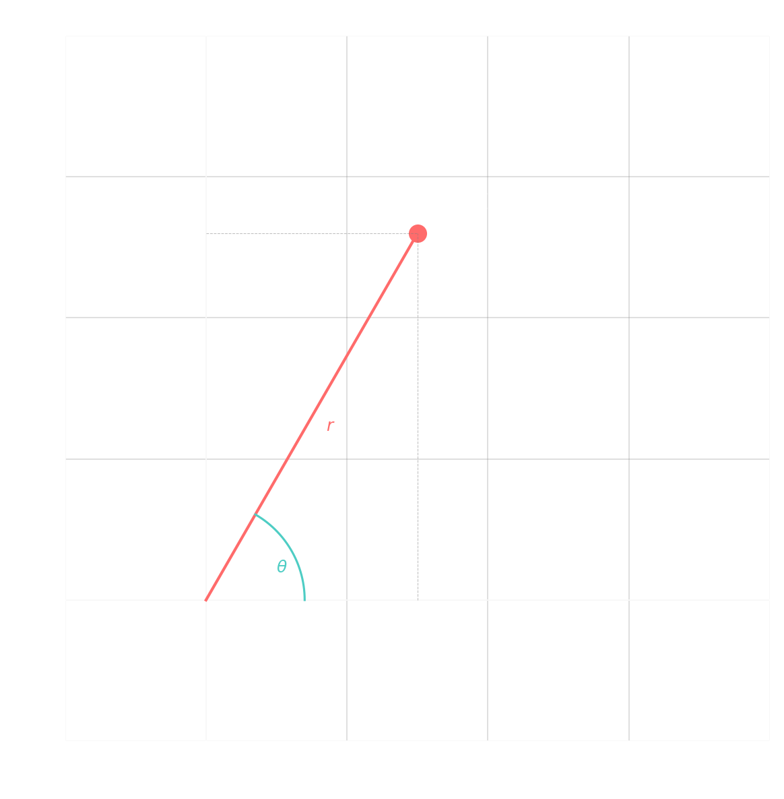
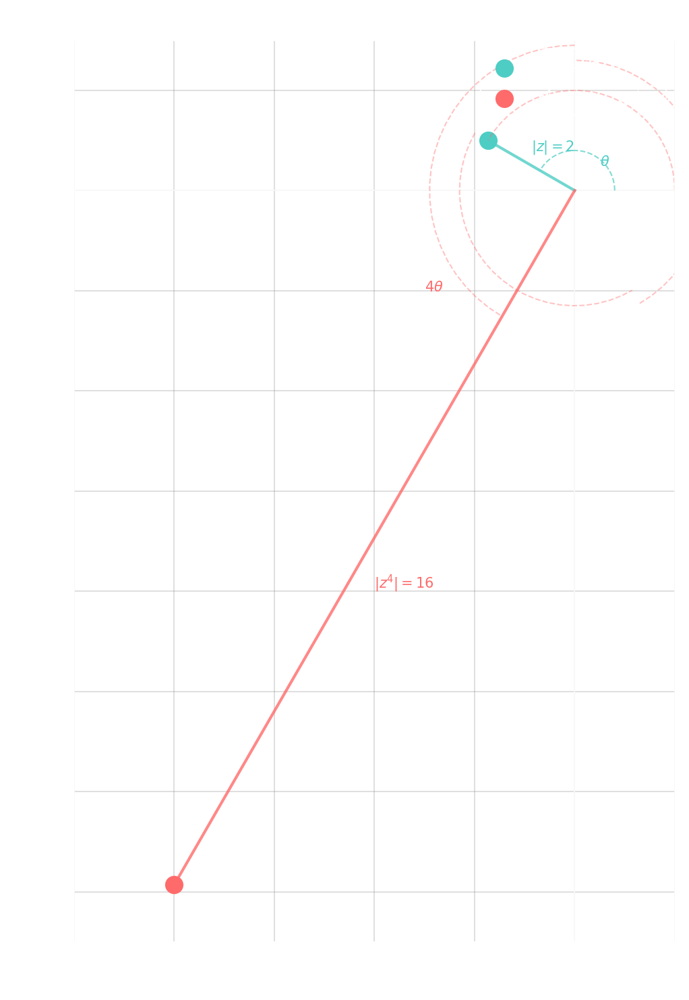

---

> [!quote] Definition
> ## Polar Form

The <u><strong style="color:#dab1da">polar form</strong></u> of a complex number $z$ is:
$$z = r(\cos\theta + i\sin\theta)$$

where:
- $r$ is called the <u><strong style="color:#dab1da">modulus</strong></u> (or magnitude) and $r = |z|$
- $\theta$ is called the <u><strong style="color:#dab1da">argument</strong></u> (or phase) and is referred to as the <u><strong style="color:#dab1da">radius/amplitude</strong></u> among others

Note that the polar form is not unique because $\sin(\theta + 2\pi) = \sin\theta$ and $\cos(\theta + 2\pi) = \cos\theta$. Generally speaking, we usually try to keep $\theta \in [0, 2\pi)$ or $(-\pi, \pi]$.

> [!info] Info
> ## Complex Multiplication in Polar Form

In polar form, multiplication is simplified. Let:
- $z_1 = r_1(\cos\theta_1 + i\sin\theta_1)$
- $z_2 = r_2(\cos\theta_2 + i\sin\theta_2)$

Then:
$$z_1 z_2 = r_1 r_2[(\cos\theta_1\cos\theta_2 - \sin\theta_1\sin\theta_2) + i(\cos\theta_1\sin\theta_2 + \sin\theta_1\cos\theta_2)]$$
$$= r_1 r_2[\cos(\theta_1 + \theta_2) + i\sin(\theta_1 + \theta_2)]$$

That is, to multiply in polar form, simply **multiply the moduli** and **add the arguments**.

Similarly, for division:
$$\frac{z_1}{z_2} = \frac{r_1}{r_2}[\cos(\theta_1 - \theta_2) + i\sin(\theta_1 - \theta_2)]$$

> [!fact] Theorem
> ## De Moivre's Theorem

Let $z = r(\cos\theta + i\sin\theta)$. If $z \neq 0$ and $n \in \mathbb{Z}$, then:
$$z^n = r^n[\cos(n\theta) + i\sin(n\theta)]$$

> [!hint] Hint
> ## Euler's Formula

Recall that **exponentials** behave similarly:
$$e^{i\theta} = \cos\theta + i\sin\theta$$

This is called <u><strong style="color:#dab1da">Euler's formula</strong></u> (e^{i\pi} = -1).

As it turns out, it can be shown that:
$$z = r(\cos\theta + i\sin\theta) = re^{i\theta}$$

With that, De Moivre becomes:
$$z^n = r^n e^{in\theta}$$

> [!example] Example
> ## Converting to Polar Form

Let $z = -\sqrt{3} + i$. Use complex exponential form to compute $z^4$ and write the final result in standard form.

> [!success]- Solution (Click to expand)
> We have $|z| = \sqrt{3 + 1} = 2$ and since $|z| = \sqrt{3 + 1} = 2$, we have $r = 2$.
> 
> To find $\theta$, we solve $\tan\theta = \frac{1}{-\sqrt{3}}$, noting that $x < 0, y > 0$ means $\theta \in (\frac{\pi}{2}, \pi)$.
> 
> In this case, we have a special triangle, so the corresponding acute angle is $\frac{\pi}{6}$. Since we are in quadrant 2, we get $\theta = \pi - \frac{\pi}{6} = \frac{5\pi}{6}$.
> 
> We have $z = 2e^{i\frac{5\pi}{6}}$. To find $z^4$, we simply compute:
> $$z^4 = 2^4 e^{i\frac{20\pi}{6}} = 16e^{i\frac{10\pi}{3}}$$
> $$= 16[\cos(\frac{10\pi}{3}) + i\sin(\frac{10\pi}{3})]$$
> $$= 16[(-\frac{1}{2}) + i(-\frac{\sqrt{3}}{2})]$$
> $$= -8 - 8\sqrt{3}i$$

> [!info] Info
> ## Graphical Effect of Complex Operations

Note that graphically, the effect of computing $z^n$ will **rotate** $z$ by its argument $n$ times (counterclockwise when $n > 0$ and clockwise when $n < 0$). It will also **scale** its length.

For example, if $z = -\sqrt{3} + i$, we have:

