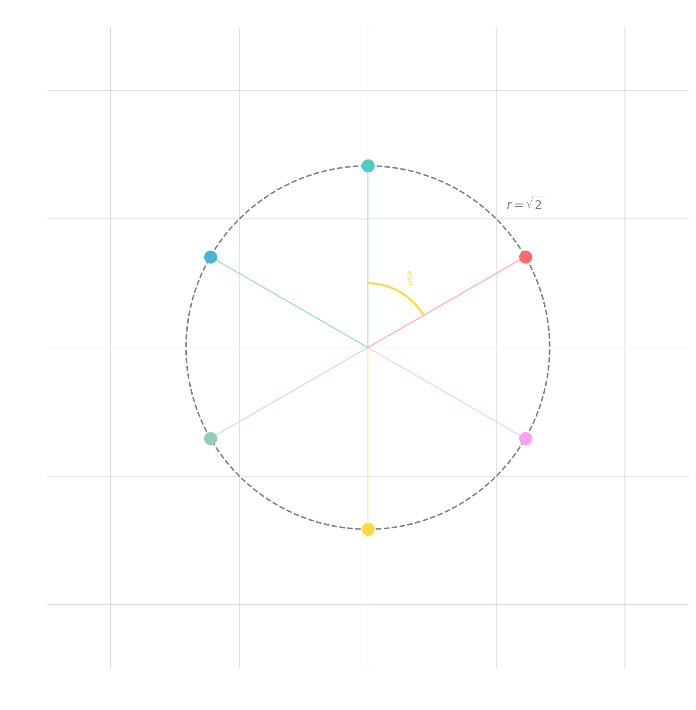

---

> [!abstract] Introduction
> ## Roots of Polynomials

As you may recall, the equation $ax^2 + bx + c = 0$ has solution:
$$x = \frac{-b \pm \sqrt{b^2 - 4ac}}{2a}$$

Allowing for the solutions to be **complex**, we see that this degree 2 polynomial will always have **two** solutions, also known as <u><strong style="color:#dab1da">roots</strong></u> of the function $f(x) = ax^2 + bx + c$.

(In the event $b^2 - 4ac = 0$, we still get "2 roots"; it's just that they are **repeated**. In this case we say the lone root has <u><strong style="color:#dab1da">multiplicity</strong></u> 2.)

> [!fact] Theorem
> ## Fundamental Theorem of Algebra

If $p(z)$ is a complex polynomial of degree $n$, then the equation $p(z) = 0$ has exactly $n$ solutions (if we count multiplicities), i.e., $p(z)$ has $n$ roots.

> [!example] Example
> ## Finding Roots of Polynomials

The polynomial $p(z) = z^4 - (2 - 3i)z^3 - (3 + 6i)z^2 + (6 - i)z + 2i$ has roots $z = -i$ of multiplicity 3 and $z = 2$ of multiplicity 1. That is, $p(z) = (z + i)^3(z - 2)$.

> [!example] Example  
> ## Complex Roots in Pairs

The polynomial $q(z) = z^3 - (2 + 3i)z^2 - (5 - 3i)z - (2 - 6i)$ has roots $z = -1, 2i, 3 + i$.

In the event that **all** of the coefficients $p(z)$ are **real**, then we have the following:

> [!fact] Theorem
> ## Conjugate Pairs

Given $p(z) = a_n z^n + a_{n-1} z^{n-1} + \cdots + a_1 z + a_0$ where $a_i \in \mathbb{R}$, if $z = c + di$ is a root of $p$, then so is $\bar{z} = c - di$.

That is, complex roots always come in **conjugate pairs**.

> [!info] Info
> ## Complex $n$th Roots

In general, it is **hard** to find roots of a polynomial. In most cases, **numerical techniques** are required.

However, in the case where the polynomial is $p(z) = z^n - c$ for some complex number $c$, we can use **polar form** to identify all $n$ roots (i.e., all $n$ solutions to $z^n = c$).

The trick is to note that all complex numbers are **periodic** with period $2\pi$.

That is, $re^{i\theta} = re^{i(\theta + 2\pi n)}$ for $k \in \mathbb{Z}$.

Now if we write $z = re^{i\theta}$ and $c = Re^{i(\phi + 2\pi k)}$ with the goal of finding $r$ and $\theta$, then the equation $z^n = c$ becomes:
$$r^n e^{in\theta} = Re^{i(\phi + 2\pi k)}$$

which implies that $r = \sqrt[n]{R}$ (all real values) and $\theta = \frac{\phi + 2\pi k}{n}$ for any integer value of $k$.

(You may wonder why we didn't write $z = re^{i(\theta + 2\pi m)}$; try it and see what happens.)

Furthermore, note that the expression $\theta = \frac{\phi + 2\pi k}{n}$ will only have unique values for $k = 0, 1, 2, \ldots, n - 1$ since in a $2\pi$ periodic function:
$$\frac{\phi + 2\pi n}{n} = \frac{\phi}{n} + 2\pi = \frac{\phi}{n} = \frac{\phi + 2\pi \cdot 0}{n}$$ (same answer again)

So for example, the values repeat in chunks of $n$.

> [!example] Example
> ## Finding $n$th Roots

Find the roots of $p(z) = z^6 + 8$.

> [!success]- Solution (Click to expand)
> There should be 6 roots which we usually label with $w_0, \ldots, w_5$.
> 
> We need to solve $z^6 + 8 = 0 \Rightarrow z^6 = -8$.
> 
> First, write $-8$ in complex polar form. We have $r = 8$ and $\tan\theta = \frac{0}{-8}$ meaning $\theta = \pi$.
> 
> Since the real part is negative, we have $\phi = \pi$.
> 
> So we have $-8 = 8e^{i\pi} = 8e^{i(\pi + 2\pi k)}$.
> 
> The roots are given by $z = 8^{1/6} e^{i(\frac{\pi + 2\pi k}{6})}$ where $r = 8^{1/6} = \sqrt[6]{8} = \sqrt{2}$.
> 
> Since $r = 8^{1/6} = \sqrt{2}$, we have:
> $$w_0 = \sqrt{2}e^{i\pi/6}, \quad w_1 = \sqrt{2}e^{i3\pi/6}, \quad w_2 = \sqrt{2}e^{i5\pi/6}$$
> $$w_3 = \sqrt{2}e^{i7\pi/6}, \quad w_4 = \sqrt{2}e^{i9\pi/6}, \quad w_5 = \sqrt{2}e^{i11\pi/6}$$
> 
> Plotting these in the complex plane gives:
> 
> [Insert graph: Complex plane showing 6 equally-spaced points on a circle of radius $\sqrt{2}$, with angles at $\frac{2\pi}{n} = \frac{\pi}{3}$ radians apart]
> 
> Note how they all lie on the circle of radius $r = R^{1/6} = \sqrt{2}$ and are $\frac{2\pi}{n} = \frac{\pi}{3}$ radians apart.

All roots lie on circle of radius $\\sqrt{2}$ and are $\frac{2\pi}{6} = \frac{\pi}{3}$ radians apart.

