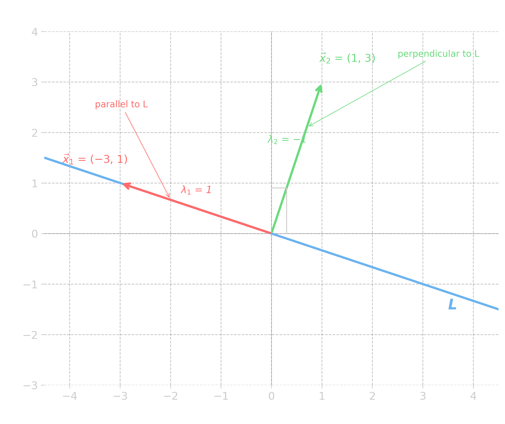
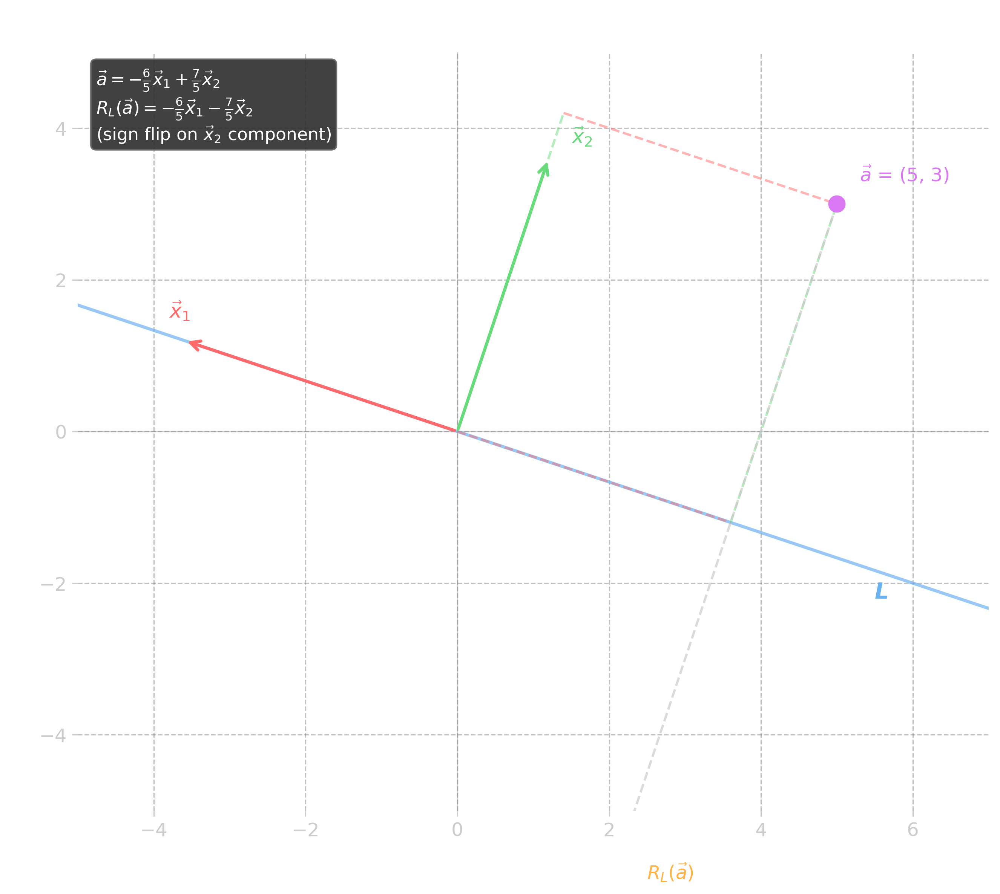

---

> [!example] Example
> ## Motivating Example: Reflection Transformation

Consider the linear transformation $R_L(\vec{x}) = 2\text{proj}_{\vec{d}}\vec{x} - \vec{x}$, where $\vec{d}$ is the <u><strong style="color:#dab1da">direction vector</strong></u> of the line $L$. This represents a <u><strong style="color:#dab1da">reflection</strong></u> over the line $L$.

Let $\vec{d} = \begin{bmatrix} 3 \\ -1 \end{bmatrix}$. Compute $R_L(\vec{x})$ for the following vectors:

a) $\vec{x} = \begin{bmatrix} 2 \\ 2 \end{bmatrix}$; (b) $\vec{x} = \begin{bmatrix} -1 \\ 1/3 \end{bmatrix}$; (c) $\vec{x} = \begin{bmatrix} 2 \\ 6 \end{bmatrix}$

> [!success]- Solution (Click to expand)
> 
> To solve this problem, let us first compute the standard matrix $[R_L]$.
> 
> We have $[R_L] = \begin{bmatrix} R_L(\vec{e}_1) & R_L(\vec{e}_2) \end{bmatrix}$.
> 
> **Computing $R_L(\vec{e}_1)$:**
> $$R_L(\vec{e}_1) = 2\text{proj}_{\vec{d}}\vec{e}_1 - \vec{e}_1 = 2 \cdot \frac{\begin{bmatrix} 1 \\ 0 \end{bmatrix} \cdot \begin{bmatrix} 3 \\ -1 \end{bmatrix}}{10} \begin{bmatrix} 3 \\ -1 \end{bmatrix} - \begin{bmatrix} 1 \\ 0 \end{bmatrix} = \begin{bmatrix} 4/5 \\ -3/5 \end{bmatrix}$$
> 
> **Computing $R_L(\vec{e}_2)$:**
> $$R_L(\vec{e}_2) = 2\text{proj}_{\vec{d}}\vec{e}_2 - \vec{e}_2 = 2 \cdot \frac{\begin{bmatrix} 0 \\ 1 \end{bmatrix} \cdot \begin{bmatrix} 3 \\ -1 \end{bmatrix}}{10} \begin{bmatrix} 3 \\ -1 \end{bmatrix} - \begin{bmatrix} 0 \\ 1 \end{bmatrix} = \begin{bmatrix} -3/5 \\ -4/5 \end{bmatrix}$$
> 
> Therefore:
> $$[R_L] = \begin{bmatrix} 4/5 & -3/5 \\ -3/5 & -4/5 \end{bmatrix}$$
> 
> Now we compute $R_L(\vec{x}) = [R_L]\vec{x}$ for each case:
> 
> **a)** $R_L\left(\begin{bmatrix} 2 \\ 2 \end{bmatrix}\right) = \begin{bmatrix} 4/5 & -3/5 \\ -3/5 & -4/5 \end{bmatrix}\begin{bmatrix} 2 \\ 2 \end{bmatrix} = \begin{bmatrix} 2/5 \\ -14/5 \end{bmatrix}$
> 
> [Insert graph: vector (2,2) reflected to (2/5, -14/5) across line L]
> 
> **b)** $R_L\left(\begin{bmatrix} -1 \\ 1/3 \end{bmatrix}\right) = \begin{bmatrix} 4/5 & -3/5 \\ -3/5 & -4/5 \end{bmatrix}\begin{bmatrix} -1 \\ 1/3 \end{bmatrix} = \begin{bmatrix} -1 \\ 1/3 \end{bmatrix}$
> 
> [Insert graph: vector (-1, 1/3) maps to itself]
> 
> **c)** $R_L\left(\begin{bmatrix} 2 \\ 6 \end{bmatrix}\right) = \begin{bmatrix} 4/5 & -3/5 \\ -3/5 & -4/5 \end{bmatrix}\begin{bmatrix} 2 \\ 6 \end{bmatrix} = \begin{bmatrix} -2 \\ -6 \end{bmatrix}$
> 
> [Insert graph: vector (2,6) reflected to (-2,-6)]

Notice that in **b)** and **c)** we have the curious result that $R_L(\vec{x}) = \lambda\vec{x}$, where $\lambda = 1$ in **b)** and $\lambda = -1$ in **c)**. We give this situation a special name.

> [!quote] Definition
> ## Eigenvalue/Eigenvector Pair (for Transformations)

Let $L$ be a <u><strong style="color:#dab1da">linear</strong></u> transformation mapping $\mathbb{R}^n \to \mathbb{R}^n$. We call the pair of values $\lambda \in \mathbb{R}$ and $\vec{x} \in \mathbb{R}^n$ an <u><strong style="color:#dab1da">eigenvalue/eigenvector pair</strong></u> whenever they satisfy:

$$L(\vec{x}) = \lambda\vec{x}$$

assuming $\vec{x} \neq \vec{0}$. (Note that it is okay if $\lambda = 0$.)

> [!info] Info
> ## Why Eigenvectors Matter

It is common to ask "What are the eigenvectors of this transformation?" since they not only provide the <u><strong style="color:#dab1da">"easiest" vectors</strong></u> to work with, but will often also have some <u><strong style="color:#dab1da">geometric meaning</strong></u>.

> [!fact] Theorem
> ## Scalar Multiples of Eigenvectors

Any <u><strong style="color:#dab1da">scalar multiple</strong></u> of an eigenvector is also an eigenvector with the same eigenvalue.

If $T(\vec{x}) = \lambda\vec{x}$, then $T(c\vec{x}) = cT(\vec{x}) = c\lambda\vec{x} = \lambda(c\vec{x})$.

> [!example] Example
> ## Eigenvectors of the Reflection $R_L$

For the reflection $R_L$ above, we have the 2 independent eigenvectors:

$$\vec{x}_1 = \begin{bmatrix} -3 \\ 1 \end{bmatrix}, \quad \vec{x}_2 = \begin{bmatrix} 1 \\ 3 \end{bmatrix}$$

with associated eigenvalues $\lambda_1 = 1$ and $\lambda_2 = -1$.

Geometrically, we see that these vectors are <u><strong style="color:#dab1da">parallel</strong></u> and <u><strong style="color:#dab1da">orthogonal</strong></u> to the line with direction vector $\vec{d} = \begin{bmatrix} 3 \\ -1 \end{bmatrix}$.

> [!info] Info
> ## Eigenvectors as Ideal Coordinate Axes

Note that the set $B = \{\vec{x}_1, \vec{x}_2\}$ is <u><strong style="color:#dab1da">linearly independent</strong></u> and <u><strong style="color:#dab1da">spans $\mathbb{R}^2$</strong></u>, and thus forms a <u><strong style="color:#dab1da">basis</strong></u> for $\mathbb{R}^2$.

Let's see what happens if we pick an arbitrary point in $\mathbb{R}^2$, represent it with $B$, and then apply $R_L$.

> [!example] Example
> ## Using the Eigenvector Basis

Let $\vec{a} = \begin{bmatrix} 5 \\ 3 \end{bmatrix}$. We can write this in terms of $B$ as:

$$\vec{a} = \begin{bmatrix} 5 \\ 3 \end{bmatrix} = -\frac{6}{5}\begin{bmatrix} -3 \\ 1 \end{bmatrix} + \frac{7}{5}\begin{bmatrix} 1 \\ 3 \end{bmatrix} = -\frac{6}{5}\vec{x}_1 + \frac{7}{5}\vec{x}_2$$

Then:
$$R_L(\vec{a}) = -\frac{6}{5}R_L(\vec{x}_1) + \frac{7}{5}R_L(\vec{x}_2) \quad \text{(since } R_L \text{ is linear)}$$
$$= -\frac{6}{5}\vec{x}_1 - \frac{7}{5}\vec{x}_2 \quad \text{(since } \vec{x}_1, \vec{x}_2 \text{ are eigenvectors with } \lambda_1 = 1, \lambda_2 = -1\text{)}$$

Graphically, if you "think" of $\mathbb{R}^2$ in terms of $B$, then the operation $R_L$ is a simple <u><strong style="color:#dab1da">"sign flip"</strong></u> to the second basis vector $\vec{x}_2$.

That is, the <u><strong style="color:#dab1da">eigenvectors</strong></u> of $R_L$ give us the <u><strong style="color:#dab1da">ideal coordinate axes</strong></u> to work in.

> [!hint] Hint
> ## Analogy: Standard Reflection

As a comparison, how does one reflect $\vec{b} = \begin{bmatrix} 6 \\ 4 \end{bmatrix}$ across $\vec{e}_1$ (the x-axis)?

Well, we simply write $\vec{b}^* = \begin{bmatrix} 6 \\ -4 \end{bmatrix}$, i.e., just "flip" the y-value.

The eigenvector basis allows us to perform *any* reflection just as easily!

---

> [!quote] Definition
> ## Eigenvalue/Eigenvector Pair (for Matrices)

Since all linear transformations are just <u><strong style="color:#dab1da">matrix operations</strong></u> and vice versa, we define the following:

Let $A$ be an $n \times n$ matrix. If $A\vec{x} = \lambda\vec{x}$ for $\vec{x} \neq \vec{0}$, then we call $\vec{x}$ an <u><strong style="color:#dab1da">eigenvector</strong></u> of $A$ with associated <u><strong style="color:#dab1da">eigenvalue</strong></u> $\lambda$.