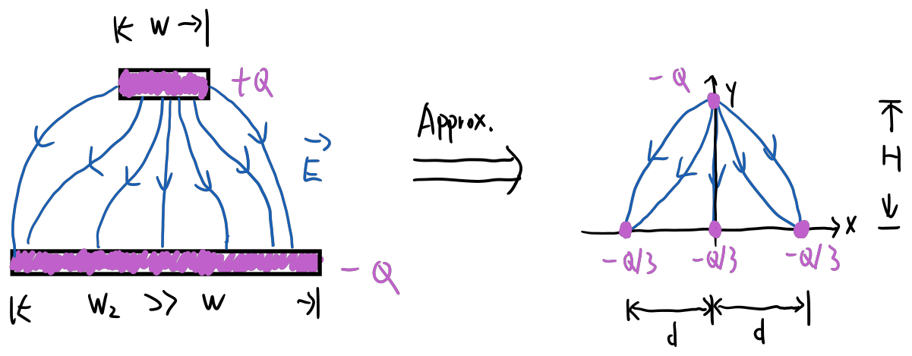
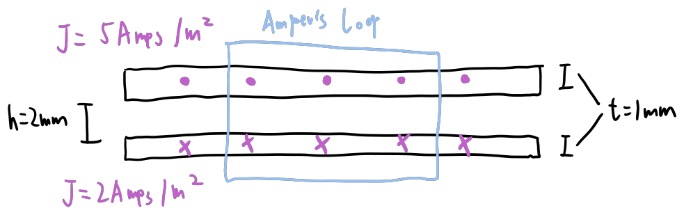
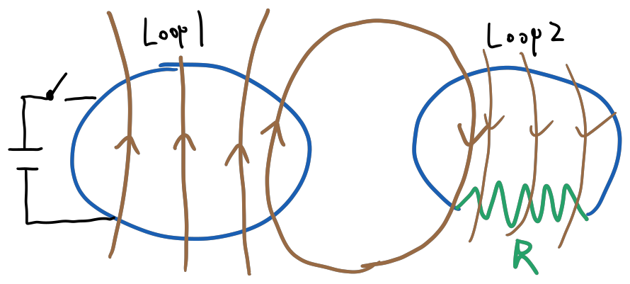
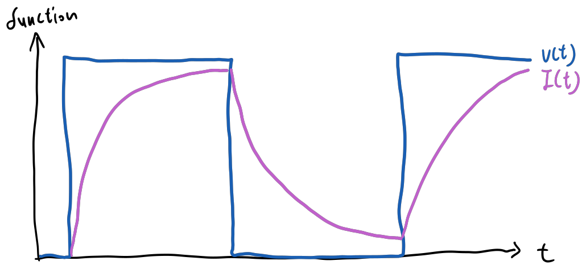
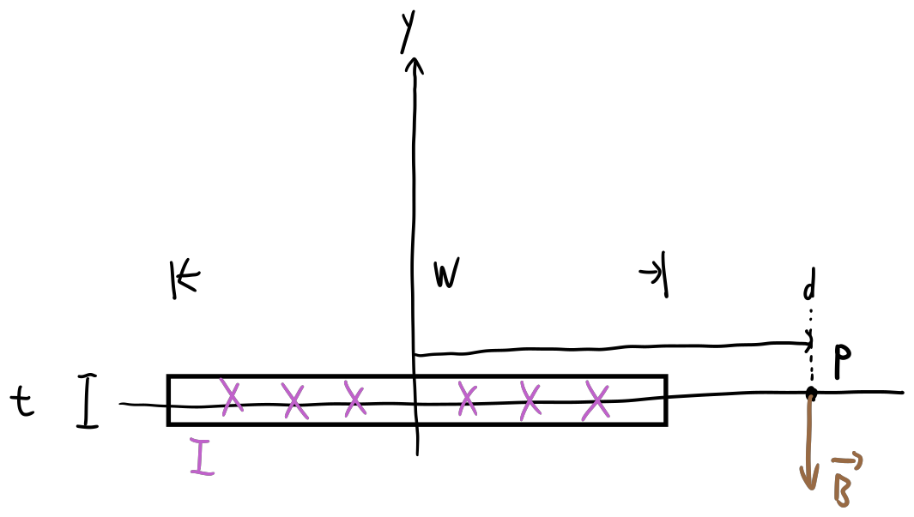

## Question 1

The capacitance of a parallel power transmission line with small width on top and large width in bottom plate is hard to compute without FEM software. We are asked to determine the capacitance of this simplified model:
- $+Q$ charge at (0, H)
- three point charges of $-\frac{Q}{3}$ at $(-d, 0), \, (0,0),\, (d, 0)$. 

I got stuck when hesitating between ways to compute potential difference. I tried to do $\int \vec{E} \, \vec{\mathrm{d}l}$ but $\vec{E}$ is infinite when we are close to the charges, this wasted a lot of time. Then I tried an alternative way:
$$
\text{Ep}_{(-3*(Q/3))} - \text{Ep}_{(Q)} = 2 \, \frac{1}{4\pi\epsilon_0}\, \int_{H}^\infty\frac{Q^2/3}{y^2}+\frac{2Q^2/3}{y^2+d^2} \, \frac{y}{\sqrt{y^2+d^2}} \, dy
$$
$$
\Delta V = \frac{\text{Ep}_{(-3*(Q/3))}}{Q} - \frac{\text{Ep}_{(Q)}}{Q} = 2\frac{Q/3}{4\pi \epsilon_0} \, \left( \frac{1}{H} + \frac{2}{\sqrt{H^2+d^2}} \right)
$$
I forgot to do the final step to compute $C=\frac{Q}{\Delta V}$

## Question 2

Ask for difference between of conservativeand non-conservative field, and an example of each.

I screwed this one up. I remember that conservative force are force that does not change total energy, every work done is converted from potential energy, examples $\set{\vec{g}, \vec{F_B} = \vec{B}vq, \vec{F_E}= \vec{E}q }$. But I failed to recall that we've every learned any field that is non-conservative in that extend. So I thought maybe conservative fields does no work at all while non-conservative field does work by trading potential energy. I wrote $\vec{B}$ on charge $q$ as conservative field example because work is always 0;  and I put $\vec{E}$ on charge q as non-conservative field, because work is non-zero.

## Question 3

Two infinite current-carrying sheet. Infinite width in both directions in the x-axis, thickness $t=1\mathrm{mm}$, separation $2\mathrm{mm}$ carrying current of density $\vec{J} = 5 \, \mathrm{Amps} /\mathrm{m}^2 \,\cdot \hat{z}$ (out of the page) and $\vec{J} = 2 \, \mathrm{Amps} /\mathrm{m}^2 \,\cdot (-\hat{z})$ (into the page). Determine the magnetic field (magnitude + direction) above and below the double-sheet system.

Isolating each sheet, draw a very large Amper's loop:
$$
\oint \vec{B} \, \cdot \vec{\mathrm{d}l} = \mu_0 \, I_\text{enc} \quad\implies\quad 2 l \left| B\right| = \mu_0 (lt |J|) \quad\implies\quad |B| = \frac{\mu_0t|J|}{2l} 
$$
By right hand rule, direction of magnetic field due to upper sheet is CCW, which yields rightwards above and leftwards below; direction of magnetic field due to lower sheet is CW, which yields leftwards above and rightwards below. Based on that, the net magnetic field at above the two sheets and below the two sheets are both:
$$ \vec{B} = \hat{x} \cdot \left(\frac{-\mu_0t|J_u|}{2l} + \frac{\mu_0t|J_l|}{2l}\right) = 1.867 \times 10^{-9} \,\mathrm{H} \,\text{ leftwards} $$

## Question 4

A conducting loop (1) is connected to a source gated by a switch, beside it sits another conducting loop (2) with resistor $R$. The switch toggles at:
- Case 1: 10 Millions times per second
- Case 2: 100 Millions times per second
We are to determine:
1. Which case yields higher average current in loop 2, with detailed justification
2. All variables affecting the magnitude of induced EMF

If we assume that for a non-perfect conductor loop 1, it is some internal capacitance, some self-inductance and some resistance combined, which can be considered as a total impedance. Toggling switch should yield current like this:

It is obvious that higher frequency yields higher average magnitude of rage of change of current. And:
$$ \mathcal{E} = -\frac{d}{dt} \iint_\text{Loop2} \vec{B} \cdot \vec{\mathrm{d}A} \quad\quad |B| \text{ (at any point)}\propto I_\text{Loop1}$$
So case 2 should produce higher average induced EMF, and also higher current:
$$ I_\text{Loop2} = \frac{\mathcal{E}}{R_\text{Loop2}} $$

Furthermore, we can denote induced emf as:
$$ \mathcal{E} = -\frac{d}{dt} \iint_\text{Loop2} \left[ \oint_\text{Loop1} \frac{\mu_0 I_\text{Loop1} (\vec{\mathrm{d}l} \times \vec{r})}{4 \pi r^2}\right] \cdot \vec{\mathrm{d}A} $$
Simplify:
$$ \mathcal{E} = -k \frac{dI}{dt} \quad\quad\quad k= \iint_\text{Loop2} \left[ \oint_\text{Loop1} \frac{\mu_0 (\vec{\mathrm{d}l} \times \vec{r})}{4 \pi r^2}\right] \cdot \vec{\mathrm{d}A} $$
Therefore, all variables that affect the magnitude of induced emf are:
- Constant term $\frac{\mu_0}{4\pi}$ doesn't change, not variables
- Shape and area of loop 1
- Shape and area of loop 2
- Relative position of the two loops (this simplifies to distance between two loops if they are in the same plane)
- Internal capacitance, self-inductance and resistance of loop 1
- Frequency at which the switch is toggled

## Question 5

Find magnetic field for a current-carrying wire with cross-section radius $a$ at distance $r$, in two cases:
- Case 1: the cross-section of the wire has uniform current density
- Case 2: the current density follows a $r^3$ degree distribution

Once again, the prof did not specify whether we are given total current $I$ or the coefficient $J_0$ for both cases.

For both cases, we assume the wire is infinitely long, we have:
$$ \oint \vec{B}\cdot \vec{\mathrm{d}l} = \mu_0 I_\text{enc} \quad\implies\quad |B| =  \frac{\mu_0 I_\text{enc}}{2\pi r} $$
In case we don't know $I_\text{enc}$, for case 1 and 2 we have, respectively:
$$\begin{aligned} 
I_\text{enc}\ \text{(Uniform)} =&  \pi a^2 J \quad\\
I_\text{enc}\ (r^3\text{ distribution}) =& \int_{0}^{a}2\pi x \cdot x^3 J_0 \, dx = \frac{2}{5}\pi a^5 J_0
\end{aligned}$$

## Question 6

Find magnetic field at point $P$, given:
$$
t = 2\text{ mm}, \quad J = 10\text{ A/m}^2, \quad w = d = 20\text{ cm}
$$
Compute:
$$
\|\vec{B}\| = \int_{-w/2}^{w/2} \frac{\mu_0 t J}{2\pi (d-x)} \, dx = \frac{\mu_0 t J}{2\pi} \ln\left|\frac{d+w/2}{d-w/2}\right| = 4.394 \times 10^{-9}\text{ H}
$$
