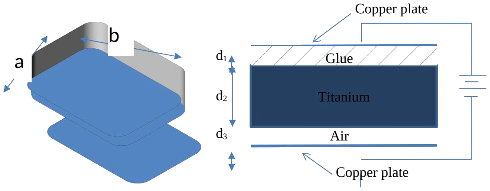
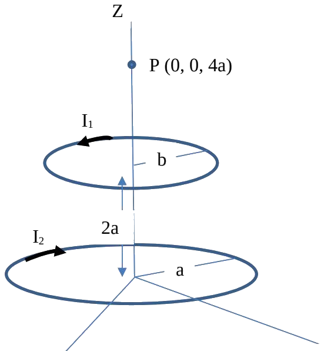
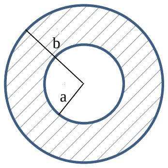
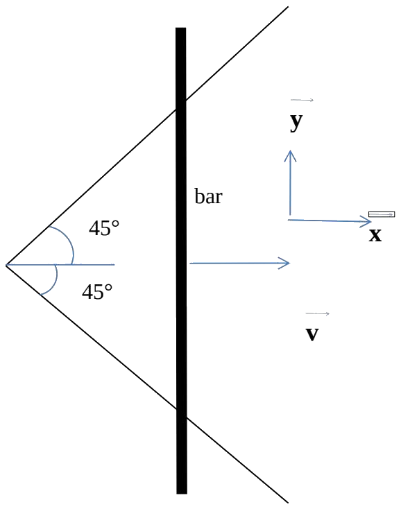
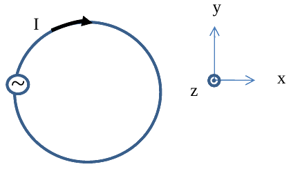
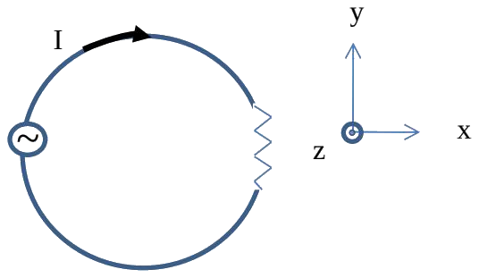

# ECE 106 Final Exam — Spring 2013

Transcribed from [[Final Exam ECE 106 S13-v3]] (`sources/Final Exam ECE 106 S13-v3.pdf`).
Written Aug 6, 2013 — the running page header of the original reads "Winter 2013", which is a leftover from the previous term's template.
Attempt all $5$ questions; all are hand marked and worth $20$ marks each.
No official solutions were released with this paper, so only the statements are transcribed.

---

> [!example] Question 1 — 20 marks
> ## Clumsy Capacitor with Glue and Air Gaps

A clumsy engineer attempts to design a capacitor, but leaves an air gap and a glue gap as shown. The glue has a dielectric constant of $4$, and the material used for the capacitor is titanium dioxide, with a dielectric constant of $110$. The dimensions of the capacitor are shown below.

**(a)** Find the capacitance of the clumsy capacitor. *(7 marks)*

The capacitor is now charged across a $20\ \text{V}$ battery. While connected to the battery, find

**(b)** The potential difference across the titanium dioxide. *(7 marks)*

**(c)** $\vec{D}$ and $\vec{E}$ for the glue and air regions. *(4 marks)*

---

> [!example] Question 2 — 20 marks
> ## Magnetic Field on the Axis of a Current Ring

**(a)** Find the magnetic field due to a ring of radius $R$ and current $I$, at point $P$, a distance $z$ away from the centre of the ring on the axis of symmetry perpendicular to the plane of the ring. You must draw a very clear diagram and justify all your steps. *(8 marks)*

**(b)** Find an expression for the field, for $z \gg R$, in terms of the dipole moment of the ring. Use full vector form. *(4 marks)*

**(c)** Using the result from part (a), find the magnetic field at $P$ due to the two loops carrying currents $I_1$ and $I_2$ as shown. The loop carrying current $I_2$ is in the $xy$ plane and has radius $a$, and the loop carrying current $I_1$ is parallel to the first loop and at a distance of $2a$ above it. *(8 marks)*

---

> [!example] Question 3 — 20 marks
> ## Non-Uniform Current Density in a Cylindrical Conductor

A straight long solid cylindrical conductor of inner radius $a$ and outer radius $b$ carries current $I$ along its length. The current density varies as $J = J_0/r^2$ within the conductor, where $r$ is the radial distance from the axis of symmetry of the conductor. A cross section of the conductor is shown. All parts below have equal marks.

**(a)** Find the constant $J_0$ in terms of the current $I$ and the dimensions of the wire.

**(b)** Find the magnetic field for $r < a$.

**(c)** Find the magnetic field for $r > a$.

**(d)** Find the magnetic field for $a < r < b$, assuming a relative permeability of $1$ ($\mu = \mu_0$).

---

> [!example] Question 4 — 20 marks
> ## Bar Sliding Out Along $45^\circ$ Rails

Consider the wires arranged as shown. An infinitely long bar is moving with speed $v$ in the $+x$ direction. Assume the wires and the bar are conductors such that at the instant shown the resistance of the loop formed by the wires and the bar is $R$. The bar is in perfect contact with the wires as it slides out. The wires do not move. There is a uniform magnetic field of strength $B$ into the page ($-z$ direction) everywhere in space.

**(a)** Calculate the current in the wire as a function of time and indicate whether the current flows up or down in the bar. Explain. *(12 marks)*

**(b)** Calculate the power dissipated as heat in the loop at the instant shown. *(4 marks)*

**(c)** Find the force you have to pull with to keep the bar moving at that speed. *(4 marks)*

---

> [!example] Question 5 — 20 marks
> ## Loop in a Time-Varying Field, and a Solenoid

The figure shows a conducting loop of radius $r = 7\ \text{cm}$ with a current of $I = 0.6\ \text{A}$ flowing in it. The loop is in the $xy$ plane, in a region where there is a uniform external magnetic field given by $\vec{B} = 300\cos(\omega t)\,\hat{z}$ over the entire space where the loop is. The frequency of the time-dependent magnetic field is $10\ \text{GHz}$.

**(a)** Assuming that the magnetic field induced by the current $I$ is much smaller than $\vec{B}$, calculate the induced emf in the loop. Also indicate the value and direction of the induced current associated with the induced emf between $t = 0$ and $t = 0.025\ \text{ns}$. *(5 marks)*

**(b)** By what factor does the inductance of the loop change if the current in the loop, $I$, was increased by a factor of $20$? *(5 marks)*

**(c)** A resistive load is now added to the loop. If it were desirable to reduce the inductance of the loop (and thus the emf induced in the loop), how would you suggest accomplishing that? *(5 marks)*

**(d)** A solenoid of cross section $4\ \text{cm}^2$ has current $I = 0.06\ \text{A}$ running through it. The solenoid is of length $l = 20\ \text{cm}$ and has $60$ tightly wound turns per cm. What resistivity of the material used to make the solenoid would be needed to result in a magnetic field of $3\ \text{mT}$ inside the solenoid? *(5 marks)*
