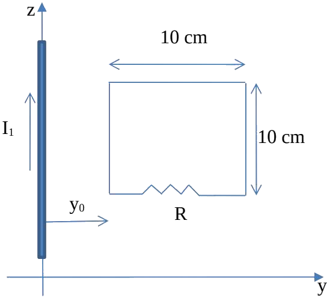
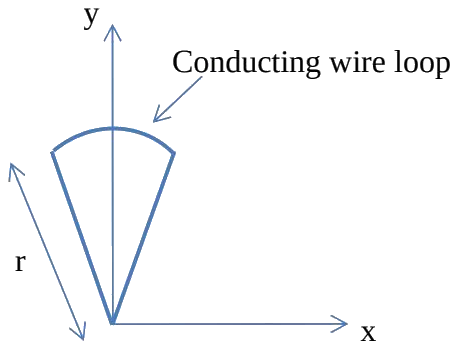
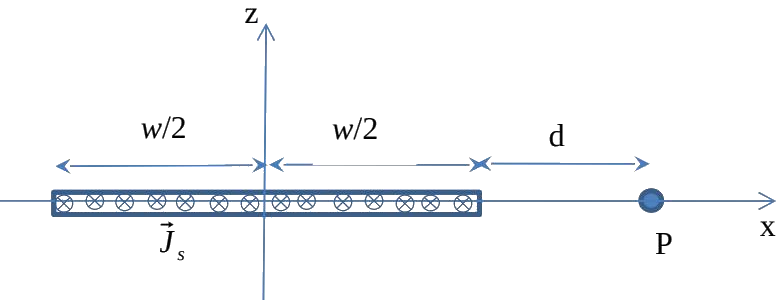
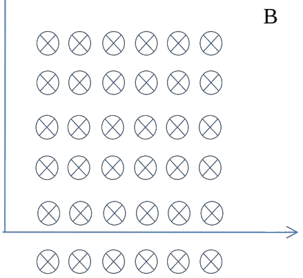

# ECE 106 Final Exam — Winter 2014

Transcribed from [[Final Exam ECE 106 Winter 2014-FD]] (`sources/Final Exam ECE 106 Winter 2014-FD.pdf`).
Written April 8, 2014. Attempt all $5$ questions; all are hand marked and worth $20$ marks each.
No official solutions were released with this paper, so only the statements are transcribed.

---

> [!example] Question 1 — 20 marks
> ## Square Loop Pulled Away from a Long Wire

The square loop shown in the figure is pulled so that it moves away in the $y$-direction from a *long* (infinitely long) wire carrying a current of $I_1 = 12\ \text{A}$ and positioned at $y = 0$. The loop moves at a constant speed of $8\ \text{m/s}$. The surface of the loop is coplanar with the axis of the wire.

**(a)** If a resistance of $R = 10\ \Omega$ is placed within the loop as shown, find the induced current in the loop at the position shown, where the left edge of the loop is a distance $y_0$ from the long wire. *(12 marks)*

**(b)** What force would one have to pull the loop with, to the right, so it moves at the constant speed indicated above when it is at the position shown in the figure? *(3 marks)*

**(c)** Calculate the power dissipated in the loop for the configuration shown in the figure. *(3 marks)*

**(d)** Show that your answer for part (b) can be obtained by considering the mechanical work done by the force you use to pull the loop at a constant speed. *(2 marks)*

---

> [!example] Question 2 — 20 marks
> ## Flux and Induced EMF in a Spinning Wedge Loop

A conducting wire loop shaped like a wedge with a perfectly circular arc at the top as shown is positioned in the $x$-$y$ plane in a region where a magnetic field points in the positive $z$ direction (out of the page). The field is given by $\vec{B} = B_0\cos(\theta)\,\hat{k}$, where $\theta$ is measured clockwise with the $y$ axis at $\theta = 0$. The field occupies the whole space. The length of each straight edge of the wedge-shaped loop is $r$ (as shown) and the arc length is $\pi r/10$.

**(a)** Calculate the area of the circular wedge. *(3 marks)*

**(b)** Calculate the magnetic flux through the wedge for the configuration shown. The $y$ axis bisects the wedge down the middle. *(8 marks)*

**(c)** Find an expression for the induced emf in the wedge if it is made to spin about the origin of coordinates in the $x$-$y$ plane, at angular speed $\omega$ in the clockwise direction. *(Hint: start at an arbitrary position of the loop.)* *(9 marks)*

---

> [!example] Question 3 — 20 marks
> ## Magnetic Field of an Infinite Current Sheet of Finite Width

An infinitely long thin conducting sheet of width $w$ positioned along the $x$ axis lies in the $x$-$y$ plane as shown. The sheet carries a uniform current density of $\vec{J}_s = J_0\,\hat{j}$ Amp/m.

**(a)** Find the total current flowing in the sheet. *(3 marks)*

**(b)** Find the current flowing in the sheet over an infinitesimally small width $dx$. *(3 marks)*

**(c)** Find the magnetic field at the point $P$ due to the current in the sheet. *(14 marks)*

---

> [!example] Question 4 — 20 marks
> ## Solenoid Field, Induced EMF, and Resistivity

**(a)** Starting from basic principles, use Ampère's Law to find the magnetic field inside a solenoid of length $L$ and total number of turns $N$, if current $I$ flows through it. Your diagram should show the Ampère loop very clearly and the integration path, and you should state any necessary assumption to carry out your calculations. Assume the solenoid is very long in comparison to the diameter. Give the value of the magnetic field $B$ for an $11\ \text{cm}$ long solenoid with $60$ turns and a current of $200\ \text{mA}$. The solenoid has a cross section of $0.5\ \text{cm}^2$. *(5 marks)*

**(b)** A square conducting loop of area $0.2\ \text{cm}^2$ is now placed inside the solenoid, close to its centre. The loop area is perpendicular to the axis of the solenoid (the cross section of solenoid and loop are parallel). If an alternating current given by

$$ i(t) = 0.7\sin\left(\frac{2\pi}{0.03}t\right) $$

flows in the solenoid, find an expression for the emf induced in the loop between $t = 0.015$ and $t = 0.03\ \text{s}$. *(7 marks)*

**(c)** The square loop in part (b) is now replaced with an identical loop but made of non-conducting material. What effect will that have on the induced emf in the loop? *(3 marks)*

**(d)** For part (a), if the solenoid was tightly wound (and properly insulated), with no space between turns, what would the resistivity of the material it is made from be? *(5 marks)*

---

> [!example] Question 5 — 20 marks
> ## Electron in a Uniform Field, Torque on a Loop, and an LR Circuit

An electron enters with a velocity of $\vec{v} = 2\times 10^{7}\,\hat{i}\ \text{m/s}$ (parallel to and in the same direction as the positive $x$ axis) a region of uniform magnetic field given by $\vec{B} = B_0\,\hat{j}$ ($\vec{B}$ into the page) as shown, and emerges from the field region $80\ \text{ns}$ later with a velocity vector pointing along the negative $x$ direction.

**(a)** Find the field strength $B_0$. *(7 marks)*

**(b)** Now a loop of radius $r = 3.5\ \text{cm}$ is placed in the region of the field such that its cross section (plane) makes an angle of $17^\circ$ with the direction of the field. Find the torque on the loop when a current of $0.7\ \text{mA}$ flows through it. Express the torque in vector form; the current flows in a clockwise direction. (If there is more than one possible scenario for the configuration of the loop in the field, then you can pick the one you want.) *(5 marks)*

**(c)** This part is not related to the previous two. A current $I = 90\ \text{mA}$ flows in a series LR circuit at $t = 0$, the resistance in the circuit is $1200\ \Omega$, and the current drops to $10$ percent of its value after $600\ \text{ms}$. Find the inductance. You will have to justify your answer fully. (Draw the circuit and derive the expression for the time constant.) *(8 marks)*
