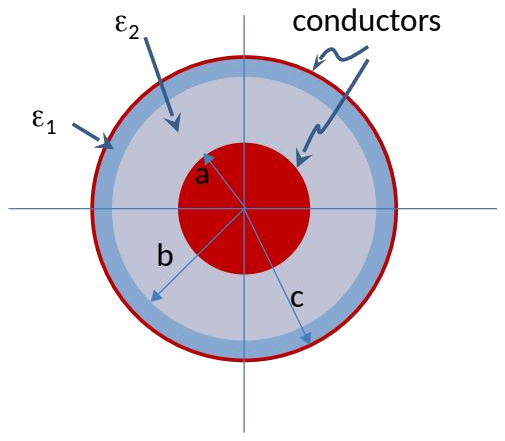
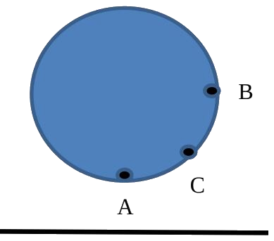
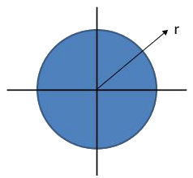
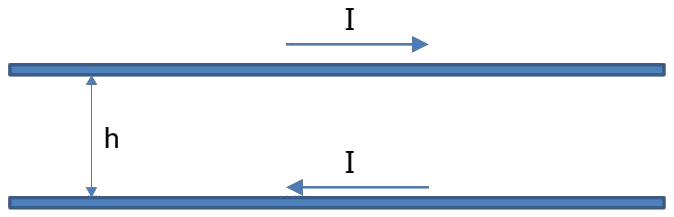
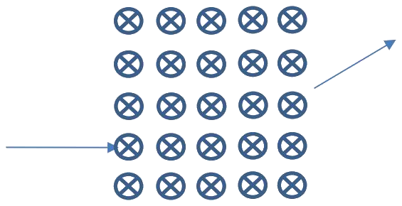
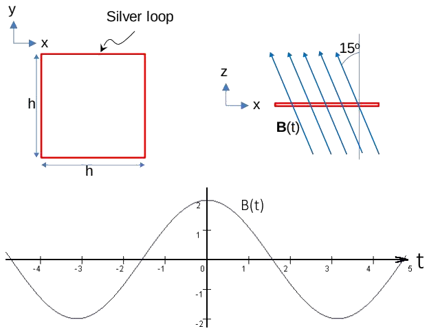

# ECE 106 Final Exam — Winter 2015

Transcribed from [[final-v5]] (`sources/final-v5.pdf`).
Written April 13, 2015 — the cover sheet of the original is titled "Winter 2016", but the date and the running page header both give Winter 2015.
Attempt all $5$ questions; all are hand marked and worth $20$ marks each. Where the original omits a per-part mark allocation, none is shown here.
No official solutions were released with this paper, so only the statements are transcribed.

---

> [!example] Question 1 — 20 marks
> ## Two-Layer Coaxial Line, and a Dielectric Ball above a Charged Sheet

**Part A)** A clumsy engineer (not a UW graduate for sure) built a coaxial transmission line but he forgot to strip the insulation from the outer conductor. He ended up with a coaxial line that effectively has two dielectric layers as shown in the figure below. The radius of the inner conductor is $a = 0.5\ \text{cm}$, the inner filling between $a < r < b$ has a relative dielectric permittivity of $\varepsilon_2 = 5$, and the insulation in $b < r < c$ has a relative dielectric permittivity of $\varepsilon_1 = 3$. Assume $b = 0.7\ \text{cm}$ and $c = 0.75\ \text{cm}$.

**(a)** Find the per-unit-length capacitance of the line (has units of Farads/m).

**(b)** State the assumptions you used to find the capacitance.

**Part B)** The ball shown is a dielectric of dielectric constant $\varepsilon_r$ and radius $R$. It is placed above a large, uniformly charged sheet, with charge density $+\sigma$.

**(a)** Find the potential difference between points $A$ and $B$. These points are just inside the sphere. *(5 marks)*

**(b)** Find the strength of the electric field at point $C$, midway between points $A$ and $B$, just on the inside of the material. *(4 marks)*

---

> [!example] Question 2 — 20 marks
> ## Resistance of a Cable with Non-Uniform Current Density, and the Field of a Ring

**Part A** Consider a conducting cable with a uniform circular cross section as shown in the figure below. Assuming that the current density in the cable is not uniform and is given by $\sigma_s = r^3 \, (\ohm^{-1}/m^3)$, where $r$ is the radial coordinate, find the resistance of the cable per unit length.

**Part B** *(Straight Derivation)* From first principles, find the magnetic field (flux density) $\vec{B}$ due to a ring of current of radius $R$ at the centre of the ring with current $I$ flowing in it. Express it in terms of the ring's magnetic dipole moment. *(10 marks)*

---

> [!example] Question 3 — 20 marks
> ## Self-Inductance of a Two-Line Transmission Line

A two-line transmission line system is made of two lines as shown. One line is for the outgoing current and the second for the incoming current. The vertical separation between the two lines is $h = 15\ \text{m}$. Assume the lines are very thin and the current to be $25.5\ \text{A}$. All parts of equal value.

**(a)** Find the self-inductance of the transmission line if the line is $1000\ \text{m}$ long.

**(b)** Sketch the strength of the magnetic field in the space between the two lines.

**(c)** State the assumptions you used to find the inductance.

**(d)** How will the inductance change if this line system were installed in Jakarta, Indonesia, where the humidity is high such that the air will have a relative dielectric permittivity of $10$? Explain your answer.

**(e)** Recalculate the inductance, but this time for a current of $51\ \text{A}$.

---

> [!example] Question 4 — 20 marks
> ## Magnetic Lens for an Electron Microscope

A magnetic lens is being tested for potential use in an electron microscope. An electron beam with electrons moving at speed $v$ along the positive $y$ direction is fired into a region where the magnetic field points along the positive $x$ direction. The electron beam is seen to exit the field region $0.3\ \text{ms}$ later, such that it makes an angle of $24^\circ$ (deflection angle) with the direction of incidence, having traversed the full width of the field region. All parts of equal value.

**(a)** Find the strength of the magnetic field.

**(b)** The distance between the point of entrance and the point of exit is measured to be $0.3\ \text{mm}$. Find the speed of the electrons.

**(c)** The potential difference through which the electrons are accelerated before they enter the magnetic field region is now quadrupled. What is the new angle of deflection?

**(d)** It is now desired to restore the original angle of deflection by using an electric field pointing along the $z$ direction within the magnetic field region. Find the strength of the electric field.

---

> [!example] Question 5 — 20 marks
> ## Induced EMF in a Silver Loop in a Tilted, Oscillating Field

Consider a square loop made of silver, which is a very highly conducting material. A magnetic field is directed such that it makes an angle of $15^\circ$ from the normal to the loop as shown in the figure below. The magnetic field is varying with time as

$$ B(t) = 2\cos(\omega t)\ \text{Tesla}, \qquad \omega = \frac{2\pi}{6.4} $$

The period of the sinusoidal signal for $B(t)$ is $6.4$ seconds. During the interval $0 < t < 1.6$ seconds, the field is out of the board (has $x$ and $z$ components). In $1.6 < t < 4.8$ seconds, the field is into the board (has $x$ and $z$ components). Assume $h = 5\ \text{cm}$. The negative time axis is there for completeness only.

**(a)** Find the induced EMF in the loop.

**(b)** Assuming the net resistance of the entire loop is $0.01\ \Omega$, calculate the current induced in the loop and make sure you indicate its direction over each cycle for the interval $0 < t < 4.8\ \text{s}$. Define your convention for direction of the current. Plot the current as a time-varying signal on the same plot as the $B(t)$ given above.

**(c)** How can you measure the induced EMF in the loop? You are free to cut and insert elements in the loop to facilitate the measurement.

**(d)** If the silver material of the loop is replaced with Plexiglas having a relative dielectric permittivity of $2.1$ and conductivity of zero, by what percentage would the induced EMF in the loop change? Explain and justify your answer.
