> [!fact] Predictions
> ### Switched circuit without coil

In an ideal circuit with resistance only, this circuit changes instantly. The function $I_R(t)$ can be defined using the Heaviside function:
$$\begin{aligned} 
\text{Close switch at } t=0 &: \quad I_R(t) = I_\text{max} \ H(t) \\
\text{Open switch at } t=0 &: \quad I_R(t) = I_\text{max} \ H(-t) \\
\text{Where } H(t) & = \begin{cases}
0 \quad (t<0) \\
1 \quad (t>0)
\end{cases}
\end{aligned}$$

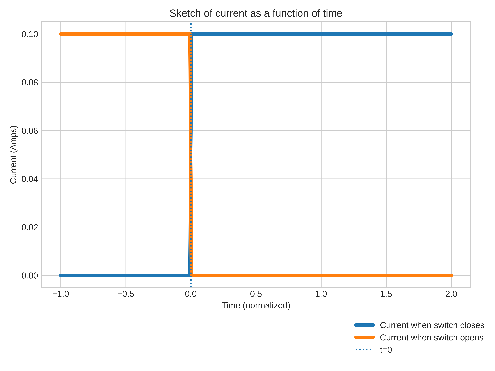

---

> [!fact] Predictions
> ### Switched circuit with coil

This is a classic **L-R Circuit**, therefore the charging and dis-charging can be described using the standard function from ECE140:
$$\begin{aligned} 
\text{Close switch at } t=0 &: \quad I_R(t) = I_\text{max} \left(1-e^{-t/\tau} \right) \\
\text{Open switch at } t=0 &: \quad I_R(t) = I_\text{max} \ e^{-t/\tau} \\
\text{Where } \tau & \text{ is the time constant.}
\end{aligned}$$

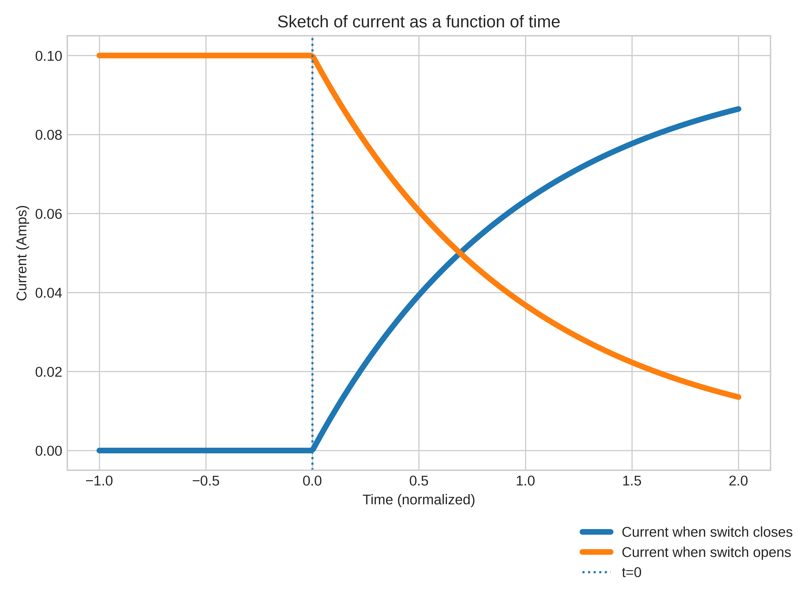

---

> [!example] Measurement
> ### Rising Step Function without Coil

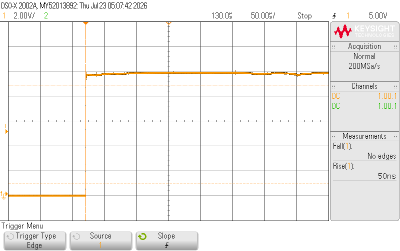

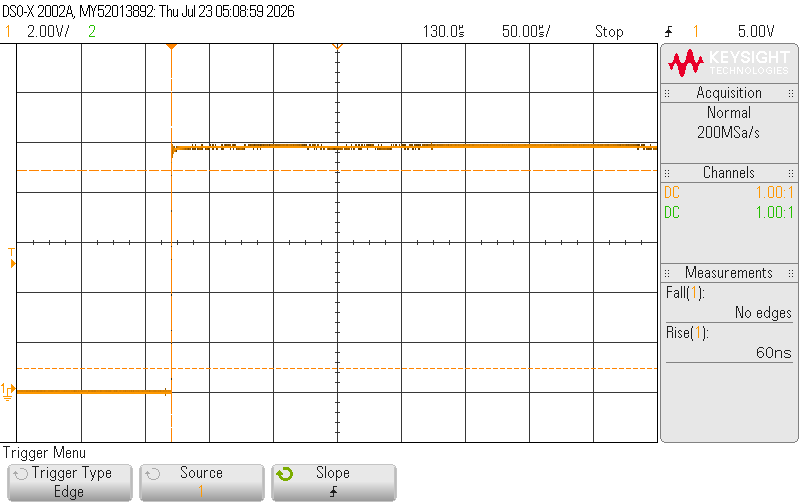

|   Trial   |   1    |   2    |   3    |
| :-------: | :----: | :----: | :----: |
| Rise time | $50ns$ | $50ns$ | $60ns$ |

---

> [!example] Measurement
> ### Rising Step Function with Coil

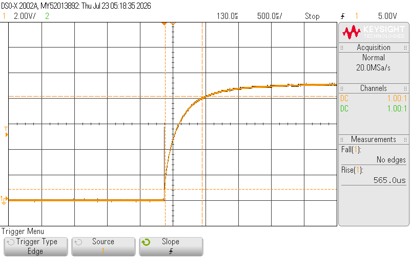

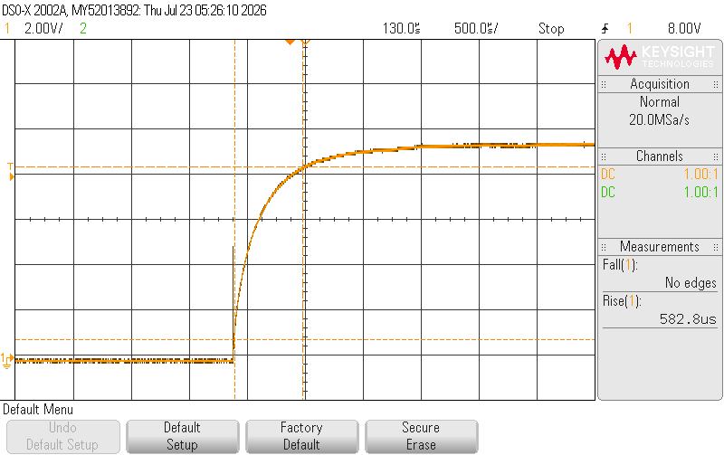

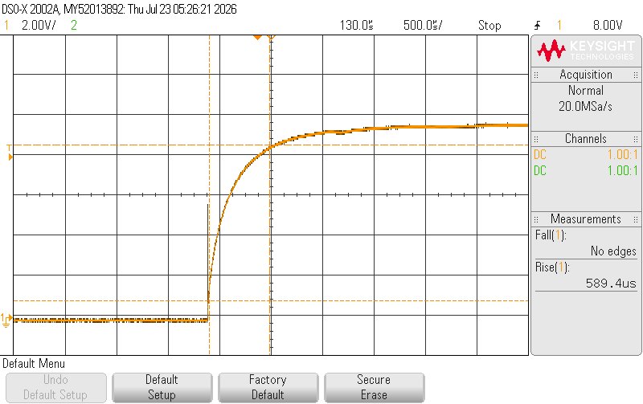

|   Trial   |       1       |       2       |       3       |
| :-------: | :-----------: | :-----------: | :-----------: |
| Rise time | $565.0 \mu s$ | $582.8 \mu s$ | $589.4 \mu s$ |

---

> [!example] Measurement
> ### Falling Step Function without Coil

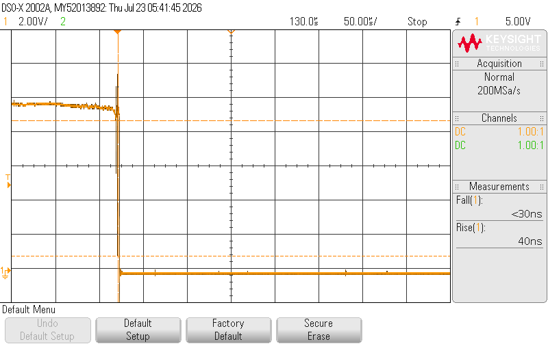

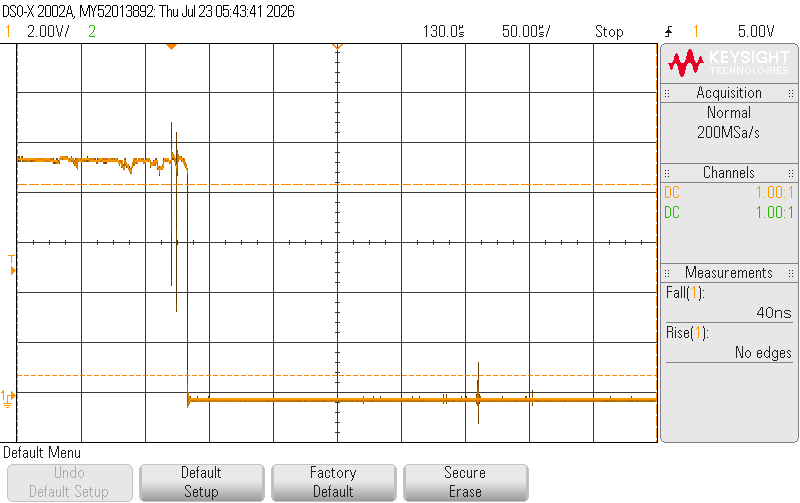

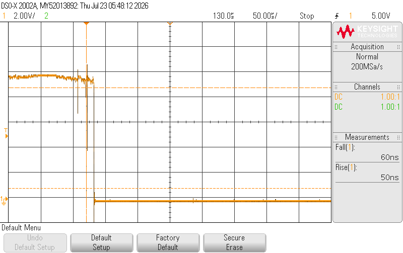

|   Trial   |   1    |   2    |   3    |
| :-------: | :----: | :----: | :----: |
| Rise time | $30ns$ | $40ns$ | $60ns$ |

---

> [!example] Measurement
> ### Falling Step Function with Coil

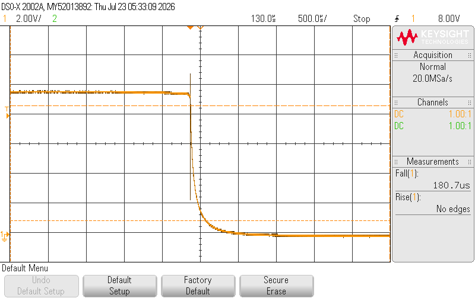

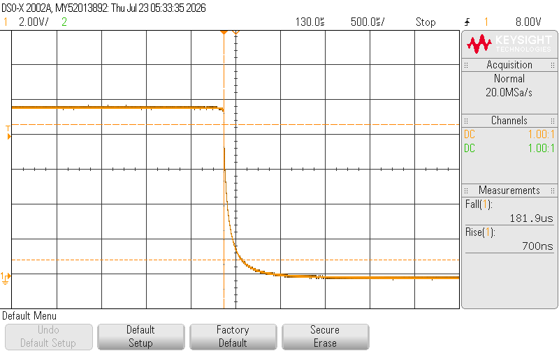

|   Trial   |       1       |       2       |       3       |
| :-------: | :-----------: | :-----------: | :-----------: |
| Rise time | $180.7 \mu s$ | $181.9 \mu s$ | $181.4 \mu s$ |
