Topics: Magnetic Flux, Faraday Law, and Lenz Law

## **1. Magnetic Flux:**

$$\phi_m = \int \vec{B} \cdot \vec{ds}$$

**2. Faraday Law:** states that if the magnetic flux enclosed within a closed loop changes with time, then electric field is created which loops around the changing magnetic flux

$$V_{emf} = \oint \vec{E} \cdot \vec{dl} = -\frac{d\phi_m}{dt} = -\frac{d}{dt} \left( \int \vec{B} \cdot \vec{ds} \right)$$

- **1. Lenz Law:** The negative sign in the above equation is called the Lenz Law. It tells us that the electric field is created in such a way that it opposes the rate of change of magnetic flux.
- 2. Say we have a conducting loop with a closed circuit, the induced current can flow through the loop. The induced current produces its own magnetic field (). will be in a direction opposite to how the original magnetic field is changing with time, NOT OPPOSITE TO THE ORIGINAL MAGNETIC FIELD.

For example, consider a following loop with external magnetic field pointing upwards and

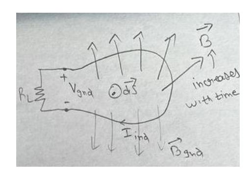

a. Increasing with time. The will be such that it opposes the change i.e. will oppose the increase in the external B, and thus, the will point down, trying to keep the total magnetic field same, and therefore the induced current will flow in **clockwise** direction

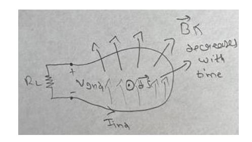

2 b. Decreasing with time. The will be such that it opposes the change i.e. will oppose the decrease in the external B, and thus, the will point up, trying to keep the total magnetic field same, and therefore the induced current will flow in **counterclockwise** direction

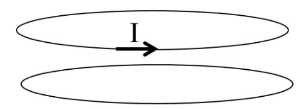

## Ans 1:

- a) Because the current I is not changing, thus the magnetic flux through the bottom loop is not changing with time. Therefore, there will be no induced current in the bottom loop
- b) In this case the magnetic field is increasing so does the flux, and using right hand rule we can determine the direction of magnetic flux through the bottom loop due to I current. The flux through the bottom loop, due to I current in the upper loop, points in upward direction. and Lenz law tells us that the induced current opposes the change in the flux. In this case, the flux is increasing, to oppose the increase in the flux, the induced current should orient itself in such a way that the associated induced magnetic field is in opposite direction as of the magnetic field due to I current. So, the induced magnetic field should point in downward direction and using right hand rule, the induced current should flow clockwise, and both loops tend to repel each other.
- 3 c) Similarly, in this case the induced magnetic field should point in upward direction, and the induced current should flow counterclock wise, and both loop tend to attract each other.

- **Q2**

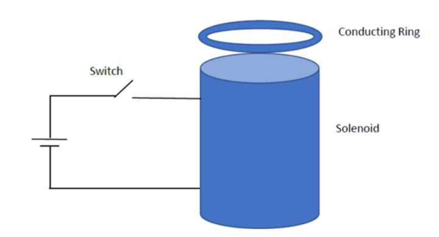

## Ans 2:

- a) When the switch is closed, the magnetic flux through the solenoid tend to increase for some time before reaching a steady state. During that time, the induced current in the ring should be such that the associated induced magnetic field is in opposite direction to the magnetic field in the solenoid. Since, the magnetic fields oppose, ring should be pushed away and rise or levitate for some time (depending on the mass of the ring). Once the current in the solenoid reaches its peak value, the ring falls back.
- b) During first half of the positive cycle, the ring experiences repulsion from the solenoid and second half of the positive cycle, the ring experiences attraction from the solenoid, and so on.
- c) If there is a small cut in the loop, there will be induced EMF but no induced current. There will be no induced magnetic field, and the loop should stay as it is without any movement.

Ans 3: If there is uniform magnetic field and the loop moves across the uniform magnetic field, the term rate of change of flux is zero because the total flux through the loop remain same at all times. Therefore, there is no induced current.

Q4

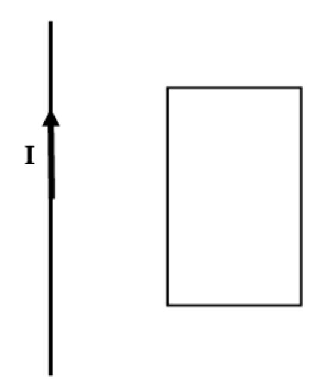

Ans 4:

- a) along the line
- b) Rotated around the line

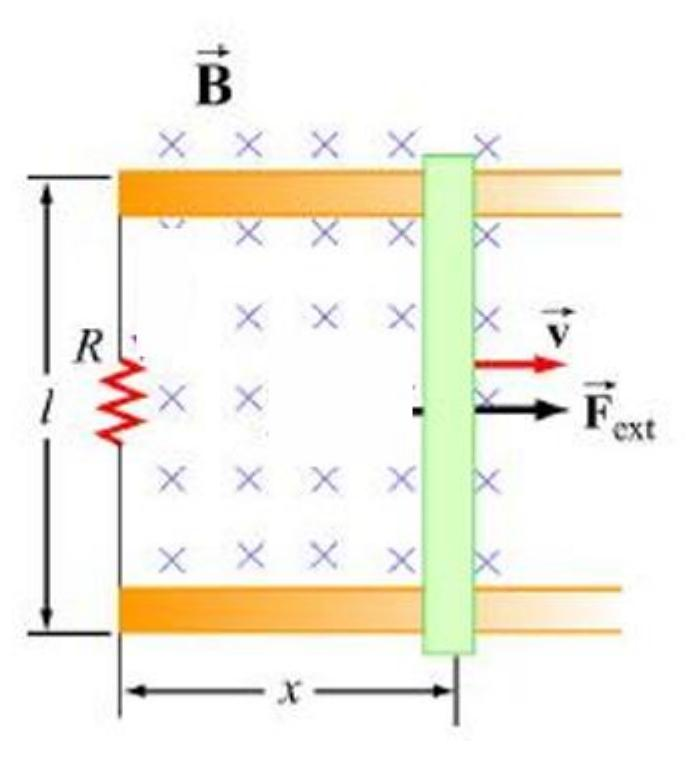

Ans 5:

As the bar moves to the right, the flux through the loop increases. The induced current should be such that it opposes the increase in the flux which means the induced magnetic field should be in opposite direction as of the external magnetic field which is directed into the page. Therefore, the induced magnetic field should be out of the page, and using right hand rule, the induced current should be counterclockwise.

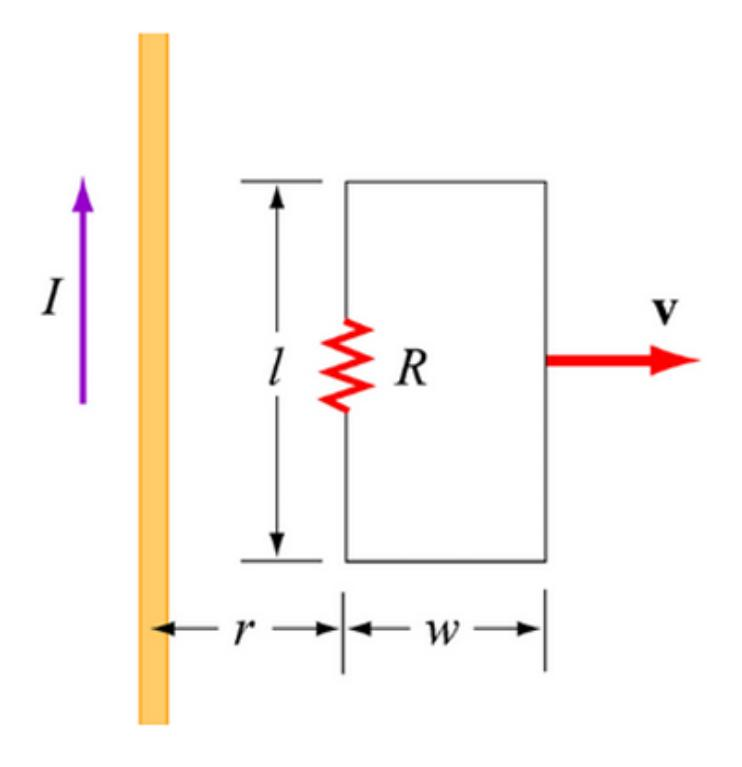

Ans 6:

As the rectangular loop moves to the right, the flux through the loop decreases. The induced current should be such that it opposes the decrease in the flux which means the induced magnetic field should have same direction as of the magnetic field due to the current carrying conductor which is directed into the page. Therefore, the induced magnetic field should also be into the page, and using right hand rule, the induced current should be clockwise.

**Exercise 5-4:** A horizontal wire with a mass per unit length of 0.2 kg/m carries a current of 4 A in the +x direction. If the wire is placed in a uniform magnetic flux density **B**, what should the direction and minimum magnitude of **B** be in order to magnetically lift the wire vertically upward? (*Hint:* The acceleration due to gravity is  $\mathbf{g} = -\hat{\mathbf{z}}9.8 \text{ m/s}^2$ .)

| Ans 7 Ma | Density = 0.2 Kg/m $ T = 44 \hat{\chi} $ $ \vec{B} = 6 \hat{k}, 9 = -29.8 \frac{m}{Sec^2} $ T |
|----------|-----------------------------------------------------------------------------------------------|
|          | $\vec{F}_{q} = mq(-2)$                                                                        |
|          | $\vec{F}_{m} = I(\vec{M} \times \vec{B})$                                                     |
|          | Fg + Fm = 0                                                                                   |
|          | mg (-2) = -I ( dl 2 x 0, g)                                                                   |
|          | mq = I (LBo)                                                                                  |
|          | Bo= m & I => Bo = 0/8 x 2/8 x 1/ x1                                                           |
|          | Do= 4.9 T / B = 4.9 g                                                                         |

## Induced EMF = Transformer EMF + Motional EMF

$$V_{\rm emf}^{\rm tr} = -N \int_{S} \frac{\partial \mathbf{B}}{\partial t} \cdot d\mathbf{s},$$
 (transformer emf)

$$V_{\text{emf}}^{\text{m}} = \oint_C (\mathbf{u} \times \mathbf{B}) \cdot d\mathbf{l}.$$
 (motional emf)

An inductor is formed by winding N turns of a thin conducting wire into a circular loop of radius a. The inductor loop is in the x-y plane with its center at the origin and connected to a resistor R, as shown in **Fig. 6-3**. In the presence of a magnetic field  $\mathbf{B} = B_0(\hat{\mathbf{y}}2 + \hat{\mathbf{z}}3)\sin\omega t$ , where  $\omega$  is the angular frequency, find

- (a) the magnetic flux linking a single turn of the inductor,
- (b) the transformer emf given that N = 10,  $B_0 = 0.2$  T, a = 10 cm, and  $\omega = 10^3$  rad/s,
- (c) the polarity of  $V_{\text{emf}}^{\text{tr}}$  at t = 0, and
- (d) the induced current in the circuit for  $R = 1 \text{ k}\Omega$  (assume the wire resistance to be much smaller than R).

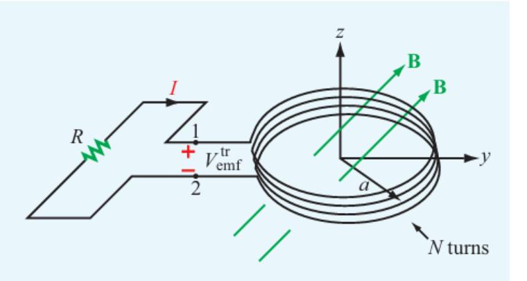

**Figure 6-3** Circular loop with *N* turns in the *x*–*y* plane. The magnetic field is  $\mathbf{B} = B_0(\hat{\mathbf{y}}2 + \hat{\mathbf{z}}3) \sin \omega t$  (Example 6-1).

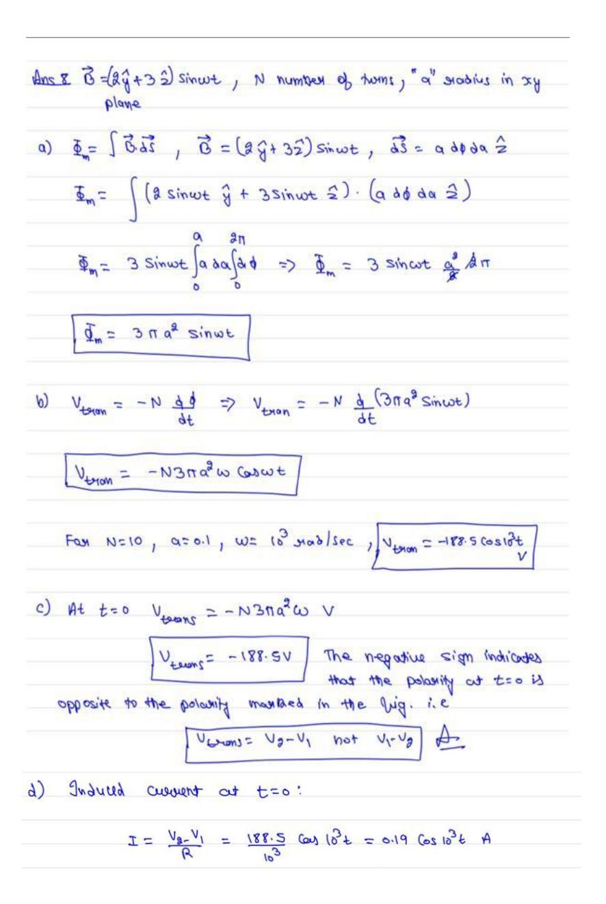

Determine voltages  $V_1$  and  $V_2$  across the 2  $\Omega$  and 4  $\Omega$  resistors shown in **Fig. 6-4**. The loop is located in the x-y plane, its area is 4 m2, the magnetic flux density is  $\mathbf{B} = -\hat{\mathbf{z}}0.3t$  (T), and the internal resistance of the wire may be ignored.

Q9

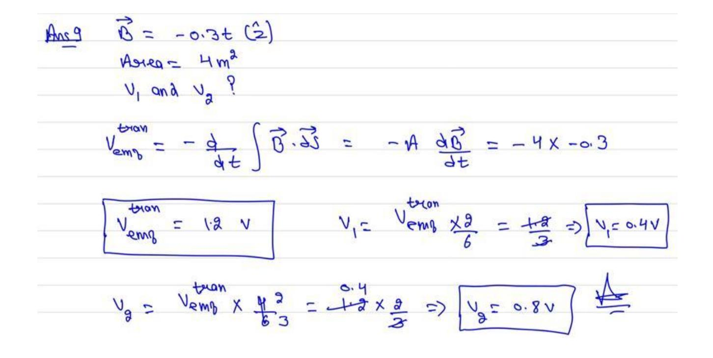

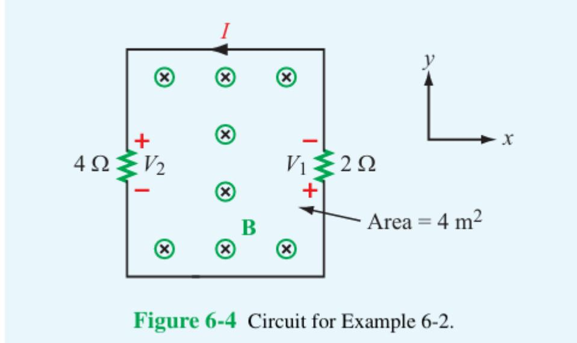

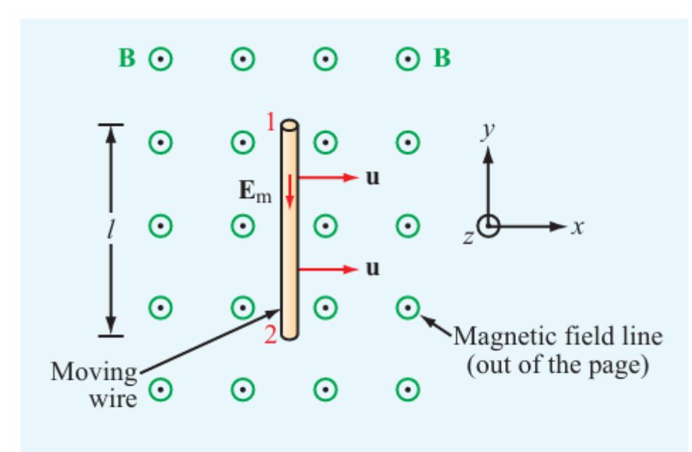

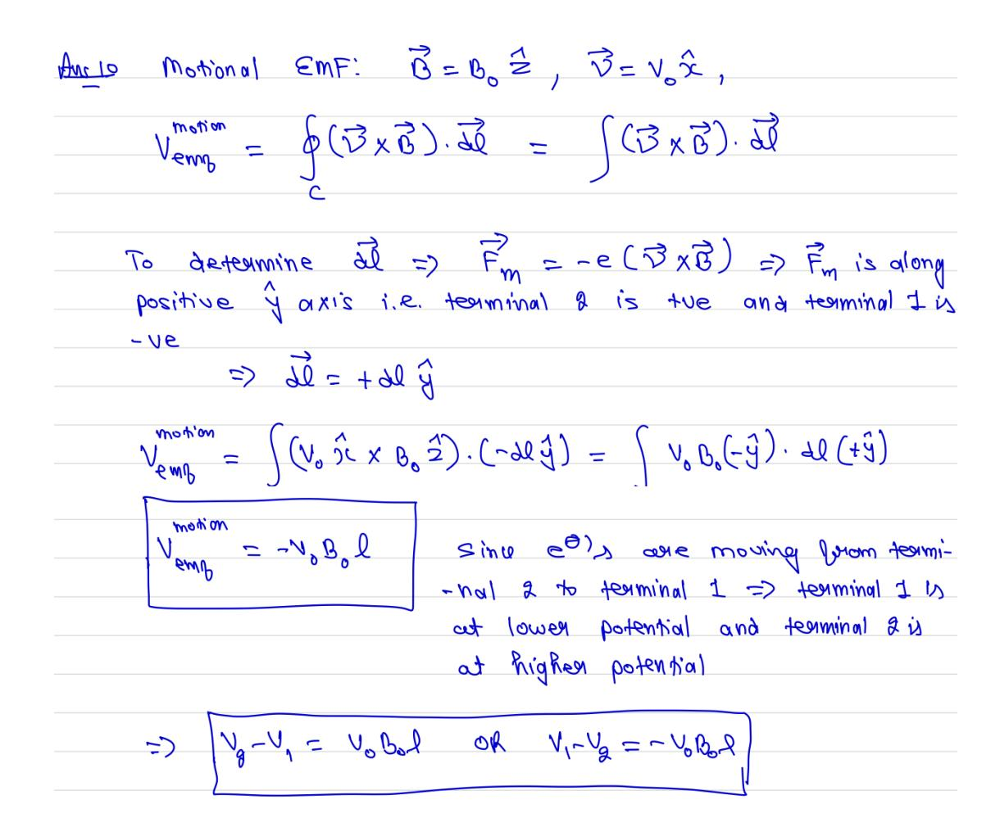

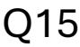

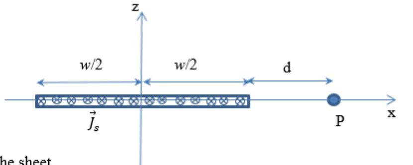

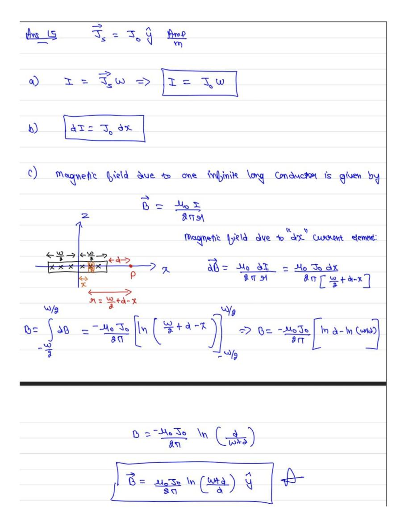

Q11

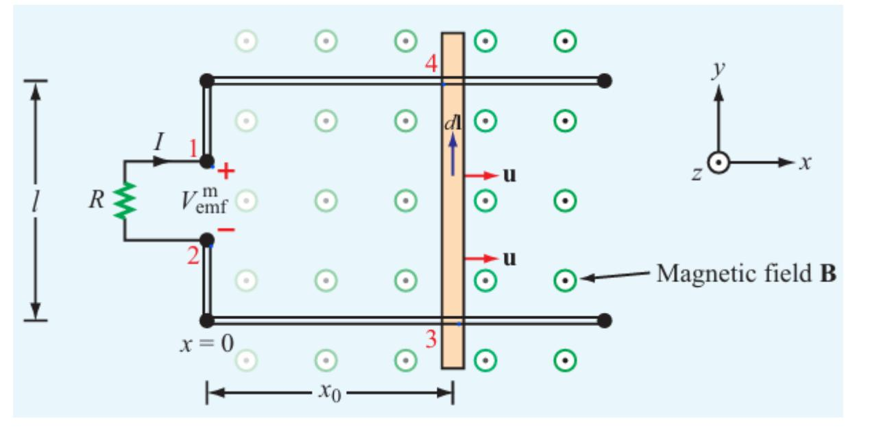

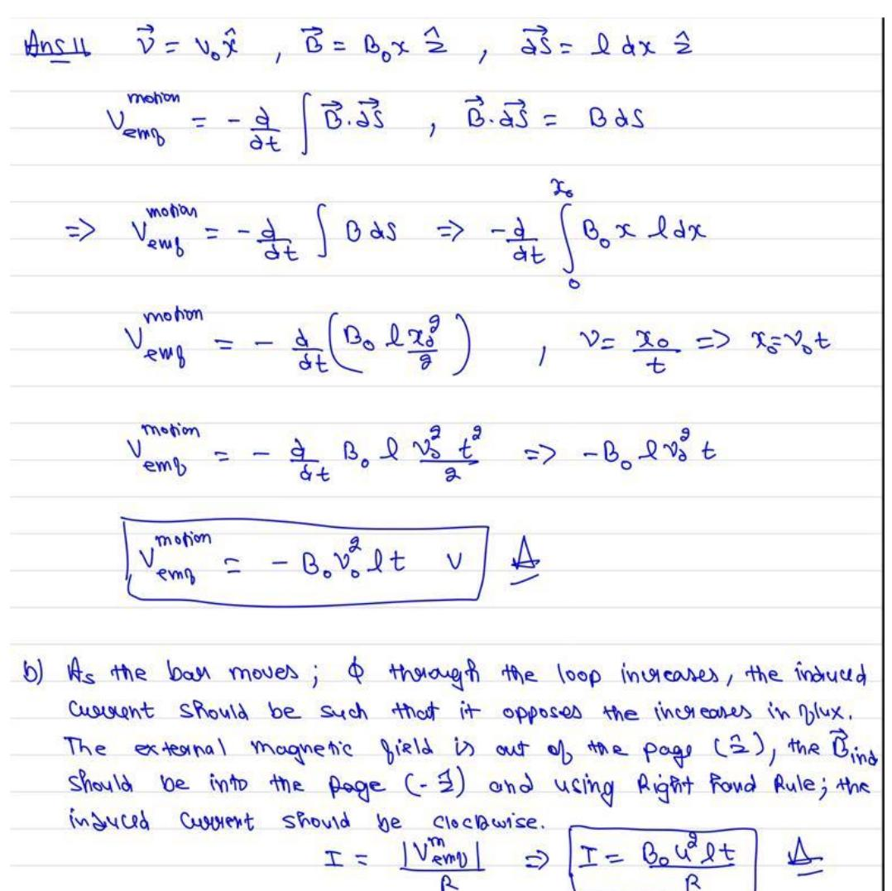

The rectangular loop shown in **Fig. 6-9** is situated in the x-y plane and moves away from the origin with velocity  $\mathbf{u} = \hat{\mathbf{y}}5$  (m/s) in a magnetic field given by

$$\mathbf{B}(y) = \hat{\mathbf{z}} 0.2e^{-0.1y}$$
 (T).

If  $R = 5 \Omega$ , find the current I at the instant that the loop sides are at  $y_1 = 2$  m and  $y_2 = 2.5$  m. The loop resistance may be ignored.

The induced voltage  $V_{12}$  is then given by

$$V_{12} = \int_{2}^{1} [\mathbf{u} \times \mathbf{B}(y_{1})] \cdot d\mathbf{l}$$

$$= \int_{l/2}^{-l/2} (\hat{\mathbf{y}} 5 \times \hat{\mathbf{z}} 0.2e^{-0.2}) \cdot \hat{\mathbf{x}} dx$$

$$= -e^{-0.2} l$$

$$= -2e^{-0.2}$$

$$= -1.637 \qquad (V).$$

Similarly,

$$V_{43} = -uB(y_2) l$$
  
=  $-5 \times 0.2e^{-0.25} \times 2$   
=  $-1.558$  (V).

Consequently, the current is in the direction shown in the figure and its magnitude is

$$I = \frac{V_{43} - V_{12}}{R} = \frac{0.079}{5} = 15.8 \text{ (mA)}.$$

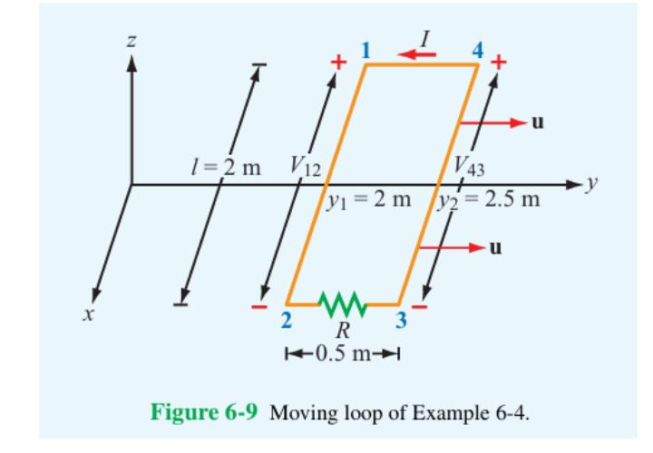

- Q13

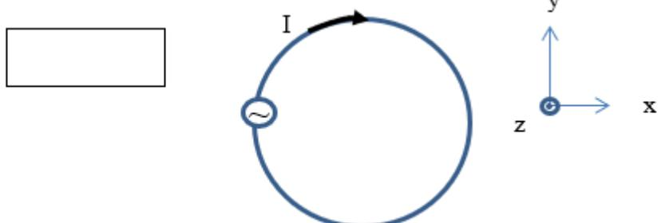

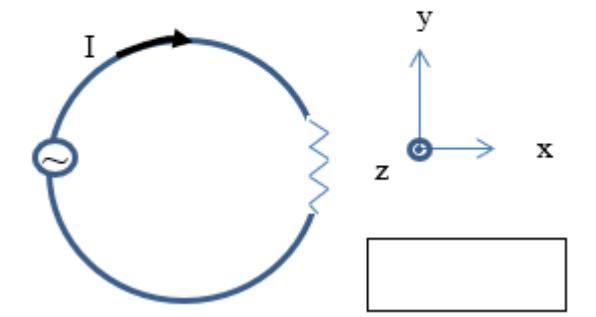

- Q14

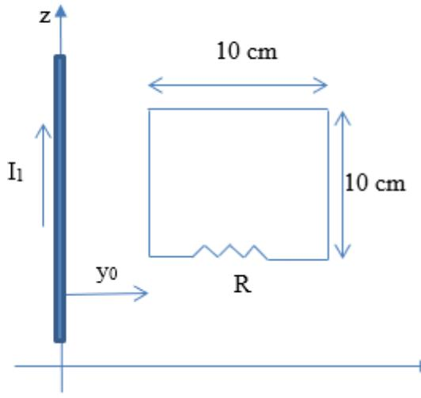