Problem 1: A hemispherical surface of radius is uniformly charged with a charge density of . The medium is air. Compute the electric field intensity vector at the center of the hemisphere.

## Solution:

Due to symmetry, we only have component.

$$E_{z} = \int dE_{z} = -\int \cos(\theta) dE = -\int \cos(\theta) \frac{dQ}{4\pi\varepsilon_{0}a^{2}} = -\int \cos(\theta) \frac{\rho_{S}(ad\theta)(a\sin(\theta) d\varphi)}{4\pi\varepsilon_{0}a^{2}}$$

$$= -\int_{\theta=0}^{\frac{\pi}{2}} \int_{\varphi=-\pi}^{\pi} \cos(\theta) \frac{a^{2}\rho_{S}\sin(\theta) d\varphi d\theta}{4\pi\varepsilon_{0}a^{2}}$$

$$= -\int_{\theta=0}^{\frac{\pi}{2}} \cos(\theta) \frac{a^{2}\rho_{S}\sin(\theta) d\theta}{4\pi\varepsilon_{0}a^{2}} \times 2\pi = -\frac{\rho_{S}}{2\varepsilon_{0}} \int_{\theta=0}^{\frac{\pi}{2}} \cos(\theta) \sin(\theta) d\theta$$

$$= -\frac{\rho_{S}}{2\varepsilon_{0}} \int_{\theta=0}^{\frac{\pi}{2}} \frac{\sin(2\theta)}{2} d\theta = -\frac{\rho_{S}}{2\varepsilon_{0}} \times \frac{1}{2} \times \frac{-\cos(2\theta)}{2} \Big|_{0}^{\pi/2} = -\frac{\rho_{S}}{4\varepsilon_{0}}$$

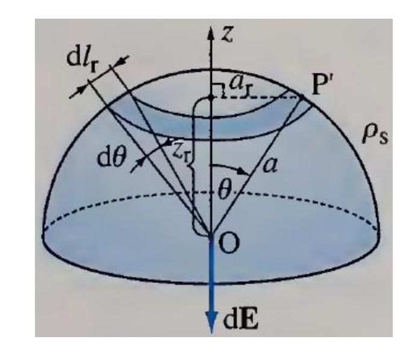

Problem 2: Charge (Q) is distributed uniformly over a volume of a sphere as shown below in the figure. The sphere has a radius of "a" meters. Find an:

- Electric field at a point P outside the sphere.
- Electric field at a point P inside the sphere.

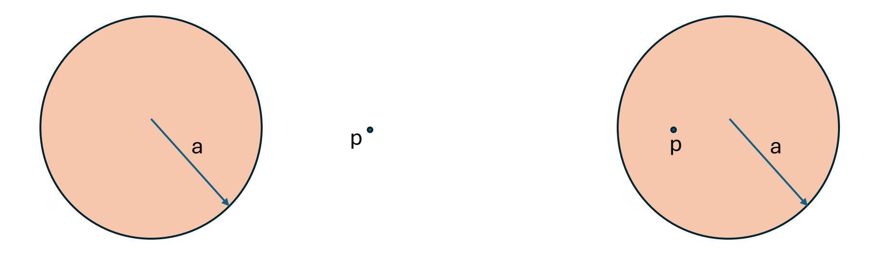

Solution 2a: Electric field at a point P outside the sphere:

$$\epsilon_{o} \oiint \vec{E}.\overrightarrow{ds} = Q_{enclosed}$$

$$\epsilon_{o}E \oiint \vec{ds} = \iiint \rho_{v} dv$$

$$\epsilon_{o}E \oiint r d\theta rsin(\theta) d\phi = \rho_{v} \iiint dv$$

$$\epsilon_{o}E r^{2} \oiint sin(\theta) d\theta d\phi = \rho_{v} \iiint dr r d\theta rsin(\theta) d\phi$$

$$\epsilon_{o}E r^{2} \int_{0}^{\pi} sin(\theta) d\theta \int_{0}^{2\pi} d\phi = \rho_{v} \int_{0}^{a} r^{2} dr \int_{0}^{\pi} sin(\theta) d\theta \int_{0}^{2\pi} d\phi = \rho_{v} \int_{0}^{a} r^{2} dr \int_{0}^{\pi} sin(\theta) d\theta \int_{0}^{2\pi} e_{o}E r^{2} 2\pi [-\cos(\theta)]_{0}^{\pi} = \rho_{v} \left[\frac{r^{3}}{3}\right]_{0}^{a} * [-\cos(\theta)]_{0}^{\pi} * [\phi]_{0}^{2\pi}$$

$$\epsilon_{o}E r^{2} * 2\pi * 2 = \rho_{v} * \frac{a^{3}}{3} * 2 * 2\pi$$

$$E = \rho_{v} * \frac{a^{3}}{3} * \frac{1}{r^{2} * \epsilon_{o}}$$

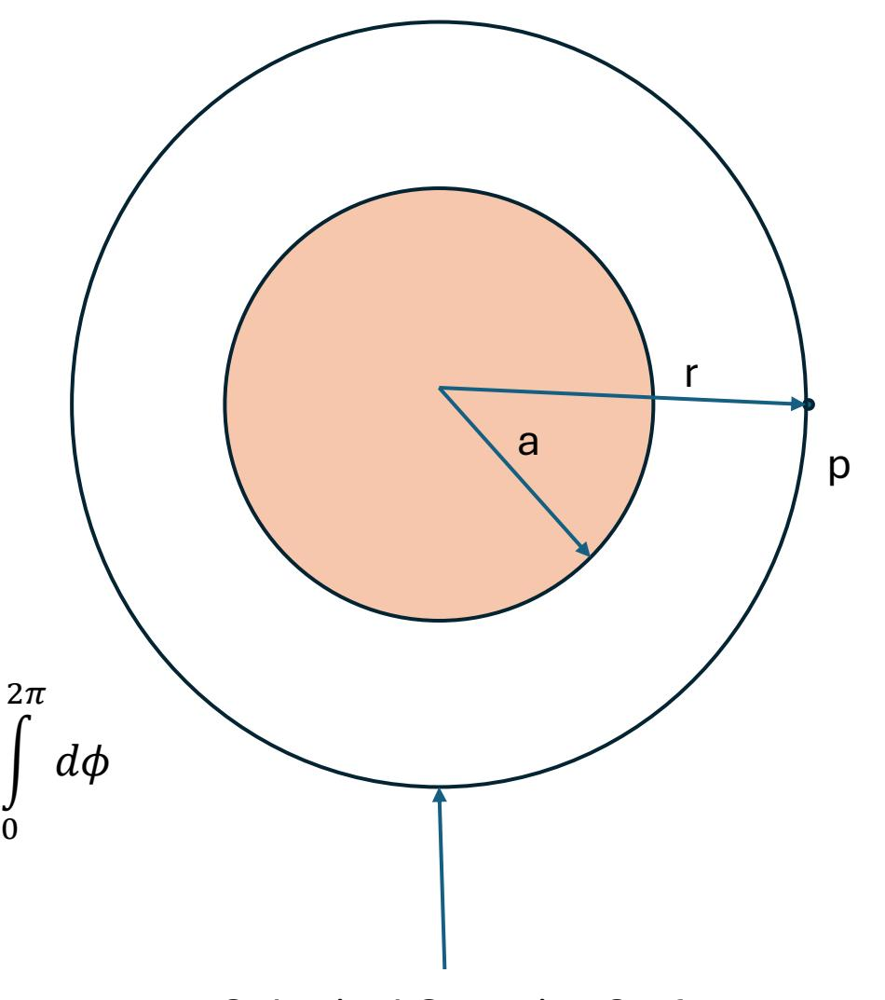

Spherical Gaussian Surface

Solution 2a: The answer in terms of total charge instead of density

$$E = \rho_{v} * \frac{a^{3}}{3} * \frac{1}{r^{2} * \epsilon_{o}}$$

$$\rho_{v} = \frac{Q}{V} = \frac{Q}{\frac{4\pi a^{3}}{3}} = \frac{3Q}{4\pi a^{3}}$$

$$E = \frac{3Q}{4\pi a^{3}} * \frac{a^{3}}{3} * \frac{1}{r^{2} * \epsilon_{o}}$$

$$E = \frac{Q}{4\pi} * \frac{1}{r^{2} * \epsilon_{o}}$$

$$E = \frac{1}{4\pi \epsilon_{o}} * \frac{Q}{r^{2}}$$

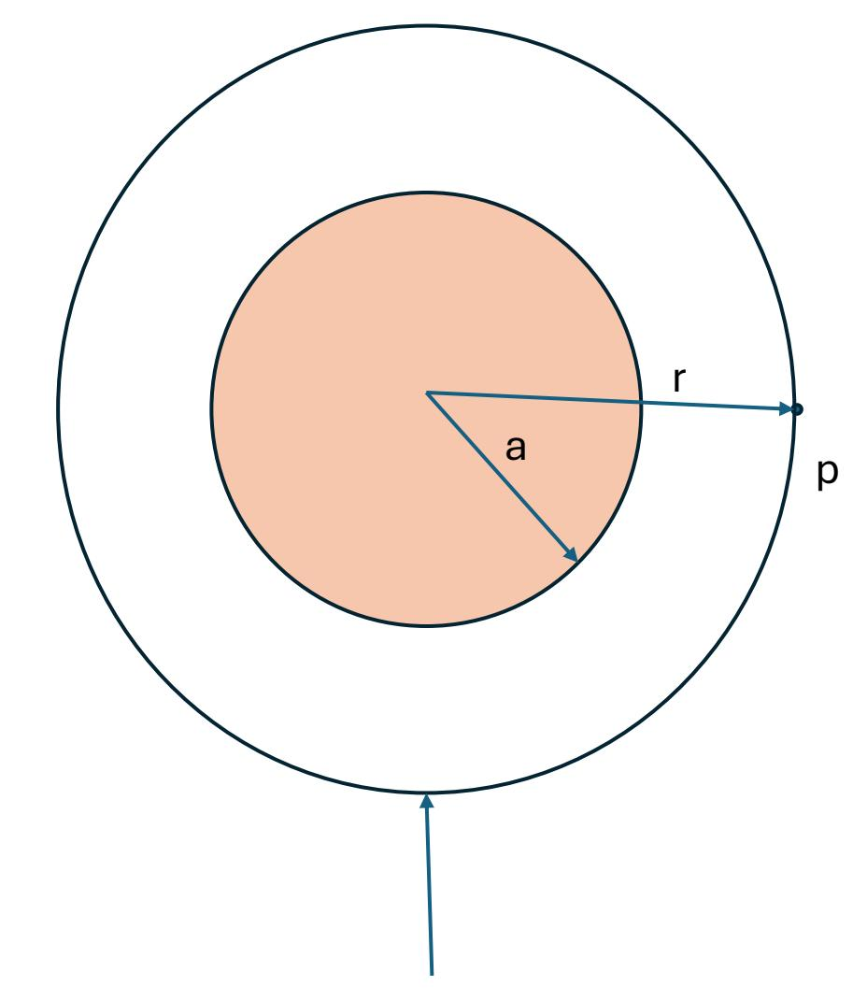

Spherical Gaussian Surface

Solution 2b: Electric field at a point P outside the sphere:

$$\epsilon_{o}E \oiint \overrightarrow{ds} = \iiint \rho_{v} dv$$

$$\epsilon_{o}E \oiint r d\theta r sin(\theta) d\phi = \rho_{v} \iiint dv$$

$$\epsilon_{o}E r^{2} \oiint sin(\theta) d\theta d\phi = \rho_{v} \iiint dr r d\theta r sin(\theta) d\phi$$

$$\epsilon_{o}E r^{2} \int_{0}^{\pi} sin(\theta) d\theta \int_{0}^{2\pi} d\phi = \rho_{v} \int_{0}^{r} r^{2} dr \int_{0}^{\pi} sin(\theta) d\theta \int_{0}^{2\pi} d\phi$$

$$\epsilon_{o}E r^{2} 2\pi [-\cos(\theta)]_{0}^{\pi} = \rho_{v} \left[\frac{r^{3}}{3}\right]_{0}^{r} * [-\cos(\theta)]_{0}^{\pi} * [\phi]_{0}^{2\pi}$$

$$\epsilon_{o}E r^{2} * 2\pi * 2 = \rho_{v} * \frac{r^{3}}{3} * 2 * 2\pi$$

$$E = \rho_{v} * \frac{1}{3} * \frac{r}{\epsilon_{o}}$$

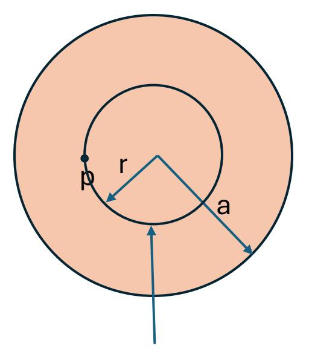

Spherical Gaussian Surface

Solution 2b: The answer in terms of total charge instead of density

$$E = \rho_v * \frac{1}{3} * \frac{r}{\epsilon_o}$$

$$\rho_v = \frac{Q}{V} = \frac{Q}{\frac{4\pi a^3}{3}} = \frac{3Q}{4\pi a^3}$$

$$E = \frac{3Q}{4\pi a^3} * \frac{1}{3} * \frac{r}{\epsilon_o}$$

$$E = \frac{1}{4\pi} * \frac{Q}{a^3} * \frac{r}{\epsilon_o}$$

$$E = \frac{1}{4\pi \epsilon_o} * \frac{Q}{a^3} * r$$

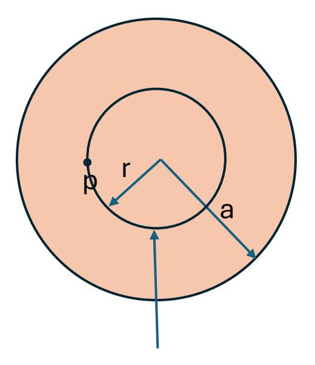

∗ Spherical Gaussian Surface

Problem 3: Charge (Q) is distributed uniformly over a Surface of a sphere as shown below in the figure. The sphere has a radius of "a" meters. Find an:

- Electric field at a point P outside the sphere.
- Electric field at a point P inside the sphere.

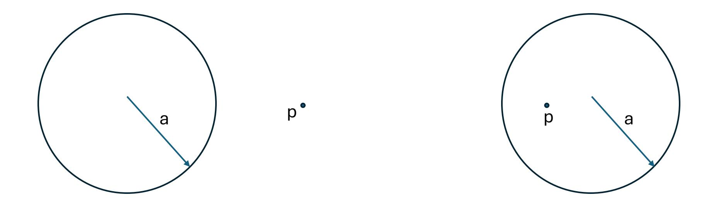

Solution 3a: Electric field at a point P outside the sphere:

$$\epsilon_o \oiint \vec{E} . \overrightarrow{ds} = Q_{enclosed}$$

Solving LHS of above equation

$$\epsilon_{o}E \oiint \overrightarrow{ds} = \epsilon_{o}E \oiint r \, d\theta \, rsin(\theta) \, d\phi = \epsilon_{o}E \, r^{2} \oiint sin(\theta) \, d\theta \, d\phi$$

$$\epsilon_{o}E \, r^{2} \int_{0}^{\pi} sin(\theta) \, d\theta \int_{0}^{2\pi} d\phi = \epsilon_{o}E \, r^{2}2\pi [-\cos(\theta)]_{0}^{\pi} = \epsilon_{o}E \, r^{2} * 2\pi * 2\pi * 2\pi * 2\pi * 2\pi * 2\pi * 2\pi *$$

Solving RHS of above equation

$$Q_{enclosed} = \iint \rho_s \, ds = \rho_s * 4\pi a^2$$

$$\rho_s = \frac{Q}{4\pi a^2}$$

$$Q_{enclosed} = \frac{Q}{4\pi a^2} * 4\pi a^2 = Q$$

$$\epsilon_o E \, r^2 * 4\pi = Q$$

$$E = \frac{1}{4\pi \epsilon_o} * \frac{Q}{r^2}$$

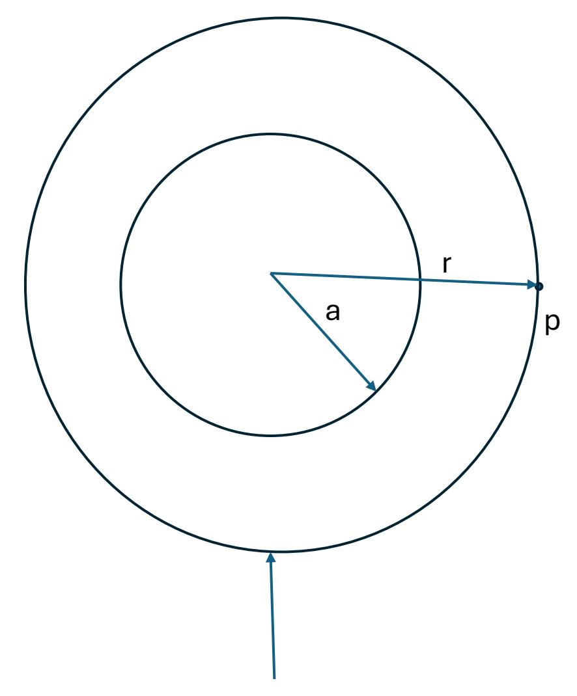

Spherical Gaussian Surface

Solution 3b: Electric field at a point P outside the sphere:

$$\epsilon_o \iint \vec{E} \cdot \vec{ds} = Q_{enclosed}$$

Solving LHS of above equation

$$\epsilon_{o}E \oiint \overrightarrow{ds} = \epsilon_{o}E \oiint r \, d\theta \, rsin(\theta) \, d\phi = \epsilon_{o}E \, r^{2} \oiint sin(\theta) \, d\theta \, d\phi$$

$$\epsilon_{o}E \, r^{2} \int_{0}^{\pi} sin(\theta) \, d\theta \int_{0}^{2\pi} d\phi = \epsilon_{o}E \, r^{2}2\pi [-cos(\theta)]_{0}^{\pi} = \epsilon_{o}E \, r^{2} * 2\pi * 2\pi * 2\pi$$

$$\epsilon_{o} \oiint \overrightarrow{E}. \, \overrightarrow{ds} = \epsilon_{o}E \, r^{2} * 4\pi$$

Solving RHS of above equation

$$Q_{enclosed}$$
 = 0 
$$\epsilon_o E r^2 * 4\pi = 0$$
 
$$E = 0$$

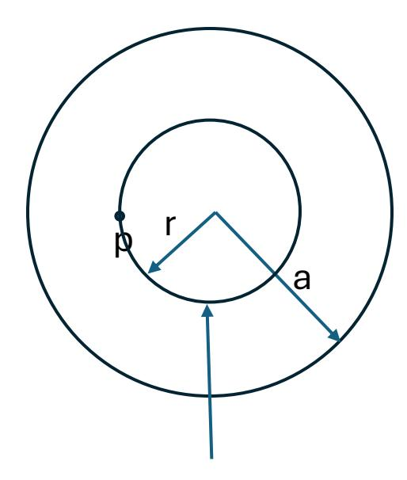

Spherical Gaussian Surface

Problem 3: An infinite line charge of uniform density resides in air. Determine the electric field intensity vector at an arbitrary point in space.

Solution:

Gauss's Law:

$$Q_{en} = \int \varepsilon_0 E. dA$$

$$\rho_L \times d = \int_{Top} \varepsilon_0 E. dA + \int_{Bottom} \varepsilon_0 E. dA + \int_{Side} \varepsilon_0 E. dA$$

$$\rho_L \times d = \int_{Top} \varepsilon_0 \times 0 + \int_{Bottom} \varepsilon_0 \times 0 + \int_{Side} \varepsilon_0 E. dA$$

$$\rho_L \times d = \varepsilon_0 E \int_{Side} dA = \varepsilon_0 EA = \varepsilon_0 E \times 2\pi r d$$

$$\to E = \frac{\rho_L}{2\pi \varepsilon_0 r}$$

**Question**: Can this approach be taken for finite line of charge?

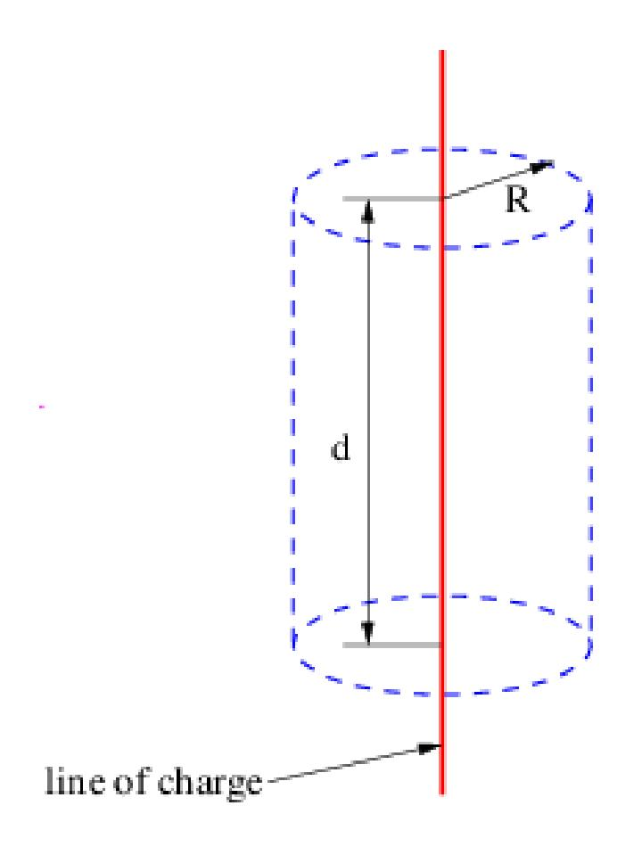

Problem 4: An infinite sheet with uniform charge density of (also known as ) is in air. Determine the electric field intensity vector at an arbitrary point in space.

Solution:

Gauss's Law:

$$Q_{en} = \int \varepsilon_0 E. \, dA$$

$$\sigma A = \int_{Top} \varepsilon_0 E. \, dA + \int_{Bottom} \varepsilon_0 E. \, dA + \int_{Side} \varepsilon_0 E. \, dA$$
$$\sigma A = \int_{Top} \varepsilon_0 E. \, dA + \int_{Bottom} \varepsilon_0 E. \, dA + \int_{Side} \varepsilon_0.0$$

$$\sigma A = \varepsilon_0 E \left( \int_{Top} dA + \int_{Bottom} dA \right) = 2\varepsilon_0 EA$$

$$\to E = \frac{\sigma}{2\varepsilon_0}$$

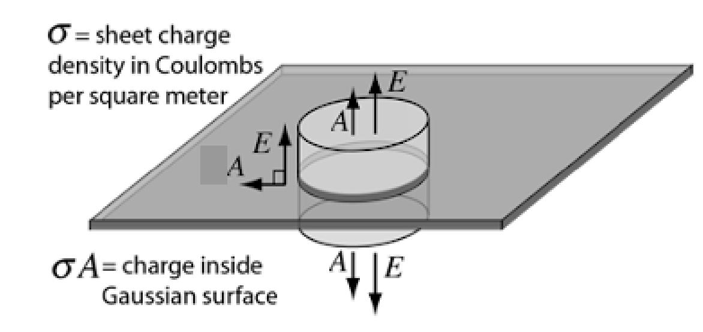