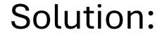
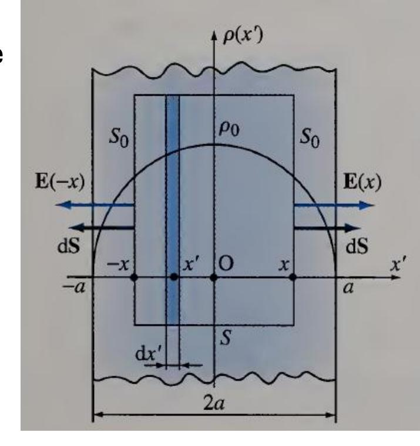
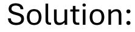
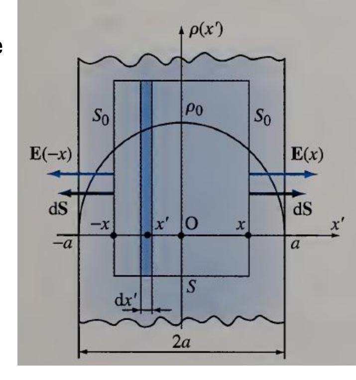
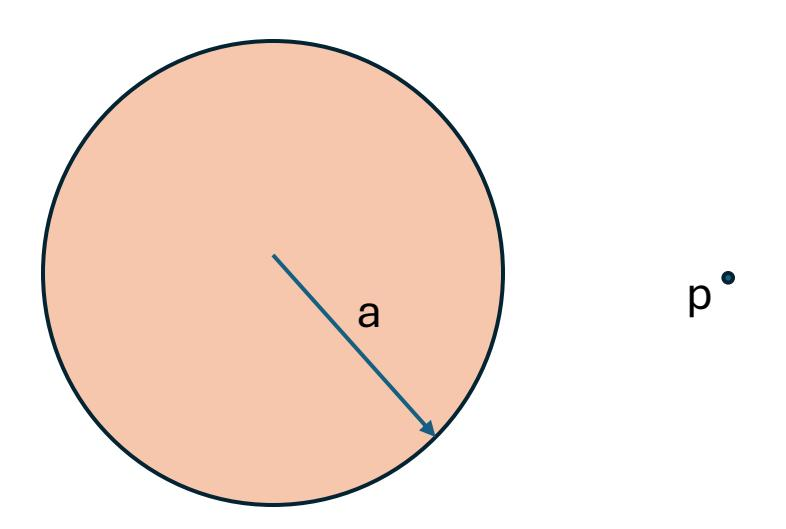
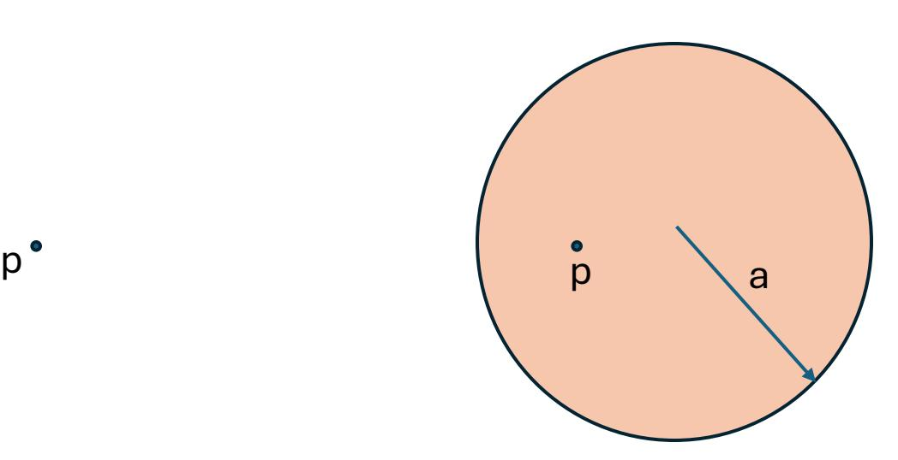
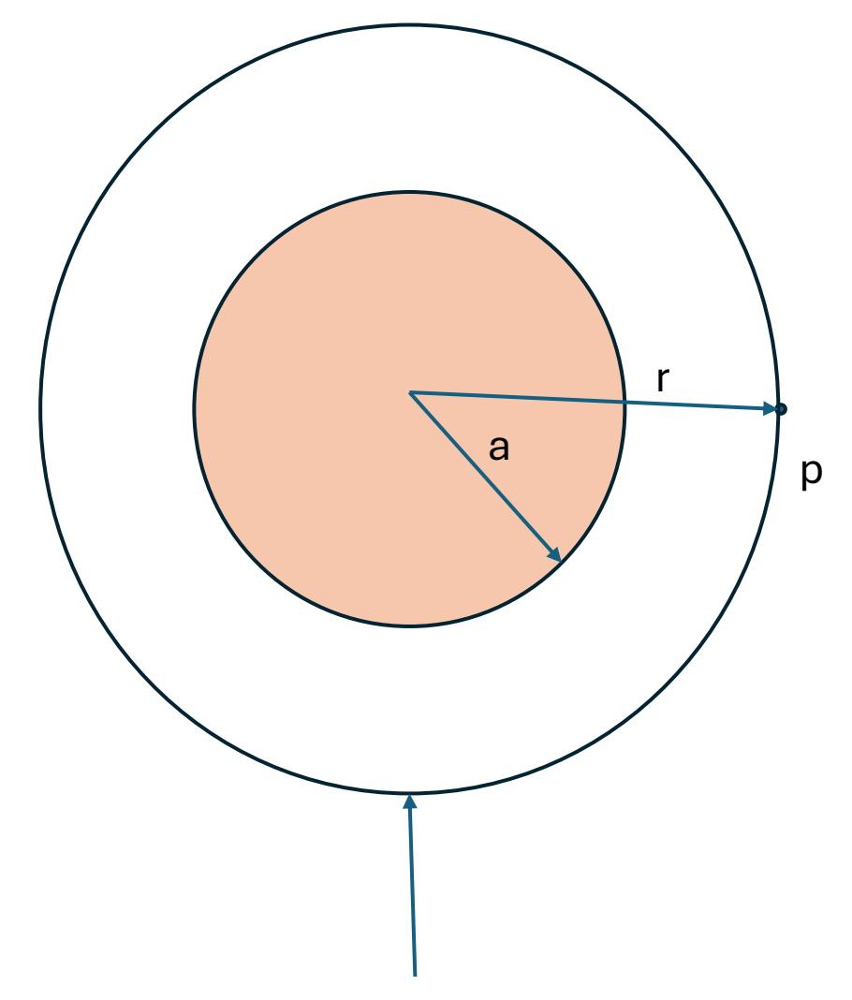
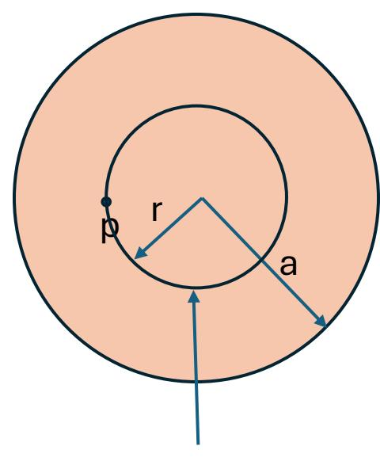

Consider a layer of charge infinitely long dimensions along and axis. The layer has thickness of 2 on the axis and volume charge density is a function of as

$$\rho_{x} = \rho_{0} \left( 1 - \frac{x^{2}}{a^{2}} \right)$$

Find the electric field inside and outside the layer.

Due to symmetry: = , Gauss's Law: = ∫ 0.

Outside the Layer: Let's consider a Gaussian surface with side areas of 0:

$$\int_{x=-a}^{a} \rho(x) A_0 dx = 2 \times \varepsilon_0 E_x A_0$$

$$\int_{x=-a}^{a} \rho_0 \left( 1 - \frac{x^2}{a^2} \right) A_0 dx = 2 \times \varepsilon_0 E_x A_0 \to \rho_0 \left( x - \frac{x^3}{3a^2} \right) \Big|_{-a}^{a} A_0 = 2 \times \varepsilon_0 E_x A_0$$

$$\to \rho_0 \left( 2a - 2 \frac{a^3}{3a^2} \right) A_0 = 2 \times \varepsilon_0 E_x A_0 \to E_x = \frac{\rho_0}{\varepsilon_0} \left( \frac{2}{3} a \right) \text{ for } (x > a)$$

$$E_x = -\frac{\rho_0}{\varepsilon_0} \left( \frac{2}{3} a \right) \text{ for } (x < -a)$$

Consider a layer of charge infinitely long dimensions along and axis. The layer has thickness of 2 on the axis and volume charge density is a function of as

$$\rho_{x} = \rho_{0} \left( 1 - \frac{x^{2}}{a^{2}} \right)$$

Find the electric field inside and outside the layer.

Due to symmetry: = , Gauss's Law: = ∫ 0.

Inside the Layer: Let's consider a Gaussian surface with side areas of 0:

$$\int_{x'=-x}^{x} \rho(x) A_0 dx' = 2 \times \varepsilon_0 E_x A_0$$

$$\int_{x'=-x}^{x} \rho_0 \left( 1 - \frac{{x'}^2}{a^2} \right) A_0 dx' = 2 \times \varepsilon_0 E_x A_0 \to \rho_0 \left( x' - \frac{{x'}^3}{3a^2} \right) \Big|_{-x}^{x} A_0 = 2 \times \varepsilon_0 E_x A_0$$

$$\to \rho_0 \left( 2x - 2 \frac{x^3}{3a^2} \right) A_0 = 2 \times \varepsilon_0 E_x A_0 \to E_x = \frac{\rho_0}{\varepsilon_0} \left( x - \frac{x^3}{3a^2} \right) for (-a < x < a)$$

- (a) A total charge  $Q = 60 \,\mu\text{C}$  is split into two equal charges located at 180° intervals around a circular loop of radius 4 m. Find the potential at the center of the loop.
- (b) If Q is split into three equal charges spaced at  $120^{\circ}$  intervals around the loop, find the potential at the center.
- (c) If in the limit  $\rho_L = \frac{Q}{8\pi}$ , find the potential at the center.

## Solution:

$$V = \frac{Q}{4\pi\varepsilon_0 r}$$

$$V = 2 \times \frac{Q/2}{4\pi\varepsilon_0 a} = \frac{Q}{4\pi\varepsilon_0 a} = \frac{60 \times 10^{-6}}{16\pi\varepsilon_0}$$

$$V = 3 \times \frac{Q/3}{4\pi\varepsilon_0 a} = \frac{Q}{4\pi\varepsilon_0 a} = \frac{60 \times 10^{-6}}{16\pi\varepsilon_0}$$

$$V = \lim_{n \to \infty} n \times \frac{Q/n}{4\pi\varepsilon_0 a} = \frac{Q}{4\pi\varepsilon_0 a} = \frac{60 \times 10^{-6}}{16\pi\varepsilon_0}$$

$$V = \int_{-\pi}^{\pi} \frac{\frac{Q}{8\pi} a d\theta}{4\pi \varepsilon_0 a} = \frac{\frac{Q}{8\pi} \times 2\pi a}{4\pi \varepsilon_0 a} = \frac{60 \times 10^{-6}}{16\pi \varepsilon_0}$$

Problem 2: Charge (Q) is distributed uniformly over a volume of a sphere as shown below in the figure. The sphere has a radius of "a" meters. Find an:

- Electric potential at a point P outside the sphere.
- Electric potential at a point P inside the sphere.

Solution 2a:

## Solution:

Using Gauss's Law we found:

$$E = \frac{1}{4\pi\epsilon_o} * \frac{Q}{r^2}$$

Ther2fore the electric potential is 
$$V = -\int_{r'=\infty}^{r} E.\,dr' = -\int_{r'=\infty}^{r} \frac{1}{4\pi\epsilon_o} * \frac{Q}{r'^2}.\,dr' = \frac{1}{4\pi\epsilon_o} * \frac{Q}{r}$$

Spherical Gaussian Surface

Solution 2b:

## Solution:

Using Gauss's Law we found:

$$E = \frac{1}{4\pi\epsilon_o} * \frac{Q}{a^3} * r$$

Ther2fore the electric potential is

$$V = -\int_{r'=a}^{r} E \cdot dr' + V_a = -\frac{1}{4\pi\epsilon_o} * \frac{Q}{a^3} * \frac{{r'}^2}{2} \Big|_{r'=a}^{r'=r} + \frac{1}{4\pi\epsilon_o} * \frac{Q}{r} \Big|_{r=a}$$
$$= \frac{1}{4\pi\epsilon_o} * \frac{Q}{a^3} * \frac{a^2}{2} - \frac{1}{4\pi\epsilon_o} * \frac{Q}{a^3} * \frac{r^2}{2} + \frac{1}{4\pi\epsilon_o} * \frac{Q}{a}$$

Spherical Gaussian Surface