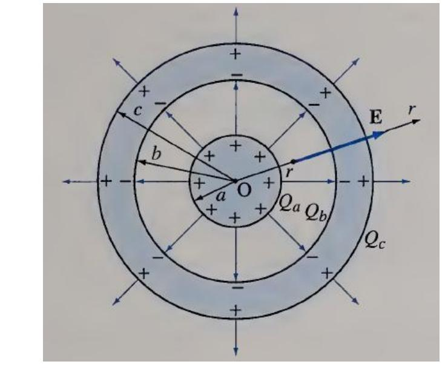
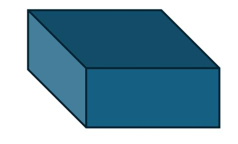
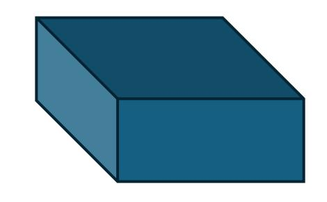
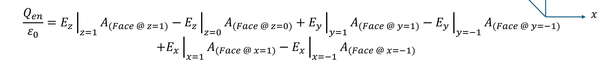
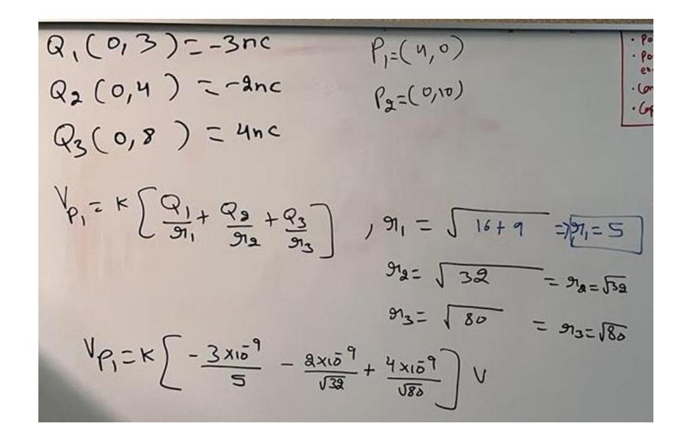

A metallic sphere, of radius and a charge of , is enclosed by concentric metallic spherical shell, of inner radius and outer radius . Find the electric potential at the center of the sphere.

## Solution:

For 
$$a < r < b$$
,  $E = \frac{Q}{4\pi\varepsilon_0 r^2}$ 

For 
$$c < r$$
,  $E = \frac{Q}{4\pi\varepsilon_0 r^2}$ 

Now we can find potential

$$V_{Shell} = V_c = V_b = -\int_{r'=\infty}^{c} \frac{Q}{4\pi\varepsilon_0 r'^2} dr' = \frac{Q}{4\pi\varepsilon_0 r'} \Big|_{r'=c} = \frac{Q}{4\pi\varepsilon_0 c'}$$

$$V_{Center} = -\int_{r'=b}^{a} \frac{Q}{4\pi\varepsilon_0 {r'}^2} dr' + V_b = \frac{Q}{4\pi\varepsilon_0 r} \Big|_b^a + \frac{Q}{4\pi\varepsilon_0 c} = \frac{Q}{4\pi\varepsilon_0 a} - \frac{Q}{4\pi\varepsilon_0 b} + \frac{Q}{4\pi\varepsilon_0 c}$$

A metallic sphere, of radius is enclosed by concentric metallic spherical shell, of inner radius and outer radius . Find the capacitance of this geometry

## Solution:

We must assume a charge of on the inner and − on outer conductor.

For 
$$a < r < b$$
,  $E = \frac{Q}{4\pi\varepsilon_0 r^2}$ 

For < , = 0, as the charge enclosed is zero.

Now we can find potential

$$V_{Shell} = V_c = V_b = 0$$

$$V_{Center} = -\int_{r'=b}^{a} \frac{Q}{4\pi\varepsilon_0 r'^2} dr' + V_b = \frac{Q}{4\pi\varepsilon_0 r} \Big|_b^a + 0 = \frac{Q}{4\pi\varepsilon_0 a} - \frac{Q}{4\pi\varepsilon_0 b}$$

Now, we can find the capacitance

$$C = \frac{Q}{V} = \frac{Q}{\frac{Q}{4\pi\varepsilon_0 a} - \frac{Q}{4\pi\varepsilon_0 b}} = \frac{4\pi\varepsilon_0}{\frac{1}{a} - \frac{1}{b}}$$

The electric potential at space is given by  $V = 4x + 3y^2 + 2z^2$ . Determine:

- a) Electric field on this medium
- b) Charge inside a cube with boundaries of -1 < x < 1; -1 < y < 1; 0 < z < 1

Solution, part a:

$$V = -\int E \cdot dl \rightarrow E = -\nabla V$$

In Cartesian

$$E = -\frac{\partial}{\partial x}(V)\hat{x} - \frac{\partial}{\partial y}(V)\hat{y} - \frac{\partial}{\partial z}(V)\hat{z}, \qquad or \ E_x = -\frac{\partial}{\partial x}(V); E_y = -\frac{\partial}{\partial y}(V); E_z = -\frac{\partial}{\partial z}(V)$$

**Therefore** 

$$E = -\frac{\partial}{\partial x} (4x + 3y^2 + 2z^2)\hat{x} - \frac{\partial}{\partial y} (4x + 3y^2 + 2z^2)\hat{y} - \frac{\partial}{\partial z} (4x + 3y^2 + 2z^2)\hat{z}$$
  
=  $-4\hat{x} - (6y)\hat{y} - (4z)\hat{z}$ 

The electric potential at space is given by = 4 + 3 2 + 2 2 . Determine:

- a) Electric field on this medium
- b) Charge inside a cube with boundaries of −1 < < 1; −1 < < 1; 0 < < 1

$$E = -4\hat{x} - (6y)\hat{y} - (4z)\hat{z}$$

$$\frac{Q_{en}}{\varepsilon_{0}} = \int_{Top} \left( E_{x}\hat{x} + E_{y}\hat{y} + E_{z}\hat{z} \right) \cdot (dA\hat{z}) + \int_{Bot} \left( E_{x}\hat{x} + E_{y}\hat{y} + E_{z}\hat{z} \right) \cdot (-dA\hat{z})$$

$$+ \int_{Eront} \left( E_{x}\hat{x} + E_{y}\hat{y} + E_{z}\hat{z} \right) \cdot (-dA\hat{y}) + \int_{Back} \left( E_{x}\hat{x} + E_{y}\hat{y} + E_{z}\hat{z} \right) \cdot (dA\hat{y})$$

$$+ \int_{Left} \left( E_{x}\hat{x} + E_{y}\hat{y} + E_{z}\hat{z} \right) \cdot (-dA\hat{x}) + \int_{Right} \left( E_{x}\hat{x} + E_{y}\hat{y} + E_{z}\hat{z} \right) \cdot (dA\hat{x})$$

$$\frac{Q_{en}}{\varepsilon_{0}} = \int_{Top} (E_{z}\hat{z}) \cdot (dA\hat{z}) + \int_{Bot} (E_{z}\hat{z}) \cdot (-dA\hat{z}) + \int_{Front} \left( E_{y}\hat{y} \right) \cdot (-dA\hat{y}) + \int_{Back} \left( E_{y}\hat{y} \right) \cdot (dA\hat{y})$$

$$+ \int_{Left} (E_{x}\hat{x}) \cdot (-dA\hat{x}) + \int_{Right} (E_{x}\hat{x}) \cdot (dA\hat{x})$$

$$\frac{Q_{en}}{\varepsilon_0} = E_z \Big|_{z=1} A_{(Face @ z=1)} - E_z \Big|_{z=0} A_{(Face @ z=0)} + E_y \Big|_{y=1} A_{(Face @ y=1)} - E_y \Big|_{y=-1} A_{(Face @ y=-1)} + E_x \Big|_{x=1} A_{(Face @ x=1)} - E_x \Big|_{x=-1} A_{(Face @ x=-1)}$$

The electric potential at space is given by = 4 + 3 2 + 2 2 . Determine:

- a) Electric field on this medium
- b) Charge inside a cube with boundaries of −1 < < 1; −1 < < 1; 0 < < 1

$$E = -4\hat{x} - (6y)\hat{y} - (4z)\hat{z}$$

$$\frac{Q_{en}}{\varepsilon_0} = -4(2 \times 2) - 0(2 \times 2) - 6(2 \times 1) - 6(2 \times 1) - 4(2 \times 1) - (-4)(2 \times 1)$$
$$= -16 - 24 - 0 = -40$$

$$Q_{en} = -40\varepsilon_0$$

$$Q_{1}(0,3) = -3nc$$
 $Q_{2}(0,4) = -3nc$ 
 $Q_{3}(0,8) = 4nc$ 
 $Q_{3}(0,8) = 4nc$ 
 $Q_{3}(0,8) = 4nc$ 
 $Q_{3}(0,8) = 4nc$ 
 $Q_{3}(0,8) = 4nc$ 
 $Q_{3}(0,8) = 4nc$ 
 $Q_{3}(0,8) = 4nc$ 
 $Q_{3}(0,8) = 4nc$ 
 $Q_{3}(0,8) = 4nc$ 
 $Q_{3}(0,8) = 4nc$ 
 $Q_{3}(0,8) = 4nc$ 
 $Q_{3}(0,8) = 4nc$ 
 $Q_{3}(0,8) = 4nc$ 
 $Q_{3}(0,8) = 4nc$ 
 $Q_{3}(0,8) = 4nc$ 
 $Q_{3}(0,8) = 4nc$ 
 $Q_{3}(0,8) = 4nc$ 
 $Q_{3}(0,8) = 4nc$ 
 $Q_{3}(0,8) = 4nc$ 
 $Q_{3}(0,8) = 4nc$ 
 $Q_{3}(0,8) = 4nc$ 
 $Q_{3}(0,8) = 4nc$ 
 $Q_{3}(0,8) = 4nc$ 
 $Q_{3}(0,8) = 4nc$ 
 $Q_{3}(0,8) = 4nc$ 
 $Q_{3}(0,8) = 4nc$ 
 $Q_{3}(0,8) = 4nc$ 
 $Q_{3}(0,8) = 4nc$ 
 $Q_{3}(0,8) = 4nc$ 
 $Q_{3}(0,8) = 4nc$ 
 $Q_{3}(0,8) = 4nc$ 
 $Q_{3}(0,8) = 4nc$ 
 $Q_{3}(0,8) = 4nc$ 
 $Q_{3}(0,8) = 4nc$ 
 $Q_{3}(0,8) = 4nc$ 
 $Q_{3}(0,8) = 4nc$ 
 $Q_{3}(0,8) = 4nc$ 
 $Q_{3}(0,8) = 4nc$ 
 $Q_{3}(0,8) = 4nc$ 
 $Q_{3}(0,8) = 4nc$ 
 $Q_{3}(0,8) = 4nc$ 
 $Q_{3}(0,8) = 4nc$ 
 $Q_{3}(0,8) = 4nc$ 
 $Q_{3}(0,8) = 4nc$ 
 $Q_{3}(0,8) = 4nc$ 
 $Q_{3}(0,8) = 4nc$ 
 $Q_{3}(0,8) = 4nc$ 
 $Q_{3}(0,8) = 4nc$ 
 $Q_{3}(0,8) = 4nc$ 
 $Q_{3}(0,8) = 4nc$ 
 $Q_{3}(0,8) = 4nc$ 
 $Q_{3}(0,8) = 4nc$ 
 $Q_{3}(0,8) = 4nc$ 
 $Q_{3}(0,8) = 4nc$ 
 $Q_{3}(0,8) = 4nc$ 
 $Q_{3}(0,8) = 4nc$ 
 $Q_{3}(0,8) = 4nc$ 
 $Q_{3}(0,8) = 4nc$ 
 $Q_{3}(0,8) = 4nc$ 
 $Q_{3}(0,8) = 4nc$ 
 $Q_{3}(0,8) = 4nc$ 
 $Q_{3}(0,8) = 4nc$ 
 $Q_{3}(0,8) = 4nc$ 
 $Q_{3}(0,8) = 4nc$ 
 $Q_{3}(0,8) = 4nc$ 
 $Q_{3}(0,8) = 4nc$ 
 $Q_{3}(0,8) = 4nc$ 
 $Q_{3}(0,8) = 4nc$ 
 $Q_{3}(0,8) = 4nc$ 
 $Q_{3}(0,8) = 4nc$ 
 $Q_{3}(0,8) = 4nc$ 
 $Q_{3}(0,8) = 4nc$ 
 $Q_{3}(0,8) = 4nc$ 
 $Q_{3}(0,8) = 4nc$ 
 $Q_{3}(0,8) = 4nc$ 
 $Q_{3}(0,8) = 4nc$ 
 $Q_{3}(0,8) = 4nc$ 
 $Q_{3}(0,8) = 4nc$ 
 $Q_{3}(0,8) = 4nc$ 
 $Q_{3}(0,8) = 4nc$ 
 $Q_{3}(0,8) = 4nc$ 
 $Q_{3}(0,8) = 4nc$ 
 $Q_{3}(0,8) = 4nc$ 
 $Q_{3}(0,8) = 4nc$ 
 $Q_{3}(0,8) = 4nc$ 
 $Q_{3}(0,8) = 4nc$ 
 $Q_{3}(0,8) = 4nc$ 
 $Q_{3}(0,8) = 4nc$ 
 $Q_{3}(0,8) = 4nc$ 
 $Q_{3}(0,8) = 4nc$ 
 $Q_{3}(0,8) = 4nc$ 
 $Q_{3}(0,8) = 4nc$ 
 $Q_{3}(0,8) = 4nc$ 
 $Q_{3}(0,8) = 4nc$ 
 $Q_{3}(0,8) = 4nc$ 
 $Q_{3}(0,8) = 4nc$ 
 $Q_{3}(0,8) = 4nc$ 
 $Q_{3}(0,8) = 4nc$ 
 $Q_{3}(0,8) = 4nc$ 
 $Q_{3}(0,8) = 4nc$ 
 $Q_$