### Some rules about conductors:

- 1. Electric field inside the conductor in electrostatic or charge distribution cases: = 0
- 2. Electric field in electrostatic or charge distribution cases is always normal at the conductor surface and

$$E_{tangential} = 0$$

$$|E_{normal}| = \frac{|\rho_s|}{\epsilon_o}$$

- 3. Conductors are equipotential surfaces
- 4. There is no volume charge density for conductors for charge distribution cases.
- 5. A cavity inside the conductor is shielded from the outside world i.e. Faraday Cage (true for electrostatic case, penetration (skin depth) exist in case of time varying field.

Current and Resistance:

1. Current is given by:

$$J = \frac{I}{A} = \sigma E$$

$$I = \int \vec{J} \cdot \overrightarrow{ds}$$

2. Resistance is given by:

$$R = \frac{V}{I} = \frac{\int \vec{E} \cdot \vec{dl}}{\sigma \int \vec{E} \cdot \vec{ds}}$$

# Problem 1: Assume we have a coaxial cable with plastic filling. Find the resistance for current going in the radial direction.

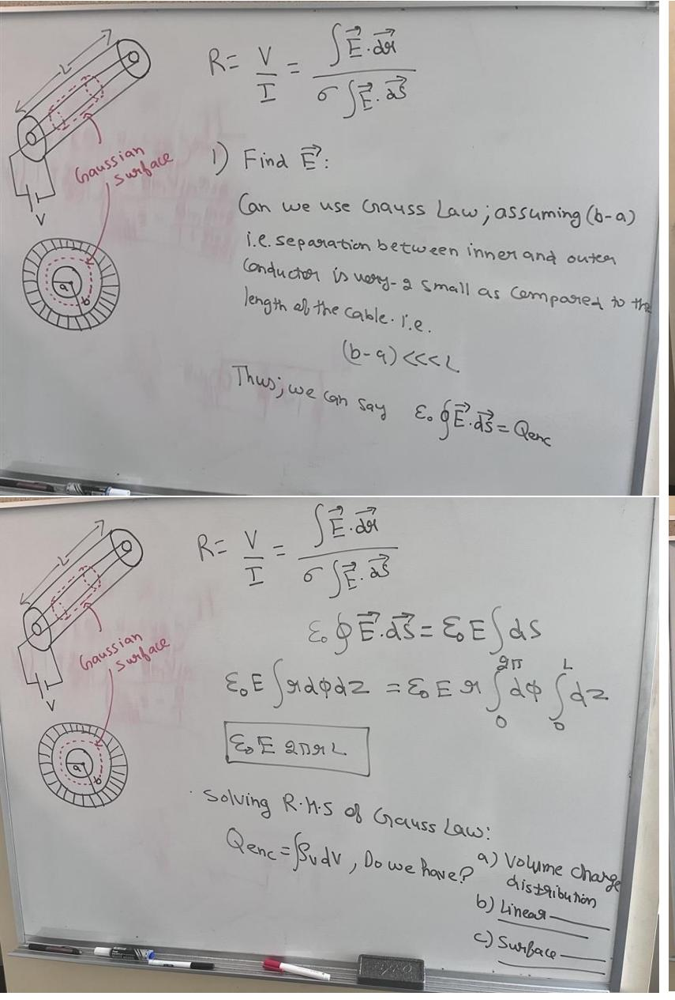

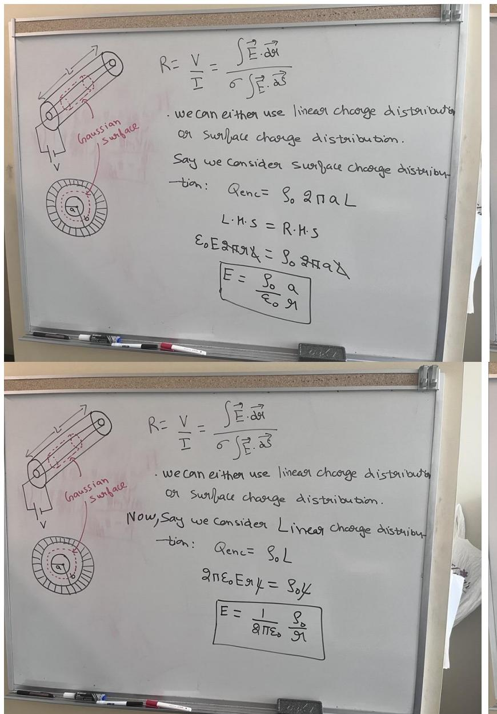

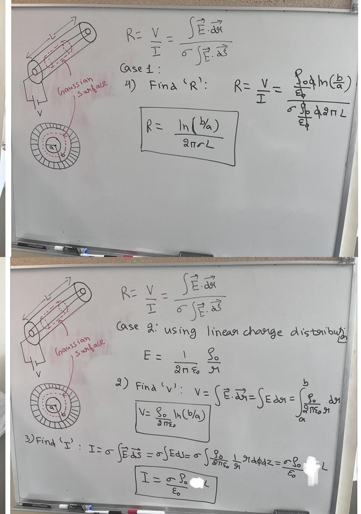

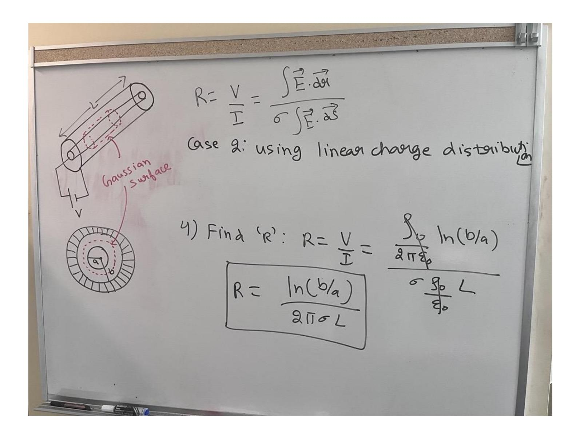

Problem 2: Assume we one conductor with a battery connected across it's 2 ends. Find the resistance for current going along the length of the cable.

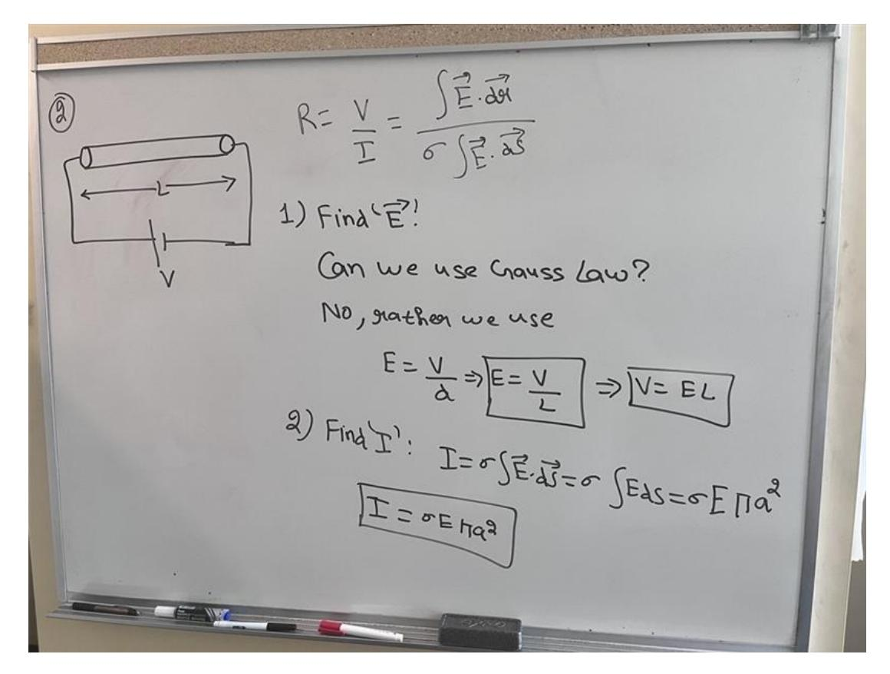

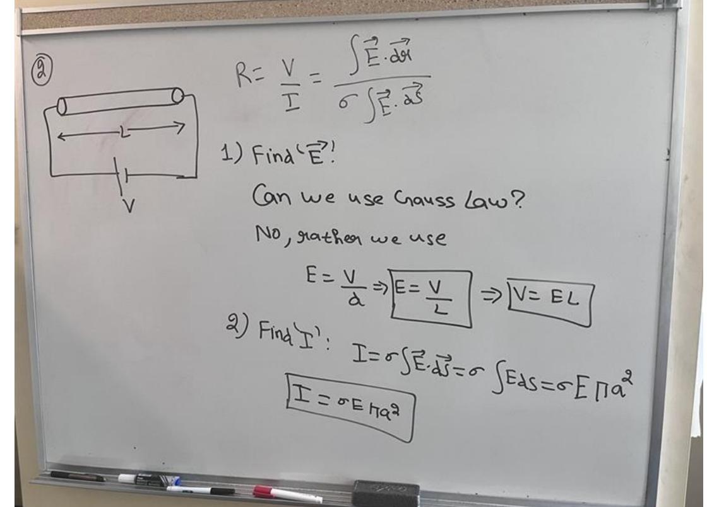

### 1. Biot-Savart Law:

$$\overline{dB} = \frac{M_0}{4\pi} \times \frac{d\overline{d} \times 9\overline{1}}{9\overline{1}^2}$$

## 2. Cross product review:

$$\hat{\lambda} \rightarrow \hat{S} \rightarrow \hat{Z}$$

$$\hat{\lambda} \times \hat{S} \rightarrow \hat{Z}$$

$$\hat{J} \times \hat{S} \rightarrow \hat{Z}$$

$$\hat{J} \times \hat{Z} \rightarrow \hat{Z}$$

$$\hat{J} \times \hat{Z} \rightarrow \hat{Z}$$

$$\hat{J} \times \hat{Z} \rightarrow \hat{Z}$$

$$\hat{J} \times \hat{Z} \rightarrow \hat{Z}$$

$$\hat{J} \times \hat{Z} \rightarrow \hat{Z}$$

$$\hat{J} \times \hat{Z} \rightarrow \hat{Z}$$

$$\hat{J} \times \hat{Z} \rightarrow \hat{Z}$$

$$\hat{J} \times \hat{Z} \rightarrow \hat{Z}$$

$$\hat{J} \times \hat{Z} \rightarrow \hat{Z}$$

Problem 3: Magnetic field due to infinite long wire carrying a DC current.

### Method 1:

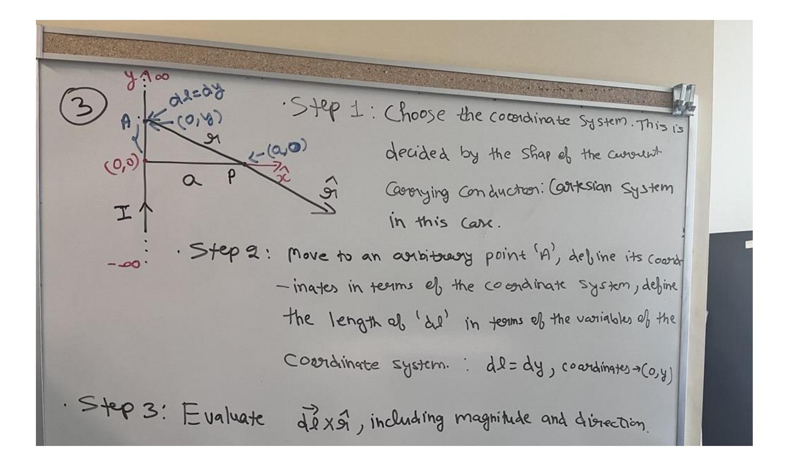

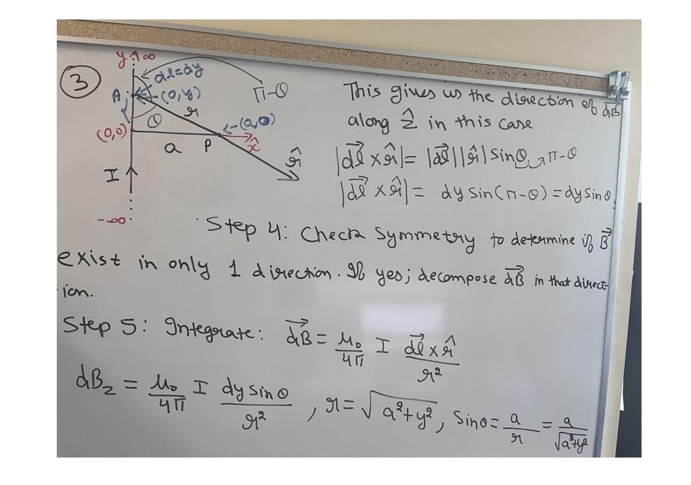

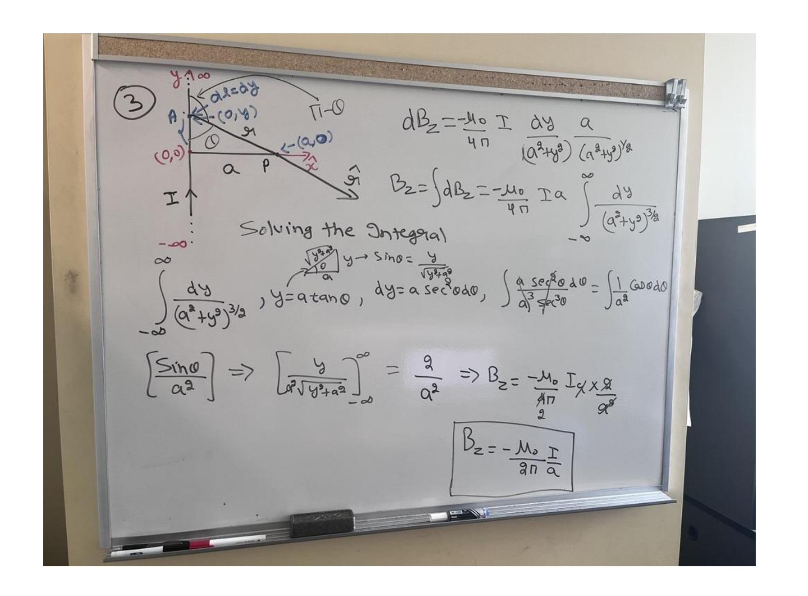

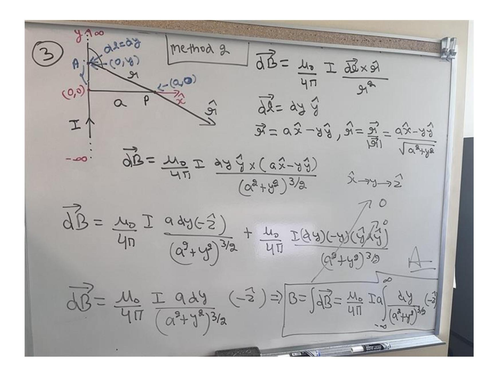

Problem 5: Magnetic field of a current carrying loop, carrying a DC current.

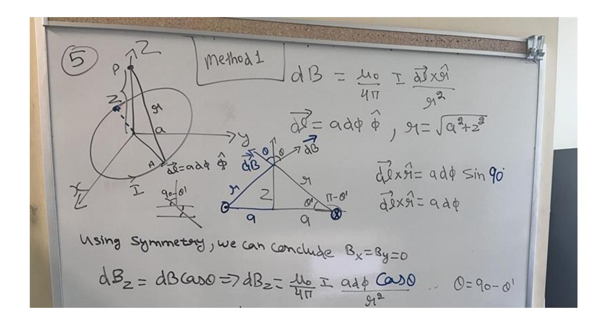

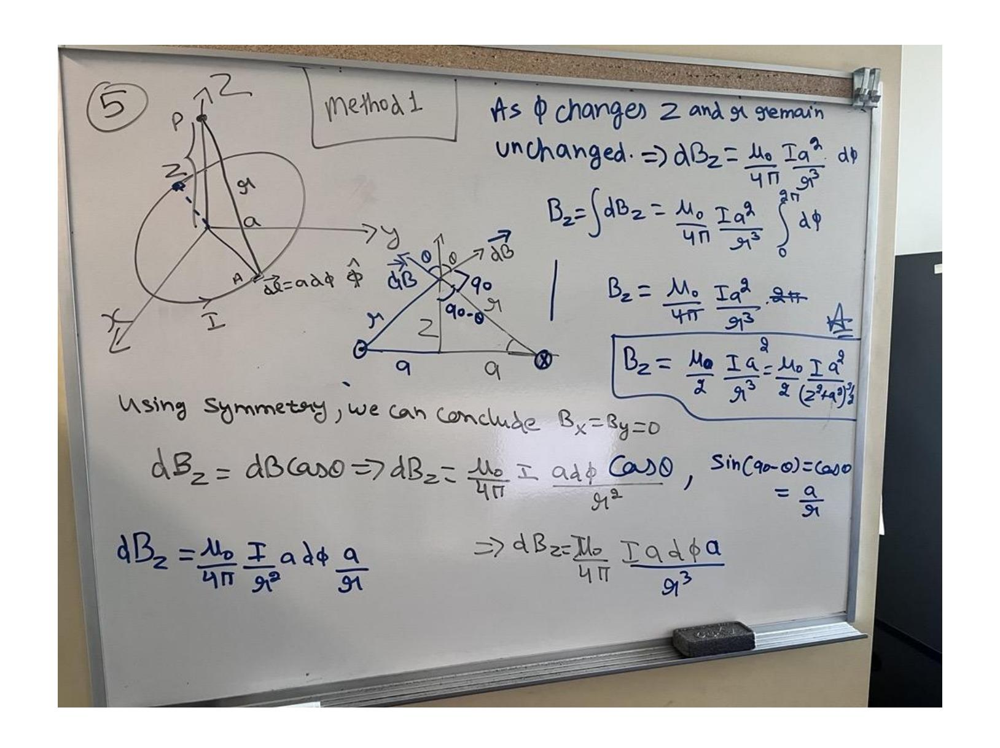

Problem 6 : What is the electric field at the center of the loop?

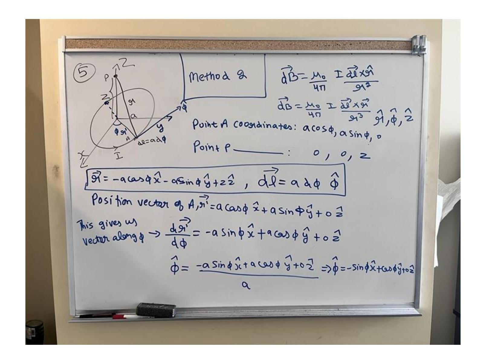

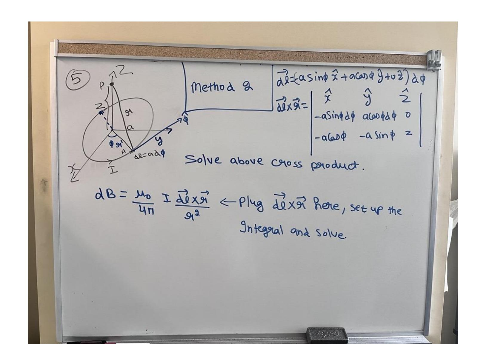