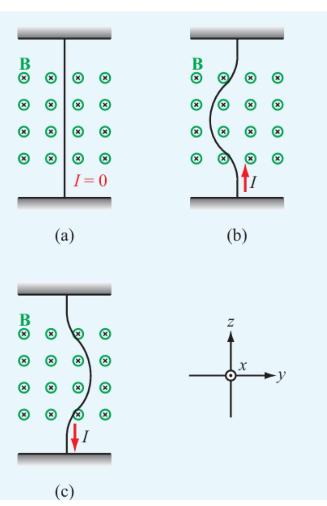
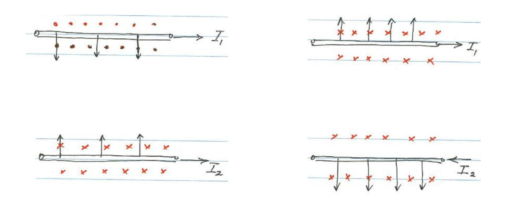
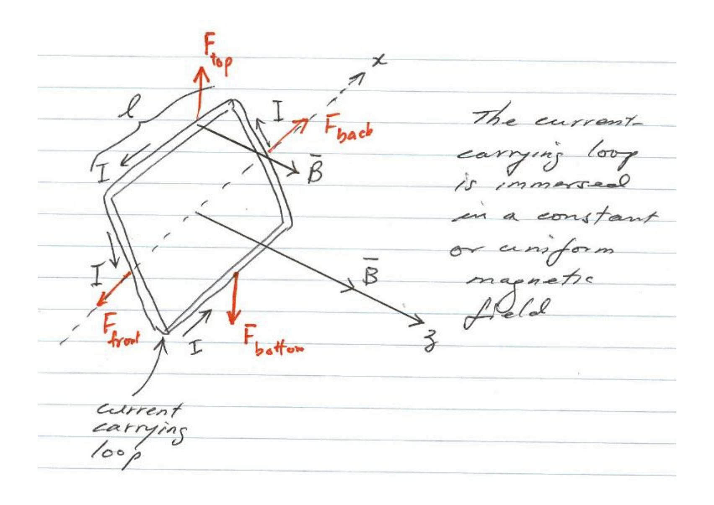
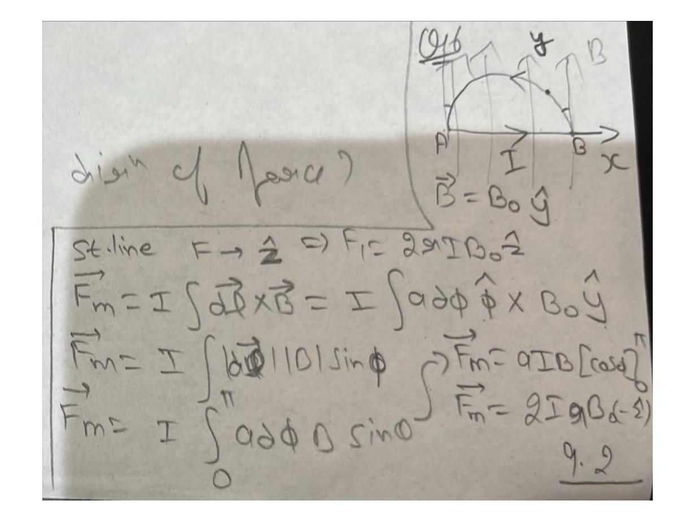
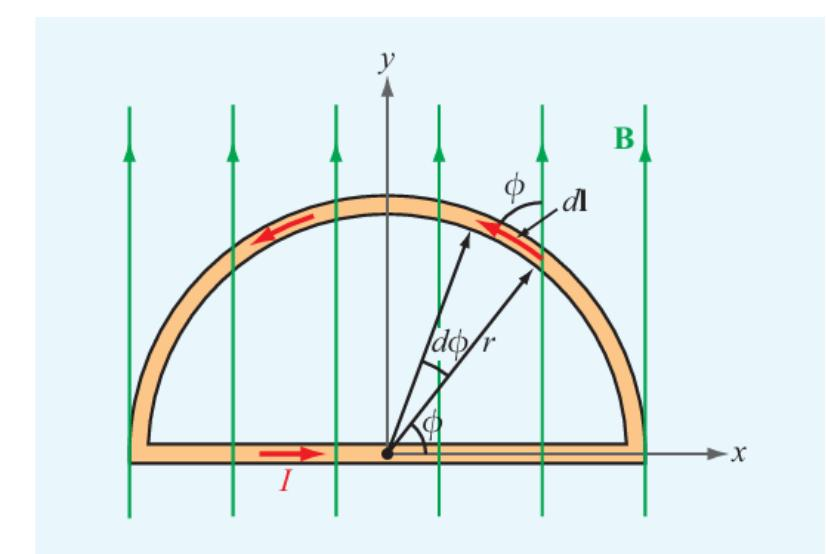
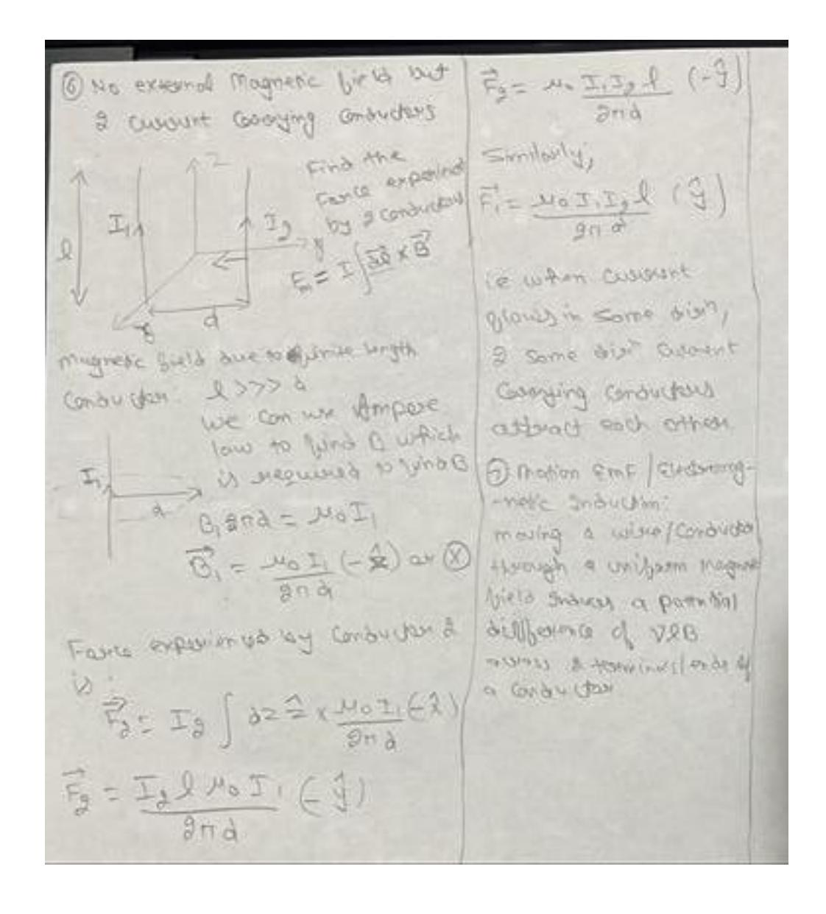
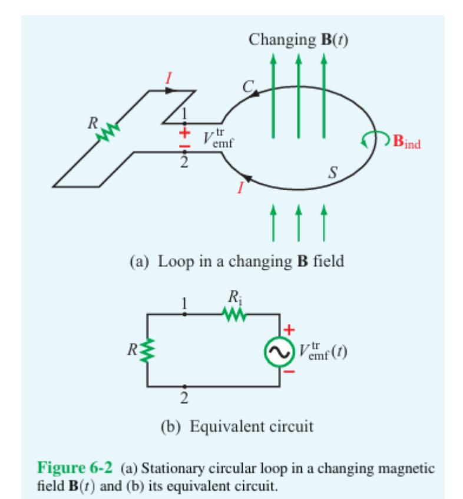

1. 2nd form of Biot-Savart Law:

$$\overrightarrow{dB} = \frac{\mu_o}{4\pi} \frac{I \overrightarrow{dl} X \hat{r}}{r^2}, I = \frac{dq}{dt} \Rightarrow \overrightarrow{dB} = \frac{\mu_o}{4\pi} \frac{dq}{r^2} \overrightarrow{dl} X \hat{r}}{r^2} \Rightarrow \overrightarrow{dB} = \frac{\mu_o}{4\pi} \frac{dq}{dt} \overrightarrow{dl} X \hat{r}}{r^2}$$

$$\overrightarrow{dB} = \frac{\mu_o}{4\pi} dq \frac{\overrightarrow{v} X \hat{r}}{r^2}$$

2. Magnetic force experienced by a charge in an external magnetic field:

$$\overrightarrow{F_m} = q(\overrightarrow{v} X \overrightarrow{B}) = q|v||b|\sin(\theta)$$

3. Lorentz Law/Force:

$$\vec{F} = \overrightarrow{F_e} + \overrightarrow{F_m} = q\vec{E} + q(\vec{v}X\vec{B})$$

- 4.  $\overrightarrow{F_e}$  always acts along  $\overrightarrow{E}$ ,  $\overrightarrow{F_m}$  is always perpendicular to the direction of the motion of the charge
- 5.  $\overrightarrow{F_e}$  always acts on a charge regardless if the charge is moving or not.
- 6.  $\overrightarrow{F_m}$  acts only if the charge is moving

**Exercise 5-1:** An electron moving in the positive *x* direction perpendicular to a magnetic field is deflected in the negative *z* direction. What is the direction of the magnetic field?

$$\overrightarrow{F_m} = q \left( \vec{v} \ X \vec{B} \right)$$

$$-\hat{z}F_o = -e \left( \hat{x}v_o \ X \ \vec{B} \right)$$

$$\hat{z}F_o = e \left( \hat{x}v_o \ X \ \vec{B} \right)$$

 $\rightarrow \vec{B}$  acts along  $\hat{y}$ 

**Exercise 5-3:** A charged particle with velocity  $\mathbf{u}$  is moving in a medium with uniform fields  $\mathbf{E} = \hat{\mathbf{x}}E$  and  $\mathbf{B} = \hat{\mathbf{y}}B$ . What should  $\mathbf{u}$  be so that the particle experiences no net force?

$$\vec{F} = \overrightarrow{F_e} + \overrightarrow{F_m} = q\vec{E} + q(\vec{v} \times \vec{B})$$

$$0 = q(\vec{E} + (\vec{v} \times \vec{B}))$$

$$-E_o \hat{x} = \vec{v} \times \vec{B}$$

$$-E_o \hat{x} = v_o \hat{x} \times B_o \hat{y}$$

$$-E_o \hat{x} = -v_o B_o \hat{x}$$

$$v_o = \frac{E_o}{B_o}$$

Q3: How the conductor experiences a force if a conductor carrying:

- 1. I = 0 is placed in an external magnetic field as shown in fig. a.
- 2. Current (I) is placed in an external magnetic field as shown in fig. b.
- 3. Current (I) is placed in an external magnetic field as shown in fig. c.

Q4: How the conductor experiences a force if a conductor carrying current in the following scenarios:

Q5: How the conductor experiences a force by the following current carrying conductor:

Q6: Find the current carrying conductor experiences force in the following scenario:

Q7: Find the force exerted by current current carrying conductor experiences force in the following scenario:

## Induced EMF / Faraday Law:

$$\Phi = \int_{S} \mathbf{B} \cdot d\mathbf{s}$$
 (Wb).  $V_{\text{emf}} = V_{\text{emf}}^{\text{tr}} +$ 

$$V_{\rm emf}^{\rm tr} = -N \int_{S} \frac{\partial \mathbf{B}}{\partial t} \cdot d\mathbf{s},$$
 (transformer emf)

