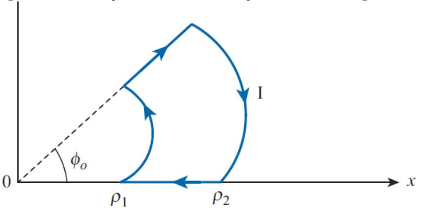

# ECE 106 Tutorial 06

July 06, 2026

### 1 Problem 1

a) A filamentary loop carrying current I is bent to the shape of a regular polygon of n sides. Show that at the center of the polygon

$$B = \mu_0 \frac{nI}{2\pi r} sin \frac{\pi}{n}$$

where r is the minimum distance of center to a side of polygon.

b) Apply this case for n = 3, 4, and ∞ to find the magnetic field of a circular loop.

#### 1.1 Solution:

a) For a one side of polygon:

$$B_1 = \mu_0 \frac{I}{4\pi\rho} (\sin\theta_2 - \sin\theta_1) = \mu_0 \frac{I}{4\pi r} (\sin(\pi/n) + \sin(\pi/n))$$
$$B = nB_1 = \mu_0 \frac{nI}{2\pi r} \sin(\pi/n)$$

b) for n = 3, 4, and ∞,

$$B|_{n=3} = \mu_0 \frac{3I}{2\pi r} sin(\pi/3)$$

$$B|_{n=4} = \mu_0 \frac{4I}{2\pi r} sin(\pi/4)$$

$$B|_{n=\infty} = \lim_{n\to\infty} \mu_0 \frac{nI}{2\pi r} sin(\pi/n) = \lim_{n\to\infty} \mu_0 \frac{nI}{2\pi r} (\pi/n) = \mu_0 \frac{I}{2r}$$

### 2 Problem 2

Figure 7.34 shows a portion of a circular loop. Find B at the origin.

#### 2.1 Solution:

The two radial lines have no effect on the answer. We can find the answer by summation of effect of two circular lines. Each of these circular lines have effect of sector of a full circle therefore

$$B_{inner} = \mu_0 \frac{\varphi_0}{2\pi} \times \frac{I}{2\rho_1}(a_z)$$

$$B_{outer} = \mu_0 \frac{\varphi_0}{2\pi} \times \frac{I}{2\rho_2} (-a_z)$$

$$B_{total} = \mu_0 \frac{I\varphi_0}{4\pi} (1/\rho_1 - 1/\rho_2)(a_z)$$

### 3 Problem 3

Assume current of I flowing through a hollow cylinder with inner radius of a and outer radius of b. If the current distribution is uniform, find B everywhere

For ρ < a:

$$\int B.dl = \mu_0 I_{enc} \to B = 0$$

For a < ρ < b, assuming that current has uniform current density on the wire:

$$\int B.dl = \mu_0 I_{enc} \to B.2\pi\rho = \mu_0 I \times \frac{\pi\rho^2 - \pi a^2}{\pi b^2 - \pi a^2} \to B = \mu_0 \frac{I}{2\pi\rho} \frac{\rho^2 - a^2}{b^2 - a^2}$$

For b < ρ:

$$\int B.dl = \mu_0 I_{enc} \to B.2\pi\rho = \mu_0 I \to B = \mu_0 \frac{I}{2\pi\rho}$$

## 4 Problem 4

An infinitly long cylinder of radius a is placed along the z axis. if the current density is J = J0/ρ, find B everywhere For ρ < a:

$$\int B.dl = \mu_0 I_{enc} \to B.2\pi \rho = \mu_0 \int_{\varphi=0}^{2\pi} \int_{\rho'=0}^{\rho} \frac{J_0}{\rho'} \rho' d\varphi d\rho' = \mu_0 J_0 2\pi \rho \to B = \mu_0 J_0$$

For ρ > a:

$$\int B.dl = \mu_0 I_{enc} \to B.2\pi\rho = \mu_0 \int_{\varphi=0}^{2\pi} \int_{\rho'=0}^{a} \frac{J_0}{\rho'} \rho' d\varphi d\rho' = \mu_0 J_0 2\pi a \to B = \mu_0 J_0 a/\rho$$