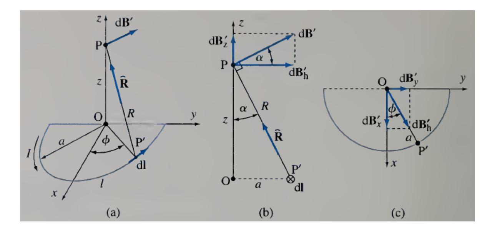
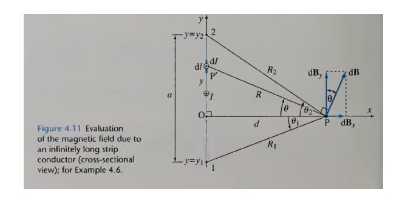
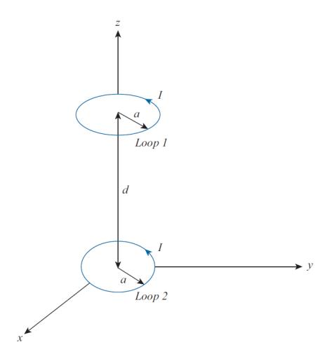

# ECE 106 Tutorial 06

July 13, 2026

## 1 Problem 1

A wire is shaped into form of a semicircle (of radius a) and a straight line (of length of 2a). The contour is situated in air and lies in the xy-plane. If the contour carries current of I, calculate the magnetic field at along z-axis.

#### 1.1 Solution:

The magnetic field is caused by the semicircle wire B' and the straight line B". First, the magnetic field caused by semicircle:

$$dB' = dB'_h(a_h) + dB'_z(a_z) \rightarrow dB'_h = dB'\cos\alpha = dB'\frac{z}{R}; \ dB'_z = dB'\sin\alpha = dB'\frac{a}{R}$$

The horizontal component can be decomposed to

$$dB'_h = dB'_x + dB'_y \rightarrow dB'_x = dB'\cos\varphi; \ dB'_y = dB'\sin\varphi$$

The component of  $B'_y$  will be canceled out due to symmetry.

$$B'_{x} = \int_{-\pi/2}^{\pi/2} \frac{\mu_0 Iaz}{4\pi R^3} cos\varphi d\varphi = \frac{\mu_0 Iaz}{2\pi R^3}$$

$$B_z' = \int_{-\pi/2}^{\pi/2} \frac{\mu_0 I a^2}{4\pi R^3} d\varphi = \frac{\mu_0 I a^2}{4R^3}$$

Next, the magnetic field caused by the line:

$$B" = \frac{\mu_0 I}{4\pi z} 2sin\alpha(-a_x) = \frac{\mu_0 Ia}{2\pi Rz}(-a_x)$$

$$B = B' + B$$

## 2 Problem 2

An infinity long conductor in the form of a thin strip of width a carries a steady current of intensity I. Determine expression for the magnetic field. What is the magnetic field for case of a sheet carrying surface current density of Js?

#### 2.1 Solution:

$$dI = I \frac{dl}{a}$$

$$dB = \frac{\mu_0 dI}{2\pi R} = \frac{\mu_0 I dy}{2\pi a R}, \quad R = \sqrt{y^2 + d^2}$$

$$dB_x = dB \sin\theta, \quad dB_y = dB \cos\theta$$

$$B_x = \int \frac{\mu_0 I}{2\pi a} \frac{\sin\theta dy}{R}, \quad B_y = \int \frac{\mu_0 I}{2\pi a} \frac{\cos\theta dy}{R}$$

It can be proven that

$$\cos\theta dy = Rd\theta$$

Therefore

$$B_x = \int \frac{\mu_0 I}{2\pi a} \frac{\sin\theta}{\cos\theta} d\theta = \frac{\mu_0 I}{2\pi a} \ln \frac{\cos\theta_1}{\cos\theta_2}, \quad B_y = \int \frac{\mu_0 I}{2\pi a} d\theta = \frac{\mu_0 I}{2\pi a} (\theta_2 - \theta_1)$$

In case a → ∞

$$B_x = 0, \quad B_y = \frac{\mu_0 I}{2a} = \frac{\mu_0 J_s}{2}$$

## 3 Problem 3

Two identical loops are parallel and separated by distance d as shown in Figure 7.35.

- a) If both loops are carrying current of I calculate B at (0, 0, d).
- b) If the lower and upper loops are carrying current of 8I and −I, respectively, and d = (√ 7 + 1)a, find the location of the point on z-axis between the too loops, where the magnetic field is zero.

#### 3.1 Solution:

a)

$$B_1 = \mu_0 \frac{I}{2a} a_z$$

$$B_2 = \mu_0 \frac{Ia^2}{2(a^2 + d^2)^{3/2}} a_z$$

$$B = B_1 + B_2$$

b) According to polarity direction of the currents, the magnetic field can be zero in between the loops. If we consider the resulted location to be z we have

$$B_1 = \mu_0 \frac{-Ia^2}{2(a^2 + (d-z)^2)^{3/2}} a_z$$

$$B_2 = \mu_0 \frac{8Ia^2}{2(a^2 + z^2)^{3/2}} a_z$$

$$B = B_1 + B_2 = 0$$

$$\mu_0 \frac{Ia^2}{2(a^2 + (d-z)^2)^{3/2}} = \mu_0 \frac{8Ia^2}{2(a^2 + z^2)^{3/2}} \to \frac{1}{(a^2 + (d-z)^2)^{3/2}} = \frac{8}{(a^2 + z^2)^{3/2}}$$

$$\frac{1}{(a^2 + (d-z)^2)} = \frac{4}{(a^2 + z^2)}$$

$$\frac{1}{(a^2 + ((\sqrt{7} + 1)a - z)^2)} = \frac{4}{(a^2 + z^2)} \to z = \sqrt{7}a$$