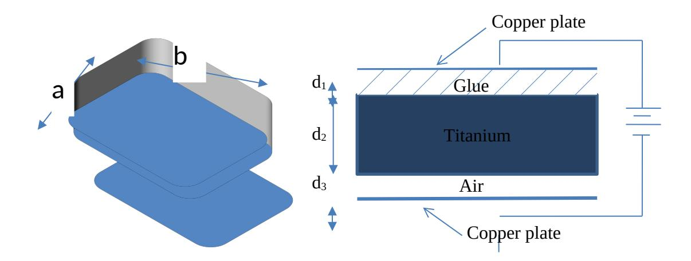
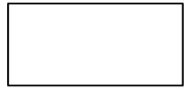
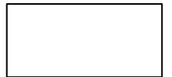
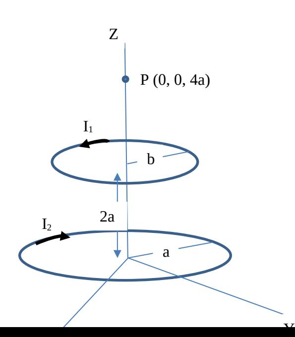
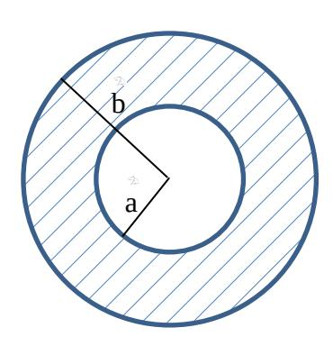
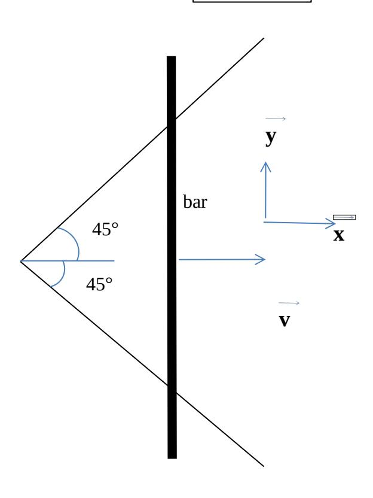
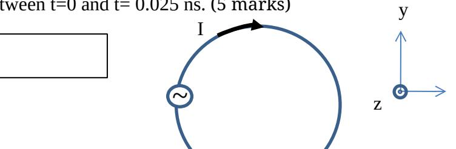
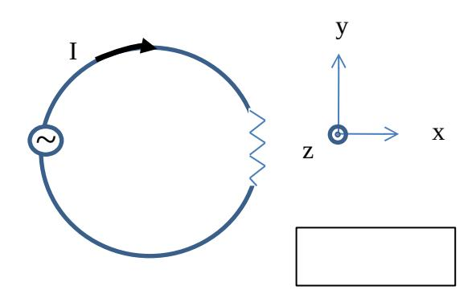

## **University of Waterloo Final Examination**

#### **Spring 2013**

Course Number: ECE 106

Course Title: Physics of Electrical Engineering II

Professor: Mansour (section 001) and Ramahi (Section 002) (circle your prof's name)

Last Name: \_\_\_\_\_\_\_\_\_\_\_\_\_\_\_\_\_\_\_\_\_\_\_ Initials \_\_\_\_\_\_\_\_\_\_

First Name: \_\_\_\_\_\_\_\_\_\_\_\_\_\_\_\_\_\_\_\_\_\_\_

ID #: \_\_\_\_\_\_\_\_\_\_\_\_\_\_\_\_\_\_\_\_\_\_\_\_\_\_\_\_ Signature \_\_\_\_\_\_\_\_\_\_\_\_\_\_\_\_\_\_\_\_\_\_\_\_\_\_\_

Date of Exam: Aug 6 , 2013

Time Period: 9:00 am – 11:30 am

Duration of Exam: 2.5 hours

Number of Exam Pages: 8

(including this cover sheet)

Aids Allowed: Calculator, formula sheet provided

## **Attempt all 5 questions. Hand marked (worth 20 marks each).**

- 1. Write your answers **with units** (unless inappropriate) in the spaces provided whenever applicable.
- 2. If you need more space, use the back of the previous page, BUT please leave a note directing the marker to any such extra work.
- 3. **To earn full marks, your solutions must show your full reasoning. Correct answers without any appropriate reasoning or with unreadable reasoning will not be awarded credit.**
- 4. Make sure your calculator is in either radians or degrees, as required. If you use a programmable calculator, make sure that the memory is cleared.
- 5. Ask a proctor to clarify a question if you think it is necessary. If the student proctor cannot Answer your question satisfactorily; ask him / her to call the Professor.
- 6. **Assume any data** that is given is accurate to as many significant figures as necessary.
- 7. Ensure your booklet has 8 pages and 5 questions, there should be a formula sheet at the end and an extra page for over flow calculations if needed. If you use this page please provide very clear instructions to the marker

## **MARKING SCHEME**

| MARK | MARK  |
|------|-------|
| 1.   | 4.    |
| 2.   | 5.    |
| 3.   | Total |

# **Question 1**

A clumsy engineer attempts to design a capacitor, but leaves an air gap and a glue gap as shown. The glue has a dielectric constant of 4, and the material used for the capacitor is titanium dioxide, with a dielectric constant of 110. The dimensions of the capacitor are shown below.

a) Find the capacitance of the clumsy capacitor (7 marks).

The capacitor is now charged across a 20 V battery. While connected to the battery find

b) The potential difference across the titanium dioxide (7 marks )

c) D and E for the glue and air regions (4 marks)

# **Question 2**

(a) Find the magnetic field due to a ring of radius R and current I, at point P, a distance z away from the centre of the ring on the axis of symmetry perpendicular to the plane of the ring. You must draw a very clear diagram and justify all your steps. (8 marks)

(b) Find an expression for the field, for z >> R in terms of the dipole moment of the ring. Use full vector form. (4 marks)

(c) Using the result from part a, find the magnetic field at P due to the two loops carrying currents I1 and I2 as shown. The loop carrying current I2 is in the xy plane, and has radius a, and the loop carrying current I1 is parallel to the first loop and at a distance of 2a above it. (8 marks)

b 2

# **Question 3**

A straight long solid cylindrical conductor of inner radius a and outer radius b carries current I along its length. The current density varies as J=J0/r2 within the conductor, where r is the radial distance from the axis of symmetry of the conductor. A cross section of the conductor is shown. All parts below have equal marks.

a) Find the constant J0 in terms of the current I and the dimensions of the wire.

b) Find the magnetic field for r < a

c) Find the magnetic field for r > a

d) Find the magnetic field for a < r < b assuming a relative permeability of 1 (μ=μ0).

# **Question 4**

Consider the wires arranged as shown. An infinitely long bar is moving with speed v in the + x direction, assume the wires and the bar are conductors such that at the instant shown the resistance of the loop formed by the wires and the bar is R. The bar is in perfect contact with the wires as it slides out. The wires do not move. There is a uniform magnetic field of Strength B into the page (- z direction) everywhere in space.

a) Calculate the current in the wire at as a function of time and indicate whether the current flows up or down in the bar, explain. (12 marks)

b) Calculate the power dissipated as heat in the loop at the instant shown (4 marks)

c) Find the force you have to pull with the keep the bar moving at that speed. (4 marks)

# **Question 5**

The figure shows a conducting loop of radius r = 7 cm with a current of I = 0.6 A flowing in it. The loop is in the xy plane, in a region where there is a uniform external magnetic field given by **B**=300 cos ωt *z*^ over the entire space where the loop is. The frequency of the time dependent magnetic field is 10 GHz.

a) Assuming that the magnetic field induced by the current I is much smaller than **B**, calculate the induced emf in the loop? Also indicate value and direction of induced current associated with the induced emf between t=0 and t= 0.025 ns. (5 marks)

b) By what factor does the indcuctance of the loop change if the current in the loop, I, was increased by a factor of 20. (5 marks)

x

c) A resisitve load is now added to the loop. If it were desirable to reduce the inductance of the loop, (and thus the mf induce in the loop) how would you suggest accomplising that. (5 marks)

d) A solenoid of cross section 4 cm $^2$  has current I = 0.06 amps running through it. The solenoid is of length l= 20 cm and has 60 tightly wound turns per cm. What resistivity of the material used to make the solenoid would be needed to result in a magnetic field of 3 mT inside the solenoid. (5 marks)

### Formula sheet

 $\Phi_e$ = $Q_{enc}/\epsilon_0$  Area of spherical shell =  $4\pi r^2$ , g = 9.8 ms-2

$$k = \frac{1}{4\pi\varepsilon_{o}} = 8.99 \times 10^{9} \, \text{Nm}^{2} / \text{C}^{2}$$

$$\varepsilon_{o} = 8.85 \times 10^{-12} \, \text{C}^{2} / \text{Nm}^{2} \quad e = 1.6 \times 10^{-19} \, \text{C}$$

$$F = \frac{Qq}{4\pi\varepsilon_{o}r^{2}} \; ; \qquad E = \frac{Q}{4\pi\varepsilon_{o}r^{2}} \; ; \qquad \oint_{s} \vec{E} \cdot d\vec{s} = \frac{Q_{enc}}{\varepsilon_{o}} \; ; \qquad \varphi_{B} = \oint_{s} \vec{B} \cdot d\vec{s} \; ;$$

$$\oint \vec{B} \cdot d\vec{l} = \mu_{o} I_{enc}; \quad \vec{F} = q\vec{v} \times \vec{B}; \qquad d\vec{F} = Id\vec{l} \times \vec{B}; \qquad L = N \frac{\varphi_{B}}{I} \qquad R = \frac{\rho l}{A}$$

$$m_{e} = 9.11 \times 10^{-31} \, kg \quad m_{p} = 1.67 \times 10^{-27} \, kg \qquad \chi = \frac{-b \pm \sqrt{(b^{2} - 4ac)}}{2a} \; \text{(quadratic eqn roots)}$$

B=  $\mu_0 I/2\pi r$  (long conductor) B=  $\mu_0 nI$  (solenoid) B=  $\mu_0 I/2r$  (centre of circular loop) E= $\lambda/\epsilon_0 2\pi r$  (long line of charge) U=CV2/2 = Q2/2C, U=LI2/2

Q=CΔVCκ=κC parallel plate capacitor C= $\epsilon_0$ A/d  $\Delta V = -\int_a^b \vec{E} \cdot d\vec{l}$ 

 $\Phi_e = Q_{enc}/\epsilon_0$  Area of spherical shell =  $4\pi r^2$ ,  $\mu_0 = 4^{\pi} \times 10^{-7}$ ,  $\mu = IA$ . (magnetic dipole-moment)

| $E = \frac{\rho_l}{2 \pi \varepsilon_0 r^{\Box}}$ | field due to an infinite line  |
|---------------------------------------------------|--------------------------------|
| $E = \frac{\rho_s}{2\varepsilon_0}$               | field due to an infinite plane |

| $\vec{B} = \frac{\mu_0}{4\pi r^2} q \vec{v} \times \hat{r}$                         | Biot-Savart Law |
|-------------------------------------------------------------------------------------|-----------------|
| $e = \oint \vec{E} \cdot d\vec{l} = -\frac{d}{dt} \oint_{s} \vec{B} \cdot d\vec{s}$ | Induced emf     |
| $e = -\frac{d\lambda}{dt} = -N \frac{d\varphi_B}{dt}$                               | Induced emf     |

## **Integrals**

$$\int x \, dx = \frac{1}{2}x^2$$

$$\int x^2 \, dx = \frac{1}{3}x^3$$

$$\int \frac{x \, dx}{(x^2 \pm a^2)^{3/2}} = \frac{\pm x}{a^2 \sqrt{x^2 \pm a^2}}$$

$$\int \frac{1}{x^2} \, dx = -\frac{1}{x}$$

$$\int \frac{1}{x^2} \, dx = -\frac{1}{x}$$

$$\int e^{ax} \, dx = \frac{1}{a}e^{ax}$$

$$\int x^n \, dx = \frac{x^{n+1}}{n+1} \qquad n \neq -1$$

$$\int \frac{dx}{a} = \ln x$$

$$\int \sin(ax) \, dx = -\frac{1}{a}\cos(ax)$$

$$\int \frac{dx}{a+x} = \ln (a+x)$$

$$\int \cos(ax) \, dx = \frac{1}{a}\sin(ax)$$

$$\int \sin^2(ax) \, dx = \frac{x}{2} - \frac{\sin(2ax)}{4a}$$

$$\int \frac{dx}{\sqrt{x^2 \pm a^2}} = \ln(x + \sqrt{x^2 \pm a^2})$$

$$\int \cos^2(ax) \, dx = \frac{x}{2} + \frac{\sin(2ax)}{4a}$$

$$\int \frac{dx}{\sqrt{x^2 \pm a^2}} = \sqrt{x^2 \pm a^2}$$

$$\int \frac{dx}{\sqrt{x^2 \pm a^2}} = \frac{1}{a}\tan^{-1}\left(\frac{x}{a}\right)$$

$$\int \frac{dx}{\sqrt{x^2 \pm a^2}} = \frac{1}{2a^3}\tan^{-1}\left(\frac{x}{a}\right) + \frac{x}{2a^2(x^2 + a^2)}$$