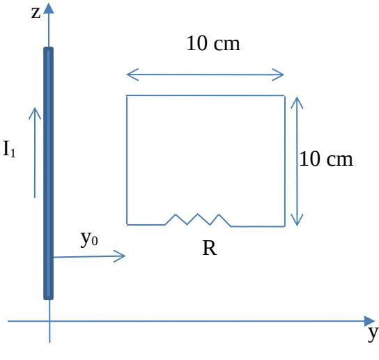
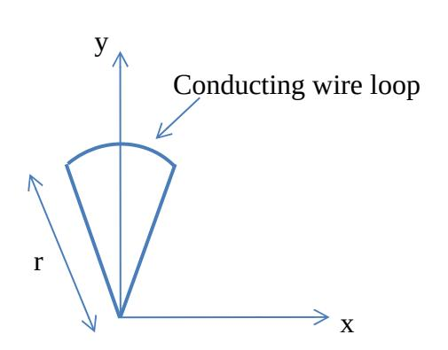
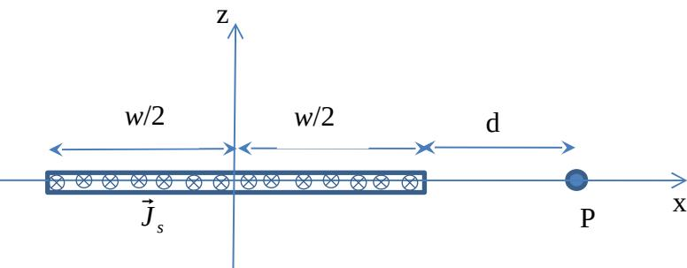
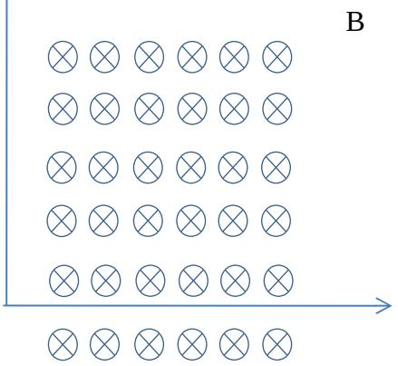

## **University of Waterloo Final Examination**

### **Winter 2014**

Course Number: ECE 106

Course Title: Physics of Electrical Engineering II

Professor: F. Mansour (section 001) and O. Ramahi (Section 002)

(circle your prof's name)

| Last Name:    | Initials      |  |
|---------------|---------------|--|
| First Name:   |               |  |
| ID #:         | Signature     |  |
| Date of Exam: | April 8, 2014 |  |

Time Period: 12:30 – 15:00

Duration of Exam: 2.5 hours

Number of Exam Pages: 8

(including this cover sheet)

Aids Allowed: Calculator, formula sheet provided

## **Attempt all 5 questions. Hand marked (worth 20 marks each).**

- 1. Write your answers **with units** (unless inappropriate) in the spaces provided whenever applicable.
- 2. If you need more space, use the back of the previous page, BUT please leave a note directing the marker to any such extra work.
- 3. **To earn full marks, your solutions must show your full reasoning. Correct answers without any appropriate reasoning or with unreadable reasoning will not be awarded credit.**
- 4. Make sure your calculator is in either radians or degrees, as required. If you use a programmable calculator, make sure that the memory is cleared.
- 5. Ask a proctor to clarify a question if you think it is necessary. If the student proctor cannot Answer your question satisfactorily; ask him / her to call the Professor.
- 6. **Assume any data** that is given is accurate to as many significant figures as necessary.
- 7. Ensure your booklet has 8 pages and 5 questions, there should be a formula sheet at the end and an extra page for over flow calculations if needed. If you use this page please provide very clear instructions to the marker

## **MARKING SCHEME**

| MARK | MARK  |  |
|------|-------|--|
| 1.   | 4.    |  |
| 2.   | 5.    |  |
| 3.   | Total |  |

The square loop shown in the figure is pulled so that it moves away in the y-direction from a *long*  (infinitely long) wire carrying a current of I1 = 12 A and positioned at y=0. The loop moves at a constant speed of 8 m/s. The surface of the loop is coplanar with the axis of the wire.

a) If a resistance of R=10 Ohms is placed within the loop as shown, find the induced current in the loop at the position shown, where the left edge of the loop is a distance y0 from the long wire. (12 Marks)

b) What force would one have the pull the loop with to the right so it moves at the constant speed indicated above when is it is at the position shown in the figure. (3 marks)

c) Calculate the power dissipated in the loop for the configuration shown in the figure. (3 marks)

d) Show that your answer for part b can be obtained by considering the mechanical work done by the force you use to pull the loop at a constant speed. (2 marks)

A conducting wire loop shaped like a wedge with a perfectly circular arc at the top as shown is positioned in the *x-y* plane in a region where a magnetic field points in the positive z direction (out of the page). The field is given by B=B0cos(θ) **k**. (**k** is a unit vector) where θ is measured clockwise with the *y* axis at θ=0. The field occupies the whole space. The length of each straight edge of the wedge shaped loop is r (as shown) and the arc length is (πr/10).

a) Calculate the area of the circular wedge. (3 marks)

b) Calculate the magnetic flux through the wedge for the configuration shown. The y axis bisects the wedge down the middle. ( 8 marks)

c) Find an expression for the induced emf in the wedge if is made to spin about the origin of coordinates in the *x-y* plane, at angular speed ω in the clockwise direction. (Hint, start at an arbitrary position of the loop). (9 marks)

An infinitely long thin conducting sheet of width *w* positioned along the x axis lies in the x-y plane as shown. The sheet carries a uniform current density of ⃗*J s*= *J* 0 ^*j* Amp/m.

a) Find the total current flowing in the sheet. (3 marks)

b) Find the current flowing in the sheet over a infinitesimally small width "*dx*" (3 marks).

I

c) Find magnetic field at the point P due to the current in the sheet (14 marks)

| a) | Starting from basic principles, use Ampere's Law to find the magnetic field inside a solenoid of length L and total number of turns N, if current I flows through it. Your diagram should show the Ampere loop very clearly, the integration path and you should state any necessary assumption to carry out your calculations. Assume the solenoid is very long in comparison to the diameter. Give the value of the magnetic field B for an 11 cm long solenoid with 60 turns and a current of 200 mA. The solenoid has a cross section of 0.5 cm2 . ( 5 marks) |  |
|----|----------------------------------------------------------------------------------------------------------------------------------------------------------------------------------------------------------------------------------------------------------------------------------------------------------------------------------------------------------------------------------------------------------------------------------------------------------------------------------------------------------------------------------------------------------------------------------------|--|
|    |                                                                                                                                                                                                                                                                                                                                                                                                                                                                                                                                                                                        |  |
|    |                                                                                                                                                                                                                                                                                                                                                                                                                                                                                                                                                                                        |  |
|    |                                                                                                                                                                                                                                                                                                                                                                                                                                                                                                                                                                                        |  |
|    |                                                                                                                                                                                                                                                                                                                                                                                                                                                                                                                                                                                        |  |
|    |                                                                                                                                                                                                                                                                                                                                                                                                                                                                                                                                                                                        |  |
| b) | A square conducting loop of area 0.2 cm2 is now placed inside the solenoid, close to its centre. The loop area is perpendicular to the axis of the solenoid (the cross section of solenoid and loop are parallel). If an alternating current given by i(t)=0.7 sin[(2π/0.03)t] flows in the solenoid, find an expression for the emf induced in the loop between t=0.015 and t=0.03 s. (7 marks)                                                                                                                                                                        |  |
|    |                                                                                                                                                                                                                                                                                                                                                                                                                                                                                                                                                                                        |  |
|    |                                                                                                                                                                                                                                                                                                                                                                                                                                                                                                                                                                                        |  |
|    |                                                                                                                                                                                                                                                                                                                                                                                                                                                                                                                                                                                        |  |
| c) | The square loop in part b. is now replaced with an identical loop but made of non conducting material, what effect will that have on the induced emf in the loop. (3 marks)                                                                                                                                                                                                                                                                                                                                                                                                         |  |
|    |                                                                                                                                                                                                                                                                                                                                                                                                                                                                                                                                                                                        |  |
|    |                                                                                                                                                                                                                                                                                                                                                                                                                                                                                                                                                                                        |  |
|    |                                                                                                                                                                                                                                                                                                                                                                                                                                                                                                                                                                                        |  |
| d) | For part a, if the solenoid was tightly wound (and properly insulated), with no space between turns, what would the resistivity of the material it is made from be? (5 marks)                                                                                                                                                                                                                                                                                                                                                                                                    |  |
|    |                                                                                                                                                                                                                                                                                                                                                                                                                                                                                                                                                                                        |  |
|    |                                                                                                                                                                                                                                                                                                                                                                                                                                                                                                                                                                                        |  |

An electron enters with a velocity of *v* =2 *x* 10 7 ^*i m* / *s* (parallel to and in the same direction as the positive x axis) a region of uniform magnetic field given by *B*=*B*0 ^*j* (**B** into the page) as shown and emerges from the field region 80 ns later with a velocity vector pointing along the negative x direction. z

a) Find the field strength B0(7 marks)

v e

x

b) Now a loop of radius r = 3.5 cm is placed in the region of the field such that its cross section (plane) makes an angel of 17 degrees with the direction of the field. Find the torque on the loop when a current of 0.7 mA flows through it in. Express the torque in vector form, the current flows in a clockwise direction. (If there is more than one possible scenario for the configuration of the loop in the field then you can pick the one you want.) (5 marks)

| c) | This part is not related to the previous two. A current $I = 90 \text{ mA}$ flows in aseries LR circuit at |
|----|------------------------------------------------------------------------------------------------------------|
|    | t=0, the resistance in the circuit is 1200 Ohms, and the current drops to 10 percent of its value          |
|    | after 600 ms. Find the inductance. You will have to jsutify your answer fully. (Draw the                   |
|    | circuit and derive the expression for the time constant). (8 marks)                                        |

## Formula sheet

 $\Phi_e$ = $Q_{enc}/\epsilon_0$  Area of spherical shell =  $4\pi r^2$ , g = 9.8 ms $^{-2}$ 

$$Φ_e = Q_{enc}/ε_0$$
 Area of spherical shell =  $4πr^2$ ,  $g = 9.8 \text{ ms}^{-2}$ 
 $k = \frac{1}{4πε_o} = 8.99x10^9 Nm^2 / C^2$ 
 $ε_o = 8.85x10^{-12}C^2 / Nm^2$ 
 $\ne = 1.6x10^{-19}C$ 
 $F = \frac{Qq}{4πε_o r^2}; \quad E = \frac{Q}{4πε_o r^2}; \quad \oint_s \vec{E} . d\vec{s} = \frac{Q_{enc}}{ε_o}; \quad φ_B = \oint_s \vec{B} . d\vec{s};$ 

$$\oint \vec{B} . d\vec{l} = μ_0 I_{enc}; \quad \vec{F} = q\vec{v} \times \vec{B}; \quad d\vec{F} = Id\vec{l} \times \vec{B}; \quad L = N \frac{φ_B}{I}$$
 $m_e = 9.11x10^{-31}kg \quad m_p = 1.67x10^{-27}kg \quad x = \frac{-b \pm \sqrt{(b^2 - 4ac)}}{2a} \text{ (quadratic eqn roots)}$ 

$$B = μ_0 I/2πr \text{ (long conductor)} \quad B = μ_0 II \text{ (solenoid)} \quad B = μ_0 I/2r \text{ (centre of circular loop)}$$

 $B = \mu_0 I/2\pi r$  (long conductor)  $B = \mu_0 nI$  (solenoid)  $B = \mu_0 I/2r$  (centre of circular loop)  $E=\lambda/\epsilon_0 2\pi r$  (long line of charge)  $U=CV^2/2=Q^2/2C$ ,  $U=LI^2/2$ 

parallel plate capacitor  $C=\varepsilon_0 A/d$   $\Delta V = -\int_{-1}^{b} \vec{E} \cdot d\vec{l}$  $Q=C\Delta VC_{\kappa}=\kappa C$ 

 $\Phi_e = Q_{enc}/\epsilon_0$  Area of spherical shell =  $4\pi r^2$ ,  $\mu_0 = 4\pi x 10^{-7}$ ,  $\mu = IA$ . (magnetic dipole-moment)

| -1                                                                                  | h (8-1)                        |
|-------------------------------------------------------------------------------------|--------------------------------|
| $E = \frac{\rho_l}{2\pi\varepsilon_0 r^{\Box}}$                                     | field due to an infinite line  |
| $E = \frac{\rho_s}{2\varepsilon_0}$                                                 | field due to an infinite plane |
| $\vec{B} = \frac{\mu_0}{4\pi r^2} q \vec{v} \times \hat{r}$                         | Biot-Savart Law                |
| $e = \oint \vec{E} \cdot d\vec{l} = -\frac{d}{dt} \oint_{s} \vec{B} \cdot d\vec{s}$ | Induced emf                    |
| $e = -\frac{d\lambda}{dt} = -N\frac{d\varphi_B}{dt}$                                | Induced emf                    |

$$\int x \, dx = \frac{1}{2}x^2$$

$$\int x^2 \, dx = \frac{1}{3}x^3$$

$$\int \frac{x \, dx}{(x^2 \pm a^2)^{3/2}} = \frac{1}{a^2}x^3$$

$$\int \frac{1}{x^2} \, dx = -\frac{1}{x}$$

$$\int x^n \, dx = \frac{x^{n+1}}{n+1} \qquad n \neq -1$$

$$\int x^n \, dx = \frac{1}{a}e^{ax}$$

$$\int x^n \, dx = \frac{1}{a}e^{ax}$$

$$\int x^n \, dx = \frac{1}{a}e^{ax}$$

$$\int x^n \, dx = \frac{1}{a}e^{ax}$$

$$\int \sin(ax) \, dx = -\frac{1}{a}\cos(ax)$$

$$\int \frac{dx}{a+x} = \ln(a+x)$$

$$\int \cos(ax) \, dx = \frac{1}{a}\sin(ax)$$

$$\int \sin^2(ax) \, dx = \frac{x}{2} + \frac{1}{2}\sin(ax)$$

$$\int \frac{dx}{\sqrt{x^2 \pm a^2}} = \ln(x + \sqrt{x^2 \pm a^2})$$

$$\int \cos^2(ax) \, dx = \frac{x}{2} + \frac{1}{2}\sin(ax)$$

$$\int \frac{dx}{\sqrt{x^2 \pm a^2}} = \sqrt{x^2 \pm a^2}$$

$$\int \frac{dx}{\sqrt{x^2 \pm a^2}} = \frac{1}{a}\tan^{-1}\left(\frac{x}{a}\right)$$

$$\int \frac{dx}{\sqrt{x^2 + a^2}} = \frac{1}{2}a\tan^{-1}\left(\frac{x}{a}\right) + \frac{x}{2}a^2(x^2 + a^2)$$