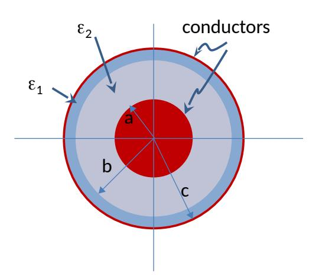
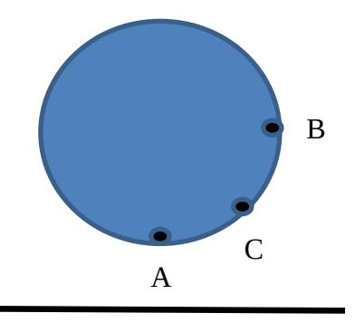
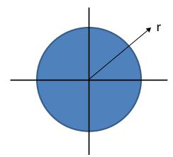
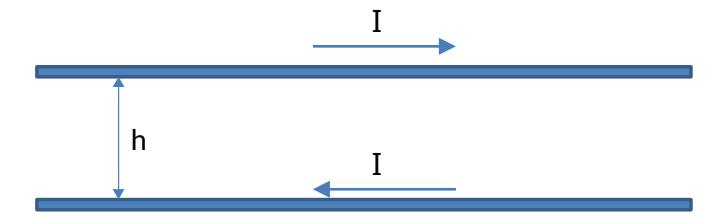
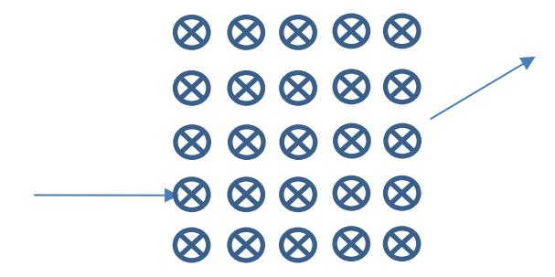
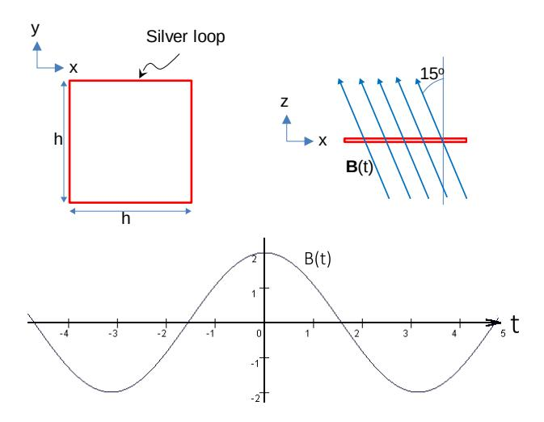

### **University of Waterloo Final Examination**

#### **Winter 2016**

Course Number: ECE 106

Course Title: Physics of Electrical Engineering II

Professor: O. Ramahi (section 001) and F. Mansour (Section 002) (circle your prof's

name)

| Last Name:  | Initials  |  |
|-------------|-----------|--|
| First Name: |           |  |
| ID #:       | Signature |  |

Date of Exam: April 13 , 2015

Time Period: 4:00 pm – 6:30 pm

Duration of Exam: 2.5 hours

Number of Exam Pages: 8

(including this cover sheet)

Aids Allowed: Calculator, formula sheet provided

## **Attempt all 5 questions. Hand marked (worth 20 marks each).**

- 1. Write your answers **with units** (unless inappropriate) in the spaces provided whenever applicable.
- 2. If you need more space, use the back of the previous page, BUT please leave a note directing the marker to any such extra work.
- 3. **To earn full marks, your solutions must show your full reasoning. Correct answers without any appropriate reasoning or with unreadable reasoning will not be awarded credit.**
- 4. Make sure your calculator is in either radians or degrees, as required. If you use a programmable calculator, make sure that the memory is cleared.
- 5. Ask a proctor to clarify a question if you think it is necessary. If the student proctor cannot Answer your question satisfactorily; ask him / her to call the Professor.
- 6. **Assume any data** that is given is accurate to as many significant figures as necessary.
- 7. Ensure your booklet has 8 pages and 5 questions, there should be a formula sheet at the end and an extra page for over flow calculations if needed. If you use this page please provide very clear instructions to the marker. Please write your name on every sheet, in case they get separated.

## **MARKING SCHEME**

| MARK | MARK  |  |
|------|-------|--|
| 1.   | 4.    |  |
| 2.   | 5.    |  |
| 3.   | Total |  |

**Part A)** A clumsy engineer (not UW graduate for sure) built a coaxial transmission line but he forgot to strip the insulation from the outer conductor. He ended up with coaxial line that effectively has two dielectric layers as shown in the figure below. The radius of the inner conductor is a=0.5 cm, the inner filling between a < r < b has a relative dielectric permittivity of 2=5 and the insulation in b < r < c has a relative dielectric permittivity of 1 of 3. Assume b=0.7cm and c=0.75cm.

a) Find the per-unit-length capacitance of the line (has units of Farads/m)

b) State the assumptions you used to find the capacitance.

**Part B)** The ball shown is a dielectric of dielectric constant r and radius R. It is placed above a large, uniformly charged sheet, with charge density +σ.

a) Find the potential difference between points A and B. These points are just inside the sphere. (5 marks)

b) Find the strength of the electric field at point C midways between points A and B just on the inside of material. ( 4 marks)

**Part A** Consider a conducting cable with a uniform circular cross section as shown in the figure below. Assuming that the current density in the cable is not uniform and is given by *J s*= *r* 3 Amp/m2 where *r* is the radial coordinate. Find the resistance of the cable per unit length.

## **Part B** (Straight Derivation)

From first principles find the magnetic field (flux density) B due to a ring of current of radius R at the centre of the ring with current I flowing in it. Express in terms of the ring's magnetic dipole moment. (10 marks)

A two-line transmission line system is made of two lines as shown. One line is for the outgoing current and the second for the incoming current. The vertical separation between the two lines is h = 15m. Assume the lines are very thin and the current to be 25.5 Amps. All parts of equal value.

- a) Find the self-inductance of the transmission line if the line is 1000 m long.
- b) Sketch the strength of the magnetic field in the space between the two line,

c) State the assumptions you used to find the inductance

d) How will the inductance change if this line system were installed in Jakarta, Indonesia where the humidity is high such that the air will have a relative dielectric permittivity of 10. Explain your answer.

e) Recalculate the inductance but this time for a current of 51 Amps.

A magnetic lens is being tested for potential use in an electron microscope. An electron beam with electrons moving at speed v along the positive *y* direction is fired into a region where the magnetic field points along the positive *x* direction. The electron beam is seen to exit the field region 0.3 ms later such that makes an angle of 24 degrees (deflection angle) with the direction of incidence having traversed the full width of the field region. All parts of equal value.

a) Find the strength of magnetic field

b) The distance between the point of entrance and the point of exit is measured to be 0.3 mm, find the speed of the electrons.

c) The potential difference through which the electrons are accelerated before they enter the magnetic field region, is now quadrupled, what is the new angle of deflection.

d) it is now desired to restore the original angle of deflection by using an electric field pointing along the z direction within the magnetic field region, find the strength of the electric field.

Consider a square loop made of silver, which is a very highly conducting material. A magnetic field is directed such that it makes an angle of 15o from the normal to the loop as shown in the figure below. The magnetic field is varying with time as B(t) = 2 cos (t) Tesla, where = 2/6.4. The period of the sinusoidal signal for B(t) is 6.4 seconds. During the interval 0 < t < 1.6 seconds, the field is out of the board (has x and z components). In 1.6 < t < 4.8 seconds, the field is into the board (has x and z components). Assume h = 5 cm. The negative time axis is there for completeness only.

a) Find the induced EMF in the loop.

b) Assuming the net resistance of the entire loop is 0.01 Ohms. Calculate the current induced in the loop and make sure you indicate its direction over each cycle between for the interval 0< t < 4.8 s. Define your convention for direction of the current. Plot the current as a time-varying signal on the same plot for the B(t) given below.

c) How can you measure the induced EMF in the loop? You are free to cut and insert elements in the loop to facilitate the measurement.

d) If the silver material of the loop is replaced with Plexiglas having a relative dielectric permittivity of 2.1 and conductivity of zero. By what percentage would the induced EMF in the loop change? Explain and justify your answer.

### Formula sheet

Area of spherical shell =  $4\pi r^2$ , g = 9.8 ms-2

Area of spherical shell = 
$$4\pi r^2$$
,  $g = 9.8 \text{ ms}^{-2}$ 

$$k = \frac{1}{4\pi\varepsilon_o} = 8.99 \times 10^9 \text{ Nm}^2 / \text{C}^2$$

$$\varepsilon_o = 8.85 \times 10^{-12} \text{ C}^2 / \text{Nm}^2 \quad e = 1.6 \times 10^{-19} \text{ C}$$

$$F = \frac{Qq}{4\pi\varepsilon_o r^2} \; ; \qquad E = \frac{Q}{4\pi\varepsilon_o r^2} \; ; \qquad \Phi_E = \oint_s \vec{E} \cdot d\vec{s} = \frac{Q_{enc}}{\varepsilon_o} \; ; \qquad \Phi_B = \oint_s \vec{B} \cdot d\vec{s} \; ;$$

$$\vec{F} = q\vec{v} \times \vec{B}; \qquad d\vec{F} = Id\vec{l} \times \vec{B}; \qquad L = \frac{\Phi_B}{I} \qquad R = \frac{\rho l}{A}$$

$$m_e = 9.11 \times 10^{-31} kg \quad m_p = 1.67 \times 10^{-27} kg \qquad x = \frac{-b \pm \sqrt{(b^2 - 4ac)}}{2a} \; \text{(quadratic eqn roots)}$$

$$B = \mu_o I / 2\pi r \; \text{(long conductor)} \qquad B = \mu_o I \; \text{(solenoid)} \qquad B = \mu_o I / 2r \; \text{(centre of circular loop)}$$

 $B = \mu_0 I/2\pi r$  (long conductor)  $B = \mu_0 nI$  (solenoid)  $B = \mu_0 I/2r$  (centre of circular loop) E= $\lambda/\epsilon_0 2\pi r$  (long line of charge) U=CV2/2 = Q2/2C,  $U=LI^2/2$ 

parallel plate capacitor  $C=\varepsilon_0 A/d$   $\Delta V_{ab} = -\int_{a}^{b} \vec{E} \cdot d\vec{l}$  $Q=C\Delta VC_{\kappa}=\kappa C$ 

 $\Phi_e = Q_{enc}/\varepsilon_0$  Area of spherical shell =  $4\pi r^2$ ,  $\mu_0 = 4\pi x 10^{-7}$ ,  $\mu = IA$ . (magnetic dipole-moment)

| splitting $\mu_0$ in $\mu_0$                                                                                         | μ III (Illagricale alpore Illometri) |
|----------------------------------------------------------------------------------------------------------------------|--------------------------------------|
| $E = \frac{\rho_l}{2\pi\varepsilon_0 r^{\Box}}$                                                                      | field due to an infinite line        |
| $E = \frac{\rho_s}{2\varepsilon_0}$                                                                                  | field due to an infinite plane       |
| $\vec{B} = \frac{\mu_0}{4\pi r^2} Id\vec{l} \times \hat{r}$                                                          | Biot-Savart Law                      |
| $\mathcal{E} = \oint_{C} \vec{E} \cdot d\vec{i} = -\frac{d\Phi_{B}}{dt} = -\frac{d}{dt} \int_{A_{C}}^{\Box} \vec{B}$ | Faraday's law/Induced <i>emf</i>     |
| $ \oint_C \vec{B} \cdot d\vec{l} = \mu_0 I = \int_{A_C} \vec{J} \cdot d\vec{A} $                                     | Ampere's Law                         |

$$\int x \, dx = \frac{1}{2}x^2$$

$$\int x^2 \, dx = \frac{1}{3}x^3$$

$$\int \frac{x \, dx}{(x^2 \pm a^2)^{3/2}} = \frac{\pm x}{a^2 \sqrt{x^2 \pm a^2}}$$

$$\int \frac{1}{x^2} \, dx = -\frac{1}{x}$$

$$\int \frac{1}{x^2} \, dx = -\frac{1}{x}$$

$$\int e^{ax} \, dx = \frac{1}{a}e^{ax}$$

$$\int x^n \, dx = \frac{x^{n+1}}{n+1} \qquad n \neq -1$$

$$\int \frac{dx}{x} = \ln x$$

$$\int \sin(ax) \, dx = -\frac{1}{a}\cos(ax)$$

$$\int \frac{dx}{a+x} = \ln (a+x)$$

$$\int \cos(ax) \, dx = \frac{1}{a}\sin(ax)$$

$$\int \frac{x \, dx}{a+x} = x - a \ln (a+x)$$

$$\int \frac{dx}{\sqrt{x^2 \pm a^2}} = \ln(x + \sqrt{x^2 \pm a^2})$$

$$\int \cos^2(ax) \, dx = \frac{x}{2} + \frac{\sin(2ax)}{4a}$$

$$\int \frac{x \, dx}{\sqrt{x^2 \pm a^2}} = \sqrt{x^2 \pm a^2}$$

$$\int \int_0^\infty x^n e^{-ax} \, dx = \frac{n!}{a^{n+1}}$$

$$\int \frac{dx}{x^2 + a^2} = \frac{1}{a} \tan^{-1} \left(\frac{x}{a}\right)$$

$$\int \int_0^\infty e^{-ax^2} \, dx = \frac{1}{2} \sqrt{\frac{\pi}{a}}$$