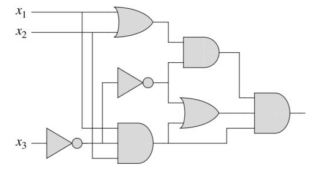
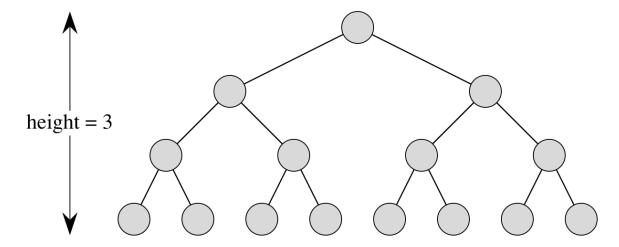
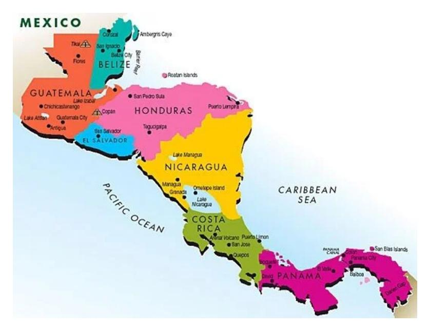
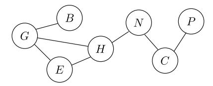
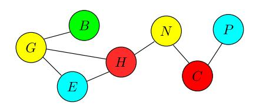
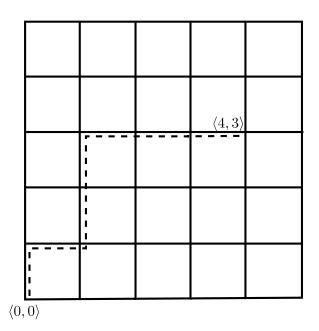

# ECE 108 — Practice Problems

---

> [!abstract] Set 1
> ## Propositional logic, implication, contrapositive, quantifiers

> [!example] **Problem 1**
> 

Prove each of the "if and only if" propositions on Page 17 of your textbook.

> [!success]- Solution

---

> [!example] **Problem 2**
> 

We are told that if a leopard can swim, then so can a tiger. Then, prove that if a tiger can swim implies that a jaguar can swim, then a leopard can swim implies that a jaguar can swim.

> [!success]- Solution

---

> [!example] **Problem 3**
> 

Is "$\implies$" associative? That is, is the following claim true?

$$
[(p \implies q) \implies r] \iff [p \implies (q \implies r)]
$$

> [!success]- Solution

---

> [!example] **Problem 4**
> 

What is the contrapositive of the following statement? Assume that each of $x, y$ is a real number. Are you able to prove it "directly", i.e., with a technique other than proving its contrapositive, which would be the original statement?

If $x < y$, then $x < \frac{x+y}{2} < y$.

> [!success]- Solution

---

> [!example] **Problem 5**
> 

Alice knows that Bob, Carol and Dave are all of different ages. She knows that Bob is at most 5 years older than Dave, and Carol is at least 2 years younger than Bob. She knows also that Dave and Carol are at least 4 years apart.

Does Alice have sufficient information to unambiguously determine who amongst Bob, Carol and Dave is the oldest, who is the youngest and who is in the middle? Justify.

> [!success]- Solution

---

> [!example] **Problem 6**
> 

The *circuit satisfiability* problem asks whether there exist 0/1 inputs that causes the output of a single-output circuit to be 1. Is the following circuit satisfiable? Why or why not?

> [!success]- Solution

---

> [!example] **Problem 7**
> 

Consider the statement: "$\sqrt{4}$ is not rational."

- **a.** Write the statement using the "$\forall$" quantifier.
- **b.** Negate your statement from (a) so you have a statement that uses the "$\exists$" quantifier.
- **c.** Consider the original statement "$\sqrt{4}$ is not rational". Suppose we attempt to prove it by emulating the proof for Claim 5 in your textbook that $\sqrt{2}$ is not rational. Where would the proof fall apart?

> [!success]- Solution

---

> [!example] **Problem 8**
> 

Prove that for every $n \in \mathbb{N} = \{1, 2, \ldots\}$, there exists unique $m \in \mathbb{N}$ such that $n \in \{(m-1)^2 + 1, \ldots, m^2\}$.

> [!success]- Solution

---

> [!abstract] Set 2
> ## Proof techniques — contradiction, induction, pigeonhole; set identities

Some problems are taken/adapted from Schaum's Outlines *Discrete Mathematics* 3rd ed. (Lipschutz & Lipson), the ECE 108 course notes (Matthew Harris), and Gemini.

> [!example] **Problem 1**
> 

For real numbers $x, y$, denote the larger of them as $\max\{x, y\}$. Prove:

$$
\max\{x, y\} = \frac{x + y + |x - y|}{2}
$$

> [!success]- Solution

---

> [!example] **Problem 2**
> 

A real number is said to be *irrational* if it is not rational.

Prove: there exist irrational numbers $a, b$ such that $a^b$ is rational.

> [!success]- Solution

---

> [!example] **Problem 3**
> 

Prove that

$$
2^0 + 2^1 + \ldots + 2^n = 2^{n+1} - 1
$$

> [!success]- Solution

---

> [!example] **Problem 4**
> 

Prove that two distinct lines on a plane can intersect in at most one point.

> [!success]- Solution

---

> [!example] **Problem 5**
> 

Prove that in any group of two or more people, there are at least two people who have the same number of friends in the group.

> [!success]- Solution

---

> [!example] **Problem 6**
> 

A *complete binary tree* is a data structure that looks like this:

The node up top is called the *root*, the nodes at the bottom are called *leaves*, a line segment that connects two nodes is called an *edge*, and the two nodes immediately below a node that are connected to the latter by edges are called the latter's *children*. The *height* of such a tree is the number of edges in a simple (i.e., acyclic) path from the root to any leaf. Such a tree is said to be *non-empty* if it has at least one node.

Prove that a non-empty complete binary tree of height $h$ has $2^{h+1} - 1$ nodes.

*Hint:* each subtree rooted at a child of the root is a complete binary tree of height $h - 1$.

> [!success]- Solution

---

> [!example] **Problem 7**
> 

Suppose we model a map, e.g., of the countries on Earth, the following way, which is called an *undirected graph*. Each country is shown as a *vertex* (a small circle), and two vertices $u$ and $v$ have an *edge* (a little line segment) between them if and only if $u$ and $v$ are *adjacent*, i.e., share a common land border.

For example, consider the following map of Central America (credit: teachingcentralamerica.org).

We have seven countries: Belize, Guatemala, Honduras, El Salvador, Nicaragua, Costa Rica and Panama. An undirected graph that models it would be the following (we use the first letter of each country as the name of a vertex).

For example, (E)l Salvador is adjacent to (G)uatemala and (H)onduras.

What we want is to assign colours to such an undirected graph with the constraint that no two adjacent countries are assigned the same colour. Towards this, define the *degree* of a vertex as the number of edges incident on it. In the above undirected graph for example, E has degree 2, while P has degree 1.

Let $m$ denote the maximum degree of any vertex in such an undirected graph. Prove that we require at most $m + 1$ distinct colours so each vertex is assigned a colour, and no two adjacent vertices are assigned the same colour.

In the above example, $m = 3$ (corresponding to each of G and H). And the following shows a valid colouring using $m + 1 = 4$ distinct colours.

*Note:* we are not claiming that $m + 1$ is the minimum number of colours we need. Nor are we claiming that a given colouring is unique. We are claiming only that $m + 1$ colours suffice.

> [!success]- Solution

---

> [!example] **Problem 8**
> 

Let $\mathbb{Z}^+_{\text{odd}}$ be the set of all odd positive integers, i.e., $\mathbb{Z}^+_{\text{odd}} = \{1, 3, 5, 7, \ldots\}$. Prove, for all $n \in \mathbb{Z}^+_{\text{odd}}$:

$$
\frac{1}{1\times 3} + \frac{1}{3\times 5} + \ldots + \frac{1}{n\times (n+2)} = \frac{n+1}{2(n+2)}
$$

> [!success]- Solution

---

> [!example] **Problem 9**
> 

Suppose $\mathbb{Z}^+$ is the set of all positive integers, i.e., $\mathbb{Z}^+ = \{1, 2, 3, \ldots\}$. Prove, for all $n \in \mathbb{Z}^+$, that $n^3 - 4n + 6$ is divisible by 3.

> [!success]- Solution

---

> [!example] **Problem 10**
> 

Prove, for all $n \in \mathbb{Z}^+$:

$$
1^3 + 2^3 + \ldots + n^3 = (1 + 2 + \ldots + n)^2
$$

*Hint:* $1 + 2 + \ldots + n = \frac{n(n+1)}{2}$.

> [!success]- Solution

---

> [!example] **Problem 11**
> 

For sets $A, B$, define $A \setminus B$ using intersection and complement only. Also define $A \cup B$ using intersection and complement only.

> [!success]- Solution

---

> [!example] **Problem 12**
> 

Suppose $S = \{5n - 3 \mid n \in \mathbb{Z}\}$ and $T = \{5n + 7 \mid n \in \mathbb{Z}\}$, where $\mathbb{Z}$ is the set of integers. Prove that $S = T$.

> [!success]- Solution

---

> [!example] **Problem 13**
> 

Prove or disprove, for sets $A, B, C$:

- **a.** $\overline{A \cup B} = \overline{A} \cap \overline{B}$
- **b.** $\overline{B \setminus A} = \overline{B} \cup (A \cap B)$
- **c.** $A \cap (B \cup C) = (A \cap B) \cup C$

> [!success]- Solution

---

> [!abstract] Set 3
> ## Sets, functions, and cardinality

(First two problems are from timed-exercises during TUT on Fri, June 12.)

> [!example] **Problem 1**
> 

For $a, b \in \mathbb{N}$, prove:

$$
(a \neq b) \iff \left(\left\{(a-1)^2 + 1, (a-1)^2 + 2, \ldots, a^2\right\} \cap \left\{(b-1)^2 + 1, (b-1)^2 + 2, \ldots, b^2\right\}\right)
$$

> [!note] The right-hand side is incomplete in the original PDF — it almost certainly should end $= \emptyset$.

> [!success]- Solution

---

> [!example] **Problem 2**
> 

For sets $A, B, C$, prove:

$$
(A \setminus B) \setminus C = A \setminus (B \cup C)
$$

> [!success]- Solution

---

> [!example] **Problem 3**
> 

Prove that the following function is not surjective.

$$
f: \mathbb{Z} \to \mathbb{Z}; \quad f: x \mapsto 5x + 3
$$

> [!success]- Solution

---

> [!example] **Problem 4**
> 

Prove that the following function is bijective.

$$
f: (\mathbb{R} \setminus \{2\}) \to (\mathbb{R} \setminus \{3\}); \quad f: x \mapsto \frac{3x}{x-2}
$$

> [!success]- Solution

---

> [!example] **Problem 5**
> 

Prove that the following function is injective.

$$
f: \mathbb{Z} \to (\mathbb{Z} \times \mathbb{Z}); \quad f: x \mapsto \langle |x|, x^3 \rangle
$$

> [!success]- Solution

---

> [!example] **Problem 6**
> 

Construct a bijection with domain $\mathbb{Z} \setminus \{0\}$ and codomain $\mathbb{N}$.

> [!success]- Solution

---

> [!example] **Problem 7**
> 

Define "$<$" for set cardinality as: $|A| < |B|$ if there exists an injection, but no surjection, with domain $A$ and codomain $B$.

Suppose $A$ is finite and $A \subset B$, then prove that $|A| < |B|$.

> [!success]- Solution

---

> [!example] **Problem 8**
> 

Give a specification of an injection $f: \mathbb{Q} \to \mathbb{N}$, where $\mathbb{Q} = \mathbb{Z} \times \mathbb{N}$ is the set of rationals.

> [!success]- Solution

---

> [!example] **Problem 9**
> 

Suppose $\mathbb{N}_n = \{1, 2, \ldots, n\}$ for some $n \in \mathbb{N}$. Prove that there exists an injection, but no surjection with domain $\mathbb{N}_n$ and codomain $\mathbb{N}$.

*Hint:* diagonalization.

> [!success]- Solution

---

> [!abstract] Set 4
> ## Relations, counting, and probability

> [!example] **Problem 1**
> 

Let $M$ be the set of all $n \times n$ (square) matrices for some $n \in \mathbb{Z}^+$. Let

$$
R = \left\{\langle A, B \rangle \in M \times M \mid \text{there exists invertible } P \text{ such that } B = P^{-1}AP\right\}
$$

Is $R$ an equivalence relation? Why or why not?

> [!success]- Solution

We look at the three properties that makes a relation an *equivalence*:

**Reflexive**: That is to show $\forall X\in M_{n\times n}: \left(X,X\right) \in R$. 
If we let $P=I_{n\times n}$, then obviously $X=I^{-1}XI$.

**Symmetric**: $\langle X,Y \rangle \in R \implies \langle Y,X \rangle \in R$. That is to say:
$$
\exists P_1, Y = P_1^{-1}X P_1 \implies \exists P_2, X = P_2^{-1}Y P_2
$$
If we let $P_2 = P_1^{-1}$, we have:
$$
\begin{aligned}
P_2^{-1} Y P_2 &= P_1 Y P_1^{-1} \\
&= P_1 P_1^{-1} X P_1 P_1^{-1} \\
&= X
\end{aligned}
$$

**Transitive**: $(\langle X,Y \rangle \in R) \land (\langle Y,Z \rangle \in R) \implies \langle X,Z \rangle \in R$. That is to show
$$
(Y = P_1^{-1} X P_1) \land (Z = P_2^{-1} Y P_2) \implies Z = P_3^{-1} X P_3
$$
From $Y = P_1^{-1} X P_1$, we have $X = P_1 Y P_1^{-1} \quad (1)$ 
From $Z = P_2^{-1} Y P_2$, we have $Y = P_2 Z P_2^{-1} \quad(2)$   
Let $P_3 = P_1 P_2$, which implies $P_3^{-1} = P_2^{-1} P_1^{-1}$, we have:
$$
\begin{aligned}
P_3^{-1} X P_3 &= P_2^{-1} P_1^{-1} X P_1 P_2 \\
\text{(Using 1)} &= P_2^{-1} P_1^{-1} P_1 Y P_1^{-1} P_1 P_2 \\
&= P_2^{-1} Y P_2 \\
\text{(Using 2)} &= P_2^{-1} P_2 Z P_2^{-1} P_2 \\
&= Z
\end{aligned}
$$

---

> [!example] **Problem 2**
> 

Let $\mathbb{Z}^2 = \mathbb{Z} \times \mathbb{Z}$. And let

$$
R = \left\{\langle\langle x_1, y_1\rangle, \langle x_2, y_2\rangle\rangle \in \mathbb{Z}^2 \times \mathbb{Z}^2 \mid x_1 \equiv x_2 \ (\mathrm{mod}\ 3) \text{ and } y_1 \equiv y_2 \ (\mathrm{mod}\ 4)\right\}
$$

Is $R$ a partial order relation? Why or why not?

> [!success]- Solution

We look at the three properties that makes a relation a partial order;

**Reflexive**: $\forall \langle x,y \rangle \in \mathbb{Z}^2 : \langle \langle x,y \rangle, \langle x,y \rangle \rangle \in R$, which is obviously true;

$$
\forall \langle x,y \rangle \in \mathbb{Z}^2 : x \equiv x_{\text{(mod3)}} \land y \equiv y_{\text{(mod4)}}
$$

**Anti-Symmetric** $(\langle \langle X_1,Y_1 \rangle, \langle X_2,Y_2 \rangle \rangle \in R) \land (\langle \langle X_2,Y_2 \rangle, \langle X_1,Y_1 \rangle \rangle \in R) \implies \langle X_1,Y_1 \rangle = \langle X_2,Y_2 \rangle$, that is:
$$
\begin{aligned}
(X_1 \equiv X_{2\text{ (mod3)}}) \land (Y_1 \equiv Y_{2\text{ (mod4)}}) \land (X_2 \equiv X_{1\text{ (mod3)}}) \land (Y_2 \equiv Y_{1\text{ (mod4)}}) \\
\implies \langle X_1,Y_1 \rangle = \langle X_2,Y_2 \rangle
\end{aligned}
$$
This obviously isn't true, a counter example $\langle X_1,Y_1 \rangle = \langle 3,4 \rangle$ , $\langle X_2,Y_2 \rangle = \langle 6,8 \rangle$, where
$$
3 \equiv 6_{\text{(mod3)}} \land 4 \equiv 8_{\text{(mod4)}} \text{ , but } \langle 3,4 \rangle \neq \langle 6,8 \rangle
$$
$R$ is not a partial order relation.

---

> [!example] **Problem 3**
> 

Let $S = \{2, 3, 4, 6, 8, 12, 24\}$. Let $R = \{\langle a, b \rangle \in S \times S \mid b \text{ is divisible by } a\}$. Is $R$ a partial order relation? Why or why not?

> [!success]- Solution

"b is divisible a" is equivalent to $\exists k \in \mathbb{Z}^+, b=ka$
Check the three properties, our proof stands for $\forall S \subseteq \mathbb{Z}^+$ actually;

**Reflexive**: $\forall x \in S : \langle x,x \rangle \in R$. That is;
$$
\forall x \in S : \exists k \in \mathbb{Z}^+ , x=kx
$$
which is obviously true ($k=1$)

**Anti-Symmetric**: $\langle x,y \rangle \in R \land \langle y,x \rangle \in R \implies x=y$  The LHS is;
$$
\exists k_1, k_2 \in \mathbb{Z}^+ : y=k_1 x \land x=k_2 y
$$
Which means;
$$
y = k_2 x = k_2 k_1 y \implies k_1 = k_2 = 1 \implies x = y
$$

**Transitive**: $\langle x, y \rangle \in R \land \langle y, z \rangle \in R \implies \langle x, z \rangle \in R$  The LHS is;
$$
\exists k_1, k_2 \in \mathbb{Z}^+ , y = k_1 x \land z = k_2 y
$$
That is;
$$
z = k_2 y = k_2 k_1 x \implies z = Kx \quad (K = k_1 k_2) \implies (x, z) \in R
$$

---

> [!example] **Problem 4**
> 

Suppose $S$ is a set of words in the English language, and for $w, v \in S$, denote $w \le v$ if both (i) $w$ has at most as many letters as $v$, and (ii) $w$ is lexicographically the same or less than $v$. (E.g., "banana" is lexicographically less than "bat".)

Suppose $S = \{\text{ant}, \text{badger}, \text{bear}, \text{cat}\}$. What are the members of the set $R = \{\langle a, b \rangle \in S \times S \mid a \le b\}$?

> [!success]- Solution

---

> [!example] **Problem 5**
> 

A server takes about 250 ms to check whether a pin code is correct. A hacker is trying to guess a 4-digit pin. In the worst-case, how long does it take the hacker to guess the pin?

> [!success]- Solution

The possible pins are $P \in \set{0, 1, 2, 3, 4, 5, 6, 7, 8, 9}^4$, yielding $10^4$ total possibilities.
In the worst case, the hacker guesses it at the $10^4$ times, therefore:
$$\text{Total Time } = 250 \,\mathrm{ms} \times 10^4 = 2500 \,\mathrm{s}$$

---

> [!example] **Problem 6**
> 

Given the lines in an $n \times n$ grid, a *Manhattan path* is a shortest path between two points in the grid such that one moves along horizontal and vertical grid lines only. For example, the dotted line segments below show a Manhattan path from $\langle 0, 0 \rangle$ to $\langle 4, 3 \rangle$.

For $n \in \mathbb{Z}^+$, in an $n \times n$ grid, how many Manhattan paths exist from $\langle 0, 0 \rangle$ to $\langle n, n \rangle$?

> [!success]- Solution

Since we are discussing shortest paths, no backward motion is allowed. Denote upwards motion with $U$ and rightwards motion with $R$, each Manhattan path from $\left< 0, 0 \right>$ to $\left< n,n\right>$ can be expressed as:
$$ M\in \set{U,R}^{n+n},\quad M = \left<U_1, \cdots R_1, \cdots U_n, \cdots, R_n \right> \quad \text{(Other orders exist)} $$
 $$\text{\# of arrangements of }M = P(n+n, n+n) = (2n)! $$
 But since $U_i$ and $U_j$ are the same upwards motion, we don't care about the order at which the $U$s and $R$s are arranged. The number of possible arrangements of Us and Rs in each valid Manhattan path are both:
 $$ \text{\# of arrangements} = P(n) = n! $$
 Removing redundant arrangements from all arrangements of P to get the number of valid Manhattan paths:
 $$ \text{\# of Manhattan paths} = \frac{P(2n, 2n)}{P(n) \times P(n)} = \frac{(2n)!}{(n!)^2}$$

---

> [!example] **Problem 7**
> 

A bag contains 4 red items and 2 blue items. Alice reaches in and takes, sequentially without replacement, two items. What is the probability that the first item Alice draws is red given that the second item Alice draws is blue?

> [!success]- Solution

---

> [!example] **Problem 8**
> 

It turns out that in Canada, 0.2% of the population has a rare disease. A company's test for the disease is highly accurate: if a person with the disease is administered the test, with 99% chance the test correctly reports that the person has the disease. It does yield some false positives: if a person who does not have the disease is administered the test, there is a 3% chance that the test incorrectly reports that the person has the disease.

I take the test, and it says that I have the disease. What is the probability that I have the disease?

> [!success]- Solution

---

> [!example] **Problem 9**
> 

I have three little bags. One of the bags has two loonies. Another bag has two toonies. The third has one loonie and one toonie. I choose a bag uniformly at random and draw a coin from it; it turns out to be a toonie. What is the probability that the other coin in the bag is also a toonie?

> [!success]- Solution

---

> [!example] **Problem 10**
> 

I roll two fair, six-sided dice, one red and one blue. Let $A$ be the event "the red die shows an even number". Let $B$ be the event "the sum of the two dice is $\ge 8$".

What are:

- **a.** $\Pr\{A \cap B\}$
- **b.** $\Pr\{A \mid B\}$
- **c.** $\Pr\{B \mid A\}$

> [!success]- Solution
