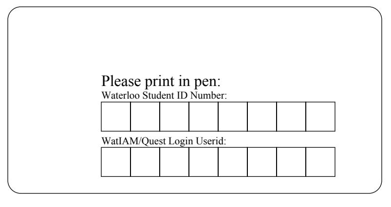
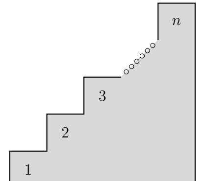

Times: Friday 2024-08-16 at 09:00 to 11:30 Duration: 2 hours 30 minutes (150 minutes)

Exam ID: 5734015

Sections: ECE 108 LEC 001,002

Instructors: Matthew Harris

Examination Final Spring 2024 ECE 108

#### Instructions

- 1. Make sure that your student ID number and UW userid are correctly displayed at the top of this page!
- 2. This exam is closed book and you are not allowed any notes, calculators or aids of any kind.
- 3. Answer the questions in the spaces provided and where applicable put your final answer in the box provided. There is blank page at the end of the exam for extra space.
- 4. If you use this space, clearly indicate so in the problem(s) where you utilize the extra space. Failure to do so will result in the extra work not being marked!
- 5. For full credit for questions without a "final answer" box, you must show all work required to obtain your answers.
- 6. This exam is 12 pages long (counting each side of paper as one page), including this cover page, and the extra space page. You have 150 minutes (2 hours and 30 minutes) to complete this exam. Good luck, not that you need it! Spoingus says that you got this!!!

| Question | Value |
|----------|-------|
| 1        | 11    |
| 2        | 10    |
| 3        | 4     |
| 4        | 4     |
| 5        | 6     |
| 6        | 4     |
| 7        | 6     |
| 8        | 4     |
| 9        | 1     |
| Total    | 50    |

|     | 1) |     | e formal definitions for the following: n-formal descriptions are not sufficient.                                                                                                                                                                                                                                                                                                                                                      |
|-----|----|-----|----------------------------------------------------------------------------------------------------------------------------------------------------------------------------------------------------------------------------------------------------------------------------------------------------------------------------------------------------------------------------------------------------------------------------------------|
| [5] |    | (a) | State the form of Bayes' Theorem that is used for medical testing applications in the event of a positive test. You must define any needed events (i.e. explain what your events represent).                                                                                                                                                                                                                                           |
| [3] |    | (b) | Give a formal definition of an antisymmetric relation $R$ on a set $S$ .                                                                                                                                                                                                                                                                                                                                                               |
| [2] |    | (c) | Give a definition of an uncountable set $S$ . For full credit, your answer must define uncountable sets by using properties of functions.                                                                                                                                                                                                                                                                                           |
| [1] |    | (d) | Free mark! Ramsus, Wedge, Marmie, Kimchi, Magic, Spoingus, Tedward, Stein-Aragon, Ollie, $\mu$ , Wassabi, Boba, Temmie, Athena, Spot, Sheru, Draźse, Matcha, Mochi, Tiny, Yook, Rosy, Athena, Max, Makrel, Beanie, Shoe-g, Marsha and Cookie (illustrated below) all want to express their gratitude to you for all the help throughout the term. To show their love, they are offering you a free mark on the exam. Do you accept it? |
|     |    |     | □ Yes □ No                                                                                                                                                                                                                                                                                                                                                                                                                             |

- 2) Multi-select: In this section, circle the correct answer(s). No justification is required.
- [2] (a) Which of following relations are symmetric:
  - i. ≡ on the set of all propositions.
  - ii. > on Z
  - iii. ≤ on Q
  - iv. ∅ on N
  - v. None of the above.
- [2] (b) Which of the following sets are countably infinite
  - i. [0, 1]
  - ii. Z
  - iii. Q
  - iv. {0, 1}
  - v. None of the above.
- [1] (c) A group of 100 ECE 108 students took a survey and the results are in:
  - 60 students like playing video games.
  - 40 students like reading books.
  - 25 students like both playing video games and reading books.

True or False: The events of an ECE 108 student liking video games and liking reading books are independent.

- i. True
- ii. False
- [1] (d) A horse owns n types of toys. How many ways can the horse pick k toys to share with their barnyard friends assuming that they have at least k 2 toys of each type.
  - i. n k
  - ii. P(n, k)
  - iii. n k
  - iv. n k
  - v. k n
  - vi. None of the above.

- [1] (e) How many ways can you pick k frogs out of a collection of n distinct frogs where  $k \leq n$ .
  - i.  $\binom{n}{k}$
  - ii. P(n,k)
  - iii.  $n^k$
  - iv.  $\binom{n}{k}$
  - v.  $\binom{k}{n}$
  - vi. None of the above.
- [1] (f)  $\binom{9001}{2}$  simplifies to
  - i. 9001 · 8999
  - ii.  $\frac{9000 \cdot 8999}{2}$
  - iii.  $\frac{9001 \cdot 9000}{2}$
  - iv. 9001 · 9000
  - v. None of the above.
- [1] (g) How many ways can you select and order k objects out of n distinct object types if there is no limit on the number of times you can pick one particular type of object?
  - i.  $\binom{n}{k}$
  - ii. P(n,k)
  - iii.  $n^k$
  - iv.  $\binom{n}{k}$
  - v.  $\binom{k}{n}$
  - vi. None of the above.
- [1] (h) How many injective functions are there from A to B if |A| = k, |B| = n and  $n \ge k$ ?
  - i.  $\binom{n}{k}$
  - ii. P(n,k)
  - iii.  $n^k$
  - iv.  $\binom{n}{k}$
  - v.  $\binom{k}{n}$
  - vi. None of the above.

| [4] |  |  | 3) Let Pr be a PMF on a finite sample space S. Give a formal proof that for all events A, B ⊆ S, |  |  |  |
|-----|--|--|--------------------------------------------------------------------------------------------------|--|--|--|
|     |  |  |                                                                                                  |  |  |  |

$$Pr\{A \cup B\} \ge Pr\{A - B\} + Pr\{B - A\}.$$

You do not need to prove any set theory results that you use.

Reminder: In a formal proof you must explicitly define all needed objects and need to justify every step in your work (other than set theory results for this question).

[4] 4) Give a formal proof that for all sets A and B, the sets A ∩ B and A ∩ B partition A. Reminder: Venn diagrams cannot be used in a formal proof and you must justify every step in your work.

| [6] |                        | 5) For a fixed n ≥ 4 use the inclusion-exclusion principle to find a non-recursive expression for the |  |  |
|-----|------------------------|-------------------------------------------------------------------------------------------------------|--|--|
|     | number of solutions to |                                                                                                       |  |  |

$$x_1 + x_2 + \ldots + x_n \le 2n$$
 where  $x_i \in \{-1, 0, 1, \ldots, n\}.$ 

Hint: If you get stuck, try first solving the case where n = 4. Your final solution will be a function of n.

| Final answer box: |
|-------------------|
|                   |
|                   |
|                   |
|                   |
|                   |
|                   |
|                   |

[4] 6) Consider an n step staircase for some n ∈ N that you wish to ascend. Suppose that you can ether take 1, 2 or 3 steps at a time. Find a recursive function f : N → N that computes the number of ways that you can choose to ascend the staircase under these rules.

Here is a diagram for such a staircase. Here for your first step you can choose to move to step 1, 2 or 3.

Final answer box:

|  Final answer box: |  |
|-----------------------|--|
|                       |  |
|                       |  |
|                       |  |
|                       |  |
|                       |  |
|                       |  |

(Q7 continued.)

[3] (b) Suppose that you learn that the firstborn kitten is a male. Find an expression for the probability that at least one of the kittens is female given this new information.

Your final solution will be a function of n.

| Final answer box: |  |
|-------------------|--|
|                   |  |
|                   |  |
|                   |  |
|                   |  |
|                   |  |
|                   |  |

You may use this page for rough work or to continue any other question that you have run out of space answering.

If you use this page to continue a question, you must indicate clearly, in the original location, that the work continues here, and indicate on this page which question you are continuing. If you fail to do so, the work will not be graded. You may tear off this page but you must include this page when you submit your exam.

You may use this page for rough work or to continue any other question that you have run out of space answering.

If you use this page to continue a question, you must indicate clearly, in the original location, that the work continues here, and indicate on this page which question you are continuing. If you fail to do so, the work will not be graded. You may tear off this page but you must include this page when you submit your exam.