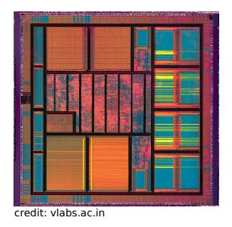
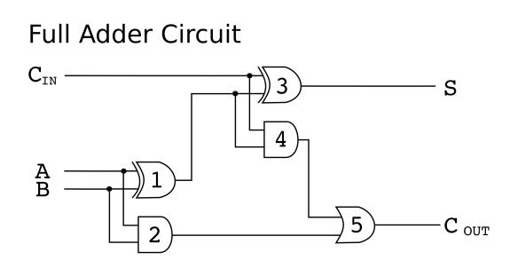

## Chapter 1

## Introduction

What is "discrete math?"

Discrete math is a collection of branches of mathematics that deals with discrete, as opposed to continuous, structures. An example of a discrete structure is the set of integers, {. . . , −2, −1, 0, 1, . . .}. We call those "discrete" because they are a collection of "distinct and unconnected elements," as defined in the Merriam-Webster's dictionary. The real numbers, on the other hand, are not discrete: between any two real numbers, we can find another real number.

Discrete math and logic is at the very foundations of several aspects of Electrical and Computer Engineering (ECE).

For example, consider a fundamental problem in communications, which itself is an important topic in ECE. The problem is that of efficiently encoding a message so it can then be transmitted. Suppose the message we want to send is:

this is a test this is only a test

One way of encoding the above message is to allocate a fixed number of bits per character, e.g., 8-bits, as done by the American Standard Code for Information Interchange, ASCII. This results in an encoding of 272 bits for the above message, including the spaces.

What if we, instead, assign a sequence of bits to a character based on its frequency of occurrence in the message? Such an approach is called a Huffman code. The more frequently a character occurs, the fewer number of bits we associate with it. Under such an encoding, for the above message, we may associate, for example, 01 with a space, 100 with each "i," 1110 with each "h," 111101 with each "n," and so on. This results in only 106 bits to encode the above message; a significant savings.

See https://cmps-people.ok.ubc.ca/ylucet/DS/Huffman.html for a cool applet that constructs such an encoding by building a particular kind of tree data structure. The ideas behind the construction of such a code, and an analysis of why it works, are all based in discrete math.

Another example of where discrete math and logic shows up in ECE is in the context of Digital Integrated Circuits (ICs). ICs are fundamental to modern computers. An IC can be seen a kind of directed graph of logic gates. (We discuss graphs briefly in this course in the context of relations in Chapter 3.) The following picture shows a modern IC to the left with a detailed view of a full adder circuit to the right. The full adder circuit adds the bits A and B, with a carry-in bit, CIN , and outputs two bits: the sum, S, and a carry-out bit, COUT . In the picture, the gates labelled 1 and 3 are XOR gates, the gates labelled 2 and 4 are AND gates, and the gate labelled 5 is an OR gate. For example, the result of A = 0, B = 1, CIN = 1 is S = 0, COUT = 1.

As a final example of where discrete math and logic shows up in ECE, we point to algorithms. An algorithm can be thought of as a procedure to compute a function. (We discuss what a function is in Chapter 3.) Algorithms underlie computer programs, e.g., those written in C++, and show up in various aspects of our lives, e.g., in the computer equipment and cellphones we use. The design and analysis of algorithms is rooted deeply in discrete math and logic. It is typical, for example, to adopt a data structure to represent and store data on which an algorithm operates. A data structure is often a discrete structure, e.g., an array, or a graph. To analyze the correctness and efficiency of an algorithm, we often use concepts we introduce in this course, such as proof by induction and contradiction.

Layout The remainder of this book, and the course, are structured roughly as follows: (i) Chapter 2, propositional logic and proof techniques, 3 weeks, (ii) Chapter 3, sets, functions and cardinality, 4 weeks, and, (iii) Chapter 4, combinatorics, 5 weeks.