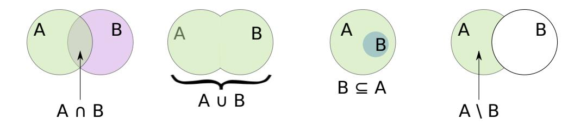
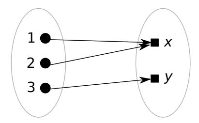
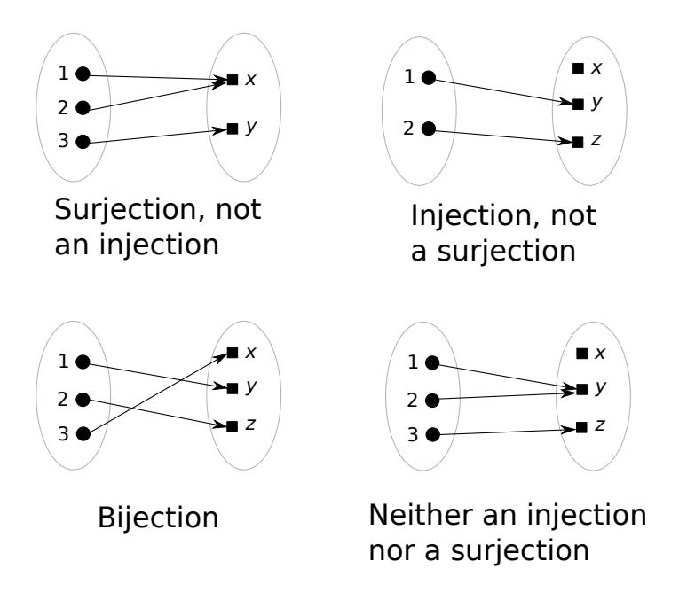
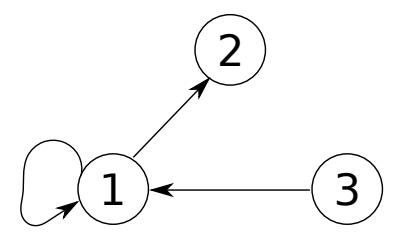
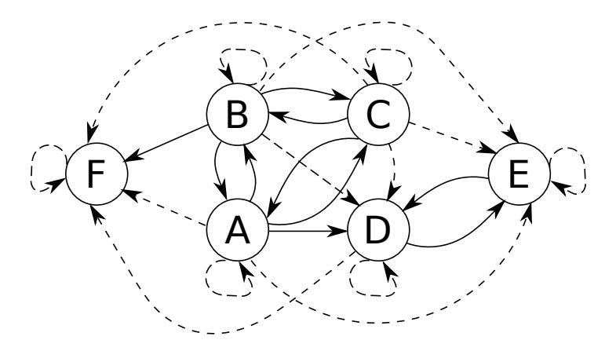
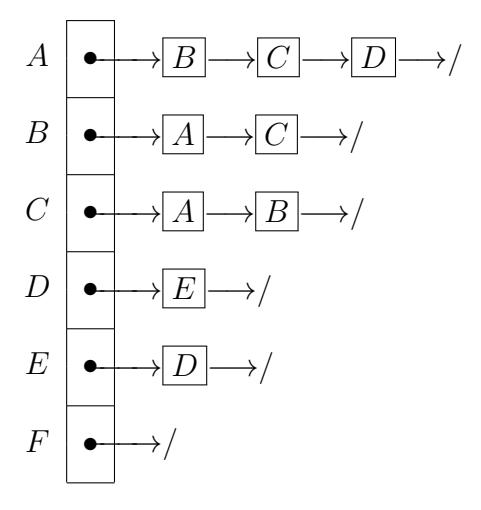

# Chapter 3

# Sets, Functions and Cardinality

A set is a collection of distinct item or elements. For example, {apple, orange, pear} is a set, as is {1, 2, aardvark, x}.

The above definition is somewhat vague and incomplete, and as will be seen shortly, it can lead to paradoxes. A thorough treatment of the way it needs to be qualified is beyond the scope of this course. Suffice it to say that it is safe to consider the standard collections normally encountered in engineering – such as those of the integers, rationals and real numbers – to be sets; and we will introduce some restrictions on the manner in which new sets can be defined – these will be sufficient to keep us out of trouble.

A set is completely determined by its elements: two sets A and B are identical, or equal, written A = B, if they have exactly the same elements. Otherwise, they are distinct, different or unequal: A ̸= B.

We emphasize two important properties of a set:

- a set imposes no ordering on the items it contains. A set is an unordered collection. For example, {1, 2, 3} = {2, 1, 3}.
- each element of a set is distinct. No two elements can be identical. As an example, this precludes {1, 1, 2, 3} from being deemed a set. (It is, rather, a multiset.)

An element of a set can also be called a member, and we say that the set contains that member. We use " ∈ " to denote set membership. E.g., 1 ∈  $\{1,2,3\}$ , and,  $x \in \{a,x,y,z\}$ . The complement of  $\in$  is  $\notin$ , e.g.,  $b \notin \{a,x,y,z\}$ . We can define  $\notin$  terms of  $\in$  as follows, using logic:  $x \notin S \iff \neg(x \in S)$ .

The *empty set* is a set which has no members. By definition, any two such sets are in fact one and the same: they have exactly the same members. There is therefore a unique empty set. It is denoted  $\emptyset$ , or  $\{\}$ .

An alternative to denoting a set by enumerating elements is *set-builder notation*. An example of the specification of a set using set-builder notation is as follows:  $\{x \mid x \text{ is an integer} > 0 \text{ and } \leq 5\}$ . Of course, that specifies the set  $\{1, 2, 3, 4, 5\}$ . As the example suggests, in set-builder notation, we use the vertical bar, "|" to specify conditions on the members of the set.

The complement of the empty set,  $\emptyset$ , is the set of everything, which is called the universal set, or simply, the universe and is denoted  $\mathcal{U}$ . We need to be careful with what we include in  $\mathcal{U}$ , i.e., what "everything" means in this context, as our discussions on Russell's paradox below indicate. Typically, we associate our discussions with a domain of discourse, and the domain of discourse specifies what  $\mathcal{U}$  is. For example, our domain of discourse may be all natural numbers, in which case  $\mathcal{U}$  would be the set of all natural numbers. As another example, our domain of discourse may be all people, in which case  $\mathcal{U}$  would be the set of all people. The domain of discourse, and therefore what  $\mathcal{U}$  is, is typically clear from context.

**Special sets** We now identify sets that we and others refer to frequently. The set of natural numbers, denoted  $\mathbb{N}$  is  $\{1,2,\ldots\}$ . The set of whole numbers,  $\mathbb{W} = \{0,1,2,3,\ldots\}$ . The set of integers,  $\mathbb{Z} = \{\ldots,-2,-1,0,1,2,\ldots\}$ . The set of positive integers,  $\mathbb{Z}^+ = \{1,2,3\ldots\} = \mathbb{N}$ . The set of non-negative integers,  $\mathbb{Z}_0^+ = \{0,1,2,\ldots\} = \mathbb{W}$ . The set of negative, and non-positive integers are similarly specified, and denoted  $\mathbb{Z}^-$  and  $\mathbb{Z}_0^-$ , respectively. The set of real numbers is denoted  $\mathbb{R}$ , and correspondingly, we have the of positive real numbers,  $\mathbb{R}^+$ , the set of non-negative reals  $\mathbb{R}_0^+$ , the set of negative reals,  $\mathbb{R}_0^-$ , and the set of non-positive reals,  $\mathbb{R}_0^-$ .

The set of rational numbers, denoted  $\mathbb{Q}$ , can be defined using the set-builder notation as follows:  $\mathbb{Q} = \{p/q \mid p \in \mathbb{Z}, q \in \mathbb{Z}^+, p \text{ and } q \text{ have no factor, or divisor, in common other than 1. Such a specification using the set-builder notation brings us to the issue of care we need to take when using the set-builder notation.$ 

Russell's paradox A set is a collection of items. A set itself can be perceived as an item. Therefore, it is possible to specify a set of sets. For example, {{1}, ∅, {1, 2, 3, 4, 5}} is a set of sets of integers, which has three members. An immediate question that then arises is: can a set be a member of itself? It does not seem meaningful to allow this, and therefore we may mandate that no set is allowed to be a member of itself.

However, it turns out that this by itself does not preclude contradictions that can occur in the specification of a set. A particular contradiction is Russell's paradox, which is demonstrated by the following specification of a set using set-builder notation.

Let 
$$S = \{x \mid x \text{ is a set such that } x \notin x\}$$

That is, S is the set of all sets that do not contain themselves. Now, we ask: does S contain itself?

• If the answer is 'yes,' then:

$$S \in S \implies S$$
 is a set that does not contain itself  $\implies S \notin S$ 

Thus, we have a contradiction.

• If the answer is 'no,' then:

$$S \notin S \implies S$$
 is a set that does not contain itself  $\implies S \in S$ 

Thus, we again have a contradiction.

A thorough discussion on "clean" specifications of sets and other constructs is beyond the scope of this course. The above discussion on Russell's paradox reveals, however, that care must be taken. In our case, a quick "hack" is to restrict the manner in which the set-builder notation is used. We require that when specifying a set using the set-builder notation, it must look like the following:

$$\{x \in A \mid \text{conditions on } x\}$$

That is, we must specify of what superset A this set being specified is a subset. (See below for definitions of super- and subsets.) And the conditions that appear after " | " are then used to specify which members of A are members of this set. Under these requirements, the earlier specification, S = {x | x ̸∈ x} is no longer allowed.

And if we specify, for example, S = {x ∈ A | x ̸∈ x}, we no longer have a paradox. Because suppose S = {x ∈ A | x ̸∈ x} is our specification of S, and we again ask: is S ∈ S?

• If the answer is 'yes,' then:

$$S \in S \implies S \in A \land S \notin S \implies S \notin S$$

Thus, we have a contradiction.

• If the answer is 'no,' then:

$$S \not\in S \implies S \not\in A \lor (S \in A \land S \not\in S)$$

Now, if S ∈ A, then S ∈ A ∧ S ̸∈ S =⇒ S ∈ S, a contradiction.

Thus, we have a possibility without a contradiction, and that is that S ̸∈ A. Which implies S ̸∈ S, and the answer to the question "is S ∈ S?" is "no."

Set relationships and operations We now continue with our discussions on basic notions regarding sets.

A is a subset of B, denoted A ⊆ B, if every member of A is a member of B. That is, A ⊆ B ⇐⇒ (x ∈ A =⇒ x ∈ B). We say that A is a strict subset of B, denoted A ⊂ B, if A is a subset of B, but is not equal to B. That is, A ⊂ B ⇐⇒ (A ⊆ B ∧ A ̸= B).

We say that A is a superset of B, denoted A ⊇ B if and only if B ⊆ A. We say that A is a strict superset of B, denoted A ⊃ B if and only if A ⊇ B∧A ̸= B.

Claim 18. For any two sets A, B, (A = B) ⇐⇒ (A ⊆ B ∧ A ⊇ B).

Proof. By deduction.

$$A = B \iff (x \in A \iff x \in B)$$
  
$$\iff ((x \in A \implies x \in B) \land (x \in A \iff x \in B))$$
  
$$\iff (A \subseteq B \land A \supseteq B)$$

For two sets A, B, their union, denoted A ∪ B is the set with the property: x ∈ A ∪ B ⇐⇒ (x ∈ A ∨ x ∈ B).

Their intersection, denoted A∩B is the set with the property: x ∈ A∩B ⇐⇒ (x ∈ A ∧ x ∈ B).

Their difference, denoted A \ B or A − B, is the set {x ∈ A | x ̸∈ B}.

Venn diagrams and their limitations We can visualize some set relationships and operations using Venn diagrams. Examples of Venn diagrams for intersection, union, subset and difference between two sets are shown below.

Venn diagrams are certainly useful to gain an understanding of what's going on in some limited situations with sets. However, they are not a proof strategy for several reasons. One is that they do not deal well with special cases, e.g., if one of the sets is empty, or the universe. They also do not scale to assertions, for example, that involve n sets, where n is some natural number. And they are not necessarily useful to intuit somewhat complex assertions, for example, the following from the final exam in Spring '18: "prove that for sets A, B, (A \ B = B) =⇒ (A = ∅)." Therefore, while Venn diagrams are useful to get an idea of what's going on, it is important to be able to work more abstractly, and be able to work with the proof strategies we discuss in this course.

We now present some properties of set operations.

Claim 19. For any two sets A, B, A \ B = A \ (A ∩ B).

Proof.

$$y \in A \setminus (A \cap B) \iff y \in A \land (y \notin A \cap B) \tag{3.1}$$

$$\iff y \in A \land (y \notin A \lor y \notin B) \tag{3.2}$$

$$\iff (y \in A \land y \notin A) \lor (y \in A \land y \notin B) \tag{3.3}$$

$$\iff \mathsf{false} \lor (y \in A \land y \not\in B) \tag{3.4}$$

$$\iff y \in A \land y \notin B \tag{3.5}$$

$$\iff y \in A \setminus B$$
 (3.6)

Rationale for each line in the above proof:

- (3.1) definition of set difference.
- (3.2) y ∈ A ∩ B ⇐⇒ (y ∈ A ∧ y ∈ B). Now, we negate each side, and we have: ¬(y ∈ A ∩ B) ⇐⇒ ¬(y ∈ A ∧ y ∈ B). Which is the same as: y ̸∈ A ∩ B ⇐⇒ (y ̸∈ A ∨ y ̸∈ B).
- (3.3) ∧ distributes over ∨.
- (3.4) ϕ ∧ ¬ϕ ⇐⇒ false.
- (3.5) (false ∨ ϕ) ⇐⇒ ϕ.
- (3.6) definition of set difference.

We can establish several properties of ∪ and ∩, for example, that they are commutative and associative, and how they work for the special sets, ∅ and U. An interesting property is the manner in which ∪ and ∩ distribute over one another.

**Claim 20.** 
$$A \cup (B \cap C) = (A \cup B) \cap (A \cup C)$$
.

Proof. The proof is pretty much directly from the distributivity of ∨ over ∧. This is not a coincidence — ∪ between sets has a very similar semantics to ∨ between propositions, and ∩ between sets is similar to ∧ between

propositions. The proof is as follows:

$$x \in A \cup (B \cap C) \iff (x \in A) \lor (x \in B \cap C)$$

$$\iff (x \in A) \lor (x \in B \land x \in C)$$

$$\iff (x \in A \lor x \in B) \land (x \in A \lor x \in C)$$

$$\iff (x \in A \cup B) \land (x \in A \cup C)$$

$$\iff x \in (A \cup B) \cap (A \cup C)$$

Similarly, we can show that  $\cap$  distributes over  $\cup$ , i.e.,  $A \cap (B \cup C) = (A \cap B) \cup (A \cap C)$ .

We can generalize the notion of union and intersection to more than just between two sets. Given a set  $\mathcal{X}$ , we define

$$\bigcup \mathcal{X} = \{ y \in X \mid X \in \mathcal{X} \} .$$

For  $\mathcal{X} \neq \emptyset$ , let  $X \in \mathcal{X}$ . Then, we define:

$$\bigcap \mathcal{X} = \{ x \in X \mid \forall X' \in \mathcal{X}, x \in X' \} \ .$$

For example,  $\bigcup \{\{1,2\},\{2,3\},\{3,4\}\} = \{1,2,3,4\}$ , and  $\bigcap \{\{1,2,3\},\{2,3,4\},\{3,4,5\}\} = \{3\}$ .

Claim 21. Suppose  $\mathcal{X} = \{X_1, \dots, X_n\}$  for some  $n \in \mathbb{N}, n > 0$ . Then,  $\bigcup \mathcal{X} = X_1 \cup X_2 \cup \dots \cup X_n$ , and  $\bigcap \mathcal{X} = X_1 \cap X_2 \cap \dots \cap X_n$ .

The claim can be proved by induction on n.

The *complement* of a set A, denoted  $\overline{A}$  is  $\overline{A} = \mathcal{U} \setminus A$ , where  $\mathcal{U}$  is the universal set. Thus, as special cases, we have:  $\overline{\emptyset} = \mathcal{U}$ , and  $\overline{\mathcal{U}} = \emptyset$ . As an example of the complement of a set, suppose  $\mathcal{U} = \mathbb{Z}$ , the set of integers. Then,  $\overline{\mathbb{Z}^+} = \mathbb{Z} \setminus \mathbb{Z}^+ = \mathbb{Z}_0^-$ , i.e., the set of all negative integers and zero.

Complement for sets is akin to negation in propositional logic.

Claim 22. 
$$\overline{(\overline{A})} = A$$
.

Proof.

$$x \in \overline{(A)} \iff x \in \mathcal{U} \setminus \overline{A}$$

$$\iff x \in \mathcal{U} \land x \notin \overline{A}$$

$$\iff x \in \mathcal{U} \land x \notin (\mathcal{U} \setminus A)$$

$$\iff x \in \mathcal{U} \land \neg (x \in \mathcal{U} \setminus A)$$

$$\iff x \in \mathcal{U} \land \neg (x \in \mathcal{U} \land \neg (x \in A))$$

$$\iff x \in \mathcal{U} \land (x \notin \mathcal{U} \lor x \in A)$$

$$\iff (x \in \mathcal{U} \land x \notin \mathcal{U}) \lor (x \in \mathcal{U} \land x \in A)$$

$$\iff \text{false} \lor (x \in \mathcal{U} \land x \in A)$$

$$\iff x \in \mathcal{U} \land x \in A$$

$$\iff x \in \mathcal{U} \land A \iff x \in A$$

Ordered pairs and Cartesian product An ordered pair of two items, x and y, denoted ⟨x, y⟩ is defined as:

$$\langle x, y \rangle = \begin{cases} \{\{x\}\} & \text{if } x = y \\ \{\{x\}, \{x, y\}\} & \text{otherwise} \end{cases}$$

The main point of an ordered pair is to impose an ordering between the two items x and y; that is, if x ̸= y, then ⟨x, y⟩ ̸= ⟨y, x⟩. This is captured by the following claim.

Claim 23. Given two ordered pairs, ⟨x1, y1⟩,⟨x2, y2⟩,

$$(\langle x_1, y_1 \rangle = \langle x_2, y_2 \rangle) \iff ((x_1 = x_2) \land (y_1 = y_2))$$

Proof. For the " =⇒ " direction: we assume ⟨x1, y1⟩ = ⟨x2, y2⟩ and consider two cases.

• x1 = y1 or x2 = y2. The two cases are the same, so we address the former only. x1 = y1 =⇒ ⟨x1, y1⟩ has one member only, which implies x2 = y2, as otherwise, ⟨x2, y2⟩ has two members. Furthermore, ⟨x1, y1⟩ = {{x1}} = {{x2}} = ⟨x2, y2⟩, and therefore, x1 = x2 = y1 = y2 =⇒ (x1 = x2) ∧ (y1 = y2).

•  $x_1 \neq y_1$  or  $x_2 \neq y_2$ . The two cases are the same, so we address the former only.  $\langle x_1, y_1 \rangle = \{\{x_1\}, \{x_1, y_1\}\} = \{\{x_2\}, \{x_2, y_2\}\} = \langle x_2, y_2 \rangle$ . Thus,  $\{x_1\} = \{x_2\} \implies x_1 = x_2$ . And  $\{x_1, y_1\} = \{x_2, y_2\} \implies y_1 = y_2$  as well.

The " $\Leftarrow$ " direction is proven similarly.

Ordered pairs are used when the ordering of two items is important, which means that making them members of a set does not suffice, as a set is unordered. For example, we may want ordered pairs of  $\langle \text{parent}, \text{child} \rangle$ , and then the ordered pair  $\langle \text{Alice}, \text{Bob} \rangle$  is different from  $\langle \text{Bob}, \text{Alice} \rangle$ , because the former says that Alice is a parent of Bob, while the latter says that Bob is a parent of Alice.

Now that we have a characterization of ordered pairs, we can define the *Cartesian product*. The Cartesian product of two sets, A, B, denoted  $A \times B$  is defined as:

$$A \times B = \{ \langle x, y \rangle \mid x \in A \text{ and } y \in B \}$$

For example, if  $A = \{1, 2, 3\}$ ,  $B = \{a, b\}$ , then  $A \times B = \{\langle 1, a \rangle, \langle 1, b \rangle, \langle 2, a \rangle, \langle 2, b \rangle, \langle 3, a \rangle, \langle 3, b \rangle\}.$ 

A special case of a Cartesian product is that of a set with itself. For example, if  $A = \{1, 2, 3\}$  as above, then  $A \times A = \{\langle 1, 1 \rangle, \langle 1, 2 \rangle, \langle 1, 3 \rangle, \langle 2, 1 \rangle, \langle 2, 2 \rangle, \langle 2, 3 \rangle, \langle 3, 1 \rangle, \langle 3, 2 \rangle, \langle 3, 3 \rangle\}$ . The Cartesian product provides us a nice way to define the set of rational numbers.  $\mathbb{Q} = \mathbb{Z} \times \mathbb{Z}^+$ ; that is,  $\mathbb{Q}$  is the set of all ordered pairs  $\langle \text{integer}, \text{positive integer} \rangle$ .

A particularly interesting and useful notion is that of a *relation* on the sets A, B. A relation, R, on A, B is:  $R \subseteq A \times B$ . The intent with a relation is to model a relationship between items in A and items in B. R is required to be a subset only of  $A \times B$ ; this allows for only some items in A to be related to items in B. For example, suppose  $A = \{-1, 0, 1\}, B = \langle 1, 2, 3 \rangle$ . Then  $R = \{\langle -1, 1 \rangle, \langle 1, 1 \rangle\}$  is a relation, which we may call the "is the square of" relation. That is,  $\langle x, y \rangle \in R$  only if  $y = x^2$ .

Relations play a particularly important role in modern computing. A relational database is an approach to storing information by perceiving the information as comprising relations on sets. Before we discuss relational databases, we first generalize the notions of ordered pairs and Cartesian products.

An n-tuple is an ordered sequence, ⟨x1, x2, . . . , xn⟩, of n items. When the number of items is inferred from context, or does not matter, we refer to such a structure as simply a tuple. Two tuples, ⟨x1, . . . , xn⟩ and ⟨y1, . . . , ym⟩ are said to be equal, or the same, denoted, ⟨x1, . . . , xn⟩ = ⟨y1, . . . , ym⟩ if two conditions are met: (i) n = m, and, (ii) x1 = y1, . . . , xn = yn. Note that (ii) is the length-n counterpart of Claim 23.

Now, we can define the Cartesian product of n sets, A1 × A2 × . . . × An = {⟨x1, . . . , xn⟩ | x1 ∈ A1, . . . , xn ∈ An}. And we can then define a relation on A1, . . . , An; R ⊆ A1 × . . . × An is such a relation. Rather than a relationship between items from only two sets, such a relation expresses a relationship between items from the n sets.

A relational database comprises tables. Each such relational table is a relation as we define above. For example, here at the University of Waterloo, the registrar likely maintains a relational database where the tables are a relation R ⊆ I ×N ×Y , where I is the set of IDs, N is the set of names, and Y is the set of years of entry. We can now query such tables; for example, we can ask what the ID of a particular student is, given her name, and how many students entered the university in the year 2018.

Another example of the use of relations is a social network, such as Facebook. The "is a Facebook friend of" may be seen as a relation that is a subset of U × U, where U is the set of all users in Facebook. Facebook may impose additional properties on such relations. For example, the "is a Facebook friend of" relation may be symmetric: Alice is a Facebook friend of Bob only if Bob is a Facebook friend of Alice. We discuss relations more at the end of this chapter.

Intervals Another notation that is associated with sets is that of intervals. For example, [−5.3, 4.82] represents the set of all real numbers between −5.3 and 4.82, inclusive. There are three kinds of intervals:

- [a, b] where a, b ∈ R is called a closed interval. It represents the set {r ∈ R | a ≤ r ≤ b}.
- (a, b] and [a, b), where a, b ∈ R are called a half-open intervals. The

former represents the set {r ∈ R | a < r ≤ b}, and the latter represents {r ∈ R | a ≤ r < b}.

• (a, b) where a, b ∈ R is called an open interval. It represents the set {r ∈ R | a < r < b}.

Sometimes, when we want the convenience of the above notation but want to restrict ourselves to subsets of reals, we intersect an interval with a set. For example, we could represent the set of all integers between −10 and 8, which excludes −10, but includes 8, as (−10, 8] ∩ Z. Of course, that set is {−9, −8, . . . , −1, 0, 1, . . . , 8}.

Powerset Given a set A, the powerset of A is the set of all subsets of A. We denote it as P(A). For example, if A = {1, 2, 3}, then P(A) = {∅, {1}, {2}, {3}, {1, 2}, {1, 3}, {2, 3}, {1, 2, 3}}. We can establish lots of properties of the powerset; following is an example.

Claim 24. A ∈ P(X) ∧ B ∈ P(X) =⇒ A ∪ B ∈ P(X). Proof.

$$A \in \mathscr{P}(X) \land B \in \mathscr{P}(X)$$

$$\iff (A \subseteq X) \land (B \subseteq X)$$

$$\iff (x \in A \implies x \in X) \land (x \in B \implies x \in X)$$

$$\iff (x \notin A \lor x \in X) \land (x \notin B \lor x \in X)$$

$$\iff (x \notin A \land x \notin B) \lor (x \in X)$$

$$\iff \neg (x \in A \lor x \in B) \lor (x \in X)$$

$$\iff (x \in A \lor x \in B) \implies x \in X$$

$$\iff (x \in A \cup B) \implies x \in X$$

$$\iff A \cup B \subseteq X \iff A \cup B \in \mathscr{P}(X)$$

Functions A function from a set A to a set B is a relation, F ⊆ A×B such that every a ∈ A appears as the first component in exactly one ordered pair in F. For example, given A = {1, 2, 3}, B = {x, y}, the relation F = {⟨1, x⟩, ⟨2, x⟩, ⟨3, y⟩}, is a function from A to B.

Apart from this perspective of a function as a particular kind of relation, there are other ways to perceive a function that are meaningful. One is the perspective that the function is a mapping of each item in A to exactly one item in B. This perspective can be visualized for the above example as follows.

The notion of a function is quite fundamental, and surprisingly powerful. It plays an important role in many aspects of electrical and computer engineering. Many algorithms, for example, compute functions. And algorithmic problems can be expressed as problems of computing functions. As an example, consider the problem of sorting, in non-decreasing order, an array of integers. This can be seen as the problem of mapping an array of integers to its sorted permutation (or rearrangement), and such a mapping is a function, because every such array is associated with a unique sorted permutation.

Functions are often represented using lower-case letters, e.g., f, and to emphasize that f is a function from A to B, we write f : A → B. The set A is called f's domain, and the set B is called its codomain. We write domain(f) and codomain(f) to refer to the domain and codomain, respectively, of a function f. We observe that the mindset behind such notation is to perceive the mnemonics domain and codomain as functions. Each maps a function to a set.

If f maps a ∈ A to b ∈ B, we write this as f(a) = b. To specify the manner in which f maps a particular a ∈ A to b ∈ B, we use "7→." For example, a function, f, whose domain and range are the set of integers, and which maps every integers to double that integer is written as:

$$f: \mathbb{Z} \to \mathbb{Z}, f: a \mapsto 2a$$

If f : A → B is a function under which f(a) = b for some a ∈ A, b ∈ B, we call b the image of a under f. We call a the preimage of b under f. The set of all images is called the range of the function; we denote it as range(f). That is, range(f) = {b ∈ codomain(f) | ∃a ∈ domain(f) such that f(a) = b}. As that specification for the range indicates, range(f) ⊆ codomain(f).

For example, suppose domain(f) = {1, 2, 3}, codomain(f) = {p, q, r, s}, and f(1) = f(3) = p, f(2) = q, then range(f) = {p, q}.

If range(f) = codomain(f), then we say that f is surjective, onto or a surjection. If f maps every a ∈ domain(f) to a unique b ∈ codomain(f), then we say that f is injective, into, an injection or one-to-one. That is, f is injective if, for every a1, a2 ∈ domain(f), it is the true that:

$$f(a_1) = f(a_2) \implies a_1 = a_2$$

If f is injective, then we can define another function, which we call the inverse of f, denoted f −1 , as follows:

$$f^{-1}$$
:  $range(f) \rightarrow domain(f), f^{-1}: f(x) \mapsto x$ 

An injective function is also called invertible for exactly the reason that its inverse exists and can be defined as above. A special case of an invertible function f is when f is both injective and surjective. In this case f is called a bijection. Figure 3.1 shows, pictorially, examples of these kinds of functions.

Injections, surjections and bijections are related to one another, for example, as expressed by the following claims.

Claim 25. If f : A → B is a bijection, then so is f −1 , and f −1−1 = f.

Proof. Because f is a surjection, range(f) = B. Thus, f −1 : B → A. From the definition of f −1 , f −1 is a surjection. To show that f −1 is an injection as well, assume otherwise, for the purpose of contradiction. Then, there exist some b1, b2 ∈ B with b1 ̸= b2 such that f −1 (b1) = f −1 (b2). But as B = range(f), there exist a1, a2 ∈ A such that f(a1) = b1, f(a2) = b2. Also, as f is a function, b1 ̸= b2 =⇒ a1 ̸= a2.

But, from the definition of f −1 , a1 = f −1 (b1), a2 = f −1 (b2). Thus, we have a contradiction to the assumption that f −1 (b1) = f −1 (b2). Therefore, f −1 is an injection.

To prove that f −1−1 = f, we need to prove that for all a ∈ A, f −1−1 (a) = f(a). Let g = f −1 . Then, from the definition of f −1 :

$$g: B \to A, \quad g: f(a) \mapsto a$$

Figure 3.1: Injections, surjections and bijections

Then, f −1−1 = g −1 , where:

$$g^{-1}: A \to B, \ g^{-1}: g(b) \mapsto b$$

Now suppose f(a) = b for some a ∈ A, b ∈ B. Then, f −1 (b) = g(b) = a. And f −1−1 (a) = g −1 (a) = b = f(a), as desired.

Claim 26. Suppose f : A → B is an injection. Then f −1 : range(f) → A is a bijection.

Proof. From the definition of range(f), f −1 is a surjection. To show that f −1 is an injection, assume otherwise, for the purpose of contradiction. Then, there exist b1, b2 ∈ range(f) with b1 ̸= b2 such that f −1 (b1) = f −1 (b2). But, from the definition of f −1 , f −1 (b1) = a1 for some a1 ∈ A such that f(a1) = b1, and similarly for b2 and a2. Thus, a1 = a2, yet f(a1) = b1 ̸= b2 = f(a2), which contradicts the assumption that f is a function.

Claim 27. There exists an injection f : A → B if and only if there exists a surjection g : B → A.

Proof. "only if": suppose such an f exists. Then by Claim 26 above, there exists f −1 : range(f) → A which is a bijection. Now pick some a ∈ A and define g as follows.

$$g \colon B \to A, \quad g \colon b \mapsto \left\{ \begin{array}{ll} f^{-1}(b) & \text{if } b \in range(f) \\ a & \text{otherwise} \end{array} \right.$$

Then g is a surjection because range(f) ⊆ B.

"if": suppose such a g exists. Then, for every a ∈ A, there exists some b ∈ B such that g(b) = a. Let G: A → P(B), G: a 7→ {b ∈ B | g(b) = a}, where P(B) is the powerset of B. For every a ∈ A, pick some b ∈ G(a), and denote the choice as ba. Then, f : A → B, f : a 7→ ba is an injection.

### Cardinality of sets

The *cardinality* of a set intends to capture the notion of the number of members the set contains. We specify it based on the existence of particular kinds of functions from a set to a subset of the set of natural numbers,  $\mathbb{N} = \{1, 2, 3, \ldots\}$ .

Suppose, for some  $n \in \mathbb{N}$ , we refer to the subset  $\{1, 2, ..., n\}$  of  $\mathbb{N}$  as  $\mathbb{N}_n$ . We say that a set  $S \neq \emptyset$  is *finite* if there exists some  $n \in \mathbb{N}$  for which there exists a bijection  $f: S \to \mathbb{N}_n$ .

For example, the set  $S = \{-3, 0, 1, 3, 4\}$  is finite, because there is a bijection,  $f: S \to \mathbb{N}_5$ . Such an f may be: f(-3) = 5, f(0) = 1, f(1) = 3, f(3) = 2, f(4) = 3.

Claim 28. If there exists an injection  $f: S \to \mathbb{N}_n$  for some  $n \in \mathbb{N}, S \neq \emptyset$ , then S is finite.

*Proof.* We need to prove that there exists a bijection  $g: S \to \mathbb{N}_m$ , for some  $m \in \mathbb{N}$ . We do so by construction. Define g as follows.

$$g \colon s \mapsto \left\{ \begin{array}{ll} 1 & \text{if } f(s) = \min_{s' \in S} \{f(s')\} \\ \\ g(s') + 1 & \text{otherwise, for } s' \in S \text{ with} \\ \\ f(s') = \max_{s'' \in S} \{f(s'') \mid f(s'') \in \{1, 2, \dots, f(s) - 1\}\} \end{array} \right.$$

We claim that the above g is a bijection from S to  $N_m$ , where  $m = \max_{s \in S} \{g(s)\}$ . We can prove this by, for example, induction on n.

We say that a set  $S \neq \emptyset$  is *infinite* if it is not finite.

Claim 29.  $\mathbb{N}$  is infinite.

Proof. Assume otherwise, for the purpose of contradiction. Then, there exists some  $n \in \mathbb{N}$  such that there is a bijection  $f : \mathbb{N} \to \mathbb{N}_n$ . Now let  $m = \max_{1 \le i \le n} \{f^{-1}(i)\}$ . Now,  $m \in \mathbb{N} \Longrightarrow m+1 \in \mathbb{N}$ . Let  $f(m+1) = j \in \mathbb{N}_n$ . Then, as f is a bijection,  $f^{-1}(j) = m+1 > m$ , a contradiction to the assumption that m is the maximum across all  $f^{-1}(i)$ 's.

Thus, from the standpoint of the cardinality of a non-empty set, we have two classes: finite and infinite. And we have an example of the former and the latter. From the standpoint of the latter, the following claim should be easy to prove: if S is infinite and  $T \supseteq S$ , then T is infinite. We have a similar claim from the existence of functions as well: if S is infinite and there exists an injection from S to T, then T is infinite. Thus, starting from  $\mathbb{N}$ , we can infer that some of the sets we know are infinite, e.g.,  $\mathbb{Z}$ ,  $\mathbb{Q}$  and  $\mathbb{R}$ .

We now further classify within infinite sets. We say that a set  $S \neq \emptyset$  is countably infinite if there exists a bijection  $f: S \to \mathbb{N}$ . If  $S \neq \emptyset$  is either finite or countably infinite, we say that it is countable. If  $S \neq \emptyset$  is not countable, we say that it is uncountable or uncountably infinite.

Claim 30. For  $S \neq \emptyset$ , if there exists an injection  $f: S \to \mathbb{N}$ , then S is countable.

*Proof.* Let f be some injection from S to  $\mathbb{N}$ . Then, we have two cases:

- there exists some  $n \in \mathbb{N}$  such that f is an injection from S to  $\mathbb{N}_n$ . Then, by Claim 28, S is finite and therefore countable.
- no such n exists. Then, we construct a bijection g as in the proof for Claim 28 from S to  $\mathbb{N}$ . This establishes that S is countably infinite and therefore countable.

We now establish that there exist sets that are not countable. We show this by contradiction; the particular proof strategy is called "diagonalization," and is useful in other contexts as well, to show non-existence.

Claim 31. (0,1), i.e., the set of reals between 0 and 1, is uncountable.

*Proof.* We assume that every real  $r \in (0,1)$  can be represented in decimal as  $0.n_1 n_2 n_3 \ldots$ , where each  $n_i \in \{0,\ldots,9\}$ . That is, a non-terminating string of digits after the decimal point. Let f be any function  $f: \mathbb{N} \to (0,1)$ . Then,

we claim that f cannot be surjective. Thus, no bijection from (0, 1) to N can exist, and therefore (0, 1) is uncountable.

To show that f is not a surjection, consider how f maps each of 1, 2, . . . to some member of (0, 1).

$$f(1) = 0.n_{1,1} n_{1,2} n_{1,3} \dots$$

$$f(2) = 0.n_{2,1} n_{2,2} n_{2,3} \dots$$

$$\dots$$

$$f(i) = 0.n_{i,1} n_{i,2} \dots n_{i,i} \dots$$

Where each ni,j ∈ {0, . . . , 9}. Now, we specify a new r ∈ (0, 1) as follows. r = 0.n1 n2 . . . where:

$$n_i = \begin{cases} 1 & \text{if } n_{i,i} > 5 \\ 7 & \text{otherwise} \end{cases}$$

We claim there exists exists no j ∈ N such that f(j) = r. Specifically, for every j ∈ N, nj,j ̸= nj . Therefore, f(j) ̸= r.

As (0, 1) is uncountable, so are all of its supersets. Specifically, R is uncountable. Note that the proposition, "((S is uncountable ) ∧ (T ⊇ S)) =⇒ (T is uncountable)" is subject to proof, but the proof should be easy to carry out.

Some countably infinite sets We now establish that some sets with which we are familiar are indeed countable, perhaps counterintuitively.

Claim 32. Z + 0 = {0, 1, 2, . . .} is countable.

Proof. Let f be the following function.

$$f: \mathbb{Z}_0^+ \to \mathbb{N}, \quad f: z \mapsto z + 1$$

Then f is a bijection that establishes that Z + 0 is countable.

Claim 33. Z = {. . . , −2, −1, 0, 1, . . .} is countable.

*Proof.* Let  $f: \mathbb{Z} \to \mathbb{N}$  be as follows.

$$f(i) = \begin{cases} 2|i| + 1 & \text{if } i \leq 0, \text{where } |\cdot| \text{ is absolute value} \\ 2i & \text{otherwise} \end{cases}$$

We claim that f above is a bijection. Given any  $i, j \in \mathbb{Z}$ , with  $i \neq j$ , we have the following three cases. (i) Both  $i, j \leq 0$ . Then,  $f(i) = -2i + 1 \neq -2j + 1 = f(j)$ . (ii) Both i, j > 0. Then,  $f(i) = 2i \neq 2j = f(j)$ . (iii)  $i \leq 0, j > 0$ . Then, f(i) is odd and f(j) is even, and therefore  $f(i) \neq f(j)$ .

Thus, f is an injection. To show that f is a surjection, suppose  $i \in \mathbb{N}$ . Then, we have two cases. (i) i is even. Then i = f(i/2). (ii) i is odd. Then, i = f((1-i)/2). Thus, f is surjective.

#### Claim 34. $\mathbb{N} \times \mathbb{N}$ is countable.

*Proof.* A natural way to prove the claim is by construction; i.e., we devise a bijection from  $\mathbb{N} \times \mathbb{N}$  to  $\mathbb{N}$ . We can do this in many ways. Following is a strategy. We group pairs,  $\langle i,j \rangle \in \mathbb{N} \times \mathbb{N}$ , systematically, and then map each pair to a natural number. The following table suggests such a grouping and mapping to natural numbers.

| Group # | Pair(s)                                                                                                                                         | # pairs | Map to                 |
|---------|-------------------------------------------------------------------------------------------------------------------------------------------------|---------|------------------------|
| 1       | $ \langle 1, 1 \rangle $                                                                                                                        | 1       | 1                      |
| 2       | $\langle 1, 2 \rangle, \langle 2, 2 \rangle, \langle 2, 1 \rangle$                                                                              | 3       | 2, 3, 4                |
| 3       | $ \begin{array}{c} \langle 1, 3 \rangle, \langle 2, 3 \rangle, \langle 3, 3 \rangle \\ \langle 3, 1 \rangle, \langle 3, 2 \rangle \end{array} $ | 5       | $5,\ldots,9$           |
| 4       | $\langle 1, 4 \rangle, \dots, \langle 3, 4 \rangle, \langle 4, 4 \rangle$ $\langle 4, 1 \rangle, \dots, \langle 4, 3 \rangle$                | 7       | 10, , 16               |
|         |                                                                                                                                                 |         |                        |
| k       | $\langle 1, k \rangle, \dots, \langle k - 1, k \rangle, \langle k, k \rangle$ $\langle k, 1 \rangle, \dots, \langle k, k - 1 \rangle$        | 2k-1    | $(k-1)^2+1,\ldots,k^2$ |
|         |                                                                                                                                                 |         |                        |

Based on the above table, consider the following function  $f: \mathbb{N} \times \mathbb{N} \to \mathbb{N}$ :

$$f(i,j) = \begin{cases} (j-1)^2 + i & \text{if } i \le j \\ (i-1)^2 + i + j & \text{otherwise} \end{cases}$$

We now need to prove that f is indeed a bijection. We first observe that  $(\max\{a,b\}-1)^2+1 \leq f(a,b) \leq (\max\{a,b\})^2$ . We can prove this by a case

analysis.

Case 1: a ≤ b. In this case, max{a, b} = b, and f(a, b) = (b − 1)2 + a. And f(a, b) ≥ (b − 1)2 + 1 because a ≥ 1. And f(a, b) ≤ b 2 because f(a, b) = b 2 − 2b + 1 + a = b 2 − (b − 1) − (b − a) ≤ b 2 because b ≥ 1 and b ≥ a.

Case 2: a > b. In this case, max{a, b} = a, and f(a, b) = (a − 1)2 + a + b. And f(a, b) ≥ (a − 1)2 + 1 because a + b ≥ 1. And f(a, b) ≤ a 2 because f(a, b) = a 2 −2a+ 1 +a+b = a 2 −a+ 1 +b = a 2 −(a−(b+ 1)) ≤ a 2 because a > b =⇒ a ≥ b + 1.

Now, to prove that f is injective, assume ⟨a, b⟩ ̸= ⟨c, d⟩, for a, b, c, d ∈ N. We seek to prove that f(a, b) ̸= f(c, d). We consider two cases.

Case 1: max{a, b} ̸= max{c, d}. Let max{a, b} = p, max{c, d} = q. Then, f(a, b) ∈ {(p − 1)2 + 1, . . . , p2}, f(c, d) ∈ {(q − 1)2 + 1, . . . , q2}, in which case f(a, b) ̸= f(c, d), because

$$p \neq q \implies \{(p-1)^2 + 1, \dots, p^2\} \cap \{(q-1)^2 + 1, \dots, q^2\} = \emptyset$$

Case 2: max{a, b} = max{c, d}. We consider two subcases.

- Case (a): a ≤ b. Then, max{a, b} = b and f(a, b) = (b − 1)2 + a. We consider two subcases.
  - Case (i): c > d. Then, max{c, d} = c, c = b and f(c, d) = (b − 1)2 + b + d. And f(a, b) = f(c, d) =⇒ (b − 1)2 + a = (b − 1)2 + b + d =⇒ a = b + d. This is impossible because a ≤ b and d ≥ 1, and therefore, a < b + d.
  - Case (ii): c ≤ d. Then, max{c, d} = d, d = b and f(c, d) = (b−1)2+c. And f(a, b) = f(c, d) =⇒ (b−1)2+a = (b−1)2+c =⇒ a = c, which contradicts the assumption that ⟨a, b⟩ ̸= ⟨c, d⟩.
- Case (b): a > b. Then, max{a, b} = a and f(a, b) = (a − 1)2 + a + b. We consider two subcases.
  - Case (i): c > d. Then, max{c, d} = c, c = a and f(c, d) = (a − 1)2 + a + d. And f(a, b) = f(c, d) =⇒ b = d. This contradicts the assumption that ⟨a, b⟩ ̸= ⟨c, d⟩.

- Case (ii):  $c \le d$ . Then,  $\max\{c,d\} = d$ , d = a and  $f(c,d) = (a-1)^2 + c$ . And  $f(a,b) = f(c,d) \implies (a-1)^2 + a + b = (a-1)^2 + c \implies a+b=c$ , which is impossible because  $c \le a = d$  and  $b \ge 1$ .

Thus, f is injective. To prove that f is surjective, pick some  $n \in \mathbb{N}$ . We seek to show that there exists some  $\langle a, b \rangle \in \mathbb{N} \times \mathbb{N}$  such that f(a, b) = n.

For every  $n \in \mathbb{N}$ , there exists  $m \in \mathbb{N}$  such that  $n \in \{(m-1)^2 + 1, \dots, m^2\}$ . Thus,  $n = (m-1)^2 + p$ , for some  $p \in \{1, \dots, 2m-1\}$ . We observe that if  $p \leq m$ , then from the definition of f, n = f(p, m), and if m , then <math>n = f(m, p - m). Thus, f is surjective.  $\square$ 

#### Claim 35. $\mathbb{Q}$ is countable.

*Proof.* Recall that  $\mathbb{Q} = \{\langle n, m \rangle \in \mathbb{Z} \times \mathbb{Z}^+ \}$ . We can compose the bijection from  $\mathbb{Z}$  to  $\mathbb{N}$  that is used to establish that  $\mathbb{Z}$  is countable with the bijection from  $\mathbb{N} \times \mathbb{N}$  to  $\mathbb{N}$  to establish that  $\mathbb{N} \times \mathbb{N}$  is countable to establish that  $\mathbb{Z} \times \mathbb{Z}$  is countable. Now, as  $\mathbb{Q} \subseteq \mathbb{Z} \times \mathbb{Z}$ ,  $\mathbb{Q}$  is countable as well.

Returning to set-cardinality and associated notation, given a set S, its cardinality is denoted |S|. We have distinguished: the empty set, finite sets, countably infinite sets and uncountable sets.

- $|\emptyset| = 0$ , i.e., the cardinality of the empty set is 0.
- If S is not empty, and is countable, let  $n \in \mathbb{N}$  for which there exists a bijection  $f: S \to \mathbb{N}_n$ . Then, |S| = n.
- We denote  $|\mathbb{N}| = \aleph_0$ , which is read "aleph zero." That is, we introduce a special symbol to represent the cardinality of  $\mathbb{N}$ . Note that this implies, for example, that  $|\mathbb{Q}| = |\mathbb{Z}| = \aleph_0$ .

We can also compare cardinalities. Recall that the empty set is unique. That is, if sets A and B are both the empty set, then A = B. For non-empty sets A, B, we say that |A| = |B| if and only if there exists a bijection  $f: A \to B$ . If there exists an injection  $g: A \to B$  then, we say that  $|A| \leq |B|$ . And if there exists an injection  $h: A \to B$ , but no surjection, then |A| < |B|. So, for example, if A is finite, then  $|A| < \aleph_0 < |\mathbb{R}|$ . The symbols " $\geq$ " and ">" can be defined as analogues of " $\leq$ " and "<," respectively.

### Relations

We now revisit relations. Recall that a relation between sets A1, A2, . . . , An is a subset of A1 × A2 × . . . × An. A special case is n = 2, i.e., a relation between two sets. Another special case is when all the sets A1, . . . , An are the same. The notion of a relation naturally captures what we think of as relationships.

In our discussions in this portion of the book, we restrict ourselves to binary relations, i.e., subsets of A×B. So when we simply say "relation," we mean a binary relation. In particular, we focus on the case that A = B, i.e., relations of the form R ⊆ A × A for some set A. We often write A × A as A2 , and call a relation R ⊆ A2 a "relation on the set A."

For example, suppose we have a set of people, P = {Alice,Bob, Carol, Dave, Eve}. We may now specify a relation, ParentOf ⊆ P × P, where ParentOf = {⟨Alice,Bob⟩,⟨Alice, Carol⟩,⟨Bob, Dave⟩,⟨Eve, Carol⟩}. Presumably what we seek to express via the set of ordered pairs ParentOf is that Alice is a parent of both Bob and Carol, Bob is a parent of Dave and Eve is a parent of Carol.

We use the above example to make several observations about relations in general.

- A relation may or may not be a strict subset of the cartesian product of the underlying sets. In our example above, |P × P| = 25, and |ParentOf| = 4.
- A relation may or may not be a function. The relation ParentOf is not a function. We observe that Alice maps to both Bob and Carol.
- A relation may or may not be symmetric. A symmetric relation, R ⊆ A2 is one which satisfies the following property:

$$\forall \langle x, y \rangle \in A^2, \ \langle x, y \rangle \in R \iff \langle y, x \rangle \in R$$

We observe that ⟨Alice,Bob⟩ ∈ ParentOf, but ⟨Bob, Alice⟩ ̸∈ ParentOf. Indeed, ParentOf above is asymmetric. A relation R ⊆ A2 is said to be asymmetric if:

$$\forall \langle x, y \rangle \in A^2, \ \langle x, y \rangle \in R \implies \langle y, x \rangle \notin R$$

An immediate question that arises is whether R is symmetric if and only if R is not asymmetric, i.e., whether the notion of symmetric is the complement of the notion of asymmetric. We can deploy our understanding of logic to intuit this.

Based on the definition of symmetry above, R ⊆ A2 is not symmetric if:

$$\neg \left( \forall \langle x, y \rangle \in A^2, \ \langle x, y \rangle \in R \iff \langle y, x \rangle \in R \right)$$

$$\iff \exists \langle x, y \rangle \in A^2, \ \neg (\langle x, y \rangle \in R \iff \langle y, x \rangle \in R)$$

$$\iff \exists \langle x, y \rangle \in A^2, \ \neg ((\langle x, y \rangle \not\in R \lor \langle y, x \rangle \in R) \land (\langle y, x \rangle \not\in R \lor \langle x, y \rangle \in R))$$

$$\iff \exists \langle x, y \rangle \in A^2, \ ((\langle x, y \rangle \in R \land \langle y, x \rangle \not\in R) \lor (\langle y, x \rangle \in R \land \langle x, y \rangle \not\in R))$$

That is, for R to not be symmetric, all we need is a pair ⟨x, y⟩ ∈ R such that ⟨y, x⟩ ̸∈ R. Whereas asymmetric requires this for every pair ⟨x, y⟩ ∈ R. So, for example, consider R ⊆ {1, 2, 3} 2 where R = {⟨1, 2⟩,⟨2, 1⟩,⟨1, 3⟩}. Then R is not symmetric because ⟨1, 3⟩ ∈ R, yet ⟨3, 1⟩ ̸∈ R. R is also not asymmetric because both ⟨1, 2⟩,⟨2, 1⟩ ∈ R.

There is another notion that is in customary use in this context; the notion of antisymmetry. A relation R ⊆ A2 is said to be antisymmetric if:

$$\forall \langle x, y \rangle \in A^2, \ \langle x, y \rangle \in R \land \langle y, x \rangle \in R \implies x = y$$

Unlike a relation that is symmetric, an antisymmetric relation cannot contain both ⟨x, y⟩ and ⟨y, x⟩ when x ̸= y. Unlike a relation that is asymmetric, an antisymmetric relation does not preclude both ⟨x, y⟩ and ⟨y, x⟩ from being in the relation.

The ParentOf relation above is antisymmetric: for distinct ⟨x, y⟩, it is never the case that both ⟨x, y⟩ and ⟨y, x⟩ are in ParentOf. Thus, the premise in the implication in the definition of antisymmetry is always false for ParentOf, and therefore the implication holds true.

The relation R over {1, 2, 3} above, on the other hand, is not antisymmetric: both ⟨1, 2⟩ and ⟨2, 1⟩ are in R, yet 1 ̸= 2. Thus, this R is an example of a relation that is neither symmetric nor antisymmetric. There can also exist relations that are both symmetric and antisymmetric. Consider, for example, S ⊆ {1, 2, 3} 2 , where S = {⟨1, 1⟩,⟨3, 3⟩}. Then, S is both symmetric and antisymmetric.

What about asymmetry and antisymmetry? We observe that if a relation R over A is asymmetric, then R is antisymmetric, but the converse is not necessarily true. We state a claim for an "if and only if" relationship between asymmetry and antisymmetry once we discuss notions of reflexivity below.

• A relation, R ⊆ A2 , may be reflexive. We say that such an R is reflexive if:

$$\forall x \in A, \ \langle x, x \rangle \in R$$

We can also define irreflexivity; we say that R ⊆ A2 is irreflexive if:

$$\forall x \in A, \ \langle x, x \rangle \notin R$$

It should not be difficult to see that some relation R ⊆ A2 may be neither reflexive nor irreflexive. E.g., R ⊆ {1, 2} 2 where R = {⟨1, 1⟩} is neither reflexive nor irreflexive. This R is not reflexive because 2 ∈ A and yet ⟨2, 2⟩ ̸∈ R, and it is not irreflexive because ⟨1, 1⟩ ∈ R.

Is it possible that a relation R on a set A is both reflexive and irreflexive? This is not possible if A ̸= ∅. However, if A = ∅, R = ∅, then R is both reflexive and irreflexive.

The notion of reflexivity also helps us clarify the distinction between asymmetry and antisymmetry.

Claim 36. Suppose R ⊆ A2 . Then R is asymmetric if and only if R is antisymmetric and irreflexive.

Proof. " =⇒ ": we prove the contrapositive. We have two cases:

#### 1. R is not antisymmetric.

R is not antisymmetric

$$\iff \neg (\forall \langle x, y \rangle \in A^2, \ \langle x, y \rangle \in R \land \langle y, x \rangle \in R \implies x = y)$$

$$\iff \exists \langle x, y \rangle \in A^2, \ \neg (\langle x, y \rangle \in R \land \langle y, x \rangle \in R \implies x = y)$$

$$\iff \exists \langle x, y \rangle \in A^2, \ \neg (\langle x, y \rangle \notin R \lor \langle y, x \rangle \notin R \lor x = y)$$

$$\iff \exists \langle x, y \rangle \in A^2, \ \langle x, y \rangle \in R \land \langle y, x \rangle \in R \land x \neq y$$

$$\iff \exists \langle x, y \rangle \in A^2, \ \langle x, y \rangle \in R \land \langle y, x \rangle \in R$$

$$\iff \exists \langle x, y \rangle \in A^2, \ \neg (\langle x, y \rangle \notin R \lor \langle y, x \rangle \notin R)$$

$$\iff \exists \langle x, y \rangle \in A^2, \ \neg (\langle x, y \rangle \in R \implies \langle y, x \rangle \notin R)$$

$$\iff \neg (\forall \langle x, y \rangle \in A^2, \ \langle x, y \rangle \in R \implies \langle y, x \rangle \notin R)$$

$$\iff R \text{ is not asymmetric}$$

#### 2. R is not irreflexive.

R is not irreflexive

$$\iff \neg(\forall x \in A, \ \langle x, x \rangle \not\in R)$$

$$\iff \exists x \in A, \ \langle x, x \rangle \in R$$

$$\iff \exists \langle x, y \rangle \in A^2, \ x = y \land \langle x, y \rangle \in R \land \langle y, x \rangle \in R$$

$$\iff \exists \langle x, y \rangle \in A^2, \ \langle x, y \rangle \in R \land \langle y, x \rangle \in R$$

$$\iff \exists \langle x, y \rangle \in A^2, \ \neg(\langle x, y \rangle \not\in R \lor \langle y, x \rangle \not\in R)$$

$$\iff \exists \langle x, y \rangle \in A^2, \ \neg(\langle x, y \rangle \in R \implies \langle y, x \rangle \not\in R)$$

$$\iff \neg(\forall \langle x, y \rangle \in A^2, \ \langle x, y \rangle \in R \implies \langle y, x \rangle \not\in R)$$

$$\iff R \text{ is not asymmetric}$$

" ⇐= ": we assume that R is antisymmetric and irreflexive.

R antisymmetric ∧ R irreflexive

$$\iff \big(\forall \langle x,y\rangle \in A^2, \ \langle x,y\rangle \in R \land \langle y,x\rangle \in R \implies x = y\big) \land \\ \big(\forall \langle x,y\rangle \in A^2, \ x = y \implies \langle x,y\rangle \not\in R\big)$$

$$\implies \forall \langle x,y\rangle \in A^2, \ \langle x,y\rangle \in R \land \langle y,x\rangle \in R \implies \langle x,y\rangle \not\in R$$

$$\iff \forall \langle x,y\rangle \in A^2, \ \langle x,y\rangle \not\in R \lor \langle y,x\rangle \not\in R \lor \langle x,y\rangle \not\in R$$

$$\iff \forall \langle x,y\rangle \in A^2, \ \langle x,y\rangle \not\in R \lor \langle y,x\rangle \not\in R$$

$$\iff \forall \langle x,y\rangle \in A^2, \ \langle x,y\rangle \in R \implies \langle y,x\rangle \not\in R$$

$$\iff R \text{ is asymmetric}$$

• A relation R ⊆ A2 may be transitive. We say that R ⊆ A2 is transitive if:

$$\forall \langle x, y, z \rangle \in A^3, \langle x, y \rangle \in R \land \langle y, z \rangle \in R \implies \langle x, z \rangle \in R$$

For example, the ParentOf relation above is not transitive, because ⟨Alice,Bob⟩ ∈ ParentOf, and ⟨Bob, Dave⟩ ∈ ParentOf, but ⟨Alice, Dave⟩ ̸∈ ParentOf. Similarly, the R ⊆ {1, 2, 3} 2 we specified above, where R = {⟨1, 2⟩,⟨2, 1⟩,⟨1, 3⟩} is not transitive, because ⟨1, 2⟩,⟨2, 1⟩ ∈ R, but ⟨1, 1⟩ ̸∈ R. However, the following relation S ⊆ {1, 2, 3} 2 where S = {⟨1, 2⟩,⟨1, 3⟩}, is transitive.

Now that we have discussed types of relations, we discuss situations that they show up. Comparison operators between, for example, integers, are a good example of where such relations such up. The comparator, "≤," for example, can be seen as a relation between two integers, i.e., ⊆ Z 2 . Denote the relation induced by "≤" between integers as the relation RZ,≤. That is:

$$R_{\mathbb{Z},\leq} = \{\langle x, y \rangle \in \mathbb{Z}^2 \mid x \leq y\}$$

We observe that RZ,≤ is:

- Reflexive: because ∀x ∈ Z, x ≤ x and therefore ∀x ∈ Z,⟨x, x⟩ ∈ RZ,≤.
- Antisymmetric: because ∀⟨x, y⟩ ∈ Z 2 , x ≤ y ∧ y ≤ x =⇒ x = y.
- Transitive: because ∀⟨x, y, z⟩ ∈ Z 3 , x ≤ y ∧ y ≤ z =⇒ x ≤ z.

There is a special name for a set and an operator that induce a relation that is reflexive, antisymmetric and transitive, like Z and ≤ above. And that is a partial order, a partially ordered set or a poset. We usually denote a poset as a pair of the set and the operator, e.g., we would say, "⟨Z, ≤⟩ is a poset."

The reason we call out posets specially is that they show up in various contexts, and we are able to establish additional properties about them. Another example of a poset is ⟨S, ⊆⟩, where S is a set.

As a contrast, consider the relation that is induced on Z by "<." That is, consider the relation RZ,<:

$$R_{\mathbb{Z},<} = \{ \langle x, y \rangle \in \mathbb{Z}^2 \mid x < y \}$$

We observe that RZ,< is:

- Irreflexive: because ∀x ∈ Z, x ̸< x.
- Asymmetric: because ∀⟨x, y⟩ ∈ Z 2 , x < y =⇒ y ̸< x.
- Transitive: because ∀⟨x, y, z⟩ ∈ Z 3 , x ≤ y ∧ y ≤ z =⇒ x ≤ z.

A relation that is irreflexive, asymmetric and transitive is called a strict partial order. Another example of a strict partial order is the relation induced by "⊂" on a set S.

Also interesting is a relation that is reflexive, symmetric and transitive. Such a relation is called an equivalence, and as its name suggests such a relation induces a kind of equality that is less strict than actual equality, but is useful in many contexts.

As an example, consider the relation between integers that is induced by the modulo operator, "mod," which is defined as follows.

For 
$$x \in \mathbb{Z}, y \in \mathbb{Z}^+$$
,  $x \mod y = r$ , where  $r \in \{0, 1, \dots, y - 1\}$  such that  $\exists q \in \mathbb{Z}, x = q \cdot y + r$ 

For example, 29 mod 8 = 5 and −29 mod 8 = 4.

Consider the relation induced on Z by "mod 4." That is, let RZ, mod 4 be:

$$R_{\mathbb{Z}, \mod 4} = \{ \langle x, y \rangle \in \mathbb{Z}^2 \mid x \mod 4 = y \mod 4 \}$$

We observe that RZ, mod 4 is:

- Reflexive: ∀x ∈ Z, x mod 4 = x mod 4.
- Symmetric: ∀⟨x, y⟩ ∈ Z 2 , x mod 4 = y mod 4 =⇒ y mod 4 = x mod 4.
- Transitive: ∀⟨x, y, z⟩ ∈ Z 3 , x mod 4 = y mod 4 ∧ y mod 4 = z mod 4 =⇒ x mod 4 = z mod 4.

So  $R_{\mathbb{Z}, \mod 4}$  is an equivalence, and what that conveys is that under mod 4, all integers that have the same value modulo 4 are not necessarily the same, but "equivalent" in this specific context.

Such an equivalence relation induces so called *equivalence classes* on the underlying set. For example, under " mod 4," the integers in  $\{\ldots, -7, -3, 1, 5, 9, \ldots\}$  are equivalent to one another, in that they are all the same modulo 4. We use the following symbol to indicate equivalent: " $\equiv_{\text{mod }4}$ ," e.g. we would write " $-7 \equiv_{\text{mod }4} 5$  to indicate that -7 is equivalent to 5 under the "mod 4" relation. Such a set, i.e.,  $\{\ldots, -7, -3, 1, 5, 9, \ldots\}$  in this example, is called an equivalence class.

We observe that "mod 4" induces four equivalence classes on  $\mathbb{Z}$ :

$$\{\ldots, -8, -4, 0, 4, 8, \ldots\}$$

$$\{\ldots, -7, -3, 1, 5, 9, \ldots\}$$

$$\{\ldots, -6, -2, 2, 6, 10, \ldots\}$$

$$\{\ldots, -5, -1, 3, 7, 11, \ldots\}$$

As the members of each such class are equivalent to one another, we can simply pick a representative of each class to represent the entire class. From the standpoint of notation, we write this as  $[0]_{\text{mod }4}$ , to refer to the set that is the equivalence class to which 0 belongs under "mod 4." That is,  $[0]_{\text{mod }4} = \{\ldots, -4, 0, 4, 8, \ldots\}$ .

We observe that  $[0]_{\text{mod }4} = [116]_{\text{mod }4}$ , and  $[0]_{\text{mod }4} \neq [6]_{\text{mod }4}$ . In fact, given an equivalence  $R \subseteq A^2$ , suppose  $[x_0]_R, [x_1]_R, \ldots, [x_n]_R$  are the equivalence classes induced by R. Then:

- The equivalence classes are pairwise disjoint. That is, for every i, j with  $i \neq j$ ,  $[x_i]_R \cap [x_j]_R = \emptyset$ , and,
- The union of the equivalence classes is the set A, i.e.,  $\bigcup_{1 \le i \le n} [x_i]_R = A$ .

That is, the equivalence classes partition the underlying set A.

As another example, for the set of all students that are currently enrolled in Waterloo-ECE, the year + term + cohort can be seen as an equivalence

relation. That is, Alice and Bob are in the same equivalence class if and only if they are in the same year, term and cohort. The class reps are representatives of each such equivalence class, and there is nothing special about them in the sense that they are perceived as members of the equivalence class, and any member of an equivalence class is a valid representative. The union of all equivalence classes is the set of all students in Waterloo-ECE.

As another example, consider the following way of modeling trust and a group of acquaintances.

- Everyone trusts him/herself, i.e., we assume trust is reflexive, and,
- If a trust b and b trusts c, then a trusts c, i.e., we assume trust is transitive.
- We have a set of acquaintances: A(lice), B(ob), C(arol), D(ave), E(dith) and F(rank). And it turns out:
  - A trusts B, C, D.
  - B trusts A, C, F.
  - C trusts A, B.
  - D trusts E.
  - E trusts D.

Let T ⊆ {A, . . . , F} 2 be the above trust relation. Then, T is not an equivalence: for example, ⟨B, F⟩ ∈ T, but ⟨F, B⟩ ̸∈ T, that is, T is not symmetric. Also, ⟨A, T⟩ is not a poset: for example, ⟨A, B⟩ ∈ T,⟨B, A⟩ ∈ T, yet A ̸= B, that is, T is not antisymmetric.

However, consider the following subset of T, M ⊆ T, which we can think of as "mutually trusting." M = {⟨x, y⟩ ∈ T | ⟨y, x⟩ ∈ T}. Then, M is an equivalence, and it induces three equivalence classes: (i) A ≡M B ≡M C, i.e., [A]M = [B]M = [C]M = {A, B, C}, (ii) D ≡M E, i.e., [D]M = [E]M = {D, E}, and, (iii) F, i.e., [F]M = {F}.

Now suppose we define a relation between those equivalence classes, C = ⟨[x], [y]⟩ ∈ {[A]M, [D]M, [F]M} 2 | ⟨x, y⟩ ∈ T .

For example, ⟨[A]M, [A]M⟩ ∈ C because ⟨A, A⟩ ∈ T, because T is reflexive.

And ⟨[A]M, [D]M⟩ ∈ C, because ⟨A, D⟩ ∈ T. But, ⟨[D]M, [A]M⟩ ̸∈ C, because ⟨D, A⟩ ̸∈ T.

Now, ⟨{[A]M, [D]M, [F]M}, C⟩ is a poset. That is, C is reflexive, transitive and antisymmetric. And it is meaningful to visualize the poset as follows.

$$[D]_{M}$$
  $[F]_{M}$ 

In the picture above, an edge "—" indicates unidirectional trust from an entity that is on the lower side of the edge to the upper side. For example, the edge from [A]M to [D]M indicates that everyone in the equivalence class [A]M trusts someone in the equivalence class [D]M.

Thus the picture above indicates that the folks in the equivalence class [A]M are the most trusting from amongst {A, . . . , F}. The equivalence classes [D]M and [F]M are incomparable to one another; indeed, the lack of an edge between them expresses that they are "islands" of trust, isolated from one another.

Another good example of the use of relations is in the context of social networks. Facebook, for example, employs a relation, "FriendOf." A semantics of FriendOf is that if ⟨Alice,Bob⟩ ∈ FriendOf, then Alice can, for example, view photos that Bob posts. FriendOf is reflexive, in that Alice can view her own photos. It is also symmetric. However, it is not necessarily transitive. Facebook of course has other relations it employs as well. For example, it is possible for a user to "tag" another user in a photo. And "IsTagged" can be viewed as a relation between users that has particular semantics, e.g., with regards to whether a user can view particular photos.

Graphs Graphs provide a useful way to visualize and process (e.g., via algorithms) relations. A graph is an ordered pair, ⟨V, E⟩, where each of V, E is a set. The set V is called a set of vertices or nodes. The set E is called a set of edges. The set V is a set of identifiers, e.g., V = {1, 2, 3}. The set E is a relation on V , i.e., E ⊆ V 2 . E.g., E = {⟨1, 1⟩,⟨1, 2⟩,⟨3, 1⟩}. This example graph can be visualized as follows.

As the picture indicates, we typically draw a vertex as a labelled circle, and an edge as a line segment with an arrowhead that indicates the ordering within the ordered pair.

Depending on the semantics of the relation, E, we can now ask questions that may be meaningful in the particular context. For example, suppose in the above example, the vertices 1, 2, 3 represent cities, and an edge ⟨x, y⟩ represents the fact that a transportation company is willing to deliver goods from x to y. Then, we observe that the transitive closure of the above graph, i.e., the minimum set of edges we would add to the graph so the relation is then transitive, tells us between which cities we can employ the transportation company provided we have a way to cache the goods in an intermediate city. For example, the transitive closure would include the edge ⟨3, 2⟩, but not the edge ⟨2, 3⟩.

As another example, following is a graph, call it G = ⟨V, E⟩, that expresses the trust relationships between V = {A, . . . , F} that we discussed above. We distinguish two kinds of edges: the solid edges are the "explicit" trust relationships – those that we mention under the third bullet above, in our specification of the trust relationships. The dotted edges are from our assumption that the relation is also reflexive and transitive; that is, the dotted edges result from computing the reflexive closure and the transitive closure of the explicit trust relationships.

Now, we observe that sets of vertices that are strongly connected comprise an equivalence class in M, "mutually trust," that we discuss above. Two vertices, u, v are said to be strongly connected to one another if there is a path from u to v, and from v to u. We observe, for example, that this is indeed the case between the vertices in  $\{A, B, C\}$ . And if there is a dotted or solid edge  $\langle u, v \rangle$ , but no edge  $\langle v, u \rangle$ , then every vertex in  $[u]_M$  has an edge to at least one vertex in  $[v]_M$ , but not vice versa.

From the standpoint of implementation, there are two customary ways to implement a graph. One is as an *adjacency matrix*, and the other is as an *adjacency list*. An adjacency matrix, call it J, is  $|V| \times |V|$ , i.e., has |V| rows and |V| columns, with one row and one column for every  $u \in V$ . An entry J[u,v] = 1 if  $\langle u,v \rangle \in E$ , otherwise J[u,v] = 0. Thus, an adjacency matrix of the above graph of the solid edges only is the following.

$$\begin{array}{cccccccccccccccccccccccccccccccccccc$$

An adjacency list, call it L, is an array of size |V| for each  $u \in V$ , in which

the entry u is a linked list. An adjacency list for the above graph, for the solid edges only is the following.

