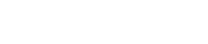
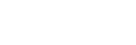

---

> [!abstract] Digital Circuits and Systems
> ## Digital Circuits and Systems

<u><strong style="color:#dab1da">Binary number system</strong></u> — with 2 values (True = 1, False = 0).

**Conversion formula:** $V = \displaystyle\sum_{i=0}^{n} b_i \cdot 2^i$ for an $n$-digit binary value.

For an $m$-bit number $b_{m-1}b_{m-2}\ldots b_0$ (where each $b_*$ is 0 or 1):

$$V = b_{m-1} \times 2^{m-1} + b_{m-2} \times 2^{m-2} + \cdots + b_0 \times 2^0$$

**Example:** $125 = 1\!\times\!2^6 + 1\!\times\!2^5 + 1\!\times\!2^4 + 1\!\times\!2^3 + 1\!\times\!2^2 + 0\!\times\!2^1 + 1\!\times\!2^0$

So $(125)_{10} = (1111101)_2$.

> [!hint] Decimal to Binary Conversion
> ## Decimal → Binary Conversion

Divide repeatedly by 2 and collect the **remainders bottom-up** (lsb first):

> [!success]- Solution: Convert 29 to binary (Click to expand)
>
> | Division | Quotient | Remainder |
> |----------|----------|-----------|
> | $29 \div 2$ | 14 | **1** ← lsb |
> | $14 \div 2$ | 7  | **0** |
> | $7 \div 2$  | 3  | **1** |
> | $3 \div 2$  | 1  | **1** |
> | $1 \div 2$  | 0  | **1** ← msb |
>
> Reading remainders bottom-up: $29 = (11101)_2$

---

> [!abstract] Binary Logic Functions
> ## Binary Logic Functions

Functions on **binary variables** that produce True/False output.

#### <u>Truth Table</u>

A <u><strong style="color:#dab1da">truth table</strong></u> defines the function by laying out **all** possible inputs.

Example with two inputs $A, B$:

| $A$ | $B$ | $f(A,B)$ |
|-----|-----|----------|
| T   | T   | True     |
| T   | F   | False    |
| F   | T   | False    |
| F   | F   | False    |

**Binary logic variables** take two discrete values 0 and 1 (where 0 = false/no/open, 1 = true/yes/closed).

---

> [!info] Logic Operators
> ## Logic Operators

Logic operators AND, OR, NOT are implemented via **logic gates** (which are implemented using transistors).

| Operator | Symbol(s) | Example |
|----------|-----------|---------|
| $x$ **AND** $y$ | $x \cdot y$ / $xy$ | $x \cdot y$ |
| $x$ **OR** $y$  | $x + y$           | $x + y$ |
| **NOT** $x$     | $x'$ / $\bar{x}$  | $x'$ |

**Operator precedence:** ( ) → NOT → AND → OR

=== start-multi-column
```column-settings
Number of Columns: 3
Border: off
```

#### <u>AND Gate</u>


| $x$ | $y$ | $x \cdot y$ |
|:---:|:---:|:-----------:|
| 0 | 0 | 0 |
| 0 | 1 | 0 |
| 1 | 0 | 0 |
| 1 | 1 | **1** |

=== column-break ===

#### <u>OR Gate</u>



| $x$ | $y$ | $x + y$ |
|:---:|:---:|:-------:|
| 0 | 0 | **0** |
| 0 | 1 | 1 |
| 1 | 0 | 1 |
| 1 | 1 | 1 |

=== column-break ===

#### <u>NOT Gate</u>



| $x$ | $x'$ |
|:---:|:----:|
| 0 | 1 |
| 1 | 0 |

=== end-multi-column

> [!hint] Multiple Inputs
> ## Multiple-Input AND and OR Gates

AND and OR gates can be generalized to $n$ inputs:
- $n$-input AND: $x_1 \cdot x_2 \cdot\ldots\cdot x_n$
- $n$-input OR: $x_1 + x_2 + \ldots + x_n$

---

> [!info] Representing Logic Functions
> ## Representing Logic Functions

A logic function can be represented in three equivalent ways:

1. **Diagram** (Black Box): $f(x_1, x_2, \ldots, x_n)$
2. **Truth Table:** list all $2^n$ input combinations and their outputs
3. **Expression:** algebraic boolean formula

**Example:** $f = (x_1 + x_2) \cdot x_3$

| $x_1$ | $x_2$ | $x_3$ | $f$ |
|-------|-------|-------|-----|
| 0 | 0 | 0 | 0 |
| 0 | 0 | 1 | 0 |
| 0 | 1 | 0 | 0 |
| 0 | 1 | 1 | **1** |
| 1 | 0 | 0 | 0 |
| 1 | 0 | 1 | **1** |
| 1 | 1 | 0 | 0 |
| 1 | 1 | 1 | **1** |

---

> [!abstract] Boolean Algebra
> ## Boolean Algebra

Boolean Algebra was introduced by **G. Boole** (in 1854) and later shown by **C. Shannon** (in the 1930s) to be useful for describing logic circuits.

Boolean Algebra allow engineers to simplify chip design by re-writing the boolean operations.

<u><strong style="color:#dab1da">Boolean algebra</strong></u> is defined by a set of elements $B$, together with two binary operations '+' and '·' that satisfy the following set of **postulates** (assuming $x, y, z \in B$):

| # | Postulate | Rules |
|---|-----------|-------|
| **P1** | Closure wrt '+' and '·' | $x+y \in B$, $\quad x \cdot y \in B$ |
| **P2** | Identity elements | $x+0=x$, $\quad x\cdot 1=x$ |
| **P3** | Commutative wrt '+' and '·' | $x+y=y+x$, $\quad x\cdot y=y\cdot x$ |
| **P4** | Distributive over '+' and '·' | $x\cdot(y+z)=x\cdot y+x\cdot z$, $\quad x+y\cdot z=(x+y)\cdot(x+z)$ |
| **P5** | Inverse element | $a+a'=1$, $\quad a\cdot a'=0$ |
| **P6** | At least two distinct elements | $\exists\, a, b \in B$ such that $a \neq b$ |

When $B = \{0,1\}$ and '+', '·' are logical OR and AND, all six postulates hold. This is the Boolean algebra used throughout this course.

> [!fact] Boolean Theorems
> ## Useful Properties and Theorems

Where $x, y, z \in B$:

| # | (a) | (b) | Name |
|---|-----|-----|------|
| 1 | $x \cdot 0 = 0$ | $x + 1 = 1$ | |
| 2 | $x \cdot 1 = x$ | $x + 0 = x$ | (P-2) |
| 3 | $x \cdot x = x$ | $x + x = x$ | |
| 4 | $x \cdot x' = 0$ | $x + x' = 1$ | (P-5) |
| 5 | $(x')' = x$ | | |
| 6 | $x \cdot y = y \cdot x$ | $x + y = y + x$ | Commutative (P-3) |
| 7 | $x \cdot (y \cdot z) = (x \cdot y) \cdot z$ | $x + (y+z) = (x+y)+z$ | Associative |
| 8 | $x \cdot (y+z) = x\cdot y + x\cdot z$ | $x + y\cdot z = (x+y)\cdot(x+z)$ | Distributive (P-4) |
| 9 | $(x \cdot y)' = x' + y'$ | $(x + y)' = x' \cdot y'$ | **DeMorgan's law** |
| 10 | $x + x\cdot y = x$ | $x\cdot(x+y) = x$ | Absorption |
| 11 | $x\cdot y + x\cdot y' = x$ | $(x+y)\cdot(x+y') = x$ | Combining |
| 12 | $x + x'\cdot y = x + y$ | $x\cdot(x'+y) = x\cdot y$ | |
| 13 | $xy + yz + x'z = xy + x'z$ | $(x+y)(y+z)(x'+z) = (x+y)(x'+z)$ | Consensus |

*Note: duality — swap '·' with '+' and 0 with 1 to get the dual form.*

