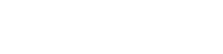
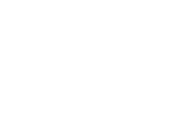
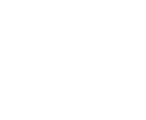
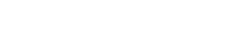
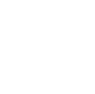
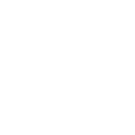
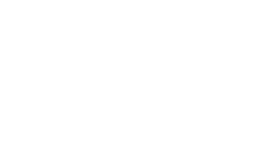

---

> [!info] Synthesis
> ## Circuit Synthesis

<u><strong style="color:#dab1da">Synthesis</strong></u> — circuit implementation given a truth table.

**Procedure (SOP):**
1. For each row where $f = 1$, write a product term (AND of inputs) true **only** for that row
2. OR all product terms together

> [!example] Synthesis Example
> ## Synthesis Example

Given the truth table, find the simplest Boolean expression for $f$ and draw the circuit.

| $x_1$ | $x_2$ | $f$ |
|:-----:|:-----:|:---:|
| 0 | 0 | 1 |
| 0 | 1 | 1 |
| 1 | 0 | 0 |
| 1 | 1 | 1 |

> [!success]- Solution (Click to expand)
> **Step 1 — Canonical SOP:**
>
> | $x_1$ | $x_2$ | $f$ | Product term |
> |:-----:|:-----:|:---:|:------------:|
> | 0 | 0 | 1 | $x_1'x_2'$ |
> | 0 | 1 | 1 | $x_1'x_2$ |
> | 1 | 0 | 0 | — |
> | 1 | 1 | 1 | $x_1 x_2$ |
>
> $$f = x_1'x_2' + x_1'x_2 + x_1 x_2$$
>
> **Step 2 — Simplify:**
>
> $$
> \begin{aligned}
> f &= x_1'(x_2' + x_2) + x_1 x_2 = x_1' + x_1 x_2
> \end{aligned}
> $$
>
> Add a duplicate term and factor again:
>
> $$
> \begin{aligned}
> f &= x_1'x_2' + x_1'x_2 + x_1'x_2 + x_1 x_2 \\
> &= x_1'(x_2'+x_2) + x_2(x_1'+x_1) = x_1' + x_2
> \end{aligned}
> $$
>
> **Step 3 — Circuit** ($f = x_1' + x_2$):
>
> 

---

> [!quote] Minterms and Maxterms
> ## Minterms and Maxterms

For a function $f(x_1, x_2, \ldots, x_n)$ with $n$ inputs:

A <u><strong style="color:#f0965a">minterm</strong></u> is a <u><strong style="color:#f0965a">product</strong></u> term containing every variable exactly once (complemented or not). Denoted $m_i$.

A <u><strong style="color:#7bbce0">maxterm</strong></u> is a <u><strong style="color:#7bbce0">sum</strong></u> term containing every variable exactly once (complemented or not). Denoted $M_i$.

The subscript $i$ identifies the row: $m_i = 1$ (and $M_i = 0$) if and only if $(x_1\, x_2\, \cdots\, x_n)_{10} = i$.

By De Morgan's law, minterms and maxterms are dual: $(m_i)' = M_i$ for $i = 0, 1, \ldots, 2^n - 1$.

**Three-variable minterms and maxterms:**

| $i$ | $x_1$ | $x_2$ | $x_3$ | Minterm | Maxterm |
|:---:|:-----:|:-----:|:-----:|:-------:|:-------:|
| 0 | 0 | 0 | 0 | $m_0 = x_1'x_2'x_3'$ | $M_0 = x_1+x_2+x_3$ |
| 1 | 0 | 0 | 1 | $m_1 = x_1'x_2'x_3$ | $M_1 = x_1+x_2+x_3'$ |
| 2 | 0 | 1 | 0 | $m_2 = x_1'x_2x_3'$ | $M_2 = x_1+x_2'+x_3$ |
| 3 | 0 | 1 | 1 | $m_3 = x_1'x_2x_3$ | $M_3 = x_1+x_2'+x_3'$ |
| 4 | 1 | 0 | 0 | $m_4 = x_1x_2'x_3'$ | $M_4 = x_1'+x_2+x_3$ |
| 5 | 1 | 0 | 1 | $m_5 = x_1x_2'x_3$ | $M_5 = x_1'+x_2+x_3'$ |
| 6 | 1 | 1 | 0 | $m_6 = x_1x_2x_3'$ | $M_6 = x_1'+x_2'+x_3$ |
| 7 | 1 | 1 | 1 | $m_7 = x_1x_2x_3$ | $M_7 = x_1'+x_2'+x_3'$ |

---

> [!fact] Canonical Sum-of-Products
> ## Canonical Sum-of-Products

Given a truth table, take the logical <u><strong style="color:#f0965a">OR</strong></u> of the <u><strong style="color:#f0965a">minterms</strong></u> for which $f = 1$. This representation is called the <u><strong style="color:#dab1da">canonical sum-of-products (SOP)</strong></u>, written $f = \Sigma(\ldots)$.

> [!example] Canonical SOP Example
> ## Canonical SOP Example

Consider the function defined by the following truth table. Find the canonical SOP and simplify.

<table><thead><tr><th>$i$</th><th>$x_1$</th><th>$x_2$</th><th>$x_3$</th><th>$f$</th></tr></thead><tbody>
<tr><td>0</td><td>0</td><td>0</td><td>0</td><td>0</td></tr>
<tr style="color:#f0965a"><td><strong>1</strong></td><td>0</td><td>0</td><td>1</td><td><strong>1</strong></td></tr>
<tr><td>2</td><td>0</td><td>1</td><td>0</td><td>0</td></tr>
<tr><td>3</td><td>0</td><td>1</td><td>1</td><td>0</td></tr>
<tr style="color:#f0965a"><td><strong>4</strong></td><td>1</td><td>0</td><td>0</td><td><strong>1</strong></td></tr>
<tr style="color:#f0965a"><td><strong>5</strong></td><td>1</td><td>0</td><td>1</td><td><strong>1</strong></td></tr>
<tr style="color:#f0965a"><td><strong>6</strong></td><td>1</td><td>1</td><td>0</td><td><strong>1</strong></td></tr>
<tr><td>7</td><td>1</td><td>1</td><td>1</td><td>0</td></tr>
</tbody></table>

> [!success]- Solution (Click to expand)
> **Canonical SOP** (OR of minterms where $f = 1$):
>
> $$f(x_1, x_2, x_3) = m_1 + m_4 + m_5 + m_6 = \Sigma(1,\,4,\,5,\,6)$$
>
> **Simplification:**
>
> $$
> \begin{aligned}
> &= x_1'x_2'x_3 + x_1x_2'x_3' + x_1x_2'x_3 + x_1x_2x_3' \quad &&\text{(unfold minterms)} \\
> &= x_1'x_2'x_3 + x_1x_2'x_3 \;+\; x_1x_2'x_3' + x_1x_2x_3' \quad &&\text{(rearrange to pair)} \\
> &= x_2'x_3(x_1'+x_1) + x_1x_3'(x_2'+x_2) \quad &&\text{(factor)} \\
> &= x_2'x_3 + x_1x_3'
> \end{aligned}
> $$
>
> **Circuit** ($f = x_2'x_3 + x_1x_3'$, NOT-AND-OR form):
>
> 

---

> [!fact] Canonical Product-of-Sums
> ## Canonical Product-of-Sums

Take the logical <u><strong style="color:#7bbce0">AND</strong></u> of the <u><strong style="color:#7bbce0">maxterms</strong></u> for which $f = 0$. This representation is called the <u><strong style="color:#dab1da">canonical product-of-sums (POS)</strong></u>, written $f = \Pi(\ldots)$.

> [!example] Canonical POS Example
> ## Canonical POS Example

Using the same truth table, find the canonical POS and simplify.

<table><thead><tr><th>$i$</th><th>$x_1$</th><th>$x_2$</th><th>$x_3$</th><th>$f$</th></tr></thead><tbody>
<tr style="color:#7bbce0"><td><strong>0</strong></td><td>0</td><td>0</td><td>0</td><td><strong>0</strong></td></tr>
<tr><td>1</td><td>0</td><td>0</td><td>1</td><td>1</td></tr>
<tr style="color:#7bbce0"><td><strong>2</strong></td><td>0</td><td>1</td><td>0</td><td><strong>0</strong></td></tr>
<tr style="color:#7bbce0"><td><strong>3</strong></td><td>0</td><td>1</td><td>1</td><td><strong>0</strong></td></tr>
<tr><td>4</td><td>1</td><td>0</td><td>0</td><td>1</td></tr>
<tr><td>5</td><td>1</td><td>0</td><td>1</td><td>1</td></tr>
<tr><td>6</td><td>1</td><td>1</td><td>0</td><td>1</td></tr>
<tr style="color:#7bbce0"><td><strong>7</strong></td><td>1</td><td>1</td><td>1</td><td><strong>0</strong></td></tr>
</tbody></table>

> [!success]- Solution (Click to expand)
> **Canonical POS** (AND of maxterms where $f = 0$):
>
> $$f(x_1, x_2, x_3) = M_0 \cdot M_2 \cdot M_3 \cdot M_7 = \Pi(0,\,2,\,3,\,7)$$
>
> **Simplification** using the theorem $(x + y)(x + y') = x$:
>
> $$
> \begin{aligned}
> &= (x_1+x_2+x_3)(x_1+x_2'+x_3)(x_1+x_2'+x_3')(x_1'+x_2'+x_3') \quad &&\text{(unfold maxterms)} \\
> &= \underbrace{(x_1+x_3+x_2)(x_1+x_3+x_2')}_{x_1+x_3} \cdot \underbrace{(x_2'+x_3'+x_1)(x_2'+x_3'+x_1')}_{x_2'+x_3'} \quad &&\text{(rearrange \& apply theorem)} \\
> &= (x_1+x_3)(x_2'+x_3')
> \end{aligned}
> $$

---

> [!quote] NAND and NOR Gates
> ## NAND and NOR Gates

A binary function can always be implemented using NOT, AND, and OR gates, but two additional gate types are commonly used in practice.

A <u><strong style="color:#dab1da">NAND gate</strong></u> realizes AND *followed by* NOT — its output is $(x_1 \cdot x_2 \cdots x_n)'$.
A <u><strong style="color:#dab1da">NOR gate</strong></u> realizes OR *followed by* NOT — its output is $(x_1 + x_2 + \cdots + x_n)'$.

In some technologies, a NAND gate requires fewer transistors than a separate AND gate, and similarly a NOR gate requires fewer than a separate OR gate, making them preferable for physical implementation.



**Truth tables (2-input):**

| $x$ | $y$ | NAND: $(xy)'$ | NOR: $(x+y)'$ |
|:---:|:---:|:-------------:|:--------------:|
| 0 | 0 | 1 | 1 |
| 0 | 1 | 1 | 0 |
| 1 | 0 | 1 | 0 |
| 1 | 1 | 0 | 0 |

---

> [!fact] De Morgan Gate Equivalencies
> ## De Morgan Gate Equivalencies

By De Morgan's law, a NAND gate is equivalent to an OR gate with both inputs inverted, and a NOR gate is equivalent to an AND gate with both inputs inverted:

$$
(x_1 x_2)' = x_1' + x_2' \qquad \text{(NAND = OR with inverted inputs)}
$$

$$
(x_1 + x_2)' = x_1' x_2' \qquad \text{(NOR = AND with inverted inputs)}
$$

=== start-multi-column: demorgan
```column-settings
Number of Columns: 2
```

**NAND = OR with inverted inputs**



=== column-break ===

**NOR = AND with inverted inputs**


=== end-multi-column

---

> [!info] SOP Implementation Using NAND
> ## SOP Using NAND Gates

A two-level AND-OR (SOP) circuit can always be converted to an equivalent all-NAND circuit. Apply double complement to the OR gate output, then use De Morgan:

$$
f = P_1 + P_2 + \cdots + P_k = \bigl((P_1)'  \cdot (P_2)' \cdots (P_k)'\bigr)' = \text{NAND}(P_1',\, P_2',\, \ldots,\, P_k')
$$

Since each $P_i' = \text{NAND}(\text{inputs of } P_i)$, every AND gate becomes a NAND and the OR gate becomes a NAND — the two-level structure is unchanged.

**Layer structure of a NAND implementation:**
1. NOT gates for input complements (same as SOP)
2. NAND gates for each product term (was AND)
3. A final NAND gate for the logical sum (was OR)

**Generic AND-OR → NAND-NAND transformation:**

=== start-multi-column: nand_generic
```column-settings
Number of Columns: 2
```

AND-OR (SOP)



=== column-break ===

NAND-NAND (equivalent)



=== end-multi-column

---

> [!example] NAND Synthesis Example
> ## NAND Synthesis Example

Implement $f = x_2'x_3 + x_1 x_3'$ with NAND gates. Apply double complement and De Morgan:

$$
\begin{aligned}
f &= x_2'x_3 + x_1 x_3' \\
&= \bigl((x_2'x_3)' \cdot (x_1 x_3')'\bigr)' = \text{NAND}\!\bigl(\text{NAND}(x_2',\, x_3),\; \text{NAND}(x_1,\, x_3')\bigr)
\end{aligned}
$$

=== start-multi-column: nand_specific
```column-settings
Number of Columns: 2
```

SOP implementation (NOT, AND, OR)


=== column-break ===

Equivalent NAND implementation



=== end-multi-column
