DEPARTMENT OF ELECTRICAL AND COMPUTER ENGINEERING

# ECE-124 LAB MANUAL

V5.0 LAB 4

Course: ECE-124 Digital Circuits and Systems (with Verilog)

# 1LAB4: VERILOG for Sequential Circuits – Sequential Logic & State-Machines

Lab4 will be the first one that uses Sequential Logic. Background information on sequential logic will be briefly covered to suit the Lab4 requirements. Design elements from previous labs will be used for Lab4. Both Moore and Mealy State Machine designs will be in the design goals for this lab.

# 1.1 Lab4 Intended Learning Outcomes

By the end of this lab, students should be able to:

- 1) **UNDERSTAND** how to avoid META-STABILITY in Sequential Logic
- 2) **UNDERSTAND** State Machine design concepts, including Moore or Mealy forms.
- 3) **IMPLEMENT a** State Machine design

# 1.2 Lab4 Outline

# Attendance will be taken.

The following new topics will be presented:

- 1. Brief Review on Sequential Logic Processing from Lab 3
- 2. What is Meta-Stability?
- 3. New VERILOG Component What are State Machines?
- 4. Lab4 Project Setup
- 5. Project Brief for Lab4

# 1.3 Lab4 Activities

#### 1.3.1 Recall from Lab3:

Two different Statement Domains in HDL's are the Concurrent and Sequential Statement domains.

In the Concurrent Statement domain, the Structural and Dataflow styles of Verilog coding were used in earlier labs to implement Combinational logic only.

Beginning in Lab3, a Behavioral VERILOG style was introduced. This style can only be implemented in the Sequential Statement domain and it employs a special construct, called the Always Procedural block. The Always Procedural blocks can be used to form Combinational Logic or Sequential Logic.

**REVISE** The combinational logic, created in an Always Procedural block, was a Tester function and it could use Behavioural style IF statements etc. to test results of an upstream Magnitude Comparator function.

Also, in Lab3, a bidirectional Up/Down Counter was created. The comparison function was implemented in two levels. This Magnitude Comparator function was used in an Energy Monitoring Controller to determine current and desired temperature differences.

# 1.3.2 Recall Sequential Logic

Sequential logic, like was covered in Lab3, uses "storage elements" like latches and Flip-Flops. There is an input that is captured by the clock signal into the storage element. The captured signal is then visible at the output of the storage element. For this course the storage elements are typically just of the D-Type flip-flop variety. The Flip-Flops can be controlled by other signals such as reset, Clock\_Enable.

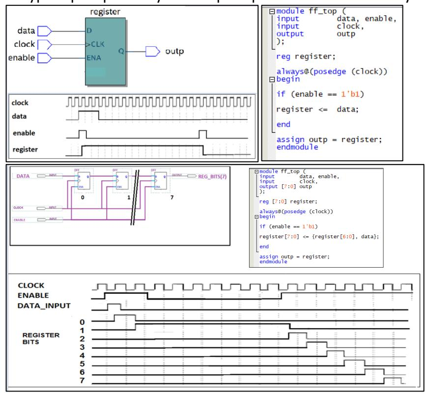

#### 1.3.3 What is Metastability?

Every register has some basic timing constraints at its Data input known as "Setup time (tsu)" and "Hold time (thld)". These constraints are expressed as relative to the activating edge of the register clock input. Refer to the figure below.

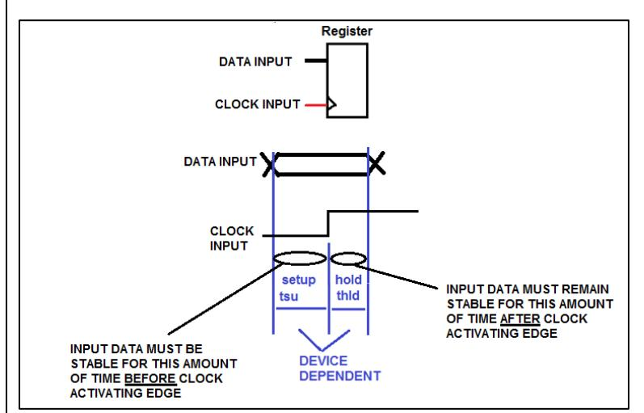

The Setup time (tsu) is the amount of time required for the data to be stable at the register input BEFORE the clock latching edge.

The Hold time (thld) is the amount of time required for the data to be stable at the register input AFTER the clock latching edge.

Violating these constraints can cause a problem at the register output. The figure below shows what happens to a register output when these timing constraints are not met. The "late arrival" of a Data Input relative to the register clock causes the Setup time violation. This result can be caused by an upstream signal delay due to signal routing in the device or by having too many levels of combinational logic to propagate through before the signal reaches the register.

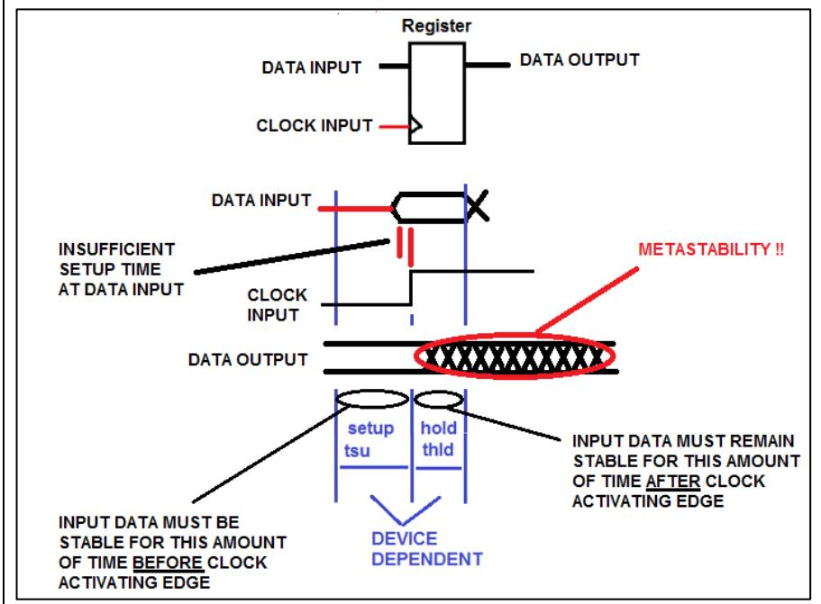

This situation at the output is called METASTABILITY and it can lead to all sorts of undefined and weird behaviours of downstream digital logic. The output drifts between the two logic levels for some amount of time. If other logic uses that output for logic operations, things can quickly get undefined.

Registers also have a timing property aligned with its output known as Clock to Output time". The "tco" is the time delay between the clock arriving at a register and the changing of the output of the register value. This aspect also has a role in the outcome of metastability issues with downstream registers.

But a BIG source of metastability problems in digital logic pipelines can come from employing multiple clock domains. These clock domains are asynchronous to each other (see below). Data outputs clocked registers from one clock domain may reach a pipeline register input that is running from a different clock domain.

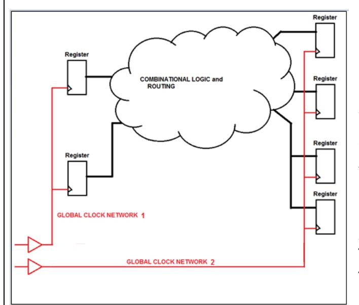

Looking at the figure on the left, one can see that two register pipeline groups are connected (through the combinational logic and routing resources) but they run on different and ASYNCHRONOUS clock networks. For this situation the "robustness" of the design cannot be guaranteed. The operation is largely unpredictable.

There are techniques that allow the crossing of data and control signals between different clock domains but are beyond the scope of the course currently. For this course just one global clock source is to be considered for common clocking.

#### 1.3.4 Using the Synchronous Design Techniques to Eliminate Metastability:

FPGA technologies have massive quantities of internal registers for state machines, counters, processors and all of them will use clock networking to run them. Between the registers, are equally huge numbers of combinational logic resources that do the digital logic transformations along the way.

To mitigate the possibility of METASTABILITY, an FPGA designer should take care in developing the arrangement of register pipeline designs. Use a common GLOBAL clock source as much as possible. This approach is usually referred to as "**Synchronous Design**".

In digital design work, there are several design constraints that we must consider in order to have the design be robust and operate with high performance reliability.

This Lab will employ the concept of "synchronous design" in mind. Metastability problems generally "show up" when synchronous design techniques are not used (i.e.: Asynchronous design). This can happen when pipeline registers are not using the same clock source. It might be good enough for VERY SIMPLE and SLOW circuits but is generally not acceptable for designs that will go into a production setting.

For all FPGA design situations, it is strongly recommended to follow a "best practices" approach to designing the clocking networks. This approach uses **Synchronous Design** clocking (shown in the figure below). This is done by transferring the data and control signals in the various register pipelines using a **COMMON**, high-performance (low skew) global clock network. This approach greatly reduces the range of operations variability. It makes the performance more predictable and easier to analyze.

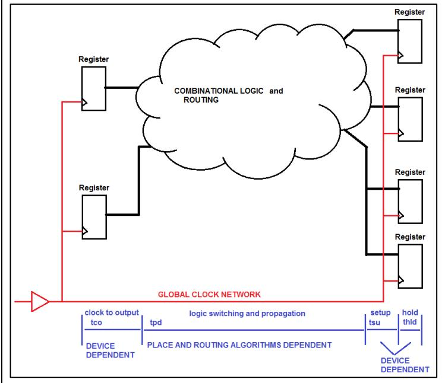

In synchronous designs, there is a Global clocking scheme used in a common clock domain. In the figure, one can see a typical array of registers used in a synchronous FPGA design. Between the SOURCE register on the left and the DESTINATION registers on the right, there can be a great deal of signal propagation delay along the paths through combinational logic and routing.

If it is deemed by the FPGA design tool, that moving data from one register output stage to another register input (on the same clock domain)) takes TOO LONG then the insertion of an intermediate clocked register pipeline stage is most likely required to be added.

However, someone may ask, "but external signals are NOT synchronized to this common global clock. They are ASYNCHRONOUS to the common global clock. How are these external signals supposed to be interfaced into a Synchronous Design?

External Input Synchronization to the Global clock domain is done by adding two register stages in series (like a two-stage shift register) and clocked by the same common Global Clock.

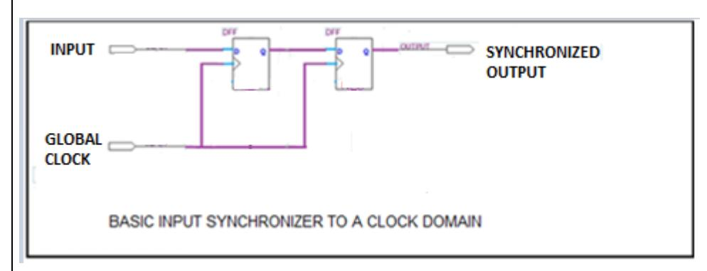

If metastability occurs at the output of the first register, the metastability will not reach the output of the second stage and thereby prevent it from getting into the rest of the digital logic.

Meanwhile the first stage output will have an entire Global clock cycle time for any metastable behavior to settle out before the second stage register transfers its input value from the first stage.

Below is a sketch of how a common global clock can be used to generate Clock\_enables with different frequencies such that different logic functions can all run at different frequencies in a design. Each Clock\_Enable must ALWAYS JUST BE ACTIVE FOR ONE CYCLE OF THE COMMON CLOCK SIGNAL.

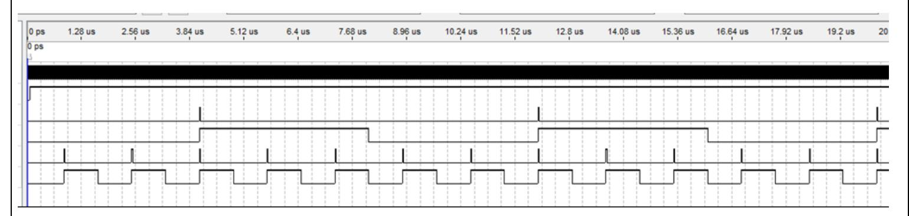

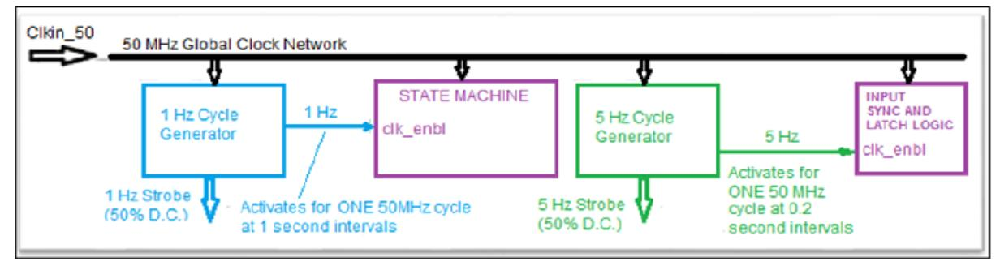

#### 1.3.5 Lab4 – New VERILOG Component – What is a State Machine?

Time-driven execution of any machine task can be accomplished by using a powerful design methodology. This approach employs STATE MACHINES.

A trivial example task is itemized below for a Simple Breakfast outline:

| STATE:                                   | OUTPUTS:                 | TRANSITION EVENT TO NEXT       |
|------------------------------------------|--------------------------|--------------------------------|
| STATE:                                   |                          |                                |
| State 1: Get bread from cupboard         |                          | < Got Bread >                  |
| State 2: Placing bread in toaster        | (DROP BREAD IN TOASTER)  | < Bread in toaster>            |
| State 3: Get plate                       | (START TOASTER)          | < Got Plate >                  |
| State 4: Wait for Toast cycle completion |                          | < Toast Pops Up >              |
| State 5: Put Toast on plate              | (GET TOAST FROM TOASTER) | < Toast on Plate >             |
| State 6: Butter the Toast                | (APPLY BUTTER)           | < Toast Buttered >             |
| State 7: Add Jam                         | (APPLY JAM)              | < Jam Added >                  |
| State 8: Process done> Enjoy.            | (DONE)                   | <wait for="" repeat=""></wait> |

Observe the left-hand column that shows the name or "state" steps involved in the task. In the right-hand column are the transition inputs to the process that would be from sensors that could signify events such as "Got\_Bread, Bread\_in\_Toaster\_and\_Started, Got\_Plate" etc.

The logic outputs could be used to control the mechanics to "Drop Bread in Toaster", "Start Toaster",…."DONE" etc.

A state sequence diagram is shown below.

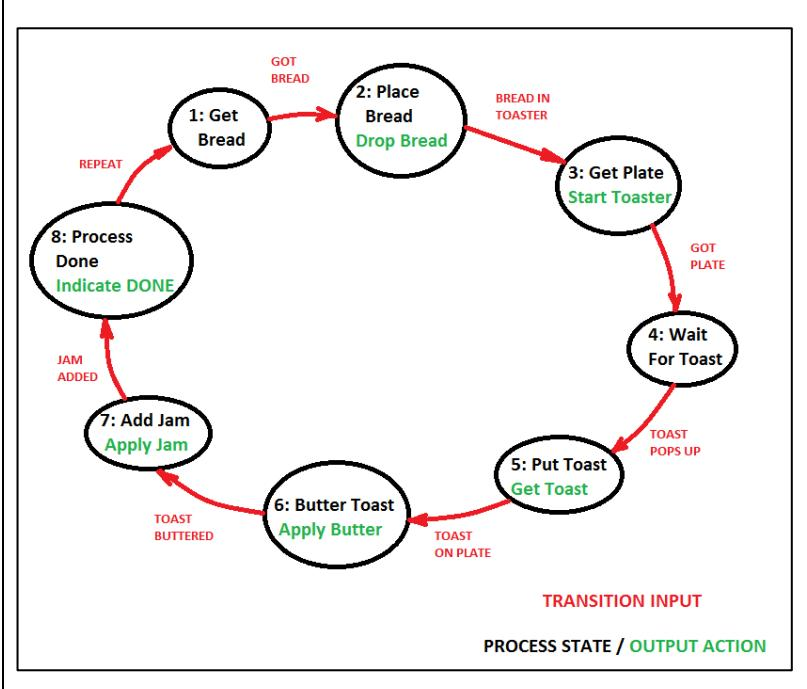

The task sequence could be implemented with a STATE MACHINE design to execute the sequence.

In a state machine design, the conditions that make it change from the CURRENT state to the NEXT state are various. Combinational logic is used to determine if-or-when those state transitions should occur. The state changes occur in synchronization with a state machine clock because registers are involved.

There are two primary classes of state machines used in sequential logic design: Moore and Mealy. To remember the names just think of two engineers sitting at a Thanksgiving table. One engineer politely says to the other "Would you like some Moore corn?" to which the second engineer replies, "Only if it's not Mealy". (Groan!).

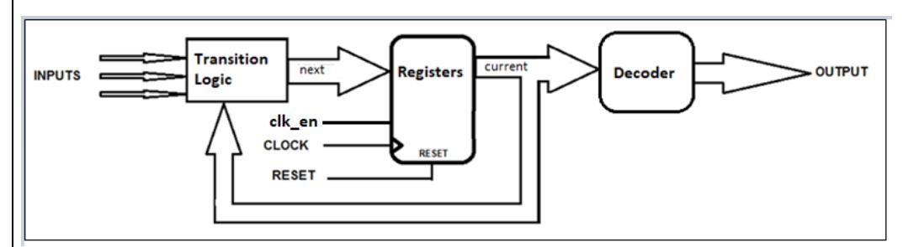

MOORE STATE MACHINE:

Output is a function of present state ONLY. Moore SM's outputs are only changed when the state machine is clocked.

For any change of an INPUT to a MOORE State Machine an output change will NOT happen until after the next CLOCK CYCLE.

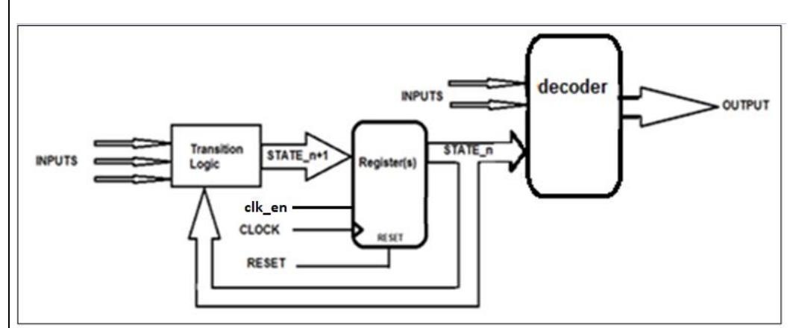

MEALY STATE MACHINE:

# Outputs are functions of present state AND inputs.

For any change of an INPUT to a MEALY State Machine an output change MAY happen with a ZERO delay or after the next clock cycle.

For this lab, both the Moore and Mealy state machines can be used. Referring to two figures above, there are generally just three sections in each state machine design. These are the Register, Transition and Decoder sections. Only the Register section is implemented as a Sequential Logic block. The Transition and Decoder sections are implemented as Combinational Logic blocks.

Now the three sections of the State Machine will be shown using the VERILOG always@ block construct.

# **REGISTER SECTION:**

The state names must be defined first. In Verilog, the States must be represented with n-bit numeric values. They can be referred in the Register section by a any TEXT name. For example:

The above states are declared as paramenters with names and unique numeric values. The number of bits used in the code must be able to at least cover the range of possible states being used by the state machine.

There are two variables used to contain any of the declared the State parameter codes. These are the "current\_state" and the "next\_state" variables

The Register section uses the state machine clock input (**along with a clock\_enable if specified**) and usually a RESET input signal. These signals are used to advance the state machine to a new state in when a clock edge (with a clock\_enable) or to RESET it.

IT IS SEQUENTIAL LOGIC because **registers are created** (or inferred) with this always block construct.

# **TRANSITION SECTION:**

The next State Machine section is the Transition section and it is implemented in another always block construct in the State Machine file. It is to be COMBINATIONAL LOGIC only. **THE ONLY OUTPUT FROM THE TRANSITION SECTION IS TO BE THE "next\_state" value**. No State Machine ports to the outside world are allowed come from the State Machine Transition Section.

The always block uses an "\*" in the Sensitivity list.

A VERILOG "CASE" statement is typically used.

Several State Machine inputs I0, I1, I2 and the "**current\_state**" to evaluate what the "**next\_state**" value will be. A typical example of a CASE statement is shown below:

It MUST BE COMBINATIONAL LOGIC for proper State Machine operation and NO inferred latches are permitted.

**NOTE**: All IF statements must have ELSE CLAUSES PRESENT etc.)

Note how specific inputs are observed by the Transition Logic only in specific "current" state cases and also how these inputs can cause the State Machine Transition section to generate the "next"state values.

For example, if an "Input1" input signal is active when the State Machine "current\_state" is in "STATE\_A", the State Machine Transition section will force a jump in its state sequence to state "STATE\_B" as its "next" state.

Some situations will result in no change in the next\_state value.

A default state must always be included to cover any undefined parameter code values. If this is left out then latches may be inferred.

# **DECODER SECTION (Moore State Machine):**

A third section of the State Machine design is the Decoder section.

It sets the State Machine outputs for the entire State Machine.

For a Moore Style State Machine, the output values are determined only decoded from the value of the "current\_state".

It is a requirement that all the output signal levels are defined for all current\_state values.

A default state must always be included to cover any undefined parameter code values. If this is left out then latches may be inferred.

The Decoder section is COMBINATIONAL LOGIC for proper State Machine operation and NO inferred are permitted.

# **DECODER SECTION (Mealy State Machine):**

For a Mealy State Machine, the only major difference from the Moore State Machine is that the Decoder Section of a Mealy State Machine can have outputs that depend on the current\_state value **AND** some inputs.

The Mealy State Machine state is like a "gate control" on an input signal (or a Boolean function of inputs) for an output activation.

Let's assume that the Transition Logic being the same as in the Moore example earlier.

Looking at the "output2" signal, it is driven ON when:

- 1) the current\_state = STATE\_B" AND if the input "input1" being ON or
- 2) when the current\_state = STATE\_C or
- 3) when current\_state = STATE\_D and input2 is ON.

Notice that for Mealy State machines (with the outputs also being driven by combinational inputs), the outputs can suffer from asynchronous transitions of the inputs. For example, if Input1 is "intermittent" then output1 and output2 will be "intermittent" as well during the enabling states. This is the main disadvantage of Mealy State Machines as compared to Moore State Machines.

The advantage for Mealy State Machines is that often they can be designed with a fewer number of states than a Moore version.

The external inputs are prevented from directly influencing the State Machine outputs. The Moore State Machine must change "state" first and then the outputs are driven by decoding the "current\_state" value.

The type of state machine to be used for an application, depends on the requirements of the application.

The code examples above give you a starting point for a typical State Machine design. You can make the modifications to make your state machine operate as a Moore or Mealy design. You can declare it as a component at the top level and then create an instance of it to control other functions (shift register, counter etc.) and hook up the clock, inputs and outputs.

#### 1.3.6 Lab4 Project Brief for Lab4

The Lab4 Project can encompass most of the components that you have designed earlier this term and in addition to the components that were developed earlier in this lab session.

You will create a Robotic Arm Controller or RAC (illustrated below) that could be used for positioning a robotic arm in 2 dimensions and employing an extender/grappler. Some requirements information on the operation of the RAC is needed.

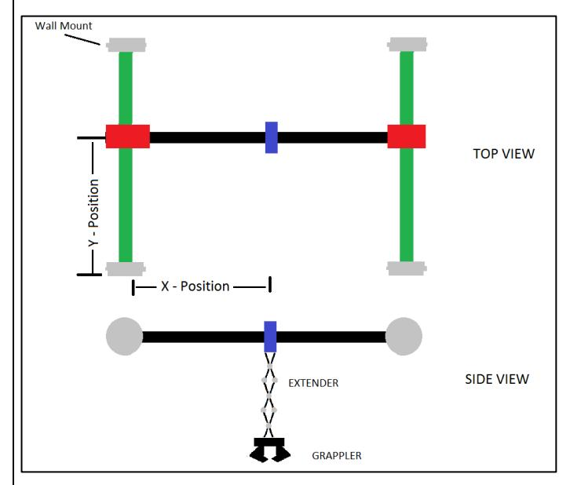

*RAC Movement Operations*:The RAC movement operates on a basis of processing X/Y Target coordinates. The Target X/Y co-ordinate values are set by two sets of four switches (one set for X\_target, one set for Y-target). The Target X and Y values will be captured and processed when a separate "MOTION" Push button is pressed and released.

When the MOTION button is **pressed** - the X/Y switch values must be CAPTURED into X and Y holding registers (i.e., Xreg and Yreg).

When the MOTION button is **released** - the RAC is enabled to move towards the X/Y Target. The motion

must happen automatically, and it must continue until the RAC reaches that Target position. If the RAC reaches its Target X POSition before the Target Y-POSition, then motion in the X-direction is discontinued but motion in the Y-direction continues until the Target Y-position is reached. During this time of motion, further changes to the Target input values or the pressing of the Motion button must be prevented from updating the holding registers. The Target co-ordinates are to be captured into registers when the MOTION signal is pressed.

When the RAC is NOT in motion, the Extender can be enabled for operation.

NOTE: as mentioned earlier, X/Y motion of the RAC cannot happen if the Extender is in its extended position. If motion is attempted while the Extender is extended the RAC must generate a System Fault Error and X/Y motion is to be prevented. To clear the error the Extender must be fully retracted. Then a status indicator "Extender\_OUT"must be updated to OFF. After this X/Y motion is permitted.

# *1.3.6.1* RAC Extender and Grappler Operation*:*

The Extender can be enabled to extend or retract when the RAC is not in motion. The Extender is activated by the RAC being stopped in X/Y motion and by pressing and releasing a dedicated "EXTENDER" pushbutton. **Pressing/holding/releasing** it once will cause the Extender to extend outwards and it should continue until the FULL extension is reached. **Pressing/holding/releasing** the button again (only when in the FULL EXTENDED position) will cause the retraction inwards and it should continue until the FULL RETRACTION is reached. The Extender position sequence is to be displayed on some leds(5 downto 2) as shown below:

Position: leds[5:2] Retracted: 0000 Extending1: 1000 Extending2: 1100 Extending3: 1110 Fully Extended: 1111

Anytime that the extender is NOT in its retracted position ("0000") the status flag "Extender\_OUT" must be driven ON.

NOTE: If any attempt is made to move the RAC to new Target co-ordinates while the Extender\_Out flag is active the X/Y Position Controller must be PREVENTED from X or Y motion and a System Fault Error must be indicated. The System Fault Error must remain active (locked) until the Extender is fully retracted.

The Grappler is enabled to **change only when the Extender is in the Fully Extended position ("1111").** Its operation is enabled by a dedicated "GRAPPLER" push-button. **Press/Hold/Release** the button for an Open operation and **Press/Hold Release** the button for a Close operation. **The state of the Grappler must be indicated (1 means CLOSED; 0 means OPEN).**

**ONLY ONE FUNCTION (ie: only ONE of Motion or Extender or Grappler) IS REQUESTED AT A TIME BY THE PUSH-BUTTONS. This simplifies the State Machine State sequence design.**

**FOR EACH BUTTON function you must sense the function Activation, The State Machine then proceeds to a new state and then it must wait to sense the function Deactivation and then proceed with the rest of its state sequence.**

# 1.3.7 Initial Project Setup for Lab4

Start the Lab4 project like what was done in earlier Labs. Go to LEARN and download the Lab4 Zipped folder "Lab4" into the ECE-124 folder on your C: Drive. Extract the contents to create the new Lab4 project folder and its contents therein.

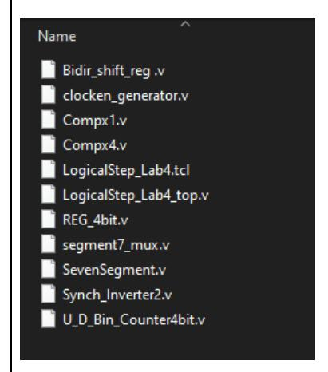

Your Lab4 Project Folder (downloaded from Learn) starts out like that shown at left. The files that will need to be developed are the LogicalStep\_Lab4\_top.v file and the THREE State Machine design files. For those three files, you must add ports to connect to the **Global\_clock**, **Global\_clken** and the **reset** signals in the LogicalStep\_Lab4\_top.v file, The LogicalStep\_Lab4\_top.v file already has these connections as inputs for most of the non-State-Machine Verilog blocks (Clken\_Generator and Sync\_Inverter blocks excluded).

Start up the Intel Quartus Prime platform and begin a new project with the New Project Wizard. Enter the new Project parameters:

Project Folder: Lab4

Project Name: LogicalStep\_Lab4

Project Top Level: LogicalStep\_Lab4\_top

Then click NEXT on the New Project Wizard Dialog Window. Then click NEXT again (with Empty Project). Click NEXT on dialog windows for Family, Device & Board Settings until you reach the following window (EDA Tool Settings).

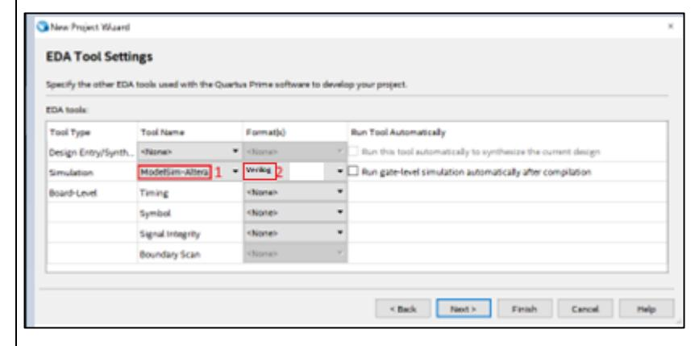

Click FINISH on the New Project Wizard Dialog Window.

# **NEXT IMPORTANT STEP (.tcl script):**

**Run the Lab4 TCL script** to assign the FPGA device type and pins for the LogicalStep FPGA.

Below is a Block Diagram of the Lab4 Project FPGA design.

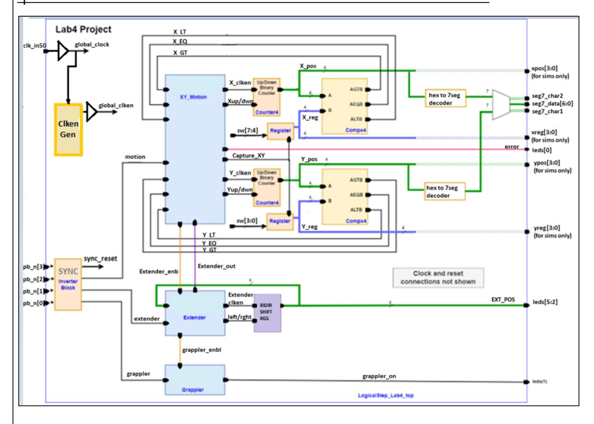

All Sequential Logic (registers, counters, and state machine register sections etc.) must be clocked by the signal "**global\_clock**" and with the "**global\_clken"** and the "**SYNC\_RESET**" signals. Excepted from this are the SYNC\_Inverter and Clken\_Generator blocks.

The BLUE controlling blocks (XY\_Motion/ Extender/Grappler) must each use a State Machine design. You must choose the Moore or Mealy State Machine for each controller block and make the connections to them.

To do your Lab4 project development, do one section at a time. Comment-out all sections except for the Infrastructure Section. Then just start by simulating the **clkin\_50, global\_clock, global\_clken** and athe pb\_n inputs and also the Sync Inverter outputs (**sync\_reset, motion, extender and grappler**) signals first (from the Infrastructure Section). In the Simulator **Set all pb\_n inputs to OFF and set the clkin\_50 input to a 10ns clock period. Run the simulation and note the times when the global\_clken is active.** 

**The State Machine states should have separate states to detect when the appropriate button is pressed and when the button is released. Only ONE button is pressed/held/released at a time.**

The **motion, extender and grappler** signals must overlap the times when the global\_clken is active to begin state machine operations. Leave the XY Motion Control and Extender Control sections commented-out.

Then develop the Grappler State Machine control first by creating the Grappler Control State Machine (SM2). You can force the grappler\_enbl signal to ON and then activate the **grappler** input from the Sync Inverter block (using pb\_n[0]).

Then move on the Extender State Machine control design and get the Bidirectional Shift register operating correctly. You can force the extender\_enbl signal to ON and then activate the **extender** Input from the Sync Inverter block (using pb\_n[1]).

Then move on to the X/Y Motion State Machine control etc.

# *1.3.7.1 Mealy State Machines (if used)*

Any Mealy State Machine for the Lab4 Project will consist of 3 primary sections. These will be the Register, Transition and Decoder sections.

The Register section will be clocked by the rising edge of the Clk input. A reset input must also be included to clear the Register section back to its initial state.

The Transition section will allow the states to change states according to the inputs received from the inputs.

The Decoder section MUST be of the MEALY form. Outputs should always default to '0'. The outputs can otherwise be driven by inputs during specific current\_state values.

# *1.3.7.2 Moore State Machines (if used)*

Any Moore State Machine used in the Lab4 Project will consist of 3 primary sections. These will be the Register, Transition and Decoder sections.

The Register section will be clocked by the rising edge of the clock input. A reset input must also be included to clear the Register section back to its initial state.

The Transition section will allow the states to change states according to the inputs received from the inputs.

The Decoder section MUST be of the MOORE form. Outputs should be defined for each of the "current\_state" values used and for the default case only.

The following snips show the Starter version sections of the LogicalStep\_Lab4\_top.v file **LogicalStep\_Lab4\_top.v Module Declaration:**

Like was done in the Lab3 project, the Lab4 project will use a set of Compiler Directives so that the development can be more time-efficient by observing the behaviour of internal signals in simulation. The list of signals in the **ifdef** section above may be changed to suit your needs. Most of these output ports are obvious in terms of the signal functions but you can refer to the Block Diagram earlier for clarification. Some signals are extras that you can delete. When the design is ready for testing, comment-out the define SIM\_FLAG line above to remove the extra ports for the LogicalStep Board FPGA download file.

**At the end of the file there are some signal assignments used to connect the extra output ports for simulation.**

#### **LogicalStep\_Lab4\_top.v file Infrastructure Section:**

These blocks are pre-built for you. The **global\_clken** signal (at the output the GLOBAL\_CLKEN BUFFER changes to a high rate for simulation and a low rate for demo's via the SIM\_FLAG macro (like in Lab3 for HVAC\_SIM). The **limit\_reached** output signal (you can ignore this signal) activates at half the strobe rate of the **global\_clken** signal.

The Sync\_Inverter2 block synchronizes the pb\_n inputs to the 50 MHz global clock to drive the **sync\_reset, motion, extender, grappler** signals. Inversion also happens to the pb\_n signal inputs. Finally, this block does a "filtering" on the pb\_n inputs to eliminate cross-ralk noise that sometimes occurs on the LogicalStep board. For the Motion, Extender, Grappler functions is simulation see below.

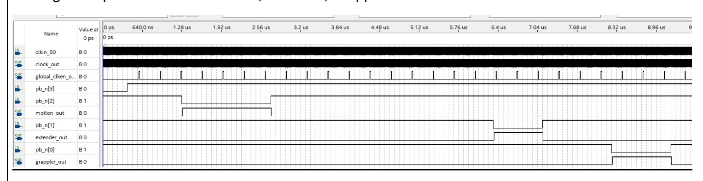

# **LogicalStep\_Lab4\_top.v Grappler Control Section:**

This Grappler Control Section is the simplest of the three blocks with a State Machine.

# SM2 Inputs from the Infrastructure Section:

**global\_clk, global\_clken**, signals (coming from GLOBAL BUFFERS) **sync\_reset, grappler** signals (coming from the Sync Inverter2)

# SM2 Inputs from the Extender Control Section:

**grappler\_enbl** input signal (coming from the SM1 State Machine). During the initial development this signal may just be set to ON for simulations to bypass the Extender Control grappler\_enbl signal.

# SM2 Outputs:

The output signal will be the **grappler\_ON** signal going the leds[1]. ON is Grappler Closed; OFF is Grappler Open

# SM2 Final Operational Design:

The Grappler Control Section State Machine should enable the **grappler\_ON** output signal to go through its OPEN or CLOSE sequence **only when the grappler\_enbl** signal from the Extender Contral SM1 State Machine **is active AND** the **grappler** signal arrives from the Infrastructure Section

# **LogicalStep\_Lab4\_top.v Extender Control Section:**

This section is the next one of the three State Machine control blocks to be done.

# SM1 Inputs from the Infrastructure Section:

**global\_clk, global\_clken**, signals (coming from GLOBAL BUFFERS) **sync\_reset, extender** signals (coming from the Sync Inverter2)

# SM1 Inputs from the XY Motion Control Section:

**extender\_enbl** input signal (coming from the SM1 State Machine). During the initial development this signal may just be set to ON for simulations to bypass the XY Motion Control extender\_enbl signal.

# SM1 Inputs from the Bidir Shift Register:

**extender\_pos[3:0]** from the Bidir Shift Register to SM1 to sense the extender position. The Bidir Shift Register also connects the **extender\_pos[3:0]** to leds[5:2]

# SM1 Outputs:

**extender\_dir, extender\_in\_motion** to the Bidir Shift Register for extend/retract **extended** to the XY Motion Control section when the extender is **NOT FULLY RETRACTED grappler\_enbl** signal going the Grappler Control Section.

# Final Operational Design:

This section will begin its sequence to extend or retract the Bidir Shift register (with **extender\_dir, extender\_in\_motion**) **only when the extender\_enbl** signal from the XY Motion Control State Machine (SM1) **is active AND** the **extender** signal arrives from the Infrastructure Section.

The Extender Control Section State Machine (SM1) should activate the **grappler\_enbl** signal to the Grappler Contral Section **only if the extender is FULLY extended.** The Extender Control Section should activate the **extended** signal to the XY Motion Control section (SM) **whenever the extender is NOT FULLY RETRACTED**.

# **LogicalStep\_Lab4\_top.v X/Y Motion Control Section:**

# SM Inputs from the Infrastructure Section:

**global\_clk, global\_clken**, signals (coming from GLOBAL BUFFERS) **sync\_reset, motion** signals (coming from the Sync Inverter2)

# SM Inputs from the XY Motion Control Section:

**x\_gt, xeq, x\_lt** come from the X-Compx comparator **y\_gt, yeq, y\_lt** come from the Y-Compx comparator

# SM Inputs from the Extender Control Section:

**extended** from the SM1 State Machine

# SM Outputs:

**Capture\_XY** goes to the X and Y REG\_4bit registers to capture the Target Co-ordinates (as a synchronous load (like a clk\_enable) when the Motion input arrives.

**x\_cnt\_en** is activated to allow the x-position counter to count.

**x\_cnt\_up1\_dwn0** is used to control the x\_position counter counting direction.

**y\_cnt\_en** is activated to allow the y-position counter to count.

**y\_cnt\_up1\_dwn0** is used to control the y\_position counter counting direction.

**extender\_enbl** going to the Extender Section State Machine SM1.

**posc\_err** goes to leds[0] and is active when the XY motion is requested but the **extended** signal is active.

# Final Operational Design:

Reset is activated and the seven-segment patterns go to 00 on the Dual seven-segment display.

The X and Y Target co-ordinates are set with sw[4], sw[3:0] respectively.

The pb\_n[2] is pressed and HELD for 1 second and then released. The XY Motion controller should start moving towards the X/Y target co-ordinates and the actual position is shown on the Dual Seven-segment display (Digit1 shows X, Digit2 shows Y). They must both change together unless one target is reached first (then the other continues towards its target). While in motion, changing the Target c-ordinate values with the switches must not be allowed override the current target destination.

When finally reaching the target, the XY Motion becomes "AT-REST and a new target co-ordinate set may be processed by changing the XY Target value and activating the pb\_n[2] button again.

Anytime that the XY Motion is requested and the **extended** signal (from the Extender Control Section) is active, the SM XY Motion Control will activate the **posc\_err** output. This may be cleared by retracting the extender and then press/HOLD/release the pb\_n[2] button for the Motion operation again.

# Lab4 Project Input / Output Definitions

| SIGNAL T Y P E :                | SIGNAL NAME:      | ASSIGNED PORT(s):                          | Comment                                                                                                                                       |
|---------------------------------------|-------------------|-----------------------------------------------|-----------------------------------------------------------------------------------------------------------------------------------------------|
| RAC                                   | Clock             | Clk                                           | Main clock driven by clock source block                                                                                                       |
| Inputs                                | RESET             | pb_n[3] – inverted, filtered, sync'd | RESET – must reset ALL registers and State Machines                                                                                     |
|                                       | X_target          | sw[7:4]                                       | Target X- Co-ordinate (in hex)                                                                                                             |
|                                       | Y_target          | sw[3:0]                                       | Target Y- Co-ordinate (in hex)                                                                                                             |
|                                       | Motion            | pb_n[2]- inverted, filtered, sync'd     | Capture X/Y and enable Motion to X/Y Target – press and hold for 1 second and then release to start motion                  |
|                                       | Extender          | pb_n[1]- inverted, filtered, sync'd     | Extender Toggle (press and hold for 1 second and then release to extend; press and hold for 1 second and then release to retract) |
|                                       | Grappler          | pb_n[0]- inverted, filtered, sync'd     | Grappler Toggle (press and hold for 1 second and release to open; press and hold for 1 second and release to close)               |
| RAC                                   | extender_position | leds[5:2]                                     | Shows extender position                                                                                                                       |
| Outputs                               | "diagnostics"     | leds[7:6]                                     | SPARE LEDs: Use to connect to internal signals for debugging if needed                                                                     |
|                                       | grappler_on       | leds[1]                                       | Shows Grappler open/close status (1 means CLOSED; 0 means OPEN)                                                                            |
|                                       | Posc_err          | leds[0]                                       | Shows System Fault Error                                                                                                                      |
| LogicalStep                           |                   | Seg7_char2                                    | Enables the seg7_data for DIGIT2 display                                                                                                      |
| Board Outputs (not for sims) | Seg7_data         | Seg7_data[6:0] Seg7_char1                  | Segment7 data Enables the seg7_data for DIGIT1 display                                                                                     |