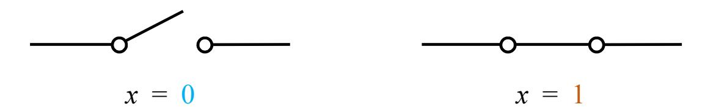
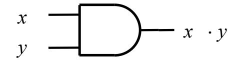
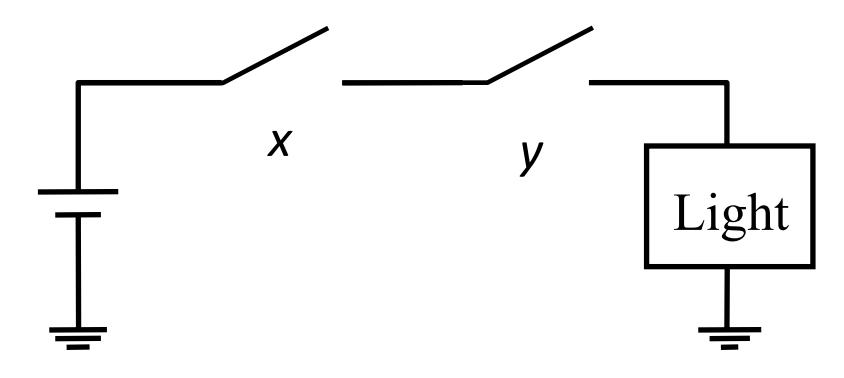
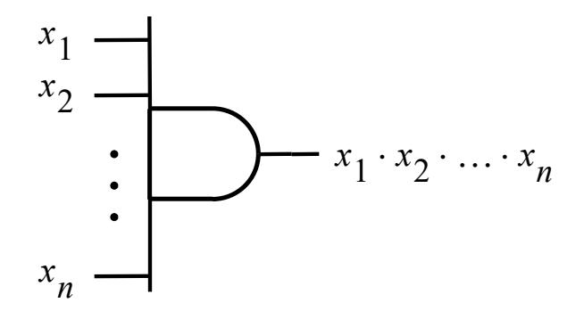
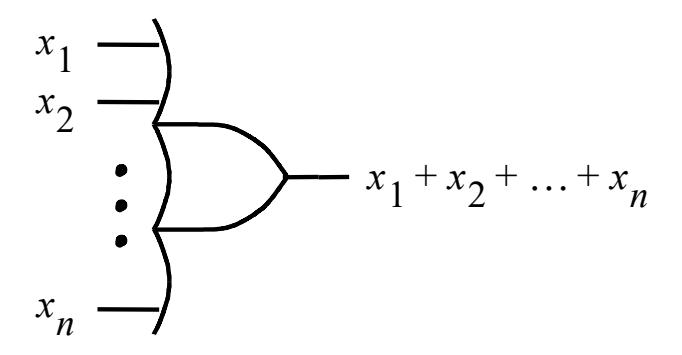
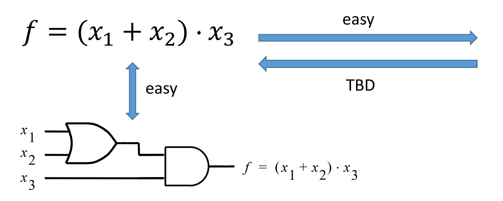
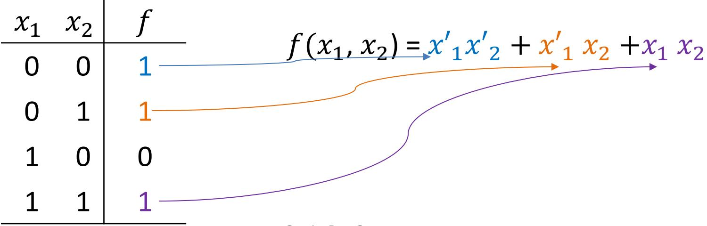
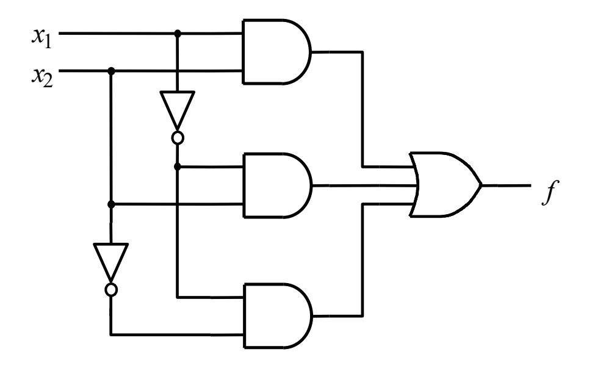
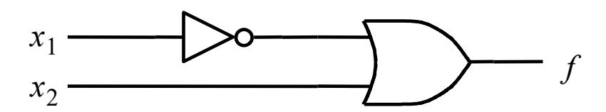

#### ECE 124 – Digital Circuits and Systems Dept. of ECE, Univ. of Waterloo

Lecture Slides: **Set 1 - Part 1**

#### Contents:

- Binary numbers
- Conversion to binary

©2014-2026 M. A. Hasan. These slides and notes are for the exclusive use of the students registered in the course. Reproduction in any form or use for any other purposes is prohibited.

#### **Binary numbers**

Digital circuits typically use the binary number system where

- the allowed symbols in the number representation are 0 and 1 (i.e, **bits)**
- the radix is 2
- for an *m*-bit number bm-1bm-2 … b0, where b\*'s are either 0 or 1, the value is

$$V = b_{m-1} \times 2^{m-1} + b_{m-2} \times 2^{m-2} + ... + b_0 \times 2^0$$

Example: 125 = 1 x 26 + 1 x 25 + 1 x 24 + 1 x 23 + 1 x 22 + 0 x 21 + 1 x 20

Thus the value 125 is represented as (125)10 in decimal and as (1111101)2 in binary

The binary representation is longer than the decimal. Why?

# **Conversion**

Given a positive value V in decimal, find its binary (i.e., radix 2) representation

• Note that if we divide V by 2, we get a quotient and a remainder. The remainder is either 0 or 1. Denoting the quotient as Q1 and the remainder as b0, we can write

$$V = Q_1 \times 2 + b_0$$
 (e.g.,  $27 = 13 \times 2 + 1$ )

• If Q1> 0, we divide it by 2 and can write Q1 = Q2 x 2 + b1 where Q2 and b1 denote the resulting quotient and remainder, respectively. Now plugging this expression of Q1 into that of the aforementioned V, we have

$$V = (Q_2 \times 2 + b_1) \times 2 + b_0 = Q_2 \times 2^2 + b_1 \times 2 + b_0$$
 (e.g., 27 = 6 x 22 + 1 x 2 + 1)

# **Conversion** (Contd.)

We repeat the aforementioned process until the resulting quotient becomes 0.

- Suppose this happens after m iterations, i.e., Qm is 0.
- We denote the remainders resulted in the process as b0, b1, b2,..., bm-1 which are 0 or 1.
- Then

$$V = b_{m-1} \times 2^{m-1} + b_{m-2} \times 2^{m-2} + ... + b_1 \times 2^1 + b_0 \quad (e.g., 27 = 1 \times 2^4 + 1 \times 2^3 + 0 \times 2^2 + 1 \times 2 + 1)$$

I.e., the right hand side is the binary representation of V.

#### **Example**: Convert 29 to binary

| Division by 2 |   | Quotient | Remainder |     |  |
|---------------|---|----------|-----------|-----|--|
| 29 ÷ 2     | = | 14       | 1         | lsb |  |
| 14 ÷2         | = | 7        | 0         |     |  |
| 7 ÷ 2      | = | 3        | 1         |     |  |
| 3 ÷ 2      | = | 1        | 1         |     |  |
| 1÷ 2       | = | 0        | 1         | msb |  |

Thus 29 = (11101)2

#### ECE 124 – Digital Circuits and Systems Dept. of ECE, Univ. of Waterloo

Lecture Slides: **Set 1 - Part 2**

#### Contents:

- Binary logic, variables and functions
- Binary logic operators and symbols
- Representations of logic functions

©2014-2026 M. A. Hasan. These slides and notes are for the exclusive use of the students registered in the course. Reproduction in any form or use for any other purposes is prohibited.

# **Binary logic and variables**

- Binary logic: two-valued logic, e.g., *true*/*false, yes/no,* and *closed/open*
- Binary logic variables: These can take on two discrete values 0 and 1
  - The value 0 implies *false, no, open,* etc.
  - The value 1 implies *true, yes, closed,* etc.

# **Binary logic functions**

• Binary logic functions are functions or expressions of **binary variables** or **other binary functions**. They produce an output which is 0 or 1 depending on input values

• A logic function can be defined using a **truth table**. The truth table indicates the value of the function for each possible input values. For example

| x | y | f |
|---|---|---|
| 0 | 0 | 0 |
| 0 | 1 | 1 |
| 1 | 0 | 1 |
| 1 | 1 | 0 |

# **Logic operators**

- Logic operations are needed to make logic functions and to manipulate them.
- There are three basic logic operators: AND, OR and NOT
- Symbols of logic operators

| Logic operator | Symbols        | Example              |
|-------------------|----------------|----------------------|
| AND               | �, nothing     | 𝑥𝑥 � 𝑦𝑦, 𝑥𝑥 |
| OR                | +              | 𝑥𝑥 + 𝑦𝑦        |
| NOT               | , overbar ′ | 𝑥𝑥′ , 𝑥𝑥̅      |

- Operators have precedence in the order: (), NOT, AND, OR.
- The parentheses () help clarify precedence

# **Logic gates, their symbols and truth tables**

• Logic operators AND, OR and NOT are implemented via logic gates (which in turn are implemented using **transistors**)

• AND gate symbol and truth table:

| x | y | xy |
|---|---|----|
| 0 | 0 | 0  |
| 0 | 1 | 0  |
| 1 | 0 | 0  |
| 1 | 1 | 1  |

Emulation of AND operation

• OR gate symbol and truth table: x y x+y

$$x$$
 $y$ 
 $x + y$ 

| 0 | 0 | 0 |
|---|---|---|
| 0 | 1 | 1 |
| 1 | 0 | 1 |
| 1 | 1 | 1 |

• NOT gate symbol and truth table:

$$x \longrightarrow x'$$

| x | x′ |
|---|----|
| 0 | 1  |
| 1 | 0  |

#### Multiple input AND and OR gates

Yours to do: Truth tables for 3-input AND and OR gates

# **Representations of logic function**

- A logic function can be represented in multiple ways.
- Using an example function, we show three methods -- i) algebraic,

ii) truth table, and iii) schematic

(This is closer to physical implementation)

|                   | 𝑥𝑥 1 | 𝑥𝑥 2 | 𝑥𝑥 3 | 𝑓𝑓 |  |
|-------------------|---------|---------|---------|----|--|
| easy              | 0       | 0       | 0       | 0  |  |
|                   | 0       | 0       | 1       | 0  |  |
| TBD               | 0       | 1       | 0       | 0  |  |
|                   | 0       | 1       | 1       | 1  |  |
|                   | 1       | 0       | 0       | 0  |  |
|                   | 1       | 0       | 1       | 1  |  |
|                   | 1       | 1       | 0       | 0  |  |
| Set 1 - Part 2 | 1       | 1       | 1       | 1  |  |
|                   |         |         |         |    |  |

#### ECE 124 – Digital Circuits and Systems Dept. of ECE, Univ. of Waterloo

Lecture Slides: **Set 1 - Part 3**

#### Contents:

- Boolean algebra
- Boolean algebra based design/synthesis

©2014-2026 M. A. Hasan. These slides and notes are for the exclusive use of the students registered in the course. Reproduction in any form or use for any other purposes is prohibited.

#### Boolean algebra

- Boolean algebra was introduced by G. Boole (in 1854) and later (in 1930s) it was shown by C. Shannon to be useful for describing logic circuits.
- Axioms/postulates and theorems of Boolean algebra are useful to simplify logic expressions, to prove equivalence of expressions, etc.
- Boolean algebra: It is defined by a set of elements, B, together with two binary operations '+' and '·' that satisfy the following set of postulates (see the next slide)

#### Boolean algebra (contd.)

In the examples below, we assume that  $x, y, z \in B$ .

• **Postulate 1**: Closure with respect to (wrt) '+' and '·'

e.g., 
$$x + y \in B$$
,  $x \cdot y \in B$ 

• **Postulate 2**: An identity element wrt '+', denoted by 0, and an identity element wrt '·' denoted by 1.

e.g., 
$$x + 0 = x$$
,  $x \cdot 1 = x$ 

Postulate 3: Commutative wrt '+' and '.'

e.g., 
$$x + y = y + x$$
,  $x \cdot y = y \cdot x$ 

Postulate 4: Distributive over '+' and '.'

e.g., 
$$x \cdot (y+z) = x \cdot y + x \cdot z$$
,  $x + y \cdot z = (x+y) \cdot (x+z)$ 

- **Postulate 5**: For each element  $a \in B$ , there exists an element  $a' \in B$  such that i) a + a' = 1 and ii)  $a \cdot a' = 0$
- **Postulate 6**: There exist at least two elements  $a, b \in B$  such that  $a \neq b$ .

# Boolean algebra (contd.)

If we assume that

- = 0, 1 and
- '+' and '�' are logical OR and AND operations, then all six postulates hold, where ′ is the complement of (P-5).

In the rest of this course, we will use this Boolean algebra.

# Boolean algebra (contd.)

Useful properties and theorems (where , , ∈ )

1. (a) 
$$x \cdot 0 = 0$$

Note the duality in relationships by interchanging � with + and 0 with 1.

Exercise: Prove theorems from postulates and/or other proven theorems

# Synthesis

- Synthesis is the implementation of a circuit
- We can draw circuits using gates to show the realization of functions

(we have already seen the synthesis of a simple circuit for a function represented in algebraic form)

- Using techniques like Boolean algebra, a function can be manipulated leading to multiple designs for the same function. (the costs can however vary)
- We will measure the *cost* in terms of *area* of the circuit. For this we will consider the number of gates plus the number of inputs to the gates
- We will assume that true as well as complement inputs are available free of cost (i.e., if x is available, then so is x')

#### Synthesis (contd.)

- Suppose we are given the following truth table and we want to synthesis a circuit for f.
- One possible procedure:
  - create a product term that has a value of 1 for which f=1 and then
  - take logical sum (i.e., OR) of all these product terms
- The resulting function is shown at the right (notice color matchings) and the circuit diagram on the next slide

art 3

7

# Synthesis (contd.)

Canonical sum-of-products

# Synthesis (contd.)

- A simpler circuit is possible.
- Earlier we derived: (1, 2) = 12 + 1 2 +1 2

Using distributive law:

$$f(x_1, x_2) = x'_1(x'_2 + x_2) + x_1 x_2 = x'_1 + x_1 x_2$$
 (simpler)

After duplicating a term and then using distributive law:

$$f(x_1, x_2) = x'_1 x'_2 + x'_1 x_2 + x_1 x_2 = x'_1 x'_2 + x'_1 x_2 + x'_1 x_2 + x_1 x_2 = x'_1 (x'_2 + x_2) + x_2 (x'_1 + x_1) = x'_1 + x_2$$
 ('simplest')

