#### ECE 124 – Digital Circuits and Systems Dept. of ECE, Univ. of Waterloo

Lecture Slides: **Set 2 - Part 1**

#### Contents:

- *Minterms* and *Maxterms*
- Canonical SOP/POS expressions

©2014-2026 M. A. Hasan. These slides and notes are for the exclusive use of the students registered in the course. Reproduction in any form or use for any other purposes is prohibited.

#### Minterms and Maxterms

- For a function of n variables, a (logical) <u>product</u> term in which each of the n variables appears once is called a <u>Minterm</u>
  - E.g., for  $f(x_1, x_2, x_3, x_4)$  of 4 variables,  $x'_1x_2x_3x_4$  is a minterm, but  $x'_1x_2x_4$  and  $x_3x_4$  are not (they are simply products)
- For a function of n variables, a (logical)  $\underline{\text{sum}}$  term in which each of the n variables appears once is called a Maxterm
  - E.g., for  $f(x_1, x_2, x_3)$  of 3 variables,  $x'_1 + x_2 + x_3$  is a maxterm, but  $x_1 + x_3$  and  $x_2 + x_3$  are not (they are simply sums)
- Minterms are denoted by a lower case m and Maxterms are denoted by an upper case M

# Minterms and Maxterms (contd.)

Example: Three-variable minterms and maxterms

| 𝑥𝑥 1 | 𝑥𝑥 2 | 𝑥𝑥 3 | Minterm                                          | Maxterm                                                |
|---------|---------|---------|--------------------------------------------------|--------------------------------------------------------|
| 0       | 0       | 0       | 𝑚𝑚 = 𝑥𝑥𝑥 𝑥𝑥𝑥 𝑥𝑥𝑥 0 1 2 3 | 𝑀𝑀 = 𝑥𝑥 + 𝑥𝑥 +𝑥𝑥 0 1 2 3    |
| 0       | 0       | 1       | 𝑚𝑚 = 𝑥𝑥𝑥 𝑥𝑥𝑥 𝑥𝑥 1 1 2 3  | 𝑀𝑀 = 𝑥𝑥 + 𝑥𝑥 +𝑥𝑥𝑥 1 1 2 3   |
| 0       | 1       | 0       | 𝑚𝑚 = 𝑥𝑥𝑥 𝑥𝑥 𝑥𝑥𝑥 2 1 2 3  | 𝑀𝑀 = 𝑥𝑥 + 𝑥𝑥𝑥 +𝑥𝑥 2 1 2 3   |
| 0       | 1       | 1       | 𝑚𝑚 = 𝑥𝑥𝑥 𝑥𝑥 𝑥𝑥 3 1 2 3   | 𝑀𝑀 = 𝑥𝑥 + 𝑥𝑥𝑥 +𝑥𝑥𝑥 3 1 2 3  |
| 1       | 0       | 0       | 𝑚𝑚 = 𝑥𝑥 𝑥𝑥𝑥 𝑥𝑥𝑥 4 1 2 3  | 𝑀𝑀 = 𝑥𝑥𝑥 + 𝑥𝑥 +𝑥𝑥 4 1 2 3   |
| 1       | 0       | 1       | 𝑚𝑚 = 𝑥𝑥 𝑥𝑥𝑥 𝑥𝑥 5 1 2 3   | 𝑀𝑀 = 𝑥𝑥𝑥 + 𝑥𝑥 +𝑥𝑥𝑥 5 1 2 3  |
| 1       | 1       | 0       | 𝑚𝑚 = 𝑥𝑥 𝑥𝑥 𝑥𝑥𝑥 6 1 2 3   | 𝑀𝑀 = 𝑥𝑥𝑥 + 𝑥𝑥𝑥 +𝑥𝑥 6 1 2 3  |
| 1       | 1       | 1       | 𝑚𝑚 = 𝑥𝑥 𝑥𝑥 𝑥𝑥 7 1 2 3    | 𝑀𝑀 = 𝑥𝑥𝑥 + 𝑥𝑥𝑥 +𝑥𝑥𝑥 7 1 2 3 |

# Minterms and Maxterms (contd.)

- For a particular input pattern, its associated minterm is 1 while all other minterms evaluate to 0
- For a particular input pattern, its associated maxterm is 0 while all other maxterms evaluate to 1
- Minterms and maxterms are dual to each other
- For an -variable function and using De Morgan's law:

$$(m_i)' = M_i$$
, where  $i = 0, 1, ..., 2^n - 1$ 

# Canonical Sum-of-Products

- Given a truth table, it is always possible to write a logic expression for the function by taking logical OR of the minterms for which the function has a value of 1
- This representation of a function is a logical sum of minterms and called a *canonical sum-of-products* (SOP)
- To be called canonical SOP, a logical expression must have minterms only

Example: Assume that we are given the following truth table. Then the canonical SOP representation of the function is:

| 𝑥𝑥 1 | 𝑥𝑥 2 | 𝑥𝑥 3 | 𝑓𝑓 | +𝑚𝑚 +𝑚𝑚 +𝑚𝑚 𝑓𝑓 = 𝑚𝑚 (1) 1 4 5 6             |
|---------|---------|---------|----|---------------------------------------------------------------------------|
| 0       | 0       | 0       | 0  |                                                                           |
| 0       | 0       | 1       | 1  |                                                                           |
| 0       | 1       | 0       | 0  |                                                                           |
| 0       | 1       | 1       | 0  |                                                                           |
| 1       | 0       | 0       | 1  | , , ) 𝑓𝑓 = Σ(𝑚𝑚 , 𝑚𝑚 𝑚𝑚 𝑚𝑚 1 4 5 6 |
| 1       | 0       | 1       | 1  | 6) (for short) = Σ(1, 4, 5,                                |
| 1       | 1       | 0       | 1  | We will refer to expression (1) later.                                    |
| 1       | 1       | 1       | 0  |                                                                           |

- Canonical SOP is **not** necessarily the lowest cost implementation of the function.
- From the previous example,

$$f = m_1 + m_4 + m_5 + m_6$$
  
=  $x'_1 x'_2 x_3 + x_1 x'_2 x'_3 + x_1 x'_2 x_3 + x_1 x_2 x'_3$  (canonical)

After some algebraic manipulation

$$f = (x'_1 + x_1)\overline{x'_2}\overline{x_3} + x_1(x'_2 + x_2)x'_3$$
  
=  $x'_2x_3 + x_1x'_3$ 

(not canonical SOP, but has a lower cost)

Implementation of the previous expression of using basic logic gates (NOT, AND and OR):

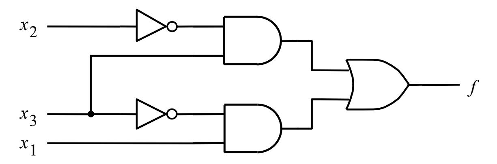

An implementation of a SOP using basic gates always has the following sequence of layers

- A layer of NOT gates to implement input complements, then
- A layer of AND gates to implement products (or minterms if canonical SOP), and then
- An OR gate for logical sum of products

| 𝑥𝑥 1 | 𝑥𝑥 2 | 𝑥𝑥 3 | 𝑓𝑓 |
|---------|---------|---------|----|
| 0       | 0       | 0       | 0  |
| 0       | 0       | 1       | 1  |
| 0       | 1       | 0       | 0  |
| 0       | 1       | 1       | 0  |
| 1       | 0       | 0       | 1  |
| 1       | 0       | 1       | 1  |
| 1       | 1       | 0       | 1  |
| 1       | 1       | 1       | 0  |

From the truth table, note that

$$f' = m_0 + m_2 + m_3 + m_7$$
 i.e., 
$$f = (m_0 + m_2 + m_3 + m_7)' \tag{2}$$

Expression (2) is not a canonical SOP due to the complement operation at the end, but gives the same value as expression (1), i.e.,

$$f = m_1 + m_4 + m_5 + m_6$$
  
=  $(m_0 + m_2 + m_3 + m_7)'$  (3)

# Canonical Product-of-Sums

- Given a truth table, it is always possible to write a logic expression for the function by taking logical AND of the maxterms for which the function has a value of 0
- This representation of a function is a logical product of maxterms and called *canonical product-of-sums* (POS)
- To be called canonical POS, a logical expression must have maxterms only

# Canonical Product-of-Sums (contd.)

Example: Assume that we are given the following truth table (same as before). Then the canonical POS representation of the function is

| 𝑥𝑥 1 | 𝑥𝑥 2 | 𝑥𝑥 3 | 𝑓𝑓                                                                                          |
|---------|---------|---------|---------------------------------------------------------------------------------------------|
| 0       | 0       | 0       | 𝑓𝑓 = 𝑀𝑀 � 𝑀𝑀 � 𝑀𝑀 � 𝑀𝑀 0 2 3 7 0                     |
| 0       | 0       | 1       | 1                                                                                           |
| 0       | 1       | 0       | 0                                                                                           |
| 0       | 1       | 1       | 0                                                                                           |
| 1       | 0       | 0       | 1                                                                                           |
| 1       | 0       | 1       | 𝑓𝑓 = Π 𝑀𝑀 , 𝑀𝑀 , 𝑀𝑀 , 𝑀𝑀 0 2 3 7 1 (for short) |
| 1       | 1       | 0       | 𝑓𝑓 = Π(0, 2, 3, 7) 1                                                      |
| 1       | 1       | 1       | 0                                                                                           |

# Canonical Product-of-Sums (contd.)

- Like its counterpart, the canonical POS is not necessarily the lowest cost implementation of the function
- From the previous example,

$$f = M_0 \cdot M_2 \cdot M_3 \cdot M_7$$
  
=  $(x_1 + x_2 + x_3)(x_1 + x'_2 + x_3)(x_1 + x'_2 + x'_3)(x'_1 + x'_2 + x'_3)$   
(canonical)

To apply algebraic manipulation, note that

$$f = (x_1 + x_3 + x_2)(x_1 + x_3 + x_2')(x_1 + x_2' + x_3')(x_1' + x_2' + x_3')$$

Using 
$$(x + y)(x + y') = x$$
 as given in the textbook,  
 $f = (x_1+x_3)(x'_2+x'_3)$   
(not canonical POS, but has a lower cost)

# Canonical Product-of-Sums (contd.)

Implementation of the previous expression of using basic logic gates:

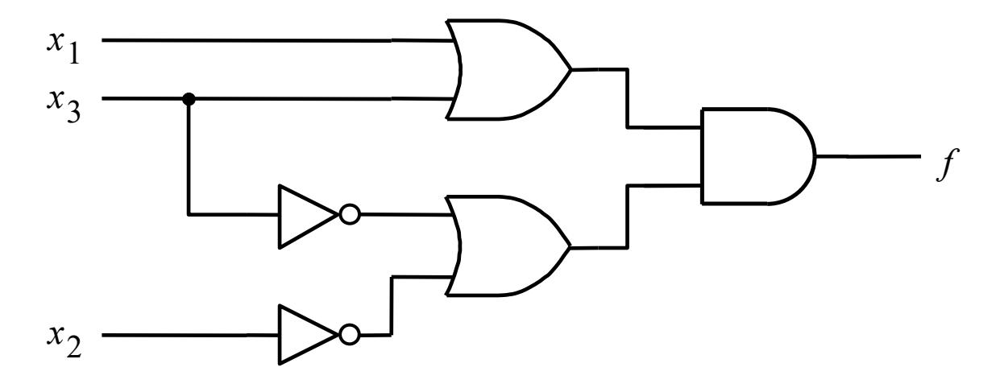

An implementation of a POS using basic gates always has the following sequence of layers

- A layer of NOT gates to implement input complements, then
- A layer of OR gates to implement sums (or maxterms if canonical POS), and then
- An AND gate for logical product of sums

#### ECE 124 – Digital Circuits and Systems Dept. of ECE, Univ. of Waterloo

Lecture Slides: **Set 2 - Part 2**

#### Contents:

• Synthesis using NAND and NOR gates

©2014-2026 M. A. Hasan. These slides and notes are for the exclusive use of the students registered in the course. Reproduction in any form or use for any other purposes is prohibited.

# Synthesis using NAND and NOR gates

- We can always implement a binary logical function using NOT, AND and OR gates only
- However, there other types of gates that prove useful
- Examples include NAND and NOR
- A NAND gate realizes a NOT-AND operation, i.e., AND *followed* by NOT operation
- A NOR gate realizes a NOT-OR operation, i.e., OR *followed* by NOT operation
- In some technologies, fewer transistors are required for NAND than AND, and similarly fewer transistors for NOR than OR

# **Symbols and truth tables of NAND and NOR**

• NAND gate symbol and truth table:

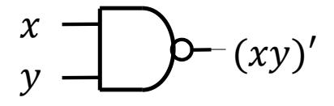

• NOR gate symbol and truth table:

$$x \longrightarrow (x + y)'$$

| 𝑥𝑥 | 𝑦𝑦 | (𝑥𝑥 )′ |
|----|----|-----------|
| 0  | 0  | 1         |
| 0  | 1  | 1         |
| 1  | 0  | 1         |
| 1  | 1  | 0         |

| 𝑥𝑥 | 𝑦𝑦 | (𝑥𝑥 + 𝑦𝑦)′ |
|----|----|------------------|
| 0  | 0  | 1                |
| 0  | 1  | 0                |
| 1  | 0  | 0                |
| 1  | 1  | 0                |

#### Symbols of n-input NAND and NOR gates

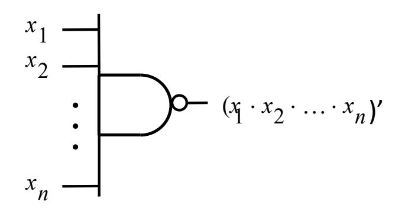

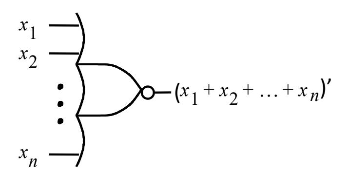

# **Equivalency**

$$x_1 \longrightarrow x_2 \longrightarrow x_2 \longrightarrow x_2 \longrightarrow x_2 \longrightarrow x_2 \longrightarrow x_2 \longrightarrow x_2 \longrightarrow x_2 \longrightarrow x_2 \longrightarrow x_2 \longrightarrow x_2 \longrightarrow x_2 \longrightarrow x_2 \longrightarrow x_2 \longrightarrow x_2 \longrightarrow x_2 \longrightarrow x_2 \longrightarrow x_2 \longrightarrow x_2 \longrightarrow x_2 \longrightarrow x_2 \longrightarrow x_2 \longrightarrow x_2 \longrightarrow x_2 \longrightarrow x_2 \longrightarrow x_2 \longrightarrow x_2 \longrightarrow x_2 \longrightarrow x_2 \longrightarrow x_2 \longrightarrow x_2 \longrightarrow x_2 \longrightarrow x_2 \longrightarrow x_2 \longrightarrow x_2 \longrightarrow x_2 \longrightarrow x_2 \longrightarrow x_2 \longrightarrow x_2 \longrightarrow x_2 \longrightarrow x_2 \longrightarrow x_2 \longrightarrow x_2 \longrightarrow x_2 \longrightarrow x_2 \longrightarrow x_2 \longrightarrow x_2 \longrightarrow x_2 \longrightarrow x_2 \longrightarrow x_2 \longrightarrow x_2 \longrightarrow x_2 \longrightarrow x_2 \longrightarrow x_2 \longrightarrow x_2 \longrightarrow x_2 \longrightarrow x_2 \longrightarrow x_2 \longrightarrow x_2 \longrightarrow x_2 \longrightarrow x_2 \longrightarrow x_2 \longrightarrow x_2 \longrightarrow x_2 \longrightarrow x_2 \longrightarrow x_2 \longrightarrow x_2 \longrightarrow x_2 \longrightarrow x_2 \longrightarrow x_2 \longrightarrow x_2 \longrightarrow x_2 \longrightarrow x_2 \longrightarrow x_2 \longrightarrow x_2 \longrightarrow x_2 \longrightarrow x_2 \longrightarrow x_2 \longrightarrow x_2 \longrightarrow x_2 \longrightarrow x_2 \longrightarrow x_2 \longrightarrow x_2 \longrightarrow x_2 \longrightarrow x_2 \longrightarrow x_2 \longrightarrow x_2 \longrightarrow x_2 \longrightarrow x_2 \longrightarrow x_2 \longrightarrow x_2 \longrightarrow x_2 \longrightarrow x_2 \longrightarrow x_2 \longrightarrow x_2 \longrightarrow x_2 \longrightarrow x_2 \longrightarrow x_2 \longrightarrow x_2 \longrightarrow x_2 \longrightarrow x_2 \longrightarrow x_2 \longrightarrow x_2 \longrightarrow x_2 \longrightarrow x_2 \longrightarrow x_2 \longrightarrow x_2 \longrightarrow x_2 \longrightarrow x_2 \longrightarrow x_2 \longrightarrow x_2 \longrightarrow x_2 \longrightarrow x_2 \longrightarrow x_2 \longrightarrow x_2 \longrightarrow x_2 \longrightarrow x_2 \longrightarrow x_2 \longrightarrow x_2 \longrightarrow x_2 \longrightarrow x_2 \longrightarrow x_2 \longrightarrow x_2 \longrightarrow x_2 \longrightarrow x_2 \longrightarrow x_2 \longrightarrow x_2 \longrightarrow x_2 \longrightarrow x_2 \longrightarrow x_2 \longrightarrow x_2 \longrightarrow x_2 \longrightarrow x_2 \longrightarrow x_2 \longrightarrow x_2 \longrightarrow x_2 \longrightarrow x_2 \longrightarrow x_2 \longrightarrow x_2 \longrightarrow x_2 \longrightarrow x_2 \longrightarrow x_2 \longrightarrow x_2 \longrightarrow x_2 \longrightarrow x_2 \longrightarrow x_2 \longrightarrow x_2 \longrightarrow x_2 \longrightarrow x_2 \longrightarrow x_2 \longrightarrow x_2 \longrightarrow x_2 \longrightarrow x_2 \longrightarrow x_2 \longrightarrow x_2 \longrightarrow x_2 \longrightarrow x_2 \longrightarrow x_2 \longrightarrow x_2 \longrightarrow x_2 \longrightarrow x_2 \longrightarrow x_2 \longrightarrow x_2 \longrightarrow x_2 \longrightarrow x_2 \longrightarrow x_2 \longrightarrow x_2 \longrightarrow x_2 \longrightarrow x_2 \longrightarrow x_2 \longrightarrow x_2 \longrightarrow x_2 \longrightarrow x_2 \longrightarrow x_2 \longrightarrow x_2 \longrightarrow x_2 \longrightarrow x_2 \longrightarrow x_2 \longrightarrow x_2 \longrightarrow x_2 \longrightarrow x_2 \longrightarrow x_2 \longrightarrow x_2 \longrightarrow x_2 \longrightarrow x_2 \longrightarrow x_2 \longrightarrow x_2 \longrightarrow x_2 \longrightarrow x_2 \longrightarrow x_2 \longrightarrow x_2 \longrightarrow x_2 \longrightarrow x_2 \longrightarrow x_2 \longrightarrow x_2 \longrightarrow x_2 \longrightarrow x_2 \longrightarrow x_2 \longrightarrow x_2 \longrightarrow x_2 \longrightarrow x_2 \longrightarrow x_2 \longrightarrow x_2 \longrightarrow x_2 \longrightarrow x_2 \longrightarrow x_2 \longrightarrow x_2 \longrightarrow x_2 \longrightarrow x_2 \longrightarrow x_2 \longrightarrow x_2 \longrightarrow x_2 \longrightarrow x_2 \longrightarrow x_2 \longrightarrow x_2 \longrightarrow x_2 \longrightarrow x_2 \longrightarrow x_2 \longrightarrow x_2 \longrightarrow x_2 \longrightarrow x_2 \longrightarrow x_2 \longrightarrow x_2 \longrightarrow x_2 \longrightarrow x_2 \longrightarrow x_2 \longrightarrow x_2 \longrightarrow x_2 \longrightarrow x_2 \longrightarrow x_2 \longrightarrow x_2 \longrightarrow x_2 \longrightarrow x_2 \longrightarrow x_2 \longrightarrow x_2 \longrightarrow x_2 \longrightarrow x_2 \longrightarrow x_2 \longrightarrow x_2 \longrightarrow x_2 \longrightarrow x_2 \longrightarrow x_2 \longrightarrow x_2 \longrightarrow x_2 \longrightarrow x_2 \longrightarrow x_2 \longrightarrow x_2 \longrightarrow x_2 \longrightarrow x_2 \longrightarrow x_2 \longrightarrow x_2 \longrightarrow x_2 \longrightarrow x_2 \longrightarrow x_2 \longrightarrow x_2 \longrightarrow x_2 \longrightarrow x_2 \longrightarrow x_2 \longrightarrow x_2 \longrightarrow x_2 \longrightarrow x_2 \longrightarrow x_2 \longrightarrow x_2 \longrightarrow x_2 \longrightarrow x_2 \longrightarrow x_2 \longrightarrow x_2 \longrightarrow x_2 \longrightarrow x_2 \longrightarrow x_2 \longrightarrow x_2 \longrightarrow x_2 \longrightarrow x_2 \longrightarrow x_2 \longrightarrow x_2 \longrightarrow x_2 \longrightarrow x_2 \longrightarrow x_2 \longrightarrow x_2 \longrightarrow x_2 \longrightarrow x_2 \longrightarrow x_2 \longrightarrow x_2 \longrightarrow x_2 \longrightarrow x_2 \longrightarrow x_2 \longrightarrow x_2 \longrightarrow x_2 \longrightarrow x_2 \longrightarrow x_2 \longrightarrow x_2 \longrightarrow x_2 \longrightarrow x_2 \longrightarrow x_2 \longrightarrow x_2 \longrightarrow x_2 \longrightarrow x_2 \longrightarrow x_2 \longrightarrow x_2 \longrightarrow x_2 \longrightarrow x_2 \longrightarrow x_2 \longrightarrow x_2 \longrightarrow x_2 \longrightarrow x_2 \longrightarrow x_2 \longrightarrow x_2 \longrightarrow x_2 \longrightarrow x_2 \longrightarrow x_2 \longrightarrow x_2 \longrightarrow x_2 \longrightarrow x_2 \longrightarrow x_2 \longrightarrow x_2 \longrightarrow x_2 \longrightarrow x_2 \longrightarrow x_2 \longrightarrow x_2 \longrightarrow x_2 \longrightarrow x_2 \longrightarrow x_2 \longrightarrow x_2 \longrightarrow x_2 \longrightarrow x_2 \longrightarrow x_2 \longrightarrow x_2 \longrightarrow x_2 \longrightarrow x_2 \longrightarrow x_2 \longrightarrow x_2 \longrightarrow x_2 \longrightarrow x_2 \longrightarrow x_2 \longrightarrow x_2 \longrightarrow x_2 \longrightarrow x_2 \longrightarrow x_2 \longrightarrow x_2 \longrightarrow x_2$$

$$x_1 \longrightarrow x_2 \longrightarrow x_1 \longrightarrow x_2 \longrightarrow x_2 \longrightarrow x_2 \longrightarrow x_2 \longrightarrow x_2 \longrightarrow x_2 \longrightarrow x_2 \longrightarrow x_2 \longrightarrow x_2 \longrightarrow x_2 \longrightarrow x_2 \longrightarrow x_2 \longrightarrow x_2 \longrightarrow x_2 \longrightarrow x_2 \longrightarrow x_2 \longrightarrow x_2 \longrightarrow x_2 \longrightarrow x_2 \longrightarrow x_2 \longrightarrow x_2 \longrightarrow x_2 \longrightarrow x_2 \longrightarrow x_2 \longrightarrow x_2 \longrightarrow x_2 \longrightarrow x_2 \longrightarrow x_2 \longrightarrow x_2 \longrightarrow x_2 \longrightarrow x_2 \longrightarrow x_2 \longrightarrow x_2 \longrightarrow x_2 \longrightarrow x_2 \longrightarrow x_2 \longrightarrow x_2 \longrightarrow x_2 \longrightarrow x_2 \longrightarrow x_2 \longrightarrow x_2 \longrightarrow x_2 \longrightarrow x_2 \longrightarrow x_2 \longrightarrow x_2 \longrightarrow x_2 \longrightarrow x_2 \longrightarrow x_2 \longrightarrow x_2 \longrightarrow x_2 \longrightarrow x_2 \longrightarrow x_2 \longrightarrow x_2 \longrightarrow x_2 \longrightarrow x_2 \longrightarrow x_2 \longrightarrow x_2 \longrightarrow x_2 \longrightarrow x_2 \longrightarrow x_2 \longrightarrow x_2 \longrightarrow x_2 \longrightarrow x_2 \longrightarrow x_2 \longrightarrow x_2 \longrightarrow x_2 \longrightarrow x_2 \longrightarrow x_2 \longrightarrow x_2 \longrightarrow x_2 \longrightarrow x_2 \longrightarrow x_2 \longrightarrow x_2 \longrightarrow x_2 \longrightarrow x_2 \longrightarrow x_2 \longrightarrow x_2 \longrightarrow x_2 \longrightarrow x_2 \longrightarrow x_2 \longrightarrow x_2 \longrightarrow x_2 \longrightarrow x_2 \longrightarrow x_2 \longrightarrow x_2 \longrightarrow x_2 \longrightarrow x_2 \longrightarrow x_2 \longrightarrow x_2 \longrightarrow x_2 \longrightarrow x_2 \longrightarrow x_2 \longrightarrow x_2 \longrightarrow x_2 \longrightarrow x_2 \longrightarrow x_2 \longrightarrow x_2 \longrightarrow x_2 \longrightarrow x_2 \longrightarrow x_2 \longrightarrow x_2 \longrightarrow x_2 \longrightarrow x_2 \longrightarrow x_2 \longrightarrow x_2 \longrightarrow x_2 \longrightarrow x_2 \longrightarrow x_2 \longrightarrow x_2 \longrightarrow x_2 \longrightarrow x_2 \longrightarrow x_2 \longrightarrow x_2 \longrightarrow x_2 \longrightarrow x_2 \longrightarrow x_2 \longrightarrow x_2 \longrightarrow x_2 \longrightarrow x_2 \longrightarrow x_2 \longrightarrow x_2 \longrightarrow x_2 \longrightarrow x_2 \longrightarrow x_2 \longrightarrow x_2 \longrightarrow x_2 \longrightarrow x_2 \longrightarrow x_2 \longrightarrow x_2 \longrightarrow x_2 \longrightarrow x_2 \longrightarrow x_2 \longrightarrow x_2 \longrightarrow x_2 \longrightarrow x_2 \longrightarrow x_2 \longrightarrow x_2 \longrightarrow x_2 \longrightarrow x_2 \longrightarrow x_2 \longrightarrow x_2 \longrightarrow x_2 \longrightarrow x_2 \longrightarrow x_2 \longrightarrow x_2 \longrightarrow x_2 \longrightarrow x_2 \longrightarrow x_2 \longrightarrow x_2 \longrightarrow x_2 \longrightarrow x_2 \longrightarrow x_2 \longrightarrow x_2 \longrightarrow x_2 \longrightarrow x_2 \longrightarrow x_2 \longrightarrow x_2 \longrightarrow x_2 \longrightarrow x_2 \longrightarrow x_2 \longrightarrow x_2 \longrightarrow x_2 \longrightarrow x_2 \longrightarrow x_2 \longrightarrow x_2 \longrightarrow x_2 \longrightarrow x_2 \longrightarrow x_2 \longrightarrow x_2 \longrightarrow x_2 \longrightarrow x_2 \longrightarrow x_2 \longrightarrow x_2 \longrightarrow x_2 \longrightarrow x_2 \longrightarrow x_2 \longrightarrow x_2 \longrightarrow x_2 \longrightarrow x_2 \longrightarrow x_2 \longrightarrow x_2 \longrightarrow x_2 \longrightarrow x_2 \longrightarrow x_2 \longrightarrow x_2 \longrightarrow x_2 \longrightarrow x_2 \longrightarrow x_2 \longrightarrow x_2 \longrightarrow x_2 \longrightarrow x_2 \longrightarrow x_2 \longrightarrow x_2 \longrightarrow x_2 \longrightarrow x_2 \longrightarrow x_2 \longrightarrow x_2 \longrightarrow x_2 \longrightarrow x_2 \longrightarrow x_2 \longrightarrow x_2 \longrightarrow x_2 \longrightarrow x_2 \longrightarrow x_2 \longrightarrow x_2 \longrightarrow x_2 \longrightarrow x_2 \longrightarrow x_2 \longrightarrow x_2 \longrightarrow x_2 \longrightarrow x_2 \longrightarrow x_2 \longrightarrow x_2 \longrightarrow x_2 \longrightarrow x_2 \longrightarrow x_2 \longrightarrow x_2 \longrightarrow x_2 \longrightarrow x_2 \longrightarrow x_2 \longrightarrow x_2 \longrightarrow x_2 \longrightarrow x_2 \longrightarrow x_2 \longrightarrow x_2 \longrightarrow x_2 \longrightarrow x_2 \longrightarrow x_2 \longrightarrow x_2 \longrightarrow x_2 \longrightarrow x_2 \longrightarrow x_2 \longrightarrow x_2 \longrightarrow x_2 \longrightarrow x_2 \longrightarrow x_2 \longrightarrow x_2 \longrightarrow x_2 \longrightarrow x_2 \longrightarrow x_2 \longrightarrow x_2 \longrightarrow x_2 \longrightarrow x_2 \longrightarrow x_2 \longrightarrow x_2 \longrightarrow x_2 \longrightarrow x_2 \longrightarrow x_2 \longrightarrow x_2 \longrightarrow x_2 \longrightarrow x_2 \longrightarrow x_2 \longrightarrow x_2 \longrightarrow x_2 \longrightarrow x_2 \longrightarrow x_2 \longrightarrow x_2 \longrightarrow x_2 \longrightarrow x_2 \longrightarrow x_2 \longrightarrow x_2 \longrightarrow x_2 \longrightarrow x_2 \longrightarrow x_2 \longrightarrow x_2 \longrightarrow x_2 \longrightarrow x_2 \longrightarrow x_2 \longrightarrow x_2 \longrightarrow x_2 \longrightarrow x_2 \longrightarrow x_2 \longrightarrow x_2 \longrightarrow x_2 \longrightarrow x_2 \longrightarrow x_2 \longrightarrow x_2 \longrightarrow x_2 \longrightarrow x_2 \longrightarrow x_2 \longrightarrow x_2 \longrightarrow x_2 \longrightarrow x_2 \longrightarrow x_2 \longrightarrow x_2 \longrightarrow x_2 \longrightarrow x_2 \longrightarrow x_2 \longrightarrow x_2 \longrightarrow x_2 \longrightarrow x_2 \longrightarrow x_2 \longrightarrow x_2 \longrightarrow x_2 \longrightarrow x_2 \longrightarrow x_2 \longrightarrow x_2 \longrightarrow x_2 \longrightarrow x_2 \longrightarrow x_2 \longrightarrow x_2 \longrightarrow x_2 \longrightarrow x_2 \longrightarrow x_2 \longrightarrow x_2 \longrightarrow x_2 \longrightarrow x_2 \longrightarrow x_2 \longrightarrow x_2 \longrightarrow x_2 \longrightarrow x_2 \longrightarrow x_2 \longrightarrow x_2 \longrightarrow x_2 \longrightarrow x_2 \longrightarrow x_2 \longrightarrow x_2 \longrightarrow x_2 \longrightarrow x_2 \longrightarrow x_2 \longrightarrow x_2 \longrightarrow x_2 \longrightarrow x_2 \longrightarrow x_2 \longrightarrow x_2 \longrightarrow x_2 \longrightarrow x_2 \longrightarrow x_2 \longrightarrow x_2 \longrightarrow x_2 \longrightarrow x_2 \longrightarrow x_2 \longrightarrow x_2 \longrightarrow x_2 \longrightarrow x_2 \longrightarrow x_2 \longrightarrow x_2 \longrightarrow x_2$$

# **SOP implementation using NAND**

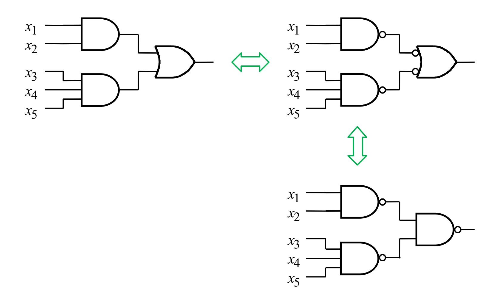

# **SOP implementation using NAND (contd.)**

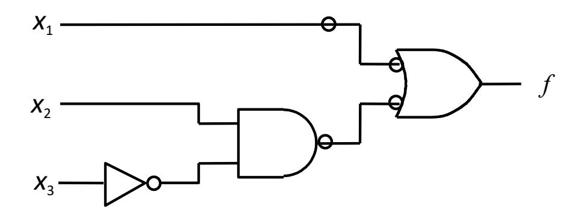

SOP implementation

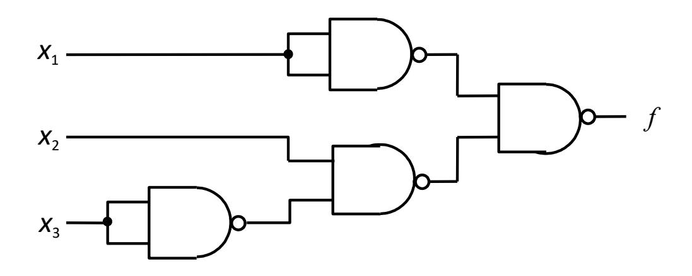

NAND implementation

# **POS implementation using NOR**

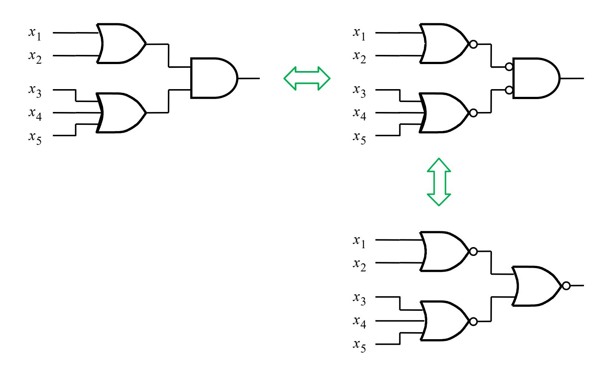

# **POS implementation using NOR (contd.)**

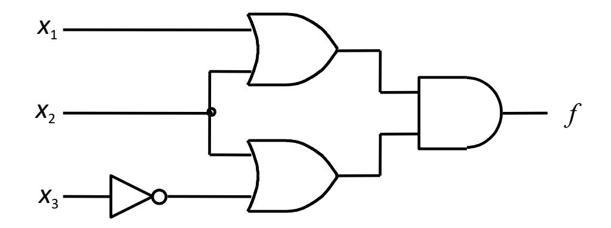

POS implementation

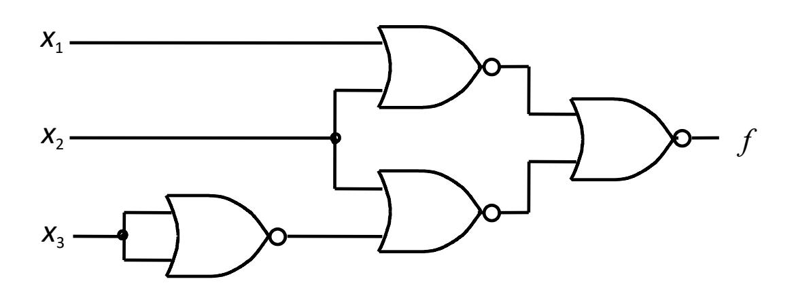

NOR implementation

#### ECE 124 – Digital Circuits and Systems Dept. of ECE, Univ. of Waterloo

Lecture Slides: **Set 2 - Part 3**

#### Contents:

• Hardware Basics

©2014-2026 M. A. Hasan. These slides and notes are for the exclusive use of the students registered in the course. Reproduction in any form or use for any other purposes is prohibited.

# Some basics

- How can binary logic values be represented in electronic circuits?
  - The two logic values can be represented as voltage levels below and above a predefined level known as *threshold*
  - In a *positive logic system*, voltage levels lower (resp. higher) than the threshold represent logic 0 (resp. 1); see the left diagram below
  - A negative logic system is just the opposite
  - In practice, voltage ranges for logic values are separated by a 'noise' margin (shown below as undefined range) for increased reliability

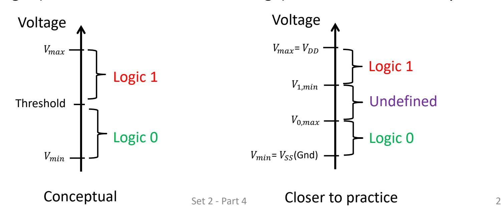

- What is the effect of applying a logic 0 (resp. 1)?
  - Logic 0 opens a switch and logic 1 closes a switch
  - Below is a simple switch controlled by values of input

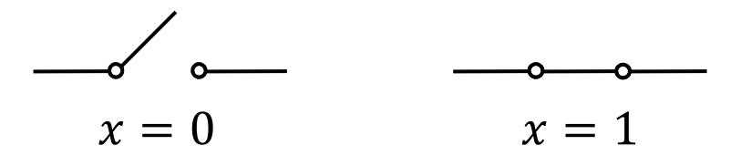

- How is such a switch implemented in electronic circuits?
  - Transistors are used as switches
  - Shown below (left) is the symbol of a transistor. One end (*Source*) of the transistor is connected to the ground (i.e., 0 volt); the voltage levels of the other two ends (*Gate* and *Drain*) are labelled as  $V_G$  and  $V_D$
  - When  $V_G$ =0 volt (resp.  $V_{DD}$  volt), the transistor is off (resp. on) and acts as an open (resp. closed) switch
  - Recall that 0 volt (resp.  $V_{DD}$  volt) corresponds to logic 0 (resp. 1)

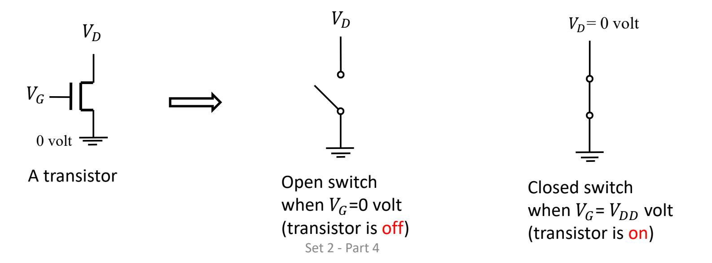

- How are transistors used to implement logic gates?
  - An example NOT gate using two transistors ( $T_1$  and  $T_2$ ) is shown below.  $V_x$  and  $V_f$  are voltage levels for input x and output f, respectively. Transistor states and output values for inputs 0 and 1 are shown in the truth table.
  - Other types of logic gates can be constructed using such transistors (see the next slide for a NAND gate)

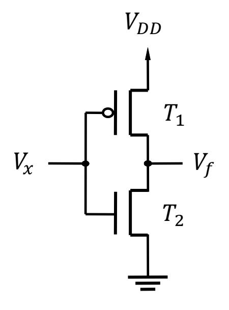

| x | $T_1$ $T_2$ | f |
|---|-------------|---|
| 0 | on off      | 1 |
| 1 | off on      | 0 |

Truth table and transistor states

NOT gate using two transistors

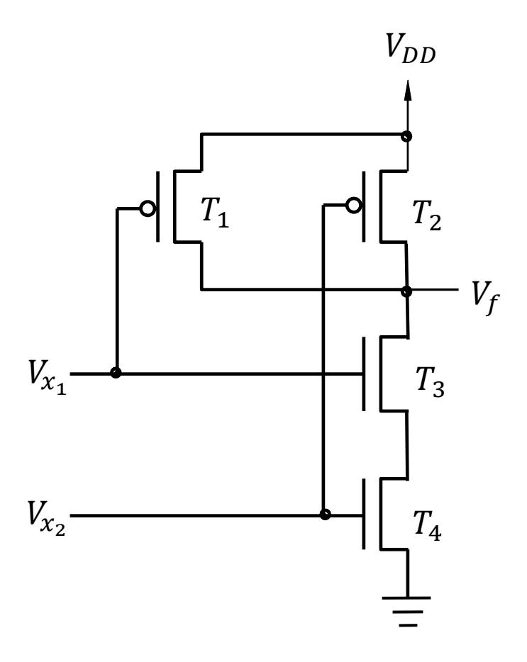

| 𝑥𝑥 𝑥𝑥 1 2 | 𝑇𝑇 𝑇𝑇 𝑇𝑇 𝑇𝑇 4 1 3 2 | 𝑓𝑓 |
|--------------------|------------------------------------------|----|
| 0 0             | on on off off                   | 1  |
| 1 0             | on off off on                   | 1  |
| 1 0             | off on on off                   | 1  |
| 1 1             | off off on on                   | 0  |

NAND gate circuit Truth table and transistor states

- What are other types of gates (in addition to NOT, AND, OR, NAND & NOR) we will consider in this course?
  - Buffer, XOR and XNOR (XOR then NOT). Their symbols and truth tables follow

Buffer

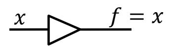

 0 1

XOR

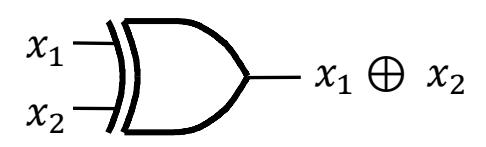

| 𝑥𝑥 1 | 𝑥𝑥 2 | 𝑥𝑥 ⊕ 𝑥𝑥 1 2 |
|---------|---------|-------------------------|
| 0       | 0       | 0                       |
| 0       | 1       | 1                       |
| 1       | 0       | 1                       |
| 1       | 1       | 0                       |

XNOR

$$x_1$$
  $x_2$   $(x_1 \oplus x_2)'$ 

| 𝑥𝑥 1 | 𝑥𝑥 2 | (𝑥𝑥 ⊕ 𝑥𝑥 )′ 1 2 |
|---------|---------|--------------------------------|
| 0       | 0       | 1                              |
| 0       | 1       | 0                              |
| 1       | 0       | 0                              |
| 1       | 1       | 1                              |

- From the truth table of XOR in the previous slide, note that 1 ⊕ 2 = 0 when an even number of inputs is 1, otherwise 1 ⊕ 2 = 1
- The above logic applies to XOR gates with more than two inputs. For example, for a 3-input XOR gate 1 ⊕ 2 ⊕ 3 = 0 when an even number of inputs is 1, otherwise 1 ⊕ 2 ⊕ 3 = 1
- Yours to do: construct the truth table for a 3-input XOR gate

#### • What is a tri-state buffer?

- A tri-state buffer has one input , one output , and a control input .
- If = 1, then = . On the other hand, if = 0, then the output is in highimpedance state (also called logic Z – third state)
- Symbol, equivalent circuits and truth table of the tri-state buffer follow

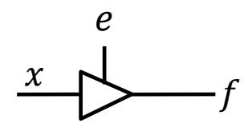

| 𝑒𝑒 | 𝑥𝑥 | 𝑓𝑓 |
|----|----|----|
| 0  | 0  | Z  |
| 0  | 1  | Z  |
| 1  | 0  | 0  |
| 1  | 1  | 1  |

$$e = 0$$

$$x \longrightarrow f = Z$$

$$x -$$

#### ECE 124 – Digital Circuits and Systems Dept. of ECE, Univ. of Waterloo

Lecture Slides: **Set 2 - Part 4**

#### Contents:

• Implementation Technologies

©2014-2026 M. A. Hasan. These slides and notes are for the exclusive use of the students registered in the course. Reproduction in any form or use for any other purposes is prohibited.

# Implementation technologies – standard chips

- The7400-series of chips is available in different types of logic gates. Below is the structural diagram of the 7404 chip containing six NOT gates
- Function provided by a 7400-series chip is fixed and cannot be changed

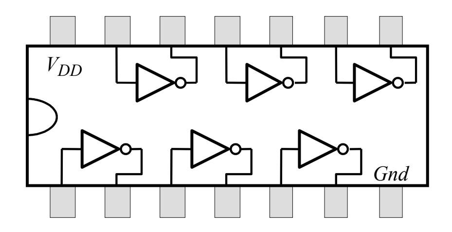

Structure of 7404 chip

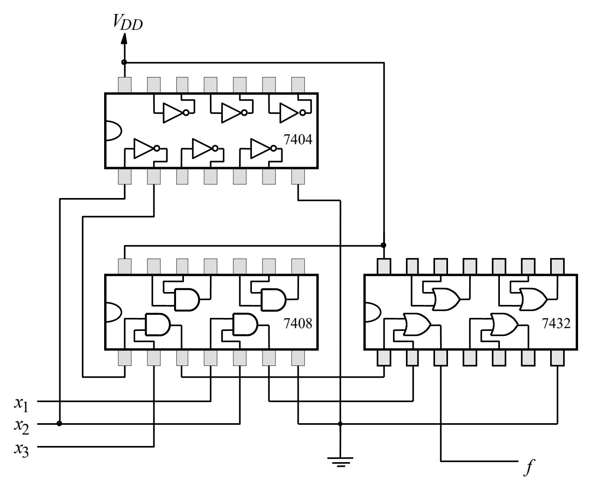

An implementation of  $f = x_1x_2 + x_2'x_3$  using three 7400-series chips

# Implementation tech. – programmable logic devices

- Standard chips (like 7400-series) have fixed devices
- Several programmable logic devices (PLD) exist, e.g.,
  - ₋ programmable logic arrays (PLA),
  - ₋ programmable array logic (PAL),
  - ₋ field-programmable gate arrays (FPGA)
- All PLDs are pre-fabricated, but allow users configure (i.e., program) the device

# Implementation technologies – PLA & PAL

The structure of PLA includes an array of AND gates and an array of OR gates (called AND and OR planes). The structure is shown below.

- In PLA, connections to AND and OR gates can be programmed.
- In PAL, only AND gates can be programmed (OR gate connections are fixed)

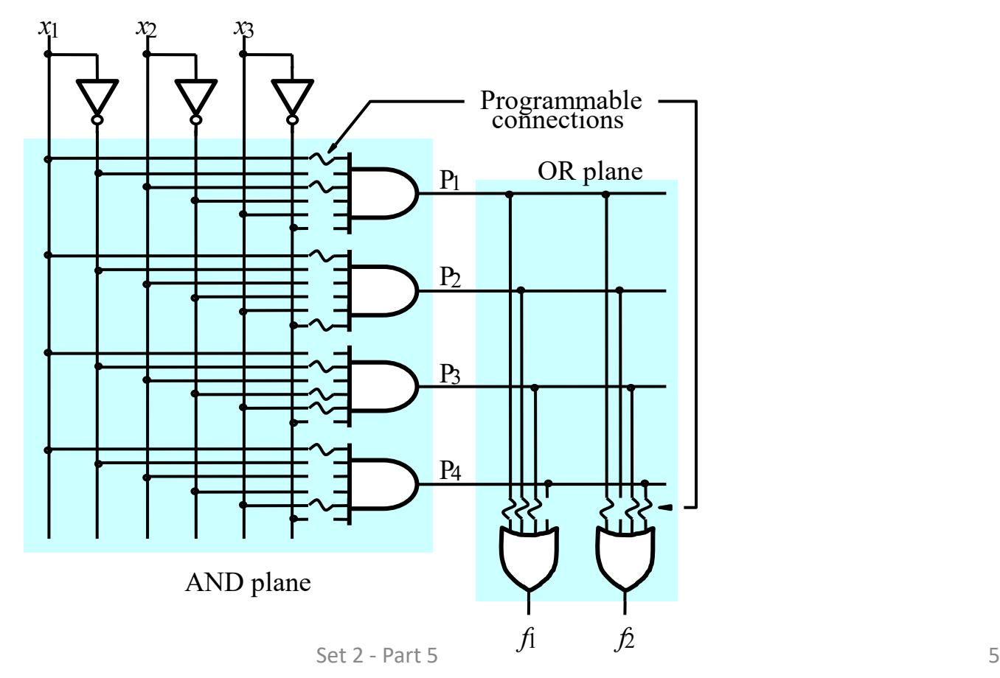

# Implementation technologies - FPGA

Unlike PLA, an FPGA does not have AND/OR gates already fabricated

- The general structure of an FPGA is shown below and it includes
  - Logic blocks (each of which can be programmed to behave like a gate)
  - I/O pads for connecting to the package pins
  - Routing channel or interconnection wires and switches

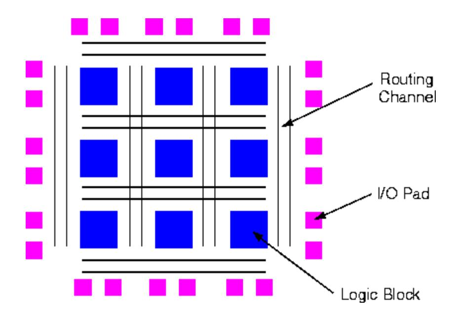

# Implementation technologies – FPGA (contd.)

The most commonly used logic block is a lookup table (LUT), which contains storage cells that are used to implement a small logic function. Below is an

example

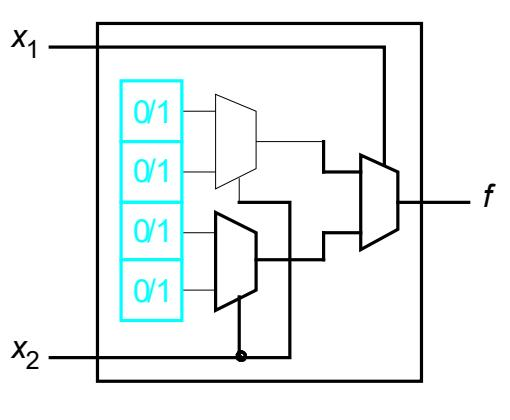

| (a) Circuit for a two-input LUT |  |
|---------------------------------|--|
|---------------------------------|--|

| x 1 | x 2 | f 1 |
|--------|--------|--------|
| 0      | 0      | 1      |
| 0      | 1      | 0      |
| 1      | 0      | 0      |
| 1      | 1      | 1      |

(b) 
$$f_1 = \bar{x}_1 \bar{x}_2 + x_1 x_2$$

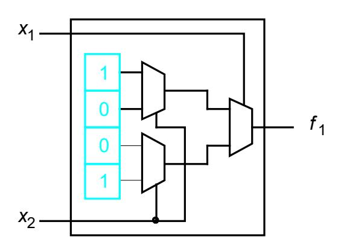

(c) Storage cell contents in the LUT

#### Implementation technologies – Standard cells & custom chips

#### • Standard cells

- ₋ Pre-designed standard cells of logic gates are placed in rows and connected by wires through routing channels to create circuits (called application specific integrated circuits – ASIC). See below
- ₋ ASIC designs require fabrication and does not have programmable switches

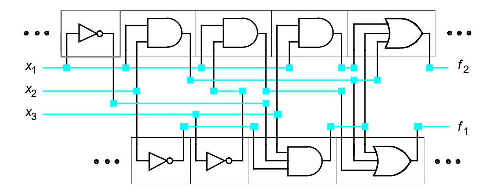

• Custom chips: These are created from scratch and provide most circuit density, highest speed, lowest power. It's suitable for large volume manufacturing. Set 2 - Part 5 8