#### ECE 124 – Digital Circuits and Systems Dept. of ECE, Univ. of Waterloo

Lecture Slides: **Set 3 - Part 1**

#### Contents:

• The Gray code

©2014-2026 M. A. Hasan. These slides and notes are for the exclusive use of the students registered in the course. Reproduction in any form or use for any other purposes is prohibited.

# Gray code

The Gray code is a binary numeral system where two successive values differ in only one bit. It is also known as the reflected binary code.

| 1-bit Gray code | 3-bit Gray code |
|-----------------|-----------------|
| 0               | 000             |
| 1               | 001             |
|                 | 011             |
|                 | 010             |
| 2-bit Gray code | 110             |
| 00              | 111             |
| 01              | 101             |
| 11              | 100             |
| 10              |                 |

# Gray code (contd.)

Given -bit Gray code, it is easy to write ( + 1)-bit Gray code.

Let = 2, then you can get 3-bit Gray code as follows:

- 1. First write down the 2-bit Gray code (see the code in red at right)
- 2. Then write down the reflected code (shown in green)
- 3. Put a '0' at the beginning of each 2-bit Gray code and a '1' at the beginning of each reflected code

# Gray code based simplification

| 𝑥𝑥 1 | 𝑥𝑥 2 | 𝑓𝑓                                                                      |
|---------|---------|-------------------------------------------------------------------------|
| 0       | 0       | 1 If the function had these two '1's only, then                      |
| 0       | 1       | 𝑓𝑓=𝑥𝑥𝑥 (since 𝑥𝑥 has no effect when 𝑥𝑥 =0) 1 1 2 1 |
| 1       | 0       | 0                                                                       |
| 1       | 1       | This '1' implies that 𝑓𝑓 should also have 𝑥𝑥 1 𝑥𝑥 1 2    |

Thus =1 + 12 covers all three '1's for the function (and is simpler than canonical SOP: = 12 + 1 2 +1 2)

# Gray code based simplification (contd.)

| 𝑥𝑥 1 | 𝑥𝑥 2 | 𝑓𝑓 |  |
|---------|---------|----|--|
| 0       | 0       | 1  |  |
| 0       | 1       | 1  |  |
| 1       | 1       | 1  |  |
| 1       | 0       | 0  |  |

If the function had these two '1's only, then =1 (since 2 has no effect when 1=0)

If the function had these two '1's only, then =2 (since 1 has no effect when 2=1)

Same truth table, but rearranged input using Gray code

Thus =1+ 2 covers all three '1's for the function. (This is 'simplest')

# Gray code based simplification (contd.)

### Notes:

- For > 2, it is difficult to take advantage of the Gray code when the function is represented using truth table. This is because input patterns that differ in only 1 position (e.g., 001 and 101) can be far apart in the truth table.
- This challenge is addressed for n up to 5 by using K-maps (to be discussed next)

#### ECE 124 – Digital Circuits and Systems Dept. of ECE, Univ. of Waterloo

Lecture Slides: **Set 3 - Part 2**

#### Contents:

• Karnaugh maps for 2- and 3-variable functions

©2014-2026 M. A. Hasan. These slides and notes are for the exclusive use of the students registered in the course. Reproduction in any form or use for any other purposes is prohibited.

# Introduction to Karnaugh maps

- Simplification of logic expressions using Boolean algebra is not very systematic
- An alternative approach is to use Karnaugh maps (for functions of up to 5 variables)
- A Karnaugh map (K-map) is an alternative representation of a truth table
- K-maps use the Gray code

# Introduction to Karnaugh maps (contd.)

- A K-map contains all the same information as a truth table, but in a different form:
  - While a truth table is "tabular", the K-map is arranged as a grid of squares or cells
  - The "coordinates" of a square represent the function's input values
  - The content of any square is the function's output value for the corresponding coordinates/inputs
  - The rows and columns of a K-map are labelled in a way so that only 1 variable changes between adjacent rows and columns (Gray code)

### K-maps for 2-variable functions

Populating K-map from truth table (2-variable function):

# cells in the grid = # rows in truth table

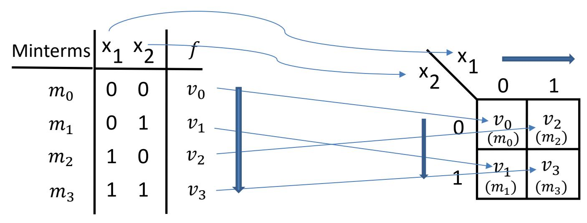

Truth table

K-map

(function values:  $v_i \in \{0,1\}, i = 0, 1, 2, 3$ ) (along w/ associated minterms)

In K-maps, it is not necessary to write out minterms/maxterms. The co-ordinates of a cell implicitly tell the associated minterm/maxterm. The next slide has an example.

# K-maps for 2-variable functions (contd.)

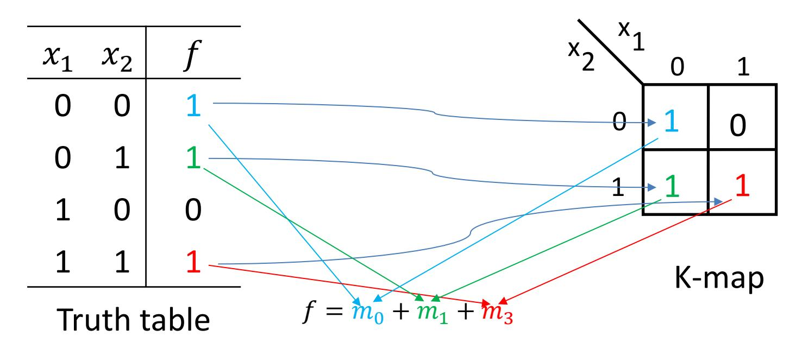

Notice the coordinates and contents of squares

### K-maps for 2-variable functions (contd.)

- Note that in the column where  $x_1$ =0, irrespective of the value of  $x_2$  the function has a value of 1
  - the two 1's in that column are encompassed in the green rectangle
- Similar situation arises for the row where  $x_2=1$ 
  - the two 1's in that row are encompassed in the red rectangle

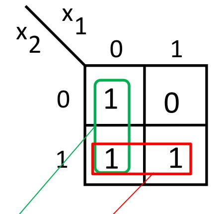

The above two rectangles "cover" all of the "1"s of the function; thus we can write

$$f = x'_1 + x_2$$

# K-maps for 2-variable functions (contd.)

### **An alternative/algebraic explanation**

• Note that the green rectangle encompassing two "1"s corresponds to 0 + 1, yielding

$$m_0 + m_1 = x'_1 x'_2 + x'_1 x_2 = x'_1$$

• Similarly, the red rectangle encompassing two "1"s corresponds to 1 + 3, yielding

$$m_1 + m_3 = x'_1 x_2 + x_1 x_2 = x_2$$

• Thus an expression that covers all "1"s in the K-map is

$$f = x'_1 + x_2$$

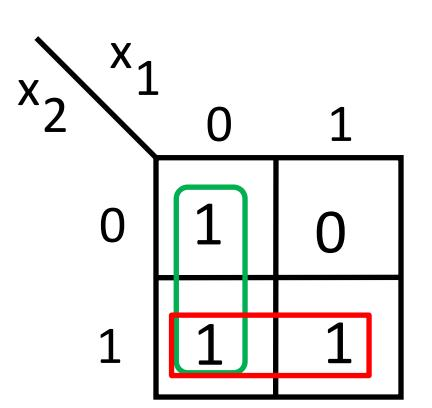

# Basic strategies for SOP simplification using K-maps

- For an SOP expression for the function, all "1"'s in the Kmap must be covered by one or more rectangles
- Find rectangles as large as possible covering "1"s, noting that
  - it is okay if a "1" is covered by more than one rectangles
  - the number of cells covered by a rectangle must be a power of 2, e.g., 1 (=20), 2, 4, 8, 16, …
- For a low cost SOP expression, select as few rectangles as possible while ensuring to cover all of the "1"s in the K-map
- It is possible that there are multiple solutions that are equally as good

# K-maps for 3-variable functions

### Populating K-maps

Between adjacent columns/rows, allow only one variable's value change (i.e., Gray code)

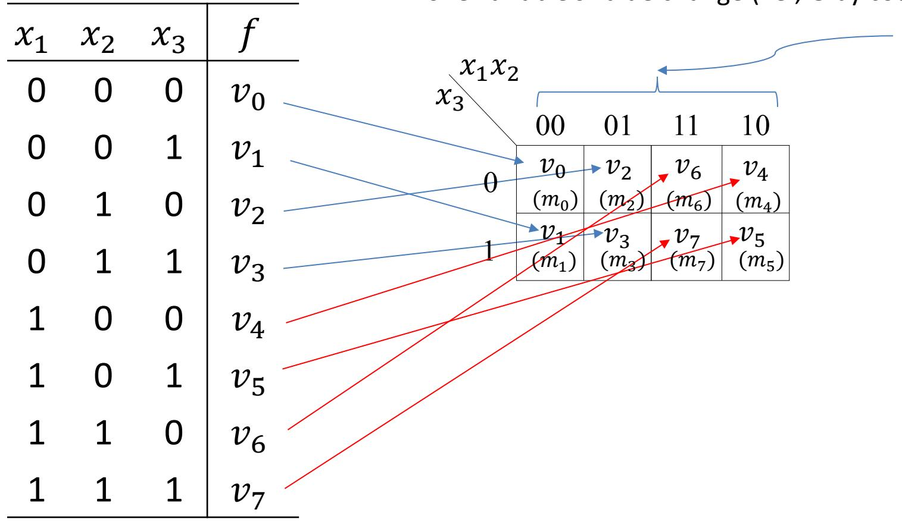

### K-maps for 3-variable functions (contd.)

Consider the following truth table for a 3-variable function. An (initially) empty K-map is shown at right.

| $x_1$ | $x_2$ | $x_3$ | f |
|-------|-------|-------|---|
| 0     | 0     | 0     | 0 |
| 0     | 0     | 1     | 0 |
| 0     | 1     | 0     | 1 |
| 0     | 1     | 1     | 0 |
| 1     | 0     | 0     | 1 |
| 1     | 0     | 1     | 1 |
| 1     | 1     | 0     | 0 |
| 1     | 1     | 1     | 0 |

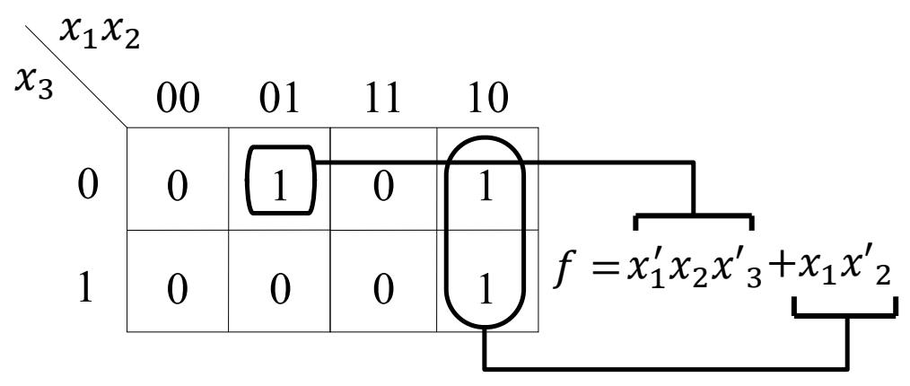

When an oval/rectangle covers

- one "1", then it creates a product term with 3 variables.
- two "1"s, then it creates a product term of 2 variables.

### K-maps for 3-variable functions (contd.)

Consider the following truth table for a 3-variable function. The corresponding K-map (initially empty) is shown at right

| $x_1$ | $x_2$ | $x_3$ | f |  |
|-------|-------|-------|---|--|
| 0     | 0     | 0     | 1 |  |
| 0     | 0     | 1     | 0 |  |
| 0     | 1     | 0     | 1 |  |
| 0     | 1     | 1     | 0 |  |
| 1     | 0     | 0     | 1 |  |
| 1     | 0     | 1     | 1 |  |
| 1     | 1     | 0     | 1 |  |
| 1     | 1     | 1     | 0 |  |

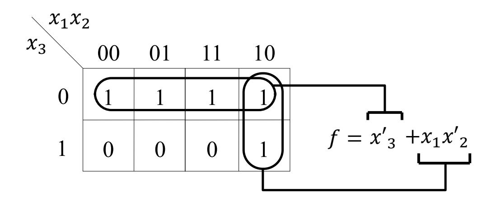

When an oval/rectangle covers four "1"s, then it creates a product term of 1 variable.

# Remarks on K-map

In general, for an -variable function a rectangle/oval encompassing 1's in

- 1 square (i.e., cell) corresponds to a *product* term of variables (i.e., minterm),
- 2 adjacent squares correspond to a *product* of -1 variables
- 4 (i.e., 22) adjacent squares correspond to a *product* of -2 variables
- 8 (i.e., 23) adjacent squares correspond to a *product* of -3 variables, and so on …

# Grouping 1's in edges and corners

Consider the function in the truth table. Note that the corresponding K-map has variables organized a bit differently

| 𝑥𝑥 1 | 𝑥𝑥 2 | 𝑥𝑥 3 | 𝑓𝑓 |  |
|---------|---------|---------|----|--|
| 0       | 0       | 0       | 0  |  |
| 0       | 0       | 1       | 1  |  |
| 0       | 1       | 0       | 0  |  |
| 0       | 1       | 1       | 0  |  |
| 1       | 0       | 0       | 1  |  |
| 1       | 0       | 1       | 1  |  |
| 1       | 1       | 0       | 1  |  |
| 1       | 1       | 1       | 0  |  |

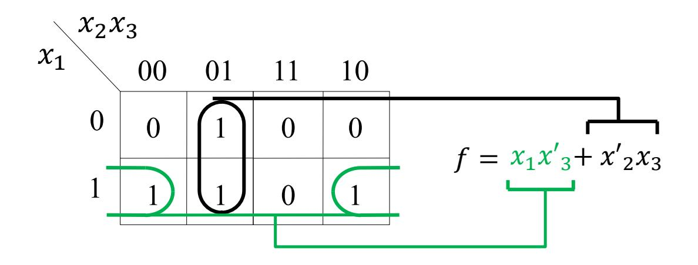

Columns (and rows) wrap around from left-to-right (top-to-bottom)

# Additional remarks on K-map

- To properly implement a function using K-maps, we must make sure to select enough rectangles (product terms) to cover **all** of the squares for which the function outputs a "1".
- Note that it is okay to cover an output "1" **multiple** times.
- Make sure to consider all rectangles, especially around the **edges** and **corners**.

#### ECE 124 – Digital Circuits and Systems Dept. of ECE, Univ. of Waterloo

Lecture Slides: **Set 3 - Part 3**

#### Contents:

- K-maps for 4- and 5-variable functions
- K-maps for POS

©2014-2026 M. A. Hasan. These slides and notes are for the exclusive use of the students registered in the course. Reproduction in any form or use for any other purposes is prohibited.

# K-maps for 4-variable functions

### Locations of 4-variable minterms

| 𝑥𝑥 𝑥𝑥 1      | 2   |     |     |     |
|--------------------|-----|-----|-----|-----|
| 𝑥𝑥 𝑥𝑥 3 4 | 00  | 01  | 11  | 10  |
| 00                 | (𝑚𝑚 | (𝑚𝑚 | (𝑚𝑚 | (𝑚𝑚 |
|                    | )   | )   | )   | )   |
|                    | 0   | 4   | 12  | 8   |
| 01                 | (𝑚𝑚 | (𝑚𝑚 | (𝑚𝑚 | (𝑚𝑚 |
|                    | )   | )   | )   | )   |
|                    | 1   | 5   | 13  | 9   |
| 11                 | (𝑚𝑚 | (𝑚𝑚 | (𝑚𝑚 | (𝑚𝑚 |
|                    | )   | )   | )   | )   |
|                    | 3   | 7   | 15  | 11  |
| 10                 | (𝑚𝑚 | (𝑚𝑚 | (𝑚𝑚 | (𝑚𝑚 |
|                    | )   | )   | )   | )   |
|                    | 2   | 6   | 14  | 10  |

# K-maps for 4-variable functions (contd.)

Multiple (2, 4, 8 or 16) adjacent squares containing '1's can be grouped. (A group with only one square offers no simplification to a function's logic expression)

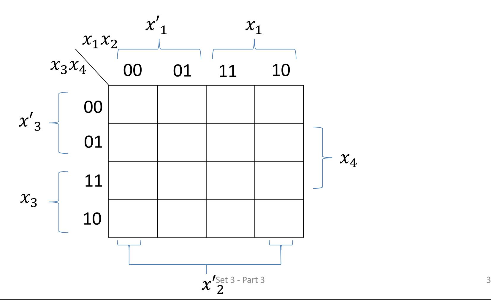

# K-maps for 4-variable functions (contd.)

Consider the following two 4-variable functions given in their canonical SOPs (in lieu of truth tables):

$$f_1 = \Sigma m(2, 3, 9, 10, 11, 13)$$
  
 $f_2 = \Sigma m(2, 3, 6, 7, 9, 10, 11, 13, 14, 15)$ 

Simplification of the functions' logic expressions using K-maps follows:

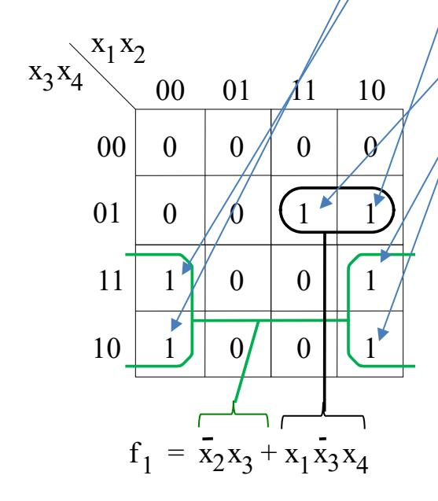

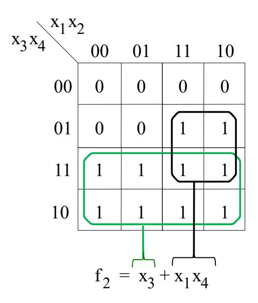

### K-maps for 4-variable functions (contd.)

[Encompassing corners (see  $f_3$ ) & Identifying multiple solutions (see  $f_4$ )] Consider canonical SOPs

$$f_3 = \Sigma m(0, 2, 3, 6, 7, 8, 10, 15)$$
  
$$f_4 = \Sigma m(0, 1, 4, 5, 10, 11, 12, 13, 14, 15)$$

Simplification  $f_3$  and  $f_4$  using K-maps is shown below:

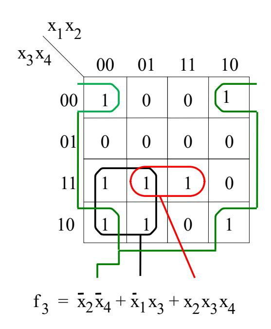

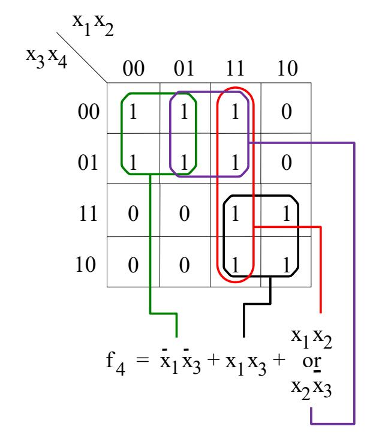

# K-maps for 5-variable functions

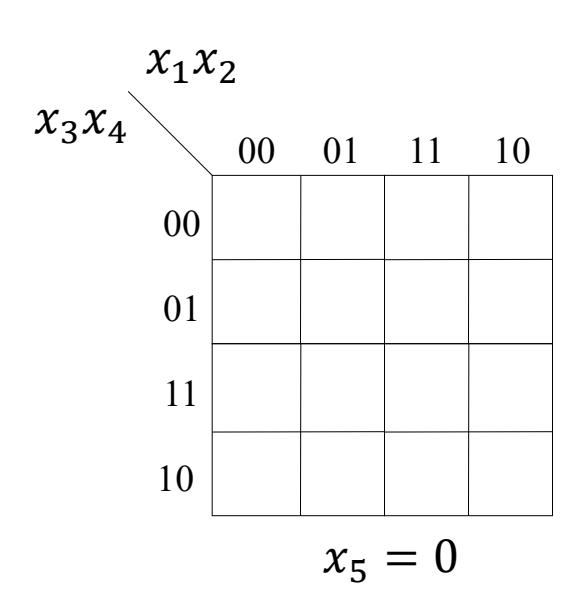

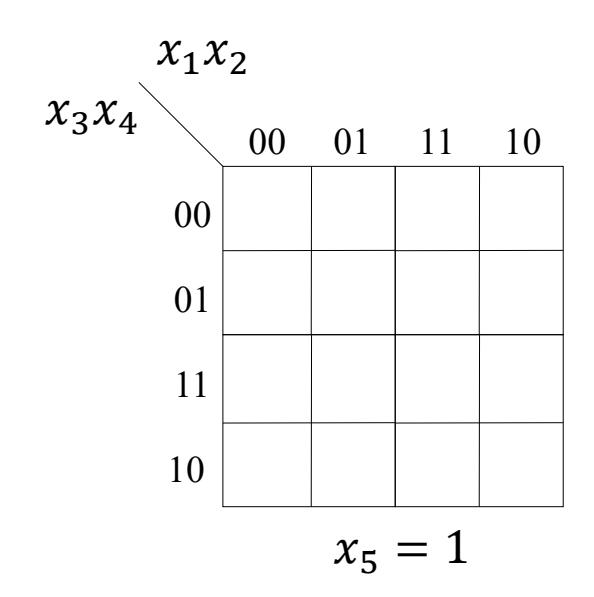

# K-maps for 5-variable functions (contd.)

An example of grouping in a 5-variable K-map:

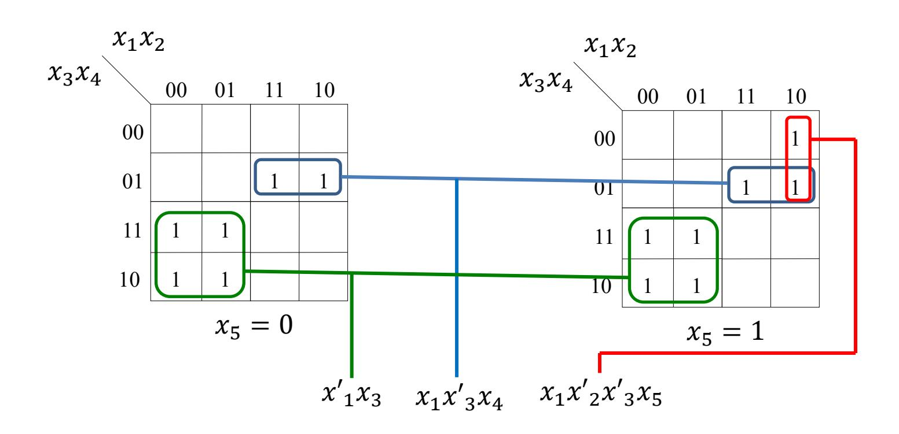

$$f = x'_1 x_3 + x_1 x'_3 x_4 + x_1 x'_2 x'_3 x_5$$

# Remarks on K-map

So far we have used K-maps to find minimized SOP representations for functions.

Our general strategy is as follows:

- Find product terms with as few variables as possible (by finding larger rectangles in the K-map covering "1"s)
- Select as few rectangles (product terms) as possible while ensuring to cover all of the "1"s in the K-map
- It is okay if a "1" is covered by more than one product term
- It is possible that there are multiple solutions that are equally as good

# Minimization of POS forms

It is very similar to Sum-Of-Products minimization. Main differences are:

- –We try to encompass the "0"s in the K-map, and
- –We AND together the resulting sum terms

An example: Consider POS minimization of

$$f(x_1, ..., x_4) = \Pi M(0, 1, 4, 8, 9, 12, 15)$$

# Minimization of POS forms (contd.)

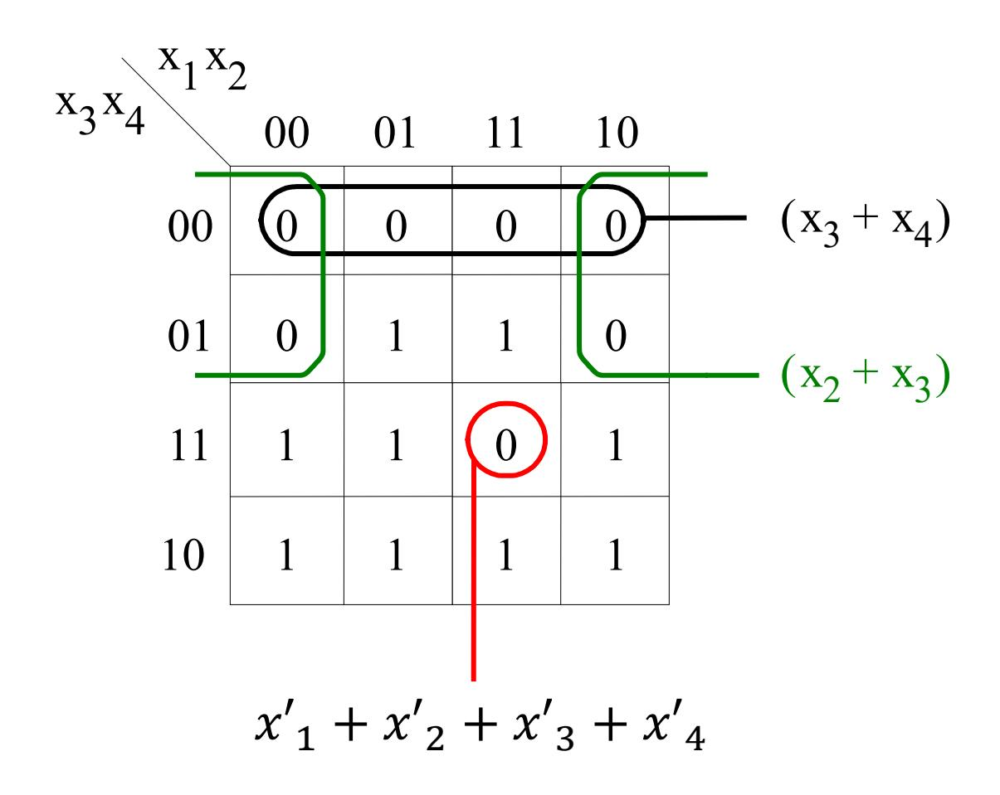

$$f = (x_3 + x_4)(x_2 + x_3)(x'_1 + x'_2 + x'_3 + x'_4)$$

### Minimization of POS forms (contd.)

A different way to think of enclosing the "0"s is that we are finding an SOP for f', and then taking the complement to get a POS expression for f.

$$f' = x'_3 x'_4 + x'_2 x'_3 + x_1 x_2 x_3 x_4$$

$$f = (x'_3 x'_4 + x'_2 x'_3 + x_1 x_2 x_3 x_4)'$$

$$= (x'_3 x'_4)' (x'_2 x'_3)' (x_1 x_2 x_3 x_4)'$$

$$= (x_3 + x_4) (x_2 + x_3) (x'_1 + x'_2 + x'_3 + x'_4)$$

#### ECE 124 – Digital Circuits and Systems Dept. of ECE, Univ. of Waterloo

Lecture Slides: **Set 3 - Part 4**

#### Contents:

- Don't cares
- Multiple outputs

©2014-2026 M. A. Hasan. These slides and notes are for the exclusive use of the students registered in the course. Reproduction in any form or use for any other purposes is prohibited.

# Incompletely Specified Functions

Sometimes we might have a function where for a subset of inputs it doesn't matter (i.e., we *don't care*) what the output is.

- These situations are called "don't cares" or incompletely specified function
- Rather than using a "1" or a "0", we can use a "d" to mark a don't care as the output.

How are don't cares important and useful?

If we are looking for a minimum representation using as few gates as possible, we can force the don't care locations to either 0 or 1, however it helps us.

# Incompletely Specified Functions (contd.)

Example: Two implementations of function *f* ( *x*1,…, *x*4) = Σ *m*(2, 4, 5, 6, 10) + *D*(12, 13, 14, 15).

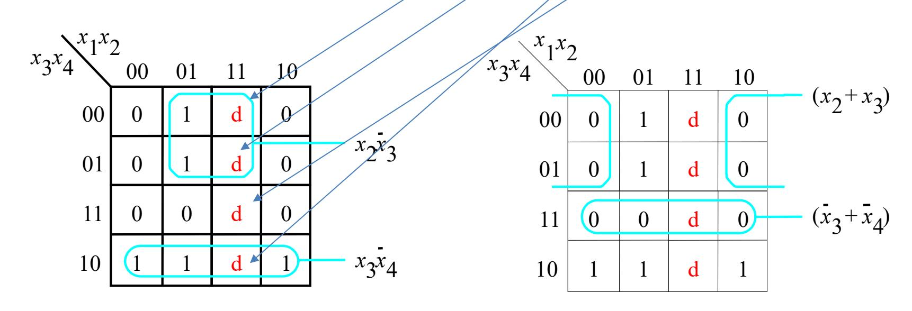

SOP implementation

POS implementation

# Multiple-Output Circuits

Suppose we want to implement two or more functions of same variables.

We can minimize each function individually, but sometimes the overall circuit implementation will be of lower cost if we consider two or more functions *simultaneously*.

The main idea for minimization of multiple functions is to try to find common terms useful for two or more functions and then *share them.*

An example for optimizing circuits for two functions is in the next slide (where the circuits in red and green are shared).

# Multiple-Output Circuits (contd.)

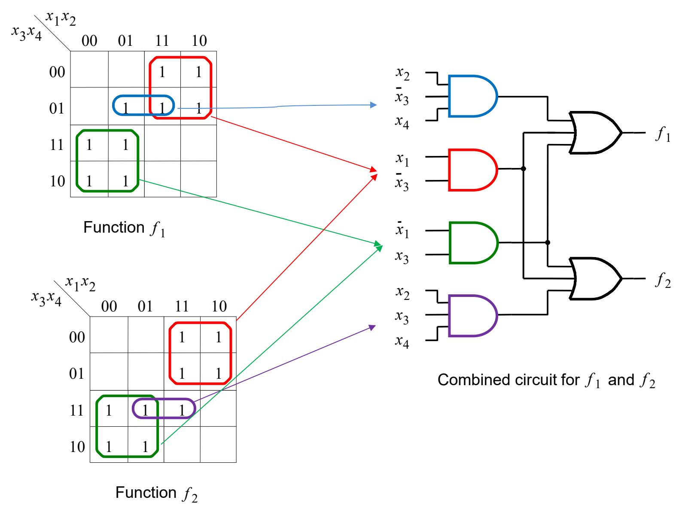

### Multiple-Output Circuits (contd.)

#### Another example:

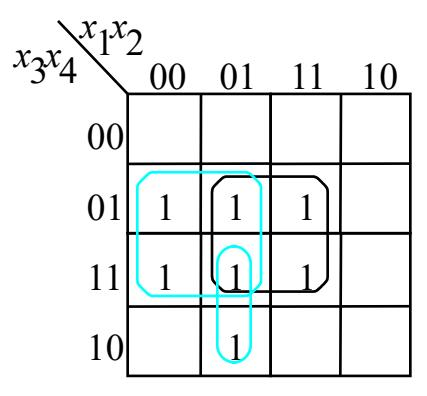

Optimal realization of  $f_3$ 

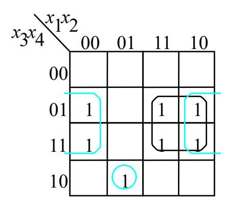

Optimal realization of  $f_4$ 

- Individually optimized  $f_3 = x_1'x_4 + x_2x_4 + x_1'x_2x_3$  and  $f_4 = x_1x_4 + x_2'x_4 + x_1'x_2x_3x_4'$
- The combined cost is 6 AND gates, 2 OR gates and 21 inputs, totalling to 29.
- A better circuit is on the next slide

### Multiple-Output Circuits (contd.)

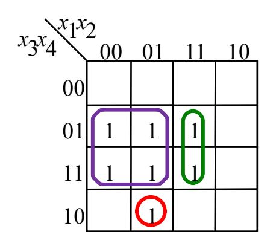

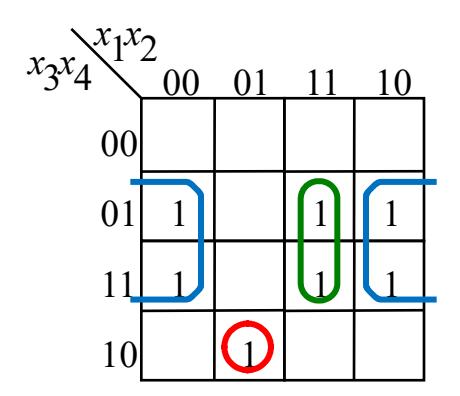

A better optimization of  $f_3$  and  $f_4$  together

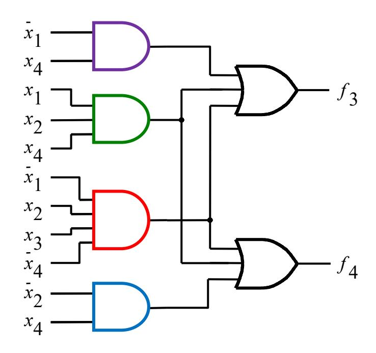

#### Combined optimization gives:

$$f_3 = x_1x_2x_4 + x_1'x_2x_3x_4' + x_1'x_4$$
 and  $f_4 = x_1x_2x_4 + x_1'x_2x_3x_4' + x_2'x_4$  have a cost of 4 AND gates, 2 OR gates and 17 inputs, totalling to 23.