#### ECE 124 – Digital Circuits and Systems Dept. of ECE, Univ. of Waterloo

Lecture Slides: **Set 4 - Part 1**

#### Contents:

• Multiplexers and their uses in synthesis

©2014-2026 M. A. Hasan. These slides and notes are for the exclusive use of the students registered in the course. Reproduction in any form or use for any other purposes is prohibited.

# Combinational sub-circuits

As building blocks in larger designs, a few types of logic circuits are *often* used. Such sub-circuits include

- Multiplexers (mux)
- De-multiplexers
- Encoders
- Decoders
- Others, e.g., priority encoder, code converter, comparator, etc.

# Multiplexers

- A multiplexer circuit has a number of *data inputs*, one or more select inputs, and one output. Based on the value that the select inputs represent, one data input appears at the output
  - ₋ Symbol, truth table and an SOP circuit diagram for a 2-to-1 multiplexer are shown below

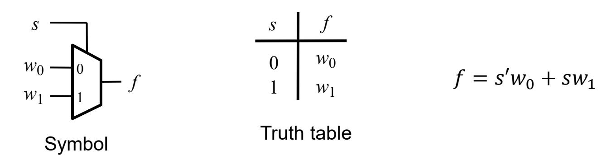

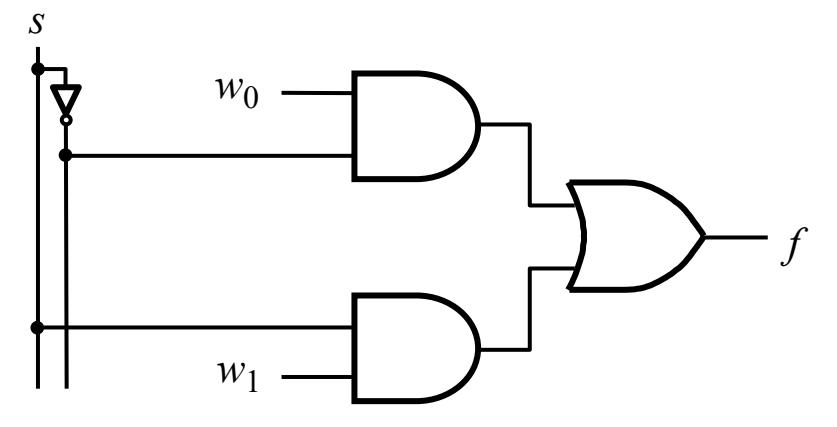

Sum-of-products circuit

From the circuit, notice that the value of the select input lets only one data input pass through the AND gate on its path (and 0 through the other AND gate)

## Multiplexers (contd.)

Symbol, truth table and an SOP circuit diagram for a 4-to-1 multiplexer are shown below

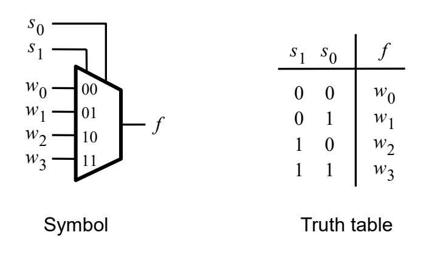

From the circuit, notice that the value of the select inputs lets only one data input pass through the AND gate on its path (and 0 through the other AND gates)

$$f = s_1' s_0' w_0 + s_1' s_0 w_1 + s_1 s_0' w_2 + s_1 s_0 w_3$$

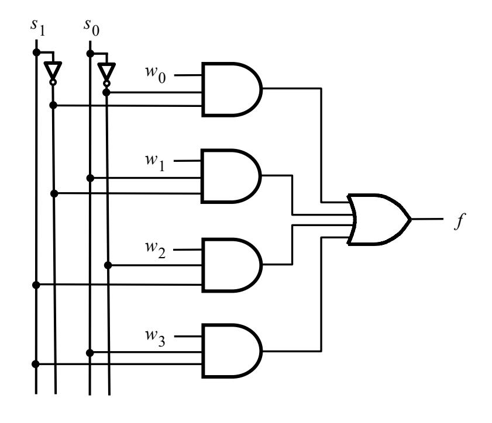

## Multiplexers (contd.)

Implementation of a 4-to-1 multiplexer using 2-to-1 multiplexers

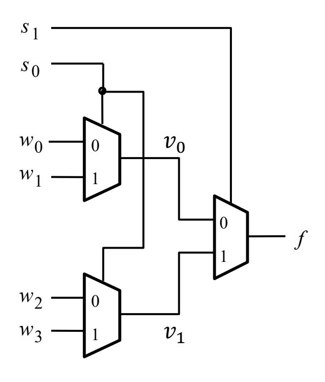

From the circuit diagram at left and the truth table on the previous slide, note that

- $s_1=0$  selects its upper data input (which is connected to the output of the upper multiplexer of the previous level
- $s_1 = 1$  selects the output of the lower multiplexer of the previous level

In algebraic form,

$$f = s'_1 v_0 + s_1 v_1$$
  
=  $s'_1 (s'_0 w_0 + s_0 w_1) + s_1 (s'_0 w_2 + s_0 w_3)$   
=  $s'_1 s'_0 w_0 + s'_1 s_0 w_1 + s_1 s'_0 w_2 + s_1 s_0 w_3$ 

(which is the same as in the previous slide)

# Multiplexers (contd.)

Implementation of a 16-to-1 multiplexer using 4-to-1 multiplexers

#### Note that

- 32 = 00 selects the output of the top multiplexer of the preceding level
- 32 = 01 selects the output of the 2nd top multiplexer of the preceding level
- and so on

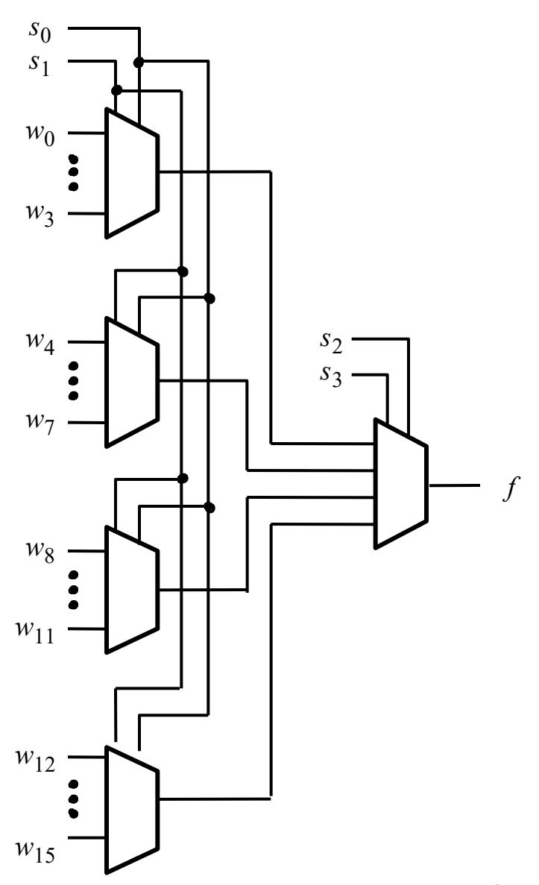

## Synthesis of logic function using multiplexers

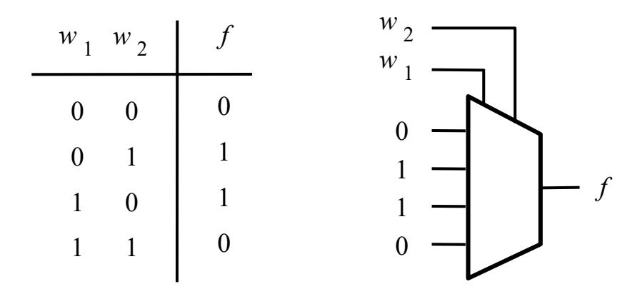

Straight-forward implementation using a 4-to-1 multiplexer

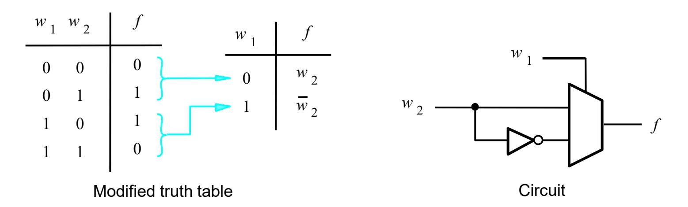

How is this done? Taking into account the value of  $w_1$ , write f in terms of  $w_2$  (i.e.,  $w_2$  and  $w'_2$ ) and then remove input column titled  $w_2$ 

# Synthesis of logic function using multiplexers (contd.)

3-variable example: Consider the 3-variable majority logic function, which has a value of 1 when majority of the inputs are 1 (see the truth table at right)

- For a given valuation of pair  $w_1w_2$ , write f in terms of  $w_3$  (i.e.,  $w_3$ ,  $w'_3$ , 0 and 1).
  - Note that using 2 select inputs ( $w_1$  and  $w_2$ ), we can a have a maximum of 4 different data input
- After expressing f in terms of w3, remove the input column titled w3

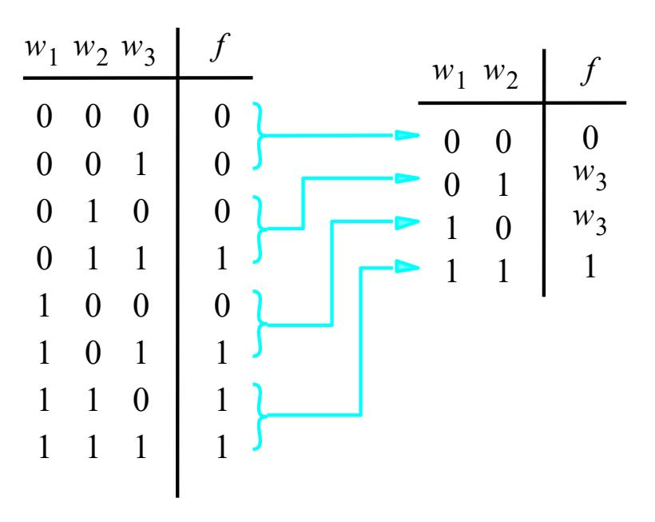

Truth table modification

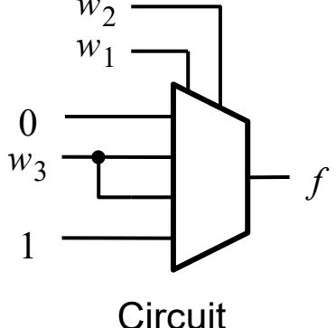

# Synthesis of logic function using multiplexers (contd.)

- For a given value of  $w_1$ , write f in terms of as a function of  $w_2$  and  $w_3$ . The new function will be a data input to the multiplexer
  - Note that since we will have only one select input, we can have a maximum of two functions at the multiplexer data input.
- After expressing f in terms of  $w_2$  and  $w_3$ , remove the input columns titled  $w_2$  and  $w_3$

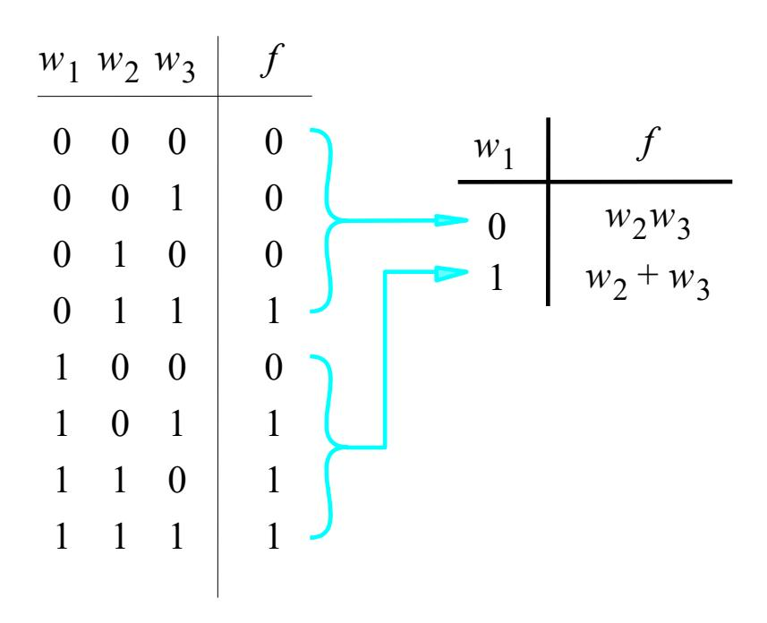

Truth table modification

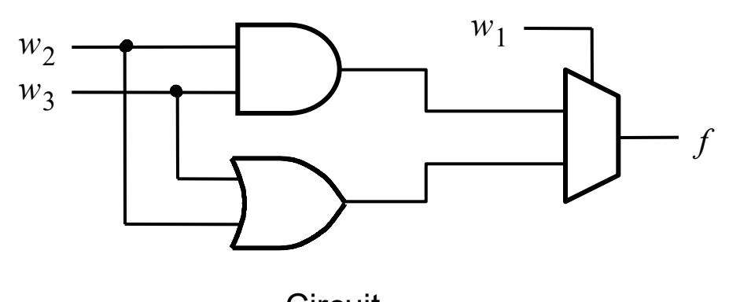

Set 4 - Part 1 Circuit

# Shannon's expansion

- Multiplexer based syntheses presented in the previous few slides are rather ad-hoc
- A systematic approach is to use Shannon's expansion theorem:

Any Boolean function  $f(w_1, ..., w_n)$  can be written in the form

$$f(w_1, w_2, ..., w_n) = w'_1 \cdot f(0, w_2, ..., w_n) + w_1 \cdot f(1, w_2, ..., w_n)$$

For short, we will write the above expansion as

$$f = w_1' \cdot f_{w_1'} + w_1 \cdot f_{w_1}$$

Clearly, this can be implemented using a 2-to-1 multiplexer

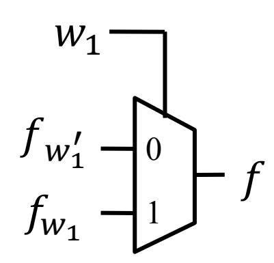

## Shannon's expansion (contd.)

Further note that we can repeat the application of Shannon's expansion to  $f_{w_1}$  and  $f_{w_1}$ , i.e., we can write and draw

$$f_{w'_1} = w'_2 \cdot f_{w'_1 w'_2} + w_2 \cdot f_{w'_1 w_2}$$
  
$$f_{w_1} = w'_2 \cdot f_{w_1 w'_2} + w_2 \cdot f_{w_1 w_2}$$

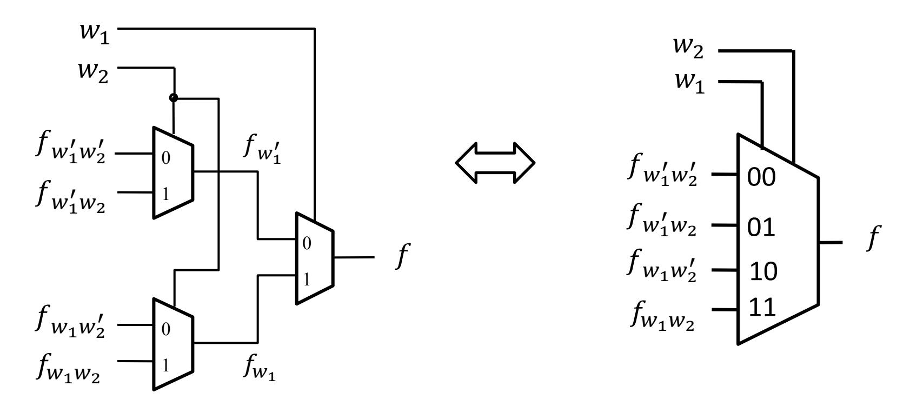

## Shannon's expansion (contd.)

An example: Consider the 3-variable majority logic function presented earlier, i.e.,

$$f(w_1, w_2, w_3) = m_3 + m_5 + m_6 + m_7$$

Its canonical SOP is

 $f(w_1, w_2, w_3) = w_1'w_2w_3 + w_1w_2'w_3 + w_1w_2w_3' + w_1w_2w_3$ Note that

$$f_{w_1'} = f(\mathbf{0}, w_2, w_3) = w_2 w_3$$
  

$$f_{w_1} = f(\mathbf{1}, w_2, w_3) = w'_2 w_3 + w_2 w'_3 + w_2 w_3 = w'_2 w_3 + w_2$$
  

$$= w_2 + w_3$$

- Thus, we have the circuit at right. It uses a 2-to-1 mux and is the same as what we saw 3 slides back
- The complexity of input logic may vary depending on the variable used as select input

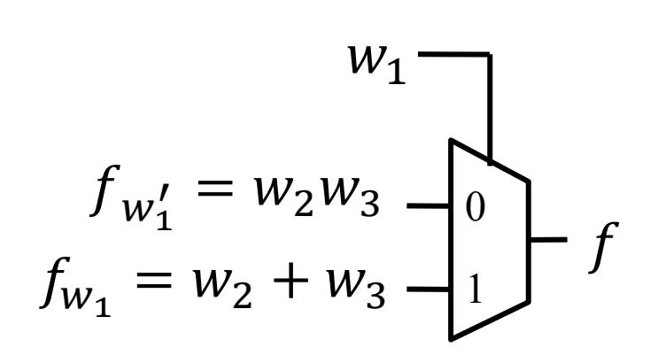

## Shannon's expansion (contd.)

We will apply Shannon's expansion again, i.e., to  $f_{w_1'}$  and  $f_{w_1}$ :

$$f_{w_1'w_2'} = f(0,0,w_3) = 0$$
  
 $f_{w_1'w_2} = f(0,1,w_3) = w_3$ 

and

$$f_{w_1w_2'} = f(1,0,w_3) = w_3$$
  
 $f_{w_1w_2} = f(1,1,w_3) = 1$ 

- Thus, we have the circuit at right. It uses
  a 4-to-1 mux and is the same as what we
  saw 6 (?) slides back
- If we apply Shannon's expansion again, we will need an 8-to-1 mux & its data input will be the function's 8 values [given in the truth table 5 (?) slides back]

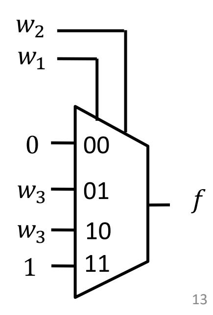

#### ECE 124 – Digital Circuits and Systems Dept. of ECE, Univ. of Waterloo

Lecture Slides: **Set 4 - Part 2**

#### Contents:

- Decoders and their uses in synthesis
- De-multiplexers and Encoders

©2014-2026 M. A. Hasan. These slides and notes are for the exclusive use of the students registered in the course. Reproduction in any form or use for any other purposes is prohibited.

#### **Decoders**

- A binary decoder has n inputs and  $2^n$  outputs
- Only one output is asserted at a time and each output corresponds to one valuation of the inputs
- A decoder typically has an enable input, En. If En=0, then none of the outputs is asserted. If En=1, the valuation of  $w_{n-1} \dots w_1 w_0$  determines which output is asserted

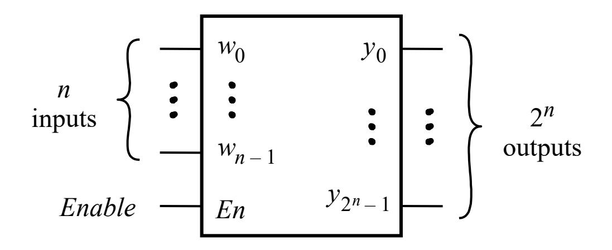

An *n*-to-2*n* binary decoder

## Decoders (contd.)

Example: Truth table, symbol and a circuit for a 2-to-4 decoder are shown below

| En | $w_1$ | $w_0$ | $y_0$ | $y_1$ | $y_2$ | <i>y</i> 3 |
|----|-------|-------|-------|-------|-------|-----------------------|
| 1  | 0     | 0     | 1     | 0     | 0     | 0                     |
| 1  | 0     | 1     | 0     | 1     | 0     | 0                     |
| 1  | 1     | 0     | 0     | 0     | 1     | 0                     |
| 1  | 1     | 1     | 0     | 0     | 0     | 1                     |
| 0  | X     | X     | 0     | 0     | 0     | 0                     |

Truth table

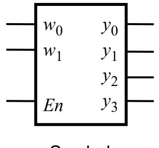

Symbol

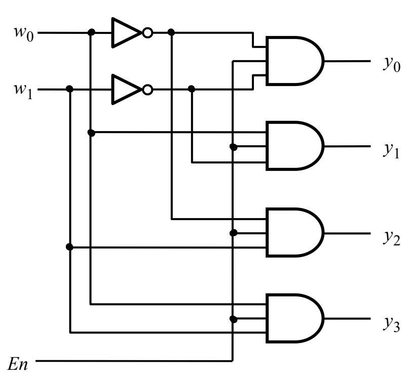

Logic circuit

Note that

$$y_0 = En w_1'w_0',$$
  
 $y_1 = En w_1'w_0, ...$ 

### Designing Decoders with Smaller Decoders

Below is a 3-to-8 decoder using two 2-to-4 decoders.

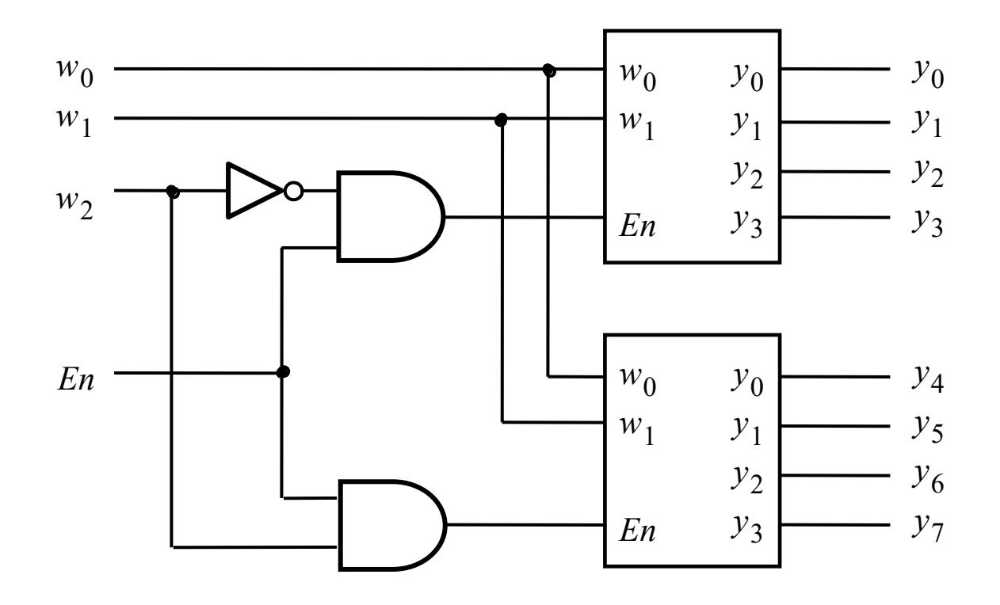

The next slide has a 4-to-16 decoder built using a "tree" of 2-to-4 decoders

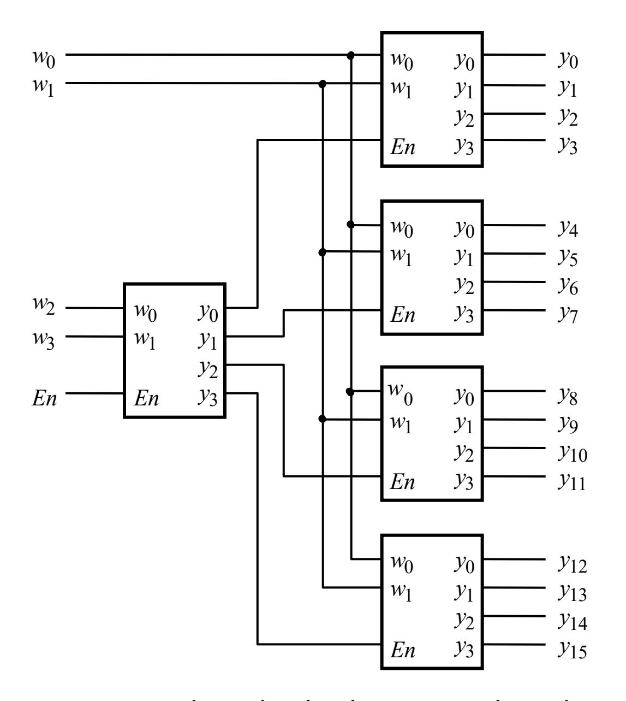

A 4-to-16 decoder built using a decoder tree

Set 4 - Part 2

5

# Decoders based Mux Design

Use of a decoder to build a 4-to-1 multiplexer:

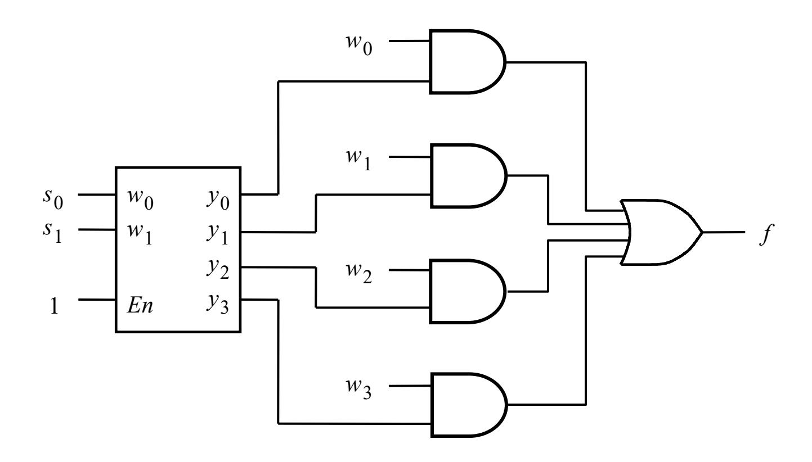

## Decoders based Mux Design (contd.)

Use of a decoder along with tri-state buffers to build a 4-to-1 mux

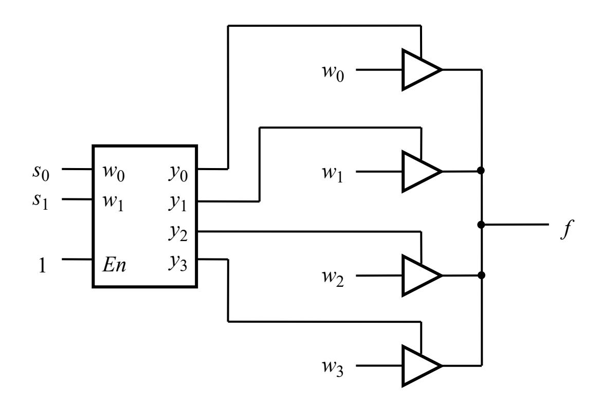

## Use of decoder in a 2*m* x *n* read-only memory (ROM) block

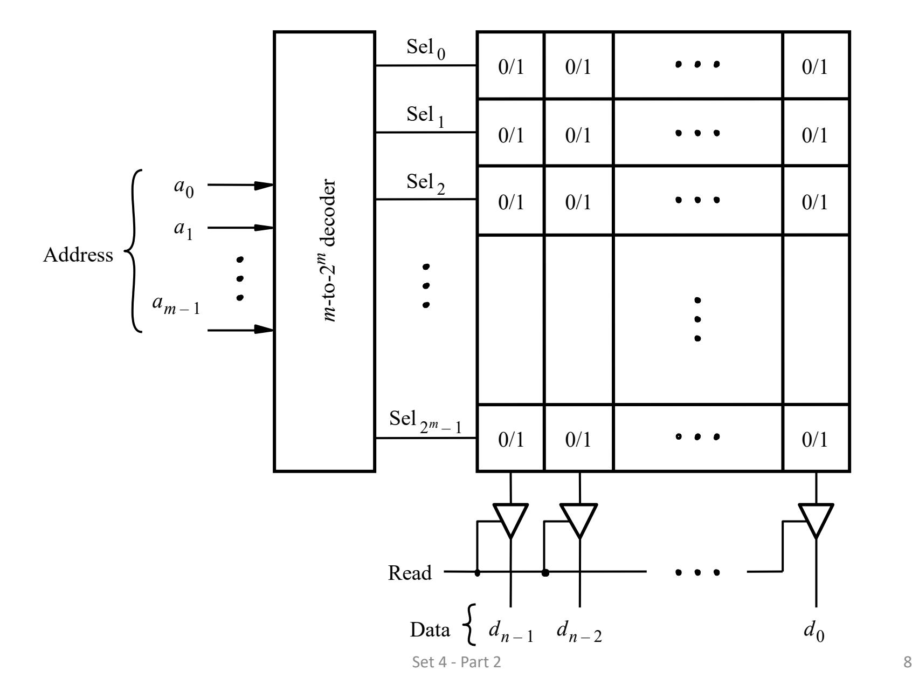

# Remarks

- In a ROM, the stored information can be read out, but it cannot be changed
- When cell contents can be modified (i.e., programmed), the memory is called programmable memory (PROM)
- Depending on the programming method, there are various types of memories, e.g.,
  - EPROM (erasable PROM)
  - EEPROM (electrically EPROM)
  - RW (read-write) memory

# Remarks (cont.)

• A combinational circuit with inputs and outputs can be viewed as a 2 x ROM

## De-multiplexers

- A de-multiplexer has only one data input, n select inputs and  $2^n$  outputs
- A de-multiplexer performs the opposite operation of a multiplexer, i.e., it places the input value at one of the outputs specified by the select inputs
- Symbol and truth table of 1-to- 4 de-mux are shown below

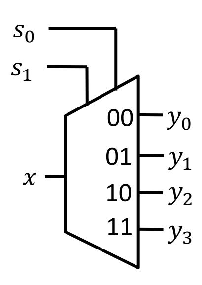

| $\overline{s_1}$ | $s_0$ | $y_0$ | $y_1$ | $y_2$            | $y_3$ |
|------------------|-------|-------|-------|------------------|-------|
| 0                | 0     | x     | 0     | 0 0 x 0 | 0     |
| 0                | 1     | 0     | X     | 0                | 0     |
| 1                | 0     | 0     | 0     | X                | 0     |
| _1               | 1     | 0     | 0     | 0                | x     |

Similar to decoder, note that

$$y_0 = x s_1' s_0',$$
  
 $y_1 = x s_1' s_0, ...$ 

#### **Encoders**

- A binary encoder encodes information from its  $2^n$  inputs into an n-bit code
- Exactly, one of the inputs should be 1 and the outputs present the binary number that identifies which input is 1
- The symbol of  $2^n$ -to- n encoder is shown below

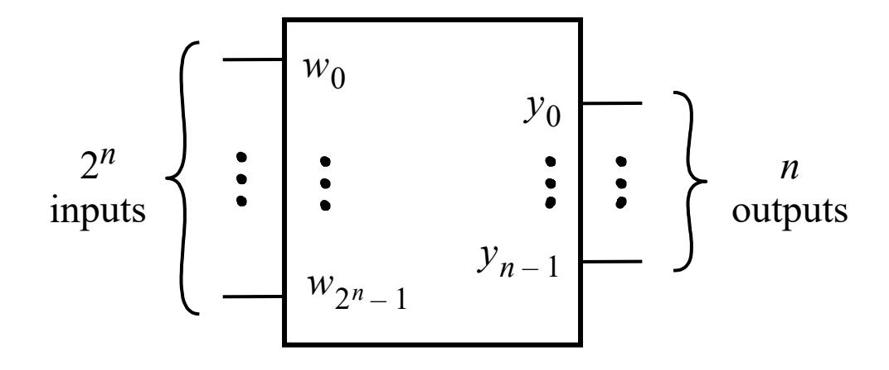

A 2n-to-n binary encoder

## Encoders (contd.)

Example: Truth table and circuit of a 4-to-2 encoder

|           |                  |       |       |       |       | $w_0$ ———   |
|-----------|------------------|-------|-------|-------|-------|-------------|
| $w_3$ $w$ | ' 2 1 | $w_1$ | $w_0$ | $y_1$ | $y_0$ | $w_1$       |
| 0 (       | $\mathbf{C}$     | 0     | 1     | 0     | 0     | $y_0$       |
| 0 (       |                  |       | 0     | 0     | 1     | $w_2$       |
| 0         | 1                | 0     | 0     | 1     | 0     |             |
| 1 (       | 0                | 0     | 0     | 1     | 1     | $w_3$ $y_1$ |
|           | Tr               | uth   | ı tab | le    |       | Circuit     |

Note that since each 4-tuple input has only one '1', we write an algebraic expression for output  $y_i$  as a logical sum of those  $w_j$ 's for which  $y_i$ =1. In the above example,  $y_0$ =  $w_1$  +  $w_3$  and  $y_1$ =  $w_2$  +  $w_3$