#### ECE 124 – Digital Circuits and Systems Dept. of ECE, Univ. of Waterloo

Lecture Slides: **Set 5 - Part 1**

#### Contents:

- Terminologies for sequential circuits
- Storage elements

©2014-2026 M. A. Hasan. These slides and notes are for the exclusive use of the students registered in the course. Reproduction in any form or use for any other purposes is prohibited.

# Introduction

- For the circuits we have seen so far, outputs depend solely on present inputs (not on any past signals). Such circuits are known as combinational circuits.
- Circuits for which the outputs depend not only on present inputs but also on past signals are known as sequential circuits.
- Sequential circuits have 'memory' or storage elements that can store logic values.
- The content of the storage elements defines the *state* of the sequential circuit.

#### Introduction (contd.)

- There are two main types of sequential circuits
  - Synchronous sequential circuits: in this type, the circuit behavior (i.e., signals) changes only at discrete instances in time
  - Asynchronous sequential circuits: in this type, the circuit behavior can change at any instance in time
- A 'clock' signal is used to change the circuit behavior at discrete instances in time
  - A clock signal has two levels (corresponding to logic 1 and 0) as shown below

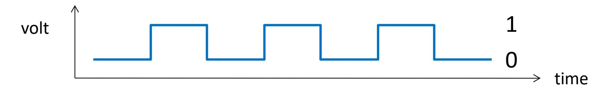

#### Introduction (contd.)

- A 0→1 transition in the clock signal is called rising (positive) edge
- A 1→0 transition in the clock signal is called falling (negative) edge

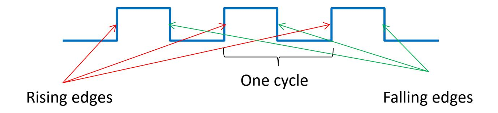

- Time duration (say t) of one cycle is known as clock *period*
- Clock *frequency* (say f) is the reciprocal of t, i.e., f = 1/t
- units of t: sec (or micro-, nano-sec, etc.)
- Units of f: Hz (or MHz, GHz, etc.)

Set 5 - Part 1

4

# Introduction (contd.)

Putting it together: types of digital circuits

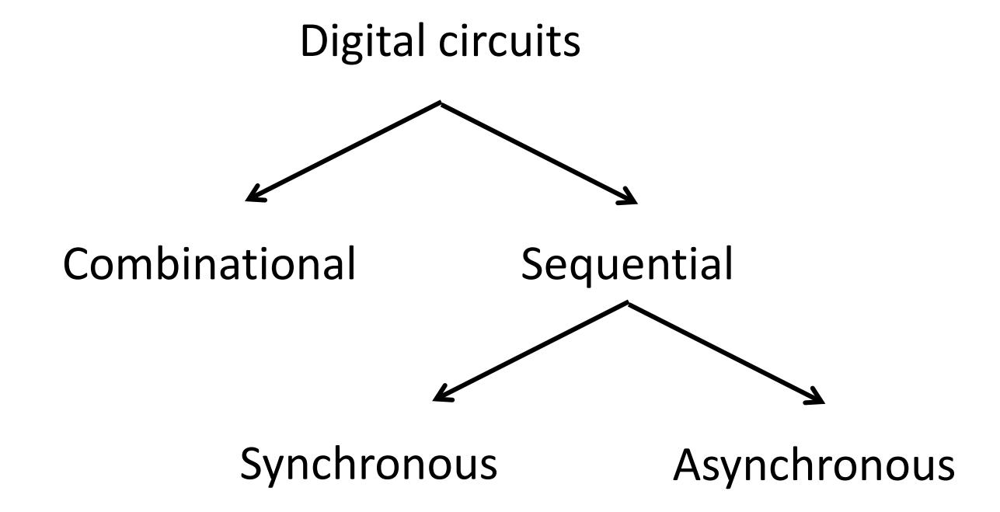

# Storage elements

There are mainly two types of storage elements in sequential circuits: latches and flip-flops.

Basic latch: A basic latch responds with changes in the signal *level* of input data (i.e., a basic latch is level sensitive)

Gated latch: It is a basic latch with an enable type control input (e.g., clock).

- If the control is not asserted, the gated latch does not respond to changes in the signal level of input data
- On the other hand, if the control is asserted, a gated latch acts like a level sensitive basic latch described above
  - For a periodic control signal like a clock, the state can change multiple times during a single cycle to respond to changes in the signal level of input data

# Storage elements (contd.)

#### Flip-flop:

- A flip-flop has an enable type control input (e.g., clock) and can be viewed to have two gated latches.
- The state of a flip-flop responds to input data signals only at one of the edges (rising or falling) of the control signal.
- Since (clock) edges are almost instant in time, a flip-flop can't change its state more than once in a single clock cycle.

# Storage elements (contd.)

Putting it together: Storage elements in sequential circuits

Storage element in sequential circuits

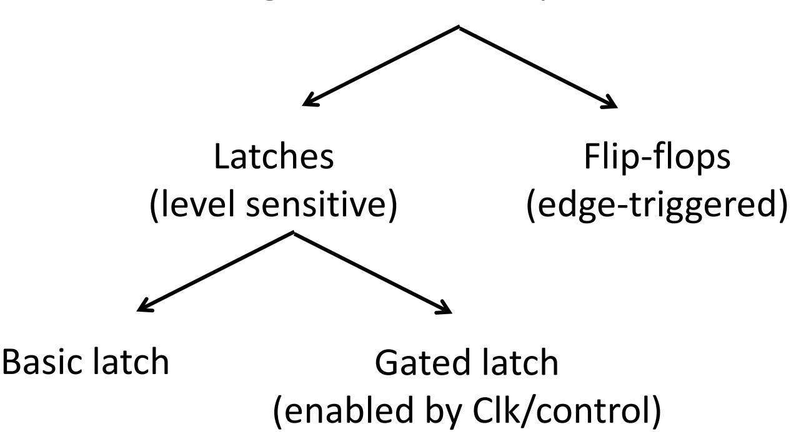

#### ECE 124 – Digital Circuits and Systems Dept. of ECE, Univ. of Waterloo

Lecture Slides: **Set 5 - Part 2**

#### Contents:

- Basic latches
- Gated latches

©2014-2026 M. A. Hasan. These slides and notes are for the exclusive use of the students registered in the course. Reproduction in any form or use for any other purposes is prohibited.

#### Basic latch with NOR gates

- The following circuit made of two NOR gates connected in a crossed-coupled way is a latch (storage element)
- Its behavior is described in the following table
  - for sequential circuits, the table describing the circuit behavior is called characteristic table
  - Inputs are R and S (reset and set respectively)
  - When (R,S)=(1,0), output  $Q_a$  is reset to 0
  - When (R,S)=(0,1), output  $Q_a$  is set to 1
  - Input (R,S)=(1,1) is avoided (see also the next slide), in which case  $Q_a = Q'_b$  and the value of output  $Q_a$  is treated as the state of the latch

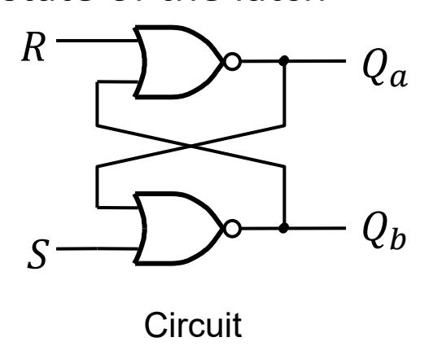

| SR                                             | $Q_a Q_b$ |                |
|------------------------------------------------|-----------|----------------|
| 0 0                                            | nc nc     | (nc=no change) |
| $\begin{array}{cc} 0 & 0 \\ 0 & 1 \end{array}$ | 0 1       |                |
| 1 0                                            | 1 0       |                |
| 1 1                                            | 0 0       |                |

# Basic latch with NOR gates (contd.)

- The timing diagram of the NOR based latch is shown below
- When (, ) changes from (1,1) to (0,0), the state will keep toggling (oscillate) between 0 & 1
  - in practice the state will settle into 0 or 1, but we don't know what it will be.

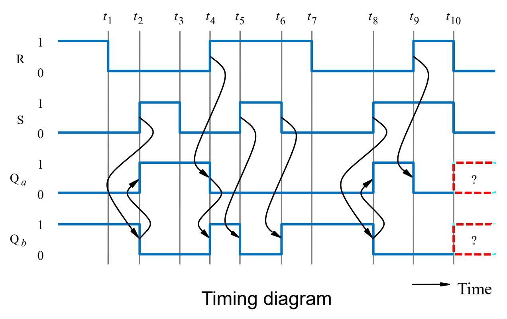

# Basic latch with NAND gates

- The following circuit made of two NAND gates connected in a crossed-coupled way is a latch
- Its behavior is described in the following table
  - When (, ) changes from (0,0) to (1,1), the state will keep toggling (oscillate) between 0 & 1

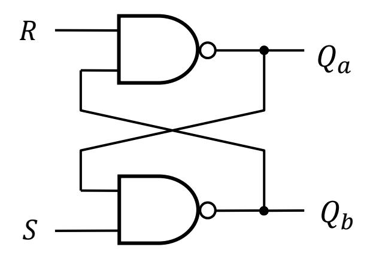

| 𝑆𝑆 | 𝑅𝑅 | 𝑄𝑄 𝑎𝑎 | 𝑄𝑄 𝑏𝑏 |
|----|----|----------|----------|
| 1  | 1  | nc       | nc       |
| 0  | 1  | 0        | 1        |
| 1  | 0  | 1        | 0        |
| 0  | 0  | 1        | 1        |

# Gated latch with NAND gates

- In the basic SR latches presented earlier, the state changes can occur anytime and we may not be aware of such changes
- We can control the timing of possible state changes via an Enable or a clock signal
- The following circuit diagram is a gated latch.
  - When Clk=0, the gated latch incurs no state change even with changes in and
  - When Clk=1, the gated latch functions as a basic latch

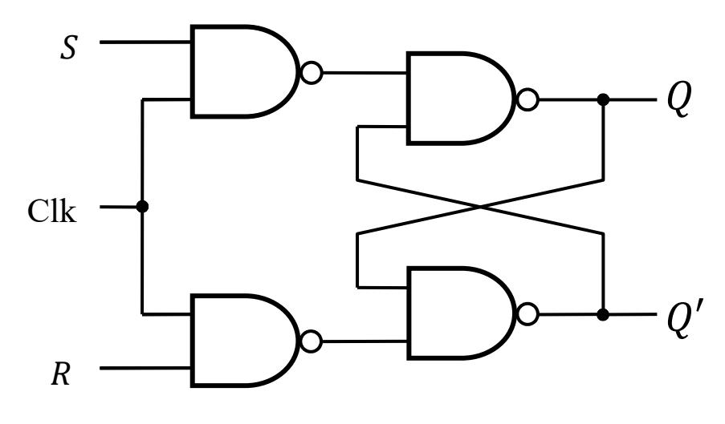

Gated SR latch with NAND gates

| Clk | 𝑆𝑆 | 𝑅𝑅 | 𝑄𝑄 | 𝑄𝑄 |
|-----|----|----|----|----|
| 0   | x  | x  | nc | nc |
| 1   | 0  | 0  | nc | nc |
| 1   | 0  | 1  | 0  | 1  |
| 1   | 1  | 0  | 1  | 0  |
| 1   | 1  | 1  | x  | x  |

Characteristic table Set 5 - Part 2 5

#### Gated D latch

- Gated D latch is a special case of the gated latch shown in the previous slide and has a single data input (D)
- The special case is due to R = S'; see the diagram and the characteristic table below, where Q(t) and Q(t+1) denote the present and the next states, respectively
- Gated D latch stores the value of the input data under the control of Clk

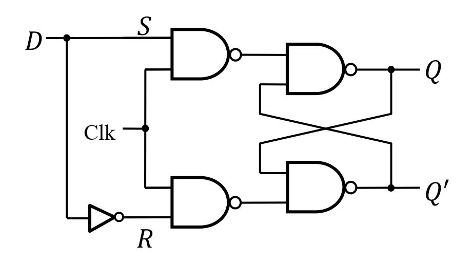

Gated D latch circuit

| Clk | D | Q(t+1) | )          |
|-----|---|--------|------------|
| 0   | Х | Q(t)   | (i.e., nc) |
| 1   | 1 | 1      |            |
| 1   | 0 | 0      |            |

Characteristic table

# Gated D latch (contd.)

- Gated D latch shown in the previous slide is controlled by the level of Clk (and hence called '*level sensitive*'); see the timing diagram below where the sensitive portions are identified with red curly brackets.
- Graphical symbol the level sensitive D latch is also shown below.

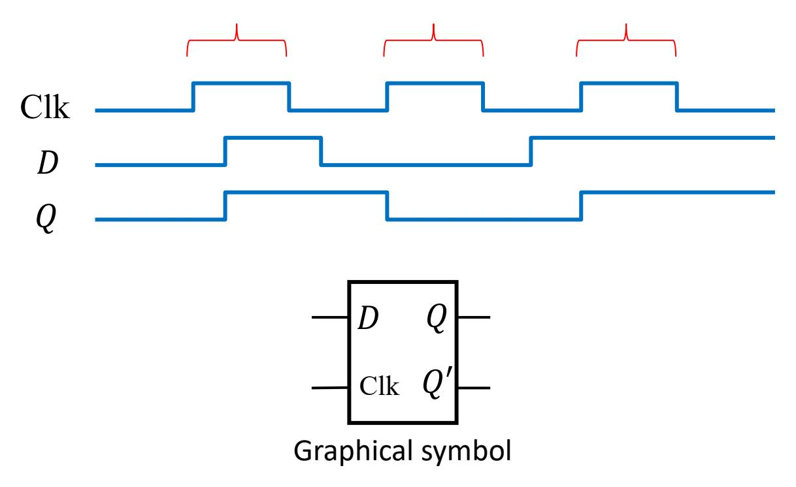

#### ECE 124 – Digital Circuits and Systems Dept. of ECE, Univ. of Waterloo

Lecture Slides: **Set 5 - Part 3**

#### Contents:

• Flip-flops

©2014-2026 M. A. Hasan. These slides and notes are for the exclusive use of the students registered in the course. Reproduction in any form or use for any other purposes is prohibited.

#### Edge-Triggered Flip-flops

- In the following circuit,
  - the 1st D latch (L1) changes its state while Clock=1.
  - the 2nd D latch (L2) changes its state while Clock=0.
- Hence, while Clock=1,  $Q_1$  follows changes in input data D, and  $Q_2$  remains constant
- When Clock becomes 0, L1 stops following changes in data  $\cal D$  and at the same time L2 responds to changes in  $\cal Q_1$

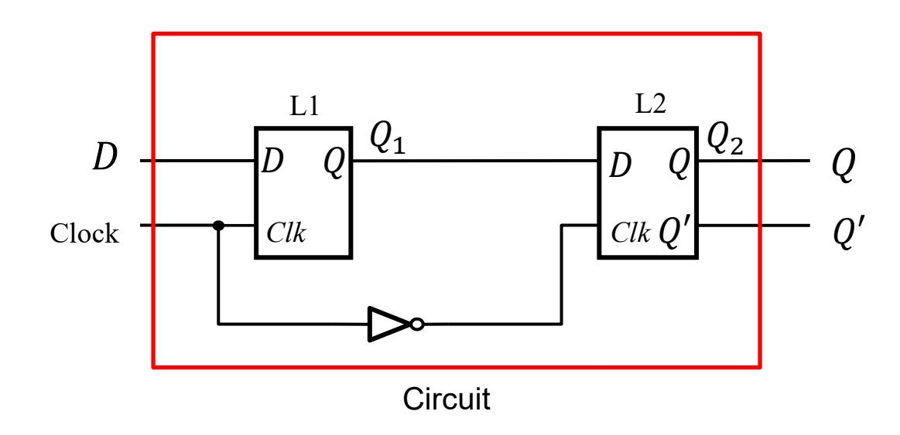

# Edge-Triggered Flip-flops (contd.)

- Since 1 does not change while Clock=0, latch L2 can undergo only one change during one clock cycle
- From the external observer's point of view (i.e., outside the red box in the previous slide), the combined circuit changes its state at the negative edge of Clock
- The timing diagram is shown below

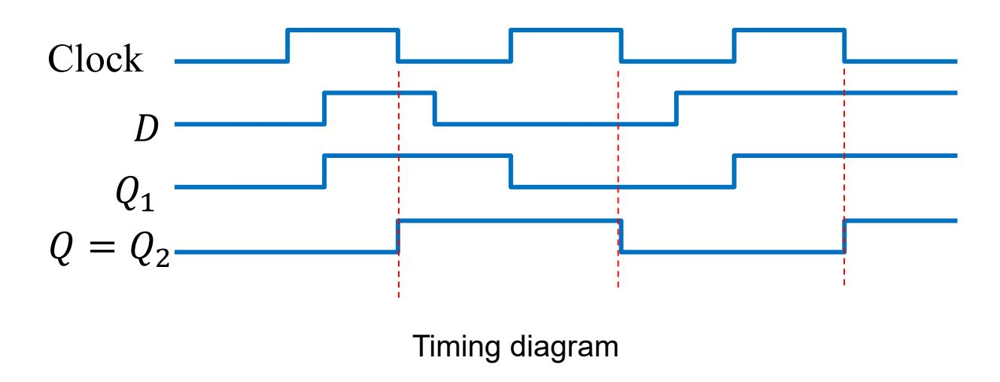

# Edge-Triggered Flip-flops (contd.)

- The previous circuit is a negative-edge-triggered D flip-flop
- The circuit can be modified to a positive-edge-triggered D flip-flop by connecting Clk of latch L2 directly to Clock and Clk of latch L1 to the complement of Clock
- Graphical symbols for the both negative- and positive-edgetriggered D flip-flops are shown below
- Timing diagrams for level-sensitive and edge-triggered D storage elements are shown in the next slide

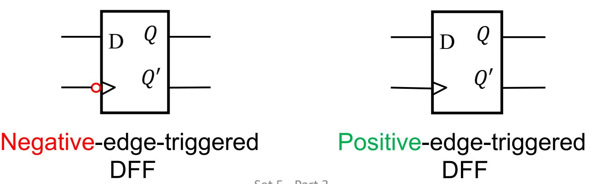

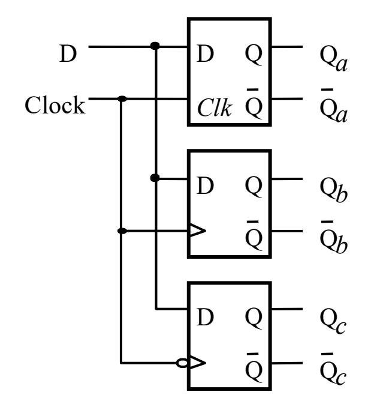

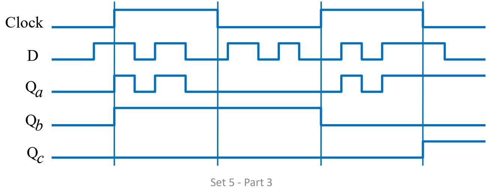

# DFF with Clear and Preset

- The circuit for edge-triggered DFF can be modified so that the state of DFF can be cleared to 0 or preset to 1.
- Clear and Preset are asynchronous operations
- Graphical symbol is given below
- A synchronous clear operation can be obtained by using a two input AND gate before D. The inputs to the AND gate will be the data input and Clear'

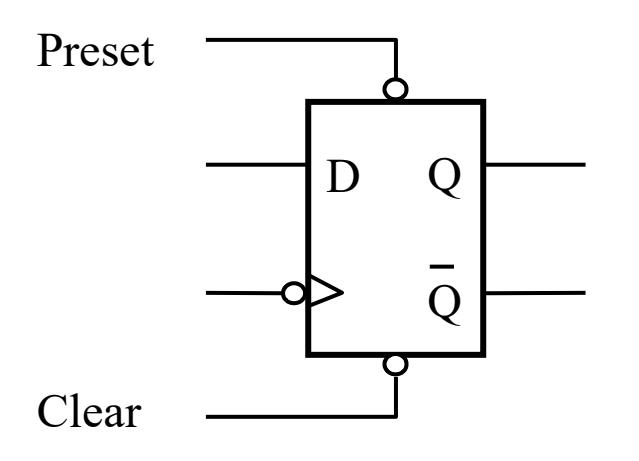

Preset and Clear are active low, i.e.,

- If Preset=0, then Q=1
- If Clear=0, then Q=0
- Both Preset and Clear should not be activated at the same time

# Timing analysis with flip-flops

- It takes time for gates to change their output values according to the input values – i.e., there are *propagation delays* due to resistance, capacitance, etc.
- Changes in flip-flop outputs occur at the *active* clock edge.
- There are three timing parameters that are especially important:
  - Setup time ()
  - Hold time (ℎ)
  - Clock-to-output time ()

# Timing analysis with flip-flops (contd.)

- The *setup time* of a flip-flop is the amount of time that the data inputs need to be held stable (not changing) PRIOR to the arrival of the active clock edge.
- The hold time of a flip-flop is the amount of time that the data inputs need to be held stable (not changing) AFTER the arrival of the active clock edge.
- The clock-to-output time of a flip-flop is the amount of time it takes for the output to become stable (at its new value) AFTER the arrival of the active clock edge.

# Timing analysis with flip-flops (contd.)

#### Comments

- If these timing specifications are not met, then it is possible that the flip-flop will not behave as expected.
  - That is, if we don't observe setup and hold times at the data inputs, then our output might not change as expected.
  - That is, if we don't wait long enough (clock-to-output time) for the output to change, then we might use an incorrect value.
- If we fail to meet any of these timing parameters, then we have a timing violation.
- These timing parameters have an influence on how fast we can clock a circuit (more to come later)

# T Flip-flop

- A circuit diagram and the characteristic table along with the graphical symbol of T flip-flop are given below. An example timing diagram is in the next slide
- T flip-flops are useful in some designs

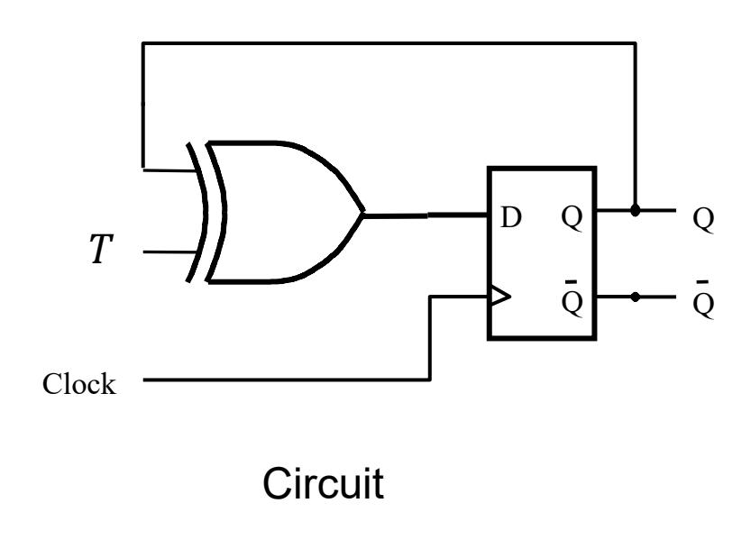

$$\begin{array}{c|c}
T & Q(t+1) \\
\hline
0 & Q(t) \\
1 & Q'(t)
\end{array}$$

Characteristic table

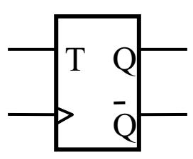

Graphical symbol

# T Flip-flop (contd.)

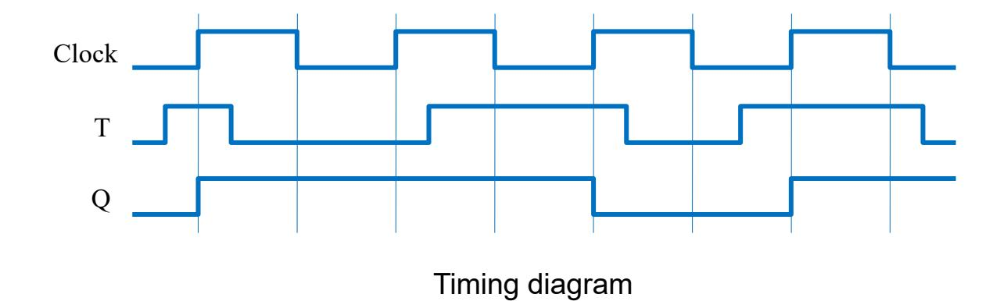

# J-K Flip-flop

- J-K flip-flops are generalization of D and T flip-flops. A circuit diagram and the characteristic table along with the graphical symbol of a J-K flip-flop are given below.
- From the table, we see that it's
  - a T flip-flop if T=J=K and
  - A D flip-flop if D=J=K'

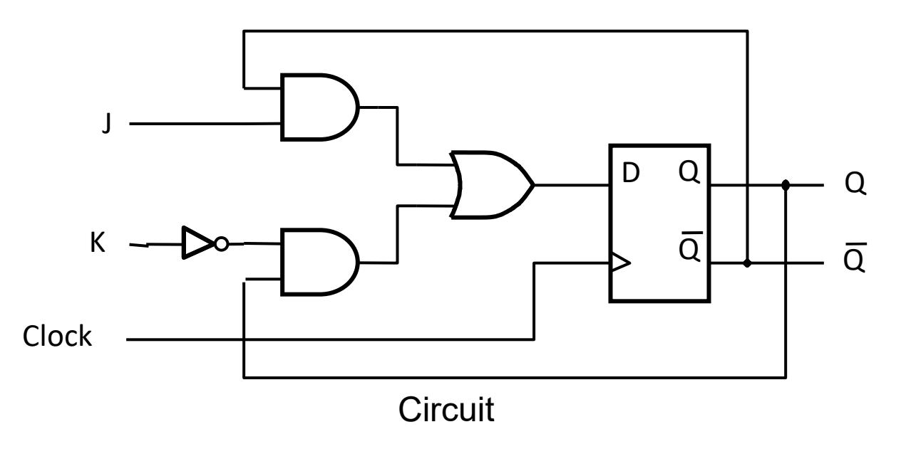

| J | K | (t+1) Q |
|---|---|------------|
| 0 | 0 | (t) Q   |
| 0 | 1 | 0          |
| 1 | 0 | 1          |
| 1 | 1 | (t) Q   |

Char. table

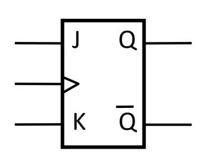

Graphical symbol

#### ECE 124 – Digital Circuits and Systems Dept. of ECE, Univ. of Waterloo

Lecture Slides: **Set 5 - Part 4**

#### Contents:

- Registers
- Asynchronous counters

©2014-2026 M. A. Hasan. These slides and notes are for the exclusive use of the students registered in the course. Reproduction in any form or use for any other purposes is prohibited.

# Registers

- A register is a digital storage; an n-bit register stores n bits.
- Registers considered here are made of flip-flops, i.e., a flipflop is a 1-bit register.
- A 4-bit register made of four D flip-flops is shown below:

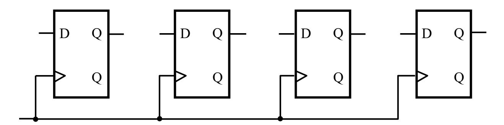

• By having additional circuits at the flip-flop inputs and outputs, the register contents can be modified in some special way (e.g., contents can be shifted, incremented, decremented, etc.)

#### Shift registers

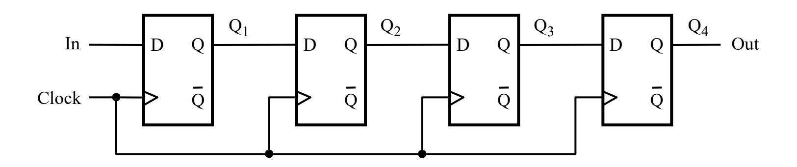

- A basic shift register using D flip-flops is shown above.
- A sample sequence of output is given at right.

|                       | In | $Q_1$ | $Q_2$ | $Q_3$ | $Q_4 = Out$ |
|-----------------------|----|-------|-------|-------|-------------|
| $t_0$                 | 1  | 0     | 0     | 0     | 0           |
| $t_1$                 | 0  | 1     | 0     | 0     | 0           |
| $t_2$                 | 1  | 0     | 1     | 0     | 0           |
| $t_3$                 | 1  | 1     | 0     | 1     | 0           |
| $t_4$                 | 1  | 1     | 1     | 0     | 1           |
| <i>t</i> 5 | 0  | 1     | 1     | 1     | 0           |
| $t_6$                 | 0  | 0     | 1     | 1     | 1           |
| $t_7$                 | 0  | 0     | 0     | 1     | 1           |

# Shift registers (contd.)

- A parallel access shift register using D flip-flops (DFF) is shown in the next slide
- It is very versatile and supports
  - serial as well as *parallel* input (i.e., load)
  - Serial as well as parallel output

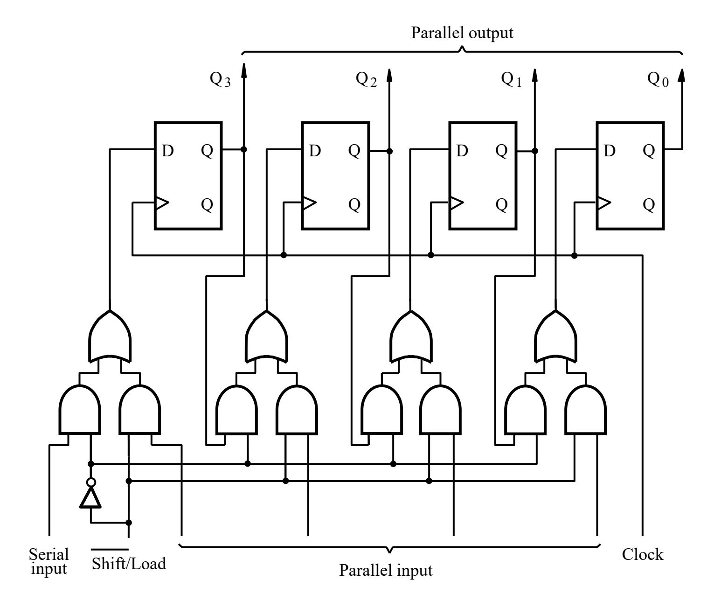

Parallel-access shift register.

# Counters

- A counter can increment or decrement (typically by 1) the "number" in its storage
- A counter that increments its number is called an up-counter.
- Similarly, a counter that decrements its number is called a down-counter.
- For increment/decrement, if the counter updates all the bits of its number at the same time, then it is called a synchronous counter; otherwise it's an asynchronous counter

#### T flip-flop based asynchronous counter

- A three-bit up-counter using T flip-flop is shown below.
- The output bits correspond the binary number  $(Q_2Q_1Q_0)_2$ , i.e.,  $Q_0$  is the least significant bit and  $Q_2$  is the most significant bit
- Note all T inputs are connected to 1
- $\bar{Q}=Q'$  of one flip-flop is the Clk input to the next flip-flop at right
- Its timing diagram is shown in the next slide and there we see that not all output bits change at the same time. Hence it's called an asynchronous counter

Set 5 - Part 4

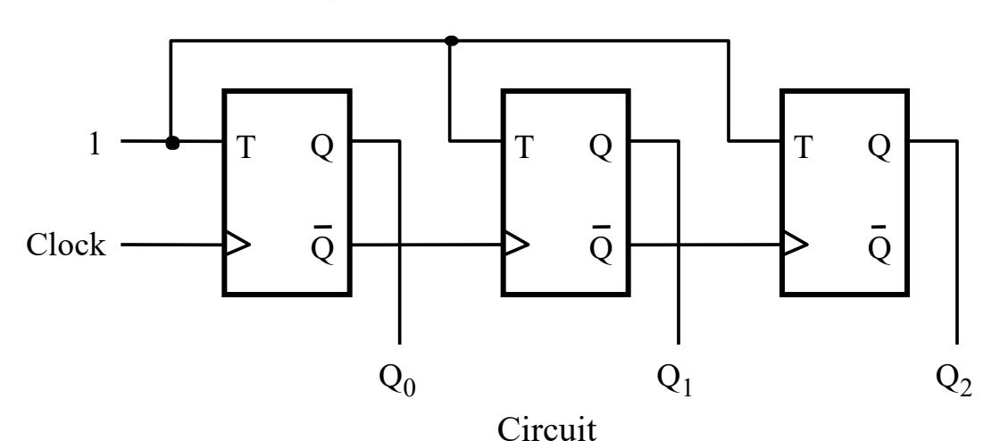

Yours to do: modify the circuit to make it a *down*-counter

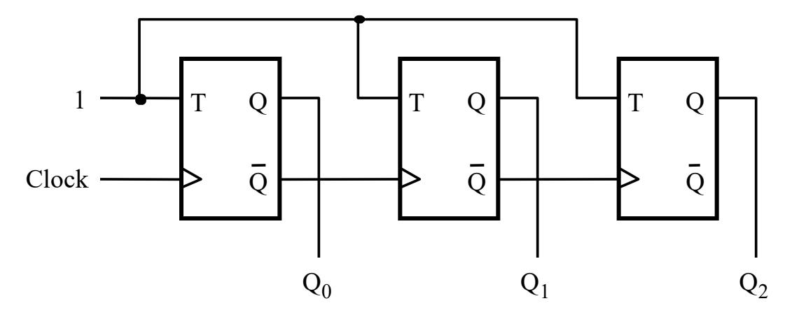

Circuit (from the previous slide)

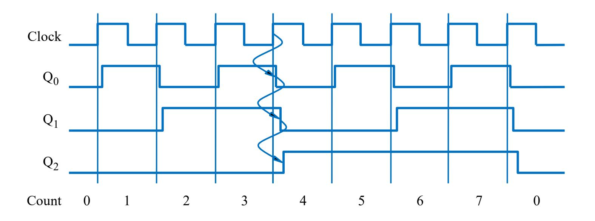

Timing diagram

#### ECE 124 – Digital Circuits and Systems Dept. of ECE, Univ. of Waterloo

Lecture Slides: **Set 5 - Part 5**

#### Contents:

• Synchronous counters

©2014-2026 M. A. Hasan. These slides and notes are for the exclusive use of the students registered in the course. Reproduction in any form or use for any other purposes is prohibited.

# T flip-flop based synchronous counters

Note how an output bit (say 2) changes in the table at right

- ‐ 2 changes (0 to 1, or 1 to 0) when lower significant bits (i.e., 1and 0) are both 1
- This can be generalized for other bits

Circuit and timing diagrams of a synchronous up-counter using T flip-flops are shown in the next slide

| Clock cycle                     | Q Q Q 2 1 0                                                                                                                      |
|---------------------------------|-------------------------------------------------------------------------------------------------------------------------------------------------|
| 0 1 2 3 4 5 6 | Q changes 1 0 0 0 Q changes 2 0 1 0 0 1 0 0 1 1 1 0 0 1 0 1 1 1 0 |
| 7 8                          | 1 1 1 0 0 0                                                                                                                      |

Derivation of a synchronous up-counter

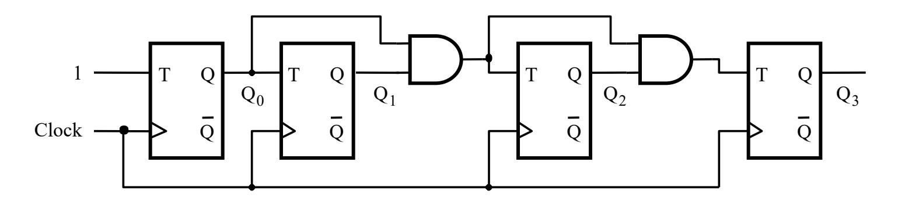

#### Circuit

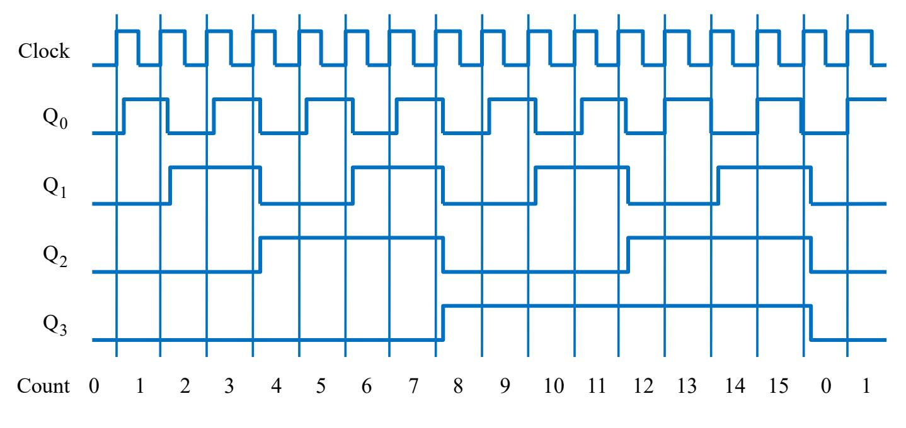

Timing diagram

A four-bit synchronous up-counter.

# Synchronous counters with Enable and Clear Capability

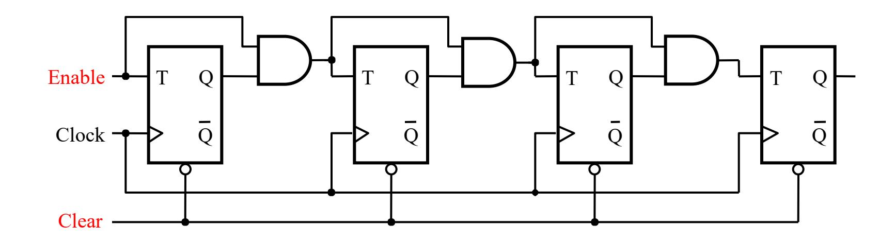

#### D flip-flop based counters

Note that:

 When one input of an XOR is 1, its output is the complement of the other input

In the diagram

 $D_0 = Q_0 \oplus \text{Enable}$ 

 $D_1 = Q_1 \oplus (Q_0 \cdot \text{Enable})$ 

 $D_2 = Q_2 \oplus (Q_1 \cdot Q_0 \cdot \text{Enable})$ 

 $D_3 = Q_3 \oplus (Q_2 \cdot Q_1 \cdot Q_0 \cdot \text{Enable})$ 

 This is similar to what we saw earlier for designing a synchronous counter with T flip-flops

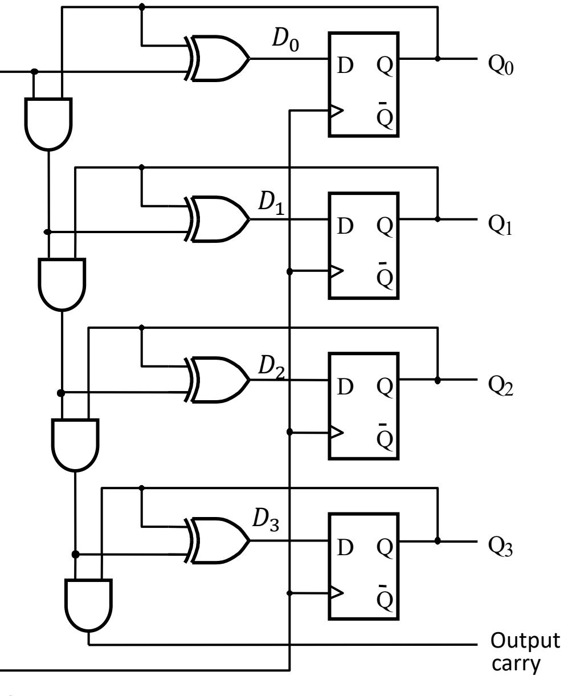

Clock

Enable

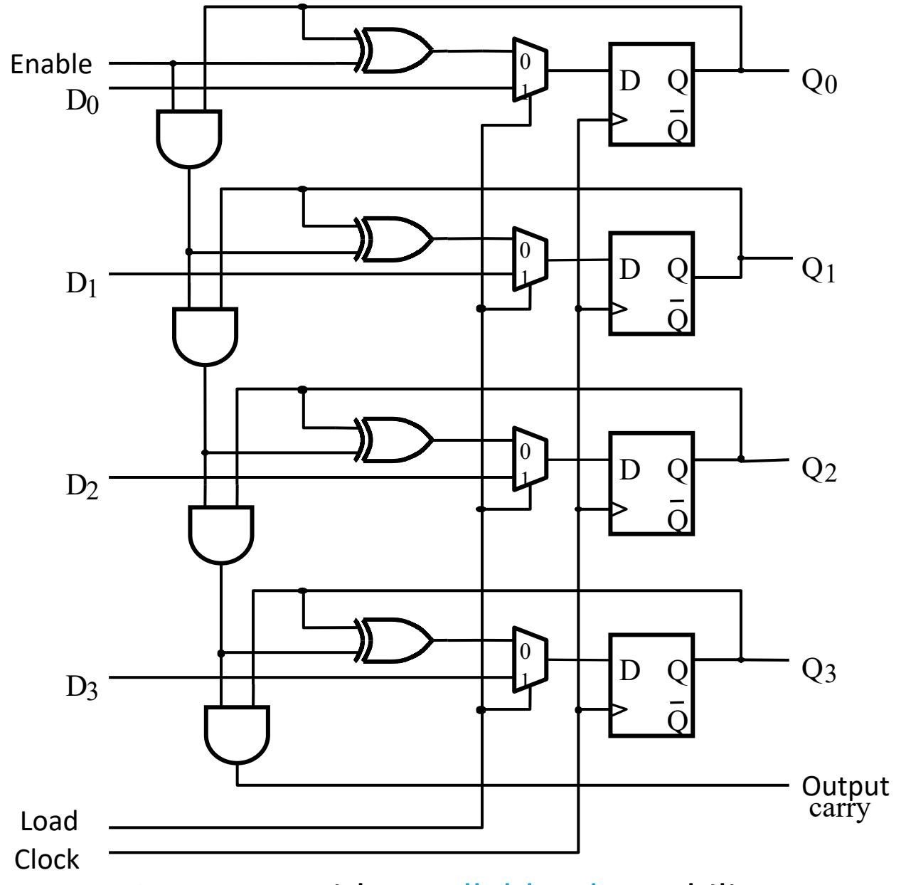

A counter with parallel-load capability

Set 5 - Part 5

6

#### Modulo-*n* counter

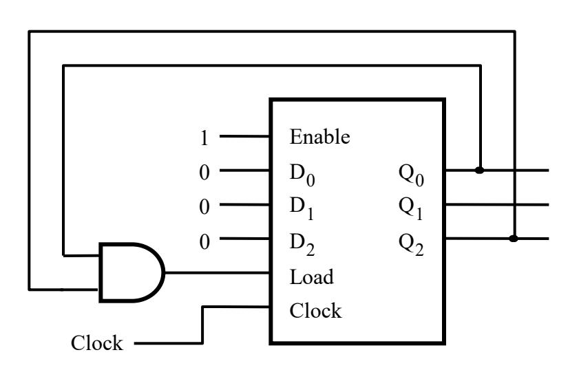

Block diagram

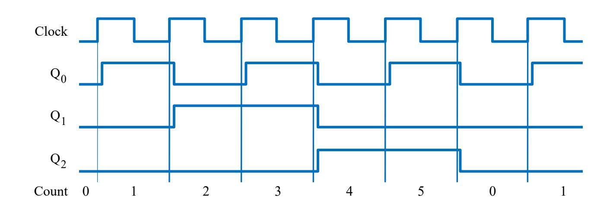

Timing diagram

A modulo-6 counter with synchronous reset.

# Johnson Counter

- A 4-bit Johnson counter is shown below.
- It produces the sequence 0000, 1000, 1100, 1110, 1111, 0111, 0011, 0001, 0000, and so on

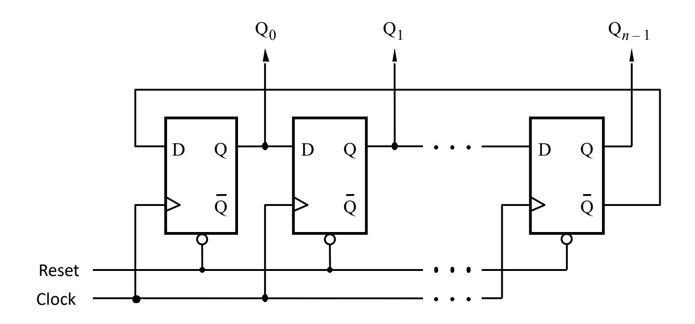

# Other useful counters

- Ring counter
  - Only one output bit is one at any time
  - A 4-bit ring counter produces the sequence 1000, 0100, 0010, 0001, 1000 and so on
  - It can be designed with a DFF based shift register (shown earlier) with the following two minor changes
    - to start the counter operation, the first DFF is Preset to 1 and all other DFFs are Cleared to 0 (all asynchronously)
    - the output of the last DFF is connected to the input of the first DFF
- BCD counter (Reading assignment)