#### ECE 124 – Digital Circuits and Systems Dept. of ECE, Univ. of Waterloo

Lecture Slides: **Set 6 - Part 1**

#### Contents:

• Introduction to synchronous sequential circuits

©2014-2026 M. A. Hasan. These slides and notes are for the exclusive use of the students registered in the course. Reproduction in any form or use for any other purposes is prohibited.

## **Introduction**

- A synchronous sequential circuit (a.k.a. *finite state machine*  FSM) is realized using combinational logic and flip-flops
- The general form of a sequential circuit is shown below, where
  - W: circuit input
  - Q: flip-flop output or current state
  - Z: circuit output

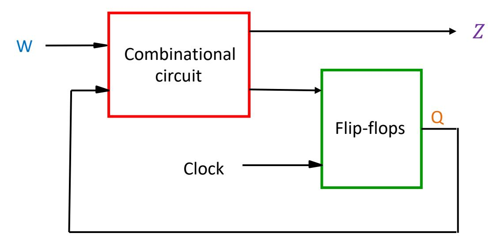

## **Moore machine**

- It is a special case where circuit output () depends only on the *current state*
- Note that
  - In a Moore machine, output changes *synchronously* with the clock (i.e., output changes at predictable times – at the clock edges)

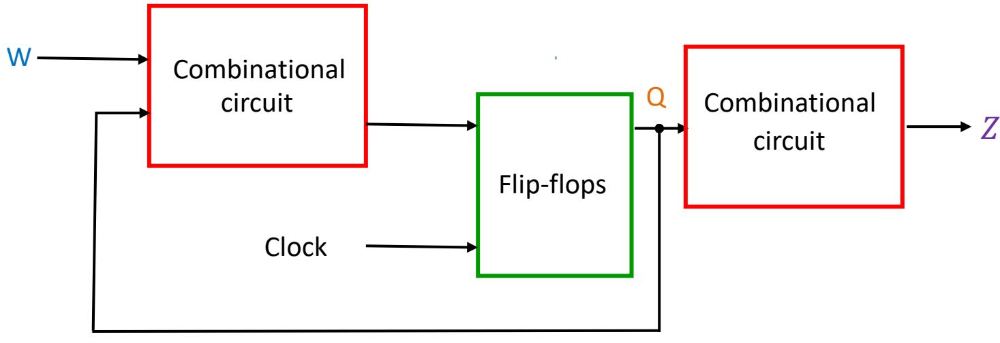

## **Mealy machine**

- When the output () depends on the current state and the input, we call the circuit Mealy machine
- Note that
  - In a Mealy machine, the output changes *asynchronously* with the clock (i.e., output can change at any time)

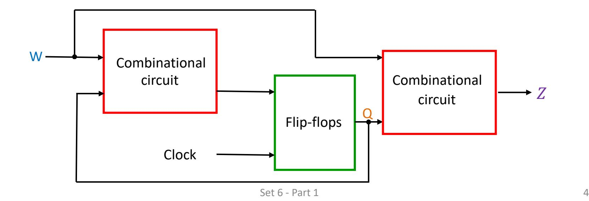

#### ECE 124 – Digital Circuits and Systems Dept. of ECE, Univ. of Waterloo

Lecture Slides: **Set 6 - Part 2**

#### Contents:

• Moore machine example

©2014-2026 M. A. Hasan. These slides and notes are for the exclusive use of the students registered in the course. Reproduction in any form or use for any other purposes is prohibited.

### An example circuit specification

- The circuit has one input w and one output z
- All changes in the circuit occur on the positive edge of a clock signal
- The output z is equal to 1 if during two immediately preceding clock cycles the input w was equal to 1.
  Otherwise the value of z is equal to 0

This is illustrated for eleven cycles in the following table

| Clockcycle: | t 0 | t 1 | t 2 | t 3 | t 4 | t 5 | t 6 | t 7 | t 8 | t 9 | t 10 |
|-------------|----------------|----------------|----------------|----------------|----------------|----------------|----------------|----------------|----------------|----------------|-----------------|
| w:          | 0              | 1              | 0              | 1              | 1              | 0              | 1              | 1              | 1              | 0              | 1               |
| Z:          | 0              | 0              | 0              | 0              | 0              | 1              | 0              | 0              | 1              | 1              | 0               |

## **State diagram**

- Behavior of a sequential circuit can be described pictorially in the form of state diagram
- A state diagram is a graph consisting of nodes (circles) and directed arcs, where
  - nodes represent circuit states and
  - arcs represent transitions between states
- The state diagram in the next slide defines the behavior corresponding to circuit specification given in the previous slide

## **State diagram (contd.)**

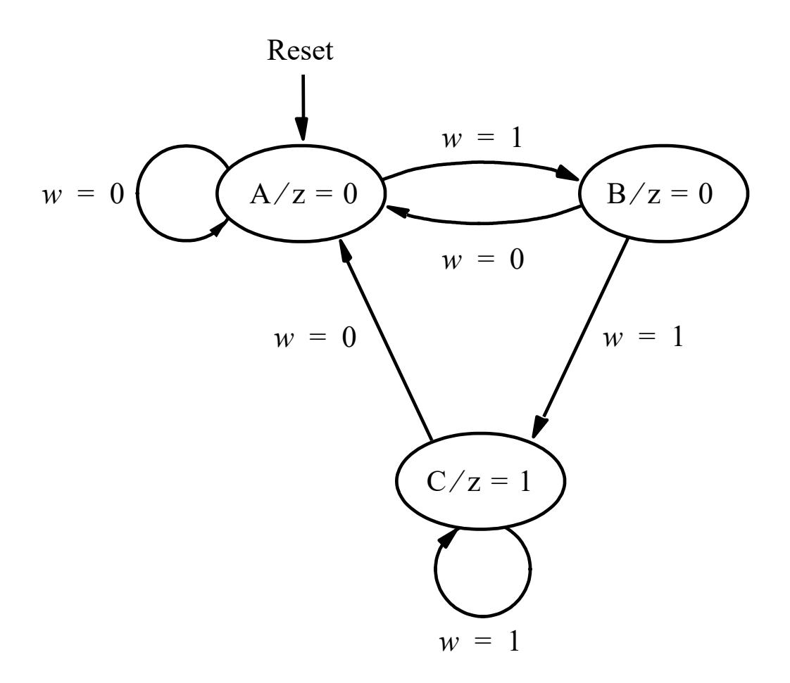

The diagram is explained in the following two slides

### State diagram (contd.)

- Node A represents the <u>starting</u> state and it is also the state the circuit will reach after an input w=0 is applied.
  - In this state, output z is 0, which is indicated as A/z=0 in the node
  - The circuit remains in state A as long as w=0 (indicated by an arc with a label w=0 that originates and terminates at this node)
- Number of arcs originating from a node is  $2^n$ , where n is the number of inputs (in this example, n=1)

### State diagram (contd.)

- The first occurrence of w=1 following w=0 pushes the state from A to B (indicated by an arc labeled as w=1, originating from A and terminating at B)
  - In state B, the output remains at 0, which is indicated as B/z=0 in the node
  - Like state A, there are two arcs originating from B (for w=0 and w=1)
- If w=1 is applied while in state B, the circuit will change to state C, where the output z is 1 (indicated by C/z=1)
  - Circuit will remain in state C until w=0 is applied.

## **State table**

- A state table (a.k.a. *transition* table) describes the behavior of a sequential circuit in tabular form
- The following is the tabular representation of the state diagram shown a few slides earlier

| Present | Next state  | Output   |   |
|---------|-------------|----------|---|
| state   | w = 0 | w = 1 | z |
| A       | A           | B        | 0 |
| B       | A           | C        | 0 |
| C       | A           | C        | 1 |

### State-assigned table

- Assume that states A, B and C are represented as  $y_2y_1$ =00,  $y_2y_1$ =01, and  $y_2y_1$ =10, respectively. (11 not used here)
- Let  $Y_1$  and  $Y_2$  be the *next-state* variables. Then

|   | Present  | Next s   |          |        |
|---|----------|----------|----------|--------|
|   | state    | w = 0    | w = 1    | Output |
|   |          |          |          | Z      |
|   | $y_2y_1$ | $Y_2Y_1$ | $Y_2Y_1$ |        |
| Α | 00       | 00       | 01       | 0      |
| В | 01       | 00       | 10       | 0      |
| С | 10       | 00       | 10       | 1      |
|   | 11       | dd       | dd       | d      |

• Using K-maps with don't cares, we can write  $Y_1=wy'_1y'_2$ ,  $Y_2=w(y_1+y_2)$ , and  $z=y_2$ 

## **Circuit block diagram**

- Since there are three states in our example, at least two flipflops are needed.
- Below is a generic block diagram, where 1 and 2 are the *present-state* variables

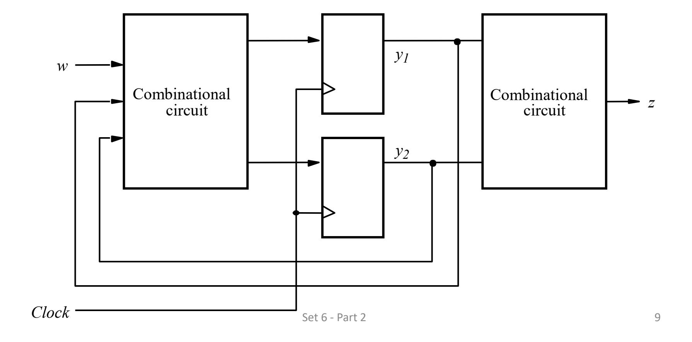

## **DFF based circuit diagram**

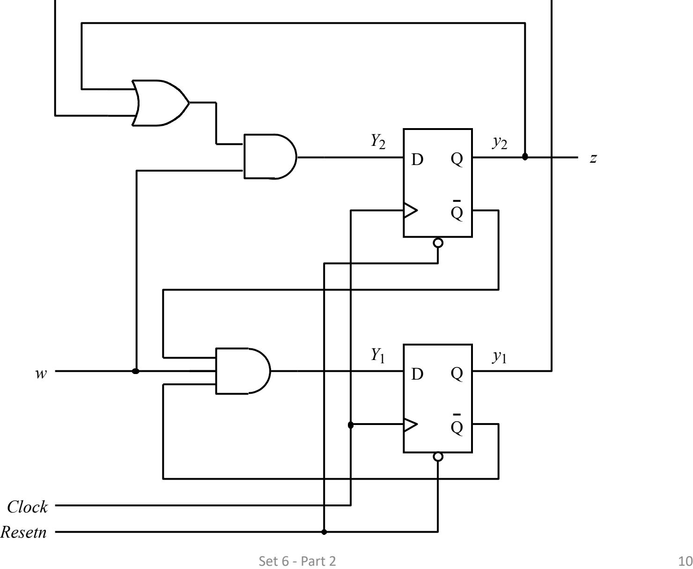

## **Improved state assignment**

• This time assume that states A, B and C are represented as 21=00, 21=01, and 21=11, respectively. (21=10 not used). Then

|   | Present          |                  | Next state       |        |
|---|------------------|------------------|------------------|--------|
|   | state            | w = 0            | w = 1            | Output |
|   | y y 2 1 | Y Y 2 1 | Y Y 2 1 | z      |
| A | 00               | 00               | 01               | 0      |
| B | 01               | 00               | 11               | 0      |
| C | 11               | 00               | 11               | 1      |
|   | 10               | dd               | dd               | d      |

• Assuming DFF and using K-maps with don't cares, we can write 1= , 2=1, and = 2 leading to a simpler circuit …

## **Circuit diagram with fewer gates**

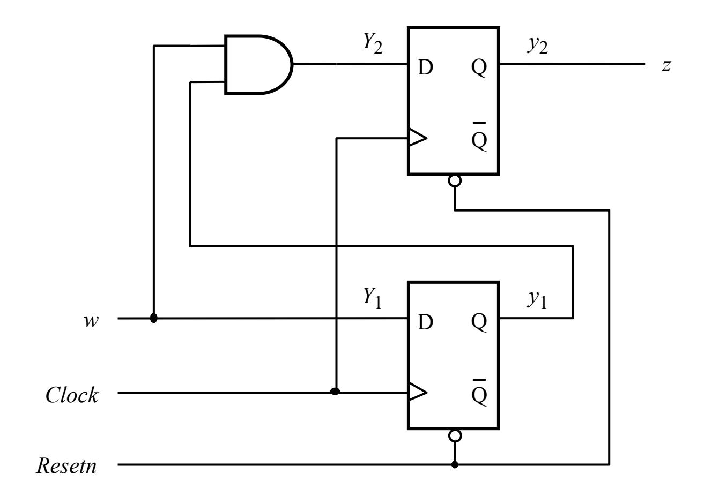

## **One-hot state assignment**

- It uses as many state variables as there are states in a sequential circuit
- For each state, all but one of the state variables are equal to 0
- Although requires more FFs, it is attractive in some cases

|   | Present                    | Nextstate                  |                            |        |
|---|----------------------------|----------------------------|----------------------------|--------|
|   | state                      | w = 0                      | w = 1                      | Output |
|   | y y y 3 2 1 | Y Y Y 3 2 1 | Y Y Y 3 2 1 | z      |
| A | 001                        | 001                        | 010                        | 0      |
| B | 010                        | 001                        | 100                        | 0      |
| C | 100                        | 001                        | 100                        | 1      |

• Yours to do: find logic expressions for 1, 2, 3 and

## **Summary of design steps**

- 1. Obtain circuit specification
- 2. Draw a state diagram
  - a. Derive the states of the machine by first selecting a starting state.
  - b. Then, follow the specification to complete drawing a state diagram
- 3. Create a state table from the state diagram (step 3 can be done directly bypassing step 2)
- 4. If possible, minimize the number of states
- 5. Decide on the number of state variables
- 6. Flip-flops and logic expressions
  - a. Choose the type of flip-flops to be used in the circuit
  - b. Derive the next-state logic expressions to control the inputs to all flip-flops
  - c. Then derive logic expressions for the outputs
- 7. Implement circuits as indicated by the logic expressions

#### ECE 124 – Digital Circuits and Systems Dept. of ECE, Univ. of Waterloo

Lecture Slides: **Set 6 - Part 3**

#### Contents:

• Mealy machine example

©2014-2026 M. A. Hasan. These slides and notes are for the exclusive use of the students registered in the course. Reproduction in any form or use for any other purposes is prohibited.

## **A Mealy example**

The following sequence corresponds to a slightly different behavior than what we considered for the Moore machine (output z is shifted one cycle forward)

| Clock cycle: | t 0 | t 1 | t 2 | t 3 | t 4 | t 5 | t 6 | t 7 | t 8 | t 9 | t 10 |
|--------------|--------|--------|--------|--------|--------|--------|--------|--------|--------|--------|---------|
| w :          | 0      | 1      | 0      | 1      | 1      | 0      | 1      | 1      | 1      | 0      | 1       |
| z :          | 0      | 0      | 0      | 0      | 1      | 0      | 0      | 1      | 1      | 0      | 0       |

## **Mealy state diagram**

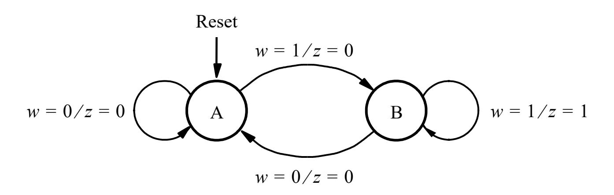

In a Mealy machine, the output depends on the current state as well as the present input. Hence the outputs are not shown in the nodes, rather they are shown at the arcs.

## **State table and state assigned table**

| Present |       | Next state | Output | z     |
|---------|-------|------------|--------|-------|
| state   | w = 0 | w = 1      | w = 0  | w = 1 |
| A       | A     | B          | 0      | 0     |
| B       | A     | B          | 0      | 1     |

|   | Present |       | Next state | Output |       |  |  |
|---|---------|-------|------------|--------|-------|--|--|
|   | state   | w = 0 | w = 1      | w = 0  | w = 1 |  |  |
|   | y       | Y     | Y          | z      | z     |  |  |
| A | 0       | 0     | 1          | 0      | 0     |  |  |
| B | 1       | 0     | 1          | 0      | 1     |  |  |

## **Circuit diagram**

• Note that = and = , hence

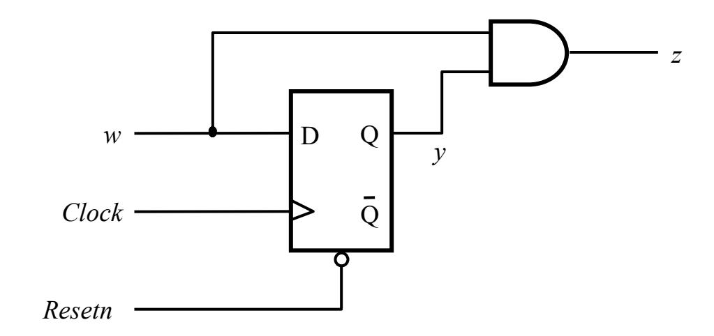

If a DFF is added after the AND gate, the Mealy machine becomes exactly the Moore machine we saw earlier.

#### ECE 124 – Digital Circuits and Systems Dept. of ECE, Univ. of Waterloo

Lecture Slides: **Set 6 - Part 4**

#### Contents:

• State minimization in synchronous sequential circuits

©2014-2026 M. A. Hasan. These slides and notes are for the exclusive use of the students registered in the course. Reproduction in any form or use for any other purposes is prohibited.

#### State minimization

- A synchronous sequential circuit that has n states requires at least  $\lceil \log_2 n \rceil$  flip-flops. For example, a 3-state circuit requires at least 2 flip-flops
- By reducing the number of states we can reduce the number of flip-flops
- If two states are equivalent to each other, we can combine them into a single state
- Two states are said to be *equivalent* if the following conditions are true
  - i. For each circuit input, the states give exactly the same output and
  - ii. For each circuit input, the states give the *same next* state or an *equivalent next state*

## **State minimization through partitioning**

### Procedure:

- 1. Partition states according to circuit outputs produced
- 2. For each partition, iteratively do the following: For any input pattern, if different states in a partition result in a transition to different other partition, then those states are not equivalent and we separate them into smaller partitions
- 3. Continue partitioning until all the states in any partition transition to the same other partition for any input pattern
- 4. Once no further partitioning is required, identification of the equivalent states is complete

### State minimization through partitioning (contd.)

Consider the following state table for a circuit with one input (w) and one output (z)

| Present state | Next | state | Output (z) |  |
|------------------|------|-------|---------------|--|
| State            | w=0  | w=1   | (2)           |  |
| А                | В    | С     | 1             |  |
| В                | D    | F     | 1             |  |
| С                | F    | Е     | 0             |  |
| D                | В    | G     | 1             |  |
| E                | F    | С     | 0             |  |
| F                | E    | D     | 0             |  |
| G                | F    | G     | 0             |  |

Note that states A, B and D produce z=1, and the other states produce z=0. Hence, states can be partitioned as (ABCDEFG) = (ABD) (CEFG)

Note that (ABD) has the following next-state groups :

- (*BDB*) if w=0 and
- (*CFG*)if w=1

which do not violate the partitioning shown above. Hence states in (ABD) may be equivalent; but this needs to be re-evaluated if the above partitioning changes. Details follow ...

### State minimization through partitioning (contd.)

| Present state | Next (N | Output (z) |   |
|---------------|------------|---------------|---|
|               | w=0        | w=1           |   |
| А             | В          | С             | 1 |
| В             | D          | F             | 1 |
| С             | F          | Е             | 0 |
| D             | В          | G             | 1 |
| E             | F          | С             | 0 |
| F             | Е          | D             | 0 |
| G             | F          | G             | 0 |

Note: A  $\leftarrow$  Indicates that for a given input the NS are in different partitions

(AD)

NS:

w=1: (CG)Set 6 - Part 4

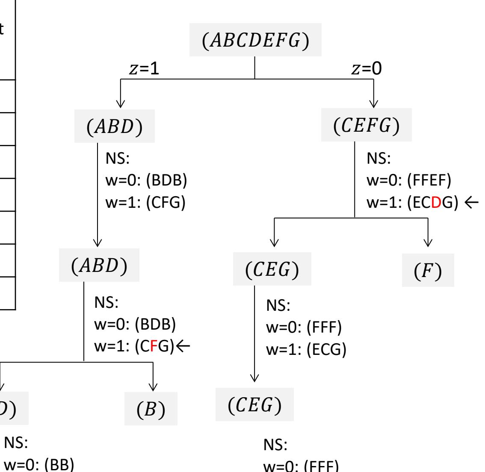

w=1: (ECG)

## **State minimization through partitioning (contd.)**

- Thus, states A and D are equivalent. Similarly, states C, E and G are equivalent.
- Now, we can remove rows with Present states D, E and G (see the table on the previous slide)
- Then in the Next state column, we can replace
  - D by A and
  - E and G by C
- The resulting table has only four states and is shown below

| Present | Next | state | Output |
|---------|------|-------|--------|
| state   | 𝑤𝑤=0 | 𝑤𝑤=1  | (z)    |
| A       | B    | C     | 1      |
| B       | A    | F     | 1      |
| C       | F    | C     | 0      |
| F       | C    | A     | 0      |

#### ECE 124 – Digital Circuits and Systems Dept. of ECE, Univ. of Waterloo

Lecture Slides: **Set 6 - Part 5**

#### Contents:

• Flip-flop choices in synchronous sequential circuits

©2014-2026 M. A. Hasan. These slides and notes are for the exclusive use of the students registered in the course. Reproduction in any form or use for any other purposes is prohibited.

## **Use of different types of flip-flops**

- So far, we have only used DFFs to realize current states
- DFF is an obvious choice because the FF input equations are the next state equations
- Other types of flip-flops (e.g., TFF and JKFF) may be used (and may lead to less expensive circuits)
- For TFF and JKFF, the flip-flop input equations are not the next state equations and need to be derived as follows:
  - Based on the FF excitation table, determine how the FF input must be set to get the next state from the current state
- An excitation table for a FF is just an expanded form of its characteristic table showing current inputs and outputs that excite the next outputs

#### **FF** excitation tables

| D | Q(t+1) |
|---|--------|
| 0 | 0      |
| 1 | 1      |

| D | Q(t) | Q(t+1) |
|---|------|--------|
| 0 | 0    | 0      |
| 1 | 0    | 1      |
| 0 | 1    | 0      |
| 1 | 1    | 1      |

2) DFF excitation table [Clearly, 
$$Q(t + 1) = D$$
]

| T | Q(t+1) |
|---|--------|
| 0 | Q(t)   |
| 1 | Q'(t)  |

3) TFF characteristic table

| T | Q(t) | Q(t+1) |
|---|------|--------|
| 0 | 0    | 0      |
| 1 | 0    | 1      |
| 0 | 1    | 1      |
| 1 | 1    | 0      |

4) TFF excitation table [Note that Q(t+1)=TQ'(t)+T'Q(t), i.e., if Q(t)=0, then Q(t+1)=T, else Set 6 - Part 5 Q(t+1)=T']

### FF excitation tables (contd.)

| J | K | Q(t+1) |
|---|---|--------|
| 0 | 0 | Q(t)   |
| 0 | 1 | 0      |
| 1 | 0 | 1      |
| 1 | 1 | Q'(t)  |

5) JKFF characteristic table

| J | K | Q(t) | Q(t+1) |
|---|---|------|--------|
| 0 | Х | 0    | 0      |
| 1 | Χ | 0    | 1      |
| X | 0 | 1    | 1      |
| X | 1 | 1    | 0      |

7) JKFF excitation table (short form)

| J  | K | Q(t) | Q(t+1) |
|----|---|------|--------|
| 0  | 0 | 0    | 0      |
| 0  | 0 | 1    | 1      |
| 0  | 1 | 0    | 0      |
| 0  | 1 | 1    | 0      |
| 1  | 0 | 0    | 1      |
| 1  | 0 | 1    | 1      |
| 1  | 1 | 0    | 1      |
| _1 | 1 | 1    | 0      |

6) JKFF excitation table

#### Note that:

- Q(t+1)=J Q'(t) + K' Q(t)
- l.e.,
  - if Q(t)=0, then Q(t+1)=J and
  - if Q(t)=1, then Q(t+1)=K'

## **Excitation tables for an example circuit**

• Consider the following state-assignment table for a sequential circuit

|   | Present            | Next state         |                    |   |
|---|--------------------|--------------------|--------------------|---|
|   | state              | w = 0        | Output             |   |
|   |                    |                    |                    | z |
|   | 𝑦𝑦 𝑦𝑦 2 1 | 𝑌𝑌 𝑌𝑌 2 1 | 𝑌𝑌 𝑌𝑌 2 1 |   |
| A | 00                 | 00                 | 01                 | 0 |
| B | 01                 | 00                 | 10                 | 0 |
| C | 10                 | 00                 | 10                 | 1 |
|   | 11                 | dd                 | dd                 | d |

• The corresponding excitation tables using D, T and JK flip-flops follow

### Excitation tables for an example circuit (contd.)

Excitation table using DFFs

| Present  | Next state |          |          |          |   |
|----------|------------|----------|----------|----------|---|
| state    | w=0        |          | =1       | Output   |   |
| $y_2y_1$ | $Y_2Y_1$   | $D_2D_1$ | $Y_2Y_1$ | $D_2D_1$ |   |
| 00       | 00         | 00       | 01       | 01       | 0 |
| 01       | 00         | 00       | 10       | 10       | 0 |
| 10       | 00         | 00       | 10       | 10       | 1 |
| 11       | dd         | dd       | dd       | dd       | d |

- Note that  $y_1$  and  $y_2$  can be viewed as  $Q_1(t)$  and  $Q_2(t)$ , respectively. Similarly,  $Y_1$  and  $Y_2$  can be viewed as  $Q_1(t+1)$  and  $Q_2(t+1)$ , respectively.
- Using K-maps with don't cares, we can write

$$D_1 = wy_1'y_2', D_2 = w(y_1 + y_2)$$

### **Excitation tables for an example circuit (contd.)**

Excitation table using TFFs

| Present  | Next stat |            |          |          |             |
|----------|-----------|------------|----------|----------|-------------|
| state    | w=0       |            | w=1      |          | Output z |
| $y_2y_1$ | $Y_2Y_1$  | $T_2T_1$   | $Y_2Y_1$ | $T_2T_1$ | 2           |
| 00       | 00        | 00         | 01       | 01       | 0           |
| 01       | 00        | 01         | 10       | 11       | 0           |
| 10       | 00        | <b>1</b> 0 | 10       | 00       | 1           |
| 11       | dd        | dd         | dd       | dd       | d           |

- Recall that for TFF, Q(t+1)=TQ'(t)+T'Q(t), i.e., if Q(t)=0, then Q(t+1)=T, else Q(t+1)=T'. This is used in completing the columns with titled  $T_2T_1$
- We can write

$$T_1 = w'y_1 + wy_2', T_2 = w'y_2 + wy_1$$

### **Excitation tables for an example circuit (contd.)**

Excitation table using JKFFs

| Present  | Next state $(Y_2Y_1)$ & flip-flop input $(J_iK_i)$ |            |            |          |            |            |   |
|----------|----------------------------------------------------|------------|------------|----------|------------|------------|---|
| state    | w=0                                                |            | w=1        |          |            | Output     |   |
| $y_2y_1$ | $Y_2Y_1$                                           | $J_2K_2$   | $J_1K_1$   | $Y_2Y_1$ | $J_2K_2$   | $J_1K_1$   |   |
| 00       | 00                                                 | 0 <i>d</i> | 0 <i>d</i> | 01       | 0 <i>d</i> | 1 <i>d</i> | 0 |
| 01       | 00                                                 | 0 <i>d</i> | d1         | 10       | 1 <i>d</i> | d1         | 0 |
| 10       | 00                                                 | d1         | 0 <i>d</i> | 10       | d0         | 0 <i>d</i> | 1 |
| 11       | dd                                                 | dd         | dd         | dd       | dd         | dd         | d |

- Recall that for JKFF, if Q(t) = 0, then Q(t+1) = J and if Q(t) = 1, then Q(t+1) = K'. This is used in completing the columns with titled  $(J_iK_i)$
- We can write (assuming that the above table is correct)  $J_1 = wy_2'$ ,  $K_1 = 1$ ,  $J_2 = wy_1$ ,  $K_2 = w'$  which cost less than the designs based on DFF and TFF

#### ECE 124 – Digital Circuits and Systems Dept. of ECE, Univ. of Waterloo

Lecture Slides: **Set 6 - Part 6**

#### Contents:

• Analysis of synchronous sequential circuits

©2014-2026 M. A. Hasan. These slides and notes are for the exclusive use of the students registered in the course. Reproduction in any form or use for any other purposes is prohibited.

## **Analysis of synchronous sequential circuits**

- Given a synchronous sequential circuit, analysis involves figuring out the circuit behavior, i.e., a state table or diagram for the circuit
- Analysis is the reserve task of synthesis or design
- Basic steps are the following
  - 1. Write down the logic expressions for the circuit outputs and the flip-flop inputs
  - 2. Use the logic expressions to derive a state table which describe the next state and circuit outputs

### Analysis of synchronous sequential circuits (contd.)

### Consider the following circuit

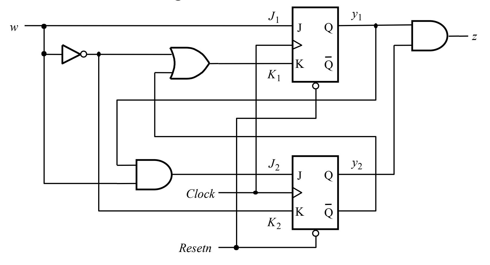

We can easily write

output  $z=y_1y_2$ , and FF input  $J_1=w$ ,  $K_1=w'+y_2'$ ,  $J_2=wy_1$ , and  $K_2=w'$ 

### Analysis of synchronous sequential circuits (contd.)

The excitation table for the circuit is given below

| Present               |                               |        |                               |        |        |
|-----------------------|-------------------------------|--------|-------------------------------|--------|--------|
| state                 | w =                           | = 0    | w =                           | = 1    | Output |
| <i>y</i> 2 <i>y</i> 1 | J 2 K 2 | J 1K 1 | J 2 K 2 | J 1K 1 | Z      |
| 00                    | 01                            | 0 1    | 0 0                           | 11     | 0      |
| 01                    | 01                            | 0 1    | 10                            | 11     | 0      |
| 10                    | 01                            | 0 1    | 0 0                           | 10     | 0      |
| 11                    | 01                            | 0 1    | 10                            | 10     | 1      |

From the excitation table for JKFF,

- $y_i = 0$  means the corresponding  $Y_i = J_i$
- $y_i = 1$  means the corresponding  $Y_i = K'_i$

Thus we have the following state table

# **Analysis of synchronous sequential circuits (contd.)**

| Present            | Next state         |                    |        |  |
|--------------------|--------------------|--------------------|--------|--|
| state              | w = 0        | w = 1        | Output |  |
|                    |                    |                    |        |  |
| 𝑦𝑦 𝑦𝑦 2 1 | 𝑌𝑌 𝑌𝑌 2 1 | 𝑌𝑌 𝑌𝑌 2 1 |        |  |
| 00                 | 00                 | 01                 | 0      |  |
| 01                 | 00                 | 10                 | 0      |  |
| 10                 | 00                 | 11                 | 0      |  |
| 11                 | 00                 | 11                 | 1      |  |