#### ECE 124 – Digital Circuits and Systems Dept. of ECE, Univ. of Waterloo

Lecture Slides: **Set 7 - Part 1**

#### Contents:

• Introduction to asynchronous sequential circuits

©2014-2026 M. A. Hasan. These slides and notes are for the exclusive use of the students registered in the course. Reproduction in any form or use for any other purposes is prohibited.

# **Introduction**

- An asynchronous sequential circuit (ASC)
  - ₋ does not have any clock input (i.e., no FFs) and
  - ₋ consists of combinational logic with feedback paths
- The feedback creates a memory effect (e.g., SR latch)
- General form of an ASC is shown below, where
  - W: circuit input
  - Q: Feedback or current state
  - Z: circuit output

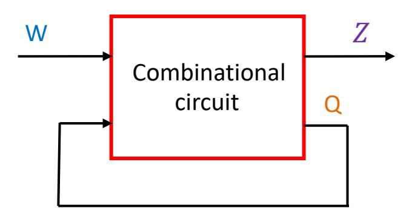

Note that W, Z and Q can each be of multiple bits

### Introduction (contd.)

Like its synchronous counterpart, an asynchronous sequential circuit can be either Moore or Mealy type

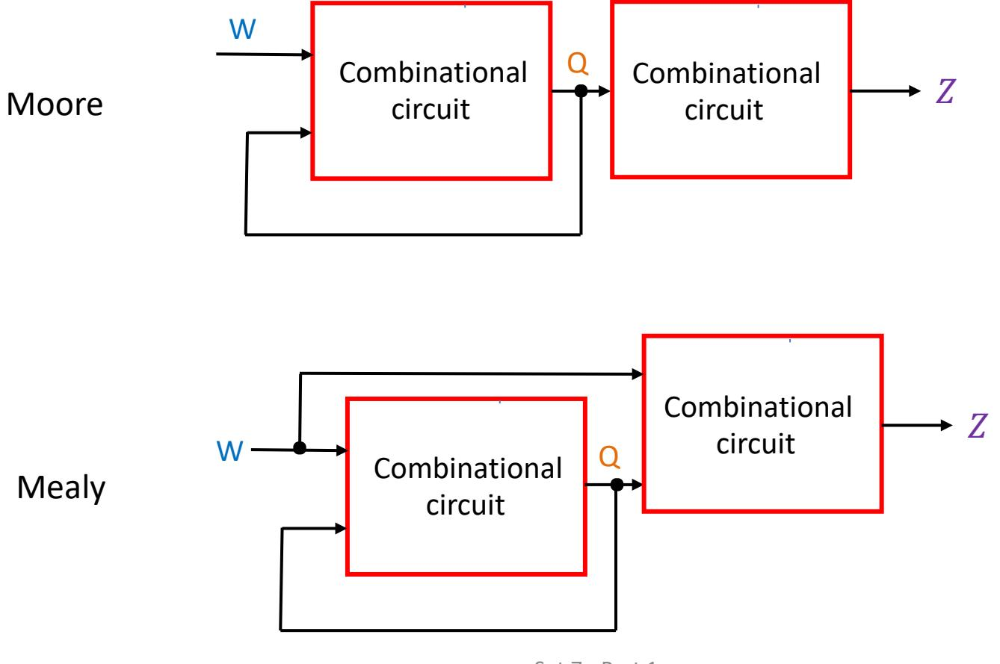

# **Example circuits**

#### SR latch and gated D latch

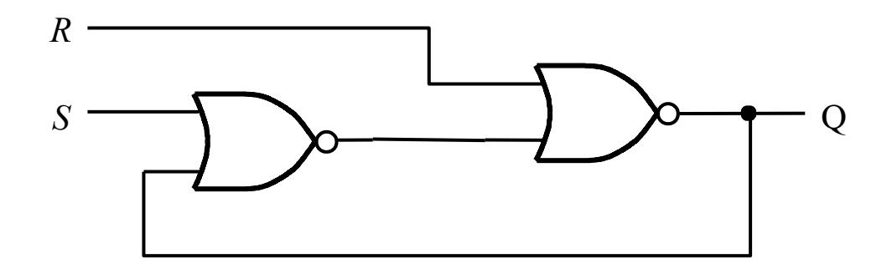

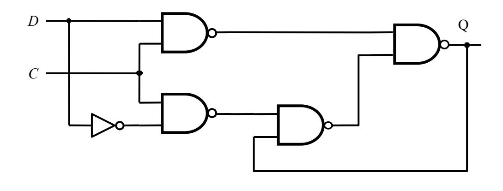

# **Important assumption**

- A circuit is in *stable state* when all internal signals stop changing
- A circuit is operating in *fundamental mode* if the following restrictions hold
  - − Only *one* input is allowed to change at a time
  - − The input changes only after the circuit is *stable*
- We will assume the fundamental mode of operation for our circuits

# **Modeling gate delay**

- Practical logic gates have propagation delays
- To simplify the analysis of an ASC, we will assume that the gates offer no delays. This will however be compensated by including a hypothetical delay element on the feedback path, allowing us to separate current and next states (see below)

SR latch with modeled gate delay

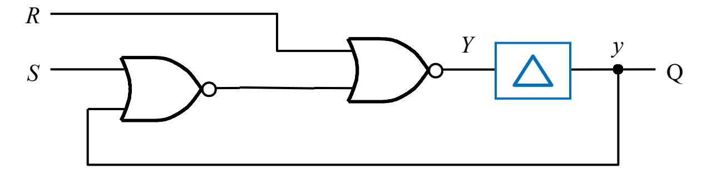

Note that lowercase y corresponds to current state variable and uppercase Y next state variable

# **Modeling gate delay (contd.)**

Gated D latch with modeled gate delay

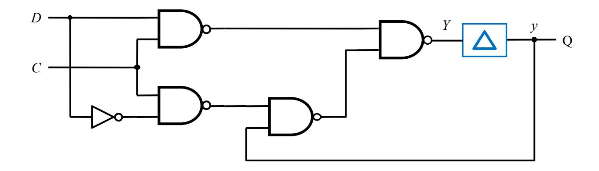

# **Modeling gate delay (contd.)**

#### A larger circuit:

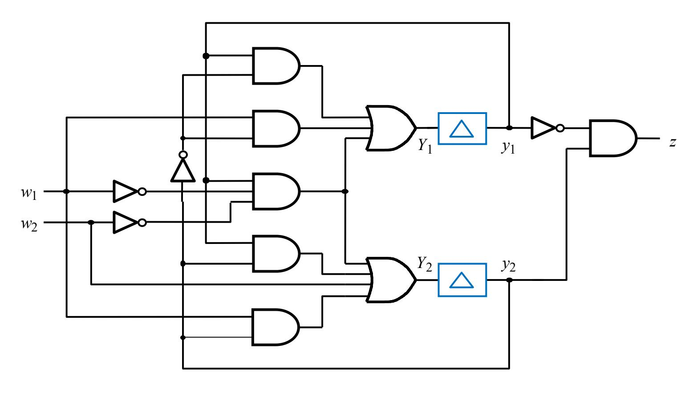

#### ECE 124 – Digital Circuits and Systems Dept. of ECE, Univ. of Waterloo

Lecture Slides: **Set 7 - Part 2**

#### Contents:

• Analysis of asynchronous sequential circuits

©2014-2026 M. A. Hasan. These slides and notes are for the exclusive use of the students registered in the course. Reproduction in any form or use for any other purposes is prohibited.

# **Analysis of asynchronous sequential circuits**

- It is similar to that of synchronous seq. circuits (SSC)
- Given an ASC, basic steps for analysis are:
  - 1. Write logic expressions for the next-state (Y) and the output (z) in terms of the current state (y) and the input (w)
  - 2. Construct the excitation table (a.k.a. transition table)
  - 3. Obtain a flow table (similar to state table for SSC)
  - 4. Draw a state diagram if desired

# **Analysis of gated D latch**

Gated D latch circuit is at right (along with a hypothetical delay element):

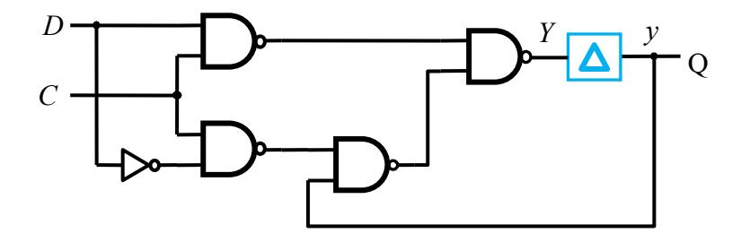

Looking at the circuit and using the consensus property, we can write:

$$Y = CD + C'y + Dy = CD + C'y$$

### Analysis of gated D latch (contd.)

$$Y = CD + C'y + Dy = CD + C'y$$

| Present |    |   | Ne | xt sta | te |    |   |
|---------|----|---|----|--------|----|----|---|
| state   | CD | = | 00 | 01     | 10 | 11 |   |
| у       |    |   | Υ  | Υ      | Υ  | Υ  | Q |
| 0       |    |   | 0  | 0      | 0  | 1  | 0 |
| 1       |    |   | 1  | 1      | 0  | 1  | 1 |

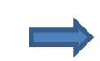

| Present |    | Ne   | xt sta | te |    |   |
|---------|----|------|--------|----|----|---|
| state   | CD | = 00 | 01     | 10 | 11 | Q |
| Α       |    | A    | A      | A  | В  | 0 |
| В       |    | B    | B      | A  | В  | 1 |

Excitation table (stable states are circled)

Flow table (obtained by replacing bit patterns of states with symbols)

4

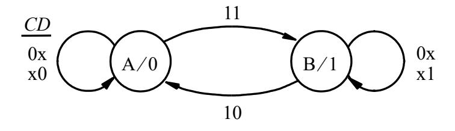

State diagram

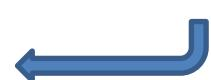

# **Analysis of DFF**

Consider the DFF circuit is at right (hypothetical delay elements and next state variables (1 and 2) are inside the latches (see two slides back)):

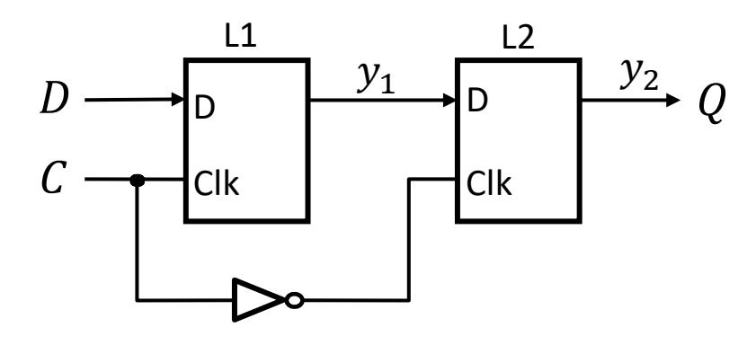

$$Y_1 = CD + C'y_1$$
$$Y_2 = C'y_1 + Cy_2$$

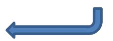

# **Analysis of DFF (contd.)**

$$Y_1 = CD + C'y_1$$
$$Y_2 = C'y_1 + Cy_2$$

| Present | Next state                |        |
|---------|------------------------------|--------|
| state   | CD = 00 01 10 11 | Output |
| y 2 y 1 | Y 2 Y 1                      | Q      |
| 00      | 0 0 0 0 0 0 01      | 0      |
| 01      | 11 11 0 0 01        | 0      |
| 10      | 00 00 10 1 1        | 1      |
| 11      | 1 1 1 1 10 1 1      | 1      |

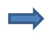

| Present |            | Next     | state      |     | Output |
|---------|------------|----------|------------|-----|--------|
| state   | CD = 00 | 01       | 10         | 11  | Q      |
| S1      |            | S 1      | S 1 S 1 | S2  | 0      |
| S2      |            | S4 S4 | S 1        | S2  | 0      |
| S3      |            | S1 S1 | S3         | S 4 | 1      |
| S4      |            | S 4      | S 4 S3  | S 4 | 1      |

Excitation table

Flow table

# **Analysis of DFF (contd.)**

| Present |    | Next | state |     |     | Output |
|---------|----|------|-------|-----|-----|--------|
| state   | CD | = 00 | 01    | 10  | 11  | Q      |
| S1      |    | S 1  | S 1   | S 1 | S2  | 0      |
| S2      |    | S4   | S4    | S 1 | S2  | 0      |
| S3      |    | S1   | S1    | S3  | S 4 | 1      |
| S4      |    | S 4  | S 4   | S3  | S 4 | 1      |

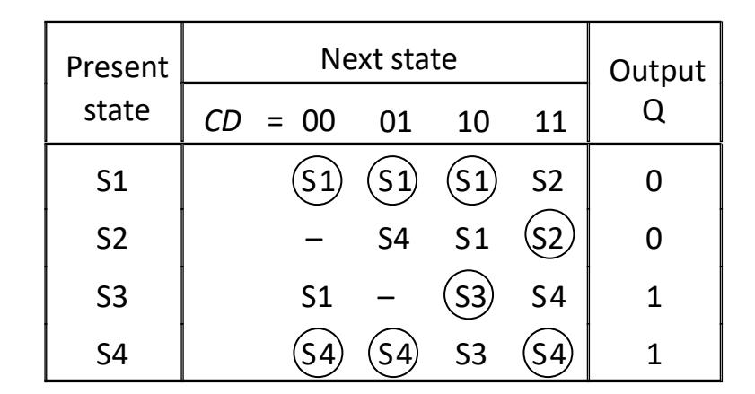

Flow table (from previous slide) Flow table with unspecified entries

#### Rationale

- State S2 is stable with CD=11.
- In the fundamental mode, inputs must change one at a time. Hence CD will not change from 11 to 00 in one step and the corresponding transitional next state is removed/unspecified (see the table at right)
- Similarly, we can have an unspecified entry in row S3

### **Analysis of DFF (contd.)**

| Present |        | Next st | ate       |            | Output |
|---------|--------|---------|-----------|------------|--------|
| state   | CD = 0 | 0 01    | 10        | 11         | Q      |
| S1      | S      | 1 (51)  | <u>S1</u> | S2         | 0      |
| S2      | _      | - S4    | <b>S1</b> | <u>S2</u>  | 0      |
| S3      | S      | 1 -     | <b>S3</b> | <b>S</b> 4 | 1      |
| S4      | S      | 4) (54) | S3        | <u>S4</u>  | 1      |

Final flow table (from previous slide)

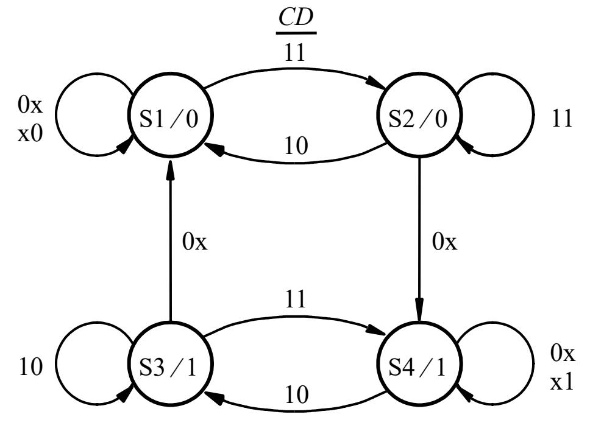

State diagram for D flip-flop

### **Analysis of a larger ASC**

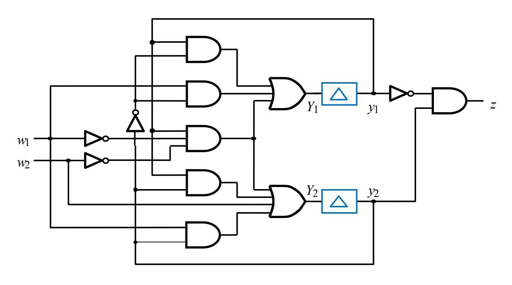

Logic expressions for the next state and the output are

$$Y_1 = y_1 y_2' + w_1 y_2' + w_1' w_2' y_1$$

$$Y_2 = y_1 y_2 + w_1 y_2 + w_2 + w_1' w_2' y_1$$

$$z = y_1' y_2$$

### Analysis of a larger ASC (contd.)

Logic expressions from previous slide:

$$Y_1 = y_1 y_2' + w_1 y_2' + w_1' w_2' y_1$$

$$Y_2 = y_1 y_2 + w_1 y_2 + w_2 + w_1' w_2' y_1$$

$$z = y_1' y_2$$

| Present                                     |                | Nextstate |          |          |        |  |
|---------------------------------------------|----------------|-----------|----------|----------|--------|--|
| state                                       | $w_2 w_1 = 00$ | 01        | 10       | 11       | Output |  |
| <i>y</i> 2 <i>y</i> 1 | $Y_2Y_1$       | $Y_2Y_1$  | $Y_2Y_1$ | $Y_2Y_1$ | Z      |  |
| 00                                          | 00             | 01        | 10       | 11       | 0      |  |
| 01                                          | 11             | (01)      | 11       | 11       | 0      |  |
| 10                                          | 00             | 10        | 10       | 10       | 1      |  |
| 11                                          | 11)            | 10        | 10       | 10       | 0      |  |

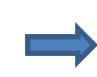

| Present | Nex            | Output |            |     |   |
|---------|----------------|--------|------------|-----|---|
| state   | $w_2 w_1 = 00$ | 01     | 10         | 11  | Z |
| Α       | A              | В      | С          | D   | 0 |
| В       | D              | B      | D          | D   | 0 |
| С       | A              | (C)    | <b>(C)</b> | (C) | 1 |
| D       | D              | С      | С          | С   | 0 |

**Excitation table** 

Flow table

# **Analysis of a larger ASC (contd.)**

| Present |              | Nextstate |    |    | Output |
|---------|--------------|-----------|----|----|--------|
| state   | w 2 w 1 = 00 | 01        | 10 | 11 | z      |
| A       | A            | B         | C  | D  | 0      |
| B       | D            | B         | D  | D  | 0      |
| C       | A            | C         | C  | C  | 1      |
| D       | D            | C         | C  | C  | 0      |

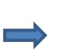

Flow table (from previous slide)

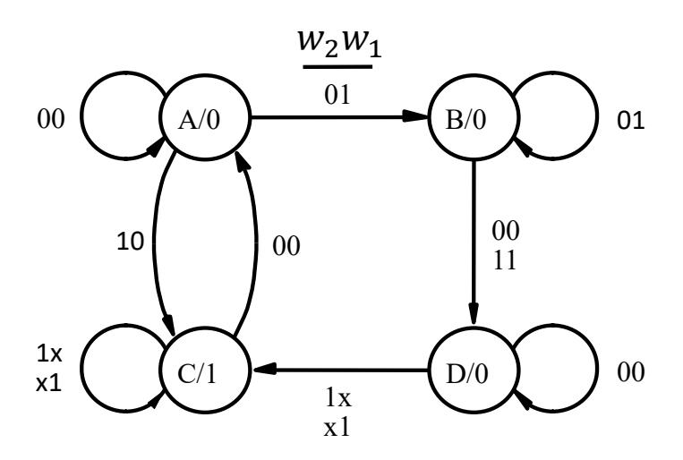

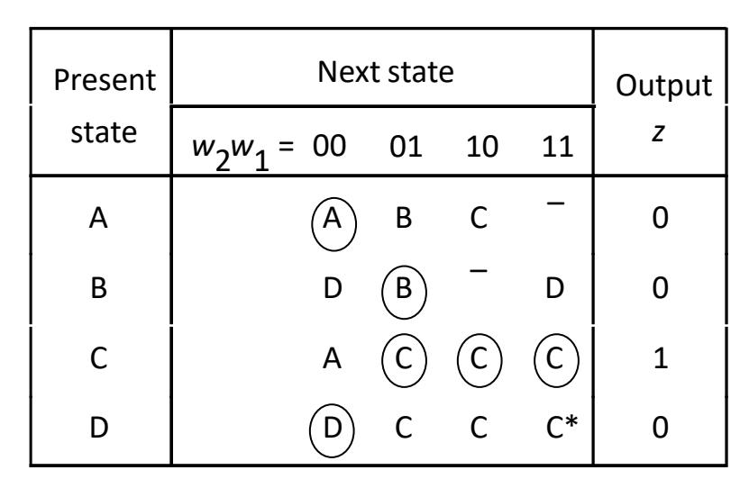

Modified flow table (\* to allow *B → D → C with* input 01 *→* 11)

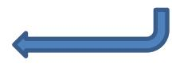

#### ECE 124 – Digital Circuits and Systems Dept. of ECE, Univ. of Waterloo

Lecture Slides: **Set 7 - Part 3**

#### Contents:

• Synthesis of asynchronous sequential circuits

©2014-2026 M. A. Hasan. These slides and notes are for the exclusive use of the students registered in the course. Reproduction in any form or use for any other purposes is prohibited.

# **Synthesis of asynchronous sequential circuits**

- It is the reverse task of analysis and has the same basic steps used for synchronous seq. circuits (SSC)
- Given a system specification, the basic steps for synthesis of an ASC are:
  - 1. Devise a state diagram
  - 2. Derive a flow table (and reduce the number of states if possible)
  - 3. Perform the state assignment and derive the excitation table
  - 4. Obtain the next-state and the output expressions
  - 5. Construct a circuit to implement these expressions

### Serial parity generator

#### Specification (given):

- The system has an input w and an output z
- When pulses are applied to w
  - the output z is equal to 0 if the number of previously applied pulses is even
  - the output z is equal to 1 if the number of previously applied pulses is odd

Assume a Moore machine

#### Devising a state diagram:

- To start with, let A be the state that indicates that an even number of pulses has been received. I.e., state A produces z=0. As long as, w=0, the machine stays in A. Thus, A is stable with w=0
- When the next pulse arrives, i.e., w=1, the FSM moves to a new state, say B, which produces z=1. As long as, w=1, the FSM must remain stable be in B
- The next change in input is w=0 (i.e., completion of the current pulse), which causes the FSM move to another state, say C, that produces z=1. State C must be stable w=0
- When the next pulse arrives, i.e., w=1, the FSM moves to a new state, say D, which produces z=0. As long as w=1, the FSM must remain stable be in D
- The next change in input is w=0 (i.e., completion of the current pulse), the FSM moves to state A

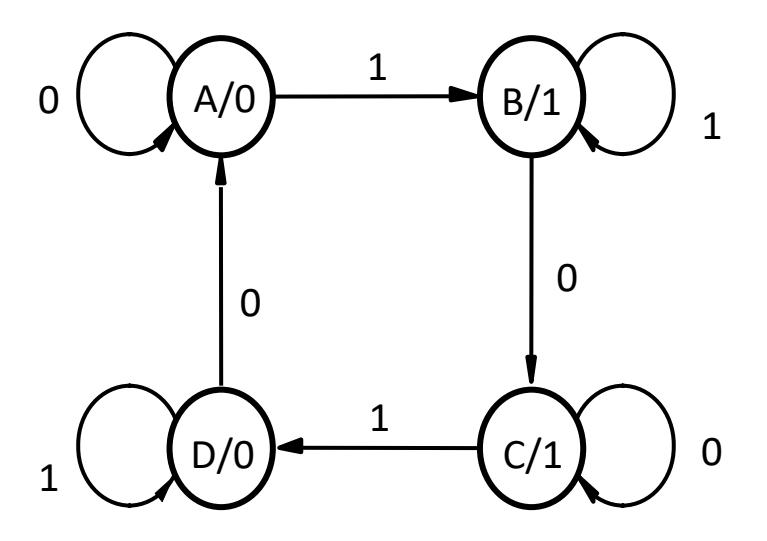

State diagram Flow table

| Present | Next  | state | Output |
|---------|-------|-------|--------|
| State   | w = 0 | w = 1 | z      |
| A       | A     | B     | 0      |
| B       | C     | B     | 1      |
| C       | C     | D     | 1      |
| D       | A     | D     | 0      |

#### State assignments:

- Let A=00, B=01, C=10, and D=11. This is a poor assignment since a transition from D=11 to A=00 (the last row of excitation table I) will cause both 2 and 1 to change, which is unlikely to happen at the same time. Depending on which variables
- changes first (racing), the destination will be different. • A good assignment is: A=00, B=01, C=11 and D=10 (see excitation table 2)

| Present | Next    |       |        |
|---------|---------|-------|--------|
| state   | w = 0   | w = 1 | Output |
| y 2 y 1 | Y 2 Y 1 | z     |        |
| 00      | 0 0     | 01    | 0      |
| 01      | 10      | 0 1   | 1      |
| 10      | 1 0     | 11    | 1      |
| 11      | 00      | 1 1   | 0      |

| Excitation table 1 | Excitation table 2 |
|--------------------|--------------------|
|--------------------|--------------------|

| Present | Next    |       |        |
|---------|---------|-------|--------|
| state   | w = 0   | w = 1 | Output |
| y 2 y 1 | Y 2 Y 1 | z     |        |
| 00      | 0 0     | 01    | 0      |
| 01      | 11      | 0 1   | 1      |
| 11      | 1 1     | 10    | 1      |
| 10      | 00      | 1 0   | 0      |

From excitation table 2:

$$Y_1 = wy'_2 + w'y_1 + y_1y'_2$$
  
 $Y_2 = wy_2 + w'y_1 + y_1y_2$   
 $z = y_1$ 

The circuit is shown at right

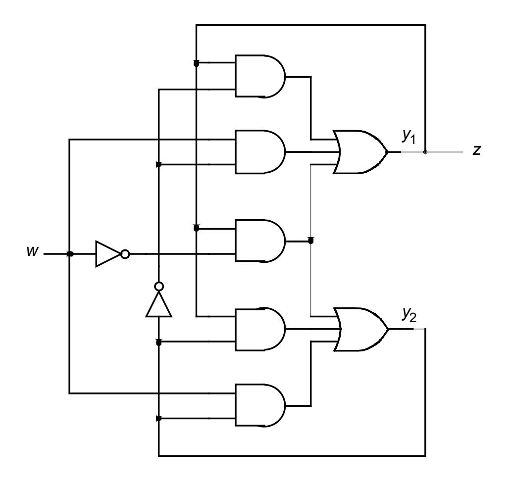

#### **Modulo-4 counter**

#### Specification (given):

- The system has an input w and an output  $z=(z_2,z_1)$
- When pulses are applied to w
  - the output z is equal to i mod 4 if the number of previously applied pulses is i

Assume a Moore machine

# **Modulo-4 counter (contd.)**

#### State diagram

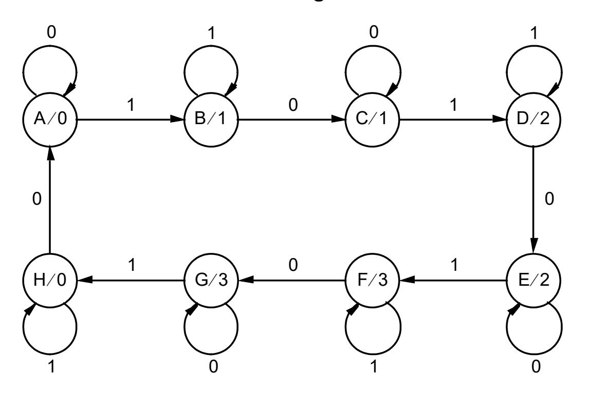

#### Flow table

| Present | Next  | state | Output |
|---------|-------|-------|--------|
| state   | w = 0 | w = 1 | z      |
| A       | A     | B     | 0      |
| B       | C     | B     | 1      |
| C       | C     | D     | 1      |
| D       | E     | D     | 2      |
| E       | E     | F     | 2      |
| F       | G     | F     | 3      |
| G       | G     | H     | 3      |
| H       | A     | H     | 0      |

# **Modulo-4 counter (contd.)**

|                  | Next state  |       |         |
|------------------|-------------|-------|---------|
| Present state | w = 0       | w = 1 | Output  |
| y 3 y 2 y 1      |             |       | z 2 z 1 |
|                  | Y 3 Y 2 Y 1 |       |         |
| 000              | 0 00        | 001   | 00      |
| 001              | 011         | 0 01  | 01      |
| 011              | 0 11        | 010   | 01      |
| 010              | 110         | 0 10  | 10      |
| 110              | 1 10        | 111   | 10      |
| 111              | 101         | 1 11  | 11      |
| 101              | 1 01        | 100   | 11      |
| 100              | 000         | 1 00  | 00      |

Excitation table Logic equations for Y's and z's (Yours to try)