#### ECE 124 – Digital Circuits and Systems Dept. of ECE, Univ. of Waterloo

Lecture Slides: **Set 8 - Part 1**

#### Contents:

• State reduction in asynchronous sequential circuits

©2014-2026 M. A. Hasan. These slides and notes are for the exclusive use of the students registered in the course. Reproduction in any form or use for any other purposes is prohibited.

# **State reduction**

#### Our state reduction task involves two procedures

- 1. Partitioning of equivalent states
- 2. Merging of *compatible* states

#### Partitioning

- Equivalent states are identified and grouped together
- Conditions for equivalent states were discussed in Slide set 7
- We will impose an additional constraint– two states, i.e., rows, in a flow table to be potentially equivalent any unspecified entries must be in the same NS column
- Thus, combining two equivalent states into a single state will not remove the don't cares
- (In merging, rows are merged taking advantage of unspecified entries)

#### **Partitioning**

Consider the following initial flow table. (Note that each row has only one stable state. Such a flow table is called primitive flow table)

| Present |    | Output |              |            |    |   |
|---------|----|--------|--------------|------------|----|---|
| State   | uv | = 00   | 01           | 10         | 11 | Z |
| А       |    | A      | В            | С          | _  | 0 |
| В       |    | D      | $\bigcirc$ B | _          | _  | 0 |
| С       |    | Α      | _            | <b>(C)</b> | _  | 1 |
| D       |    | D      | Ε            | F          | _  | 0 |
| E       |    | Α      | E            | _          | _  | 1 |
| F       |    | Α      | _            | F          | _  | 1 |

Initial flow table

After partitioning based on output  $P_0 = (ABD)(CEF)$ 

Because of different NS  $(ABD) \rightarrow (A)(B)(D)$ 

Rows with unspecified entries can be in the same partition if their unspecified entries are aligned. Thus  $(CEF) \rightarrow (CF)(E)$ 

Combining the above partitions  $P_1 = (A)(B)(D)(CF)(E)$ 

### **Partitioning (contd.)**

| Present |    | Output |              |            |    |   |
|---------|----|--------|--------------|------------|----|---|
| state   | uv | = 00   | 01           | 10         | 11 | Z |
| А       |    | A      | В            | С          | _  | 0 |
| В       |    | D      | $\bigcirc$ B | -          | _  | О |
| С       |    | Α      | _            | $\bigcirc$ | _  | 1 |
| D       |    | D      | Ε            | С          | _  | О |
| E       |    | Α      | E            | _          | _  | 1 |

Modified flow table after first-step reduction

# **Merging**

Compatible states: Two states (rows in a flow table) and are said to be *compatible* if there are no state conflicts for any input valuation. In other words, and are compatible if the following two hold

- 1. both and must have the same output whenever specified, and
- 2. for each input valuation, one of the following conditions must be true
  - a. both and have the same successor, or
  - b. both and are stable, or
  - c. The successor of or , or both, is unspecified

# **Merging (contd.)**

#### Steps for merging:

- 1. Identify compatible state pairs
- 2. Draw a merger diagram showing relationship among various states, where
  - ‒ Each row of the flow table is represented as a point, labeled by the row name
  - ‒ A line is drawn connecting any two points that correspond to compatible states (rows)
- 3. From the merger diagram, choose the best merging possibility. (The goal is to have as few states as possible)

Note that for any set of rows that are pairwise compatible, all pairs in the set can be merged into a single state

#### **Example for merging**

Assume that the following (primitive) flow table is given

| Present | Next state  |    |            |              |            | Output |
|---------|-------------|----|------------|--------------|------------|--------|
| state   | $w_2 w_1 =$ | 00 | 01         | 10           | 11         | Z      |
| Α       |             | A  | Н          | В            | _          | 0      |
| В       |             | F  | _          | $\bigcirc$ B | С          | 0      |
| С       |             | _  | Н          | _            | $\bigcirc$ | 1      |
| D       |             | Α  | <b>D</b>   | _            | Ε          | 1      |
| E       |             | _  | D          | G            | E          | 1      |
| F       |             | F  | D          | _            | _          | 0      |
| G       |             | F  | _          | G            | _          | 0      |
| н       |             | _  | $\bigcirc$ | -            | Ε          | 0      |

Compatible pair(s) with z=0:

- (A, H)
- (B, F), (B, G)
- (F, G)
- (G, H)

Compatible pair(s) with z=1:

• (D, E)

#### **Example for merging (contd.)**

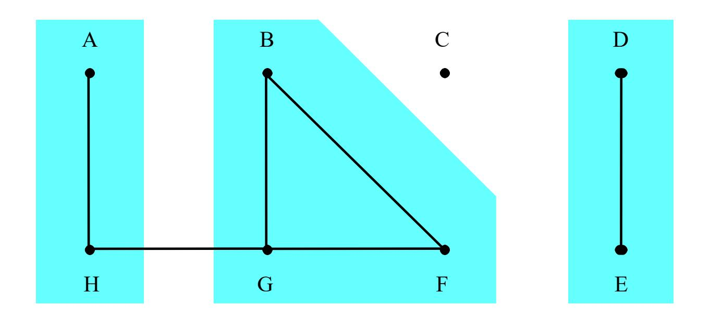

#### Notes:

- A and H can be merged as long as H is not merged with G
- B, G and F can be merged to a single state (row)
- D and E can be merged

# **Example for merging (contd.)**

After merging, the following reduced flow table is obtained (the total number of states has gone down to 4 from 8)

| Present | Next state               | Output |    |    |   |
|---------|--------------------------|--------|----|----|---|
| state   | w w = 00 2 1 | 01     | 10 | 11 | z |
| A       | A                        | A      | B  | D  | 0 |
| B       | B                        | D      | B  | C  | 0 |
| C       | –                        | A      | –  | C  | 1 |
| D       | A                        | D      | B  | D  | 1 |

# **State reduction procedure**

#### Steps:

- 1. Use the partitioning procedure to eliminate all but one state for each set of equivalent states
- 2. Construct a merger diagram
- 3. Chose a subset of compatible states that can be merged into a single state
  - ‒ Try to minimize the # of subsets needed to cover all states
  - ‒ Each state must be included in only one of the chosen subsets
- 4. Derive the reduced flow table by merging the rows in chosen subsets
- 5. Repeat steps 2 to 4 to see whether further reductions are possible

#### ECE 124 – Digital Circuits and Systems Dept. of ECE, Univ. of Waterloo

Lecture Slides: **Set 8 - Part 2**

#### Contents:

• Example of state reduction

©2014-2026 M. A. Hasan. These slides and notes are for the exclusive use of the students registered in the course. Reproduction in any form or use for any other purposes is prohibited.

#### **Example for state reduction procedure**

Assume that the flow table at right is given.

Partitioning based on output  $P_0 = (ACFGJ)(BDEHKL)$ 

Considering NS/successors & unspecified entries:

$$(ACFGJ) \rightarrow (A)(C)(F)(G)(J)$$
  
 $(BDEHKL) \rightarrow (BL)(D)(E)(HK)$ 

Note: you may find it easier to rewrite rows based on their outputs and scanned them in sequence for partitioning, e.g., first A, then C, then F, etc. for z=0.

| Present | Nex         | Output |            |                            |   |
|---------|-------------|--------|------------|----------------------------|---|
| state   | $w_2w_1=00$ | 01     | 10         | 11                         | Z |
| А       | (A)         | F      | С          | -                          | 0 |
| В       | A           | B      | -          | Н                          | 1 |
| С       | G           | _      | $\bigcirc$ | D                          | 0 |
| D       | _           | F      | _          | (D)                        | 1 |
| E       | G           | _      | E          | D                          | 1 |
| F       | _           | F      | _          | K                          | 0 |
| G       | G           | В      | J          | _                          | 0 |
| Н       | _           | L      | Ε          | $\left( \mathbf{H}\right)$ | 1 |
| J       | G           | -      | J          | -                          | 0 |
| К       | _           | В      | Ε          | K                          | 1 |
| L       | А           |        | _          | K                          | 1 |

Reduction obtained by using the partitioning procedure from the previous slide

| Present | Nex         | Output       |            |                           |   |
|---------|-------------|--------------|------------|---------------------------|---|
| state   | $w_2w_1=00$ | 01           | 10         | 11                        | Z |
| А       | A           | F            | С          | ı                         | 0 |
| В       | A           | $\bigcirc$ B | -          | Н                         | 1 |
| С       | G           | _            | $\bigcirc$ | D                         | 0 |
| D       | _           | F            | _          | (D)                       | 1 |
| E       | G           | _            | E          | D                         | 1 |
| F       | _           | F            | -          | Н                         | 0 |
| G       | G           | В            | J          | -                         | 0 |
| Н       | _           | В            | Ε          | $\left(\mathbf{H}\right)$ | 1 |
| J       | G           | _            | J          | _                         | 0 |

Compatible pair(s) for z=0:

- (A, F)
- (C, J)
- (F, J)
- (G, J)

Compatible pair(s) for z=1:

- (B, H)
- (D, E)

Merger diagram is shown below along with connections among various points based on the flow table and compatible pairs identified in the previous slide). The resulting flow table is in the next slide.

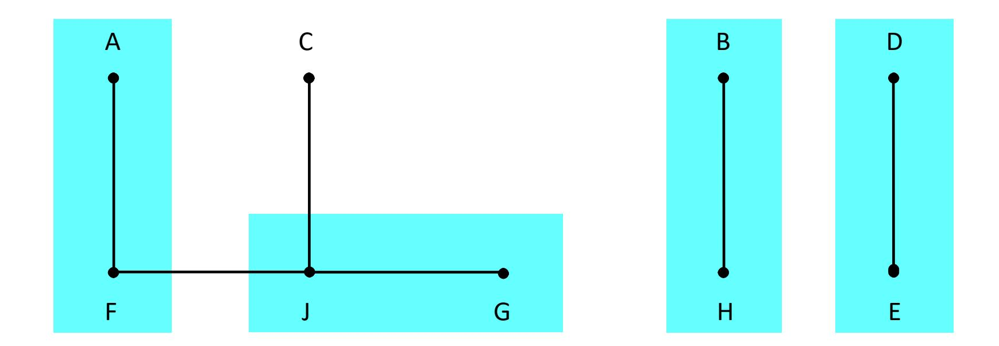

Reduced flow table (after merging shown in the previous slide)

| Present | Next         | Output |    |    |   |
|---------|--------------|--------|----|----|---|
| state   | w 2 w 1 = 00 | 01     | 10 | 11 | z |
| A       | A            | A      | C  | B  | 0 |
| B       | A            | B      | D  | B  | 1 |
| C       | G            | –      | C  | D  | 0 |
| D       | G            | A      | D  | D  | 1 |
| G       | G            | B      | G  | –  | 0 |

Merger diagram for the above flow table:

| A | B | D | C | G |
|---|---|---|---|---|
|   |   |   |   |   |

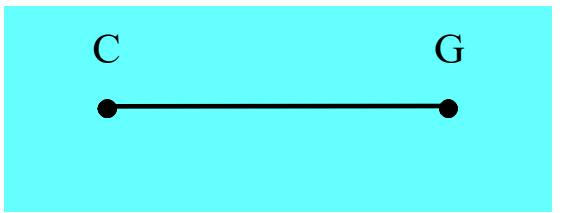

Below is the reduced flow table based on the merger diagram from the bottom of the previous slide. (No more merging can be done for this example)

| Present | Next state               | Output |    |   |
|---------|-----------------------------|--------|----|---|
| state   | w w 1 = 00 01 2 | 10     | 11 | z |
| A       | A A                      | C      | B  | 0 |
| B       | A B                      | D      | B  | 1 |
| C       | C B                      | C      | D  | 0 |
| D       | C A                      | D      | D  | 1 |

#### ECE 124 – Digital Circuits and Systems Dept. of ECE, Univ. of Waterloo

Lecture Slides: **Set 8 - Part 3**

#### Contents:

• Race free state assignment

©2014-2026 M. A. Hasan. These slides and notes are for the exclusive use of the students registered in the course. Reproduction in any form or use for any other purposes is prohibited.

# **Race conditions**

- A race condition occurs in ASC when two or more state variables change in response to a change in the circuit input value
- Unequal circuit delays may not allow multiple state variables change at the same time
- Assume that two state variables change.
  - If the circuit reaches the same final, stable state regardless of the order in which the state variables change, then the race is non-critical
  - If the circuit reaches a final, stable state depending on the order in which the state variables change, then the race is critical
- We need to avoid critical races for predictability and to ensure our circuit does the intended function

# **Race conditions (contd.)**

#### Notes:

- Races are a consequence of how states are assigned when designing a circuit (races do not exist in flow tables, where states are represented as symbols)
- We can prevent races to occur by performing state assignment such that transitions from one stable state to another state require only one state variable to change at a time
- A number of methods are available for race free state assignment

# **Method # 1**

This method is based on the use of extra unstable states.

Let there be states in the flow table and = ⌈log2⌉.

- Try to embed the symbolic states of the flow table into the co-ordinates of the or a higher dimensional 'cube' such that the path from stable state to stable state:
  - is direct along a single edge of the cube, or
  - goes through newly introduced unstable states along cube edges
- New extra states are always unstable

Example: Consider the following flow table

| Present state | Next state w w 1 = 00 01 10 11 2 |   |   |   |   | Output z z 2 1 |
|------------------|----------------------------------------------------------|---|---|---|---|----------------------------|
| A                |                                                          | A | A | C | B | 00                         |
| B                |                                                          | A | B | D | B | 01                         |
| C                |                                                          | C | B | C | D | 10                         |
| D                |                                                          | C | A | D | D | 11                         |

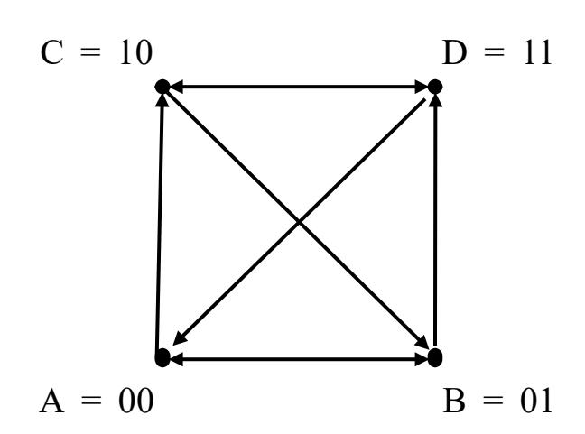

Here =2 and we first try a 2-dimensional 'cube' (i.e., a square).

- A possible transition diagram is shown above (right)
- Each diagonal represents value changes in multiple (two) state variables (we need to avoid diagonals)
- Try other state assignments on the square, but you will not be able to get rid of diagonals for this example

Next, we try the 3-D cube (see below)

| Present | Next         | Output |    |    |         |
|---------|--------------|--------|----|----|---------|
| state   | w 2 w 1 = 00 | 01     | 10 | 11 | z 2 z 1 |
| A       | A            | A      | C  | B  | 00      |
| B       | A            | B      | D  | B  | 01      |
| C       | C            | B      | C  | D  | 10      |
| D       | C            | A      | D  | D  | 11      |

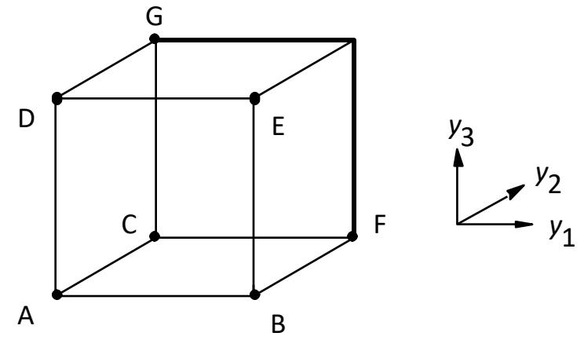

- Extra co-ordinates in the 3-D cube allow us to
  - ‒ avoid diagonals by placing more states adjacent to each other and
  - ‒ introduce additional, unstable states and use them as intermediate states during transitions.
- For example, in the above 3-D cube
  - ‒ D is placed adjacent to A (i.e., the D-to-A transition requires the value of only one state variable change)
  - ‒ Transition from B to D is via intermediate state E and, similarly, from C to B is via F, each requiring a change in one variable only.
- All transitions are shown in the table in the next slide.

| Present | Nex           | Output       |          |              |                               |
|---------|---------------|--------------|----------|--------------|-------------------------------|
| state   | $w_2w_1 = 00$ | 01           | 10       | 11           | z 2 z 1 |
| А       | A             | A            | С        | В            | 00                            |
| В       | А             | $\bigcirc$ B | D        | $\bigcirc$ B | 01                            |
| С       | C             | В            | <u>C</u> | D            | 10                            |
| D       | С             | Α            | (D)      | D            | 11                            |

| Present | Next state  |            |                     |            |     | Output          |
|---------|-------------|------------|---------------------|------------|-----|-----------------|
| state   | $w_2 w_1 =$ | 00         | 01                  | 10         | 11  | $Z_2Z_1$        |
| А       |             | A          | A                   | С          | В   | 00              |
| В       |             | Α          | ${\color{red} (B)}$ | Ε          | B   | 01              |
| С       |             | $\bigcirc$ | F                   | $\bigcirc$ | G   | 10              |
| D       |             | G          | Α                   | <b>D</b>   | (D) | 11              |
| E       |             | -          | _                   | D          | _   | <mark>??</mark> |
| F       |             | -          | В                   | _          | _   | <mark>??</mark> |
| G       |             | С          | _                   | _          | D   | <mark>??</mark> |

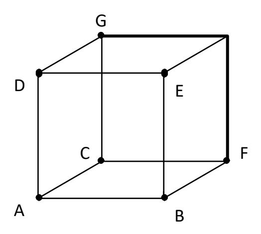

- In the new table, states are represented as y3y2y1, i.e., A=000, B=001, C=010, D=100, E=101, F=011 and G=110 (see the 3-D cube in the previous slide)
- This state assignment has removed all race conditions.

| Present | Next state  |     |              |            |                                                                                    | Output          |
|---------|-------------|-----|--------------|------------|------------------------------------------------------------------------------------|-----------------|
| state   | $w_2 w_1 =$ | 00  | 01           | 10         | 11                                                                                 | $Z_2Z_1$        |
| Α       |             | A   | $\bigcirc$   | С          | В                                                                                  | 00              |
| В       |             | Α   | $\bigcirc$ B | Ε          | $\bigcirc$ B                                                                       | 01              |
| С       |             | (c) | F            | $\bigcirc$ | G                                                                                  | 10              |
| D       |             | G   | Α            | <b>D</b>   | $\bigcirc\!\!\!\!\!\!\!\!\!\!\!\!\!\!\!\!\!\!\!\!\!\!\!\!\!\!\!\!\!\!\!\!\!\!\!\!$ | 11              |
| E       |             | -   | _            | D          | _                                                                                  | <mark>–1</mark> |
| F       |             | _   | В            | _          | _                                                                                  | 01              |
| G       |             | С   | _            | _          | D                                                                                  | <mark>1-</mark> |

- To reduce unnecessary delay, the output of F is set to that of the 'effective' next state B (rather than that of the 'effective' present state C).
- In addition, '--' is not used for the output of F. Rationale: during optimization of the circuit for  $z_2z_1$ , entry '--' could be retreated as '11' or '00', neither of which corresponds to the output of the effective present or next state.

# **Method # 2**

- This method is useful for a flow table with ≤ 4 states.
- It is based on the use of equivalent states , i.e., each state of the given flow table is replaced with two (or more) equivalent states
- E.g., state A can be replaced by two equivalent states A1 and A2.
- The equivalent states A1 and A2 have the following features
  - ‒ output for A1 and A2 should be the same as that for A
  - ‒ if the original state A is stable for an input valuation, then its equivalent states A1 and A2 are also stable for the same input valuation
  - ‒ for an input valuation, the (ultimate) stable successors for A1 and A2 belong to the same equivalent pair

• For a given flow table of N states, this method creates 2N states (because of 2 equivalent states of each original state)

#### • Embedding rule:

The 2N states are embedded into a cube of dimension n+1 or higher such that

- members (e.g., states A1 and A2) of an equivalent pair are adjacent to each other
- Through members, each pair is adjacent to other pairs

Example: Consider the following flow table (same as before)

| Present | Next         | Output |    |    |                  |
|---------|--------------|--------|----|----|------------------|
| state   | w 2 w 1 = 00 | 01     | 10 | 11 | z z 2 1 |
| A       | A            | A      | C  | B  | 00               |
| B       | A            | B      | D  | B  | 01               |
| C       | C            | B      | C  | D  | 10               |
| D       | C            | A      | D  | D  | 11               |

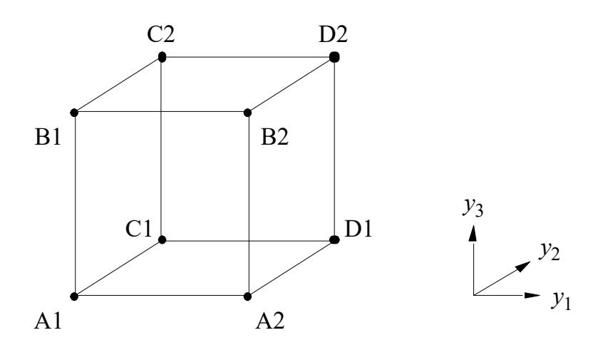

One possible embedding of the equivalent states in the 3-D cube is shown above. The corresponding modified flow table is shown in the next slide.

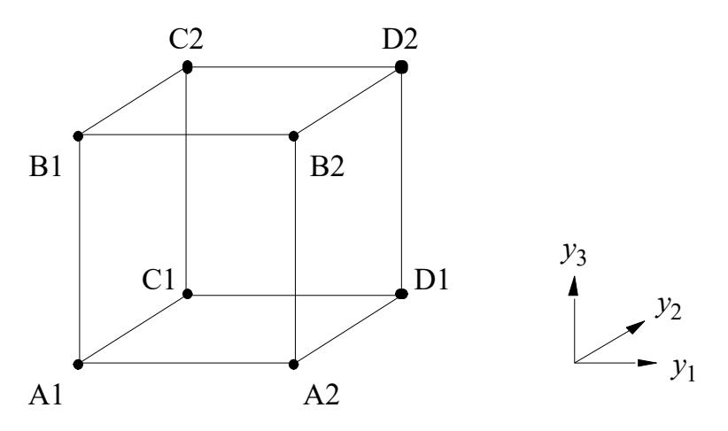

| • |  | The cube is repeated from previous slide |  |  |  |
|---|--|------------------------------------------|--|--|--|
|---|--|------------------------------------------|--|--|--|

| • | In the cube, A1=000, A2=001, B1=100, |
|---|--------------------------------------|
|   | B2=101, C1=010, C2=110, D1=011 and   |
|   | D2=111                               |

| Present | Next         | Output |     |     |         |
|---------|--------------|--------|-----|-----|---------|
| state   | w 2 w 1 = 00 | 01     | 10  | 11  | z 2 z 1 |
| A1      | A 1          | A 1    | C1  | B1  | 00      |
| A2      | A 2          | A 2    | A1  | B2  | 00      |
| B1      | A1           | B 1    | B2  | B 1 | 01      |
| B2      | A2           | B 2    | D2  | B 2 | 01      |
| C1      | C 1          | C2     | C 1 | D1  | 10      |
| C2      | C 2          | B1     | C 2 | D2  | 10      |
| D1      | C1           | A2     | D 1 | D 1 | 11      |
| D2      | C2           | D1     | D 2 | D 2 | 11      |

Determination of transitional next states, i.e., states not circled in the above table. For example:

- For input 10, A1 needs to transit to C1 or C2. Based on how we have embedded the states in the above cube, C1 (not C2) is adjacent to A1; so A1 transits to C1.
- For input 10, A2 needs to transit to C1 or C2. However, C1 and C2 are not adjacent to A2. In this situation, A2 transits to its equivalent state A1, which by the embedding rule must be adjacent to either C1 or C2 (in this case C1) Set 8 - Part 3 12

#### Method #3

- This method is based on the use of one-hot-encoding
- For a given flow table, let the i-th state,  $1 \le i \le N$ , be represented as an N-bit binary number where the i-th bit is 1 and all other bits are zero. (E.g., for N=4, if the states are  $S_4$  ...  $S_1$ , then  $S_2$  is encoded as 0010)
- For a transition from i-th stable state to j-th stable state, introduce unstable state with encoding 0...010 ... 010...0, where 1s are in the i-th and j-th positions only.
- Consider the original flow table shown with Method # 2. Create a modified table by looking at transitions and introducing new unstable states as required using one-hot-encoding (see the next slide).

| Present | Ne            | Output       |            |    |          |
|---------|---------------|--------------|------------|----|----------|
| state   | $w_2w_1 = 00$ | 01           | 10         | 11 | $z_2z_1$ |
| А       | A             | A            | С          | В  | 00       |
| В       | А             | $\bigcirc$ B | D          | B  | 01       |
| С       | (C)           | В            | <b>(c)</b> | D  | 10       |
| D       | С             | Α            | D          | D  | 11       |

| State      | Present | Nextstate  |                |              |            |          | Output   |
|------------|---------|------------|----------------|--------------|------------|----------|----------|
| assignment | State   | $w_2w_1=0$ | 00             | 01           | 10         | 11       | $Z_2Z_1$ |
| 0001       | Α       |            | A              | A            | Е          | F        | 00       |
| 0010       | В       |            | F              | $\bigcirc$ B | G          | B        | 01       |
| 0100       | С       |            | $\overline{c}$ | Н            | <b>(c)</b> | ı        | 10       |
| 1000       | D       |            | I              | J            | <b>D</b>   | <b>D</b> | 11       |
| 0101       | E       |            | _              | _            | С          | _        | -0       |
| 0011       | F       |            | Α              | _            | _          | В        | 0–       |
| 1010       | G       |            | _              | _            | D          | _        | -1       |
| 0110       | н       |            | _              | В            | _          | _        | 01       |
| 1100       | ı       |            | С              | _            | _          | D        | 1–       |
| 1001       | J       |            | _              | Α            | _          | _        | 00       |

#### ECE 124 – Digital Circuits and Systems Dept. of ECE, Univ. of Waterloo

Lecture Slides: **Set 8 - Part 4**

#### Contents:

• Hazards free circuits

©2014-2026 M. A. Hasan. These slides and notes are for the exclusive use of the students registered in the course. Reproduction in any form or use for any other purposes is prohibited.

# **Introduction to hazards**

- A hazard is a momentary unwanted switching transient at a circuit's output (i.e., glitch)
- Hazards/glitches occur due to unequal propagation delays along different paths in a combinational circuit
- For asynchronous sequential circuits (ASC), hazards can cause problems. For example, momentary false logic values in an ASC can cause a transition to an incorrect stable state
- Hazards can be static or dynamic

# **Introduction to hazards (contd.)**

- Static-1 hazard: it occurs when output is 1 and should remain at 1, but temporarily switches to 0 due to a change in an input
- Static-0 hazard: it occurs when output is 0 and should remain at 0, but temporarily switches to 1 due to a change in an input

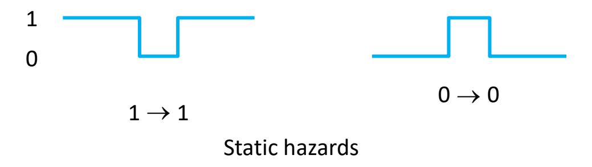

# **Introduction to hazards (contd.)**

• Dynamic hazard: It occurs when an input changes, and a circuit output should change 0-> 1 or 1-> 0, but temporarily flips between values

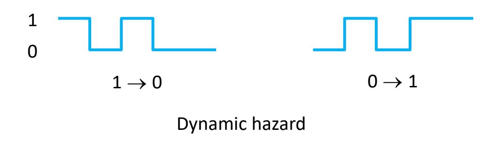

#### **Static hazards (in SOP circuits)**

- Consider the following circuit.
- Assume that all three inputs of the circuit are initially 1. For this set of input values, we have output f=1.
- Now let us change input  $x_1$  from 1 to 0 and follow the timing diagram assuming that all gates have the same propagation delay

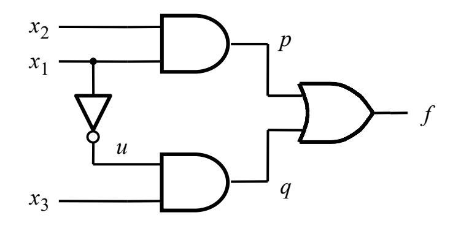

• Based on the logic expression  $f = x_1x_2 + x_1'x_3$ , we expect the output to remain at logic 1, but due to delay, the output goes to 1->0->1, i.e., we have a glitch at the output. This is a static-1 hazard.

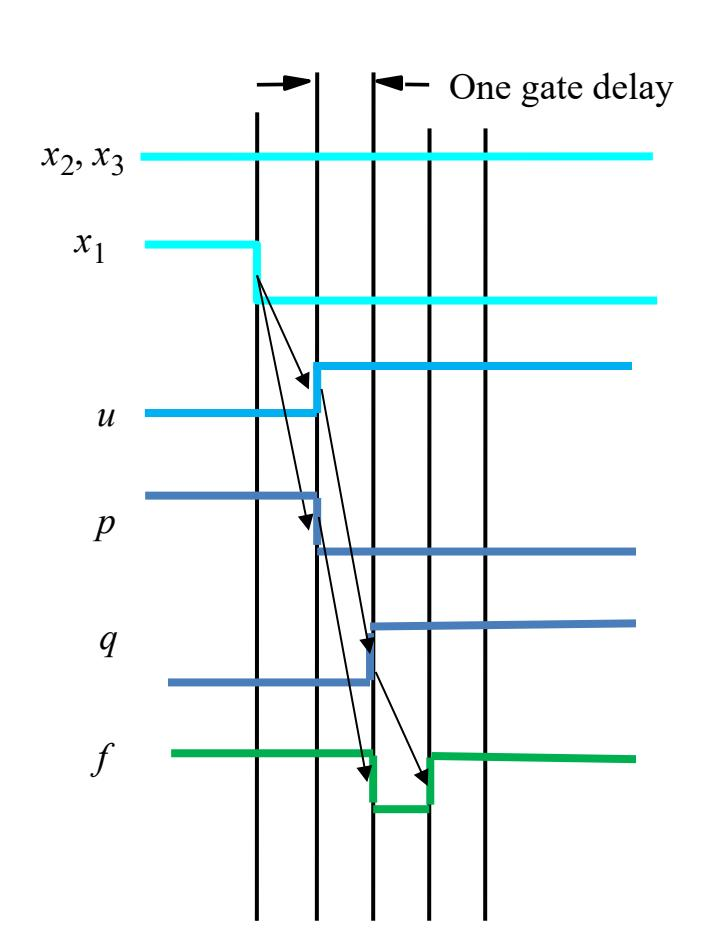

Timing diagram

# **Hazard free SOP circuits**

- When circuits are implemented as a 2-level SOP (resp. 2-level POS), we can detect and remove hazards by inspecting the K-map and adding redundant product (resp. sum) terms.
- The K-map for the function of the previous slide is shown below (left).
- When 1 changes from 1 to 0, the function value jumps from one product term to another
- When adjacent minterms are not covered by the same product term, then a hazard exists
- To cover adjacent minterms and avoid hazards, we can include extra product terms in the logic expression for the output
- The extra product term in the K-map below right does not include the changing input 1 preventing possible momentary output glitches. (The corresponding circuit and timing diagram are in the next slide)

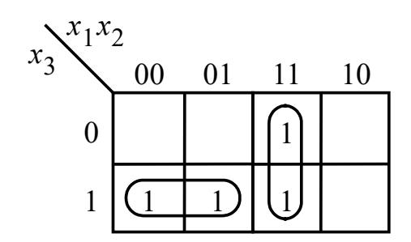

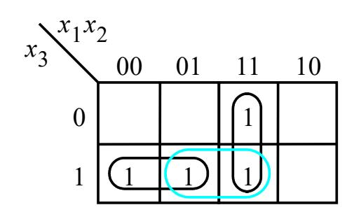

# **Hazard free SOP circuits (contd.)**

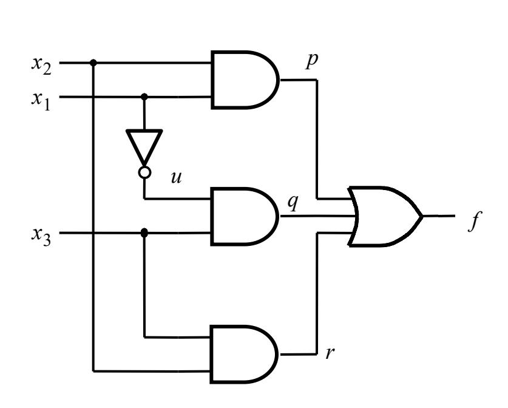

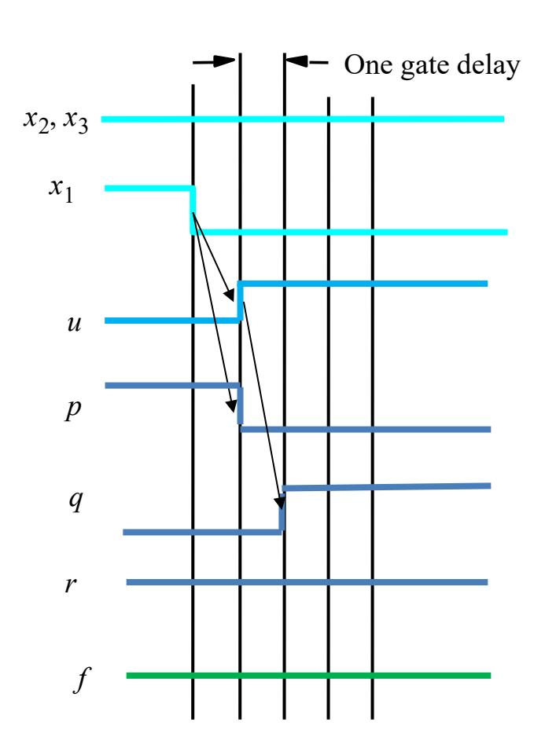

Timing diagram

### **Hazard free SOP circuits (contd.)**

| Present               | Next          |         |    |        |
|-----------------------|---------------|---------|----|--------|
| state                 | CD = 00       | 01 10   | 11 | Output |
| <i>y</i> 1 <i>y</i> 2 | Y             | Q       |    |        |
| 00                    | 00            | 00 00   | 10 | 0      |
| 01                    | 00            | 00 (01) | 11 | 1      |
| 10                    | 11            | 11 00   | 10 | 0      |
| 11                    | <u>(11)</u> ( | 11 01   | 11 | 1      |

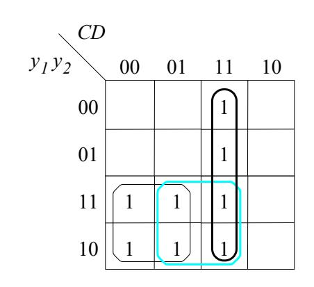

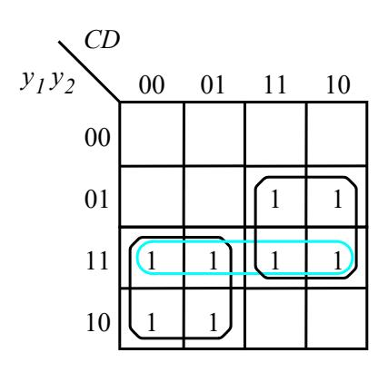

(b) Karnaugh maps for  $Y_1$  and  $Y_2$ 

(a) An example excitation table

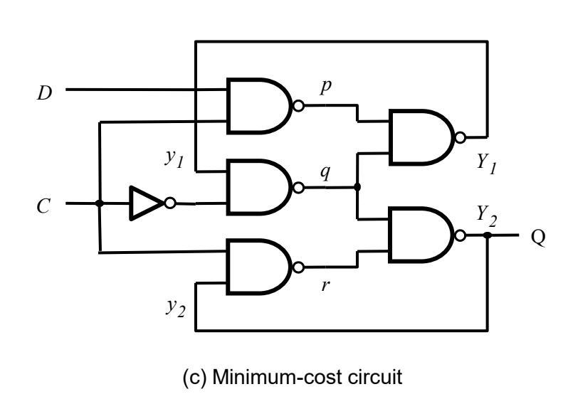

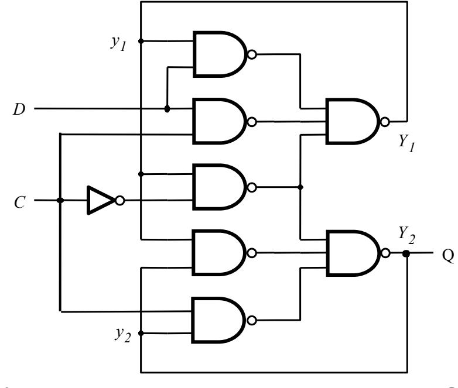

Set 8 - Part 4

(d) Hazard-free circuit

# **Hazard free POS circuits**

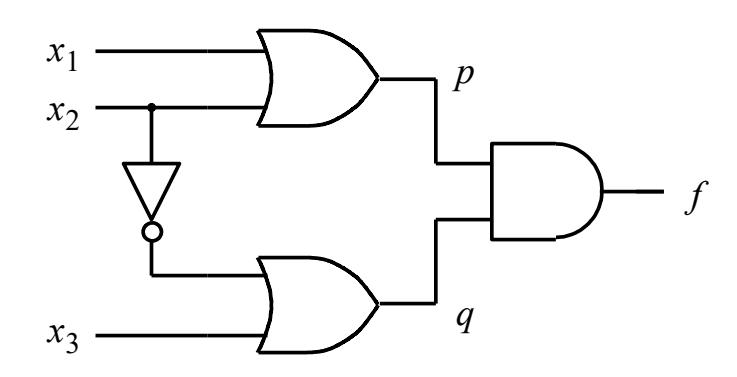

(a) Circuit with a hazard

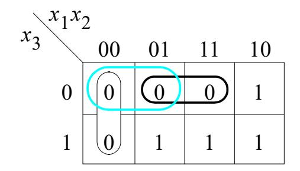

(b) Karnaugh map

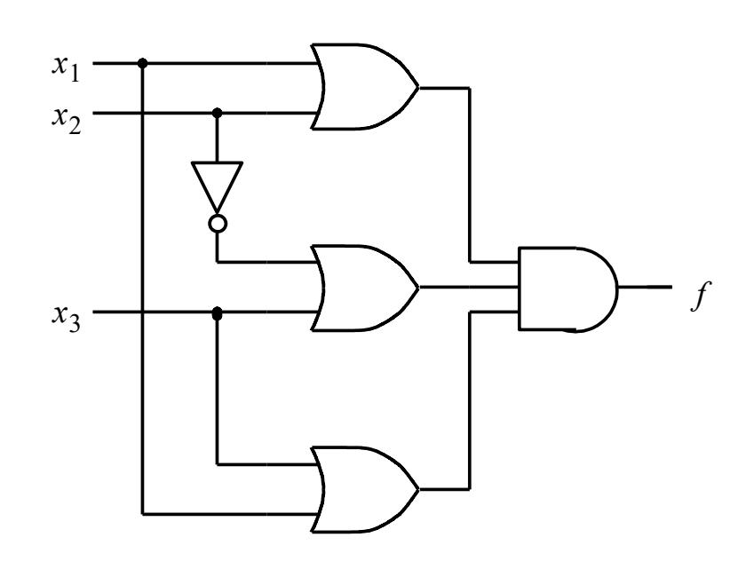

(c) Hazard-free circuit

# **Dynamic hazards (in multi-level circuits)**

Circuit with a dynamic hazard and its timing diagram are shown below

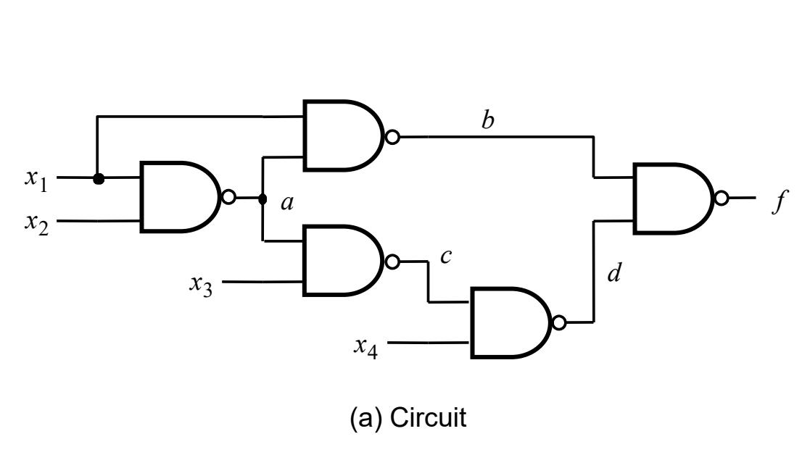

- Dynamic hazards are mainly multi-level circuits and not easy to deal with
- We can try to avoid such hazards simply by using 2-level circuits and ensuring that there is no static hazards

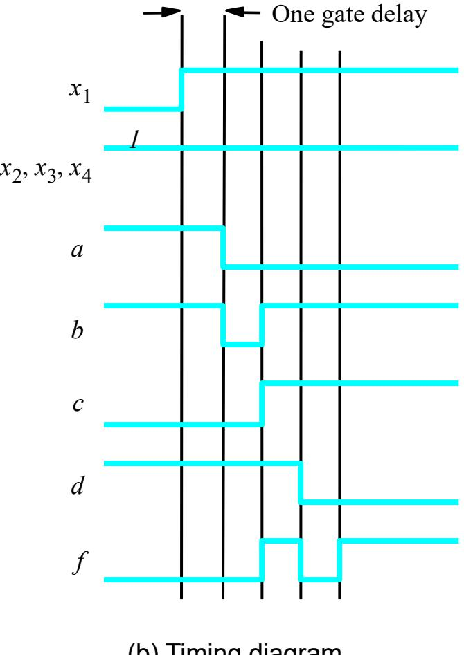

(b) Timing diagram

# **Remarks**

- The circuit that generates the next-state variables in an ASC must be hazard free. A glitch can cause the circuit to enter an incorrect state and possibly become stable in that state.
- In SSC, the input signals must be stable within the setup and hold times of FFs. Glitches outside the setup and hold times of FFs do not matter much for next state
- For pure combinational circuits (without feedback), we do not worry too much about glitches
- But glitches in general should be prevented. They also waste power.