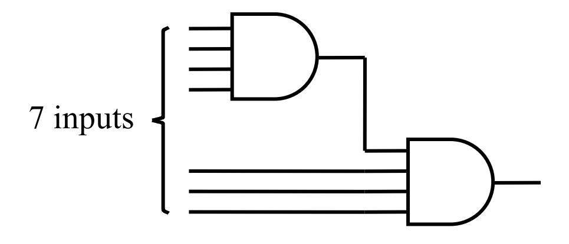
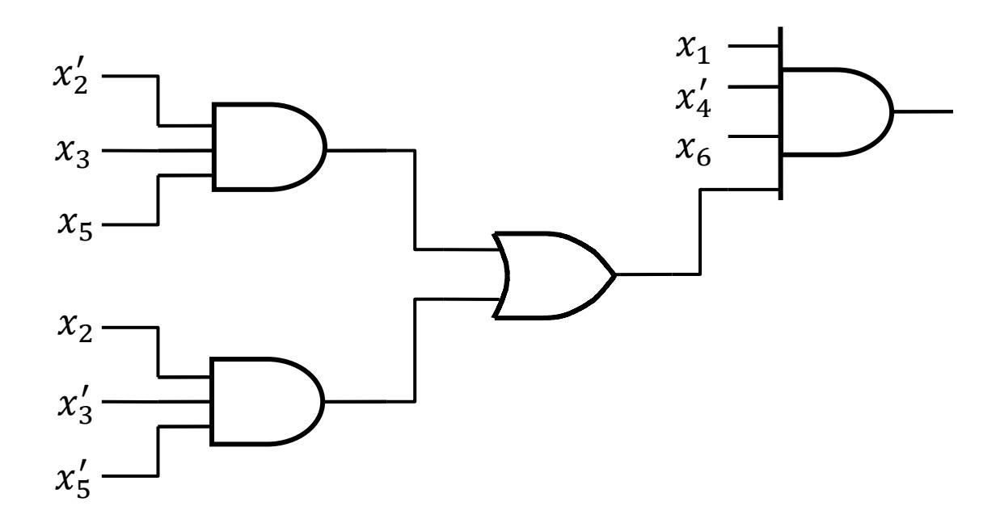
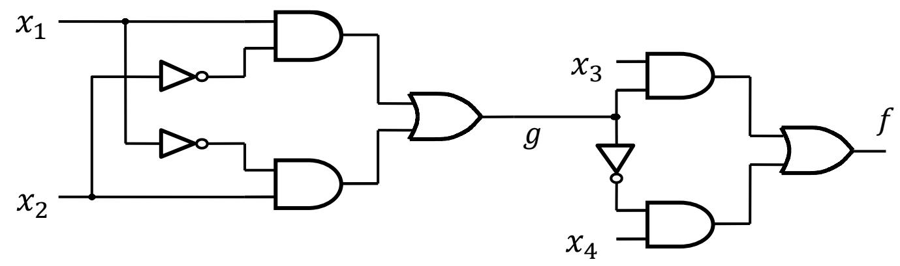
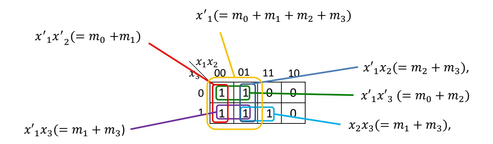
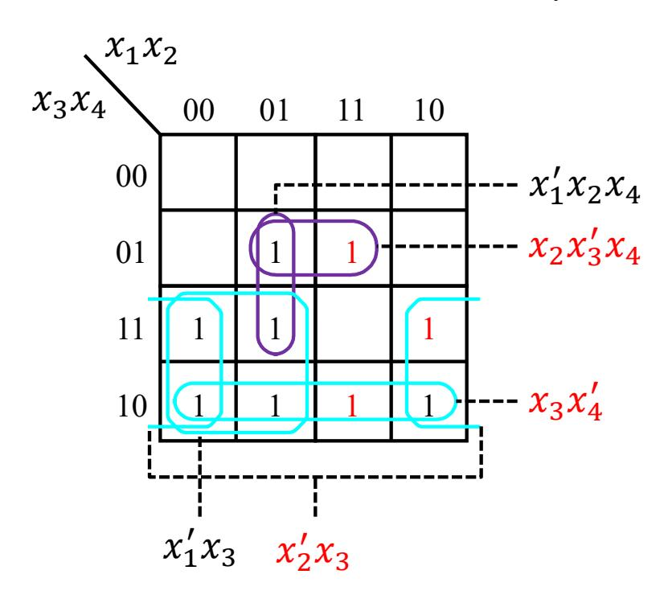

#### ECE 124 – Digital Circuits and Systems Dept. of ECE, Univ. of Waterloo

Lecture Slides: **Set 9 - Part 1**

#### Contents:

• Multilevel synthesis

©2014-2026 M. A. Hasan. These slides and notes are for the exclusive use of the students registered in the course. Reproduction in any form or use for any other purposes is prohibited.

#### Multilevel synthesis

- So far we have dealt with two levels of gates
  - AND-OR and NAND-NAND (for SOP forms)
  - OR-AND and NOR-NOR (for POS forms)
- Two-level circuits work well for functions of a few variables
- When the number of input increases, fan-in becomes an issue
  - the fan-in of a gate is defined as the number of inputs to the gate
  - e.g., the product term  $x_1x_2x_3x_4'$  can be implemented using an AND gate with a fan-in of 4
- Fan-in problems can be addressed using
  - Factoring
  - Functional decomposition

### **Factoring**

- Consider the function  $f = x_1 x_2' x_3 x_4' x_5 x_6 + x_1 x_2 x_3' x_4' x_5' x_6$
- A straight-forward implementation of f will require AND gates with a fan-in of 6
- Suppose that we are given gates with a maximum fan-in of 4
- Noting that we can write

$$f = (x_1 x_2' x_3 x_4')(x_5 x_6) + (x_1 x_2 x_3' x_4')(x_5' x_6)$$

• Then each of the above 6-variable product terms (e.g.,  $x_1x_2'x_3x_4'x_5x_6$ ) can be implemented as follows (with one of the inputs of the 2nd AND gate fixed to 1 since we need only 6 inputs)

### Factoring (contd.)

We can do better ... noting that we can write

$$f = x_1 x_4' x_6 (x_2' x_3 x_5 + x_2 x_3' x_5')$$

and the function can be implemented as follows

#### Functional decomposition

Consider a function given as follows

$$f(x_1, ..., x_4) = x'_1 x_2 x_3 + x_1 x'_2 x_3 + x_1 x_2 x_4 + x'_1 x'_2 x_4$$

Using factoring

$$f = (x'_1x_2 + x_1x'_2)x_3 + (x_1x_2 + x'_1x'_2)x_4$$

• Let  $g(x_1, x_2) = x'_1 x_2 + x_1 x'_2$ . Then it can be shown that  $g'(x_1, x_2) = x_1 x_2 + x'_1 x'_2$ . Thus  $f = gx_3 + g'x_4$ 

In practice, it's a challenge to find possible sub-functions
 (e.g., g in the above circuit) for optimal solutions and hence
 heuristic approaches are used for "acceptable solutions"

#### ECE 124 – Digital Circuits and Systems Dept. of ECE, Univ. of Waterloo

Lecture Slides: **Set 9 - Part 2**

#### Contents:

• Implicants and cost minimization

©2014-2026 M. A. Hasan. These slides and notes are for the exclusive use of the students registered in the course. Reproduction in any form or use for any other purposes is prohibited.

# Some definitions

Literal: Each appearance of a variable, either un-complemented or complemented, is called a *literal*.

E.g., the product term 1235 has four literals.

Implicant: If a function takes the value 1 whenever a product term is 1 (i.e., implies ), then is called an *implicant* of .

E.g., Consider the following function of 3 variables. It has 11 implicants as shown in the next slide

$$x_1 x_2$$
 $x_3$ 
 $00$ 
 $01$ 
 $1$ 
 $1$ 
 $0$ 
 $0$ 
 $1$ 
 $1$ 
 $1$ 
 $0$ 
 $0$ 
 $1$ 
 $1$ 
 $1$ 
 $0$ 

(We will be referring to this function with the next few definitions as well)

#### The eleven implicants include

- five minterms:  $m_0 (= x'_1 x'_2 x'_3)$ ,  $m_1$ ,  $m_2$ ,  $m_3$  and  $m_7$  corresponding to 1's in the K-map
- the following six other *product* terms obtained by various groupings (i.e., logical OR) of the above five minterms

Prime Implicant: An implicant is called a *prime implicant* if it cannot be combined into another implicant that has fewer literals

(i.e., it is impossible to delete any literal in a prime implicant and still have a valid implicant)

E.g., For the function given in the previous two slides, the prime implicants are: 1 ′ and 23

[We can think prime implicants to be analogous to prime numbers – the way we can't remove any factor from a prime number, we can't remove any literal from a prime implicant]

<u>Cost:</u> It is the number of gates plus the total number of inputs to all gates in the circuit

- Input variables are assumed to be available, in both complemented and un-complemented form, without any cost (i.e., NOT gates at the input are not included in the cost)
- On the other hand, any NOT gate and its input inside the circuit is included in the cost; e.g., the cost of implementing  $g = (x_1'x_2 + x_3)'(x_4 + x_5')$  will include a NOT gate for complementing the value in the first set of ()'s

Cover: A collection of implicants that account for all valuations for which a given function = 1 is called a *cover*.

- A number of different covers exist for most functions; e.g.,
  - − The set of minterms for which = 1 is a cover
  - − A set of prime implicants is a cover
- For the function given a few slides back, valid covers include

$$- \ C = \{m_0, m_1, m_2, m_3, m_7\}$$
 i.e., 
$$f = m_0 + m_1 + m_2 + m_3 + m_7$$
 (this cover consists of minterms)

$$- C = \{x'_1x'_2, x'_1x_2, x_2x_3\}, i.e., f = x'_1x'_2 + x'_1x_2 + x_2x_3\}$$

$$-C = \{x'_1, x_2x_3\},$$
 i.e.,  $f = x'_1 + x_2x_3$  (this cover consists of prime implicants)

• Among the above three covers, the one consisting of prime implicants only results in the lowest cost implementation

Essential Prime Implicant: Essential prime implicants are prime implicants that cover a '1' at the output of the function that no combination of other prime implicants is able to cover.

- For the function given a few slides back, both prime implicants are essential
  - ‒ 23 is the only prime implicant that covers 7, and
  - ‒ 1 is the only prime implicant that covers 0, 1, and 3
- Prime implicants are not always essential (an example follows in the next slide)
- Essential prime implicants lead to the minimum-cost implementation

### Cost minimization procedure

Consider the function in the K-map

#### Prime implicants (5):

- $x'_1x_3, x'_2x_3, x_3x'_4$  (each covers four 1's; see rectangles/ovals in aqua)
- $x_2x_3'x_4$ , and  $x_1'x_2x_4$  (each covers two 1's; see ovals in purple)

#### Essential prime implicants (3):

- $x_2'x_3$  (because of  $m_{11}$ ),
- $x_3x_4'$  (because of  $m_{14}$ ) and
- $x_2x_3'x_4$  (because of  $m_{13}$ )
- These three essential prime implicants must be included in the cover (and they cover all the minterms for which the function is 1 except for  $m_7$ .
- One can cover  $m_7$  by either  $x_1'x_3$  or  $x_1'x_2x_4$  (the former has a lower cost)
- The minimum-cost realization of the above function is

$$f = x_1'x_3 + x_2'x_3 + x_3x_4' + x_2x_3'x_4$$

Set 9 - Part 2

8

# Cost minimization procedure (contd.)

#### Steps for minimization:

- 1. Generate all prime implicants for the given function
- 2. Find the set of essential prime implicants of
- 3. If the set of essential prime implicants covers all valuations for which =1, then the set is the desired cover for . Otherwise, determine the non-essential prime implicants that should be added to form a complete minimum-cost cover

#### ECE 124 – Digital Circuits and Systems Dept. of ECE, Univ. of Waterloo

Lecture Slides: **Set 9 - Part 3**

#### Contents:

• Tabular Method

©2014-2026 M. A. Hasan. These slides and notes are for the exclusive use of the students registered in the course. Reproduction in any form or use for any other purposes is prohibited.

# Tabular method for minimization

- This method is also known as the Quine-McCluskey method
- It closely follows the procedure described near the end of Part 2 of the current slide set and has the same steps
- The method can be easily programmed and run efficiently on computers
- The **basis** of the tabular (as well as K-map) method is the *combining* property of Boolean algebra

$$xy + xy' = x$$

• We will use the following function to explain the method

$$f(x_1, ..., x_4) = \sum m(0, 4, 8, 10, 11, 12, 13, 15)$$

# Generation of prime implicants

#### List 1:

- List all minterms in a table and group them based on the number of 1's in the binary representation of their indices
  - ₋ E.g., 4 and 8 have only one '1' in each of their binary representations and hence 4 and 8 are in the same group (see the table in the next slide)
  - ₋ In List 1, minterm is denoted by its index only
- (If there are any don't cares, they can be treated like minterms)
- For each minterm, list the corresponding implicant (rightmost column of List 1)
  - ₋ E.g., For 13, the corresponding implicant 1234 is listed as 1101 (i.e., 0 – complemented and 1 – un-complemented )
  - ₋ In List 1, there are 4 literals in each implicant (i.e., 4-L implicant)

List 1

| # of 1's | Minterm 𝑚𝑚 𝑖𝑖 (denoted by index 𝑖𝑖 only) | 4-L Implicants |   |
|----------|------------------------------------------------------------|----------------|---|
| 0        | 0                                                          | 0000           | √ |
| 1        | 4                                                          | 0100           | √ |
|          | 8                                                          | 1000           | √ |
| 2        | 10                                                         | 1010           | √ |
|          | 12                                                         | 1100           | √ |
| 3        | 11                                                         | 1011           | √ |
|          | 13                                                         | 1101           | √ |
| 4        | 15                                                         | 1111           | √ |

Once List 1 has been prepared,

- Combine implicants of one group with implicants in the *preceding* group that differ in one bit location only. (The resulting implicants have 3 literals each, corresponding to a rectangle covering two squares in the K-map)
- E.g., combine 0000 & 0100 and denote the resulting 3-L implicant as 0x00
- Enter all newly formed 3-L implicants in List 2 (see the 2nd next slide)
- 4-L implicants that are part of 3-L implicants are checked off in List 1.

List 2: The left column has combined minterms. The right column shows corresponding implicants of 3 literals.

E.g., After combining implicants 0000 & 0100 (from List 1), we denote the resulting 3-L implicant as 0x00 (right column of List 2).

Rationale:  $x_1'x_2'x_3'x_4' + x_1'x_2x_3'x_4' = x_1'x_3'x_4'(x_2' + x_2) = x_1'x_3'x_4' = 0x00$ 

| Combined minterms | 3-L implicants |   |
|----------------------|----------------|---|
| 0,4                  | 0x00           | √ |
| 0,8                  | x000           | √ |
| 8,10                 | 10x0           |   |
| 4,12                 | x100           | √ |
| 8,12                 | 1x00           | √ |
| 10,11                | 101x           |   |
| 12,13                | 110x           |   |
| 11,15                | 1x11           |   |
| 13,15                | 11x1           |   |

List 2 Once List 2 has been prepared,

- Combine implicants of one group with implicants in the *preceding* group that differ in one bit location only, making sure 'x's align. (Each resulting implicant has 2 literals, corresponding to a rectangle covering four squares in the K-map)
- E.g., combine x000 & x100 and denote the resulting 2-L implicant as xx00
- Enter all newly formed 2-L implicants in List 3 (see the next slide)
- 3-L implicants that are part of 2-L implincants are checked off in List 2 (in this example, four 3-L implicants are checked off)

List 3: The left column has combined minterms. The right column shows corresponding 2-L implicants. In this example, List 3 has only one combined minterm and its implicant.

I.e, x000 and x100 from List 2 are combined and the resulting 2-L implicant is xx00.

| Combined minterms | 2-L implicants |
|----------------------|----------------|
| 0,4,8,12             | xx00           |

List 3 Once List 3 has been prepared,

Combine 2-L implicants of one group to the appropriate implicants in the *preceding* group that differ in one bit location only, making sure 'x's align. (In this example, we have only one group and hence no opportunities for combining)

- Implicants of any size that are not checked off in any of the above lists are the required prime implicants
- In our example, Lists 1, 2 and 3 have 0, 5 and 1 prime implicants, respectively.
- These six prime implicants are reproduced below and denoted as  $p_1, \ldots, p_6$

 $p_1 = 10x0$ 

 $p_2$ =101x

 $p_3$ =110x

 $p_4$ =1x11

 $p_5 = 11x1$ 

 $p_6 = xx00$ 

# Finding essential prime implicants

List all prime implicants (PI) and the minterms they cover; see the table below, where there is a row for each PI and a column for each minterm. (Here, exclude any don't cares that you may have used in List 1 earlier).

| Prime            |         | Minterms |         |          |          |          |          |          |
|------------------|---------|----------|---------|----------|----------|----------|----------|----------|
| implicants       | 𝑚𝑚 0 | 𝑚𝑚 4  | 𝑚𝑚 8 | 𝑚𝑚 10 | 𝑚𝑚 11 | 𝑚𝑚 12 | 𝑚𝑚 13 | 𝑚𝑚 15 |
| =10x0 𝑝𝑝 1 |         |          | √       | √        |          |          |          |          |
| =101x 𝑝𝑝 2 |         |          |         | √        | √        |          |          |          |
| =110x 𝑝𝑝 3 |         |          |         |          |          | √        | √        |          |
| =1x11 𝑝𝑝 4 |         |          |         |          | √        |          |          | √        |
| =11x1 𝑝𝑝 5 |         |          |         |          |          |          | √        | √        |
| =xx00 𝑝𝑝 6 | √       | √        | √       |          |          | √        |          |          |

- If there is a single check mark in any column, the PI that covers the minterm is an essential PI (EPI)
- In our example, 6 is essential and is the only PI covering 0 and 4

Next step is to remove the row(s) corresponding to EPIs and column(s) covered by them (the resulting table is in the next slide)

### Finding necessary non-EPIs

| Dic                  | Minterms |          |          |          |  |  |  |
|----------------------|----------|----------|----------|----------|--|--|--|
| PIs                  | $m_{10}$ | $m_{11}$ | $m_{13}$ | $m_{15}$ |  |  |  |
| $p_1$ =10x0          | ٧        |          |          |          |  |  |  |
| p 2 =101x | ٧        | ٧        |          |          |  |  |  |
| p 3 =110x |          |          | ٧        |          |  |  |  |
| p 4 =1x11 |          | ٧        |          | ٧        |  |  |  |
| $p_5$ =11x1          |          |          | ٧        | ٧        |  |  |  |

After removal of EPI

- Note that  $p_1$  covers only  $m_{10}$  while  $p_2$  covers both  $m_{10}$  and  $m_{11}$ . (I.e.,  $p_2$  dominates  $p_1$  this is called a row dominance)
- Since  $p_1$  and  $p_2$  have the same number of literals, we keep  $p_2$  and remove  $p_1$  for minimum-cost cover
- Similarly, we keep  $p_5$  and remove  $p_3$
- The new list is shown in the next slide

| Pls                  | ſ        | Minterms |          |          |  |  |  |  |
|----------------------|----------|----------|----------|----------|--|--|--|--|
| PIS                  | $m_{10}$ | $m_{11}$ | $m_{13}$ | $m_{15}$ |  |  |  |  |
| p 2 =101x | ٧        | ٧        |          |          |  |  |  |  |
| $p_4$ =1x11          |          | ٧        |          | ٧        |  |  |  |  |
| p 5 =11x1 |          |          | ٧        | ٧        |  |  |  |  |

After removal of dominated PIs

- The table at the left indicates that we must choose  $p_2$  to cover  $m_{10}$  and  $p_5$  to cover  $m_{13}$  (since other PI(s) in the table do not cover these minterms)
- These two PIs also cover  $m_{11}$ &  $m_{15}$
- So, the final cover is  $\{p_2, p_5, p_6\}$

I.e., the minimum-cost implementation is

$$f = p_2 + p_5 + p_6 = x_1 x_2' x_3 + x_1 x_2 x_4 + x_3' x_4'$$

Another example (for finding necessary non-EPIs): Consider function  $f(x_1, ..., x_4) = \sum m(0, 2, 5, 6, 7, 8, 9, 13) + D(1, 12, 15)$  and its PI cover table below that does not have any EPIs.

| Prime                     |       | Minterms |       |       |       |       |       |          |  |
|---------------------------|-------|----------|-------|-------|-------|-------|-------|----------|--|
| implicants                | $m_0$ | $m_2$    | $m_5$ | $m_6$ | $m_7$ | $m_8$ | $m_9$ | $m_{13}$ |  |
| $p_1$ =00x0               | ٧     | ٧        |       |       |       |       |       |          |  |
| p 2 =0x10      |       | ٧        |       | ٧     |       |       |       |          |  |
| p 3 =011x      |       |          |       | ٧     | ٧     |       |       |          |  |
| $p_4$ =x00x               | ٧     |          |       |       |       | ٧     | ٧     |          |  |
| $p_5 = xx01$              |       |          | ٧     |       |       |       | ٧     | ٧        |  |
| $p_6 = 1 \times 0 \times$ |       |          |       |       |       | ٧     | ٧     | ٧        |  |
| $p_7$ =x1x1               |       |          | ٧     |       | ٧     |       |       | ٧        |  |

PI cover table (no EPI)

- Note that column  $m_8$  has check marks in the same row as col  $m_9$ . Also, col  $m_9$  has more check marks than col  $m_8$  and hence col  $m_9$  dominates col  $m_8$
- When a column dominates another, we can remove the dominating column
- In our case, remove col  $m_9$  (since PI that covers col  $m_8$  also covers col  $m_9$ ). Similarly, remove col  $m_{13}$  (& keep  $m_5$ )
- [Note that this col removal process is opposite of that for rows, where we remove dominated (rather than dominating) rows]

| Prime                |       | Minterms |       |       |       |       |  |  |  |
|----------------------|-------|----------|-------|-------|-------|-------|--|--|--|
| implicants           | $m_0$ | $m_2$    | $m_5$ | $m_6$ | $m_7$ | $m_8$ |  |  |  |
| $p_1$ =00x0          | ٧     | ٧        |       |       |       |       |  |  |  |
| $p_2$ =0x10          |       | ٧        |       | ٧     |       |       |  |  |  |
| p 3 =011x |       |          |       | ٧     | ٧     |       |  |  |  |
| $p_4$ =x00x          | ٧     |          |       |       |       | ٧     |  |  |  |
| $p_5$ =xx01          |       |          | ٧     |       |       |       |  |  |  |
| $p_6$ =1x0x          |       |          |       |       |       | ٧     |  |  |  |
| $p_7$ =x1x1          |       |          | ٧     |       | ٧     |       |  |  |  |

Table without col  $m_9$  &  $m_{13}$ 

- Note that row  $p_4$  dominates row  $p_6$  and similarly  $p_7$  does so  $p_5$
- Hence, we remove rows  $p_6 \& p_5$

| Prime                | Minterms |       |       |       |       |       |  |  |
|----------------------|----------|-------|-------|-------|-------|-------|--|--|
| implicants           | $m_0$    | $m_2$ | $m_5$ | $m_6$ | $m_7$ | $m_8$ |  |  |
| $p_1$ =00x0          | ٧        | ٧     |       |       |       |       |  |  |
| $p_2$ =0x10          |          | ٧     |       | ٧     |       |       |  |  |
| p 3 =011x |          |       |       | ٧     | ٧     |       |  |  |
| $p_4$ =x00x          | ٧        |       |       |       |       | ٧     |  |  |
| $p_7$ =x1x1          |          |       | ٧     |       | ٧     |       |  |  |

After removing rows  $p_6 \& p_5$ 

- Now  $p_4$  and  $p_7$  are essential to cover  $m_8$  &  $m_5$ , respectively. (By definition,  $p_4$  &  $p_7$  are however not EPIs)
- Hence, we can remove  $p_4 \& p_7$  and the minterms they cover

| Prime implicants  | Mint  | erms  |
|----------------------|-------|-------|
|                      | $m_2$ | $m_6$ |
| $p_1$ =00x0          | ٧     |       |
| p 2 =0x10 | ٧     | ٧     |
| p 3 =011x |       | ٧     |

After including  $p_4 \& p_7$  in the cover

- Note that now  $p_2$  dominates both  $p_1$  and  $p_3$
- So, the final cover is  $\{p_2, p_4, p_7\}$

#### ECE 124 – Digital Circuits and Systems Dept. of ECE, Univ. of Waterloo

Lecture Slides: **Set 9 - Part 3**

#### Contents:

• Tabular Method

©2014-2025 M. A. Hasan. These slides and notes are for the exclusive use of the students registered in the course. Reproduction in any form or use for any other purposes is prohibited.

# Tabular method for minimization

- This method is also known as the Quine-McCluskey method
- It closely follows the procedure described near the end of Part 2 of the current slide set and has the same steps
- The method can be easily programmed and run efficiently on computers
- The **basis** of the tabular (as well as K-map) method is the *combining* property of Boolean algebra

$$xy + xy' = x$$

• We will use the following function to explain the method

$$f(x_1, ..., x_4) = \sum m(0, 4, 8, 10, 11, 12, 13, 15)$$

# Generation of prime implicants

#### List 1:

- List all minterms in a table and group them based on the number of 1's in the binary representation of their indices
  - ₋ E.g., 4 and 8 have only one '1' in each of their binary representations and hence 4 and 8 are in the same group (see the table in the next slide)
  - ₋ In List 1, minterm is denoted by its index only
- (If there are any don't cares, they can be treated like minterms)
- For each minterm, list the corresponding implicant (rightmost column of List 1)
  - ₋ E.g., For 13, the corresponding implicant 1234 is listed as 1101 (i.e., 0 – complemented and 1 – un-complemented )
  - ₋ In List 1, there are 4 literals in each implicant (i.e., 4-L implicant)

List 1

| # of 1's | Minterm 𝑚𝑚 𝑖𝑖 (denoted by index 𝑖𝑖 only) | 4-L Implicants |   |
|----------|------------------------------------------------------------|----------------|---|
| 0        | 0                                                          | 0000           | √ |
| 1        | 4                                                          | 0100           | √ |
|          | 8                                                          | 1000           | √ |
| 2        | 10                                                         | 1010           | √ |
|          | 12                                                         | 1100           | √ |
| 3        | 11                                                         | 1011           | √ |
|          | 13                                                         | 1101           | √ |
| 4        | 15                                                         | 1111           | √ |

Once List 1 has been prepared,

- Combine implicants of one group with implicants in the *preceding* group that differ in one bit location only. (The resulting implicants have 3 literals each, corresponding to a rectangle covering two squares in the K-map)
- E.g., combine 0000 & 0100 and denote the resulting 3-L implicant as 0x00
- Enter all newly formed 3-L implicants in List 2 (see the 2nd next slide)
- 4-L implicants that are part of 3-L implicants are checked off in List 1.

List 2: The left column has combined minterms. The right column shows corresponding implicants of 3 literals.

E.g., After combining implicants 0000 & 0100 (from List 1), we denote the resulting 3-L implicant as 0x00 (right column of List 2).

Rationale:  $x_1'x_2'x_3'x_4' + x_1'x_2x_3'x_4' = x_1'x_3'x_4'(x_2' + x_2) = x_1'x_3'x_4' = 0x00$ 

| Combined minterms | 3-L implicants |   |
|----------------------|----------------|---|
| 0,4                  | 0x00           | √ |
| 0,8                  | x000           | √ |
| 8,10                 | 10x0           |   |
| 4,12                 | x100           | √ |
| 8,12                 | 1x00           | √ |
| 10,11                | 101x           |   |
| 12,13                | 110x           |   |
| 11,15                | 1x11           |   |
| 13,15                | 11x1           |   |

List 2 Once List 2 has been prepared,

- Combine implicants of one group with implicants in the *preceding* group that differ in one bit location only, making sure 'x's align. (Each resulting implicant has 2 literals, corresponding to a rectangle covering four squares in the K-map)
- E.g., combine x000 & x100 and denote the resulting 2-L implicant as xx00
- Enter all newly formed 2-L implicants in List 3 (see the next slide)
- 3-L implicants that are part of 2-L implincants are checked off in List 2 (in this example, four 3-L implicants are checked off)

List 3: The left column has combined minterms. The right column shows corresponding 2-L implicants. In this example, List 3 has only one combined minterm and its implicant.

I.e, x000 and x100 from List 2 are combined and the resulting 2-L implicant is xx00.

| Combined minterms | 2-L implicants |
|----------------------|----------------|
| 0,4,8,12             | xx00           |

List 3 Once List 3 has been prepared,

• Combine 2-L implicants of one group to the appropriate implicants in the *preceding* group that differ in one bit location only, making sure 'x's align. (In this example, we have only one group and hence no opportunities for combining)

- Implicants of any size that are not checked off in any of the above lists are the required prime implicants
- In our example, Lists 1, 2 and 3 have 0, 5 and 1 prime implicants, respectively.
- These six prime implicants are reproduced below and denoted as  $p_1, \ldots, p_6$

 $p_1 = 10x0$ 

 $p_2$ =101x

 $p_3$ =110x

 $p_4$ =1x11

 $p_5 = 11x1$ 

 $p_6 = xx00$ 

# Finding essential prime implicants

List all prime implicants (PI) and the minterms they cover; see the table below, where there is a row for each PI and a column for each minterm. (Here, exclude any don't cares that you may have used in List 1 earlier).

| Prime            |         | Minterms |         |          |          |          |          |          |  |
|------------------|---------|----------|---------|----------|----------|----------|----------|----------|--|
| implicants       | 𝑚𝑚 0 | 𝑚𝑚 4  | 𝑚𝑚 8 | 𝑚𝑚 10 | 𝑚𝑚 11 | 𝑚𝑚 12 | 𝑚𝑚 13 | 𝑚𝑚 15 |  |
| =10x0 𝑝𝑝 1 |         |          | √       | √        |          |          |          |          |  |
| =101x 𝑝𝑝 2 |         |          |         | √        | √        |          |          |          |  |
| =110x 𝑝𝑝 3 |         |          |         |          |          | √        | √        |          |  |
| =1x11 𝑝𝑝 4 |         |          |         |          | √        |          |          | √        |  |
| =11x1 𝑝𝑝 5 |         |          |         |          |          |          | √        | √        |  |
| =xx00 𝑝𝑝 6 | √       | √        | √       |          |          | √        |          |          |  |

- If there is a single check mark in any column, the PI that covers the minterm is an essential PI (EPI)
- In our example, 6 is essential and is the only PI covering 0 and 4

Next step is to remove the row(s) corresponding to EPIs and column(s) covered by them (the resulting table is in the next slide)

### Finding necessary non-EPIs

| Dic                  | Minterms |          |          |          |  |  |  |
|----------------------|----------|----------|----------|----------|--|--|--|
| PIs                  | $m_{10}$ | $m_{11}$ | $m_{13}$ | $m_{15}$ |  |  |  |
| $p_1$ =10x0          | ٧        |          |          |          |  |  |  |
| p 2 =101x | ٧        | ٧        |          |          |  |  |  |
| p 3 =110x |          |          | ٧        |          |  |  |  |
| p 4 =1x11 |          | ٧        |          | ٧        |  |  |  |
| $p_5$ =11x1          |          |          | ٧        | ٧        |  |  |  |

After removal of EPI

- Note that  $p_1$  covers only  $m_{10}$  while  $p_2$  covers both  $m_{10}$  and  $m_{11}$ . (I.e.,  $p_2$  dominates  $p_1$  this is called a row dominance)
- Since  $p_1$  and  $p_2$  have the same number of literals, we keep  $p_2$  and remove  $p_1$  for minimum-cost cover
- Similarly, we keep  $p_5$  and remove  $p_3$
- The new list is shown in the next slide

| Dic                  | Minterms |          |          |          |  |  |  |
|----------------------|----------|----------|----------|----------|--|--|--|
| Pls                  | $m_{10}$ | $m_{11}$ | $m_{13}$ | $m_{15}$ |  |  |  |
| p 2 =101x | ٧        | ٧        |          |          |  |  |  |
| $p_4$ =1x11          |          | ٧        |          | ٧        |  |  |  |
| p 5 =11x1 |          |          | ٧        | ٧        |  |  |  |

After removal of dominated PIs

- The table at the left indicates that we must choose  $p_2$  to cover  $m_{10}$  and  $p_5$  to cover  $m_{13}$  (since other PI(s) in the table do not cover these minterms)
- These two PIs also cover  $m_{11}$ &  $m_{15}$
- So, the final cover is  $\{p_2, p_5, p_6\}$

I.e., the minimum-cost implementation is

$$f = p_2 + p_5 + p_6 = x_1 x_2' x_3 + x_1 x_2 x_4 + x_3' x_4'$$

Another example (for finding necessary non-EPIs): Consider the following PI cover table that does not have any EPIs

| Prime                     | Minterms |       |       |       |       |       |       |          |
|---------------------------|----------|-------|-------|-------|-------|-------|-------|----------|
| implicants                | $m_0$    | $m_2$ | $m_5$ | $m_6$ | $m_7$ | $m_8$ | $m_9$ | $m_{13}$ |
| p 1 =00x0      | ٧        | ٧     |       |       |       |       |       |          |
| p 2 =0x10      |          | ٧     |       | ٧     |       |       |       |          |
| p 3 =011x      |          |       |       | ٧     | ٧     |       |       |          |
| $p_4$ =x00x               | ٧        |       |       |       |       | ٧     | ٧     |          |
| $p_5 = xx01$              |          |       | ٧     |       |       |       | ٧     | ٧        |
| $p_6 = 1 \times 0 \times$ |          |       |       |       |       | ٧     | ٧     | ٧        |
| $p_7$ =x1x1               |          |       | ٧     |       | ٧     |       |       | ٧        |

PI cover table (no EPI)

- Note that column  $m_8$  has check marks in the same row as col  $m_9$
- Col  $m_9$  has more check marks than col  $m_8$  and hence col  $m_9$  dominates col  $m_8$
- When a column dominates another, we can remove the dominating column
- In our case, remove col  $m_9$  (since PI that covers col  $m_8$  also covers col  $m_9$ ). Similarly, remove col  $m_{13}$  (& keep  $m_5$ )
- [Note that this col removal process is opposite of that for rows, where we remove dominated (rather than dominating) rows]

| Prime                | Minterms |       |       |       |       |       |  |
|----------------------|----------|-------|-------|-------|-------|-------|--|
| implicants           | $m_0$    | $m_2$ | $m_5$ | $m_6$ | $m_7$ | $m_8$ |  |
| $p_1$ =00x0          | ٧        | ٧     |       |       |       |       |  |
| $p_2$ =0x10          |          | ٧     |       | ٧     |       |       |  |
| p 3 =011x |          |       |       | ٧     | ٧     |       |  |
| $p_4$ =x00x          | ٧        |       |       |       |       | ٧     |  |
| $p_5$ =xx01          |          |       | ٧     |       |       |       |  |
| $p_6$ =1x0x          |          |       |       |       |       | ٧     |  |
| $p_7$ =x1x1          |          |       | ٧     |       | ٧     |       |  |

Table without col  $m_9$  &  $m_{13}$ 

- Note that row  $p_4$  dominates row  $p_6$  and similarly  $p_7$  does so  $p_5$
- Hence we remove rows  $p_6 \& p_5$

| Prime                | Minterms |       |       |       |       |       |  |
|----------------------|----------|-------|-------|-------|-------|-------|--|
| implicants           | $m_0$    | $m_2$ | $m_5$ | $m_6$ | $m_7$ | $m_8$ |  |
| $p_1$ =00x0          | ٧        | ٧     |       |       |       |       |  |
| $p_2$ =0x10          |          | ٧     |       | ٧     |       |       |  |
| p 3 =011x |          |       |       | ٧     | ٧     |       |  |
| $p_4$ =x00x          | ٧        |       |       |       |       | ٧     |  |
| $p_7$ =x1x1          |          |       | ٧     |       | ٧     |       |  |

After removing rows  $p_6 \& p_5$ 

- Now  $p_4$  and  $p_7$  are essential to cover  $m_8$  &  $m_5$ , respectively. (By definition,  $p_4$  &  $p_7$  are however not EPIs)
- Hence we can remove  $p_4 \& p_7$  and the minterms they cover

| Prime implicants  | Minterms |       |  |  |  |
|----------------------|----------|-------|--|--|--|
|                      | $m_2$    | $m_6$ |  |  |  |
| $p_1$ =00x0          | ٧        |       |  |  |  |
| p 2 =0x10 | ٧        | ٧     |  |  |  |
| p 3 =011x |          | ٧     |  |  |  |

After including  $p_4 \& p_7$  in the cover

- Note that now  $p_2$  dominates both  $p_1$  and  $p_3$
- So, the final cover is  $\{p_2, p_4, p_7\}$

#### ECE 124 – Digital Circuits and Systems Dept. of ECE, Univ. of Waterloo

Lecture Slides: **Set 9 - Part 4**

#### Contents:

• Petrick's Method

©2014-2026 M. A. Hasan. These slides and notes are for the exclusive use of the students registered in the course. Reproduction in any form or use for any other purposes is prohibited.

# Petrick's method

- PI cover tables (as shown near the end of the previous presentation) have PIs and minterms as row and column headings, respectively
- After applying row and column dominance methods, if the PI cover table is not empty, then use Petrick's method to find necessary non-EPIs for minimum-cost implementation(s)
- Petrick's method is tedious for large cover table, but it is easy to implement on a computer and can determine all minimum sumof-products solutions
- Steps for Petrick's method are described in the next slide

# Petrick's method (contd.)

- 1. Form a logical function which is true when all the columns are covered. [This can be done in two steps
  - a) for each column, form a sum of PIs that cover the minterm (i.e., do a logical OR of the PIs that have check marks in the column)
  - b) do a logical AND on the sums (we now have a POS)]
- 2. Reduce the POS to a minimum SOP. [This can be done by multiplying out and applying + + = + and + = . Each product term in the SOP represents a solution, i.e., a set of PIs which covers all of the minterms in the table]
- 3. Determine the minimum solutions. [This can be done as follows:
  - a) first find those product terms which contain a minimum number of PIs
  - b) next, for each of the terms found above, count the number of literals in each PI and find the total number of literals]
- 4. Choose the term(s) composed of the minimum total number of literals, and write out the corresponding sums of PIs

### Finding necessary non-EPIs using Petrick's method

An example (for finding necessary non-EPIs): Consider the following function  $f(x_1, ..., x_4) = \sum m(0, 3, 10, 15) + D(1, 2, 7, 8, 11, 14)$ . The initial cover table is shown below. In this case, there is no EPI and no row/column dominance

| Prime        | Minterms |       |          |          |  |  |  |
|--------------|----------|-------|----------|----------|--|--|--|
| implicants   | $m_0$    | $m_3$ | $m_{10}$ | $m_{15}$ |  |  |  |
| $p_1$ =00xx  | ٧        | ٧     |          |          |  |  |  |
| $p_2 = x0x0$ | ٧        |       | ٧        |          |  |  |  |
| $p_3$ =x01x  |          | ٧     | ٧        |          |  |  |  |
| $p_4$ =xx11  |          | ٧     |          | ٧        |  |  |  |
| $p_5$ =1x1x  |          |       | ٧        | V        |  |  |  |

PI cover table (no EPI, no row/column dominance)

- 1. To apply Petrick's method, we first form the followings sums of PIs and then a POS
  - $p_1 + p_2$  covering  $m_0$
  - $p_1 + p_3 + p_4$  covering  $m_3$
  - $p_2 + p_3 + p_5$  covering  $m_{10}$
  - $p_4 + p_5$  covering  $m_{15}$

The resulting POS is

$$(p_1+p_2)(p_1+p_3+p_4)(p_2+p_3+p_5)(p_4+p_5)$$

2. Simplification of the POS leads to a SOP:

$$\begin{aligned} &\{p_1 + p_2 \ (p_3 + p_4)\}\{p_5 + p_4(p_2 + p_3)\} \\ = &(p_1 + p_2 \ p_3 + p_2 p_4)(p_5 + p_2 p_4 + p_3 p_4) \\ = &p_2 p_4 + (p_1 + p_2 p_3)(p_5 + p_3 p_4) \\ = &p_2 p_4 + p_1 p_5 + p_1 p_3 p_4 + p_2 p_3 p_5 + p_2 p_3 p_4 \end{aligned}$$

Set 9 - Part 4

4

#### Finding necessary non-EPIs using Petrick's method (contd.)

#### 3. Note that

- among the five products (see previous slide),  $p_2p_4$  and  $p_1p_5$  have minimum number of PIs (two each)
- each of these PIs has 2 literals (e.g.,  $p_2 = x_2' x_4'$  ), i.e., each product requires four literals in total
- 4. Thus, we have two solutions and the minimum-cost covers are  $\{p_1, p_5\}$  and  $\{p_2, p_4\}$ . The corresponding expressions are

$$f = x_1'x_2' + x_1x_3 = x_2'x_4' + x_3x_4$$

#### Homework:

- Verify the above minimum-cost implementations using K-maps
- Solve problem 8.20 in the textbook

# Summary of the tabular method

- 1. Starting with a list of implicants that represent minterms where =1 or a don't care condition, generate the PIs by successive pairwise comparison
- 2. Create a cover table which indicates the minterms where =1 that are covered by each PI
- 3. Include the EPIs, if any, in the final cover and reduce the table by removing both these EPIs and the covered minterms
- 4. Use the concept of dominance to reduce the cover table further. (A dominated PI is removed only if its cost is greater than or equal to the cost of the dominating PI)
- 5. Repeat steps 3 and 4 until the cover table is either empty or no further reduction of the table is possible
- 6. If the reduced cover table is not empty, then use Petrick's method to determine the remaining PIs that should be included in a minimum cost cover