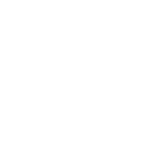
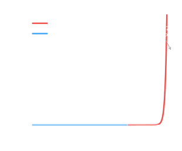
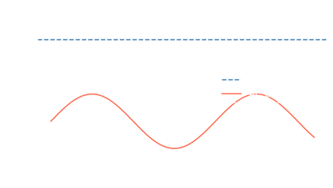
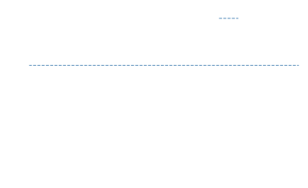

---

> [!abstract] Linear Circuits — ECE140
> ## Linear Circuits

ECE140 focuses on the **Schematic** level of abstraction — 0-dimensional, with a handful of connected circuit elements.

The course sits at the intersection of **Integration** (circuits: few to moderate elements) and **Abstraction** (schematic: moderate detail per element):

| Abstraction ↑ | Fewer elements → more detail |
|---|---|
| CAD (1D/2D/3D) | Devices |
| **Schematic (0D, connection)** | **Circuits ← ECE140** |
| Descriptive Languages (HDL) | Systems |

> [!hint] Labs
> ## Labs — Familiarize with Basic Components

Labs introduce the core bench instruments:

- **Multimeter** — measures V, I, R
- **Oscilloscope** — plots voltage vs. time
- **Function Generator** — outputs programmable waveforms
- **PSU (Power Supply Unit)** — provides DC voltage/current

---

> [!info] Basic Concepts
> ## Basic Concepts

In circuits, we care about three quantities and their units:

| Quantity | Symbol | Unit | SI Units | Definition |
|----------|--------|------|----------|------------|
| **Charge** | $Q$ | Coulomb (C) | A·s | Amount of electric charge |
| **Current** | $I$ | Ampere (A) | C/s | Charge flow rate |
| **Voltage** (electric potential) | $V$ | Volt (V) | J/C | Additional energy per unit charge |
| **Power** | $P$ | Watt (W) | J/s | Energy per time |

Key unit relationships:

$$1\,\text{C} = 1\,\text{A} \cdot 1\,\text{s} \qquad \text{(charge = current} \times \text{time)}$$

$$1\,\text{V} = \frac{1\,\text{J}}{1\,\text{C}} \qquad \text{(voltage = energy per unit charge)}$$

$$1\,\text{W} = \frac{1\,\text{J}}{1\,\text{s}} = 1\,\text{A} \cdot 1\,\text{V} \qquad \text{(power = energy / time)}$$

The three quantities form an intuitive triangle — **Voltage** (pressure) drives **Current** (rate of flow) through **Resistance** (friction).

---

> [!info] Unit Expressions
> ## Unit Expressions (SI Prefixes)

Use **metric prefix** (mV, nA) over scientific notation ($1 \times 10^{-9}$).

| Symbol | Name  | Factor |
|--------|-------|--------|
| T  | tera  | $10^{12}$ |
| G  | giga  | $10^{9}$  |
| M  | mega  | $10^{6}$  |
| k  | kilo  | $10^{3}$  |
| m  | milli | $10^{-3}$ |
| μ  | micro | $10^{-6}$ |
| n  | nano  | $10^{-9}$ |
| p  | pico  | $10^{-12}$ |
| f  | femto | $10^{-15}$ |

**Engineering notation** — like scientific notation, but snap powers to **multiples of 3**, then apply the prefix.

**Examples:**

| Original Value | Correct Engineering Notation |
|----------------|------------------------------|
| $0.032\,\text{M}\Omega$ ❌ | $32\,\text{k}\Omega$ ✓ |
| $5.1 \times 10^{-5}\,\text{A}$ ❌ | $51\,\mu\text{A}$ ✓ |
| $10^{7}\,\text{hertz}$ ❌ | $10\,\text{MHz}$ ✓ |
| $\dfrac{5}{3}\sqrt{2}\,\text{rad/s}$ | (leave as-is — already exact) |

**Significant figures** — "Good enough" procedure: perform calculations at full precision, then round to the **least number of significant figures** in the inputs.

> [!success]- Example: Voltage Divider (Click to expand)
> $V_2 = \dfrac{V_1 R_2}{R_1 + R_2}$, with $V_1 = 10.00\,\text{V}$, $R_1 = 47\,\text{k}\Omega$, $R_2 = 3.32\,\text{k}\Omega$
>
> "Exact" solution: $V_2 = 9.340223\,\text{V}$
>
> Correct solution: $V_2 = 9.34\,\text{V}$ (3 sig figs — limited by $R_2 = 3.32\,\text{k}\Omega$)

---

> [!info] Ideal Circuit Element
> ## Ideal Circuit Element (§1.5)

#### <u>Resistor</u>

$$V = IR \qquad \Longleftrightarrow \qquad I = \frac{V}{R}$$

The $I$–$V$ relationship is **linear**:

#### <u>Diode</u>

The diode is **non-linear** — current flows only in one direction above a threshold voltage (~0.7 V for silicon).

---

> [!info] Power and Energy
> ## Power and Energy (§1.6)

<u><strong style="color:#dab1da">Power</strong></u>: rate at which energy is transmitted.

$$P = V \cdot I \quad \text{(in linear circuits)}$$

$$P(t) = V(t) \cdot I(t)$$

**Is the element absorbing or delivering power?**

| Condition | Sign | Interpretation |
|-----------|------|----------------|
| $V > 0$, $I > 0$ (current into $+$ terminal) | $P = VI > 0$ | **Absorbing** (consuming) |
| $V > 0$, $I < 0$ (current out of $+$ terminal) | $P = VI < 0$ | **Delivering** |

- **Charge leaves with less energy** → Absorbing
- **Charge leaves with more energy** → Delivering

**Trick:** Label current into the positive terminal as **positive current**.
- $P > 0$ → consumed
- $P < 0$ → delivered

---

> [!info] AC vs DC
> ## AC vs DC

#### <u>Direct Current (DC)</u>

- **Original meaning:** Current and applied voltage do not change directions, but may fluctuate.
- **New meaning (modern):** The *constant* ("zero-frequency") part of the voltage/current signal.

#### <u>Alternating Current (AC)</u>

- **Original meaning:** Current and applied voltage change directions.
- **New meaning (modern):** The *time-varying* part of a voltage/current signal — has no constant offset (also called "non-zero frequency content").

$$\boxed{\text{Total signal} = \text{DC signal} + \text{AC signal}}$$

This terminology applies to **any signal**, regardless of physical meaning. E.g., "The total signal is the sum of the DC offset and AC components."

---

> [!hint] Waveform Nomenclature
> ## Waveform Nomenclature

From the waveform above (period $T_o = 5\,\mu\text{s}$, peak $V_{pk} = 4\,\text{V}$, average $V_{DC} = 3\,\text{V}$):

| Parameter | Symbol | Value | Meaning |
|-----------|--------|-------|---------|
| DC component | $V_{DC}$ | $3\,\text{V}$ | Average component |
| Peak voltage | $V_{pk}$ | $4\,\text{V}$ | Max value of signal |
| Peak-to-peak | $V_{pk\text{-}pk}$ | $2\,\text{V}$ | $\max(\text{AC}) - \min(\text{AC})$ |
| Period | $T_o$ | $5\,\mu\text{s}$ | Time for one full cycle |
| Frequency | $f_o$ | $0.2\,\text{MHz}$ | $f_o = 1/T_o$ |
| Angular frequency | $\omega_o$ | $0.4\pi\,\text{Mrad/s}$ | $\omega_o = 2\pi f_o = 2\pi/T_o$ |

The waveform equation:

$$v(t) = V_{DC} + (V_{pk} - V_{DC}) \sin(\omega_o t) = 3 + \sin\!\left(\frac{2\pi}{5} t\right) \quad [\text{V, } t\text{ in μs}]$$
