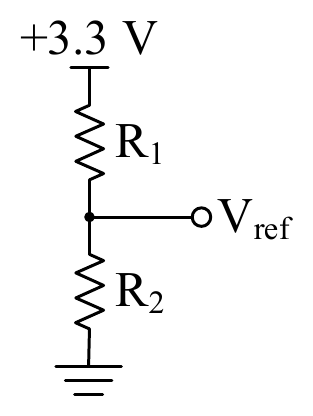
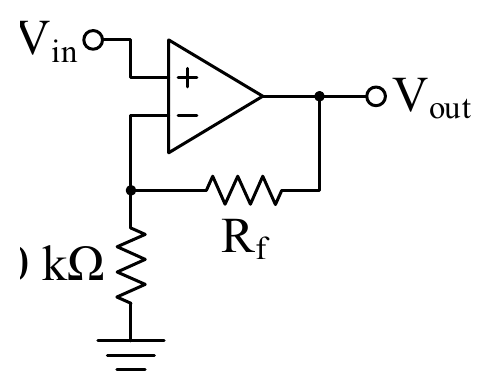
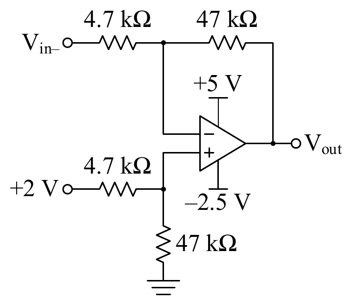
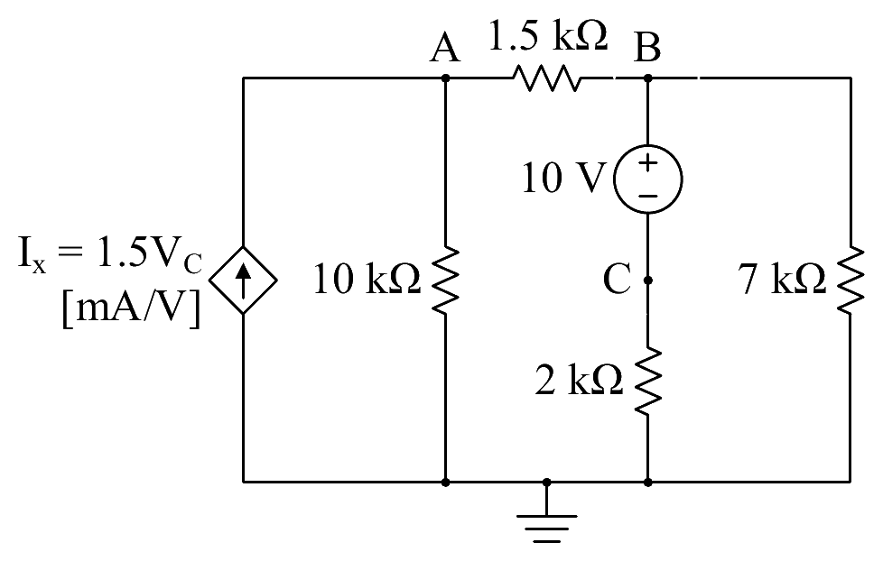
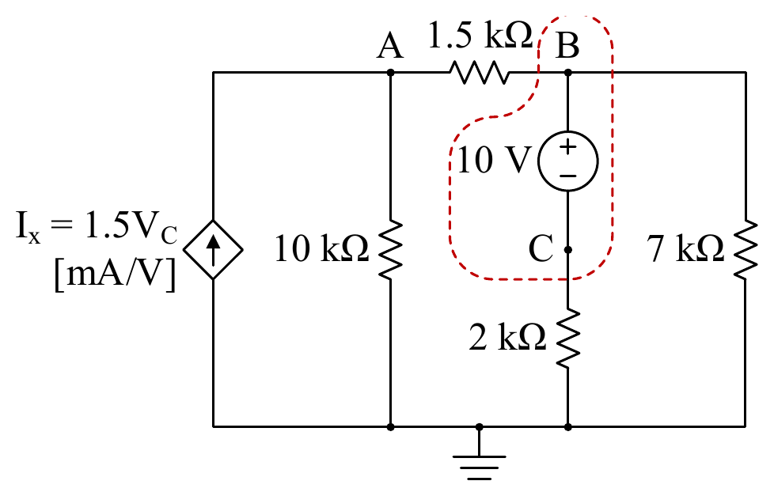
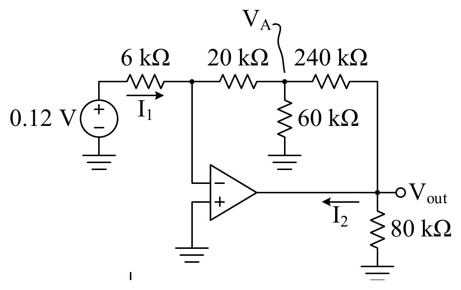

# ECE 140 Final Exam — Winter 2025

Transcribed from [[ECE 140 - W2025 - Final Solutions]] (`sources/ECE 140 - W2025 - Final Solutions.pdf`).
Each question shows only the statement; the official solution is folded underneath.

**Date:** April 9, 2025 · **Duration:** 150 minutes · **Total:** 83 marks
**Instructors:** Derek Wright (Section 1), Mike Cooper-Stachowsky (Section 2)

| Question | Marks |
|----------|-------|
| Q1       | 39    |
| Q2       | 10    |
| Q3       | 8     |
| Q4       | 10    |
| Q5       | 10    |
| Q6       | 6     |
| **Total**| **83**|

---

> [!example] Question 1a — 4 marks
> ## Nodal Analysis with a Current Source

Determine the voltages at nodes A and B, $V_A$ and $V_B$.

![[CE1B/ECE140-Linear-Circuits/sources/ECE 140 - W2025 - Final Solutions/_page_1_Picture_14.jpeg|55%]]

> [!success]- Solution (Click to expand)
> Work in $\text{mA}$ and $\text{k}\Omega$. KCL at node A:
>
> $$ 5 = \frac{V_A}{5} + \frac{V_A - V_B}{8} \implies 200 = 13V_A - 5V_B $$
>
> KCL at node B:
>
> $$ \frac{V_B - V_A}{8} + \frac{V_B - 10}{2} = 0 \implies 5V_B - V_A = 40 $$
>
> Substituting $5V_B = V_A + 40$ into the first equation:
>
> $$
> \begin{aligned}
> 200 &= 13V_A - (40 + V_A) \\
> 240 &= 12V_A \\
> V_A &= 20 \text{ V}
> \end{aligned}
> $$
>
> Then $5V_B - 20 = 40$, so
>
> $$ \boxed{V_A = 20 \text{ V}, \qquad V_B = 12 \text{ V}} $$

---

> [!example] Question 1b — 3 marks
> ## Open-Circuit Output of a Divider

Determine $V_{\text{out}}$ and $I_{\text{out}}$.

![[CE1B/ECE140-Linear-Circuits/sources/ECE 140 - W2025 - Final Solutions/_page_1_Figure_17.jpeg|55%]]

> [!success]- Solution (Click to expand)
> The output terminals are open-circuited, so $I_{\text{out}} = 0 \text{ A}$. With no current there is no drop across the $187 \ \Omega$ resistor, and $V_{\text{out}}$ is just the divider output:
>
> $$ V_{\text{out}} = 5 \cdot \frac{11}{11 + 13} = 2.29 \text{ V} $$
>
> $$ \boxed{V_{\text{out}} = 2.29 \text{ V}, \qquad I_{\text{out}} = 0 \text{ A}} $$

---

> [!example] Question 1c — 6 marks
> ## Reading a Sinusoid off the Oscilloscope

Given the oscilloscope plot of $v(t)$, state the signal's peak voltage (the amplitude, $V_{\text{pk}} = V_{\text{m}}$), RMS voltage ($V_{\text{RMS}}$), period ($T_0$), and frequency in Hz ($f_0$) and rad/s ($\omega_0$). Using the peak voltage (not RMS), write the phasor representation for this sinusoidal waveform, $\mathbf{V}$, in polar notation, including the correct units.

![[CE1B/ECE140-Linear-Circuits/sources/ECE 140 - W2025 - Final Solutions/_page_1_Figure_18.jpeg|45%]]

> [!success]- Solution (Click to expand)
> | Quantity | Value |
> |---|---|
> | $V_{\text{m}}$ | $30 \text{ mV}_{\text{pk}}$ |
> | $V_{\text{RMS}}$ | $V_{\text{m}}/\sqrt{2} = 21.2 \text{ mV}_{\text{RMS}}$ |
> | $T_0$ | $5 \text{ ms}$ |
> | $f_0$ | $1/T_0 = 200 \text{ Hz}$ |
> | $\omega_0$ | $2\pi f_0 = 1.26 \text{ krad/s}$ |
> | $\mathbf{V}$ | $30\angle{-90^\circ} \text{ mV}$ |
>
> The waveform starts at zero and rises, i.e. $v(t) = 30\sin(\omega_0 t)$, which lags a cosine by $90^\circ$ — hence the $-90^\circ$ phasor angle.

---

> [!example] Question 1d — 4 marks
> ## Designing a Divider under a Power Budget

Choose $R_1$ and $R_2$ so that $V_{\text{ref}} = 1.2 \text{ V}$ and the total power dissipated by $R_1$ and $R_2$ does not exceed $1 \text{ mW}$. Demonstrate through calculation that the power requirement is met.

> [!success]- Solution (Click to expand)
> **Voltage constraint:**
>
> $$
> \begin{aligned}
> V_{\text{ref}} &= 3.3 \frac{R_2}{R_1 + R_2} \\
> 1.2(R_1 + R_2) &= 3.3 R_2 \\
> R_1 &= \frac{(3.3 - 1.2)R_2}{1.2} = \frac{2.1}{1.2}R_2 = 1.75R_2
> \end{aligned}
> $$
>
> **Power constraint:** the two resistors are in series across the full $3.3 \text{ V}$, so
>
> $$ P_{\text{Total}} = P_{R_1} + P_{R_2} = \frac{V_{\text{Total}}^2}{R_{\text{Total}}} = \frac{3.3^2}{R_1 + R_2} \le 1 \text{ mW} $$
>
> $$ \therefore \frac{3.3^2}{1\text{m}} \le R_1 + R_2 \implies R_1 + R_2 \ge 10.89 \text{ k}\Omega $$
>
> At the lower limit this gives
>
> $$ \boxed{R_1 = 6.93 \text{ k}\Omega \text{ (min)}, \qquad R_2 = 3.96 \text{ k}\Omega \text{ (min)}} $$
>
> Anything larger that keeps the ratio $R_1 = 1.75R_2$ is also correct. It is equally acceptable to pick a reasonable starting value and verify afterwards — e.g. $R_2 = 10 \text{ k}\Omega$ gives $R_1 = 17.5 \text{ k}\Omega$, and then $P_{\text{Total}} = 3.3^2/27.5\text{k} = 0.396 \text{ mW} \le 1 \text{ mW}$.

---

> [!example] Question 1e — 3 marks
> ## Thevenin Equivalent by Source Transformation

Determine the Thevenin equivalent circuit parameters, $V_{\text{Th}}$ and $R_{\text{Th}}$, for node A with respect to node B.

![[CE1B/ECE140-Linear-Circuits/sources/ECE 140 - W2025 - Final Solutions/_page_2_Picture_13.jpeg|40%]]

> [!success]- Solution (Click to expand)
> $$ \boxed{V_{\text{Th}} = 4.2 \text{ V}, \qquad R_{\text{Th}} = 2.1 \ \Omega} $$
>
> Use whatever approach you are most comfortable with. Here is the simplification via successive source transforms:
>
> ![[CE1B/ECE140-Linear-Circuits/sources/ECE 140 - W2025 - Final Solutions/_page_2_Picture_14.jpeg|100%]]

---

> [!example] Question 1f — 4 marks
> ## Noninverting Gain with Resistor Tolerance

Determine the resistance $R_f$ to achieve a closed-loop gain $A_{\text{ideal}} = 20 \text{ [V/V]}$. Assuming that **both resistors** have a $\pm 5\%$ tolerance, determine the worst-case maximum and minimum gains, $A_{\text{max}}$ and $A_{\text{min}}$.

> [!success]- Solution (Click to expand)
> Noninverting amplifier:
>
> $$ A = 1 + \frac{R_f}{R_i}, \qquad R_f = (A - 1)R_i = (20 - 1) \times 10\text{k} = 190 \text{ k}\Omega $$
>
> The gain is largest when the feedback resistor is at its maximum and the input resistor at its minimum:
>
> $$ A_{\text{max}} = 1 + \frac{R_{f,\text{max}}}{R_{i,\text{min}}} = 1 + \frac{1.05 \times 190}{0.95 \times 10} = 22 \text{ V/V} $$
>
> $$ A_{\text{min}} = 1 + \frac{R_{f,\text{min}}}{R_{i,\text{max}}} = 1 + \frac{0.95 \times 190}{1.05 \times 10} = 18.2 \text{ V/V} $$
>
> $$ \boxed{R_f = 190 \text{ k}\Omega, \qquad A_{\text{max}} = 22 \text{ V/V}, \qquad A_{\text{min}} = 18.2 \text{ V/V}} $$

---

> [!example] Question 1g — 4 marks
> ## Extracting a Source Model from Two Operating Points

A lab voltage supply is modelled as a Thevenin-equivalent circuit, as shown. When two different loads are connected one after the other (not shown), the following two operating points are observed:

- $V_{\text{OUT}} = 3.298 \text{ V}$ @ $I_{\text{OUT}} = 30 \text{ mA}$
- $V_{\text{OUT}} = 3.286 \text{ V}$ @ $I_{\text{OUT}} = 270 \text{ mA}$

Determine the Thevenin-equivalent voltage and resistance of the output.

![[CE1B/ECE140-Linear-Circuits/sources/ECE 140 - W2025 - Final Solutions/_page_3_Picture_2.jpeg|35%]]

> [!success]- Solution (Click to expand)
> The output resistance is the slope of the load line:
>
> $$ R_{\text{Th}} = \frac{\Delta V_{\text{OUT}}}{\Delta I_{\text{OUT}}} = \frac{12 \text{ mV}}{240 \text{ mA}} = 50 \text{ m}\Omega $$
>
> If this isn't apparent, the KVL equation below can be written for both data points and solved as two equations in two unknowns. $V_{\text{Th}}$ then follows from KVL with either point:
>
> $$
> \begin{aligned}
> V_{\text{Th}} - I_{\text{OUT}}R_{\text{Th}} - V_{\text{OUT}} &= 0 \\
> V_{\text{Th}} - 30\text{m} \times 50\text{m} - 3.298 &= 0
> \end{aligned}
> $$
>
> $$ \boxed{V_{\text{Th}} = 3.300 \text{ V}, \qquad R_{\text{Th}} = 50 \text{ m}\Omega} $$

---

> [!example] Question 1h — 6 marks
> ## Input Range of a Difference Amplifier

Determine the maximum and minimum allowable values of $V_{\text{in-}}$, namely $V_{\text{in-,max}}$ and $V_{\text{in-,min}}$.

> [!success]- Solution (Click to expand)
> This is a difference amplifier:
>
> $$ V_{\text{out}} = \frac{R_f}{R_i}(V_{\text{in+}} - V_{\text{in-}}) = \frac{47}{4.7}(2 - V_{\text{in-}}) = 20 - 10V_{\text{in-}} $$
>
> When $V_{\text{in-}}$ increases, $V_{\text{out}}$ decreases, and vice versa. So $V_{\text{in-,max}}$ is associated with the *minimum* allowable output voltage ($-2.5 \text{ V}$, the negative rail) and $V_{\text{in-,min}}$ with the maximum allowable output voltage ($+5 \text{ V}$):
>
> $$ V_{\text{out,min}} = -2.5 = 20 - 10V_{\text{in-,max}} \implies V_{\text{in-,max}} = 2.25 \text{ V} $$
>
> $$ V_{\text{out,max}} = 5 = 20 - 10V_{\text{in-,min}} \implies V_{\text{in-,min}} = 1.5 \text{ V} $$
>
> $$ \boxed{V_{\text{in-,max}} = 2.25 \text{ V}, \qquad V_{\text{in-,min}} = 1.5 \text{ V}} $$

---

> [!example] Question 1i — 5 marks
> ## Lab Safety

Circle the most correct answer for each question.

1) What type of footwear is not allowed in the lab?
    A. Sneakers
    B. Running shoes
    C. Sandals
    D. Boots

2) Why is it dangerous to bring liquids into the lab?
    A. They can cause fire or electrocution.
    B. They could stain the lab manuals.
    C. They can damage the breadboards.
    D. It's just a general rule.

3) When preparing to measure current using a multimeter, which configuration is safe and correct?
    A. Connect the meter in parallel with the powered circuit and set it to voltage mode.
    B. Connect the meter directly across any charged capacitors and set it to resistance mode.
    C. Connect the meter in parallel with the circuit component and set it to current mode.
    D. Connect the meter in series with the powered circuit and set it to current mode.

4) You notice a frayed power cable on your lab power supply. What should you do?
    A. Wrap the frayed cable securely with electrical tape and continue using it.
    B. Inform your lab instructor immediately and avoid using the equipment.
    C. Switch the unit off periodically to prevent overheating.
    D. Handle the cable carefully, avoiding direct contact with the frayed area.

5) Before changing components in your circuit, you must first:
    A. Lower the voltage slightly to avoid large current spikes.
    B. Turn off the power supply and discharge all capacitors.
    C. Ground the negative terminal of your power supply to the lab bench.
    D. Confirm the circuit is functioning correctly to avoid misdiagnosing faults.

> [!success]- Solution (Click to expand)
> 1. **C.** Sandals
> 2. **A.** They can cause fire or electrocution.
> 3. **D.** Connect the meter in series with the powered circuit and set it to current mode.
> 4. **B.** Inform your lab instructor immediately and avoid using the equipment.
> 5. **B.** Turn off the power supply and discharge all capacitors.

---

> [!example] Question 2 — 10 marks
> ## Supernode with a Dependent Source

Find the unknown node voltages and circle the supernode.

> [!success]- Solution (Click to expand)
> The $10 \text{ V}$ source floats between B and C, so B and C form a **supernode** (shown in red below).
>
> 
>
> Working in $\text{mA}$ and $\text{k}\Omega$ — KCL at node A (the dependent source delivers $1.5V_C$ mA into A):
>
> $$ 1.5V_C = \frac{V_A}{10} + \frac{V_A - V_B}{1.5} $$
>
> KCL over the supernode:
>
> $$ \frac{V_B - V_A}{1.5} + \frac{V_C}{2} + \frac{V_B}{7} = 0 $$
>
> Constraint equation across the floating source:
>
> $$ V_B = V_C + 10 $$
>
> Solving the three equations:
>
> $$ \boxed{V_A = 20 \text{ V}, \qquad V_B = 14 \text{ V}, \qquad V_C = 4 \text{ V}} $$

---

> [!example] Question 3 — 8 marks
> ## Opamp with a T-Network Feedback Path

Determine $V_A$, $V_{\text{out}}$, $I_1$, and $I_2$.

> [!success]- Solution (Click to expand)
> It's almost an inverting amplifier, but the feedback network is too complicated to use $A = -R_f/R_i$. Since there's closed-loop negative feedback (CLNF), start there: the opamp sets $V_- = V_+ = 0 \text{ V}$. Now do nodal analysis at $V_-$ and $V_A$ (units of $\text{V}$, $\text{k}\Omega$, $\text{mA}$).
>
> KCL at $V_-$:
>
> $$ \frac{V_- - 0.12}{6} + \frac{V_- - V_A}{20} = 0 $$
>
> Since $V_- = 0 \text{ V}$:
>
> $$ -\frac{0.12}{6} - \frac{V_A}{20} = 0 \implies V_A = -0.4 \text{ V} $$
>
> KCL at $V_A$:
>
> $$ \frac{V_A - V_-}{20} + \frac{V_A - 0}{60} + \frac{V_A - V_{\text{out}}}{240} = 0 $$
>
> $$ \frac{-0.4}{20} + \frac{-0.4}{60} + \frac{-0.4 - V_{\text{out}}}{240} = 0 \implies V_{\text{out}} = -6.8 \text{ V} $$
>
> The input current flows through the $6 \text{ k}\Omega$ into the virtual ground:
>
> $$ I_1 = \frac{0.12 - 0}{6} = 20 \ \mu\text{A} $$
>
> KCL at $V_{\text{out}}$ gives the opamp output current $I_2$:
>
> $$ \frac{V_{\text{out}} - V_A}{240} + \frac{V_{\text{out}}}{80} + I_2 = 0 $$
>
> $$ \frac{-6.8 - (-0.4)}{240} + \frac{-6.8}{80} + I_2 = 0 \implies I_2 = 112 \ \mu\text{A} $$
>
> $$ \boxed{V_A = -0.4 \text{ V}, \quad V_{\text{out}} = -6.8 \text{ V}, \quad I_1 = 20 \ \mu\text{A}, \quad I_2 = 112 \ \mu\text{A}} $$

---

> [!example] Question 4 — 10 marks
> ## Impedance, Phasor Current, and Complex Power

![[CE1B/ECE140-Linear-Circuits/sources/ECE 140 - W2025 - Final Solutions/_page_5_Figure_4.jpeg|60%]]

**(a)** [5 marks] Given $\omega_0 = 25 \text{ krad/s}$, determine the impedances of L and C ($Z_L$ and $Z_C$, respectively), and the equivalent impedance at node a with respect to node b, $Z_{ab}$.

**(b)** [2 marks] The voltage applied to node a is $\mathbf{V}_{\text{in}} = 10\angle 0^\circ \text{ V}_{\text{RMS}}$. Determine the current entering the circuit, $\mathbf{I}_{\text{in}}$.

**(c)** [3 marks] Determine the real and reactive power at the input, $P_{\text{in}}$ and $Q_{\text{in}}$, respectively. Then, express this as a complex power phasor, $\mathbf{S}_{\text{in}}$. Be sure to include the correct units.

> [!success]- Solution (Click to expand)
> **(a)** The element impedances are
>
> $$ Z_L = j\omega_0 L = j \times 25\text{k} \times 1.6\text{m} = j40 \ \Omega = 40\angle 90^\circ \ \Omega $$
>
> $$ Z_C = \frac{1}{j\omega_0 C} = -\frac{j}{25\text{k} \times 1\mu} = -j40 \ \Omega = 40\angle{-90^\circ} \ \Omega $$
>
> The inductor is in parallel with the series $80 \ \Omega$ and capacitor branch, all in series with the $10 \ \Omega$:
>
> $$
> \begin{aligned}
> Z_{ab} &= 10 + [Z_L \parallel (80 + Z_C)] \\
> &= 10 + [j40 \parallel (80 - j40)] \\
> &= 10 + \left(\frac{1}{j40} + \frac{1}{80 - j40}\right)^{-1} \\
> &= 10 + \left(\frac{80 - j40 + j40}{j40(80 - j40)}\right)^{-1} \\
> &= 10 + \frac{j40(80 - j40)}{80} \\
> &= 10 + j20(2 - j) \\
> &= 10 + j40 + 20 \\
> &= 30 + j40 \ \Omega = 50\angle 53^\circ \ \Omega
> \end{aligned}
> $$
>
> **(b)** Ohm's law in phasor form:
>
> $$ \mathbf{I}_{\text{in}} = \frac{\mathbf{V}_{\text{in}}}{Z_{ab}} = \frac{10\angle 0^\circ}{50\angle 53^\circ} = 0.12 - j0.16 \text{ A} = 0.2\angle{-53^\circ} \text{ A} $$
>
> **(c)** Since $\mathbf{V}_{\text{in}}$ is given in RMS, the complex power follows directly:
>
> $$ \mathbf{S}_{\text{in}} = \mathbf{V}_{\text{in}}\mathbf{I}_{\text{in}}^* = 10(0.12 + j0.16) = 1.2 + j1.6 \text{ VA} = 2\angle 53^\circ \text{ VA} $$
>
> $$ \boxed{P_{\text{in}} = 1.2 \text{ W}, \quad Q_{\text{in}} = 1.6 \text{ VAR}, \quad \mathbf{S}_{\text{in}} = 1.2 + j1.6 \text{ VA} = 2\angle 53^\circ \text{ VA}} $$

---

> [!example] Question 5 — 10 marks
> ## USB Charger with a Shorted Cable

The Thevenin equivalent circuit of a $5 \text{ V}$ USB charger output is shown in the dashed box of the figure. A long cable with inductance $L_{\text{Cable}}$ connects the charger output to a load, $R_L$.

![[CE1B/ECE140-Linear-Circuits/sources/ECE 140 - W2025 - Final Solutions/_page_5_Picture_18.jpeg|55%]]

**(a)** [4 marks] Ignore the switch for now. When no load is connected, $V_{\text{out}} = 5.000 \text{ V}$. However, $V_{\text{out}}$ stabilizes at $4.975 \text{ V}$ when a load $R_L = 10 \text{ k}\Omega$ is connected. Determine $R_{\text{Th}}$ and $I_{\text{out}}$.

**(b)** [6 marks] $L_{\text{Cable}}$ is measured to be $4 \ \mu\text{H}$. A short occurs at time $t = 0$, modelled as a switch closing around $R_L$. Determine an expression for the output current, $I_{\text{out}}(t)$, valid for $t \ge 0$. Determine $V_{\text{out}}(t = 100 \text{ ns})$.

> [!success]- Solution (Click to expand)
> **(a)** With no load, $V_{\text{Th}} = 5.000 \text{ V}$. Loaded, the output is a divider:
>
> $$ V_{\text{out}} = V_{\text{Th}}\frac{R_L}{R_L + R_{\text{Th}}} \implies R_{\text{Th}} = \frac{V_{\text{Th}}R_L}{V_{\text{out}}} - R_L = \frac{5 \times 10\text{k}}{4.975} - 10\text{k} = 50 \ \Omega $$
>
> $$ I_{\text{out}} = \frac{V_{\text{out}}}{R_L} = \frac{4.975}{10\text{k}} = 497.5 \ \mu\text{A} $$
>
> **(b)** First-order $RL$ step response. The inductor current cannot change instantaneously, so the initial value is the pre-short load current; the final value is the short-circuit current, and the time constant uses $R_{\text{Th}}$:
>
> $$ I_{\text{i}} = 497.5 \ \mu\text{A}, \qquad I_{\text{f}} = I_{\text{sc}} = \frac{V_{\text{Th}}}{R_{\text{Th}}} = \frac{5}{50} = 100 \text{ mA}, \qquad \tau = \frac{L_{\text{Cable}}}{R_{\text{Th}}} = \frac{4\mu}{50} = 80 \text{ ns} $$
>
> $$ \therefore I_{\text{out}}(t) = I_{\text{f}} + (I_{\text{i}} - I_{\text{f}})e^{-\frac{t}{\tau}} = 100 - 99.5e^{-\frac{t}{80\text{n}}} \text{ [mA]} $$
>
> Given this current, the output voltage is set by the drop across $R_{\text{Th}}$:
>
> $$ I_{\text{out}}(t = 100 \text{ ns}) = 100 - 99.5e^{-\frac{100\text{n}}{80\text{n}}} \text{ [mA]} = 71.5 \text{ mA} $$
>
> $$ V_{\text{out}}(t = 100 \text{ ns}) = V_{\text{Th}} - I_{\text{out}}(t = 100 \text{ ns})R_{\text{Th}} = 5 - 71.5\text{m} \times 50 = 1.425 \text{ V} $$
>
> $$ \boxed{R_{\text{Th}} = 50 \ \Omega, \quad I_{\text{out}} = 497.5 \ \mu\text{A}, \quad I_{\text{out}}(t) = 100 - 99.5e^{-t/80\text{ns}} \text{ mA}, \quad V_{\text{out}}(100 \text{ ns}) = 1.425 \text{ V}} $$

---

> [!example] Question 6 — 6 marks
> ## Sizing a Sensor Resistance for a Comparator Delay

A sensor generates a step output voltage signal, $V_s = 0 \rightarrow 5 \text{ V}$, when a dangerous material falls during handling. The system must be immediately disabled when $V_s$ exceeds $1.4 \text{ V}$ **with no more than a $3 \ \mu\text{s}$ delay**. An opamp comparator (LM393A) ensures there is minimal output delay once $V_+ > V_-$, however, the sensor's output resistance, $R_s$, interacts with the comparator's $5 \text{ pF}$ input capacitance to cause an RC switching delay.

![[CE1B/ECE140-Linear-Circuits/sources/ECE 140 - W2025 - Final Solutions/_page_6_Picture_13.jpeg|50%]]

Assuming that the sensor triggers ($V_s = 0 \rightarrow 5 \text{ V}$) at $t = 0$, determine the maximum allowable sensor output resistance, $R_{s,\text{max}}$, so that the noninverting input voltage $V_+ = 1.4 \text{ V}$ at $t = 3 \ \mu\text{s}$. Anything larger than this resistance causes a time constant that is too slow.

> [!success]- Solution (Click to expand)
> First-order $RC$ step response with
>
> $$ V_{\text{i}} = 0 \text{ V}, \qquad V_{\text{f}} = 5 \text{ V}, \qquad \tau = R_s C_+ $$
>
> $$ V_+(t) = V_{\text{f}} + (V_{\text{i}} - V_{\text{f}})e^{-\frac{t}{R_s C_+}} = 5 - 5e^{-\frac{t}{R_s \cdot 5\text{p}}} $$
>
> Setting $V_+ = 1.4 \text{ V}$ at $t = 3 \ \mu\text{s}$:
>
> $$ 1.4 = 5 - 5e^{-\frac{3\mu}{R_{s,\text{max}} \times 5\text{p}}} $$
>
> $$ e^{-\frac{600\text{k}}{R_{s,\text{max}}}} = 0.72 \implies R_{s,\text{max}} = -\frac{600\text{k}}{\ln(0.72)} = 1.83 \text{ M}\Omega $$
>
> $$ \boxed{R_{s,\text{max}} = 1.83 \text{ M}\Omega} $$
