# CHAPTER

# 9

### CHAPTER CONTENTS

- 9.1 The Sinusoidal Source *p. 320*
- 9.2 The Sinusoidal Response *p. 323*
- 9.3 The Phasor *p. 324*
- 9.4 The Passive Circuit Elements in the Frequency Domain *p. 327*
- 9.5 Kirchhoff's Laws in the Frequency Domain *p. 332*
- 9.6 Series, Parallel, and Delta-to-Wye Simplifications *p. 333*
- 9.7 Source Transformations and Thévenin– Norton Equivalent Circuits *p. 340*
- 9.8 The Node-Voltage Method *p. 344*
- 9.9 The Mesh-Current Method *p. 345*
- 9.10 The Transformer *p. 347*
- 9.11 The Ideal Transformer *p. 351*
- 9.12 Phasor Diagrams *p. 357*

### CHAPTER OBJECTIVES

- 1 Understand phasor concepts and be able to perform a phasor transform and an inverse phasor transform.
- 2 Be able to transform a circuit with a sinusoidal source into the frequency domain using phasor concepts.
- 3 Know how to use the following circuit-analysis techniques to solve a circuit in the frequency domain:
  - Kirchhoff's laws;
  - Series, parallel, and delta-to-wye simplifications;
  - Voltage and current division;
  - Thévenin and Norton equivalents;
  - Node-voltage method; and
  - Mesh-current method.
- 4 Be able to analyze circuits containing linear transformers using phasor methods.
- 5 Understand the ideal transformer constraints and be able to analyze circuits containing ideal transformers using phasor methods.

# Sinusoida l [Steady-State Analysis](#page--1-0)

Thus far, we have focused on circuits with constant sources; in this chapter we are now ready to consider circuits energized by sinusoidal voltage or current sources. For these circuits, we will calculate the values of the specified output voltages and currents in the steady state. This means we will not know the complete response of the circuits, which in general is the sum of the transient (or natural) response and the steady-state response. Our analysis will only characterize a circuit's response once the transient component has decayed to zero.

Sinusoidal sources and their effect on circuit behavior form an important area of study for several reasons.

- Generating, transmitting, distributing, and consuming electric energy occurs under essentially sinusoidal steady-state conditions.
- Understanding sinusoidal behavior makes it possible to predict the behavior of circuits with nonsinusoidal sources.
- Specifying the behavior of an electrical system in terms of its steady-state sinusoidal response simplifies the design. If the system satisfies the specifications, the designer knows that the circuit will respond satisfactorily to nonsinusoidal inputs.

The remaining chapters of this book are largely based on the techniques used when analyzing circuits with sinusoidal sources. Fortunately, the circuit analysis and simplification techniques from Chapters 1–4 work for circuits with sinusoidal as well as dc sources, so some of the material in this chapter will be very familiar to you. The challenges of sinusoidal analysis include developing the appropriate component models, writing the equations that describe the resulting circuit, and working with complex numbers.

# [Practical Perspective](#page--1-0)

### A Household Distribution Circuit

Power systems that generate, transmit, and distribute electrical power are designed to operate in the sinusoidal steady state. The standard household distribution circuit used in the United States supplies both 120 V and 240 V.

Consider the following situation. At the end of a day of fieldwork, a farmer returns to the farmstead, checks the hog confinement building, and finds the hogs are dead. The problem is traced to a blown fuse that caused a 240 V fan motor to stop. The loss of ventilation led to the suffocation of the livestock. The interrupted fuse is located in the main switch that connects the farmstead to the electrical service.

Before the insurance company settles the claim, it wants to know if the electric circuit supplying the farmstead functioned properly. The lawyers for the insurance company are puzzled because one of the farmer's children was home from school and spent part of the day playing video games in the living room. At one point they used the kitchen microwave to reheat some leftovers. The lawyers have hired you to explain why the kitchen appliances and the living room electronics continued to operate after the fuse in the main switch blew.

We will explore this situation and answer the question after learning how to calculate the steady-state response of circuits with sinusoidal sources.

Yulia Grigoryeva/Shutterstock

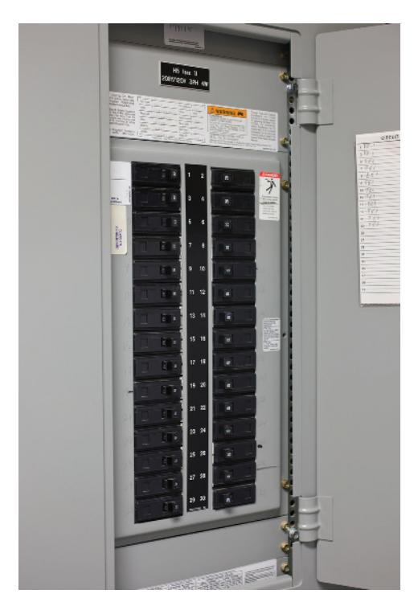

Björn Erlandsson /123RF Tetra Images/Alamy Stock Photo

# 9.1 [The Sinusoidal Source](#page--1-0)

A **sinusoidal voltage source** (independent or dependent) produces a voltage that varies sinusoidally with time. A **sinusoidal current source** (independent or dependent) produces a current that varies sinusoidally with time. We begin by reviewing the sinusoidal function, using a voltage source as an example, but our observations also apply to current sources.

We can express a sinusoidally varying function with either the sine function or the cosine function. Although they work equally well, we cannot use both functional forms simultaneously. We will use the cosine function throughout our discussion. Hence, we write a sinusoidally varying voltage as

$$v = V_m \cos(\omega t + \phi). \tag{9.1}$$

To aid discussion of the parameters in Eq. 9.1, we show the voltage versus time plot in Fig. 9.1. The coefficient *Vm* gives the maximum **amplitude** of the sinusoidal voltage. Because ±1 bounds the cosine function, ±*Vm* bounds the amplitude, as seen in Fig. 9.1. You can also see that the sinusoidal function repeats at regular intervals; therefore, it is a periodic function. A periodic function is characterized by the time required for the function to pass through all its possible values. This time is the **period** of the function, *T*, and is measured in seconds. The reciprocal of *T* gives the number of cycles per second, or the frequency, of the periodic function, and is denoted *f*, so

$$f = \frac{1}{T}.\tag{9.2}$$

A cycle per second is called a hertz, abbreviated Hz. (The term *cycles per second* rarely is used in contemporary technical literature.)

Now look at the coefficient of *t* in Eq. 9.1. Omega ( ) *ω* represents the **angular frequency** of the sinusoidal function and is related to both *T* and *f*:

$$\omega = 2\pi f = 2\pi/T \text{(radians/second)}.$$
 (9.3)

Equation 9.3 tells us that the cosine (or sine) function passes through a complete set of values each time its argument, *ωt*, passes through 2 r *π* ad(360°). From Eq. 9.3, we see that whenever *t* is an integral multiple of *T*, the argument *ωt* increases by an integral multiple of 2*π* rad.

The angle *φ* in Eq. 9.1 is the **phase angle** of the sinusoidal voltage. It determines the value of the sinusoidal function at *t* = 0; therefore, it fixes the point on the periodic wave where we start measuring time. Changing the phase angle *φ* shifts the sinusoidal function along the time axis but has no effect on either the amplitude ( ) *Vm* or the angular frequency ( ) *ω* . Note, for example, that reducing *φ* to zero shifts the sinusoidal function shown in Fig. 9.1 *φ ω* time units to the right, as shown in Fig. 9.2. When compared with a sinusoidal function with *φ* = 0, a sinusoidal function with a positive *φ* is shifted to the left, while a sinusoidal function with a negative *φ* is shifted to the right. (See Problem 9.1.)

Remember that *ωt* and *φ* must carry the same units because the argument of the sinusoidal function is ( ) *ω φ t* + . With *ωt* expressed in radians, you would expect *φ* to also be in radians. However, *φ* normally is given in degrees, and *ωt* is converted from radians to degrees before the two quantities are added. The conversion from radians to degrees is given by

(number of degrees) = 
$$\frac{180^{\circ}}{\pi}$$
 (number of radians).

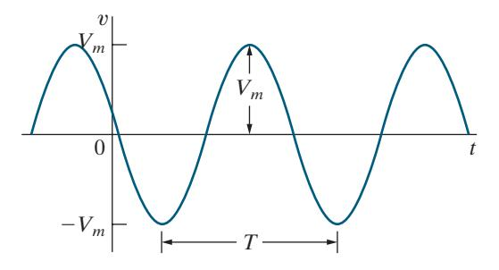

Figure 9.1 ▲ A sinusoidal voltage.

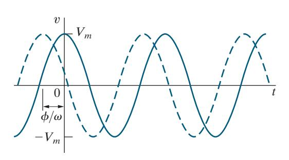

Figure 9.2 ▲ The sinusoidal voltage from Fig. 9.1 shifted to the right when *φ* = 0.

Another important characteristic of the sinusoidal voltage (or current) is its **rms value**. The rms value of a periodic function is defined as the square **r**oot of the **m**ean value of the **s**quared function. Hence, if *v* = + *V t m* cos , ( ) *ω φ* the rms value of *v* is

$$V_{\rm rms} = \sqrt{\frac{1}{T} \int_{t_0}^{t_0 + T} V_m^2 \cos^2(\omega t + \phi) dt}.$$
 (9.4)

Note from Eq. 9.4 that we obtain the mean value of the squared voltage by integrating *v* 2 over one period (that is, from *t* 0 to *t T* 0 + ) and then dividing by the range of integration, *T*. Note further that the starting point for the integration *t* 0 is arbitrary.

The quantity under the square root sign in Eq. 9.4 reduces to *Vm* 2. 2 (See Problem 9.8.) Hence, the rms value of *v* is

### RMS VALUE OF A SINUSOIDAL VOLTAGE SOURCE

$$V_{\rm rms} = \frac{V_m}{\sqrt{2}}.$$
 (9.5)

The rms value of the sinusoidal voltage depends only on the maximum amplitude of *v* , namely, *Vm*. The rms value is not a function of either the frequency or the phase angle. In Chapter 10, we explain the importance of the rms value and use it extensively to calculate power in circuits with sinusoidal sources.

We can completely describe a specific sinusoidal signal if we know its frequency, phase angle, and amplitude. Examples 9.1, 9.2, and 9.3 illustrate these basic properties of the sinusoidal function. In Example 9.4, we calculate the rms value of a periodic function, and in so doing we clarify the meaning of *root mean square*.

### EXAMPLE 9.1 Finding the Characteristics of a Sinusoidal Current

A sinusoidal current has a maximum amplitude of 20 A. The current passes through one complete cycle in 1 ms. The magnitude of the current at *t* = 0 is 10 A.

- a) What is the frequency of the current in hertz?
- b) What is the frequency in radians per second?
- c) Write the expression for *i t* ( ) using the cosine function. Express *φ* in degrees.
- d) What is the rms value of the current?

### Solution

a) From the statement of the problem, *T* = 1 ms; hence, *f T* = = 1 1 0.001 1000 = Hz.

- b) *ω π* = = 2 2 *f π π* ( ) 1000 2000 = rad/s.
- c) We have

$$i(t) = I_m \cos(\omega t + \phi)$$
  
= 20\cos(2000\pi t + \phi) A,

but *i*( ) 0 1 = 0 A. Therefore, 10 = 20 cos*φ*, so *φ* = ° 60 . Thus, the expression for *i t* ( ) becomes

$$i(t) = 20\cos(2000\pi t + 60^{\circ}) \text{ A}.$$

d) From Eq. 9.5, the rms value of a sinusoidal current is *I m* 2 . Therefore, the rms value is 20 2 , or 14.14 A.

### EXAMPLE 9.2 Finding the Characteristics of a Sinusoidal Voltage

A sinusoidal voltage is given by the expression *v* = + 300 cos(120 30 *πt* °) V.

- a) What is the period of the voltage in milliseconds?
- b) What is the frequency in hertz?
- c) What is the magnitude of *v* at *t* = 2.778 ms?
- d) What is the rms value of *v* ?

### Solution

- a) From the expression for *v* , *ω π* = 120 rad s. Because *ω π* = = 2 , *T T* 2 1 *π ω* = 60 s, or 16.667 ms.
- b) The frequency is 1 , *T* or 60 Hz.
- c) From (a), *ω π* = 2 16.667; thus, at *t* = 2.778 ms, *ωt* is nearly 1.047 rad, or 60°. Therefore, *v*( ) 2.778 ms = ° 300 cos 6( ) 0 3 + ° 0 0 = V.
- d) *V* 300 2 212.13 V. rms = =

### EXAMPLE 9.3 Translating a Sine Expression to a Cosine Expression

We can translate the sine function to the cosine function by subtracting 90°( 2 *π* rad) from the argument of the sine function.

a) Verify this translation by showing that

$$\sin(\omega t + \theta) = \cos(\omega t + \theta - 90^{\circ}).$$

b) Use the result in (a) to express sin 3 ( ) *ωt* + ° 0 as a cosine function.

### Solution

a) Verification involves direct application of the trigonometric identity

$$\cos(\alpha - \beta) = \cos\alpha \cos\beta + \sin\alpha \sin\beta.$$

We let *α ω* = +*t θ* and *β* = ° 90 . From the trigonometric identity,

$$\cos(\omega t + \theta - 90^{\circ}) = \cos(\omega t + \theta)\cos(90^{\circ}) + \sin(\omega t + \theta)\sin(90^{\circ}).$$

Since cos 90 0 ° = and sin 90 1 ° = , we have

$$\cos(\omega t + \theta - 90^{\circ}) = \sin(\omega t + \theta).$$

b) From (a) we have

$$\sin(\omega t + 30^\circ) = \cos(\omega t + 30^\circ - 90^\circ)$$
$$= \cos(\omega t - 60^\circ).$$

### EXAMPLE 9.4 Calculating the rms Value of a Triangular Waveform

Calculate the rms value of the periodic triangular current shown in Fig. 9.3. Express your answer in terms of the peak current *I* . *p*

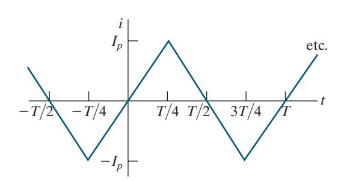

Figure 9.3 ▲ Periodic triangular current.

### Solution

From the definition of rms, the rms value of *i* is

$$I_{\rm rms} = \sqrt{\frac{1}{T} \int_{t_0}^{t_0 + T} i^2 dt}.$$

Interpreting the integral under the square root sign as the area under the squared function for an interval of one period helps us find the rms value. The squared function, with the area between 0 and *T* shaded, is shown in [Fig. 9.4.](#page-5-0) Notice that the area under the squared current for an interval of one period is equal to four times the area under the squared current for the interval 0 to *T* 4 seconds; that is,

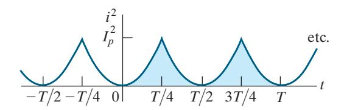

Figure 9.4 ▲ *i* 2 versus *t*.

$$\int_{t_0}^{t_0+T} i^2 dt = 4 \int_0^{T/4} i^2 dt.$$

The analytical expression for *i* in the interval 0 to *T* 4 is

$$i = \frac{4I_p}{T}t$$
,  $0 < t < T/4$ .

The area under the squared function for one period is

$$\int_{t_0}^{t_0+T} i^2 dt = 4 \int_0^{T/4} \frac{16I_p^2}{T^2} t^2 dt = \frac{I_p^2 T}{3}.$$

The mean, or average, value of the function is simply the area for one period divided by the period. Thus

$$i_{\text{mean}} = \frac{1}{T} \frac{I_p^2 T}{3} = \frac{1}{3} I_p^2.$$

The rms value of the current is the square root of this mean value. Hence

$$I_{\rm rms} = \frac{I_p}{\sqrt{3}}.$$

*SELF-CHECK: Assess your understanding of this material by trying Chapter [Problems](#page--1-0) 9.5–9.7.*

# 9.2 [The Sinusoidal Response](#page--1-0)

As stated in the Introduction, this chapter focuses on the steady-state response to sinusoidal sources. But we begin by characterizing the total response, which will help you keep the steady-state solution in perspective.

The circuit shown in Fig. 9.5 describes the general problem, where *v s* is a sinusoidal voltage described by

$$v_s = V_m \cos(\omega t + \phi).$$

For convenience, we assume the circuit's initial current is zero, and we measure time from the moment the switch is closed. We want to find *i t* ( ) for *t* ≥ 0, using a method similar to the one used when finding the step response of an *RL* circuit (Chapter 7). But here, the voltage source is time-varying sinusoidal voltage rather than a constant voltage. Applying KVL to the circuit in Fig. 9.5 gives us the ordinary differential equation

$$L\frac{di}{dt} + Ri = V_m \cos(\omega t + \phi). \tag{9.6}$$

The solution for Eq. 9.6 is discussed in an introductory course in differential equations. We ask those of you who have not yet studied differential equations to accept that the solution for *i* is

$$i = \frac{-V_m}{\sqrt{R^2 + \omega^2 L^2}} \cos(\phi - \theta) e^{-(R/L)t} + \frac{V_m}{\sqrt{R^2 + \omega^2 L^2}} \cos(\omega t + \phi - \theta),$$
(9.7)

where

$$\theta = \tan^{-1}\left(\frac{\omega L}{R}\right).$$

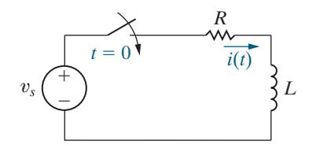

Figure 9.5 ▲ An *RL* circuit excited by a sinusoidal voltage source.

Thus, we can easily determine *θ* for a circuit driven by a sinusoidal source of known frequency. We can check that Eq. 9.7 is valid by showing that it satisfies Eq. 9.6 for all values of *t* ≥ 0; this exercise is left for your exploration in Problem 9.10.

Look carefully at the two terms on the right-hand side of Eq. 9.7. The first term is a decaying exponential function whose time constant is *τ* = *L R*. This term is the **transient component** of the current because it decays to zero as *t* → 0. Remember from Chapter 7 that this transient component has less than 1% of its initial value when *t* = 5 . *τ*

The second term is a cosine whose frequency is *ω*, the same as the frequency of the voltage source. This is the **steady-state component** of the current because it persists as long as the switch remains closed and the source continues to supply the sinusoidal voltage. In this chapter, we find only the steady-state response of circuits with sinusoidal sources; that is, we find the response once its transient component has decayed to zero. We develop a technique for calculating the steady-state response directly, thus avoiding the problem of solving the differential equation. However, when we use this technique, we cannot find either the transient component or the total response.

Using the steady-state component of Eq. 9.7, we identify four important characteristics of the steady-state solution:

- **1.** The steady-state solution is a cosine function, just like the circuit's source.
- **2.** The frequency of the solution is identical to the frequency of the source. This condition is always true in a linear circuit when the circuit parameters, *R*, *L*, and *C*, are constant. (If frequencies in the solution are not present in the source, there is a nonlinear element in the circuit.)
- **3.** The maximum amplitude of the steady-state response, in general, differs from the maximum amplitude of the source. For the circuit in [Fig. 9.5,](#page-5-0) the maximum amplitude of the current is *V R m L* , 2 2 + *ω* 2 while the maximum amplitude of the source is *Vm*.
- **4.** The phase angle of the steady-state response, in general, differs from the phase angle of the source. For the circuit being discussed, the phase angle of the current is *φ θ* − , and that of the voltage source is *φ*.

These characteristics motivate the phasor method, which we introduce in Section 9.3. Note that finding only the steady-state response means finding only its maximum amplitude and phase angle. The waveform and frequency of the steady-state response are already known because they are the same as the circuit's source.

*SELF-CHECK: Assess your understanding of this material by trying Chapter Problem 9.9.*

# 9.3 [The Phasor](#page--1-0)

A **phasor** is a complex number that carries the amplitude and phase angle information of a sinusoidal function.1 The phasor concept is rooted in Euler's identity, which relates the exponential function to the trigonometric function:

$$e^{\pm j\theta} = \cos\theta \pm j\sin\theta.$$

Euler's identity gives us another way of representing the cosine and sine functions. We can think of the cosine function as the real part of the

1 You can review complex numbers by reading Appendix B.

exponential function and the sine function as the imaginary part of the exponential function; that is,

$$\cos\theta = \mathcal{R}\{e^{j\theta}\}\$$

and

$$\sin\theta = \mathcal{I}\{e^{j\theta}\},\,$$

where R means "the real part of" and I means "the imaginary part of."

Because we chose to use the cosine function to represent sinusoidal signals (see Section 9.1), we can apply Euler's identity directly. In particular, we write the sinusoidal voltage function given in Eq. 9.1 by replacing the cosine function with the real part of the complex exponential:

$$\begin{split} v &= V_m \cos(\omega t + \phi) \\ &= V_m \mathcal{R} \{ e^{j(\omega t + \phi)} \} \\ &= V_m \mathcal{R} \{ e^{j\omega t} e^{j\phi} \}. \end{split}$$

We can move the constant *Vm* inside the argument of the R function without altering the equation. We can also reverse the order of the two exponential functions inside the argument and write the voltage as

$$v = \mathcal{R}\{V_m e^{j\phi} e^{j\omega t}\}.$$

In this expression for the voltage, note that the quantity *V e m jφ* is a complex number that carries the amplitude and phase angle of the cosine function we started with (Eq. 9.1). We define this complex number as the **phasor representation**, or **phasor transform**, of the given sinusoidal function. Thus

### PHASOR TRANSFORM

$$\mathbf{V} = V_m e^{j\phi} = \mathcal{P}\{V_m \cos(\omega t + \phi)\},\tag{9.8}$$

where the notation P{ } *V t m* cos( ) *ω φ* + is read as "the phasor transform of *V t m* cos(*ω φ* + )." Thus, the phasor transform transfers the sinusoidal function from the time domain to the complex-number domain, which is also called the **frequency domain**, since the response depends, in general, on *ω*. As in Eq. 9.8, throughout this text we represent a phasor quantity by using a boldface capital letter.

Equation 9.8 is the polar form of a phasor, but we also can express a phasor in rectangular form. Thus, we rewrite Eq. 9.8 as

$$\mathbf{V} = V_m \cos \phi + j V_m \sin \phi.$$

Both polar and rectangular forms are useful in circuit applications of the phasor concept.

We see from Eq. 9.8 that phasors always have the form *Ae* , *jφ* where *A* is the amplitude of the underlying voltage or current. It is common to abbreviate phasors using the angle notation *A φ* , where

$$A\underline{/\phi^{\circ}} \equiv Ae^{j\phi}$$
.

We use this angle notation extensively in the material that follows.

### Inverse Phasor Transform

Using Eq. 9.8, we can transform a sinusoidal function to a phasor. We can also reverse the process; that is, we can transform a phasor back to the original sinusoidal function. If **V** = 100 −26 V, the expression for *v* is 100 cos(*ωt* − ° 26 ) V because we have decided to use the cosine function for all sinusoids. Notice that the phasor cannot give us the value of *ω* because it carries only amplitude and phase information. When we transform a phasor to the corresponding time-domain expression, we use the *inverse phasor transform* function, as shown in the equation

### INVERSE PHASOR TRANSFORM

$$\mathcal{P}^{-1}\{V_{m}e^{j\theta}\} = \mathcal{R}\{V_{m}e^{j\theta}e^{j\omega t}\} = V_{m}\cos(\omega t + \theta^{\circ}) \text{ (9.9)}$$

where the notation P { } − *V e φ m* 1 *j* is read as "the inverse phasor transform of *V e m* . *jφ* " Using Eq. 9.9, we find the inverse phasor transform by multiplying the phasor by *e j t ω* and extracting the real part of the product.

Before applying the phasor transform to circuit analysis, we use it to solve a problem with which you are already familiar: adding sinusoidal functions. Example 9.5 shows how the phasor transform greatly simplifies this type of problem.

### EXAMPLE 9.5 Adding Cosines Using Phasors

If *y t* = − 20 cos(*ω* 30°) 1 and *y t* = + 40 cos(*ω* 60°) 2 , express *y y* = +1 2 *y* as a single sinusoidal function.

- a) Solve by using trigonometric identities.
- b) Solve by using the phasor concept.

### Solution

a) First, we expand both *y*1 and *y* , 2 using the cosine of the sum of two angles, to get

$$y_1 = 20 \cos \omega t \cos 30^\circ + 20 \sin \omega t \sin 30^\circ;$$

$$y_2 = 40 \cos \omega t \cos 60^\circ - 40 \sin \omega t \sin 60^\circ.$$

Adding *y*1 and *y* , 2 we obtain

$$y = (20 \cos 30^{\circ} + 40 \cos 60^{\circ}) \cos \omega t$$
$$+ (20 \sin 30^{\circ} - 40 \sin 60^{\circ}) \sin \omega t$$
$$= 37.32 \cos \omega t - 24.64 \sin \omega t.$$

To combine these two terms, we treat the coefficients of the cosine and sine as sides of a right triangle (Fig. 9.6) and then multiply and divide the right-hand side by the hypotenuse. Our expression for *y* becomes

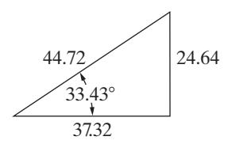

Figure 9.6 ▲ A right triangle used in the solution for *y*.

$$y = 44.72 \left( \frac{37.32}{44.72} \cos \omega t - \frac{24.64}{44.72} \sin \omega t \right)$$
  
= 44.72 (\cos 33.43° \cos \omega t - \sin 33.43° \sin \omega t).

Again, we invoke the identity involving the cosine of the sum of two angles and write

$$y = 44.72\cos(\omega t + 33.43^{\circ}).$$

b) The sum of the two cosines is

$$y = 20 \cos(\omega t - 30^{\circ}) + 40 \cos(\omega t + 60^{\circ}).$$

Use Euler's identity to rewrite the right-hand side of this equation as

$$y = \mathcal{R} \{ 20e^{-j30^{\circ}}e^{j\omega} \} + \mathcal{R} \{ 40e^{j60^{\circ}}e^{j\omega} \}$$
$$= \mathcal{R} \{ 20e^{-j30^{\circ}}e^{j\omega} + 40e^{j60^{\circ}}e^{j\omega} \}.$$

Factoring out the term *e jω* from each term gives

$$y = \mathcal{R}\{(20e^{-j30^{\circ}} + 40e^{j60^{\circ}})e^{j\omega}\}.$$

We can calculate the sum of the two phasors using the angle notation:

$$20 / -30^{\circ} + 40 / 60^{\circ} = (17.32 - j10) + (20 + j34.64)$$
$$= 37.32 + j24.64$$
$$= 44.72 / 33.43^{\circ}.$$

Therefore,

$$y = \mathcal{R}\{44.72e^{j33.43^{\circ}}e^{j\omega}\}$$
$$= 44.72\cos(\omega t + 33.43^{\circ}).$$

Adding sinusoidal functions using phasors is clearly easier than using trigonometric identities. Note that it requires the ability to move back and forth between the polar and rectangular forms of complex numbers.

### ASSESSMENT PROBLEMS

Objective 1—Understand phasor concepts and be able to perform a phasor transform and an inverse phasor transform

- 9.1 Find the phasor transform of each trigonometric function:
  - a) *i t* = + 25cos(200 60°) mA;
  - b) *v* = − 45sin(50 30° *t* ) V;
  - c) *ω ω* = + + − ° *t t* 10 cos( 53.13°) 4.47cos( 116.565 ) V; *v*
  - d) *i t t* 150 sin(10 45°) 150 cos(10 45°) A. *π π* = − − + +

Answer: a) **I** = ° 25 60 mA;

b) 
$$V = 45/(-120^{\circ})$$
 V;

*SELF-CHECK: Also try Chapter Problem 9.11.*

c) 
$$V = 5.66/45^{\circ} \text{ V};$$
  
d)  $I = 300/45^{\circ} \text{ A}.$ 

- 9.2 Find the time-domain expression corresponding to each phasor:
  - a) **I** = 400 38° mA;
  - b) **V** = (50 −50° − ° 80 60 ) V;
  - c) **V** = − (80 4*j* 0 2 + 5 −75° ) V.

Answer: a) 400 cos(*ωt* + 38°) mA;

- b) 107.87 cos(*ωt* − 94.18°) V;
- c) 107.67 cos(*ωt* − 36.57°) V.

# 9.4 [The Passive Circuit Elements](#page--1-0) [in the Frequency Domain](#page--1-0)

Applying the phasor transform in circuit analysis is a two-step process.

- **1.** Establish the relationship between the phasor current and the phasor voltage at the terminals of the passive circuit elements. We complete this step in this section, analyzing the resistor, inductor, and capacitor in the phasor domain.
- **2.** Develop the phasor-domain version of Kirchhoff's laws, which we discuss in Section 9.5.

### The V-I Relationship for a Resistor

From Ohm's law, if the current in a resistor is *i I* = + *m i* cos( ) *ω θ t* , the voltage at the terminals of the resistor, as shown in Fig. 9.7, is

$$v = R[I_m \cos(\omega t + \theta_i)]$$
  
=  $RI_m[\cos(\omega t + \theta_i)],$ 

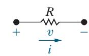

Figure 9.7 ▲ A resistive element carrying a sinusoidal current.

where *I m* is the maximum amplitude of the current in amperes and *i θ* is the phase angle of the current.

The phasor transform of this voltage is

$$\mathbf{V} = RI_m e^{j\theta_i} = RI_m / \theta_i.$$

But *I m i θ* is the phasor representation of the sinusoidal current, so we can write the voltage phasor as

### RELATIONSHIP BETWEEN PHASOR VOLTAGE AND PHASOR CURRENT FOR A RESISTOR

$$\mathbf{V} = R\mathbf{I},\tag{9.10}$$

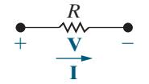

Figure 9.8 ▲ The frequency-domain equivalent circuit of a resistor.

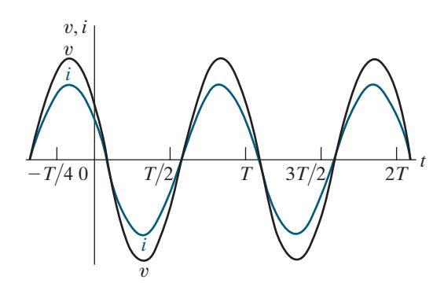

Figure 9.9 ▲ A plot showing that the voltage and current at the terminals of a resistor are in phase.

which states that the phasor voltage at the terminals of a resistor is the resistance times the phasor current—the phasor version of Ohm's law. Figure 9.8 shows the circuit diagram for a resistor in the frequency domain.

 Equation 9.10 contains an important piece of information—namely, that at the terminals of a resistor, there is no phase shift between the current and voltage. Figure 9.9 depicts this phase relationship, where the phase angle of both the voltage and the current waveforms is 60°. The signals are said to be **in phase** because they both reach corresponding values on their respective curves at the same time (for example, they are at their positive maxima at the same instant).

### The V-I Relationship for an Inductor

We derive the relationship between the phasor current and phasor voltage at the terminals of an inductor by assuming a sinusoidal current and using *Ldi dt* to establish the corresponding voltage. Thus, for *i I* = + *m i* cos(*ω θ t* ), the expression for the voltage is

$$v = L\frac{di}{dt} = -\omega L I_m \sin(\omega t + \theta_i).$$

We now replace the sine function with the cosine function:

$$v = -\omega L I_m \cos(\omega t + \theta_i - 90^\circ).$$

The phasor representation of the voltage is then

$$\begin{aligned} \mathbf{V} &= -\omega L I_m e^{j(\theta_i - 90^\circ)} \\ &= -\omega L I_m e^{j\theta_i} e^{-j90^\circ} \\ &= j\omega L I_m e^{j\theta_i} \\ &= j\omega L I_m / \theta_i. \end{aligned}$$

Note that, in deriving the expression for the phasor voltage, we used the identity

$$e^{-j90^{\circ}} = \cos 90^{\circ} - j \sin 90^{\circ} = -j.$$

Also, *I m i θ* is the phasor representation of the sinusoidal current, so we can express the phasor voltage in terms of the phasor current:

### RELATIONSHIP BETWEEN PHASOR VOLTAGE AND PHASOR CURRENT FOR AN INDUCTOR

$$\mathbf{V} = j\omega L\mathbf{I}.\tag{9.11}$$

Equation 9.11 states that the phasor voltage at the terminals of an inductor equals *j Lω* times the phasor current. Figure 9.10 shows the frequency-domain equivalent circuit for the inductor. Note that the relationship between phasor voltage and phasor current for an inductor also applies for the mutual inductance in one coil due to current flowing in another mutually coupled coil. That is, the phasor voltage at the terminals of one coil in a mutually coupled pair of coils equals *j Mω* times the phasor current in the other coil.

We can rewrite Eq. 9.11 as

$$\mathbf{V} = (\omega L / 90^{\circ}) I_m / \theta_i$$
$$= \omega L I_m / (\theta_i + 90)^{\circ},$$

which indicates that the voltage and current are out of phase by exactly 90°. Specifically, the voltage leads the current by 90°, or, equivalently, the current lags the voltage by 90°. Figure 9.11 illustrates the concept of  *voltage leading current* or *current lagging voltage*. For example, the voltage reaches its negative peak exactly 90° before the current reaches its negative peak. The same observation can be made with respect to the zerogoing-positive crossing or the positive peak.

We can also express the phase shift in seconds. A phase shift of 90° corresponds to one-fourth of a period; hence, the voltage leads the current by *T* 4, or 1 (4 )*f* second.

### The V-I Relationship for a Capacitor

To determine the relationship between the phasor current and phasor voltage at the terminals of a capacitor, we start with the relationship between current and voltage for a capacitor in the time domain,

$$i = C\frac{dv}{dt},$$

and assume that

$$v = V_m \cos(\omega t + \theta_v).$$

Therefore,

$$i = C \frac{dv}{dt} = -\omega CV_m \sin(\omega t + \theta_v).$$

We now rewrite the expression for the current using the cosine function:

$$i = -\omega CV_m \cos(\omega t + \theta_v - 90^\circ).$$

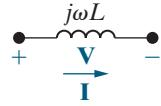

Figure 9.10 ▲ The frequency-domain equivalent circuit for an inductor.

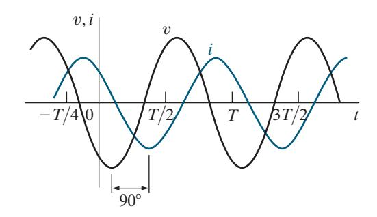

Figure 9.11 ▲ A plot showing the phase relationship between the current and voltage at the terminals of an inductor ( 60 ). *φi* = °

The phasor representation of the current is

$$\begin{split} \mathbf{I} &= -\omega C V_m e^{j(\theta_v - 90^\circ)} \\ &= -\omega C V_m e^{j\theta_v} e^{-j90^\circ} \\ &= j\omega C V_m e^{j\theta_v} \\ &= j\omega C V_m / \frac{\theta_v}{\sigma}. \end{split}$$

Since *Vm θv* is the phasor representation of the sinusoidal voltage, we can express the current phasor in terms of the voltage phasor as

$$\mathbf{I} = j\omega C\mathbf{V}.$$

Now express the voltage phasor in terms of the current phasor, to conform to the phasor equations for resistors and inductors:

### RELATIONSHIP BETWEEN PHASOR VOLTAGE AND PHASOR CURRENT FOR A CAPACITOR

$$\mathbf{V} = \frac{1}{j\omega C}\mathbf{I}.\tag{9.12}$$

Equation 9.12 demonstrates that the equivalent circuit for the capacitor in the phasor domain is as shown in Fig. 9.12.

The voltage across the terminals of a capacitor lags behind the current by 90°. We can show this by rewriting Eq. 9.12 as

$$\mathbf{V} = \left(\frac{1}{\omega C} / -90^{\circ}\right) I_{m} / \frac{\theta_{i}^{\circ}}{\omega}$$
$$= \frac{I_{m}}{\omega C} / (\theta_{i} - 90)^{\circ}.$$

Thus, we can also say that the current leads the voltage by 90°. Figure 9.13 shows the phase relationship between the current and voltage at the terminals of a capacitor.

### Impedance and Reactance

We conclude this discussion of passive circuit elements in the frequency domain with an important observation. When we compare Eqs. 9.10, 9.11, and 9.12, we note that they are all of the form

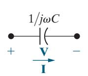

Figure 9.12 ▲ The frequency-domain equivalent circuit of a capacitor.

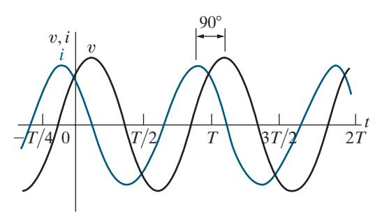

Figure 9.13 ▲ A plot showing the phase relationship between the current and voltage at the terminals of a capacitor ( 60 ). *i θ* = °

### DEFINITION OF IMPEDANCE

$$\mathbf{V} = Z\mathbf{I},\tag{9.13}$$

where *Z* represents the **impedance** of the circuit element. Solving for *Z* in Eq. 9.13, you can see that impedance is the ratio of a circuit element's voltage phasor to its current phasor. Thus, the impedance of a resistor is *R*, the impedance of an inductor is *j Lω* , the impedance of mutual inductance is *j Mω* , and the impedance of a capacitor is 1 . *j Cω* In all cases, impedance is measured in ohms. Note that, although impedance is a complex number, it is not a phasor. Remember, a phasor is a complex number that results from the phasor transform of a cosine waveform. Thus, although all phasors are complex numbers, not all complex numbers are phasors.

Impedance in the frequency domain is the quantity analogous to resistance, inductance, and capacitance in the time domain. The imaginary part of the impedance is called **reactance**. The values of impedance and reactance for each of the component values are summarized in Table 9.1.

And, finally, a reminder. The passive sign convention holds in the frequency domain. If the reference direction for the current phasor in a circuit element is in the direction of the voltage phasor rise across the element, you must insert a minus sign into the equation that relates the voltage phasor to the current phasor.

Work through Example 9.6 to practice transforming circuit components from the time domain to the phasor domain.

| TABLE 9.1          | Impedance and Reactance Values |           |  |
|--------------------|-----------------------------------|-----------|--|
| Circuit Element | Impedance                         | Reactance |  |
| Resistor           | R                                 | —         |  |
| Inductor           | j Lω                           | ωL        |  |
| Capacitor          | j C ( 1 − ω )                  | −1 ωC     |  |

### EXAMPLE 9.6 Calculating Component Voltages Using Phasor Techniques

Figure 9.14 shows a resistor and an inductor connected in series. The current in these components is

$$i = 50\cos(1000t + 45^{\circ}) \text{ mA}.$$

The phasor transform of these components is shown in Fig. 9.15. Find

- a) *ZR*;
- b) *ZL*;
- c) **I**;
- d) **V***R*;
- e) **V***L*.

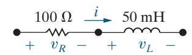

Figure 9.14 ▲ The components for Example 9.6.

Figure 9.15 ▲ The phasor transform of the components in Fig. 9.14.

### Solution

- a) *Z R* = = 100 Ω; *R*
- b) *Z j L j*(1000)(0.05) 5*j* 0 ; *L* = = *ω* = Ω
- c) **I** 0.05cos(1000 45 0.05 45 *t* 50 45 mA; = + P{ }° = ° = °
- d) **V I** *Z* (100)(0.05 45 ) 5 45 V; *R R* = = ° = °
- e) **V I** *Z j* ( 50)(0.05 45 ) 2.5 135 V. *L L* = = ° = °

### ASSESSMENT PROBLEMS

Objective 2—Be able to transform a circuit with a sinusoidal source into the frequency domain using phasor concepts

- 9.3 A 400 Hz sinusoidal voltage with a maximum amplitude of 100V at *t* = 0 is applied across the terminals of an inductor. The maximum amplitude of the steady-state current in the inductor is 20A.
  - a) What is the frequency of the inductor current?
  - b) If the phase angle of the voltage is zero, what is the phase angle of the current?
  - c) What is the inductive reactance of the inductor?
  - d) What is the inductance of the inductor, in millihenries?
  - e) What is the impedance of the inductor?

- Answer: a) 400 Hz;
  - b) − ° 90 ;
  - c) 5 ; Ω
  - d) 1.99 mH;
  - e) *j*5 . Ω
- 9.4 A 50 kHz sinusoidal voltage has zero phase angle and a maximum amplitude of 10 mV. When this voltage is applied across the terminals of a capacitor, the resulting steady-state current has a maximum amplitude of 628.32 *μ*A.
  - a) What is the frequency of the current in radians per second?
  - b) What is the phase angle of the current?

- c) What is the capacitive reactance of the capacitor?
- d) What is the capacitance of the capacitor, in microfarads?
- e) What is the impedance of the capacitor?

Answer: a) 314,159.27 rad s;

b) 90°;

c) − Ω 15.92 ;

d) 0.2 *μ*F;

e) − Ω *j*15.92 .

*SELF-CHECK: Also try Chapter [Problems](#page--1-0) 9.12 and 9.13.*

# 9.5 [Kirchhoff's Laws in the Frequency](#page--1-0) [Domain](#page--1-0)

### Kirchhoff's Voltage Law in the Frequency Domain

We begin by assuming that *v v*, , ,*v* 1 2 … *n* represent voltages around a closed path in a circuit. We also assume that the circuit is operating in a sinusoidal steady state. Thus, Kirchhoff's voltage law requires that

$$v_1 + v_2 + \cdots + v_n = 0,$$

which in the sinusoidal steady state becomes

$$V_{m_1}\cos(\omega t + \theta_1) + V_{m_2}\cos(\omega t + \theta_2) + \cdots + V_{m_n}\cos(\omega t + \theta_n) = 0.$$

We now use Euler's identity to write the KVL equation as

$$\mathcal{R}\left\{V_{m_1}e^{j\theta_1}e^{j\omega t}\right\} + \mathcal{R}\left\{V_{m_2}e^{j\theta_2}e^{j\omega t}\right\} + \cdots + \mathcal{R}\left\{V_{m_n}e^{j\theta_n}e^{j\omega t}\right\} = 0.$$

which we simplify as

$$\mathcal{R}\left\{V_{m_{1}}e^{j\theta_{1}}e^{j\omega t}+V_{m_{2}}e^{j\theta_{2}}e^{j\omega t}+\cdots+V_{m_{n}}e^{j\theta_{n}}e^{j\omega t}\right\}=0.$$

Factoring the term *e j t ω* from each term yields

$$\mathcal{R}\left\{ (V_{m_1}e^{j\theta_1} + V_{m_2}e^{j\theta_2} + \cdots + V_{m_n}e^{j\theta_n})e^{j\omega t} \right\} = 0,$$

or

$$\mathcal{R}\{(\mathbf{V}_1+\mathbf{V}_2+\cdots+\mathbf{V}_n)e^{j\omega t}\}=0.$$

But *e* 0, *j t ω* ≠ so

### KVL IN THE FREQUENCY DOMAIN

$$\mathbf{V}_1 + \mathbf{V}_2 + \cdots + \mathbf{V}_n = 0, \tag{9.14}$$

which is the statement of Kirchhoff's voltage law as it applies to phasor voltages.

### Kirchhoff's Current Law in the Frequency Domain

A similar derivation applies to a set of sinusoidal currents. Thus, if

$$i_1+i_2+\cdots+i_n=0,$$

then

### KCL IN THE FREQUENCY DOMAIN

$$\mathbf{I}_1 + \mathbf{I}_2 + \cdots + \mathbf{I}_n = 0, \tag{9.15}$$

where **I I**, , ,**I** 1 2 … *n* are the phasor representations of the individual currents *i i*, , , . *i* 1 2 … *n* Thus, Eq. 9.15 states Kirchhoff's current law as it applies to phasor currents.

Equations 9.13, 9.14, and 9.15 form the basis for circuit analysis in the frequency domain. Note that Eq. 9.13 has the same algebraic form as Ohm's law and that Eqs. 9.14 and 9.15 state Kirchhoff's laws for phasor quantities. Therefore, you can use all the techniques developed for analyzing resistive circuits to find phasor currents and voltages. No new analytical techniques are needed; the basic circuit analysis and simplification tools covered in Chapters 2–4 can all be used to analyze circuits in the frequency domain. Phasor-circuit analysis consists of two fundamental tasks: (1) You must be able to construct the frequency-domain model of a circuit; and (2) you must be able to manipulate complex numbers and/or quantities algebraically.

Example 9.7 illustrates the use of KVL in the frequency domain.

### EXAMPLE 9.7 Using KVL in the Frequency Domain

- a) Use the results from Example 9.6 to calculate the phasor voltage drop, from left to right, across the series combination of the resistive and inductive impedances in [Fig. 9.15.](#page-13-0)
- b) Use the phasor voltage found in (a) to calculate the steady-state voltage drop, from left to right, across the series combination of resistor and inductor in [Fig. 9.14.](#page-13-0)

### Solution

a) Using KVL, the phasor voltage drop from left to right in [Fig. 9.15](#page-13-0) is

$$\mathbf{V} = \mathbf{V}_1 + \mathbf{V}_2 = 5/45^{\circ} + 2.5/135^{\circ}$$
  
=  $5.59/71.565^{\circ}$  V.

b) To find the steady-state voltage drop across the resistor and inductor in [Fig. 9.14,](#page-13-0) we need to apply the inverse phasor transform to the phasor **V** from part (a). We need the frequency of the current defined in Example 9.6, which is *ω* = 1000 rad s:

$$v_{ss}(t) = \mathcal{P}^{-1} \{V\} = \mathcal{P}^{-1} \{5.59 / 71.565^{\circ}\}$$
  
= 5.59 \cos(1000t + 71.565^{\circ}) V.

### ASSESSMENT PROBLEM

Objective 3—Know how to use circuit analysis techniques to solve a circuit in the frequency domain

 9.5 Four branches terminate at a common node. The reference direction of each branch current (*i* , 1 *i* , 2 *i* , 3 and *i*4 ) is away from the node. If

$$i_1 = 80\cos(\omega t + 30^\circ) \text{ A},$$
  
 $i_2 = -100\sin(\omega t - 135^\circ) \text{ A}, \text{ and}$   
 $i_3 = 50\cos(\omega t - 90^\circ) \text{ A}, \text{ find } i_4.$ 

Answer: *i t* 161.59 cos( 150.035°) A. 4 = + *ω*

*SELF-CHECK: Also try Chapter Problem 9.20.*

# 9.6 [Series, Parallel, and Delta-to-Wye](#page--1-0) [Simplifications](#page--1-0)

The rules for combining impedances in series or parallel and for making delta-to-wye transformations are the same as those for resistors. The only difference is that combining impedances involves the algebraic manipulation of complex numbers.

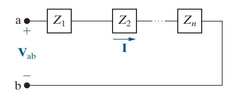

Figure 9.16 ▲ Impedances in series.

### Combining Impedances in Series

Impedances in series can be combined into a single equivalent impedance whose value is the sum of the individual impedances. The circuit shown in Fig. 9.16 defines the problem in general terms. The impedances *Z Z*1 2 , ,…,*Zn* are connected in series between terminals a,b. When impedances are in series, they carry the same phasor current **I**. From Eq. 9.13, the voltage drop across each impedance is *Z Z* **I I** , , …, , *Z* **I** 1 2 *n* and from Kirchhoff's voltage law,

$$\mathbf{V}_{ab} = Z_1 \mathbf{I} + Z_2 \mathbf{I} + \cdots + Z_n \mathbf{I}$$
$$= (Z_1 + Z_2 + \cdots + Z_n) \mathbf{I}.$$

The equivalent impedance between terminals a,b is

### COMBINING IMPEDANCES IN SERIES

$$Z_{ab} = \frac{\mathbf{V}_{ab}}{\mathbf{I}} = Z_1 + Z_2 + \dots + Z_n.$$
 (9.16)

Remember from Chapter 3 that we can use voltage division to find the voltage across a single component from a collection of series- connected components whose total voltage is known (Eq. 3.9). We derived the voltage division equation using the equation for the equivalent resistance of series-connected resistors. Using the same process, we can derive the voltage division equation for frequency-domain circuits, where **V***s* is the voltage applied to a collection of series-connected impedances, **V***j* is the voltage across the impedance *Zj* , and *Z*eq is the equivalent impedance of the seriesconnected impedances:

### VOLTAGE DIVISION IN THE FREQUENCY DOMAIN

$$\mathbf{V}_{j} = \frac{Z_{j}}{Z_{\text{eq}}} \mathbf{V}_{s}. \tag{9.17}$$

Example 9.8 illustrates the following frequency-domain circuit analysis techniques: combining impedances in series, Ohm's law for phasors, and voltage division.

### EXAMPLE 9.8 Combining Impedances in Series

A 90 Ω resistor, a 32 mH inductor, and a 5 F*μ* capacitor are connected in series across the terminals of a sinusoidal voltage source, as shown in Fig. 9.17. The steady-state expression for the source voltage *v s* is 750 cos( ) 5000 30 *t* + ° V.

- a) Construct the frequency-domain equivalent circuit.
- b) Calculate the phasor voltage **V** using voltage division for the circuit from part (a).
- c) Find the steady-state voltage *v* using the inverse phasor transform.

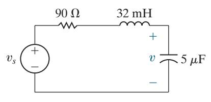

Figure 9.17 ▲ The circuit for Example 9.8.

### Solution

a) From the expression for *v s*, we have *ω* = 5000 rad s. Therefore, the impedance of the inductor is

$$Z_L = j\omega L = j(5000)(32 \times 10^{-3}) = j160 \Omega,$$

and the impedance of the capacitor is

$$Z_C = j \frac{-1}{\omega C} = -j \frac{1}{(5000)(5 \times 10^{-6})} = -j40 \ \Omega.$$

The phasor transform of *v s* is

$$\mathbf{V}_s = 750 \underline{/30^\circ} \, \mathrm{V}.$$

Figure 9.18 illustrates the frequency-domain equivalent circuit of the circuit shown in [Fig. 9.17.](#page-16-0)

b) Using voltage division, we see that the phasor voltage **V** is proportional to the source voltage; from Eq. 9.17,

$$\mathbf{V} = \frac{-j40}{90 + j160 - j40} (750/30^{\circ}) = 200/-113.13^{\circ} \,\mathrm{V}.$$

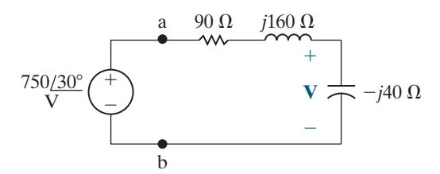

Figure 9.18 ▲ The frequency-domain equivalent circuit for the circuit shown in [Fig. 9.17.](#page-16-0)

Note that we used Eq. 9.16 to find the equivalent impedance of the series-connected impedances in the circuit.

c) Find the steady-state voltage *v* using the inverse phasor transform of **V** from part (b). Remember that the source frequency is 5000 rad s:

$$v(t) = 200\cos(5000t - 113.13^{\circ}) \text{ V}.$$

This voltage is the steady-state component of the complete response, which is what remains once the transient component has decayed to zero.

### ASSESSMENT PROBLEM

Objective 3—Know how to use circuit analysis techniques to solve a circuit in the frequency domain

- 9.6 Using the values of resistance and capacitance in the circuit of [Fig. 9.17,](#page-16-0) let **V***s* = 100 45° V and *ω* = 5000 rad s. Find
  - a) the value of inductance that yields a steady-state output voltage *v* with a phase angle of −90°;
- b) the magnitude of the steady-state output voltage *v*.

Answer: a) 26 mH; b) 31.43 V.

*SELF-CHECK: Also try Chapter Problem 9.19.*

# Combining Impedances in Parallel

Impedances connected in parallel can be reduced to an equivalent impedance using the reciprocal relationship

### COMBINING IMPEDANCES IN PARALLEL

$$\frac{1}{Z_{ab}} = \frac{1}{Z_1} + \frac{1}{Z_2} + \cdots + \frac{1}{Z_n}.$$
 (9.18)

[Figure 9.19](#page-18-0) depicts the parallel connection of impedances. Note that when impedances are in parallel, they have the same voltage across their terminals. We derive Eq. 9.18 directly from [Fig. 9.19](#page-18-0) by combining

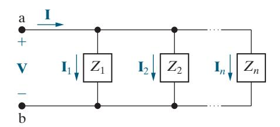

Figure 9.19 ▲ Impedances in parallel.

Kirchhoff's current law with the phasor-domain version of Ohm's law, that is, Eq. 9.13. From Fig. 9.19,

$$\mathbf{I} = \mathbf{I}_1 + \mathbf{I}_2 + \cdots + \mathbf{I}_n,$$

or

$$\frac{\mathbf{V}}{Z_{ab}} = \frac{\mathbf{V}}{Z_1} + \frac{\mathbf{V}}{Z_2} + \cdots + \frac{\mathbf{V}}{Z_n}.$$

Canceling the common voltage term from both sides gives us Eq. 9.18. From Eq. 9.18, for the special case of just two impedances in parallel,

$$Z_{\rm ab} = \frac{Z_1 Z_2}{Z_1 + Z_2}. (9.19)$$

We can also express Eq. 9.18 in terms of **admittance**, defined as the reciprocal of impedance and denoted *Y*. Thus

$$Y = \frac{1}{Z} = G + jB$$
 (siemens).

Admittance is a complex number whose real part, *G*, is called **conductance** and whose imaginary part, *B*, is called **susceptance**. Like admittance, conductance and susceptance are measured in siemens (S). Replacing impedances with admittances in Eq. 9.18, we get

$$Y_{ab} = Y_1 + Y_2 + \cdots + Y_n.$$

The admittance of each of the ideal passive circuit elements also is worth noting and is summarized in Table 9.2.

Finally, remember from Chapter 3 that we can use current division to find the current in a single branch from a collection of parallel-connected branches whose total current is known (Eq. 3.10). We derived the current division equation using the equation for the equivalent resistance of parallel-connected resistors. Using the same process, we can derive the current division equation for frequency-domain circuits, where **I***s* is the current supplied to a collection of parallel-connected impedances, **I***j* is the current in the branch containing impedance *Zj*, and *Z*eq is the equivalent impedance of the parallel-connected impedances:

| TABLE 9.2          | Admittance and Susceptance Values |             |
|--------------------|--------------------------------------|-------------|
| Circuit Element | Admittance ( ) Y                  | Susceptance |
| Resistor           | G (conductance)                      | —           |
| Inductor           | j L ( 1 − ω )                     | −1 ωL       |
| Capacitor          | j Cω                              | ωC          |

### CURRENT DIVISION IN THE FREQUENCY DOMAIN

$$\mathbf{I}_{j} = \frac{Z_{\text{eq}}}{Z_{j}} \mathbf{I}_{S}. \tag{9.20}$$

We use Eq. 9.18 to calculate the equivalent impedance in Eq. 9.20.

Example 9.9 analyzes a circuit in the frequency domain using series and parallel combinations of impedances and current division.

### EXAMPLE 9.9 Combining Impedances in Series and in Parallel

The sinusoidal current source in the circuit shown in Fig. 9.20 produces the current *i t* 8 cos200,000 A. *s* =

- a) Construct the frequency-domain equivalent circuit.
- b) Find the equivalent admittance to the right of the current source.
- c) Use the equivalent admittance from part (b) to find the phasor voltage **V**.
- d) Find the phasor current **I**, using current division.
- e) Find the steady-state expressions for *v* and *i*.

### Solution

- a) The phasor transform of the current source is 8 0°; the resistors transform directly to the frequency domain as 10 and 6 ; Ω the 40 *μ*H inductor has an impedance of *j*8 Ω at the given frequency of 200,000 rad s; and at this frequency the 1 F*μ* capacitor has an impedance of − Ω *j*5 . Figure 9.21 shows the frequency-domain equivalent circuit and symbols representing the phasor transforms of the unknowns.
- b) We first find the equivalent admittance to the right of the current source by adding the admittances of each branch. The admittance of the first branch is

$$Y_1 = \frac{1}{10} = 0.1 \,\mathrm{S},$$

the admittance of the second branch is

$$Y_2 = \frac{1}{6+j8} = 0.06 - j0.08 \,\mathrm{S},$$

and the admittance of the third branch is

$$Y_3 = \frac{1}{-j5} = j0.2 \text{ S}.$$

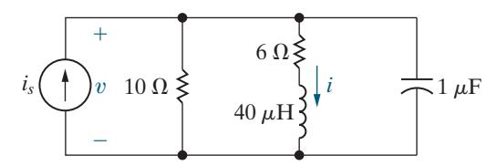

Figure 9.20 ▲ The circuit for Example 9.9.

The admittance of the three branches is

$$Y_{\text{eq}} = Y_1 + Y_2 + Y_3$$
  
= 0.16 + j0.12 S  
= 0.2/36.87° S.

c) The impedance seen by the current source is

$$Z_{\rm eq} = \frac{1}{Y_{\rm eq}} = 5 / -36.87^{\circ} \,\Omega.$$

The phasor voltage **V** is

$$V = Z_{eq}I = 40/-36.87^{\circ} V.$$

d) Using Eq. 9.20, together with the equivalent impedance found in part (c), we get

$$\mathbf{I} = \frac{5/-36.87^{\circ}}{6+j8} (8/0)^{\circ} = 4/-90^{\circ} \text{ A}.$$

You can verify this answer using the phasor voltage across the branch, **V**, and the impedance of the branch, (6 + Ω *j*8) .

e) From the phasors found in parts (c) and (d), the steady-state time-domain expressions are

$$v(t) = 40\cos(200,000t - 36.87^{\circ}) \text{ V},$$

$$i(t) = 4\cos(200,000t - 90^{\circ}) \text{ A}.$$

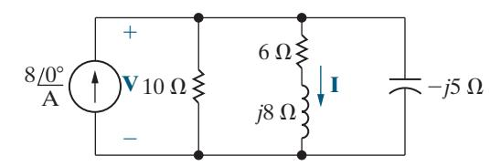

Figure 9.21 ▲ The frequency-domain equivalent circuit.

### ASSESSMENT PROBLEMS

### Objective 3—Know how to use circuit analysis techniques to solve a circuit in the frequency domain

- 9.7 A 100 Ω resistor is connected in parallel with a 1.25 *μ*F capacitor. This parallel combination is connected in series with a 30 Ω resistor and a 8 mH inductor.
  - a) Calculate the impedance of this interconnection if the frequency is 8 krad s.
  - b) Repeat (a) for a frequency of 4 krad s.
  - c) At what finite frequency does the impedance of the interconnection become purely resistive?
  - d) What is the impedance at the frequency found in (c)?

Answer: a) 80 14 + Ω *j* ;

- b) 110 − Ω *j*8 ;
- c) 6000 rad s;
- d) 94 . Ω
- 9.8 The interconnection described in Assessment Problem 9.7 is connected across the terminals of a voltage source that is generating *v* = 470 cos 6000 V*t* . What is the maximum amplitude of the current in the 1.25 *μ*F capacitor?

Answer: 3 A.

*SELF-CHECK: Also try Chapter [Problems](#page--1-0) 9.26, 9.27, and 9.39.*

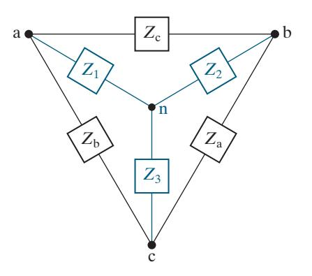

Figure 9.22 ▲ The delta-to-wye transformation.

### Delta-to-Wye Transformations

The Δ-to-Y transformation for resistive circuits, discussed in Section 3.7, also applies to impedances. Figure 9.22 defines the Δ-connected impedances along with the Y-equivalent circuit. The Y impedances as functions of the Δ impedances are

$$Z_{1} = \frac{Z_{b}Z_{c}}{Z_{a} + Z_{b} + Z_{c}},$$
(9.21)

$$Z_2 = \frac{Z_c Z_a}{Z_a + Z_b + Z_c},$$
 (9.22)

$$Z_3 = \frac{Z_a Z_b}{Z_a + Z_b + Z_c}. (9.23)$$

The Δ-to-Y transformation also may be reversed; that is, we can start with the Y structure and replace it with an equivalent Δ structure. The Δ impedances as functions of the Y impedances are

$$Z_{\rm a} = \frac{Z_1 Z_2 + Z_2 Z_3 + Z_3 Z_1}{Z_1}, (9.24)$$

$$Z_{b} = \frac{Z_{1}Z_{2} + Z_{2}Z_{3} + Z_{3}Z_{1}}{Z_{2}}, (9.25)$$

$$Z_{\rm c} = \frac{Z_1 Z_2 + Z_2 Z_3 + Z_3 Z_1}{Z_3}. (9.26)$$

The process used to derive Eqs. 9.21–9.23 or Eqs. 9.24–9.26 is the same as that used to derive the corresponding equations for resistive circuits. In fact, comparing Eqs. 3.15–3.17 with Eqs. 9.21–9.23 and Eqs. 3.18–3.20 with Eqs. 9.24–9.26 reveals that the symbol *Z* has replaced the symbol *R*. You may want to review Problem 3.64 concerning the derivation of the Δ-to-Y transformation.

Example 9.10 uses the Δ-to-Y transformation in phasor-circuit analysis.

### EXAMPLE 9.10 Using a Delta-to-Wye Transform in the Frequency Domain

Use a Δ-to-Y impedance transformation to find **I** , 0 **I** , 1 **I** , 2 **I** , 3 **I** , 4 **I** , 5 **V** , 1 and **V**2 in the circuit in Fig. 9.23.

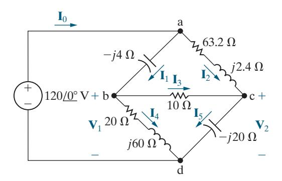

Figure 9.23 ▲ The circuit for Example 9.10.

### Solution

It is not possible to simplify the circuit in Fig. 9.23 using series and parallel combinations of impedances. But if we replace either the upper delta (abc) or the lower delta (bcd) with its Y equivalent, we can simplify the resulting circuit by series-parallel combinations. To decide which delta to replace, find the sum of the impedances around each delta. This quantity forms the denominator for the equivalent Y impedances. The sum around the lower delta is 30 40 + *j* , so we choose to transform the lower delta to its equivalent Y. The Y impedance connecting to terminal b is

$$Z_1 = \frac{(20 + j60)(10)}{30 + j40} = 12 + j4 \Omega,$$

the Y impedance connecting to terminal c is

$$Z_2 = \frac{10(-j20)}{30 + j40} = -3.2 - j2.4 \,\Omega,$$

and the Y impedance connecting to terminal d is

$$Z_3 = \frac{(20 + j60)(-j20)}{30 + j40} = 8 - j24 \,\Omega.$$

Inserting the Y-equivalent impedances into the circuit results in the circuit shown in Fig. 9.24.

We can simplify the circuit in Fig. 9.24 by making series-parallel combinations. The impedence of the abn branch is

$$Z_{\rm abn} = 12 + j4 - j4 = 12 \,\Omega,$$

and the impedance of the acn branch is

$$Z_{\text{acn}} = 63.2 + j2.4 - j2.4 - 3.2 = 60 \,\Omega.$$

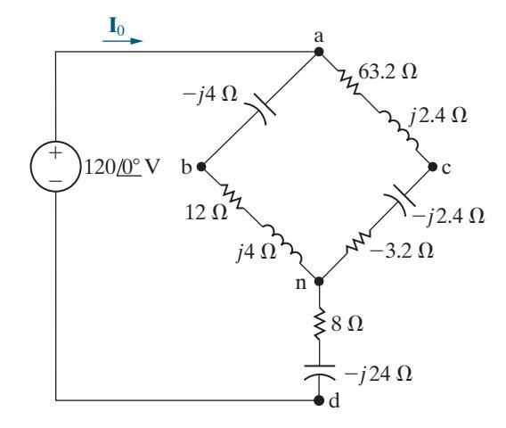

Figure 9.24 ▲ The circuit shown in Fig. 9.23, with the lower delta replaced by its equivalent wye.

Note that the abn branch is in parallel with the acn branch. Therefore, we may replace these two branches with a single branch having an impedance of

$$Z_{\rm an} = \frac{(60)(12)}{72} = 10 \,\Omega.$$

Combining this 10 Ω resistor with the impedance between n and d reduces the circuit to the one shown in Fig. 9.25. From that circuit,

$$\mathbf{I}_0 = \frac{120/0^{\circ}}{18 - j24} = 4/53.13^{\circ} = 2.4 + j3.2 \text{ A}.$$

Once we know **I** , 0 we can work back through the equivalent circuits to find the branch currents in the original circuit. We begin by noting that **I** 0 is the current in the branch nd of Fig. 9.24. Therefore,

$$\mathbf{V}_{\rm nd} = (8 - j24)\mathbf{I}_0 = 96 - j32 \,\mathrm{V}.$$

We can now calculate the voltage **V**an because

$$\mathbf{V} = \mathbf{V}_{an} + \mathbf{V}_{nd}$$

where **V** is the phasor voltage of the source and **V**nd is known. Thus

$$\mathbf{V}_{\text{an}} = 120 - (96 - j32) = 24 + j32 \text{ V}.$$

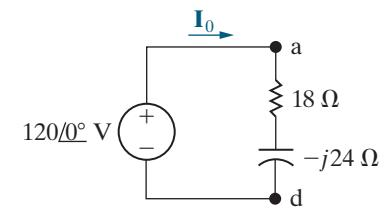

Figure 9.25 ▲ A simplified version of the circuit shown in Fig. 9.24.

We now compute the branch currents **I** abn and **I**acn using **V**an and the equivalent impedance of each branch:

$$\mathbf{I}_{abn} = \frac{24 + j32}{12} = 2 + j\frac{8}{3} \mathbf{A},$$

$$\mathbf{I}_{\text{acn}} = \frac{24 + j32}{60} = \frac{4}{10} + j\frac{8}{15} \,\mathrm{A}.$$

In terms of the branch currents defined in [Fig. 9.23,](#page-21-0)

$$\mathbf{I}_1 = \mathbf{I}_{abn} = 2 + j\frac{8}{3} \mathbf{A},$$

$$\mathbf{I}_2 = \mathbf{I}_{\text{acn}} = \frac{4}{10} + j\frac{8}{15} \,\mathrm{A}.$$

We check the calculations of **I** 1 and **I** 2 by noting that

$$\mathbf{I}_1 + \mathbf{I}_2 = 2.4 + j3.2 = \mathbf{I}_0.$$

To find the branch currents **I** , 3 **I** , 4 and **I** , 5 we must first calculate the voltages **V**1 and **V** . 2 Referring to [Fig. 9.23,](#page-21-0) we note that

$$\mathbf{V}_1 = 120 \underline{/0^{\circ}} - (-j4)\mathbf{I}_1 = \frac{328}{3} + j8 \text{ V},$$

$$\mathbf{V}_2 = 120 / 0^{\circ} - (63.2 + j2.4) \mathbf{I}_2 = 96 - j \frac{104}{3} \text{ V}.$$

We now calculate the branch currents **I** , 3 **I** , 4 and **I** 5:

$$\mathbf{I}_3 = \frac{\mathbf{V}_1 - \mathbf{V}_2}{10} = \frac{4}{3} + j \frac{12.8}{3} \, \mathbf{A},$$

$$\mathbf{I}_4 = \frac{\mathbf{V}_1}{20 + j60} = \frac{2}{3} - j1.6 \text{ A}$$

$$\mathbf{I}_5 = \frac{\mathbf{V}_2}{-j20} = \frac{26}{15} + j4.8 \text{ A}.$$

We check the calculations by noting that

$$\mathbf{I}_4 + \mathbf{I}_5 = \frac{2}{3} + \frac{26}{15} - j1.6 + j4.8 = 2.4 + j3.2 = \mathbf{I}_0,$$

$$\mathbf{I}_3 + \mathbf{I}_4 = \frac{4}{3} + \frac{2}{3} + j\frac{12.8}{3} - j1.6 = 2 + j\frac{8}{3} = \mathbf{I}_1.$$

$$\mathbf{I}_3 + \mathbf{I}_2 = \frac{4}{3} + \frac{4}{10} + j\frac{12.8}{3} + j\frac{8}{15} = \frac{26}{15} + j4.8 = \mathbf{I}_5.$$

### ASSESSMENT PROBLEM

Objective 3—Know how to use circuit analysis techniques to solve a circuit in the frequency domain

 9.9 Use a Y-to-Δ transformation to find the current **I** in the circuit shown.

Answer: **I** = 0.62 −81.07 A° .

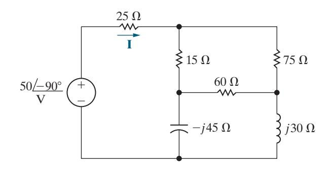

*SELF-CHECK: Also try Chapter Problem 9.42.*

# 9.7 [Source Transformations and](#page--1-0) [Thévenin–Norton Equivalent](#page--1-0) [Circuits](#page--1-0)

The source transformations introduced in Section 4.9 and the Thévenin– Norton equivalent circuits discussed in Section 4.10 are analytical techniques that also can be applied to frequency-domain circuits. We prove these techniques are valid by following the same process used in Sections 4.9 and 4.10, except that we substitute impedance (*Z*) for resistance (*R*). [Figure 9.26](#page-23-0)  shows a source-transformation equivalent circuit in the frequency domain.

Figure 9.27 illustrates the frequency-domain version of a Thévenin equivalent circuit, and Fig. 9.28 shows the frequency-domain equivalent of a Norton equivalent circuit. The techniques for finding the Thévenin equivalent voltage and impedance are identical to those used for resistive circuits, except that the frequency-domain equivalent circuit involves phasors and complex numbers. The same holds for finding the Norton equivalent current and impedance.

Example 9.11 demonstrates the application of the source-transformation equivalent circuit to frequency-domain analysis. Example 9.12 illustrates the details of finding a Thévenin equivalent circuit in the frequency domain.

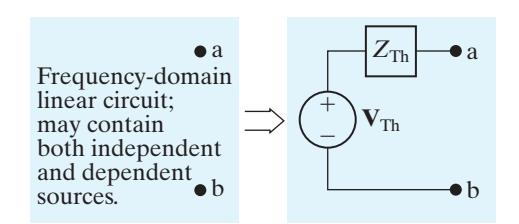

Figure 9.27 ▲ The frequency-domain version of a Thévenin equivalent circuit.

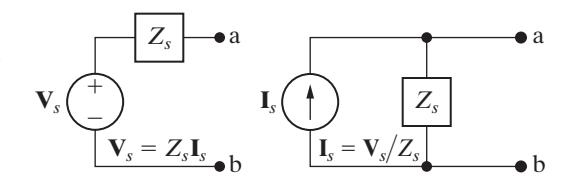

Figure 9.26 ▲ A source transformation in the frequency domain.

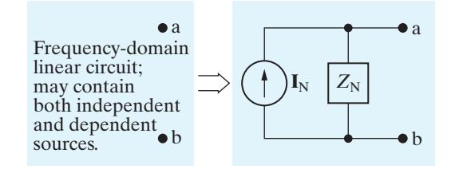

Figure 9.28 ▲ The frequency-domain version of a Norton equivalent circuit.

### EXAMPLE 9.11 Performing Source Transformations in the Frequency Domain

Use a series of source transformations to find the phasor voltage **V**0 in the circuit shown in Fig. 9.29.

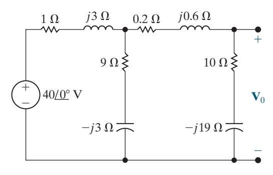

Figure 9.29 ▲ The circuit for Example 9.11.

### 9 V 10 V 2*j*3 V 2*j*19 V 1 V *j*3 V 0.2 V *j*0.6 V 4 2 *j*12 A 1 2 **V**0

Figure 9.30 ▲ The first step in reducing the circuit shown in Fig. 9.29.

### Solution

Begin by replacing the series combination of the voltage source (40 0°) and the impedance of 1 3 1 3 + Ω + Ω *jj* with the parallel combination of a current source and the 1 3 + Ω *j* impedance. The current source is

$$\mathbf{I} = \frac{40}{1+j3} = 4 - j12 \,\mathbf{A}.$$

The resulting circuit is shown in Fig. 9.30. We used the polarity of the 40 V source to determine the direction for **I**.

Next, we combine the two parallel branches into a single impedance,

$$Z = \frac{(1+j3)(9-j3)}{10} = 1.8 + j2.4 \,\Omega,$$

which is in parallel with the current source of 4 1 − *j* 2 A. Another source transformation converts this parallel combination to a series combination of a voltage source and the impedance of 1.8 + Ω *j* 2.4 . The voltage of the voltage source is

$$\mathbf{V} = (4 - j12)(1.8 + j2.4) = 36 - j12 \,\mathrm{V}.$$

The resulting circuit is shown in [Fig. 9.31.](#page-24-0) We added the current **I** 0 to this circuit to assist us in finding **V** . 0

We have now reduced the circuit to a simple series connection. We calculate the current **I** 0 by dividing the voltage of the source by the total series impedance:

$$\mathbf{I}_0 = \frac{36 - j12}{12 - j16} = 1.56 + j1.08 \text{ A}.$$

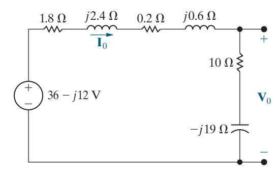

Figure 9.31 ▲ The second step in reducing the circuit shown in [Fig. 9.29.](#page-23-0)

Now multiply **I** 0 by the impedance 10 19 − *j* to get **V**0:

$$\mathbf{V}_0 = (1.56 + j1.08)(10 - j19) = 36.12 - j18.84 \text{ V}.$$

You can verify this result by using voltage division to calculate **V**0.

### EXAMPLE 9.12 Finding a Thévenin Equivalent in the Frequency Domain

Find the Thévenin equivalent circuit with respect to terminals a,b for the circuit shown in Fig. 9.32.

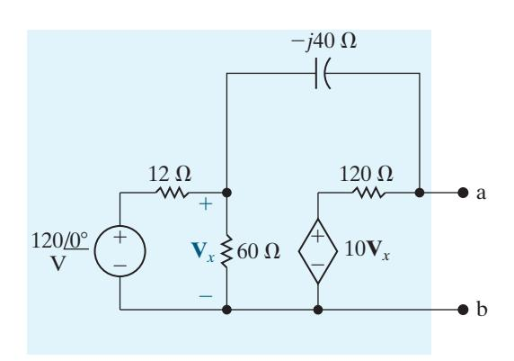

Figure 9.32 ▲ The circuit for Example 9.12.

### Solution

We first determine the Thévenin equivalent voltage. This voltage is the open-circuit voltage appearing at terminals a,b. We choose the reference for the Thévenin voltage as positive at terminal a. We can make two source transformations using the 120 V, 12 Ω, and 60 Ω circuit elements to simplify the lefthand side of the circuit. These transformations must preserve the identity of the controlling voltage **V***x* because of the dependent voltage source.

The first source transformation replaces the series combination of the 120 V source and 12 Ω resistor with a 10 A current source in parallel with 12 Ω. Next, we replace the parallel combination of the 12 and 60 Ω resistors with a single 10 Ω resistor. Finally, we replace the parallel-connected 10 A source and 10 Ω resistor with a 100 V source in series with 10 Ω. Figure 9.33 shows the resulting circuit.

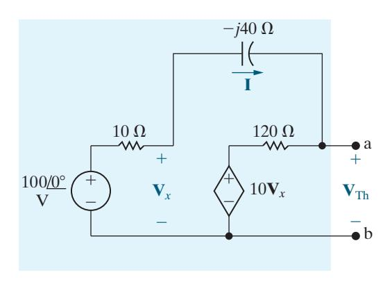

Figure 9.33 ▲ A simplified version of the circuit shown in Fig. 9.32.

We added the current **I** to Fig. 9.33; note that once we know its value, we can compute the Thévenin voltage. Use KVL to find **I** by summing the voltages around the closed path in the circuit. Hence

$$100 = 10\mathbf{I} - j40\mathbf{I} + 120\mathbf{I} + 10\mathbf{V}_x = (130 - j40)\mathbf{I} + 10\mathbf{V}_x.$$

We relate the controlling voltage **V***x* to the current **I** by noting from Fig. 9.33 that

$$\mathbf{V}_{x} = 100 - 10\mathbf{I}.$$

Then,

$$\mathbf{I} = \frac{-900}{30 - j40} = -10.8 - j14.4 \text{ A}.$$

Finally, we note from Fig. 9.33 that

$$\mathbf{V}_{Th} = 10\mathbf{V}_x + 120\mathbf{I}$$

$$= 10(100 - 10\mathbf{I}) + 120\mathbf{I}$$

$$= 1000 + 20(-10.8 - j14.4)$$

$$= 784 - j288 \text{ V}.$$

We can find the Thévenin impedance using any of the techniques in Sections 4.10–4.11 for finding Thévenin resistance. We use the test-source method in this example. We begin by deactivating all independent sources in the circuit, and then we apply either a test-voltage source or a test-current source to the terminals of interest. The ratio of the voltage to the current at the test source is the Thévenin impedance. Figure 9.34 presents the result of applying this technique to the circuit shown in [Fig. 9.32](#page-24-0) while preserving the identity of **V** . *x*

We added branch currents **I** a and **I** b to simplify the calculation of **I** . *T* You should verify the following relationships by applying Ohm's law, KVL, and KCL for phasors:

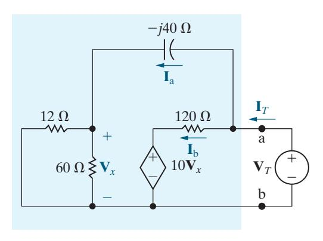

Figure 9.34 ▲ A circuit for calculating the Thévenin equivalent impedance.

$$\begin{split} \mathbf{I}_{\rm a} &= \frac{\mathbf{V}_T}{10 - j40}, \mathbf{V}_x = 10 \mathbf{I}_{\rm a}, \\ \mathbf{I}_{\rm b} &= \frac{\mathbf{V}_T - 10 \mathbf{V}_x}{120} \\ &= \frac{-\mathbf{V}_T (9 + j4)}{120(1 - j4)}, \\ \mathbf{I}_T &= \mathbf{I}_{\rm a} + \mathbf{I}_{\rm b} \\ &= \frac{\mathbf{V}_T}{10 - j40} \Big( 1 - \frac{9 + j4}{12} \Big) \\ &= \frac{\mathbf{V}_T (3 - j4)}{12(10 - j40)}, \\ Z_{\rm Th} &= \frac{\mathbf{V}_T}{\mathbf{I}_T} = 91.2 - j38.4 \ \Omega. \end{split}$$

Figure 9.35 depicts the Thévenin equivalent circuit.

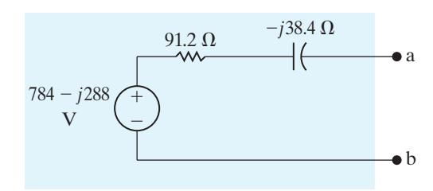

Figure 9.35 ▲ The Thévenin equivalent for the circuit shown in [Fig. 9.32.](#page-24-0)

### ASSESSMENT PROBLEMS

Objective 3—Know how to use circuit analysis techniques to solve a circuit in the frequency domain

 9.10 Find the steady-state expression for *i*( )*t* in the circuit shown by using source transformations. The sinusoidal voltage sources are

$$i_1 = 4\cos 500t \text{ A},$$
  
 $i_2 = 2\sin 500t \text{ A}.$ 

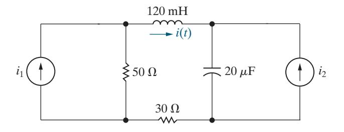

Answer: 4.47cos(500 26.57° *t* + ) A.

 9.11 Find the Norton equivalent with respect to terminals a,b in the circuit shown.

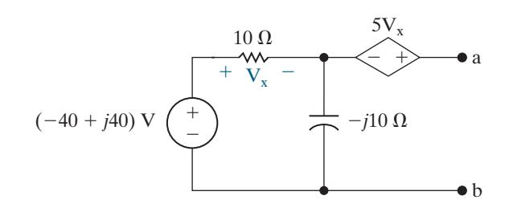

Answer: **I** N = +6 4*j* A; *Z j* N = −20 20 + Ω.

*SELF-CHECK: Also try Chapter [Problems](#page--1-0) 9.44, 9.45, and 9.49.*

# 9.8 [The Node-Voltage Method](#page--1-0)

In Sections 4.2–4.4, we introduced the node-voltage method of circuit analysis, culminating in Analysis Method 4.3 (p. 102). We can use this analysis method to find the steady-state response for circuits with sinusoidal sources. We need to make a few modifications:

- If the circuit is in the time domain, it must be transformed to the appropriate frequency domain. To do this, transform known voltages and currents to phasors, replace unknown voltages and currents with phasor symbols, and replace the component values for resistors, inductors, mutually coupled coils, and capacitors with their impedance values.
- Follow the steps in Analysis Method 4.3 to find the values of the unknown voltage and current phasors of interest.
- Apply the inverse phasor transform to the voltage and current phasors to find the steady-state values of the corresponding voltages and currents in the time domain.

Example 9.13 illustrates these steps. Assessment Problem 9.12 and many of the chapter problems give you an opportunity to use the node-voltage method to solve for steady-state sinusoidal responses.

### EXAMPLE 9.13 Using the Node-Voltage Method in the Frequency Domain

Use the node-voltage method to find the branch currents *i*a, *i*b, and *i*c in the steady-state, for the circuit shown in Fig. 9.36. The value of the current source in this circuit is *i t s* = 10.6 cos(500 )A.

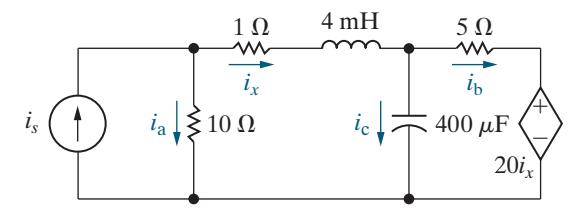

Figure 9.36 ▲ The circuit for Example 9.13.

### Solution

We begin by transforming the circuit into the frequency domain. To do this, we replace the value of the current source with its phasor transform, 10.6 0 A° . We also replace the currents *i*a, *i*b, *i*c, and *ix* with corresponding phasor symbols **I**a, **I**b, **I**c, and **I***x*. Then we replace the inductor and capacitor values with their impedances, using the frequency of the source:

$$\begin{split} Z_L &= j(500)(4\times 10^{-3}) = j2\,\Omega; \\ Z_C &= \frac{-j}{(500)(400\times 10^{-6})} = -j5\,\Omega. \end{split}$$

The resulting frequency-domain circuit is shown in Fig. 9.37.

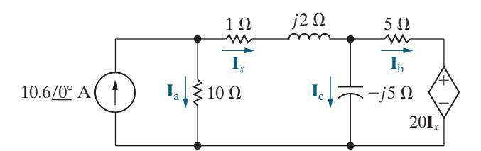

Figure 9.37 ▲ The circuit in Fig. 9.36, transformed into the frequency domain.

Now we can employ Analysis Method 4.3.

**Step 1:** The circuit has three essential nodes, two at the top and one on the bottom. We will need two KCL equations to describe the circuit.

**Step 2:** Four branches terminate on the bottom node, so we select it as the reference node and label the node voltages at the remaining essential nodes. The results of the first two steps are shown in Fig. 9.38.

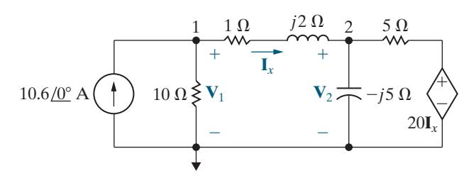

Figure 9.38 ▲ The circuit shown in Fig. 9.37, with the node voltages defined.

**Step 3:** Apply KCL at the nonreference essential nodes to give

$$-10.6 + \frac{\mathbf{V}_1}{10} + \frac{\mathbf{V}_1 - \mathbf{V}_2}{1 + j2} = 0,$$

and

$$\frac{\mathbf{V}_2 - \mathbf{V}_1}{1 + j2} + \frac{\mathbf{V}_2}{-j5} + \frac{\mathbf{V}_2 - 20\mathbf{I}_x}{5} = 0.$$

The circuit has a dependent source, so we need a dependent source constraint equation that defines **I***x* in terms of the node voltages:

$$\mathbf{I}_x = \frac{\mathbf{V}_1 - \mathbf{V}_2}{1 + j2}.$$

**Step 4:** Solve the three equations from Step 3 for **V**1, **V**2, and **I***x*:

$$\mathbf{V}_1 = 68.4 - j16.8 \,\mathrm{V},$$

$$\mathbf{V}_2 = 68 - j26 \,\mathrm{V},$$

$$I_x = 3.76 + j1.68 \text{ A}.$$

**Step 5:** Use the phasor values from Step 4 to find the three branch currents from [Fig. 9.37:](#page-26-0)

$$\mathbf{I}_{a} = \frac{\mathbf{V}_{1}}{10} = 6.84 - j1.68 \,\mathrm{A} = 7.04 / -13.8^{\circ} \,\mathrm{A},$$

$$\mathbf{I}_{b} = \frac{\mathbf{V}_{2} - 20\mathbf{I}_{x}}{5} = -1.44 - j11.92 \text{ A} = 12/-96.89^{\circ} \text{ A},$$

$$\mathbf{I}_{c} = \frac{\mathbf{V}_{2}}{-j5} = 5.2 + j13.6 \,\mathrm{A} = 14.56 / 69.08^{\circ} \,\mathrm{A}.$$

We find the steady-state values of the branch currents in the time-domain circuit of [Fig. 9.37](#page-26-0) by applying the inverse phasor transform to the results of Step 5. Remember that the frequency of the current source in the circuit is 500 rad s. The results are

$$i_{\rm a} = 7.04 \cos(500t - 13.8^{\circ}) \,\mathrm{A}$$

$$i_{\rm b} = 12 \cos(500t - 96.89^{\circ}) \,\mathrm{A},$$

$$i_{\rm c} = 14.56 \cos(500t + 69.08^{\circ}) \,\mathrm{A}.$$

### ASSESSMENT PROBLEM

Objective 3—Know how to use circuit analysis techniques to solve a circuit in the frequency domain

 9.12 Use the node-voltage method to find the steady-state expression for *io* in the circuit shown if *i t g* = 5cos2500 A and 20 cos(2500*t* 90°) V. *g v* = +

Answer: 2.24 cos(2500 63.43° *t* + ) A.

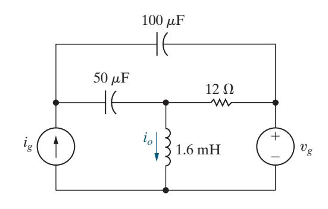

*SELF-CHECK: Also try Chapter [Problems](#page--1-0) 9.54 and 9.55.*

# 9.9 [The Mesh-Current Method](#page--1-0)

We can also use the mesh-current method to analyze frequency-domain circuits. If a problem begins with a circuit in the time domain, it needs to be transformed into the frequency domain. Then, Analysis Method 4.6 (p. 110) can be used to find the mesh-current phasors, just as it was used to find mesh currents in resistive circuits. Finally, apply the inverse phasor transform to the phasor voltages and currents to find the steady-state voltages and currents in the time domain. We use the mesh-current method to analyze a frequency-domain circuit in Example 9.14.

### EXAMPLE 9.14 Using the Mesh-Current Method in the Frequency Domain

Use the mesh-current method to find the voltages **V** , 1 **V** , 2 and **V**3 in the circuit shown in Fig. 9.39.

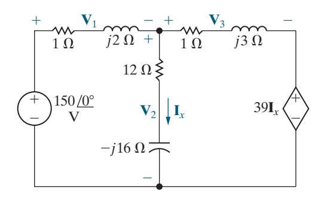

Figure 9.39 ▲ The circuit for Example 9.14.

### Solution

The circuit is already in the frequency domain, so we apply Analysis Method 4.6.

**Step 1:** Use directed arrows that traverse the mesh perimeters to identify the two mesh current phasors.

**Step 2:** Label the mesh current phasors as **I**1 and **I**2, as shown in Fig. 9.40.

**Step 3:** Write the KVL equations for the meshes:

$$150 = (1+j2)\mathbf{I}_1 + (12-j16)(\mathbf{I}_1 - \mathbf{I}_2),$$

$$0 = (12 - j16)(\mathbf{I}_2 - \mathbf{I}_1) + (1 + j3)\mathbf{I}_2 + 39\mathbf{I}_x.$$

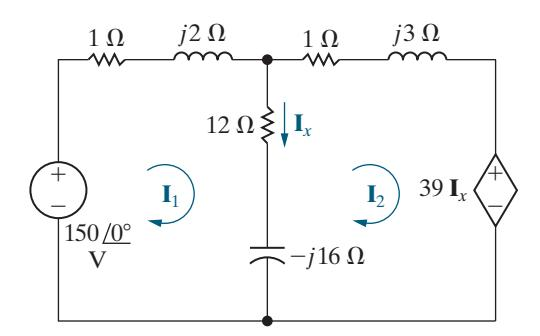

Figure 9.40 ▲ Mesh currents used to solve the circuit shown in Fig. 9.39.

The circuit in Fig. 9.40 has a dependent source, so we need a constraint equation that defines **I***x* in terms of the mesh currents. The resulting equation is

$$\mathbf{I}_x = \mathbf{I}_1 - \mathbf{I}_2.$$

**Step 4:** Solving the simultaneous equations in Step 3 gives

$$\mathbf{I}_1 = -26 - j52 \,\mathbf{A},$$

$$\mathbf{I}_2 = -24 - j58 \,\mathrm{A},$$

$$\mathbf{I}_x = -2 + j6 \,\mathbf{A}.$$

**Step 5:** Finally, we use the mesh-current phasors from Step 4 to find the phasor voltages identified in the circuit of Fig. 9.39:

$$\mathbf{V}_1 = (1+j2)\mathbf{I}_1 = 78 - j104 \,\mathrm{V},$$

$$\mathbf{V}_2 = (12 - j16)\mathbf{I}_x = 72 + j104 \,\mathrm{V},$$

$$\mathbf{V}_3 = (1+j3)\mathbf{I}_2 = 150 - j130 \text{ V}.$$

Also

$$39\mathbf{I}_x = -78 + j234 \text{ V}.$$

We check these calculations by summing the voltages around closed paths:

$$-150 + \mathbf{V}_1 + \mathbf{V}_2 = -150 + 78 - j104 + 72$$
$$+ j104 = 0,$$

$$-\mathbf{V}_2 + \mathbf{V}_3 + 39\mathbf{I}_x = -72 - j104 + 150 - j130$$
$$-78 + j234 = 0,$$

$$-150 + \mathbf{V}_1 + \mathbf{V}_3 + 39\mathbf{I}_x = -150 + 78 - j104 + 150$$

$$-j130 - 78 + j234 = 0.$$

### ASSESSMENT PROBLEM

Objective 3—Know how to use circuit analysis techniques to solve a circuit in the frequency domain

9.13 Use the mesh-current method to find the steady-state expression for *v o* in the circuit shown if *v* 400 cos5000 V*t g* = .

Answer: 178.89 cos(5000*t* + 153.43°) V.

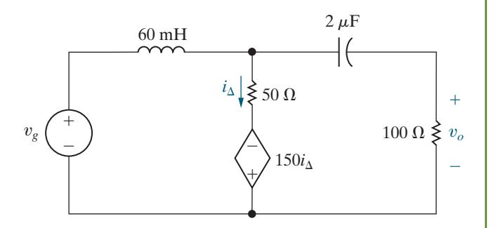

*SELF-CHECK: Also try Chapter [Problems](#page--1-0) 9.60 and 9.61.*

# 9.10 [The Transformer](#page--1-0)

A transformer is a device based on the magnetic coupling that characterizes mutually coupled inductor coils. Transformers are used in both communication and power circuits. In communication circuits, the transformer is used to match impedances and eliminate dc signals from portions of the system. In power circuits, transformers are used to establish ac voltage levels that facilitate the transmission, distribution, and consumption of electrical power. We need to know how a transformer behaves in the sinusoidal steady state when analyzing both communication and power systems. In this section, we will discuss the sinusoidal steady-state behavior of the **linear transformer**, which is found primarily in communication circuits. In Section 9.11, we will present the **ideal transformer**, which is used to model the ferromagnetic transformers found in power systems.

When analyzing circuits containing mutually coupled inductor coils, we use the mesh-current method. The node-voltage method is hard to use when mutual inductance is present because the currents in the coupled coils cannot be written by inspection as functions of the node voltages.

### The Analysis of a Linear Transformer Circuit

A simple **transformer** is formed when two coils are wound on a single core to ensure magnetic coupling. Figure 9.41 shows the frequency- domain circuit model of a system that uses a transformer to connect a load to a source. The transformer winding connected to the source is called the **primary winding**, and the winding connected to the load is called the **secondary winding**. The transformer circuit parameters are

*R* = the resistanceof theprimary winding, 1

*R* = the resistanceof thesecondarywinding, 2

*L* = theself-inductanceof theprimary winding, 1

*L* = theself-inductanceof thesecondarywinding, 2

*M* = themutual inductance.

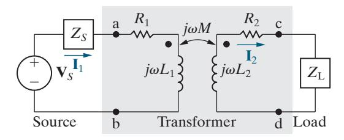

Figure 9.41 ▲ The frequency-domain circuit model for a transformer used to connect a load to a source.

The internal voltage of the sinusoidal source is **V** , *S* and the internal impedance of the source is *Z* . *S* The impedance *Z*L represents the load connected to the secondary winding of the transformer. The phasor currents **I** 1 and **I** 2 are the primary and secondary currents of the transformer, respectively.

We analyze the circuit in [Fig. 9.41](#page-29-0) to find **I** 1 and **I** 2 as functions of the circuit parameters **V***S*, *ZS*, *R*1 , *L*1, *L*2 , *R*2 , *M*, *Z* , L and *ω*. Let's write the two KVL equations that describe the circuit:

$$\mathbf{V}_{S} = (Z_{S} + R_{1} + j\omega L_{1})\mathbf{I}_{1} - j\omega M\mathbf{I}_{2},$$

$$0 = -j\omega M\mathbf{I}_{1} + (R_{2} + j\omega L_{2} + Z_{L})\mathbf{I}_{2}.$$

We define

$$Z_{11} = Z_S + R_1 + j\omega L_1, (9.27)$$

$$Z_{22} = R_2 + j\omega L_2 + Z_L, (9.28)$$

where *Z*11 is the total self-impedance of the mesh containing the primary winding of the transformer and *Z*22 is the total self-impedance of the mesh containing the secondary winding. Using the impedances defined in Eqs. 9.27 and 9.28, we solve the mesh-current equations for **I** 1 and **I** 2 to give

$$\mathbf{I}_{1} = \frac{Z_{22}}{Z_{11}Z_{22} + \omega^{2}M^{2}}\mathbf{V}_{S}, \tag{9.29}$$

$$\mathbf{I}_{2} = \frac{j\omega M}{Z_{11}Z_{22} + \omega^{2}M^{2}}\mathbf{V}_{S} = \frac{j\omega M}{Z_{22}}\mathbf{I}_{1}.$$
 (9.30)

We are also interested in finding the impedance seen when we look into the transformer from the terminals a and b. The internal source voltage **V***S* is attached to an equivalent impedance whose value is the ratio of the source-voltage phasor to the primary current phasor, or

$$\frac{\mathbf{V}_{S}}{\mathbf{I}_{1}} = Z_{\text{int}} = \frac{Z_{11}Z_{22} + \omega^{2}M^{2}}{Z_{22}} = Z_{11} + \frac{\omega^{2}M^{2}}{Z_{22}}.$$

The impedance at the terminals of the source is *Z Z*− , int *S* so

$$Z_{\rm ab} = Z_{11} + \frac{\omega^2 M^2}{Z_{22}} - Z_S = R_1 + j\omega L_1 + \frac{\omega^2 M^2}{(R_2 + j\omega L_2 + Z_{\rm L})}. \tag{9.31}$$

Note that the impedance *Z*ab is independent of the magnetic polarity of the transformer because the mutual inductance *M* appears in Eq. 9.31 as a squared quantity. The impedance *Z*ab is interesting because it describes how the transformer affects the impedance of the load as seen from the source. Without the transformer, the load would be connected directly to the source, and the source would see a load impedance of *Z* ; L with the transformer, the load is connected to the source through the transformer, and the source sees a load impedance that is a modified version of *Z* , L as seen in the third term of Eq. 9.31.

### Reflected Impedance

The third term in Eq. 9.31 is called the **reflected impedance** ( ) *Zr* because it is the equivalent impedance of the secondary coil and load impedance transmitted, or reflected, to the primary side of the transformer. Note that the reflected impedance exists because of the mutual inductance. If the two coils are not coupled, *M* is zero, *Zr* is zero, and *Z*ab is the self- impedance of the primary coil.

To consider reflected impedance in more detail, we first express the load impedance in rectangular form:

$$Z_{\rm L} = R_{\rm L} + jX_{\rm L},$$

where the load reactance *X*L carries its own algebraic sign. That is, *X*L is a positive number if the load is inductive and a negative number if the load is capacitive. We can now write the reflected impedance in rectangular form:

$$Z_{r} = \frac{\omega^{2} M^{2}}{R_{2} + R_{L} + j(\omega L_{2} + X_{L})}$$

$$= \frac{\omega^{2} M^{2} [(R_{2} + R_{L}) - j(\omega L_{2} + X_{L})]}{(R_{2} + R_{L})^{2} + (\omega L_{2} + X_{L})^{2}}$$

$$= \frac{\omega^{2} M^{2}}{|Z_{22}|^{2}} [(R_{2} + R_{L}) - j(\omega L_{2} + X_{L})].$$
(9.32)

The derivation of Eq. 9.32 uses the fact that, when *Z*L is written in rec tangular form, the self-impedance of the mesh containing the secondary winding is

$$Z_{22} = R_2 + R_L + j(\omega L_2 + X_L).$$

In Eq. 9.32 we see that the self-impedance of the secondary circuit is reflected into the primary circuit by a scaling factor of *M Z* , 22 2 ( ) *ω* and that the sign of the reactive component *ωL X* 2 L ( ) + is reversed. Thus, the linear transformer reflects the complex conjugate of the self-impedance of the secondary circuit ( ) *Z*22 \* into the primary winding with a scalar multiplier.

Example 9.15 analyzes a circuit with a linear transformer.

### EXAMPLE 9.15 Analyzing a Linear Transformer in the Frequency Domain

The parameters of a linear transformer are *R* = Ω 200 , 1 *R* = Ω 100 , 2 *L* = 9 H, 1 *L* = 4 H, 2 and *k* = 0.5. The transformer couples a load impedance with an 800 Ω resistor in series with a 1 F*μ* capacitor to a sinusoidal voltage source. The 300 V (rms) source has an internal impedance of 500 100 + Ω *j* and a frequency of 400 rad s.

- a) Construct a frequency-domain equivalent circuit of the system.
- b) Calculate the self-impedance of the primary circuit.
- c) Calculate the self-impedance of the secondary circuit.
- d) Calculate the impedance reflected into the primary winding.

- e) Calculate the scaling factor for the reflected impedance.
- f) Calculate the impedance seen looking into the primary terminals of the transformer.
- g) Calculate the Thévenin equivalent with respect to the terminals of the load impedance.

### Solution

a) [Figure 9.42](#page-32-0) shows the frequency-domain equivalent circuit. Note that the internal voltage of the source serves as the reference phasor because it is assigned a phase angle of 0°, and that **V**1 and **V**2 represent the terminal voltages of

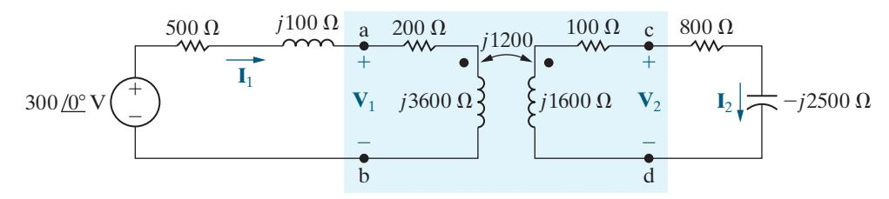

Figure 9.42 ▲ The frequency-domain equivalent circuit for Example 9.15.

the transformer. In constructing the circuit in Fig. 9.42, we made the following calculations:

$$j\omega L_1 = j(400)(9) = j3600 \Omega,$$
  
 $j\omega L_2 = j(400)(4) = j1600 \Omega,$   
 $M = 0.5\sqrt{(9)(4)} = 3 \text{ H},$   
 $j\omega M = j(400)(3) = j1200 \Omega,$   
 $\frac{-j}{\omega C} = \frac{-j}{(400)(1 \times 10^{-6})} = -j2500 \Omega.$ 

b) From Eq. 9.27, the self-impedance of the primary circuit is

$$Z_{11} = 500 + j100 + 200 + j3600 = 700 + j3700 \Omega.$$

c) From Eq. 9.28, the self-impedance of the secondary circuit is

$$Z_{22} = 100 + j1600 + 800 - j2500 = 900 - j900 \Omega.$$

d) From Eq. 9.32, the impedance reflected into the primary winding is

$$Z_r = \left(\frac{1200}{|900 - j900|}\right)^2 (900 + j900)$$
$$= \frac{8}{9} (900 + j900) = 800 + j800 \Omega.$$

- e) The scaling factor by which *Z*22 \* is reflected is 8 9.
- f) The impedance seen looking into the primary terminals of the transformer is the impedance of the primary winding, *Z*11, plus the reflected impedance, *Zr* ; thus

$$Z_{ab} = 200 + j3600 + 800 + j800 = 1000 + j4400 \Omega.$$

g) The Thévenin voltage is the open-circuit value of **V**cd , which equals *j*1200 times the open-circuit value of **I** . 1 The open-circuit value of **I** 1 is

$$\mathbf{I}_{1} = \frac{300 / 0^{\circ}}{700 + j3700}$$
$$= 79.67 / -79.29^{\circ} \text{ mA}.$$

Therefore

$$\mathbf{V}_{\text{Th}} = j1200(79.67 / -79.29^{\circ}) \times 10^{-3}$$
  
=  $95.60 / 10.71^{\circ} \text{ V}.$ 

The Thévenin impedance equals the impedance of the secondary winding, plus the impedance reflected from the primary when the voltage source is replaced by a short circuit. Thus

$$\begin{split} Z_{\text{Th}} &= 100 + j1600 + \left(\frac{1200}{|700 + j3700|}\right)^2 (700 - j3700) \\ &= 171.09 + j1224.26 \,\Omega. \end{split}$$

The Thévenin equivalent is shown in Fig. 9.43.

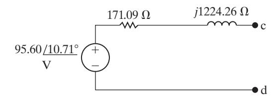

Figure 9.43 ▲ The Thévenin equivalent circuit for Example 9.15.

### ASSESSMENT PROBLEM

Objective 4—Be able to analyze circuits containing linear transformers using phasor methods

- 9.14 a) Find the steady-state expression for the currents *ig* and *iL* in the circuit shown when *v* = 70 cos5000 V*t* . *g*
  - b) Find the coefficient of coupling.
  - c) Find the energy stored in the magnetically coupled coils at *t* = 100π *μ*s and *t* = 200π *μ*s.

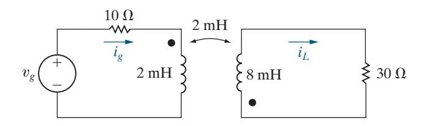

- Answer: a) *i t* = − 5cos(5000 36.87°) A, *g i t* = − cos(5000 180°) A; *L*
  - b) 0.5;
  - c) at *t w* = = 100π *μ*s, 9 mJ, at *t w* = = 200π *μ*s, 12 mJ.

*SELF-CHECK: Also try Chapter [Problems](#page--1-0) 9.74 and 9.76.*

# 9.11 [The Ideal Transformer](#page--1-0)

An **ideal transformer** consists of two magnetically coupled coils having *N*1 and *N*2 turns, respectively, and exhibiting these three properties:

- **1.** The coefficient of coupling is unity ( ) *k* = 1 .
- **2.** The self-inductance of each coil is infinite *L L* . 1 2 ( ) = = ∞
- **4.** The coil losses, due to parasitic resistance, are negligible.

Understanding the behavior of ideal transformers begins with Eq. 9.31, which describes the impedance at the terminals of a source connected to a linear transformer. We repeat this equation in the following discussion and examine it further.

### Exploring Limiting Values

Equation 9.31, repeated here as Eq. 9.33, defines the relationship between the input impedance (*Z*ab) and load impedance (*Z*L) for a linear transformer:

$$Z_{ab} = Z_{11} + \frac{\omega^2 M^2}{Z_{22}} - Z_S$$

$$= R_1 + j\omega L_1 + \frac{\omega^2 M^2}{(R_2 + j\omega L_2 + Z_L)}.$$
(9.33)

Let's consider what happens to Eq. 9.33 as *L*1 and *L*2 each become infinitely large and, at the same time, the coefficient of coupling approaches unity. Transformers wound on ferromagnetic cores can approach these conditions. Even though such transformers are nonlinear, we can obtain some useful information using an ideal model that ignores the nonlinearities.

To show how *Z*ab changes when *k* = 1 and *L*1 and *L*2 approach infinity, we first introduce the notation

$$Z_{22} = R_2 + R_L + j(\omega L_2 + X_L) = R_{22} + jX_{22}$$

and then rearrange Eq. 9.33:

$$Z_{ab} = R_1 + \frac{\omega^2 M^2 R_{22}}{R_{22}^2 + X_{22}^2} + j \left( \omega L_1 - \frac{\omega^2 M^2 X_{22}}{R_{22}^2 + X_{22}^2} \right)$$

$$= R_{ab} + j X_{ab}.$$
(9.34)

At this point, we must be careful with the imaginary part of *Z*ab because, as *L*1 and *L*2 approach infinity, *X*ab is the difference between two large quantities. Thus, before letting *L*1 and *L*2 increase, we write the imaginary part of *Z*ab as

$$X_{ab} = \omega L_1 - \frac{(\omega L_1)(\omega L_2)X_{22}}{R_{22}^2 + X_{22}^2} = \omega L_1 \left(1 - \frac{\omega L_2 X_{22}}{R_{22}^2 + X_{22}^2}\right)$$

where we recognize that, when *k* = 1, *M L L* . 2 = 1 2 Putting the term multiplying *ωL*1 over a common denominator gives

$$X_{\rm ab} = \omega L_1 \left( \frac{R_{22}^2 + \omega L_2 X_{\rm L} + X_{\rm L}^2}{R_{22}^2 + X_{22}^2} \right).$$

Factoring *ωL*2 out of the numerator and ( ) *L*2 *ω* 2 out of the denominator, then simplifying, yields

$$X_{\rm ab} = \frac{L_1}{L_2} \frac{X_{\rm L} + (R_{22}^2 + X_{\rm L}^2)/\omega L_2}{(R_{22}/\omega L_2)^2 + [1 + (X_{\rm L}/\omega L_2)]^2}.$$

As *k* approaches 1.0, the ratio *L L* 1 2 approaches the constant value of *N N* . 1 2 2 ( ) This follows from the relationship between *L*1 and *N*1 (Eq. 6.21), the relationship between *L*2 and *N*2 (Eq. 6.23), and the fact that, as the coupling becomes extremely tight, the two permeances P1 and P2 become equal. The expression for *X*ab simplifies to

$$X_{\mathrm{ab}} = \left(\frac{N_1}{N_2}\right)^2 X_{\mathrm{L}},$$

as *L* →∞, 1 *L* →∞, 2 and *k*→1.0.

The same reasoning leads to simplification of the reflected resistance in Eq. 9.34:

$$\frac{\omega^2 M^2 R_{22}}{R_{22}^2 + X_{22}^2} = \frac{L_1}{L_2} R_{22} = \left(\frac{N_1}{N_2}\right)^2 R_{22}.$$

Substituting the simplified forms for *X*ab and the reflected resistance in Eq. 9.34 yields

$$Z_{\rm ab} = R_1 + \left(\frac{N_1}{N_2}\right)^2 R_2 + \left(\frac{N_1}{N_2}\right)^2 (R_{\rm L} + jX_{\rm L}).$$

Compare this expression for *Z*ab with the one given in Eq. 9.33. We see that when the coefficient of coupling approaches unity and the self-inductances of the coupled coils approach infinity, the transformer reflects the secondary winding resistance and the load impedance to the primary side by a scaling factor equal to the turns ratio *N N*1 2 ( ) squared. Hence, we may describe the terminal behavior of the ideal transformer in terms of two characteristics. First, the magnitude of the volts per turn is the same for each coil, or

$$\left|\frac{\mathbf{V}_1}{N_1}\right| = \left|\frac{\mathbf{V}_2}{N_2}\right|. \tag{9.35}$$

Second, the magnitude of the ampere-turns is the same for each coil, or

$$|\mathbf{I}_1 N_1| = |\mathbf{I}_2 N_2|.$$
 (9.36)

We use magnitude signs in Eqs. 9.35 and 9.36 because we have not yet established reference polarities for the currents and voltages; we discuss the removal of the magnitude signs shortly.

Figure 9.44 shows two lossless ( ) *R R* 1 2 = = 0 magnetically coupled coils. We use Fig. 9.44 to validate Eqs. 9.35 and 9.36. In Fig. 9.44(a), coil 2 is open; in Fig. 9.44(b), coil 2 is shorted. Although we carry out the following analysis in terms of sinusoidal steady-state operation, the results also apply to instantaneous values of *v* and *i*.

### Determining the Voltage and Current Ratios

Note in Fig. 9.44(a) that the voltage at the terminals of the open-circuit coil is entirely the result of the current in coil 1; therefore,

$$\mathbf{V}_2 = j\omega M \mathbf{I}_1.$$

The current in coil 1 is

$$\mathbf{I}_1 = \frac{\mathbf{V}_1}{j\omega L_1}.$$

Thus,

$$\mathbf{V}_2 = \frac{M}{L_1} \mathbf{V}_1.$$

For unity coupling ( 1 *k* = ), the mutual inductance equals *L L* , 1 2 so the expression for **V**2 becomes

$$\mathbf{V}_2 = \sqrt{\frac{L_2}{L_1}} \mathbf{V}_1.$$

For unity coupling, the flux linking coil 1 is the same as the flux linking coil 2, so we need only one permeance to describe the self-inductance of each coil. Thus,

$$\mathbf{V}_2 = \sqrt{\frac{N_2^2 \mathcal{P}}{N_1^2 \mathcal{P}}} \mathbf{V}_1 = \frac{N_2}{N_1} \mathbf{V}_1$$

or

### VOLTAGE RELATIONSHIP FOR AN IDEAL TRANSFORMER

$$\frac{\mathbf{V}_1}{N_1} = \frac{\mathbf{V}_2}{N_2}. (9.37)$$

Summing the voltages around the shorted coil of Fig. 9.44(b) yields

$$0 = -j\omega M \mathbf{I}_1 + j\omega L_2 \mathbf{I}_2,$$

which, when *k* = 1, gives

$$\frac{\mathbf{I}_1}{\mathbf{I}_2} = \frac{L_2}{M} = \frac{L_2}{\sqrt{L_1 L_2}} = \sqrt{\frac{L_2}{L_1}} = \frac{N_2}{N_1}.$$

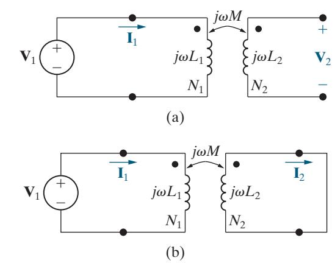

Figure 9.44 ▲ The circuits used to verify Eqs. 9.35 and 9.36 for an ideal transformer.

Therefore,

### CURRENT RELATIONSHIP FOR AN IDEAL TRANSFORMER

$$\mathbf{I}_1 N_1 = \mathbf{I}_2 N_2.$$
 (9.38)

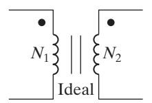

Figure 9.45 ▲ The graphic symbol for an ideal transformer.

Figure 9.45 shows the graphic symbol for an ideal transformer. The vertical lines in the symbol represent the layers of magnetic material from which ferromagnetic cores are often made. Coils wound on a ferromagnetic core behave very much like an ideal transformer, for several reasons. The ferromagnetic material creates a space with high permeance. Thus, most of the magnetic flux is trapped inside the core material, establishing tight magnetic coupling between coils that share the same core. High permeance also means high self-inductance because *L N* P. = 2 Finally, ferromagnetically coupled coils efficiently transfer power from one coil to the other. Efficiencies in excess of 95% are common, so neglecting losses is a valid approximation for many applications.

### Determining the Polarity of the Voltage and Current Ratios

We now turn to the removal of the magnitude signs from Eqs. 9.35 and 9.36. Note that magnitude signs do not appear in Eqs. 9.37 and 9.38 because we established reference polarities for voltages and reference directions for currents in [Fig. 9.44.](#page-35-0) In addition, we specified the magnetic polarity dots of the two coupled coils.

The rules for assigning the proper algebraic sign to Eqs. 9.35 and 9.36 are as follows:

### DOT CONVENTION FOR IDEAL TRANSFORMERS

If the coil voltages **V**1 and **V**2 are both positive or negative at the dot-marked terminals, use a plus sign in Eq. 9.35. Otherwise, use a negative sign.

If the coil currents **I** 1 and **I** 2 are both directed into or out of the dot-marked terminals, use a minus sign in Eq. 9.36. Otherwise, use a plus sign.

The four circuits shown in Fig. 9.46 illustrate these rules.

Figure 9.46 ▲ Circuits that show the proper algebraic signs for relating the terminal voltages and currents of an ideal transformer.

The turns ratio for the two windings is an important parameter of the ideal transformer. In this text, we use *a* to denote the ratio *N N* , 2 1 so

$$a = \frac{N_2}{N_1}. (9.39)$$

Figure 9.47 shows three ways to represent the turns ratio of an ideal transformer. Figure 9.47(a) shows the number of turns in each coil explicitly. Figure 9.47(b) shows that the ratio *N N*2 1 is 5 to 1, and Fig. 9.47(c) shows that the ratio *N N*2 1 is 1 to . 1 5

Example 9.16 analyzes a circuit containing an ideal transformer.

Figure 9.47 ▲ Three ways to show that the turns ratio of an ideal transformer is 5.

### EXAMPLE 9.16 Analyzing an Ideal Transformer Circuit in the Frequency Domain

The load impedance connected to the secondary winding of the ideal transformer in Fig. 9.48 is a 237.5 mΩ resistor in series with a 125 *μ*H inductor.

If the sinusoidal voltage source ( ) *v g* is generating the voltage 2500 cos400*t* V, find the steadystate expressions for: (a) *i* ; 1 (b) *v* ; 1 (c) *i* ; 2 and (d) *v* . 2

Figure 9.48 ▲ The circuit for Example 9.16.

### Solution

a) We begin by transforming the circuit to the frequency domain. The voltage source has the phasor value 2500 0 V° ; the 5 mH inductor has an impedance of *j*2 ; Ω and the 125 *μ*H inductor has an impedance of *j*0.05 Ω. The resulting frequency domain circuit is shown in Fig. 9.49.

Writing a KCL equation for the left-hand mesh in Fig. 9.49 gives

$$2500\underline{/0^{\circ}} = (0.25 + j2)\mathbf{I}_1 + \mathbf{V}_1.$$

Figure 9.49 ▲ Phasor domain circuit for Example 9.16.

Using the relationship between **V**1 and **V**2 for the ideal transformer and using Ohm's law to express **V**2 in terms of **I**2, we have

$$\mathbf{V}_1 = 10\mathbf{V}_2 = 10[(0.2375 + j0.05)\mathbf{I}_2].$$

Because

$$\mathbf{I}_2 = 10\mathbf{I}_1$$

we have

$$\mathbf{V}_1 = 10(0.2375 + j0.05)10\mathbf{I}_1$$
  
=  $(23.75 + j5)\mathbf{I}_1$ .

Therefore

$$2500 \underline{/0^{\circ}} = (24 + j7) \mathbf{I}_{1},$$

or

$$I_1 = 100 / -6.26^{\circ} A.$$

Thus, the steady-state expression for *i*1 is

$$i_1 = 100\cos(400t - 16.26^\circ) \text{ A}.$$

b) 
$$\mathbf{V}_1 = 2500\underline{/0^{\circ}} - (100\underline{/-16.26^{\circ}})(0.25 + j2)$$
  
=  $2420 - j185 = 2427.06\underline{/-4.37^{\circ}}$  V.

Hence, in the steady state

$$v_1 = 2427.06\cos(400t - 4.37^{\circ}) \text{ V}.$$

c) **I I** 10 1000 16.26 A. 2 1 = = − °

Therefore, in the steady state

$$i_2 = 1000\cos(400t - 16.26^\circ) \text{ A}.$$

d) 
$$V_2 = 0.1V_1 = 242.71 / -4.37^{\circ} V$$
, so in the steady state,

$$v_2 = 242.71\cos(400t - 4.37^\circ) \text{ V}.$$

### ASSESSMENT PROBLEM

### Objective 5—Be able to analyze circuits with ideal transformers

9.15 The source voltage in the phasor domain circuit in the accompanying figure is 200 0° V. Find the amplitude and phase angle of **V**2 and **I** . 2

**Answer:** 
$$V_2 = 3577.71 / 153.43^{\circ} V;$$
  
 $I_2 = 0.4 / -143.13^{\circ} A.$ 

*SELF-CHECK: Also try Chapter Problem 9.80.*

Figure 9.50 ▲ Using an ideal transformer to couple a load to a source.

### Using an Ideal Transformer for Impedance Matching

Ideal transformers can be used to increase or decrease the impedance level of a load, as illustrated by the circuit shown in Fig. 9.50. The impedance seen by the practical voltage source (**V***s* in series with *Zs* ) is **V I** . 1 1 The voltage and current at the terminals of the load impedance (**V**2 and **I** 2 ) are related to **V**1 and **I** 1 by the transformer turns ratio; thus

$$\mathbf{V}_1 = \frac{\mathbf{V}_2}{a},$$

and

$$\mathbf{I}_1 = a\mathbf{I}_2.$$

Therefore, the impedance seen by the practical source is

$$Z_{\rm IN} = \frac{\mathbf{V}_1}{\mathbf{I}_1} = \frac{1}{a^2} \frac{\mathbf{V}_2}{\mathbf{I}_2},$$

but the ratio **V I** 2 2 is the load impedance *Z* , L so the expression for *Z*IN becomes

$$Z_{\rm IN} = \frac{1}{a^2} Z_{\rm L}. {(9.40)}$$

Thus, the ideal transformer's secondary coil reflects the load impedance back to the primary coil, with the scaling factor 1 . *a*2

Note that the ideal transformer changes the magnitude of *Z*L but does not affect its phase angle. Whether *Z*IN is greater or less than *Z*L depends on the turns ratio *a*. The ideal transformer—or its practical counterpart, the ferromagnetic core transformer—can be used to match the magnitude of *Z*L to the magnitude of *Z* .*s* We will discuss why this may be desirable in Chapter 10.

Ideal transformers are also used to increase or decrease voltages from a source to a load, as we will see in Chapter 10. Thus, ideal transformers are used widely in the electric utility industry, where it is desirable to decrease, or step down, the voltage level at the power line to safer residential voltage levels.

# 9.12 [Phasor Diagrams](#page--1-0)

When we analyze the sinusoidal steady-state operation of a circuit using phasors, a diagram of the phasor currents and voltages can give us additional insight into the circuit's behavior. A phasor diagram shows the magnitude and phase angle of each phasor quantity in the complex- number plane. Phase angles are measured counterclockwise from the positive real axis, and magnitudes are measured from the origin of the axes. For example, Fig. 9.51 shows the phasor quantities 10 30°, 12 150°, 5 − ° 45 , and 8 −170°.

Because constructing phasor diagrams for circuits usually involves both currents and voltages, we use two different magnitude scales, one for currents and one for voltages. Visualizing a phasor on the complex- number plane is a good way to check your calculations. For example, suppose you convert the phasor −7 – *j*3 to polar form. Before making your calculation, you should anticipate a magnitude greater than 7 and an angle in the third quadrant that is more negative than − ° 135 or less positive than 225°, as illustrated in Fig. 9.52.

Examples 9.17 and 9.18 construct and use phasor diagrams. You can use phasor diagrams to get additional insight into the steady-state sinusoidal operation of a circuit. For example, Problem 9.83 uses a phasor diagram to explain the operation of a phase-shifting circuit.

Figure 9.51 ▲ A graphic representation of phasors.

Figure 9.52 ▲ The complex number − −7 3*j .* = 7 62 156 80 *.* °.

### EXAMPLE 9.17 Using Phasor Diagrams to Analyze a Circuit

Use a phasor diagram for the circuit in Fig. 9.53 to find the value of *R* that causes the current through that resistor, *i* , *R* to lag the source current, *i* ,*s* by 45° when *ω* = 5 krad s.

Figure 9.53 ▲ The circuit for Example 9.17.

### Solution

According to KCL, the sum of the currents **I** , *R* **I** , *L* and **I***C* must equal the source current **I** .*s* If we assume that the phase angle of the voltage **V***m* is zero, we can draw the current phasors for each of the components. The current phasor for the inductor is

$$\mathbf{I}_{L} = \frac{V_{m} / 0^{\circ}}{j(5000)(0.2 \times 10^{-3})} = V_{m} / 90^{\circ},$$

whereas the current phasor for the capacitor is

$$\mathbf{I}_C = \frac{V_m \angle 0^{\circ}}{-j(5000)(50 \times 10^{-6})} = 4V_m \angle 90^{\circ},$$

and the current phasor for the resistor is

$$\mathbf{I}_R = \frac{V_m / 0^{\circ}}{R} = \frac{V_m}{R} / 0^{\circ}.$$

These phasors are shown in Fig. 9.54. The phasor diagram also shows the source current phasor, sketched as a dashed line, which must be the sum of the current phasors of the three circuit components and must be at an angle that is 45° more positive than the current phasor for the resistor. As you can see, summing the phasors makes an isosceles triangle, so the length of the current phasor for the resistor must equal 3 . *Vm* Therefore, the value of the resistor is Ω. 1 3

Figure 9.54 ▲ The phasor diagram for the currents in Fig. 9.53.

### EXAMPLE 9.18 Using Phasor Diagrams to Analyze Capacitive Loading Effects

The circuit in Fig. 9.55 has a load consisting of the parallel combination of the resistor and inductor. Use phasor diagrams to explore the effect of adding a capacitor across the terminals of the load on the amplitude of **V***s* if we adjust **V***s* so that the amplitude of **V**L remains constant. Utility companies use this technique to control the voltage drop on their lines.

Figure 9.55 ▲ The circuit for Example 9.18.

### Solution

We begin by assuming zero capacitance across the load. After constructing the phasor diagram for the zero-capacitance case, we can add the capacitor and study its effect on the amplitude of **V** ,*s* holding the amplitude of **V**L constant. Figure 9.56 shows the frequency-domain equivalent of the circuit in Fig. 9.55. We added the phasor branch currents **I**, **I** , a and **I** b to Fig. 9.56 to assist our analysis.

Figure 9.56 ▲ The frequency-domain equivalent of the circuit in Fig. 9.55.

Figure 9.57 shows the stepwise evolution of the phasor diagram. Keep in mind that in this example we are not interested in specific phasor values and positions, but rather in the general effect of adding a capacitor across the terminals of the load. Thus, we want to develop the relative positions of the phasors before and after the capacitor is added.

Relating the phasor diagram to the circuit shown in Fig. 9.56, we make the following observations:

- We choose **V**L as our reference because we are holding its amplitude constant. For convenience, we place this phasor on the positive real axis.
- We know that **I** a is in phase with **V**L and that its magnitude is **V** *R* . L 2 (On the phasor diagram, the magnitude scale for the current phasors is independent of the magnitude scale for the voltage phasors.)

Figure 9.57 ▲ The step-by-step evolution of the phasor diagram for the circuit in Fig. 9.56.

- We know that **I** b lags behind **V**L by 90° and that its magnitude is **V** *L* . L 2 *ω*
- The current **I** is equal to the sum of **I** a and **I** b .
- The voltage drop across *R*1 is in phase with the current **I**, and the voltage drop across *j Lω* 1 leads **I** by 90°.
- The source voltage is given by **V V** ( ) *R j L* **I**. *s* = +L 1 + *ω* 1

The completed phasor diagram shown in Step 6 of Fig. 9.57 shows the amplitude and phase angle relationships among all the currents and voltages in Fig. 9.56.

Now add the capacitor branch shown in Fig. 9.58. We are holding **V**L constant, so we construct the phasor diagram for the circuit in Fig. 9.58 following the same steps as those in Fig. 9.57, except that, in Step 4, we add the capacitor current **I** c to the diagram, where **I** c leads **V**L by 90°, with **I V** *C* . *C* = L*ω* [Figure 9.59](#page-41-0) shows the effect of **I** c on the current **I**: Both the magnitude and phase angle of **I** change as the magnitude of **I**c changes. As **I** changes, so do the magnitude and phase angle of the voltage drop across the impedance ( ) *R j L* , 1 1 + *ω* resulting in changes to the magnitude and phase angle of **V***s*. The phasor diagram shown in [Fig. 9.60](#page-41-0) depicts these observations. The dashed phasors represent the pertinent currents and voltages before adding the capacitor.

Figure 9.58 ▲ The addition of a capacitor to the circuit shown in Fig. 9.56.

Figure 9.59 ▲ The effect of the capacitor current Ic on the line current I.

Thus, comparing the dashed phasors of **I**, *R* **I**, 1 *j L* **I**, *ω* 1 and **V***s* with their solid counterparts clearly shows the effect of adding *C* to the circuit. In particular, adding the capacitor reduces the source voltage amplitude while maintaining the load voltage amplitude. Practically, this result means that, as the load increases (i.e., as **I** a and **I** b increase), we can add capacitors to the system (i.e., increase **I** c ), so

Figure 9.60 ▲ The effect of adding a load-shunting capacitor to the circuit shown in [Fig. 9.53](#page-39-0) if VL is held constant.

that under heavy load conditions we can maintain **V**L without increasing the amplitude of the source voltage.

*SELF-CHECK: Assess your understanding of this material by trying Chapter [Problems](#page--1-0) 9.84 and 9.85.*

# [Practical Perspective](#page--1-0)

### A Household Distribution Circuit

After determining the loads on the three-wire distribution circuit prior to the interruption of Fuse A, you are able to construct the frequency- domain circuit model shown in Fig. 9.61. The impedances of the wires connecting the source to the loads are assumed negligible.

Figure 9.61 ▲ The three-wire household distribution circuit model.

Let's begin by calculating all of the branch current phasors in the figure, prior to the interruption of Fuse A. We calculate I4, I5, and I6 using Ohm's law:

$$I_4 = \frac{120}{24} = 5/0^{\circ} A;$$

$$\mathbf{I}_5 = \frac{120}{12} = 10 / 0^{\circ} \, \mathrm{A};$$

$$\mathbf{I}_6 = \frac{240}{8.4 + j6.3} = 18.29 - j13.71 \,\mathbf{A} = 22.86 / -36.87^{\circ} \,\mathbf{A}.$$

We calculate **I**1, **I**2, and **I**3 using KCL and the other branch currents:

$$\mathbf{I}_1 = \mathbf{I}_4 + \mathbf{I}_6 = 23.29 - j13.71 \,\mathbf{A} = 27.02 / -30.5^{\circ} \,\mathbf{A};$$

$$\mathbf{I}_2 = \mathbf{I}_5 - \mathbf{I}_4 = 5 / 0^{\circ} \,\mathbf{A};$$

$$\mathbf{I}_3 = \mathbf{I}_5 + \mathbf{I}_6 = 28.29 - j13.71 \,\mathbf{A} = 31.44 / -25.87^{\circ} \,\mathbf{A}.$$

Now calculate those same branch current phasors after Fuse A is interrupted. We assume that the fan motor behaves like a short circuit when it stalls, and the interrupted fuse behaves like an open circuit. The circuit model now looks like Fig. 9.62. To analyze this circuit, we write two mesh current equations using the mesh current phasors shown in Fig. 9.62:

Figure 9.62 ▲ The circuit in [Fig. 9.61](#page-41-0) after Fuse A is interrupted and the fan motor stalls.

$$12(\mathbf{I}_{a} - \mathbf{I}_{b}) = 120;$$
$$24\mathbf{I}_{b} + 12(\mathbf{I}_{b} - \mathbf{I}_{a}) = 0.$$

Solving the mesh current equations, we get

$$I_a = 15 \text{ A};$$

$$I_b = 5 \text{ A}.$$

Using these mesh current phasors to calculate the new branch current phasors from [Fig. 9.61,](#page-41-0) we get

$$I_1 = 0 A;$$
 $I_2 = I_3 = I_a = 15 A;$ 
 $I_6 = I_b = 5 A;$ 
 $I_4 = I_1 - I_6 = -5 A;$ 
 $I_5 = I_2 + I_4 = 10 A.$ 

We can see that even though Fuse A is interrupted and the I1 branch current is zero, all of the other branch currents are nonzero. The appliances and electronics in the house continued to operate because they are represented by the 12 Ω load that still has an ample supply of current.

*SELF-CHECK: Assess your understanding of this Practical Perspective by trying Chapter [Problems](#page--1-0) 9.88 and 9.89.*

# [Summary](#page--1-0)

• The general equation for a **sinusoidal source** is

$$v = V_m \cos(\omega t + \phi)$$
 (voltage source),

or

$$i = I_m \cos(\omega t + \phi)$$
 (current source),

where *Vm* (or *I m* ) is the maximum amplitude, *ω* is the frequency, and *φ* is the phase angle. (See page 320.)

- The frequency, *ω* , of a sinusoidal response is the same as the frequency of the sinusoidal source driving the circuit. The amplitude and phase angle of the response are usually different from those of the source. (See page 323.)
- The best way to find the steady-state voltages and currents in a circuit driven by sinusoidal sources is to perform the analysis in the frequency domain. The following mathematical transforms allow us to move between the time and frequency domains.
  - The phasor transform (from the time domain to the frequency domain):

$$\mathbf{V} = V_m e^{j\phi} = \mathcal{P}\{V_m \cos(\omega t + \phi)\}.$$

• The inverse phasor transform (from the frequency domain to the time domain):

$$\mathcal{P}^{-1} \, \{ V_m e^{\, j \phi} \, \} \, = \, \mathcal{R} \, \{ V_m e^{\, j \phi} e^{\, j \omega t} \, \}$$

(See pages 324–325.)

- In a circuit with a sinusoidal source, the voltage leads the current by 90° at the terminals of an inductor, and the current leads the voltage by 90° at the terminals of a capacitor. (See pages 327–331.)
- **Impedance** (*Z*) relates the phasor current and phasor voltage for resistors, inductors, and capacitors in an equation that has the same form as Ohm's law,

$$\mathbf{V} = Z\mathbf{I},$$

where the reference direction for **I** obeys the passive sign convention. The reciprocal of impedance is **admittance** (*Y*), so another way to express the currentvoltage relationship for resistors, inductors, and capacitors in the frequency domain is

$$\mathbf{V} = \mathbf{I}/Y$$
.

(See pages 330 and 336.)

- The equations for impedance and admittance for resistors, inductors, and capacitors are summarized in Table 9.3.
- All of the circuit analysis techniques developed in Chapters 2–4 for resistive circuits also apply to sinusoidal steady-state circuits in the frequency domain. These techniques include KVL, KCL, series, and parallel combinations of impedances, voltage and current division, node-voltage and mesh- current methods, Thévenin and Norton equivalents, and source transformation.
- The two-winding **linear transformer** is a coupling device made up of two coils wound on the same nonmagnetic core. **Reflected impedance** is the impedance of the secondary circuit as seen from the terminals of the primary circuit, or vice versa. The reflected impedance of a linear transformer seen from the primary side is the complex conjugate of the self-impedance of the secondary circuit scaled by the factor ( ) *ωM Z*22 2 . (See pages 347–349.)
- The two-winding **ideal transformer** is a linear transformer with the following special properties: perfect coupling ( 1 *k* = ), infinite self-inductance in each coil ( ) *L L* 1 2 = = ∞ , and lossless coils ( 0 *R R* ) 1 2 = = . The circuit behavior is governed by the turns ratio *a N N* . = 2 1 In particular, the volts per turn is the same for each winding, or

$$\frac{\mathbf{V}_1}{N_1} = \pm \frac{\mathbf{V}_2}{N_2},$$

and the ampere turns are the same for each winding, or

$$N_1\mathbf{I}_1 = \pm N_2\mathbf{I}_2.$$

(See page 356.)

| TABLE 9.3 | Impedance and Related Values |           |                     |             |  |  |
|-----------|------------------------------|-----------|---------------------|-------------|--|--|
| Element   | Impedance ( ) Z           | Reactance | Admittance ( ) Y | Susceptance |  |  |
| Resistor  | R (resistance)               | —         | G (conductance)     | —           |  |  |
| Capacitor | j C ( ) −1 ω              | −1 ωC     | j Cω                | ωC          |  |  |
| Inductor  | j Lω                      | ωL        | j L ( ) −1 ω     | −1 ωL       |  |  |

# [Problems](#page--1-0)

### **Section 9.1**

- **9.1** In a single graph, sketch *i t* = + 60 cos(*ω φ*) versus *t* for *φ* = − 60°, 30°, 0°, 30 ,° and −60°.
  - a) State whether the current function is shifting to the right or left as *φ* becomes more negative.
  - b) What is the direction of shift if *φ* changes from 0 to 30°?
- **9.2** At *t* = −250 6 *μ*s, a sinusoidal voltage is known to be zero and going positive. The voltage is next zero at *t* = 1250 6 *μ*s. It is also known that the voltage is 75 V at *t* = 0.
  - a) What is the frequency of *v* in hertz?
  - b) What is the expression for *v*?
- **9.3** A sinusoidal current is zero at *t* = 150 s *μ* and increasing at a rate of 20,000*π* A s. The maximum amplitude of the current is 10 A.
  - a) What is the frequency of *i* in radians per second?
  - b) What is the expression for *i*?
- **9.4** The rms value of the sinusoidal voltage supplied to the convenience outlet of a home in Scotland is 230 V. What is the maximum value of the voltage at the outlet?
- **9.5** Consider the sinusoidal voltage

$$v(t) = 170\cos(120\pi t - 60^{\circ}) \text{ V}.$$

- a) What is the maximum amplitude of the voltage?
- b) What is the frequency in hertz?
- c) What is the frequency in radians per second?
- d) What is the phase angle in radians?
- e) What is the phase angle in degrees?
- f) What is the period in milliseconds?
- g) What is the first time after *t* = 0 that *v* = 170 V?
- h) The sinusoidal function is shifted 125 18 ms to the right along the time axis. What is the expression for *v*(*t*)?
- i) What is the minimum number of milliseconds that the function must be shifted to the left if the expression for *v*(*t*) is 170 sin120 V *πt* ?
- **9.6** A sinusoidal voltage is given by the expression

$$v = 100\cos(240\pi t + 45^{\circ}) \text{ V}.$$

Find (a) *f* in hertz; (b) *T* in milliseconds; (c) *Vm*; (d) *v*(0); (e) *φ* in degrees and radians; (f) the smallest positive value of *t* at which *v* = 0; and (g) the smallest positive value of *t* at which *d d v t* = 0.

 **9.7** Find the rms value of the full-wave rectified sinusoidal voltage shown in Fig. P9.7.

Figure P9.7

 **9.8** Show that

$$\int_{t_0}^{t_0+T} V_m^2 \cos^2(\omega t + \phi) dt = \frac{V_m^2 T}{2}.$$

### **Section 9.2**

- **9.9** The voltage applied to the circuit shown in [Fig. 9.5](#page-5-0) at *t* = 0 is 100 cos(400*t* + 60°) V. The circuit resistance is 40 Ω and the initial current in the 75 mH inductor is zero.
  - a) Find *i*(*t*) for *t* ≥ 0.
  - b) Write the expressions for the transient and steady-state components of *i*(*t*).
  - c) Find the numerical value of *i* after the switch has been closed for 1.875 ms.
  - d) What are the maximum amplitude, frequency (in radians per second), and phase angle of the steady-state current?
  - e) By how many degrees are the voltage and the steady-state current out of phase?
- **9.10** a) Verify that Eq. 9.7 is the solution of Eq. 9.6. This can be done by substituting Eq. 9.7 into the left-hand side of Eq. 9.6 and then noting that it equals the right-hand side for all values of *t* > 0. At *t* = 0, Eq. 9.7 should reduce to the initial value of the current.
  - b) Because the transient component vanishes as time elapses and because our solution must satisfy the differential equation for all values of *t*, the steady-state component, by itself, must also satisfy the differential equation. Verify this observation by showing that the steady-state component of Eq. 9.7 satisfies Eq. 9.6.

### **Sections 9.3–9.4**

 **9.11** Use the concept of the phasor to combine the following sinusoidal functions into a single trigonometric expression:

- a) *y t* = + 100 cos(300 45°) + − 500 cos(300*t* 60°),
- b) *y t* = + 250 cos(377 30°) − + 150 sin(377 140° *t* ),
- c) = + − − + + *y t t t* 60 cos(100 60°) 120 sin(100 125°) 100 cos(100 90°), and
- d) *ω ω ω* = + + + + − *y t t t* 100 cos( 40°) 100 cos( 160°) 100 cos( 80°).
- **9.12** The current in a 20 mH inductor is

$$10\cos(10,000t + 30^{\circ})$$
 A.

Calculate (a) the inductive reactance; (b) the impedance of the inductor; (c) the phasor voltage **V**; (d) the steady-state expression for the voltage across the inductor.

- **9.13** The voltage across the terminals of a 5 *μ*F capacitor is 30 cos(4000*t* + 25°) V. Calculate (a) the capacitive reactance; (b) the impedance of the capacitor; (c) the phasor voltage **I**; (d) the steady-state expression for the current in the capacitor.
- **9.14** The expressions for the steady-state voltage and current at the terminals of the circuit seen in Fig. P9.14 are

$$v_g = 150\cos(8000\pi t + 20^\circ) \text{ V},$$
  
 $i_g = 30\sin(8000\pi t + 38^\circ) \text{ A}.$ 

- a) What is the impedance seen by the source?
- b) By how many microseconds is the current out of phase with the voltage?

Figure P9.14

### **Sections 9.5 and 9.6**

 **9.15** a) Show that, at a given frequency *ω*, the circuits in Fig. P9.15(a) and (b) will have the same impedance between the terminals a,b if

$$R_1 = \frac{\omega^2 L_2^2 R_2}{R_2^2 + \omega^2 L_2^2}, \qquad L_1 = \frac{R_2^2 L_2}{R_2^2 + \omega^2 L_2^2}.$$

b) Find the values of resistance and inductance that when connected in series will have the same impedance at 20 krad s as that of a 50 kΩ resistor connected in parallel with a 2.5 H inductor.

Figure P9.15

 **9.16** a) Show that at a given frequency *ω*, the circuits in Fig. P9.15(a) and (b) will have the same impedance between the terminals a,b if

$$R_2 = \frac{R_1^2 \, + \, \omega^2 L_1^2}{R_1}, \qquad L_2 = \frac{R_1^2 \, + \, \omega^2 L_1^2}{\omega^2 L_1}.$$

(*Hint:* The two circuits will have the same impedance if they have the same admittance.)

- b) Find the values of resistance and inductance that when connected in parallel will have the same impedance at 10 krad s as a 5 kΩ resistor connected in series with a 500 mH inductor.
- **9.17** a) Show that at a given frequency *ω*, the circuits in Fig. P9.17(a) and (b) will have the same impedance between the terminals a,b if

$$R_1 = \frac{R_2}{1 + \omega^2 R_2^2 C_2^2},$$

$$C_1 = \frac{1 + \omega^2 R_2^2 C_2^2}{\omega^2 R_2^2 C_2}.$$

b) Find the values of resistance and capacitance that when connected in series will have the same impedance at 80 krad s as that of a 500 Ω resistor connected in parallel with a 25 nF capacitor.

Figure P9.17

 **9.18** a) Show that at a given frequency *ω*, the circuits in Fig 9.17(a) and (b) will have the same impedance between the terminals a,b if

$$R_2 = \frac{1 + \omega^2 R_1^2 C_1^2}{\omega^2 R_1 C_1^2},$$

$$C_2 = \frac{C_1}{1 + \omega^2 R_1^2 C_1^2}.$$

(*Hint:* The two circuits will have the same impedance if they have the same admittance.)

- b) Find the values of resistance and capacitance that when connected in parallel will give the same impedance at 20 krad s as that of a 2 k Ω resistor connected in series with a capacitance of 50 nF.
- **9.19** Three branches having impedances of 4 − Ω *j*3 , 16 12 + Ω *j* , and − Ω *j*100 , respectively, are connected in parallel. What are the equivalent (a) admittance, (b) conductance, and (c) susceptance of the parallel connection in millisiemens? (d) If the parallel branches are excited from a sinusoidal current source where *i t* = 50 cos *ω* A, what is the maximum amplitude of the current in the purely capacitive branch?
- **9.20** A 400 Ω resistor, a 87.5 mH inductor, and a 312.5 nF capacitor are connected in series. The series-connected elements are energized by a sinusoidal voltage source whose voltage is 500 cos(8000*t* + 60°) V. **PSPICE MULTISIM**
  - a) Draw the frequency-domain equivalent circuit.
  - b) Reference the current in the direction of the voltage rise across the source, and find the phasor current.
  - c) Find the steady-state expression for *i*(*t*).
- **9.21** A 20 Ω resistor and a 1 *μ*F capacitor are connected in parallel. This parallel combination is also in parallel with the series combination of a 1 Ω resistor and a 40 H*μ* inductor. These three parallel branches are driven by a sinusoidal current source whose current is 20 cos(50,000 20° *t* − ) A. **PSPICE MULTISIM**
  - a) Draw the frequency-domain equivalent circuit.
  - b) Reference the voltage across the current source as a rise in the direction of the source current, and find the phasor voltage.
  - c) Find the steady-state expression for *v*(*t*).
- **9.22** a) Using component values from Appendix H, combine at least one resistor and one inductor in parallel to create an impedance of 20 40 + Ω *j*

- at a frequency of 1000 rad s. (*Hint:* Use the results of Problem 9.16.)
- b) Using component values from Appendix H, combine at least one resistor and one capacitor in parallel to create an impedance of 20 − Ω *j*40 at a frequency of 1000 rad s. (*Hint:* Use the result of Problem 9.18.)
- **9.23** a) Using component values from Appendix H, find a single capacitor or a network of capacitors that, when combined in parallel with the *RL* circuit from Problem 9.22(a), gives an equivalent impedance that is purely resistive at a frequency of 1000 rad s.
  - b) Using component values from Appendix H, find a single inductor or a network of inductors that, when combined in parallel with the *RC* circuit from Problem 9.22(b), gives an equivalent impedance that is purely resistive at a frequency of 1000 rad s.
- **9.24** a) Using component values from Appendix H, combine at least one resistor, inductor, and capacitor in series to create an impedance of 800 600 − Ω *j* at a frequency of 5000 rad s.
  - b) At what frequency does the circuit from part (a) have an impedance that is purely resistive?
- **9.25** Find the steady-state expression for *io*(*t*) in the circuit in Fig. P9.25 if *v* 750 cos 5000 m*t* V. *s* = **PSPICE MULTISIM**

Figure P9.25

 **9.26** Find the steady-state expression for *vo* in the circuit of Fig. P9.26 if *i t* 200 cos 5000 mA. *g* =

Figure P9.26

 **9.27** The circuit in Fig. P9.27 is operating in the sinusoidal steady state. Find the steady-state expression for *vo*(*t*) if *v* 64 cos 8000 V*t* . *g* = **PSPICE MULTISIM**

### Figure P9.27

 **9.28** The circuit in Fig. P9.28 is operating in the sinusoidal steady state. Find *io*(*t*) if *v* ( )*t t* 250 sin 2500 V. **PSPICE** *s* = **MULTISIM**

### Figure P9.28

 **9.29** Find the impedance *Z*ab in the circuit seen in Fig. P9.29. Express *Z*ab in both polar and rectangular form.

### Figure P9.29

 **9.30** Find the admittance *Y*ab in the circuit seen in Fig. P9.30. Express *Y*ab in both polar and rectangular form. Give the value of *Y*ab in millisiemens.

### Figure P9.30

- **9.31** a) For the circuit shown in Fig. P9.31, find the frequency (in radians per second) at which the impedance *Z*ab is purely resistive. **PSPICE MULTISIM**
  - b) Find the value of *Z*ab at the frequency of (a).

### Figure P9.31

 **9.32** a) For the circuit shown in Fig. P9.32, find the steadystate expression for *vo* if *i t* = 5cos800,000 A. *g* **PSPICE MULTISIM**

b) By how many nanoseconds does *vo* lag *ig*?

### Figure P9.32

 **9.33** The phasor current **I**a in the circuit shown in Fig. P9.33 is 40 0° mA. **PSPICE**

**MULTISIM**

- a) Find **I**b, **I**c, and **V***g*.
- b) If *ω* = 800 rad s, write expressions for *i*b(*t*), *i*c(*t*), and *vg*(*t*).

### Figure P9.33

 **9.34** The frequency of the sinusoidal voltage source in the circuit in Fig. P9.34 is adjusted until the current *io* is in phase with *vg*. **PSPICE MULTISIM**

- a) Find the frequency in hertz.
- b) Find the steady-state expression for *ig* (at the frequency found in [a]) if *v* 10 cos *t* V. *g* = *ω*

### Figure P9.34

- **9.35** a) The frequency of the source voltage in the circuit in Fig. P9.35 is adjusted until *vo* is in phase with *ig*. What is the value of *ω* in radians per second?
  - b) If *i t g* = 2.5cos *ω* mA (where *ω* is the frequency found in [a]), what is the steady-state expression for *vo*?

### Figure P9.35

 **9.36** The frequency of the sinusoidal voltage source in the circuit in Fig. P9.36 is adjusted until *ig* is in phase with *vg*. **PSPICE MULTISIM**

- a) What is the value of *ω* in radians per second?
- b) If *v g* = 45cos *ωt* V (where *ω* is the frequency found in [a]), what is the steady-state expression for *vo*?

Figure P9.36

 **9.37** Find **I**b and *Z* in the circuit shown in Fig. P9.37 if **V***g* = ° 60 0 V and **I** 5 90 A. a = − °

Figure P9.37

 **9.38** Find the value of *Z* in the circuit seen in Fig. P9.38 if **V** 100 50 V *j* , *g* = − **I** 20 30 A *j* , *g* = + and **V** 40 30 V *j* . 1 = +

Figure P9.38

 **9.39** The circuit shown in Fig. P9.39 is operating in the sinusoidal steady state. Find the value of *ω* if

$$i_o = 100 \sin(\omega t + 81.87^\circ) \text{ mA},$$
  
 $v_g = 50 \cos(\omega t - 45^\circ) \text{ V}.$ 

### Figure P9.39

 **9.40** a) The source voltage in the circuit in Fig. P9.40 is *v* 96 cos10,000 V*t* . *g* = Find the values of *L* such that *ig* is in phase with *vg* when the circuit is operating in the steady state. **PSPICE MULTISIM**

> b) For the values of *L* found in (a), find the steadystate expressions for *ig*.

### Figure P9.40

 **9.41** The circuit shown in Fig. P9.41 is operating in the sinusoidal steady state. The capacitor is adjusted until the current *ig* is in phase with the sinusoidal voltage *vg*. **PSPICE MULTISIM**

- a) Specify the capacitance in microfarads if *v* 250 cos1000 V*t* . *g* =
- b) Give the steady-state expression for *ig* when *C* has the value found in (a).

Figure P9.41

**9.42** Solve for **I**0 in Example 9.10 using a Y-to-Δ transform.

### **Section 9.7**

 **9.43** The sinusoidal voltage source in the circuit in [Fig. P9.43](#page-49-0) is developing a voltage equal to 22.36 cos(5000*t* + 26.565°) V.

- a) Find the Thévenin voltage with respect to the terminals a,b.
- b) Find the Thévenin impedance with respect to the terminals a,b.
- c) Draw the Thévenin equivalent.

Figure P9.43

 **9.44** Use source transformations to find the Thévenin equivalent circuit with respect to the terminals a,b for the circuit shown in Fig. P9.44.

Figure P9.44

 **9.45** Find the steady-state expression for *vo*(*t*) in the circuit of Fig. P9.45 using source transformations. The sinusoidal voltage sources are

$$v_1 = 240\cos(4000t + 53.13^\circ) \text{ V},$$
  
 $v_2 = 96\sin 4000t \text{ V}.$ 

Figure P9.45

 **9.46** The device in Fig. P9.46 is represented in the frequency domain by a Norton equivalent. When an inductor having an impedance of *j*100 Ω is connected across the device, the value of **V**0 is 100 120° mV. When a capacitor having an impedance of − Ω *j*100 is connected across the device, the value of **I**0 is −3 210° mA. Find the Norton current IN and the Norton impedance *Z*N.

Figure P9.46

 **9.47** Find the Norton equivalent circuit with respect to the terminals a,b for the circuit shown in Fig. P9.47.

Figure P9.47

**9.48** Find the Thévenin equivalent circuit with respect to the terminals a,b of the circuit shown in Fig. P9.48.

Figure P9.48

 **9.49** Find the Thévenin equivalent with respect to the terminals a,b in the circuit of Fig. P9.49.

Figure P9.49

 **9.50** Find the Norton equivalent circuit with respect to the terminals a,b for the circuit shown in Fig. P9.50 when **V** 25 0 V. *s* = °

Figure P9.50

 **9.51** Find *Z*ab in the circuit shown in Fig. P9.51 when the circuit is operating at a frequency of 1.6 Mrad s.

Figure P9.51

 **9.52** Find the Thévenin impedance seen looking into the terminals a,b of the circuit in Fig. P9.52 if the frequency of operation is 25 krad s.

Figure P9.52

- **9.53** The circuit shown in Fig. P9.53 is operating at a frequency of 10 krad s. Assume *α* is real and lies between −50 and +50, that is, − ≤ 50 *α* ≤ 50.
  - a) Find the value of *α* so that the Thévenin impedance looking into the terminals a,b is purely resistive.
  - b) What is the value of the Thévenin impedance for the *α* found in (a)?
  - d) Can *α* be adjusted so that the Thévenin impedance equals 5 5 + Ω *j* ? If so, what is the value of *α*?
  - h) For what values of *α* will the Thévenin impedance be inductive?

Figure P9.53

### **Section 9.8**

 **9.54** Use the node-voltage method to find **V***o* in the circuit in Fig. P9.54.

Figure P9.54

 **9.55** Use the node-voltage method to find the steadystate expression for *v*(*t*) in the circuit of Fig. P9.55. The sinusoidal sources are **PSPICE MULTISIM**

*i t* 10 cos50,000 A, *s* =

*v* = 100 sin 50,000*t* V. *s*

Figure P9.55

**9.56** Use the node-voltage method to find the steadystate expression for *vo*(*t*) in the circuit in Fig. P9.56 if **PSPICE**

*v* 40 cos(5000*t* 53.13°) V, *g*1 = +

*v* 8 sin5000 V*t* . *g*2 =

Figure P9.56

**MULTISIM**

**9.57** Use the node-voltage method to find the phasor voltage **V**0 in the circuit shown in Fig. P9.57. Express the voltage in both polar and rectangular form.

Figure P9.57

 **9.58** Use the node-voltage method to find **V***o* and **I***o* in the circuit seen in Fig. P9.58.

### Figure P9.58

### **Section 9.9**

**MULTISIM**

- **9.59** Use the mesh-current method to find the steadystate expression for *v*(*t*) in the circuit in [Fig. P9.55.](#page-50-0)
- **9.60** Use the mesh-current method to find the steadystate expression for *vo*(*t*) in the circuit in [Fig. P9.56.](#page-50-0)
- **9.61** Use the mesh-current method to find the phasor **PSPICE** current **I** in the circuit of Fig. P9.61.

Figure P9.61

**9.62** Use the mesh-current method to find the steadystate expression for *io*(*t*) in the circuit in Fig. P9.62 if

$$v_{\rm a} = 60\cos 40,000t \text{ V},$$
  
 $v_{\rm b} = 90\sin(40,000t + 180^{\circ}) \text{ V}.$ 

Figure P9.62

 **9.63** Use the mesh-current method to find the steady-state expression for the branch currents *ia* and *ib* in the circuit seen in Fig. P9.63 if *v a* = 100 sin10,000*t* V and *v* 500 cos10,000*t* V. *b* = **PSPICE MULTISIM**

Figure P9.63

 **9.64** Use the mesh-current method to find the branch currents **I**a, **I**b, **I**c, and **I**d in the circuit shown in Fig. P9.64.

Figure P9.64

### **Sections 9.5–9.9**

 **9.65** Use voltage division to find the steady-state expression for *v* ( )*t o* in the circuit in Fig. P9.65 if *v g* = 75 cos 5000*t* V. **PSPICE MULTISIM**

Figure P9.65

 **9.66** Use current division to find the steady-state expression for *io* in the circuit in Fig. P9.66 if *i t g* = 125 cos 500 mA. **PSPICE MULTISIM**

Figure P9.66

### **9.67** For the circuit in Fig. P9.67, suppose

$$v_{\rm a} = 100\cos(200t + 135^{\circ}) \text{ V},$$
  
 $v_{\rm b} = 50\cos(100t + 45^{\circ}) \text{ V}.$ 

- a) What circuit analysis technique must be used to find the steady-state expression for *v* ( )*t o* ?
- b) Find the steady-state expression for *v* ( )*t o* .

### Figure P9.67

### **9.68** For the circuit in Fig. P9.68, suppose

$$v_1 = 40 \sin 500t \text{ V},$$
  
 $v_2 = 60 \cos(250t + 7.125^\circ) \text{ V}.$ 

- a) What circuit analysis technique must be used to find the steady-state expression for *v* ( )*t o* ?
- b) Find the steady-state expression for *v* ( )*t o* .

### Figure P9.68

 **9.69** The sinusoidal voltage source in the circuit shown in Fig. P9.69 is generating the voltage *v* = 1.2 cos 100 V*t g* . If the op amp is ideal, what is the steady-state expression for *v* ( )*t o* ? **PSPICE MULTISIM**

### Figure P9.69

- **9.70** The 1 F*μ* capacitor in the circuit seen in Fig. P9.69 is replaced with a variable capacitor. The capacitor is adjusted until the output voltage leads the input voltage by 120°. **PSPICE MULTISIM**
  - a) Find the value of *C* in microfarads.
  - b) Write the steady-state expression for *v* ( )*t o* when *C* has the value found in (a).
- **9.71** The op amp in the circuit seen in Fig. P9.71 is ideal. Find the steady-state expression for *v* ( )*t o* when *v g* = 20 cos10 6 *t* V. **PSPICE MULTISIM**

Figure P9.71

 **9.72** The op amp in the circuit in Fig. P9.72 is ideal.

**PSPICE MULTISIM**

- a) Find the steady-state expression for *v* ( )*t o* .
- b) How large can the amplitude of *vg* be before the amplifier saturates?

Figure P9.72

- **9.73** The op amp in the circuit shown in [Fig. P9.73](#page-53-0) is ideal. The voltage of the ideal sinusoidal source is *v g* = 10 cos 200,000*t* V. **PSPICE MULTISIM**
  - a) How small can *Co* be before the steady-state output voltage no longer has a pure sinusoidal waveform?
  - b) For the value of *Co* found in (a), write the steadystate expression for *vo*.

Figure P9.73

### **Section 9.10**

- **9.74** The sinusoidal voltage source in the circuit seen in Fig. P9.74 is operating at a frequency of 50 krad s. The coefficient of coupling is adjusted until the peak amplitude of *i*1 is maximum. **PSPICE MULTISIM**
  - a) What is the value of *k*?
  - b) What is the peak amplitude of *i*1 if *v g* = × 369 cos(5 10 ) 4 *t* V?

### Figure P9.74

 **9.75** The value of *k* in the circuit in Fig. P9.75 is adjusted so that *Z*ab is purely resistive when *ω* = 25 krad s. Find *Z*ab.

Figure P9.75

 **9.76** A linear transformer couples a load consisting of a 360 Ω resistor in series with a 0.25 H inductor to a sinusoidal voltage source, as see in Fig. P9.76. The voltage source has an internal impedance of 184 + Ω *j*0 and a maximum voltage of 245.2 V, and it is operating at 800 rad s. The transformer parameters are *R L* 1 1 = Ω 100 , = = 0.5 H, 40 *R L* 2 2 , Ω = 0.125 H, and *k* = 0.4 *R L* 1 1 = Ω 100 , = = 0.5 H, 40 *R L* 2 2 , Ω = 0.125 H, and *k* = 0.4. Calculate (a) the reflected impedance; (b) the primary current; and (c) the secondary current. **PSPICE MULTISIM**

### Figure P9.76

 **9.77** For the circuit in Fig. P9.77, find the Thévenin equivalent with respect to the terminals c,d.

Figure P9.77

- **9.78** A series combination of a 150 Ω resistor and a 20 nF capacitor is connected to a sinusoidal voltage source by a linear transformer. The source is operating at a frequency of 500 krad s. At this frequency, the internal impedance of the source is (5 + Ω *j*16) . The rms voltage at the terminals of the source is 125 V when it is not loaded. The parameters of the linear transformer are *R*1 = Ω 12 , *L*1 = 80 H*μ* , *R*2 = Ω 50 , *L*2 = 500 H*μ* , and *M* = 100 H*μ* .
  - a) What is the value of the impedance reflected into the primary?
  - b) What is the value of the impedance seen from the terminals of the practical source?

### **Section 9.11**

- **9.79** At first glance, it may appear from Eq. 9.34 that an inductive load could make the reactance seen looking into the primary terminals (i.e., *X*ab) look capacitive. Intuitively, we know this is impossible. Show that *X*ab can never be negative if *X*L is an inductive reactance.
- **9.80** Find the impedance *Z*ab in the circuit in Fig. P9.80 if *Z j* L = + 200 150 Ω.

### Figure P9.80

 **9.81** a) Show that the impedance seen looking into the terminals a,b in the circuit in Fig. P9.81 is given by the expression

$$Z_{\rm ab} \,=\, \frac{Z_{\rm L}}{\left(1+\frac{N_1}{N_2}\right)^2}. \label{eq:Zab}$$

b) Show that if the polarity terminal of either one of the coils is reversed then

$$Z_{\rm ab} = \frac{Z_{\rm L}}{\left(1 - \frac{N_1}{N_2}\right)^2}.$$

Figure P9.81

 **9.82** a) Show that the impedance seen looking into the terminals a,b in the circuit in Fig. P9.82 is given by the expression

$$Z_{\rm ab} = \left(1 + \frac{N_1}{N_2}\right)^2 Z_{\rm L}.$$

b) Show that if the polarity terminals of either one of the coils is reversed,

$$Z_{\rm ab} = \left(1 - \frac{N_1}{N_2}\right)^2 Z_{\rm L}.$$

### Figure P9.82

### **Section 9.12**

**PSPICE MULTISIM**

 **9.83** Show by using a phasor diagram what happens to the magnitude and phase angle of the voltage *vo* in the circuit in Fig. P9.83 as *Rx* is varied from zero to infinity. The amplitude and phase angle of the source voltage are held constant as *Rx* varies.

### Figure P9.83

- **9.84** The parameters in the circuit shown in [Fig. 9.56](#page-40-0) are *R* 1 1 = Ω, *L* 2 *ω* 1 = Ω, *R* 25 2 = Ω, *ωL*2 = Ω 50 , and **V**L = + 200 *j*0 V.
  - a) Calculate the phasor voltage **V***s*.
  - b) Connect a capacitor in parallel with the inductor, hold **V**L constant, and adjust the capacitor until the magnitude of **I** is a minimum. What is the capacitive reactance? What is the value of **V***s*?
  - c) Find the value of the capacitive reactance that keeps the magnitude of **I** as small as possible and that at the same time makes

$$|\mathbf{V}_s| = |\mathbf{V}_L| = 200 \text{ V}.$$

- **9.85** a) For the circuit shown in Fig. P9.85, compute **V***s* and **V***l*.
  - b) Construct a phasor diagram showing the relationship between **V***s*, **V***l*, and the load voltage of 440 0° V.
  - c) Repeat parts (a) and (b), given that the load voltage remains constant at 440 0° V, when a capacitive reactance of − Ω 22 is connected across the load terminals.

### Figure P9.85

### **Sections 9.1–9.12**

 **9.86** A residential wiring circuit is shown in [Fig. P9.86.](#page-55-0) In this model, the resistor *R*3 is used to model a 240 V appliance (such as an electric range), and the resistors *R*1 and *R*2 are used to model 120 V appliances (such as a lamp, toaster, and iron). The branches carrying **I**1 and **I**2 are modeling what electricians refer to as the hot conductors in the circuit, and the branch carrying **I***n* is modeling the neutral conductor. Our purpose in analyzing the circuit is to show **PRACTICAL PERSPECTIVE**

the importance of the neutral conductor in the satisfactory operation of the circuit. You are to choose the method for analyzing the circuit.

- a) Show that **I***n* is zero if *R R* 1 2 = .
- b) Show that **V V** 1 2 = if *R R* 1 2 = .
- c) Open the neutral branch and calculate **V**1 and **V**2 if *R*1 = Ω 250 , *R* 25 2 = Ω, and *R*3 = Ω 10 .
- d) Close the neutral branch and repeat (c).
- e) On the basis of your calculations, explain why the neutral conductor is never fused in such a manner that it could open while the hot conductors are energized.

### Figure P9.86

- **9.87** a) Find the primary current **I**P for (c) and (d) in Problem 9.86. **PRACTICAL PERSPECTIVE**
  - b) Do your answers make sense in terms of known circuit behavior?

- **9.88** a) Calculate the branch currents **I I** 1 6 − in the circuit in Fig. P9.88. **PRACTICAL PERSPECTIVE**
  - b) Find the primary current **I**P.

### Figure P9.88

- **9.89** Suppose the 60 Ω resistance in the distribution circuit in Fig. P9.88 is replaced by a 80 Ω resistance. **PRACTICAL PERSPECTIVE**
  - a) Recalculate the branch current in the 4 Ω resistor, **I**2.
  - b) Recalculate the primary current, **I**P.
  - c) On the basis of your answers, is it desirable to have the resistance of the two 125 V loads be equal?
- **9.90** Assume the fan motor in [Fig. 9.61](#page-41-0) is equipped with a thermal cutout designed to interrupt the motor circuit if the motor current becomes excessive. Would you expect the thermal cutout to operate? Explain. **PRACTICAL PERSPECTIVE**
- **9.91** Explain why fuse B in [Fig. 9.61](#page-41-0) is not interrupted when the fan motor stalls. **PRACTICAL PERSPECTIVE**