# CHAPTER

# [10](#page--1-0)

# CHAPTER CONTENTS

- 10.1 Instantaneous Power *p. 376*
- 10.2 Average and Reactive Power *p. 377*
- 10.3 The rms Value and Power Calculations *p. 382*
- 10.4 Complex Power *p. 384*
- 10.5 Power Calculations *p. 386*
- 10.6 Maximum Power Transfer *p. 393*

# CHAPTER OBJECTIVES

- 1 Understand the following ac power concepts, their relationships to one another, and how to calculate them in a circuit:
  - Instantaneous power;
  - Average (real) power;
  - Reactive power;
  - Complex power; and
  - Power factor.
- 2 Understand the condition for maximum real power delivered to a load in an ac circuit and be able to calculate the load impedance required to deliver maximum real power to the load.
- 3 Be able to calculate all forms of ac power in ac circuits with linear transformers and in ac circuits with ideal transformers.

# Sinusoidal Steady-State Power Calculations

Nearly all electric energy is supplied by sinusoidal voltages and currents. Thus, after our Chapter 9 discussion of sinusoidal circuits, we now consider sinusoidal steady-state power calculations. We are primarily interested in the average power delivered to or supplied by a pair of terminals in the sinusoidal steady state. We also present other power quantities, including reactive power, complex power, and apparent power.

We begin and end this chapter with two concepts that should be very familiar to you from previous chapters: the basic equation for power (Section 10.1) and maximum power transfer (Section 10.6). In between, we discuss the general techniques for calculating power, which will be familiar from your studies in Chapters 1 and 4, although some additional mathematical techniques are required here to deal with sinusoidal, rather than dc, signals. We also revisit the rms value of a sinusoid, briefly introduced in Chapter 9, because it is used extensively in power calculations.

A wide variety of problems deal with the delivery of energy to do work, ranging from determining the power rating for safely and efficiently operating an appliance to designing the vast array of generators, transformers, and wires that provide electric energy to household and industrial consumers. Thus, power engineering is an important and exciting subdiscipline in electrical engineering.

# [Practical Perspective](#page--1-0)

# Vampire Power

Even when we are not using many of the common electrical devices found in our homes, schools, and businesses, they can still be consuming power. This "standby power" can run an internal clock, charge batteries, display time or other quantities, monitor temperature or other environmental measures, or search for signals to receive. Devices such as microwave ovens, cable boxes, televisions, remote controls, and computers all consume power when not in use.

The ac adapters used to charge many portable devices are a common source of standby power. Even when the device is unplugged from the adapter, the adapter can continue to consume power if it is plugged into the wall outlet. Because the plug on the adapter looks somewhat like vampire fangs, standby power has become known as "vampire power." It is power that is used even while we sleep.

How much vampire power do electrical devices in our home use over the course of a year? Is there a way to reduce or eliminate vampire power? These questions are explored in the Practical Perspective example at the end of the chapter and in the chapter problems.

Pung/Shutterstock

katalinks/123RF

Route55/Shutterstock

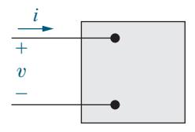

Figure 10.1 ▲ The black box representation of a circuit used for calculating power.

# 10.1 [Instantaneous Power](#page--1-0)

Consider the familiar circuit in Fig. 10.1. Here, *v* and *i* are steady-state sinusoidal signals, given by

$$v = V_m \cos(\omega t + \theta_v),$$

$$i = I_m \cos(\omega t + \theta_i),$$

where *v θ* is the voltage phase angle and *i θ* is the current phase angle. Using the passive sign convention, we find that the power at any instant of time is

$$p = vi.$$

This is **instantaneous power**. Instantaneous power is measured in watts when the voltage is in volts and the current is in amperes.

Because the circuit operates in the sinusoidal steady state, we can choose any convenient reference for zero time. It is convenient to define zero time at the instant the current passes through a positive maximum. This reference system requires a shift of both the voltage and current by .*i θ* Thus, the equations for voltage and current become

$$v = V_m \cos(\omega t + \theta_v - \theta_i), \tag{10.1}$$

$$i = I_m \cos \omega t. \tag{10.2}$$

When we substitute Eqs. 10.1 and 10.2 into the power equation, the expression for the instantaneous power becomes

$$p = V_m I_m \cos(\omega t + \theta_v - \theta_i) \cos \omega t.$$

We could use this equation directly to find the average power. Instead, we use a couple of trigonometric identities to construct a much more informative expression. We begin with the trigonometric identity1

$$\cos \alpha \cos \beta = \frac{1}{2} \cos(\alpha - \beta) + \frac{1}{2} \cos(\alpha + \beta)$$

and let *v t α ω i* = + *θ θ* − and *β ω* = *t* to give

$$p = \frac{V_m I_m}{2} \cos(\theta_v - \theta_i) + \frac{V_m I_m}{2} \cos(2\omega t + \theta_v - \theta_i).$$

Now use the trigonometric identity

$$\cos(\alpha + \beta) = \cos\alpha\cos\beta - \sin\alpha\sin\beta$$

to expand the second term on the right-hand side of the expression for *p*, which gives

# INSTANTANEOUS POWER

$$p = \frac{V_m I_m}{2} \cos(\theta_v - \theta_i) + \frac{V_m I_m}{2} \cos(\theta_v - \theta_i) \cos 2\omega t - \frac{V_m I_m}{2} \sin(\theta_v - \theta_i) \sin 2\omega t.$$
(10.3)

1 See Appendix F.

Examine the three terms on the right-hand side of Eq. 10.3. The first term is a constant; it is not a function of time. The other two terms are sinusoids, each with a frequency that is double the frequency of the voltage and current in Eqs. 10.1 and 10.2. You can make these same observations in the plot of Fig. 10.2, which depicts *v* , *i*, and *p*, assuming *θv* = 60° and 0°. *i θ* = You can see that the frequency of the instantaneous power is twice the frequency of the voltage or current. Therefore, the instantaneous power goes through two complete cycles for every cycle of either the voltage or the current.

Also note that the instantaneous power may be negative for a portion of each cycle. When the power is negative, the energy stored in the inductors or capacitors is being extracted. The instantaneous power varies with time when a circuit operates in the sinusoidal steady state. As a result, some motor-driven appliances (such as refrigerators) experience vibration and require resilient motor mountings to prevent excessive vibration.

In the next section, we use Eq. 10.3 to find the average power at the terminals of the circuit in [Fig. 10.1](#page-2-0) and also introduce the concept of reactive power.

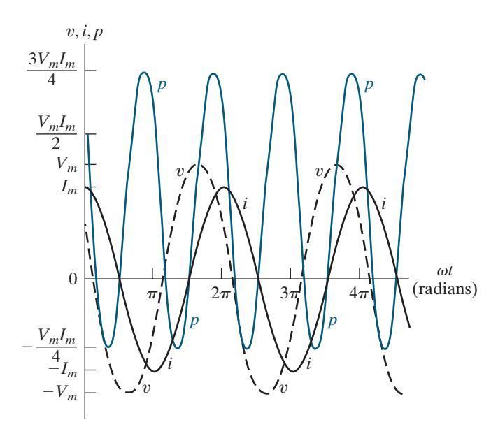

Figure 10.2 ▲ Instantaneous power, voltage, and current versus *ωt* for steady-state sinusoidal operation.

# 10.2 [Average and Reactive Power](#page--1-0)

As we have already noted, Eq. 10.3 has three terms, which we can rewrite as follows:

$$p = P + P\cos 2\omega t - Q\sin 2\omega t, \tag{10.4}$$

where

# AVERAGE (REAL) POWER

$$P = \frac{V_m I_m}{2} \cos(\theta_v - \theta_i), \tag{10.5}$$

# REACTIVE POWER

$$Q = \frac{V_m I_m}{2} \sin(\theta_v - \theta_i). \tag{10.6}$$

*P* is the **average power**, and *Q* is the **reactive power**. Average power is sometimes called **real power** because it describes the power in a circuit that is transformed from electric to nonelectric energy. Although the two terms are interchangeable, we primarily use the term *average power* in this text.

It is easy to see why *P* is called the average power: it is the average of the instantaneous power over one period. In equation form,

$$P = \frac{1}{T} \int_{t_0}^{t_0+T} p \, dt, \tag{10.7}$$

where *T* is the period of the sinusoidal function. The limits on the integral imply that we can initiate the integration process at any convenient time *t* 0 but that we must terminate the integration exactly one period later. (We could integrate over *nT* periods, where *n* is an integer, provided we multiply the integral by 1 . *nT* )

We could find the average power by substituting Eq. 10.3 directly into Eq. 10.7 and integrating. But the average value of *p* is given by the first term on the right-hand side of Eq. 10.3 because the integral of both cos 2*ωt* and sin 2*ωt* over one period is zero. Thus, the average power is given in Eq. 10.5.

We can develop a better understanding of all the terms in Eq. 10.4 and the relationships among them by examining the power in circuits that are purely resistive, purely inductive, or purely capacitive.

# Power for Purely Resistive Circuits

If the circuit between the terminals in [Fig. 10.1](#page-2-0) is purely resistive, the voltage and current are in phase, which means that *v θ θ* = .*i* Equation 10.4 then reduces to

$$p = P + P\cos 2\omega t.$$

The instantaneous power for a resistor is called the **instantaneous real power**. Figure 10.3 shows a graph of *p* for a purely resistive circuit with *ω* = 377 rad s. By definition, the average power, *P*, is the average of *p* over one period. Looking at the graph, we see that *P* = 1 for this circuit. Note that the instantaneous real power can never be negative, which is seen in its equation and is also shown in Fig. 10.3. In other words, power cannot be extracted from a purely resistive network. Resistors dissipate electric energy in the form of thermal energy.

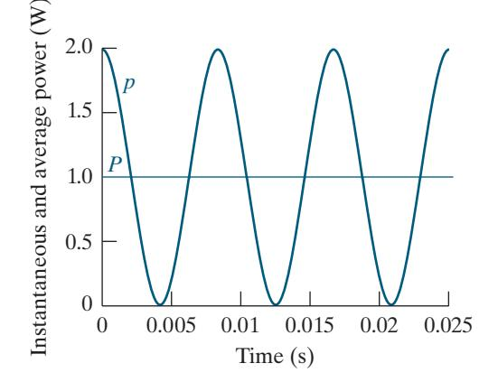

Figure 10.3 ▲ Instantaneous power and average power for a purely resistive circuit.

# Power for Purely Inductive Circuits

If the circuit between the terminals in [Fig. 10.1](#page-2-0) is purely inductive, the current lags the voltage by 90° (that is, *v* 90° *i θ θ* = − ); therefore, 90°. *i θ θ v* − = + The expression for the instantaneous power then reduces to

$$p = -Q\sin 2\omega t.$$

In a purely inductive circuit, the average power is zero, and energy is not transformed from electric to nonelectric form. Instead, the instantaneous power in a purely inductive circuit is continually exchanged between the circuit and the source driving the circuit, at a frequency of 2 . *ω* When *p* is positive, energy is stored in the magnetic fields associated with the inductive elements, and when *p* is negative, energy is extracted from the magnetic fields.

We measure the power of purely inductive circuits using the reactive power *Q*. The name *reactive power* recognizes an inductor as a reactive element; its impedance is purely reactive. Note that average power *P* and reactive power *Q* carry the same dimension. To distinguish between average and reactive power, we use the units *watt* (W) for average power and **var** (*volt-amp reactive,* or VAR) for reactive power. Figure 10.4 plots the instantaneous power for a purely inductive circuit, assuming *ω* = 377 rad s and *Q* = 1 VAR.

# Power for Purely Capacitive Circuits

If the circuit between the terminals in [Fig. 10.1](#page-2-0) is purely capacitive, the current leads the voltage by 90° (that is, *v θ θ* = + 90° *i* ); thus, *v θ θ* − = −90°. *i* The expression for the instantaneous power then becomes

$$p = -Q\sin 2\omega t.$$

Again, the average power is zero, and energy is not transformed from electric to nonelectric form. Instead, the power is continually exchanged between the source driving the circuit and the electric field associated with the capacitive elements. Figure 10.5 plots the instantaneous power for a purely capacitive circuit, assuming *ω* = 377 rad s and *Q* = −1 VAR.

Note that the decision to use the current as the reference (see Eq. 10.2) means that *Q* is positive for inductors (because *v* 90° *i θ θ* − = ) and negative for capacitors (because *v* 90° *i θ θ* − = − ). Power engineers recognize this difference in the algebraic sign of *Q* by saying that inductors demand (or absorb) magnetizing vars and capacitors furnish (or deliver) magnetizing vars. We say more about this convention later.

# The Power Factor

The angle *v i θ θ* − is used when computing both average and reactive power and is referred to as the **power factor angle**. The cosine of this angle is called the **power factor**, abbreviated pf, and the sine of this angle is called the **reactive factor**, abbreviated rf. Thus

POWER FACTOR

$$pf = cos(\theta_v - \theta_i), (10.8)$$

$$rf = \sin(\theta_v - \theta_i).$$

Even if you know the value of the power factor, you cannot determine the power factor angle because *v v* cos( ) cos( ). *i i θ θ* − = *θ θ* − To completely describe this angle, we use the phrases **lagging power factor** and **leading power factor**. Lagging power factor means that current lags voltage hence, an inductive load. Leading power factor means that current leads voltage—hence, a capacitive load. Both the power factor and the reactive factor are convenient quantities to use in describing electrical loads.

Example 10.1 illustrates the interpretation of *P* and *Q* using numerical calculations.

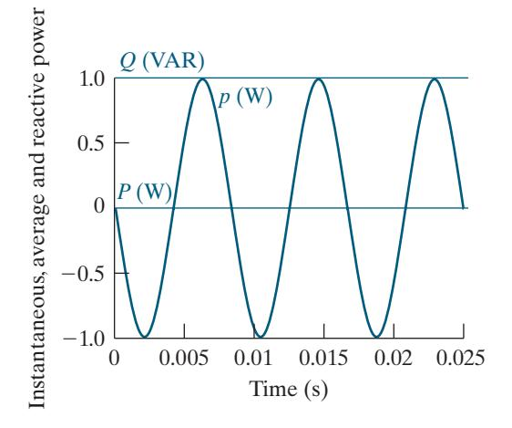

Figure 10.4 ▲ Instantaneous power, average power, and reactive power for a purely inductive circuit.

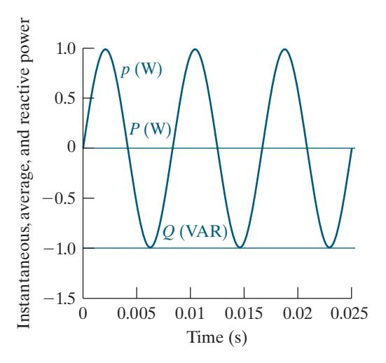

Figure 10.5 ▲ Instantaneous power, average power, and reactive power for a purely capacitive circuit.

# EXAMPLE 10.1 Calculating Average and Reactive Power

a) Calculate the average power and the reactive power at the terminals of the network shown in Fig. 10.6 if

$$v = 100\cos(\omega t + 15^{\circ}) \text{ V},$$

$$i = 4\sin(\omega t - 15^{\circ}) \text{ A}.$$

- b) State whether the network inside the box is absorbing or delivering average power.
- c) State whether the network inside the box is absorbing or supplying magnetizing vars.

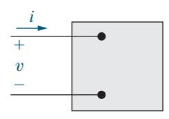

Figure 10.6 ▲ A pair of terminals used for calculating power.

# Solution

a) Because *i* is expressed in terms of the sine function, the first step in calculating *P* and *Q* is to rewrite *i* as a cosine function:

$$i = 4\cos(\omega t - 105^{\circ}) \text{ A}.$$

We now calculate *P* and *Q* directly from Eqs. 10.5 and 10.6, using the passive sign convention. Thus

$$P = \frac{1}{2}(100) (4) \cos[15^{\circ} - (-105^{\circ})] = -100 \text{ W},$$

$$Q = \frac{1}{2}100(4)\sin[15^{\circ} - (-105^{\circ})] = 173.21 \text{ VAR}.$$

- b) The value of *P* is negative, so the network inside the box is delivering average power to the terminals.
- c) The value of *Q* is positive, so the network inside the box is absorbing magnetizing vars at its terminals.

# ASSESSMENT PROBLEMS

Objective 1—Understand ac power concepts, their relationships to one another, and how to calcuate them in a circuit

10.1 The following sets of values for *v* and *i* pertain to the circuit shown in [Fig. 10.1.](#page-2-0) For each set of values, calculate *P* and *Q* and state whether the circuit inside the box is absorbing or delivering (1) average power and (2) magnetizing vars.

a) 
$$v = 100\cos(\omega t + 50^\circ) \text{ V},$$

$$i = 10\cos(\omega t + 15^{\circ}) \text{ A};$$

b) 
$$v = 40\cos(\omega t - 15^\circ) \text{ V}$$
,

$$i = 5\cos(\omega t + 60^{\circ}) \text{ A};$$

c) 
$$v = 400\cos(\omega t + 30^\circ) \text{ V},$$

$$i = 10\sin(\omega t + 240^{\circ}) \text{ A};$$
  
d)  $v = 200\sin(\omega t + 250^{\circ}) \text{ V},$ 

$$i = 5\cos(\omega t + 40^{\circ}) \text{ A}.$$

**Answer:** a) 
$$P = 409.58 \text{ W (abs)},$$

$$Q = 286.79 \text{ VAR (abs)};$$

*SELF-CHECK: Also try Chapter Problem 10.1.*

b) 
$$P = 25.88 \text{ W (abs)},$$

$$Q = -96.59 \text{ VAR (del)};$$
  
 $P = -1000 \text{ W (del)}$ 

c) 
$$P = -1000 \text{ W (del)}$$

$$Q = -1732.05 \text{ VAR (del)};$$

d) 
$$P = -250 \text{ W (del)},$$

$$Q = 433.01 \text{ VAR (abs)}.$$

10.2 For every pair of voltage and current values in Assessment Problem 10.1, compute the power factor and the reactive factor for the network inside the box in Fig. 10.6. (*Hint:* Use −*i* to calculate the power factor and reactive factor.)

**Answer:** a) pf = 
$$0.82$$
 lagging; rf =  $0.57$ ;

b) pf = 
$$0.26$$
 leading; rf =  $-0.97$ ;

c) pf = 
$$-0.5$$
 leading; rf =  $-0.87$ ;

d) pf = 
$$-0.5$$
 lagging; rf =  $0.87$ .

# Appliance Ratings

Average power is used to quantify the power needs of household appliances. Your monthly electric bill is based on the number of kilowatt-hours used by the household. Table 10.1 presents data for some common appliances, including the average hours per month and the number of months the appliance is used, the annual kilowatt-hour (kwh) consumption, and the annual cost of operation. For example, a coffee maker has a monthly use of 30 hours, or one hour per day, is used every month of the year, and consumes 60 kwh per year, at a cost of about \$10. Therefore, the coffee maker consumes 60 kwh 360 hours = = 0.167 kW 167 W of power during the hour it operates each day.

Example 10.2 uses Table 10.1 to determine whether four common appliances can all be in operation without exceeding the current-carrying capacity of the household.

TABLE 10.1 Annual Energy Requirements of Electric Household Appliances

| Appliance                                                     | Hours in Use per Month | Months Used | Annual kWH | Annual Cost |
|---------------------------------------------------------------|---------------------------|----------------|---------------|----------------|
| A/C—central                                                   | 120                       | 3              | 1080          | \$173          |
| Clothes dryer—electric                                        | 24                        | 12             | 901           | \$144          |
| Clothes washer (does not include cost of hot water)           | 28                        | 12             | 108           | \$17           |
| Coffee maker (residential)                                    | 30                        | 12             | 60            | \$10           |
| Computer—desktop with monitor                                 | *                         | *              | 127           | \$20           |
| Computer—laptop                                               | *                         | *              | 23            | \$4            |
| Dishwasher—heat dry (does not include hot water)              | 30                        | 12             | 293           | \$47           |
| DVD player                                                    | 60                        | 12             | 18            | \$3            |
| Fan—ceiling (does not include lights)                         | 150                       | 6              | 72            | \$12           |
| Fan—table/box/floor                                           | 60                        | 3              | 28            | \$4            |
| Game console (includes standby/phantom load)                  | *                         | *              | 65            | \$10           |
| Heating system—electric heat—baseboard, 10 ft                 | 240                       | 5              | 1500          | \$240          |
| Humidifier                                                    | 240                       | 12             | 360           | \$58           |
| Lighting—incandescent, 75 Watt                                | 60                        | 12             | 54            | \$9            |
| Lighting—CFL, 20 Watt (75 W incandescent equivalent)          | 90                        | 12             | 22            | \$3            |
| Lighting—LED, 10 Watt (75 W incandescent equivalent)          | 90                        | 12             | 12            | \$2            |
| Microwave                                                     | 9                         | 12             | 101           | \$16           |
| Oven—electric                                                 | 9                         | 12             | 284           | \$45           |
| Refrigerator—19–21.4 cu ft —2001–2008                         | 720                       | 12             | 533           | \$85           |
| Refrigerator—19–21.4 cu ft (new ENERGY STAR)                  | 720                       | 12             | 336           | \$54           |
| Set-top box, cable/satellite receiver                         | 720                       | 12             | 249           | \$40           |
| Television—50 ″+ non-ENERGY STAR TV                           | *                         | *              | 215           | \$34           |
| Water heater—electric (newer base model .95 energy factor) | n/a                       | 12             | 4559          | \$729          |

\* Draws power in standby mode

Notes:

• Hours in Use per Month is based on a typical four-person household in a northern U.S. state.

• Annual kWh may vary considerably depending on model, age, and use.

• Annual Cost is based on 16 cents per kilowatt hour (kWH).

• Data used with permission from <https://www.efficiencyvermont.com/tips-tools/tools/electric-usage-chart-tool>

# EXAMPLE 10.2 Making Power Calculations Involving Household Appliances

The branch circuit supplying the outlets in a typical home kitchen is wired with #12 conductor and is protected by either a 20 A fuse or a 20 A circuit breaker. Assume that the following 120 V appliances are in operation at the same time: a coffee maker, microwave, dishwasher, and older refrigerator. Will the circuit be interrupted by the protective device?

# Solution

We have already estimated that the average power used by the coffee maker is 167 W. Using [Table 10.1,](#page-7-0) we find that the average power used by the other three appliances is

$$P_{\text{microwave}} = \frac{101}{(9)(12)} = 0.935 \text{ kW} = 935 \text{ W},$$

$$P_{\text{dishwasher}} = \frac{293}{(30)(12)} = 0.814 \text{ kW} = 814 \text{ W},$$

$$P_{\text{refrigerator}} = \frac{533}{(720)(12)} = 0.062 \text{ kW} = 62 \text{ W}.$$

The total average power used by the four appliances is

$$P_{\text{total}} = 167 + 935 + 814 + 62 = 1978 \text{ W}.$$

The total current in the protective device is

$$I = \frac{P_{\text{total}}}{V} = \frac{1978}{120} = 16.5 \text{ A}.$$

Since the current is less than 20 A, the protective device will not interrupt the circuit.

*SELF-CHECK: Assess your understanding of this material by trying Chapter Problem 10.3.*

# 1 2 *Vm* cos(v*t* 1 uv) *R*

Figure 10.7 ▲ A sinusoidal voltage applied to the terminals of a resistor.

# 10.3 [The RMS Value and Power](#page--1-0) [Calculations](#page--1-0)

When we introduced the rms value of a sinusoidal voltage (or current) in Section 9.1, we mentioned that it would play an important role in power calculations. We now discuss this role.

Assume a sinusoidal voltage is applied to the terminals of a resistor, as shown in Fig. 10.7, and that we want to determine the average power delivered to the resistor. From Eq. 10.7,

$$P = \frac{1}{T} \int_{t_0}^{t_0+T} \frac{V_m^2 \cos^2(\omega t + \phi_v)}{R} dt$$
$$= \frac{1}{R} \left[ \frac{1}{T} \int_{t_0}^{t_0+T} V_m^2 \cos^2(\omega t + \phi_v) dt \right].$$

From Eq. 9.4, we see that the bracketed term is the rms value of the voltage squared. Therefore, the average power delivered to *R* is

$$P = \frac{V_{\rm rms}^2}{R}.$$

If the resistor has a sinusoidal current, say, *I t m i* cos , ( ) *ω φ* + the average power delivered to the resistor is

$$P = I_{\rm rms}^2 R.$$

The rms value is also referred to as the **effective value** of the sinusoidal voltage (or current). The rms value has an interesting property: Given an equivalent resistive load, *R*, and an equivalent time period, *T*, the rms value of a sinusoidal source delivers the same energy to *R* as does a dc source of the same value. For example, a dc source of 100 V delivers the same energy in *T* seconds that a sinusoidal source of 100 V(rms) delivers, assuming equivalent load resistances (see Problem 10.11). Figure 10.8 demonstrates this equivalence. The effect of the two sources is identical with respect to energy delivery. So we use the terms *effective value* and *rms value* interchangeably.

The average power given by Eq. 10.5 and the reactive power given by Eq. 10.6 can be written in terms of effective values:

$$P = \frac{V_m I_m}{2} \cos(\theta_v - \theta_i)$$

$$= \frac{V_m}{\sqrt{2}} \frac{I_m}{\sqrt{2}} \cos(\theta_v - \theta_i)$$

$$= V_{\text{rms}} I_{\text{rms}} \cos(\theta_v - \theta_i)$$
(10.9)

and, by similar manipulation,

$$Q = V_{\rm rms} I_{\rm rms} \sin(\theta_v - \theta_i). \tag{10.10}$$

Using the effective values of sinusoidal signals in power calculations is so widespread that we specify the voltage and current ratings of circuits and equipment using rms values. For example, the voltage rating of residential electric wiring is often 240 V 120 V service. These voltages are the rms values of the sinusoidal voltages supplied by the utility company, which provides power at two voltage levels, accommodating low-voltage appliances (such as televisions) and higher-voltage appliances (such as electric ranges). Appliances such as electric lamps, irons, and toasters all carry rms ratings on their nameplates. For example, a 120 V, 100 W lamp has a resistance of 120 100, 2 or 144 , Ω and draws an rms current of 120 144, or 0.833 A. The peak value of the lamp current is 0.833 2, or 1.18 A.

The phasor transform of a sinusoidal function may also be expressed as an rms value. The magnitude of the rms phasor is equal to the rms value of the sinusoidal function. We indicate that a phasor is based on an rms value using either an explicit statement, a parenthetical "rms" adjacent to the phasor's units, or the subscript "rms."

In Example 10.3, we use rms values to calculate power.

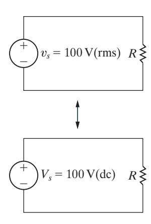

Figure 10.8 ▲ The effective value of *vs* [100 V(rms)] delivers the same power to *R* as the dc voltage *Vs* [100 V(dc)].

# EXAMPLE 10.3 Determining Average Power Delivered to a Resistor by a Sinusoidal Voltage

- a) A sinusoidal voltage having a maximum amplitude of 625 V is applied to the terminals of a 50 Ω resistor. Find the average power delivered to the resistor.
- b) Repeat (a) by first finding the current in the resistor.

# Solution

a) The rms value of the sinusoidal voltage is 625 2 , or approximately 441.94 V. The average power delivered to the 50 Ω resistor is

$$P = \frac{V_{\text{rms}}^2}{R} = \frac{(441.94)^2}{50} = 3906.25 \text{ W}.$$

b) The maximum amplitude of the current in the resistor is 625 50, or 12.5 A. The rms value of the current is 12.5 2 , or approximately 8.84 A. Hence, the average power delivered to the resistor is

$$P = (8.84)^2 \, 50 = 3906.25 \, \text{W}.$$

# ASSESSMENT PROBLEM

Objective 1—Understand ac power concepts, their relationships to one another, and how to calculate them in a circuit

10.3 The periodic triangular current in Example 9.4, repeated here, has a peak value of 240 mA. Find the average power that this current delivers to a 1 kΩ resistor.

Answer: 19.2 W.

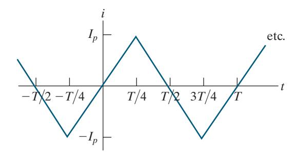

*SELF-CHECK: Also try Chapter Problem 10.16.*

# 10.4 [Complex Power](#page--1-0)

Before discussing the methods for calculating real and reactive power in circuits operating in the sinusoidal steady state, we introduce and define complex power. **Complex power** is the complex sum of real power and reactive power, or

# COMPLEX POWER

$$S = P + jQ. (10.11)$$

As you will see, we can compute the complex power using the voltage and current phasors for a circuit. Equation 10.11 can then be used to determine the average and reactive power, because *P S* = R{ } and *Q S* = I { }.

Complex power has the same units as average or reactive power. However, to distinguish complex power from both average and reactive power, we use the units **volt-amps** (VA). Thus, we use volt-amps for complex power, watts for average power, and vars for reactive power, as summarized in Table 10.2.

Complex power provides a geometric relationship among several different power quantities. In Eq. 10.11, envision *P*, *Q*, and *S* as the sides of a right triangle, as shown in Fig. 10.9. We can show that the angle *θ* in the power triangle is the power factor angle *v* .*i θ θ* − For the right triangle shown in Fig. 10.9,

$$\tan\theta = \frac{Q}{P} .$$

But from the definitions of *P* and *Q* (Eqs. 10.5 and 10.6, respectively),

$$\frac{Q}{P} = \frac{(V_m I_m/2)\sin(\theta_v - \theta_i)}{(V_m I_m/2)\cos(\theta_v - \theta_i)}$$
$$= \tan(\theta_v - \theta_i).$$

Therefore, *v* .*i θ θ* = − *θ* The geometric relationships for a right triangle mean that the four power triangle dimensions (the three sides and the power factor angle) can be determined if any two of the four are known.

The magnitude of complex power is referred to as **apparent power**. Specifically,

APPARENT POWER 
$$|S| = \sqrt{P^2 + Q^2}. \tag{10.12}$$

Apparent power, like complex power, is measured in volt-amps. The apparent power, or volt-amp, requirement of a device designed to convert electric energy to a nonelectric form is more useful than the average power requirement. The apparent power represents the volt-amp capacity required to supply the average power used by the device. As you can see from the power triangle in Fig. 10.9, unless the power factor angle is 0° (that is, the device is purely resistive, pf = 1, and *Q* = 0), the volt-amp capacity required by the device is larger than the average power used by the device.

Many appliances (including refrigerators, fans, air conditioners, fluorescent lighting fixtures, and washing machines) and most industrial loads operate at a lagging power factor. The power factor of these loads can be *corrected* either by adding a capacitor to the device itself or by connecting capacitors across the line feeding the load; the latter method is often used for large industrial loads. Many of the problems at the end of the chapter explore methods for correcting a lagging power factor load and improving the operation of a circuit.

Example 10.4 uses a power triangle to calculate several quantities associated with power in an electrical load.

# EXAMPLE 10.4 Calculating Complex Power

An electrical load operates at 240 V(rms). The load absorbs an average power of 8 kW at a lagging power factor of 0.8.

- a) Calculate the complex power of the load.
- b) Calculate the impedance of the load, *Z*.

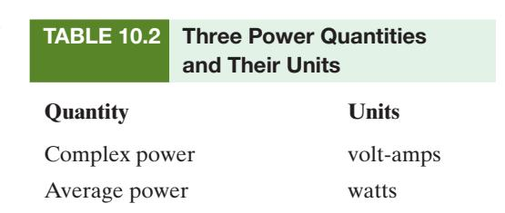

Reactive power var

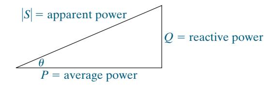

Figure 10.9 ▲ A power triangle.

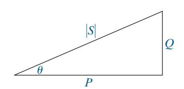

Figure 10.10 ▲ A power triangle.

# Solution

a) Because the power factor is lagging, we know that the load is inductive and that the algebraic sign of the reactive power is positive. From the power triangle shown in [Fig. 10.10,](#page-11-0)

$$P = |S| \cos \theta,$$

$$Q = |S| \sin \theta.$$

Since cos *θ* = 0.8, we know that sin *θ* = 0.6. Therefore

$$|S| = \frac{P}{\cos \theta} = \frac{8000}{0.8} = 10,000 = 10 \text{ kVA},$$

$$Q = |S| \sin \theta = (10,000)(0.6) = 6 \text{ kvar},$$

and

$$S = P + jQ = 8 + j6 \text{ kVA}.$$

b) From the problem statement, we know that *P* = 8 kW for the load. Using Eq. 10.9,

$$P = V_{\text{rms}} I_{\text{rms}} \cos(\theta_v - \theta_i)$$
$$= (240) I_{\text{rms}} (0.8)$$
$$= 8000 \text{ W}.$$

Solving for *I* , rms

$$I_{\rm rms} = 41.67 \, {\rm A(rms)}.$$

We already know the angle of the load impedance because it is the power factor angle:

$$\theta = \cos^{-1}(0.8) = 36.87^{\circ}.$$

We also know that *θ* is positive because the power factor is lagging, indicating an inductive load. Compute the load impedance magnitude using its definition as the ratio of the magnitude of the load voltage to the magnitude of the load current:

$$|Z| = \frac{|V_{\rm rms}|}{|I_{\rm rms}|} = \frac{240}{41.67} = 5.76.$$

Hence,

$$Z = 5.76 / 36.87^{\circ} \Omega = 4.608 + j3.456 \Omega$$

# ASSESSMENT PROBLEM

Objective 1—Understand ac power concepts, their relationships to one another, and how to calculate them in a circuit

- 10.4 For the circuit shown in the figure, the source voltage *vg* is 150 cos 250*t* V. Find
  - a) the average power absorbed by the load,
  - b) the reactive power absorbed by the load,
  - c) the apparent power absorbed by the load, and
  - d) the power factor of the load.

- Answer: a) 180 W;
  - b) 90 VAR;
  - c) 201.25 VA;
  - d) 0.89 lagging.

*SELF-CHECK: Also try Chapter Problem 10.18.*

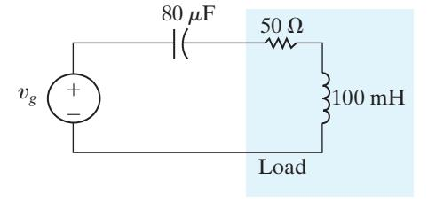

# 10.5 [Power Calculations](#page--1-0)

We now develop additional equations for calculating real, reactive, and complex power. We begin by combining Eqs. 10.5, 10.6, and 10.11 to get

$$S = \frac{V_m I_m}{2} \cos(\theta_v - \theta_i) + j \frac{V_m I_m}{2} \sin(\theta_v - \theta_i)$$

$$= \frac{V_m I_m}{2} \left[ \cos(\theta_v - \theta_i) + j \sin(\theta_v - \theta_i) \right]$$

$$= \frac{V_m I_m}{2} e^{j(\theta_v - \theta_i)} = \frac{1}{2} V_m I_m / (\theta_v - \theta_i).$$

If we use the rms values of the sinusoidal voltage and current, the expression for the complex power becomes

$$S = V_{\rm rms} I_{\rm rms} / (\theta_v - \theta_i).$$

Therefore, if the phasor current and voltage are known at a pair of terminals, the complex power associated with that pair of terminals is either one half the product of the phasor voltage and the conjugate of the phasor current, or the product of the rms phasor voltage and the conjugate of the rms phasor current. We can show this for the rms phasor voltage and current in Fig. 10.11 as follows:

$$\begin{split} S &= V_{\rm rms} I_{\rm rms} \underline{/(\theta_v - \theta_i)} \\ &= V_{\rm rms} I_{\rm rms} e^{j(\theta_v - \theta_i)} \\ &= V_{\rm rms} \ e^{j\theta_v} I_{\rm rms} e^{-j\theta_i} \end{split}$$

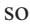

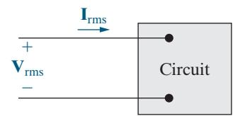

Figure 10.11 ▲ The phasor voltage and current associated with a pair of terminals.

# COMPLEX POWER, ALTERNATE FORM

$$S = \mathbf{V}_{\rm rms} \mathbf{I}_{\rm rms}^*. \tag{10.13}$$

Note that **I** *I e j* rms \* rms = *i* − *θ* follows from Euler's identity and the trigonometric identities cos c ( ) − = *θ θ* os( ) and sin s ( ) − = *θ θ* − in( ):

$$\begin{split} \boldsymbol{I}_{\text{rms}} e^{-j\theta_i} &= \boldsymbol{I}_{\text{rms}} \cos(-\theta_i) + j \boldsymbol{I}_{\text{rms}} \sin(-\theta_i) \\ &= \boldsymbol{I}_{\text{rms}} \cos(\theta_i) - j \boldsymbol{I}_{\text{rms}} \sin(\theta_i) \\ &= \boldsymbol{I}_{\text{rms}}^*. \end{split}$$

If the voltage and current phasors are not specified as rms values, the derivation technique used for Eq. 10.13 yields

$$S = \frac{1}{2}\mathbf{V}\mathbf{I}^*. \tag{10.14}$$

Both Eqs. 10.13 and 10.14 use the passive sign convention. If the current reference is in the direction of the voltage rise across the terminals, we insert a minus sign on the right-hand side of each equation.

Example 10.5 uses Eq. 10.14 in a power calculation, with the phasor representation of the voltage and current from Example 10.1.

# EXAMPLE 10.5 Calculating Power Using Phasor Voltage and Current

a) Calculate the average power and the reactive power at the terminals of the network shown in Fig. 10.12 if

$$\mathbf{V} = 100 \underline{/15^{\circ}} \, \mathrm{V},$$

$$I = 4/-105^{\circ} A.$$

b) State whether the network inside the box is absorbing or delivering average power.

c) State whether the network inside the box is absorbing or supplying magnetizing vars.

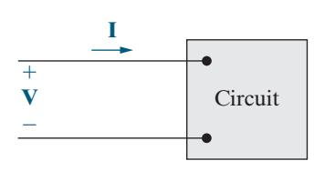

Figure 10.12 ▲ The circuit for Example 10.5.

# Solution

a) From Eq. 10.14,

$$S = \frac{1}{2}(100 \ /15^{\circ})(4 \ /+105^{\circ}) = 200 \ /120^{\circ}$$
$$= -100 + j173.21 \text{ VA}.$$

Once we calculate the complex power, we can read off both the real and reactive powers, because *S P* = + *jQ*. Thus

$$P = -100 \text{ W},$$
  
 $Q = 173.21 \text{ var.}$ 

- b) The value of *P* is negative, so the network inside the box is delivering average power to the terminals.
- c) The value of *Q* is positive, so the network inside the box is absorbing magnetizing vars at its terminals.

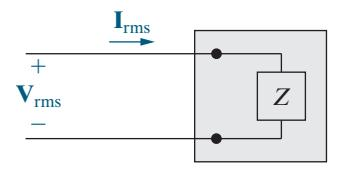

Figure 10.13 ▲ The general circuit of [Fig. 10.11](#page-13-0)  replaced with an equivalent impedance.

# Alternate Forms for Complex Power

Equations 10.13 and 10.14 have several useful variations. We use the rms form of the equations throughout because voltages and currents are most often given as rms values in power computations.

The first variation of Eq. 10.13 replaces the voltage with the product of the current times the impedance. We can always represent the circuit inside the box of [Fig. 10.11](#page-13-0) by an equivalent impedance, as shown in Fig. 10.13. Then,

$$\mathbf{V}_{\mathrm{rms}} = Z\mathbf{I}_{\mathrm{rms}}.$$

Replacing the rms voltage phasor in Eq. 10.13 yields

$$S = Z \mathbf{I}_{rms} \mathbf{I}_{rms}^*$$

$$= |\mathbf{I}_{rms}|^2 Z$$

$$= |\mathbf{I}_{rms}|^2 (R + jX)$$

$$= |\mathbf{I}_{rms}|^2 R + j|\mathbf{I}_{rms}|^2 X = P + jQ,$$
(10.15)

from which

$$P = |\mathbf{I}_{\rm rms}|^2 R = \frac{1}{2} I_m^2 R, \tag{10.16}$$

$$Q = |\mathbf{I}_{\rm rms}|^2 X = \frac{1}{2} I_m^2 X. \tag{10.17}$$

In Eqs. 10.15 and 10.17, *X* is the reactance of either the equivalent inductance or the equivalent capacitance of the circuit. Remember that reactance is positive for inductive circuits and negative for capacitive circuits.

A second variation of Eq. 10.13 replaces the current with the voltage divided by the impedance:

$$S = \mathbf{V}_{\text{rms}} \left( \frac{\mathbf{V}_{\text{rms}}}{Z} \right)^* = \frac{|\mathbf{V}_{\text{rms}}|^2}{Z^*} = P + jQ. \tag{10.18}$$

Note that if *Z* is a pure resistive element,

$$P = \frac{|\mathbf{V}_{\rm rms}|^2}{R},\tag{10.19}$$

and if *Z* is a pure reactive element,

$$Q = \frac{|\mathbf{V}_{\rm rms}|^2}{X} \ . \tag{10.20}$$

In Eq. 10.20, *X* is positive for an inductor and negative for a capacitor.

Examples 10.6–10.8 demonstrate various power calculations in circuits operating in the sinusoidal steady state.

# EXAMPLE 10.6 Calculating Average and Reactive Power

In the circuit shown in Fig. 10.14, a load having an impedance of 39 26 + Ω *j* is fed from a voltage source through a line having an impedance of 1 4 + Ω *j* . The source voltage is 250 V(rms).

- a) Calculate the load current phasor **I** L and voltage phasor **V** . L
- b) Calculate the average and reactive power delivered to the load.
- c) Calculate the average and reactive power delivered to the line.
- d) Calculate the average and reactive power supplied by the source.

# Solution

a) The line and load impedances are in series across the voltage source, so the load current equals the voltage divided by the total impedance, or

$$\mathbf{I}_{L} = \frac{250 / 0^{\circ}}{40 + j30} = 4 - j3 = 5 / -36.87^{\circ} \text{ A(rms)}.$$

Because the voltage is given as an rms value, the current value is also rms. The load voltage is the product of the load current and load impedance:

$$\mathbf{V}_{L} = (39 + j26)\mathbf{I}_{L} = 234 - j13$$
  
= 234.36  $\angle -3.18^{\circ}$  V(rms).

b) Use Eq. 10.13 to find the average and reactive power delivered to the load. Therefore

$$S = \mathbf{V}_{L} \mathbf{I}_{L}^{*} = (234 - j13)(4 + j3)$$
  
= 975 + j650 VA.

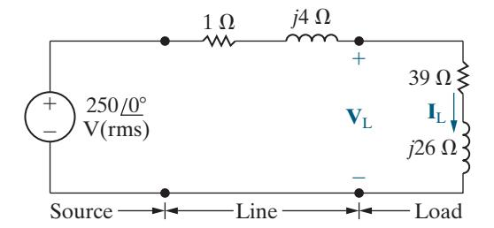

Figure 10.14 ▲ The circuit for Example 10.6.

Thus, the load is absorbing an average power of 975 W and a reactive power of 650 var.

c) Because the line current is known, the average and reactive power delivered to the line are most easily calculated using Eqs. 10.16 and 10.17. Thus

$$P = (5)^2 (1) = 25 \text{ W},$$

$$Q = (5)^2 (4) = 100 \text{ var.}$$

Note that the reactive power associated with the line is positive because the line reactance is inductive.

d) We can calculate the average and reactive power delivered by the source by adding the complex power delivered to the line to that delivered to the load, or

$$S = 25 + j100 + 975 + j650$$
$$= 1000 + j750 \text{ VA}.$$

The complex power at the source can also be calculated from Eq. 10.13:

$$S_s = -250 \mathbf{I}_{\mathrm{L}}^*.$$

The minus sign is inserted in Eq. 10.13 whenever the current reference is in the direction of a voltage rise. Thus

$$S_s = -250(4 + j3) = -(1000 + j750) \text{ VA}.$$

The minus sign implies that both average power and magnetizing reactive power are being delivered by the source. This result agrees with the previous calculation of *S*, as it must, because the source supplies all the average and reactive power absorbed by the line and load. Source Line Load

# EXAMPLE 10.7 Calculating Power in Parallel Loads

The two loads in the circuit shown in Fig. 10.15 can be described as follows: Load 1 absorbs 8 kW at a leading power factor of 0.8. Load 2 absorbs 20 kVA at a lagging power factor of 0.6.

- a) Determine the power factor of the two loads in parallel.
- b) Determine the apparent power required to supply the loads, the magnitude of the current, **I***s*, and the average power loss in the transmission line.
- c) Given that the frequency of the source is 60 Hz, compute the value of the capacitor that would correct the power factor to 1 if placed in parallel with the two loads. Recalculate the values in (b) for the load with the corrected power factor.

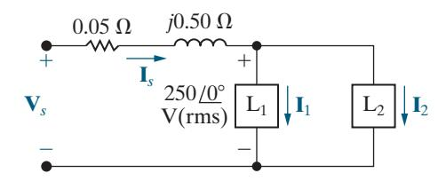

Figure 10.15 ▲ The circuit for Example 10.7.

# Solution

a) All voltage and current phasors in this problem are rms values. Note from the circuit diagram in Fig. 10.15 that **I I** = + **I** . *s* 1 2 The total complex power absorbed by the two loads is

$$S = (250)\mathbf{I}_{s}^{*}$$

$$= (250)(\mathbf{I}_{1} + \mathbf{I}_{2})^{*}$$

$$= (250)\mathbf{I}_{1}^{*} + (250)\mathbf{I}_{2}^{*}$$

$$= S_{1} + S_{2}.$$

We can sum the complex powers geometrically, using the power triangles for each load, as shown in Fig. 10.16. From the problem statement,

$$S_1 = 8000 - j \frac{8000(.6)}{(.8)}$$
  
=  $8000 - j6000 \text{ VA},$   
 $S_2 = 20,000(.6) + j 20,000(.8)$   
=  $12,000 + j16,000 \text{ VA}.$ 

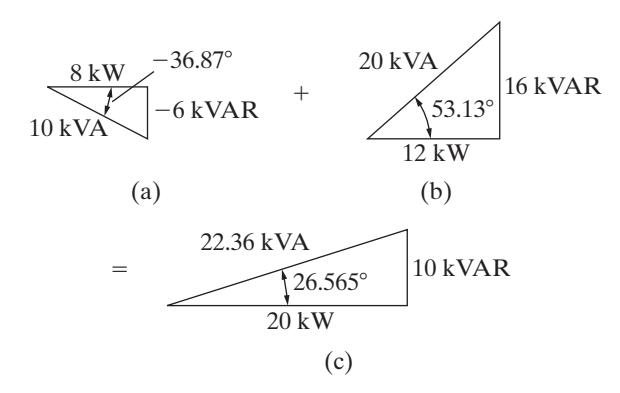

Figure 10.16 ▲ (a) The power triangle for load 1; (b) The power triangle for load 2; (c) The sum of the power triangles.

It follows that

$$S = 20,000 + j10,000 \text{ VA},$$

and

$$\mathbf{I}_{s}^{*} = \frac{20,000 + j10,000}{250} = 80 + j40 \text{ A(rms)}.$$

Therefore

$$I_s = 80 - j40 = 89.44 / -26.57^{\circ} A(rms).$$

Thus, the power factor of the combined load is

$$pf = cos(0 + 26.57^{\circ}) = 0.8944 lagging.$$

The power factor of the two loads in parallel is lagging because the net reactive power is positive.

b) The apparent power supplied to the two loads is

$$|S| = |20,000 + j10,000| = 22.36 \text{ kVA}.$$

The magnitude of the current supplying this apparent power is

$$|\mathbf{I}_{s}| = |80 - j40| = 89.44 \text{ A(rms)}.$$

The average power lost in the line results from the current in the line resistance:

$$P_{\text{line}} = |\mathbf{I}_s|^2 R = (89.44)^2 (0.05) = 400 \text{ W}.$$

Note that the power supplied totals 20, 000 400 20 + = , 400 W, even though the loads require a total of only 20,000 W.

c) As we can see from the power triangle in [Fig. 10.16\(](#page-16-0)c), we can correct the power factor to 1 if we place a capacitor in parallel with the existing loads that supplies 10 kVAR of magnetizing reactive power. The value of the capacitor is calculated as follows. First, find the capacitive reactance from Eq. 10.20:

$$X = \frac{|V_{\text{rms}}|^2}{Q}$$
$$= \frac{(250)^2}{-10,000}$$
$$= -6.25 \Omega.$$

Recall that the reactive impedance of a capacitor is −1 , *ωC* and *ω π* = = 2 6( ) 0 376.99 rad s, because the source frequency is 60 Hz. Thus,

$$C = \frac{-1}{\omega X} = \frac{-1}{(376.99)(-6.25)} = 424.4 \ \mu\text{F}.$$

Adding the capacitor as the third load is represented in geometric form as the sum of the two power triangles shown in Fig. 10.17. When the power factor is 1, the apparent power and the average power are the same, as seen from the power triangle in Fig. 10.17(c). Therefore, once the power factor has been corrected, the apparent power is

$$|S| = P = 20 \text{ kVA}.$$

$$\begin{array}{c|ccccccccccccccccccccccccccccccccccc$$

Figure 10.17 ▲ (a) The sum of the power triangles for loads 1 and 2; (b) The power triangle for a 424.4 *μ*F capacitor at 60 Hz; (c) The sum of the power triangles in (a) and (b).

The magnitude of the current that supplies this apparent power is

$$|\mathbf{I}_{\rm s}| = \frac{20,000}{250} = 80 \text{ A(rms)}.$$

The average power lost in the line is thus reduced to

$$P_{\text{line}} = |\mathbf{I}_s|^2 R = (80)^2 (0.05) = 320 \text{ W}.$$

Now, the power supplied totals

$$20,000 + 320 = 20,320 \text{ W}.$$

Note that the addition of the capacitor has reduced the line loss by 20%, from 400 W to 320 W.

# EXAMPLE 10.8 Balancing Power Delivered with Power Absorbed in an AC Circuit

a) Calculate the total average and reactive power delivered to each impedance in the circuit shown in Fig. 10.18.

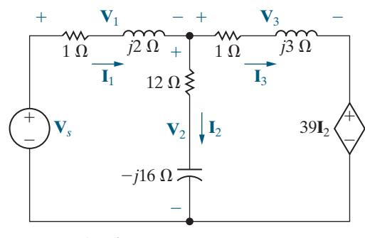

$$\mathbf{V}_s = 150 \, \underline{/0^{\circ}} \, \mathrm{V}$$

$$\mathbf{V}_1 = (78 - i104) \,\mathrm{V}$$

$$\mathbf{V}_1 = (78 - j104) \,\mathrm{V} \qquad \mathbf{I}_1 = (-26 - j52) \,\mathrm{A}$$

$$\mathbf{V}_2 = (72 + j104) \,\mathrm{V}$$

$$\mathbf{I}_2 = (-2 + j6) \mathbf{A}$$

$$\mathbf{V}_3 = (150 - j130) \,\mathrm{V}$$

$$I_3 = (-24 - j58) A$$

Figure 10.18 ▲ The circuit, with solution, for Example 10.8.

- b) Calculate the average and reactive powers associated with each source in the circuit.
- c) Verify that the average power delivered equals the average power absorbed and that the magnetizing reactive power delivered equals the magnetizing reactive power absorbed.

# Solution

a) The complex power delivered to the ( ) 1 2 + Ω *j* impedance is

$$S_1 = \frac{1}{2} \mathbf{V}_1 \mathbf{I}_1^* = P_1 + jQ_1$$

$$= \frac{1}{2} (78 - j104)(-26 + j52)$$

$$= \frac{1}{2} (3380 + j6760)$$

$$= 1690 + j3380 \text{ VA}.$$

Thus, this impedance is absorbing an average power of 1690 W and a reactive power of 3380 VAR. The complex power delivered to the ( ) 12 16 − Ω *j* impedance is

$$S_2 = \frac{1}{2} \mathbf{V}_2 \mathbf{I}_2^* = P_2 + jQ_2$$
  
=  $\frac{1}{2} (72 + j104)(-2 - j6)$   
=  $240 - j320 \text{ VA}.$ 

Therefore, the impedance in the vertical branch is absorbing 240 W and delivering 320 VAR. The complex power delivered to the ( ) 1 3 + Ω *j* impedance is

$$S_3 = \frac{1}{2} \mathbf{V}_3 \mathbf{I}_3^* = P_3 + jQ_3$$
$$= \frac{1}{2} (150 - j130)(-24 + j58)$$
$$= 1970 + j5910 \text{ VA}.$$

This impedance is absorbing 1970 W and 5910 VAR.

b) The complex power associated with the independent voltage source is

$$S_s = -\frac{1}{2} \mathbf{V}_s \mathbf{I}_1^* = P_s + jQ_s$$
  
=  $-\frac{1}{2} (150)(-26 + j52)$   
=  $1950 - j3900 \text{ VA}.$ 

Note that the independent voltage source is absorbing an average power of 1950 W and delivering 3900 VAR. The complex power associated with the current-controlled voltage source is

$$S_x = \frac{1}{2}(39\mathbf{I}_2)(\mathbf{I}_3^*) = P_x + jQ_x$$
$$= \frac{1}{2}(-78 + j234)(-24 + j58)$$
$$= -5850 - j5070 \text{ VA}.$$

Both average power and magnetizing reactive power are being delivered by the dependent source.

c) The total power absorbed by the passive impedances and the independent voltage source is

$$P_{\text{absorbed}} = P_1 + P_2 + P_3 + P_s = 5850 \text{ W}.$$

The dependent voltage source is the only circuit element delivering average power. Thus

$$P_{\text{delivered}} = 5850 \text{ W}.$$

Magnetizing reactive power is being absorbed by the two horizontal branches. Thus

$$Q_{\rm absorbed} = Q_1 + Q_3 = 9290 \text{ VAR}.$$

Magnetizing reactive power is being delivered by the independent voltage source, the capacitor in the vertical impedance branch, and the dependent voltage source. Therefore

$$Q_{\text{delivered}} = 9290 \text{ VAR}.$$

# ASSESSMENT PROBLEMS

Objective 1—Understand ac power concepts, their relationships to one another, and how to calculate them in a circuit

- 10.5 The load impedance in the circuit shown is shunted by a capacitor having a capacitive reactance of − Ω 125 . Calculate:
  - a) the rms phasors **V**L and **I** L ,
  - b) the average power and magnetizing reactive power absorbed by the ( ) 120 90 + Ω *j* load impedance,
  - c) the average power and magnetizing reactive power absorbed by the ( ) 4 3 + Ω *j* line impedance,
  - d) the average power and magnetizing reactive power delivered by the source, and

e) the magnetizing reactive power delivered by the shunting capacitor.

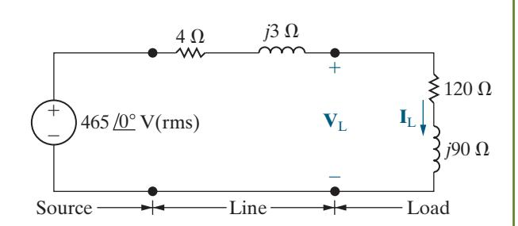

Answer: a) 460.47 1.82° − V(rms), 3.07 −38.69° A(rms);

b) 1130.91 W, 848.19 VAR;

c) 37.7 W, 28.27 VAR;

d) 1168.61 W, −819.91 VAR;

e) 1696.26 VAR.

10.6 The voltage at the terminals of a load is 400 V(rms). The load is absorbing an average power of 6 kW and a magnetizing reactive power of 8 kVAR. Derive two equivalent impedance models of the load.

Answer: 9.6 Ω in series with 12.8 Ω of inductive reac tance; 26.67 Ω in parallel with 20 Ω of inductive reactance.

10.7 Three loads are connected in parallel across a 250 V(rms) line, as shown in the figure. Load 1 absorbs 16 kW and 18 kVAR; Load 2 absorbs

*SELF-CHECK: Also try Chapter [Problems](#page--1-0) 10.19, 10.23, and 10.24.*

10 kVA at 0.6 leading; and Load 3 absorbs 8 kW at unity power factor.

- a) Find the impedance that is equivalent to the three parallel loads.
- b) Find the power factor of the equivalent load as seen from the line's input terminals.

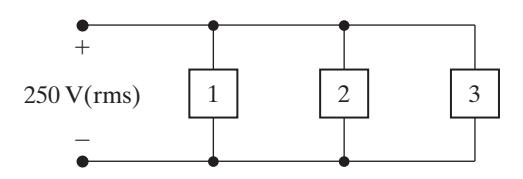

Answer: a) 1.875 + *j*0.625 Ω;

b) 0.9487 lagging.

# 10.6 [Maximum Power Transfer](#page--1-0)

Recall from Chapter 4 that certain systems—for example, those that transmit information via electric signals—need to transfer a maximum amount of power from the source to the load. We now determine the condition for maximum power transfer in sinusoidal steady-state networks, beginning with Fig. 10.19. We must determine the load impedance *Z*L that maximizes the average power delivered to terminals a and b. Any linear network can be replaced by a Thévenin equivalent circuit, so we will use the circuit in Fig. 10.20 to find the value of *Z*L that results in maximum average power delivered to *Z*L .

For maximum average power transfer, *Z*L must equal the conjugate of the Thévenin impedance; that is,

# CONDITION FOR MAXIMUM AVERAGE POWER TRANSFER

$$Z_{\rm L} = Z_{\rm Th}^*.$$
 (10.21)

We derive Eq. 10.21 by a straightforward application of elementary calculus. We begin by expressing *Z*Th and *Z*L in rectangular form:

$$Z_{\mathrm{Th}} = R_{\mathrm{Th}} + jX_{\mathrm{Th}},$$
  $Z_{\mathrm{L}} = R_{\mathrm{L}} + jX_{\mathrm{L}}.$ 

In these impedance equations, the reactance term carries its own algebraic sign—positive for inductance and negative for capacitance. We assume that the Thévenin voltage amplitude is an rms value. We also use the Thévenin voltage as the reference phasor, that is, the phasor whose phase angle is 0°. Then, from Fig. 10.20, the rms value of the load current **I** is

$$\mathbf{I} = \frac{\mathbf{V}_{\mathrm{Th}}}{(R_{\mathrm{Th}} + R_{\mathrm{L}}) + j(X_{\mathrm{Th}} + X_{\mathrm{L}})} .$$

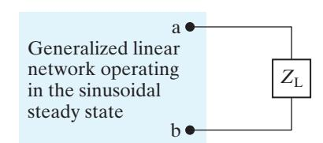

Figure 10.19 ▲ A circuit describing maximum power transfer.

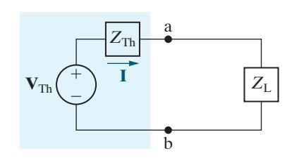

Figure 10.20 ▲ The circuit shown in Fig. 10.19, with the network replaced by its Thévenin equivalent.

The average power delivered to the load is

$$P = |\mathbf{I}|^2 R_{\rm L}.$$

Therefore,

$$P = \frac{|\mathbf{V}_{\rm Th}|^2 R_{\rm L}}{(R_{\rm L} + R_{\rm Th})^2 + (X_{\rm L} + X_{\rm Th})^2} \,. \tag{10.22}$$

In Eq. 10.22, remember that *V* , Th *R* , Th and *X*Th are fixed quantities, whereas *R*L and *X*L are independent variables. Therefore, to maximize *P*, we must find the values of *R*L and *X*L that make both ∂ ∂ *P R*L and ∂ ∂ *P X*L zero.

From Eq. 10.22,

$$\frac{\partial P}{\partial X_{L}} = \frac{-|\mathbf{V}_{Th}|^{2} 2R_{L}(X_{L} + X_{Th})}{[(R_{L} + R_{Th})^{2} + (X_{L} + X_{Th})^{2}]^{2}},$$

$$\frac{\partial P}{\partial R_{\rm L}} = \frac{\left|\mathbf{V}_{\rm Th}\right|^2 \left[ (R_{\rm L} + R_{\rm Th})^2 + (X_{\rm L} + X_{\rm Th})^2 - 2R_{\rm L}(R_{\rm L} + R_{\rm Th}) \right]}{\left[ (R_{\rm L} + R_{\rm Th})^2 + (X_{\rm L} + X_{\rm Th})^2 \right]^2} \; .$$

From its equation, ∂ ∂ *P X*L is zero when

$$X_{\rm L} = -X_{\rm Th}$$
.

From its equation, ∂ ∂ *P R*L is zero when

$$R_{\rm L} = \sqrt{R_{\rm Th}^2 + (X_{\rm L} + X_{\rm Th})^2}.$$

Note that when we combine the expressions for *X*L and *R*L, both partial derivatives are zero when *Z Z* . L Th = \*

# The Maximum Average Power Absorbed

When *Z Z* , L Th = \* we can use the circuit in [Fig. 10.20](#page-19-0) to calculate the maximum average power that is delivered to *Z*L . The rms load current is **V**Th 2*R*L because *Z Z* , L Th = \* and the maximum average power delivered to the load is

$$P_{\text{max}} = \frac{|\mathbf{V}_{\text{Th}}|^2 R_{\text{L}}}{4R_{\text{L}}^2} = \frac{1}{4} \frac{|\mathbf{V}_{\text{Th}}|^2}{R_{\text{L}}}.$$
 (10.23)

If the Thévenin voltage phasor is expressed using its maximum amplitude rather than its rms amplitude, Eq. 10.23 becomes

$$P_{\text{max}} = \frac{1}{8} \frac{|\mathbf{V}_m|^2}{R_{\text{L}}} \,. \tag{10.24}$$

# Maximum Power Transfer When *ZL* Is Restricted

Maximum average power can be delivered to *Z*L only if *Z*L can be set equal to the conjugate of *Z* . Th In some situations, this is not possible. First, *R*L and *X*L may be restricted to a limited range of values. To maximize power in this situation, set *X*L as close to −*X*Th as possible and then adjust *R*L as close to *R X* Th 2 ( ) L T *X* h + + 2 as possible (see Example 10.10).

A second type of restriction occurs when the magnitude of *Z*L can be varied, but its phase angle cannot. Under this restriction, maximum power is delivered to the load when the magnitude of *Z*L is set equal to the magnitude of *Z* ; Th that is, when

$$|Z_{\rm L}|=|Z_{\rm Th}|.$$

The proof of this is left to you as Problem 10.43.

For purely resistive networks, maximum power transfer occurs when the load resistance equals the Thévenin resistance. Note that we first derived this result in the introduction to maximum power transfer in Chapter 4.

Examples 10.9–10.11 calculate the load impedance *Z*L that produces maximum average power transfer to the load, for several different situations. Example 10.12 finds the condition for maximum power transfer to a load for a circuit with an ideal transformer.

# EXAMPLE 10.9 Determining Maximum Power Transfer without Load Restrictions

- a) For the circuit shown in Fig. 10.21, determine the impedance *Z*L that results in maximum average power transferred to *Z* . L
- b) What is the maximum average power transferred to the load impedance determined in (a)?

# Solution

a) To begin, determine the Thévenin equivalent with respect to the load terminals a, b. After two source transformations involving the 20 V source, the 5 Ω resistor, and the 20 Ω resistor, we simplify the circuit shown in Fig. 10.21 to the one shown in Fig. 10.22. Use voltage division in the simplified circuit to get

$$\mathbf{V}_{\text{Th}} = \frac{-j6}{4 + j3 - j6} \left( 16 / 0^{\circ} \right)$$
$$= 19.2 / -53.13^{\circ} = 11.52 - j15.36 \text{ V}.$$

To find the Thévenin impedance, deactivate the source in Fig. 10.22 and calculate the impedance seen looking into the terminals a and b. Thus,

$$Z_{\text{Th}} = -j6 \parallel (4+j3) = \frac{(-j6)(4+j3)}{4+j3-j6}$$
  
= 5.76 - j1.68 \Omega.

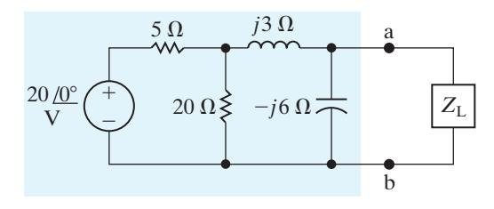

Figure 10.21 ▲ The circuit for Example 10.9.

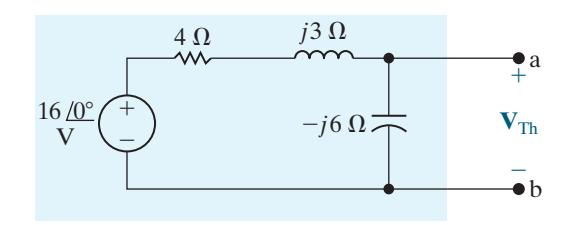

Figure 10.22 ▲ A simplification of Fig. 10.21 by source transformations.

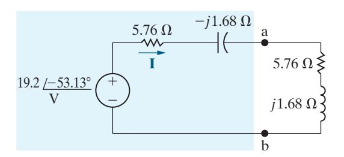

Figure 10.23 ▲ The circuit shown in Fig. 10.21, with the original network replaced by its Thévenin equivalent.

For maximum average power transfer, the load impedance must be the conjugate of *Z* , Th so

$$Z_L = 5.76 + j1.68 \,\Omega.$$

b) We calculate the maximum average power delivered to *Z*L using the circuit in Fig. 10.23, which has the Thévenin equivalent of the original network attached to the load impedance calculated in part (a). From Fig. 10.23, the rms magnitude of the load current **I** is

$$I_{\rm rms} = \frac{19.2/\sqrt{2}}{2(5.76)} = 1.1785 \text{ A(rms)}.$$

The average power delivered to the load is

$$P = I_{\rm rms}^2(5.76) = 8 \text{ W}.$$

# EXAMPLE 10.10 Determining Maximum Power Transfer with Load Impedance Restriction

- a) For the circuit shown in Fig. 10.24, what value of *Z*L results in maximum average power transfer to *Z*L ? What is the maximum power in milliwatts?
- b) Assume that the load resistance can be varied between 0 and 4000 Ω and that the capacitive reactance of the load can be varied between 0 and − Ω 2000 . What values of *R*L and *X*L transfer the most average power to the load? What is the maximum average power that can be transferred under these restrictions?

# Solution

a) If there are no restrictions on *R*L and *X* , L maximum average power is delivered to the load if the load impedance equals the conjugate of the Thévenin impedance. Therefore we set

$$R_{\rm L}=3000~\Omega$$
 and  $X_{\rm L}=-4000~\Omega,$ 

or

$$Z_{\rm L} = 3000 - j4000 \ \Omega.$$

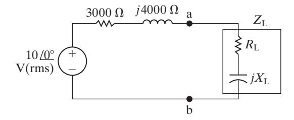

Figure 10.24 ▲ The circuit for Examples 10.10 and 10.11.

Because the source voltage is an rms value, the average power delivered to *Z*L is

$$P = \frac{1}{4} \frac{10^2}{3000} = \frac{25}{3} \text{ mW} = 8.33 \text{ mW}.$$

b) Now *R*L and *X*L are restricted, so first we set *X*L as close to − Ω 4000 as possible; thus, *X* 2000 . L = − Ω Next, we set *R*L as close to *R X* Th 2 ( ) L T *X* h + + 2 as possible. Thus

$$R_{\rm L} = \sqrt{3000^2 + (-2000 + 4000)^2} = 3605.55 \,\Omega.$$

Since *R*L can be varied from 0 to 4000 , Ω we can set *R*L to 3605.55 Ω . Therefore, the load impedance value is

$$Z_{\rm L} = 3605.55 - j2000 \ \Omega.$$

For this value of *Z*L , the value of the load current is

$$\mathbf{I}_{\text{rms}} = \frac{10 \ /0^{\circ}}{6605.55 + j2000} = 1.4489 \ /-16.85^{\circ} \ \text{mA(rms)}.$$

The average power delivered to the load is

$$P = (1.4489 \times 10^{-3})^2 (3605.55) = 7.57 \text{ mW}.$$

This is the maximum power delivered to a load with the specified restrictions on *R*L and *X* . L Note that this is less than the 8.33 mW that can be delivered if there are no restrictions, as we found in part (a).

# EXAMPLE 10.11 Finding Maximum Power Transfer with Impedance Angle Restrictions

A load impedance having a constant phase angle of −36.87° is connected across the terminals a and b in the circuit shown in Fig. 10.24. The magnitude of *Z*L is varied until the average power delivered is maximized under the given restriction.

- a) Specify *Z*L in rectangular form.
- b) Calculate the average power delivered to *Z* . L

# Solution

a) When only the magnitude of *Z*L can be varied, maximum power is delivered to the load when the magnitude of *Z*L equals the magnitude of *Z* . Th So,

$$|Z_{\rm L}| = |Z_{\rm Th}| = |3000 + j4000| = 5000 \ \Omega.$$

Therefore,

$$Z_{\rm L} = 5000 / -36.87^{\circ} = 4000 - j3000 \Omega.$$

b) When *Z*L equals 4000 3000 − Ω *j* , the load current is

$$\mathbf{I}_{\text{rms}} = \frac{10}{7000 + j1000} = 1.4142 / -8.13^{\circ} \text{ mA(rms)},$$

and the average power delivered to the load is

$$P = (1.4142 \times 10^{-3})^2 (4000) = 8 \text{ mW}.$$

This quantity is the maximum power that can be delivered by this circuit to a load impedance whose angle is constant at −36.87°. Again, this quantity is less than the maximum power that can be delivered if there are no restrictions on *Z* . L

# ASSESSMENT PROBLEM

Objective 2—Understand the condition for maximum real power delivered to a load in an ac circuit

- 10.8 The source voltage in the circuit shown is 80 cos 250 V*t* .
  - a) What impedance should be connected across terminals a and b for maximum average power transfer?
  - b) What is the average power transferred to the impedance in (a)?
  - c) Assume that the load is restricted to pure resistance. What size resistor connected across a and b will result in the maximum average power transferred?
  - d) What is the average power transferred to the resistor in (c)?

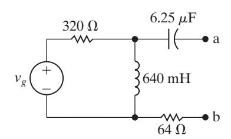

Answer: a) 128 + Ω *j*512 ;

b) 1.25 W;

c) 527.76 ; Ω

d) 487.9 mW.

*SELF-CHECK: Also try Chapter [Problems](#page--1-0) 10.44, 10.49, and 10.50.*

# EXAMPLE 10.12 Finding Maximum Power Transfer in a Circuit with an Ideal Transformer

The variable resistor in the circuit in Fig. 10.25 is adjusted until maximum average power is delivered to *R* . L

- a) What is the value of *R*L in ohms?
- b) What is the maximum average power (in watts) delivered to *R*L?

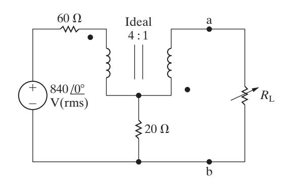

Figure 10.25 ▲ The circuit for Example 10.12.

# Solution

a) We first find the Thévenin equivalent with respect to the terminals of *R* . L We determine the open-circuit voltage using the circuit in Fig. 10.26. The variables **V** , 1 **V** , 2 **I** , 1 and **I** 2 have been added to aid the discussion.

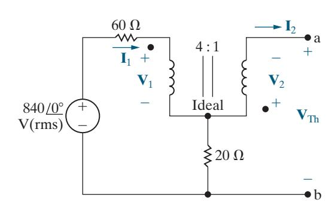

Figure 10.26 ▲ The circuit used to find the Thévenin voltage.

$$\mathbf{V}_2 = \frac{1}{4}\mathbf{V}_1, \qquad \mathbf{I}_1 = -\frac{1}{4}\mathbf{I}_2.$$

The open-circuit value of **I** 2 is zero; hence, **I** 1 is zero. It follows that

$${\bf V}_1 = 840 \ \underline{/0^{\circ}} \ V({\rm rms}), \qquad {\bf V}_2 = 210 \ \underline{/0^{\circ}} \ V({\rm rms}).$$

From [Fig. 10.26](#page-23-0) we note that **V**Th is the negative of **V** , 2 because there is no current in the 20 Ω resistor. Hence

$$\mathbf{V}_{\mathrm{Th}} = -210 \ \underline{/0^{\circ}} \ \mathrm{V(rms)}.$$

We determine the short-circuit current using the circuit in Fig. 10.27. Since **I** 1 and **I** 2 are mesh currents, write a KVL equation for each mesh:

$$840 \underline{/0^{\circ}} = 80\mathbf{I}_{1} - 20\mathbf{I}_{2} + \mathbf{V}_{1},$$
$$0 = 20\mathbf{I}_{2} - 20\mathbf{I}_{1} + \mathbf{V}_{2}.$$

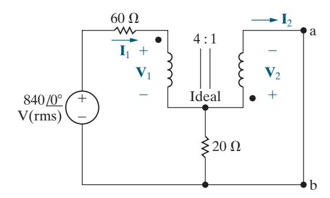

Figure 10.27 ▲ The circuit used to calculate the short-circuit current.

Combine these two KVL equations with the constraint equations to get

$$840 \ \underline{/0^{\circ}} = -40\mathbf{I}_2 + \mathbf{V}_1,$$
$$0 = 25\mathbf{I}_2 + \frac{\mathbf{V}_1}{4}.$$

Solving for the short-circuit value of **I** 2 yields

$$\mathbf{I}_2 = -6 \text{ A(rms)}.$$

Therefore, the Thévenin resistance is

$$R_{\rm Th} = \frac{-210}{-6} = 35 \ \Omega.$$

Maximum power will be delivered to *R*L when *R*L equals 35 Ω.

b) We determine the maximum power delivered to *R*L using the Thévenin equivalent circuit in Fig. 10.28. From this circuit, the rms current in the load resistor is (−210 70) A(rms). Therefore,

$$P_{\text{max}} = \left(\frac{-210}{70}\right)^2 (35) = 315 \text{ W}.$$

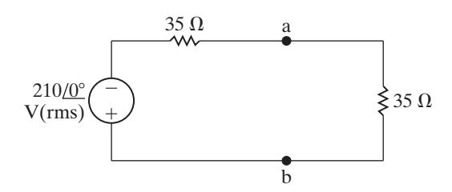

Figure 10.28 ▲ The Thévenin equivalent loaded for maximum power transfer.

# ASSESSMENT PROBLEMS

Objective 3—Be able to calculate all forms of ac power in ac circuits with linear transformers and ideal transformers

10.9 Find the average power delivered to the 9 Ω resistor in the circuit shown if *v* 180 2 cos100 V*t* . *g* =

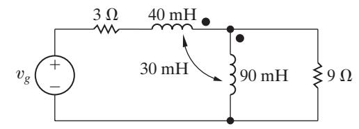

Answer: 1296 W.

- 10.10 a) Find the average power delivered to the 80 Ω resistor in the circuit shown if *v* 496 cos 2000 V*t* . *g* =
  - b) Find the average power delivered to the 75 Ω resistor.

c) Find the power developed by the ideal voltage source. Check your result by showing that the power absorbed equals the power developed.

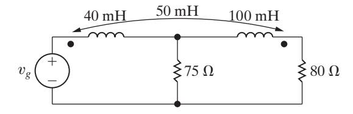

Answer: a) 1000 W;

- b) 984 W;
- c) 1984 W, 1000 984 1984 W + = .

- 10.11 The variable load resistor *R*L in the circuit shown is adjusted for maximum average power transfer to *R*L.
  - a) Find *R*L.
  - b) Find the maximum average power delivered to the *R*L found in part (a).
  - c) What percentage of the average power developed by the voltage source is delivered to *R*L when *R*L is absorbing maximum average power? Answer: a) 16 Ω;

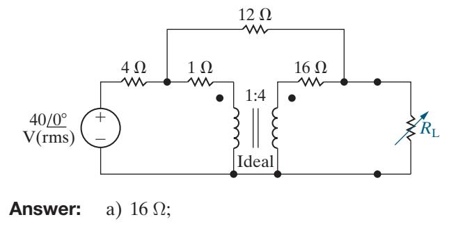

b) 25 W;

c) 10.87%.

*SELF-CHECK: Also try Chapter [Problems](#page--1-0) 10.51, 10.61, and 10.62.*

# [Practical Perspective](#page--1-0)

# Vampire Power

Vampire power, or standby power, may cost you more than you think. The average household has about 40 electrical products that draw power, even when they are turned off. Approximately 5% of typical residential power consumption can be attributed to standby power. Table 10.3 provides the power consumption for several different devices. Notice that when a device is "off" it is often still consuming power.

Consider a typical mobile phone charger. According to the values given in Table 10.3, when the charger is detached from the phone it consumes only a fraction of the power required when the charger is

#### TABLE 10.3 Average Power Consumption of Common Electrical Devices

| Electrical device+                             | Power [W]* |  |
|------------------------------------------------|------------|--|
| Mobile phone charger                           |            |  |
| Attached to phone, phone charging              | 3.68       |  |
| Plugged into wall outlet but not into phone    | 0.26       |  |
| Notebook computer AC adapter                   |            |  |
| Attached to computer, computer charging        | 44.28      |  |
| Attached to computer, computer sleeping        | 15.77      |  |
| Attached to computer, computer off             | 8.9        |  |
| Plugged into wall outlet but not into computer | 4.42       |  |
| DVD player                                     |            |  |
| On and playing                                 | 9.91       |  |
| On and not playing                             | 7.54       |  |
| Off                                            | 1.55       |  |
| Microwave oven                                 |            |  |
| Ready with door closed                         | 3.08       |  |
| Ready with door open                           | 25.79      |  |
| Cooking                                        | 1433.0     |  |
| Inkjet multifunction printer                   |            |  |
| On                                             | 9.16       |  |
| Off                                            | 5.26       |  |

\* Data in this table from Lawrence Berkeley National Laboratory report [\(http://standby.lbl.gov/standby.html\).](http://standby.lbl.gov/standby.html)

+This value is the average of the power measured for many types of each device.

attached to the phone and the phone is charging. Suppose you charge your phone for three hours each day but leave the charger plugged into the wall outlet 24 hours a day. Recall that the electric company charges you based on the number of kilowatt-hours (kWh) you use in a given month. A device that uses 1000 W of power continuously over one hour has consumed 1 kWh. Let's calculate the number of kilowatt-hours used by the phone charger in one month:

$$P[kWh] = \frac{30[3(3.68) + 21(0.26)]}{1000} = 1.8 \text{ kWh.}$$

Now do the calculation again, this time assuming that you unplug the charger when it is not being used to charge the phone:

$$P[kWh] = \frac{30[3(3.68) + 21(0)]}{1000} = 0.33 \text{ kWh.}$$

Keeping the charger plugged in when you are not using it consumes more than 5 times the power needed to charge your phone every day. You can therefore minimize the cost of vampire power by unplugging electrical devices if they are not being used.

Why does the phone charger consume power when not plugged into the phone? The electronic circuitry in your phone uses 5 V(dc) sources to supply power. The phone charger must transform the 120 V(rms) signal supplied by the wall outlet into a signal that can be used to charge the phone. Phone chargers can use linear transformers, together with other circuitry, to output the voltage needed by the phone.

Consider the circuit in Fig. 10.29. The linear transformer is part of the circuitry used to reduce the voltage supplied by the source to the level required by the phone. The additional components needed to complete this task are not shown in the circuit. When the phone is unplugged from the circuit in Fig. 10.29, but the circuit is still connected to the 120 V(rms) source, there is still a path for the current, as shown in Fig. 10.30. The current is

$$\mathbf{I} = \frac{120}{R_s + R_1 + j\omega L_1} \ .$$

The real power, delivered by the voltage source and supplied to the resistors, is

$$P = (R_s + R_1)|\mathbf{I}|^2.$$

This is the vampire power being consumed by the phone charger even when it is not connected to the phone.

 *SELF-CHECK: Assess your understanding of this Practical Perspective by trying Chapter [Problems](#page--1-0) 10.67–10.71.*

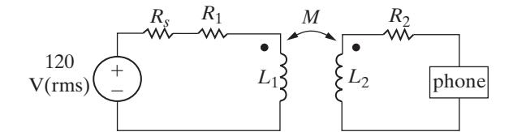

Figure 10.29 ▲ A linear transformer used in a phone charger.

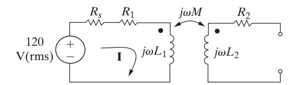

Figure 10.30 ▲ The phone charger circuit when the phone is not connected.

# [Summary](#page--1-0)

- **Instantaneous power** is the product of the instantaneous terminal voltage and current, or *p i* = ±*v* . The positive sign is used when the reference direction for the current is from the positive to the negative reference polarity of the voltage. The frequency of the instantaneous power is twice the frequency of the voltage (or current). (See page 376.)
- **Average power** is the average value of the instantaneous power over one period. It is the power converted from electric to nonelectric form and vice versa, so it is also called real power. Average power is given by

$$P = \frac{1}{2} V_m I_m \cos(\theta_v - \theta_i)$$
$$= V_{\text{rms}} I_{\text{rms}} \cos(\theta_v - \theta_i).$$

(See page 377.)

• **Reactive power** is the electric power exchanged between the magnetic field of an inductor and the source that drives it or between the electric field of a capacitor and the source that drives it. Reactive power is never converted to nonelectric power. Reactive power is given by

$$Q = \frac{1}{2} V_m I_m \sin(\theta_v - \theta_i)$$
$$= V_{\text{rms}} I_{\text{rms}} \sin(\theta_v - \theta_i).$$

Both average power and reactive power can be expressed in terms of either peak ( , *V I m m* ) or rms ( , *V I* ) rms rms current and voltage. RMS values, also called *effective values*, are widely used in both household and industrial applications. (See page 378.)

• The **power factor** is the cosine of the phase angle between the voltage and the current:

$$pf = \cos(\theta_v - \theta_i).$$

The terms *lagging* and *leading*, added to the description of the power factor, indicate whether the current is lagging or leading the voltage and thus whether the load is inductive or capacitive. (See page 379.)

• The **reactive factor** is the sine of the phase angle between the voltage and the current:

$$rf = \sin(\theta_v - \theta_i).$$

(See page 379.)

• **Complex power** is the complex sum of the real and reactive powers, or

$$S = P + jQ$$

$$= \frac{1}{2} \mathbf{V} \mathbf{I}^* = \mathbf{V}_{\text{rms}} \mathbf{I}_{\text{rms}}^*$$

$$= |\mathbf{I}_{\text{rms}}|^2 Z = \frac{|\mathbf{V}_{\text{rms}}|^2}{Z^*}.$$

(See page 384.)

• **Apparent power** is the magnitude of the complex power:

$$|S| = \sqrt{P^2 + Q^2}.$$

(See page 385.)

- The **watt** is used as the unit for both instantaneous and real power. The **var** (volt amp reactive, or VAR) is used as the unit for reactive power. The **volt-amp** (VA) is used as the unit for complex and apparent power. (See page 385.)
- **Maximum power transfer** occurs in circuits operating in the sinusoidal steady state when the load impedance is the conjugate of the Thévenin impedance as viewed from the terminals of the load impedance. (See page 393.)

# [Problems](#page--1-0)

#### **Sections 10.1–10.2**

**10.1** For each of the following sets of voltage and current, calculate the real and reactive power in the line between networks A and B for the circuit in [Fig. P10.1.](#page-28-0)  In each case, state whether average power flows from A to B or vice versa. Also state whether magnetizing vars are being transferred from A to B or vice versa.

a) 
$$v = 100\cos(\omega t - 45^{\circ}) \text{ V},$$
  
 $i = 20\cos(\omega t + 15^{\circ}) \text{ A};$ 

b) 
$$v = 100\cos(\omega t - 45^{\circ}) \text{ V},$$
  
 $i = 20\cos(\omega t + 165^{\circ}) \text{ A};$ 

c) 
$$v = 100\cos(\omega t - 45^{\circ}) \text{ V},$$
  
 $i = 20\cos(\omega t + 105^{\circ}) \text{ A};$ 

d) 
$$v = 100\cos\omega t \text{ V},$$
  
 $i = 20\cos(\omega t + 120^{\circ}) \text{ A}.$ 

Figure P10.1

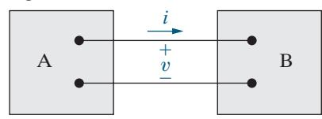

- **10.2** Show that the maximum value of the instantaneous **MULTISIM** power given by Eq. 10.3 is *P P* + +2 2 *Q* and that the minimum value is *P P Q* . − +2 2
- **10.3** a) A college student wakes up on a warm day. The central air conditioning is on, and the room feels comfortable. She turns on the dishwasher, takes some milk out of the old refrigerator, and puts some oatmeal in the microwave oven to cook. If all of these appliances in her dorm room are supplied by a 120 V(rms) branch circuit protected by a 60 A(rms) circuit breaker, will the breaker interrupt her morning?
  - b) Her roommate wakes up and moves wet clothes from the washer to the dryer. Before she turns on the dryer, what does she ask her roommate to turn off so the circuit breaker is not tripped?
- **10.4** a) Calculate the real and reactive power associated with each circuit element in the circuit in [Fig. P9.57.](#page--1-0)
  - b) Verify that the average power generated equals the average power absorbed.
  - c) Verify that the magnetizing vars generated equal the magnetizing vars absorbed.
- **10.5** Repeat Problem 10.4 for the circuit shown in Fig. P9.62.
- **10.6** Find the average power delivered by the ideal current source in the circuit in Fig. P10.6 if *i t* 30 cos 25, 000 mA. *g* = **PSPICE MULTISIM**

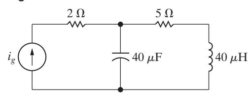

- **10.7** A load consisting of a 1350 Ω resistor in parallel with a 405 mH inductor is connected across the terminals of a sinusoidal voltage source *vg*, where *v* 90 cos 2500 V*t* . *g* =
  - a) What is the peak value of the instantaneous power delivered by the source?
  - b) What is the peak value of the instantaneous power absorbed by the source?
  - c) What is the average power delivered to the load?
  - d) What is the reactive power delivered to the load?

- e) Does the load absorb or generate magnetizing vars?
- f) What is the power factor of the load?
- g) What is the reactive factor of the load?
- **10.8** Find the average power dissipated in the 20 Ω resistor in the circuit seen in Fig. P10.8 if *i t* = 15 cos 10,000 A. *g* **PSPICE**

# Figure P10.8

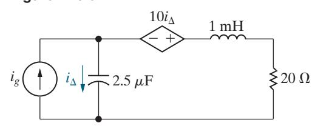

 **10.9** The op amp in the circuit shown in Fig. P10.9 is ideal. Calculate the average power delivered to the 1 kΩ resistor when *v* = 4 cos 5000 V*t* . *g* **PSPICE MULTISIM**

### Figure P10.9

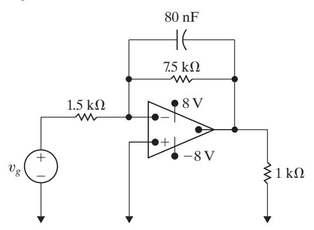

- **10.10** The load impedance in Fig. P10.10 absorbs 40 kW and 30 kVAR. The sinusoidal voltage source develops 50 kW.
  - a) Find the values of capacitive line reactance that will satisfy these constraints.
  - b) For each value of line reactance found in (a), show that the magnetizing vars developed equals the magnetizing vars absorbed.

Figure P10.10

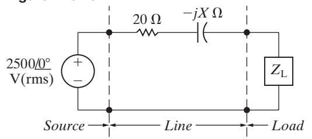

#### **Section 10.3**

 **10.11** A dc voltage equal to *V*dc V is applied to a resistor of *R* . Ω A sinusoidal voltage equal to *vs* V is also applied to a resistor of *R* . Ω Show that the dc voltage will deliver the same amount of energy in *T* seconds (where *T* is the period of the sinusoidal voltage) as the sinusoidal voltage provided *V*dc equals the rms value of *vs*. (*Hint:* Equate the two expressions for the energy delivered to the resistor.)

- **10.12** a) A personal computer with a monitor and key board requires 60 W at 110 V(rms). Calculate the rms value of the current carried by its power cord.
  - b) A laser printer for the personal computer in (a) is rated at 80 W at 110 V(rms). If this printer is plugged into the same wall outlet as the computer, what is the rms value of the current drawn from the outlet?
- **10.13** Find the rms value of the periodic current shown in Fig. P10.13.

Figure P10.13

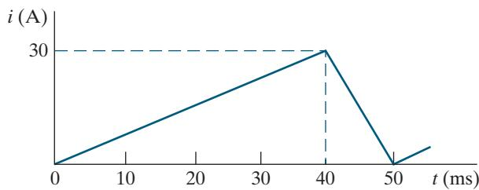

- **10.14** The periodic current shown in Fig. P10.13 dissipates an average power of 24 kW in a resistor. What is the value of the resistor?
- **10.15** a) Find the rms value of the periodic voltage shown in Fig. P10.15.
  - b) Suppose the voltage in part (a) is applied to the terminals of a 2.5 kΩ resistor. Calculate the average power dissipated by the resistor.
  - c) When the voltage in part (a) is applied to a different resistor, that resistor dissipates 625 mW of average power. What is the value of the resistor?

Figure P10.15

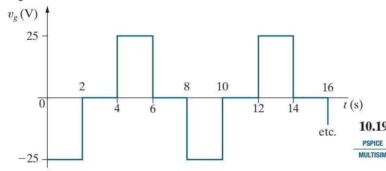

 **10.16** a) Find the rms value of the periodic voltage shown in Fig. P10.16.

b) If this voltage is applied to the terminals of a 12 Ω resistor, what is the average power dissipated in the resistor?

Figure P10.16

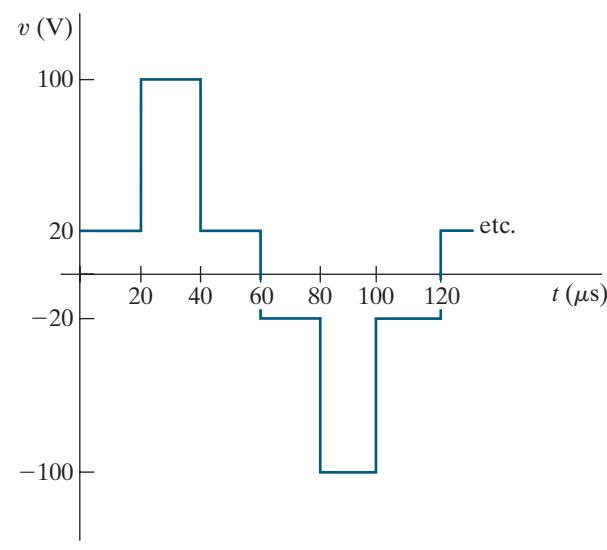

# **Sections 10.4–10.5**

 **10.17** A load consisting of a 1350 Ω resistor in parallel with a 405 mH inductor is connected across the terminals of a sinusoidal voltage source *vg*, where *v* = 90 cos 2500 V*t* . *g* Find **PSPICE MULTISIM**

- a) the average power delivered to the load,
- b) the reactive power for the load,
- c) the apparent power for the load, and
- d) the power factor of the load.
- **10.18** a) Find *V*L(rms) and *θ* for the circuit in Fig. P10.18 if the load absorbs 250 VA at a lagging power factor of 0.6.
  - b) Construct a phasor diagram of each solution obtained in (a).

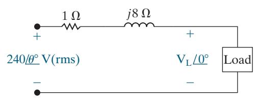

- **10.19** a) Find the average power, the reactive power, and the apparent power supplied by the voltage source in the circuit in [Fig. P10.19](#page-30-0) if *v* = 50 cos 10 *t* V. *g* 5
  - b) Check your answer in (a) by showing *P P* . dev a = Σ bs
  - c) Check your answer in (a) by showing *Q Q* . dev a = Σ bs

Figure P10.19

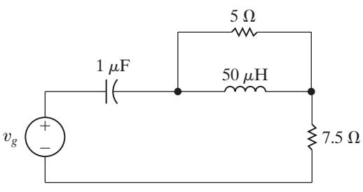

- **10.20** The voltage **V***g* in the frequency-domain circuit shown in Fig. P10.20 is 340 0 V° (rms).
  - a) Find the average and reactive power for the voltage source.
  - b) Is the voltage source absorbing or delivering average power?
  - c) Is the voltage source absorbing or delivering magnetizing vars?
  - d) Find the average and reactive powers associated with each impedance branch in the circuit.
  - e) Check the balance between delivered and absorbed average power.
  - f) Check the balance between delivered and absorbed magnetizing vars.

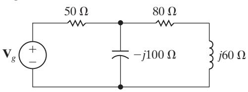

- **10.21** Two 660 V(rms) loads are connected in parallel. The two loads draw a total average power of 52,800 W at a power factor of 0.8 leading. One of the loads draws 40 kVA at a power factor of 0.96 lagging. What is the power factor of the other load?
- **10.22** The two loads shown in Fig. P10.22 can be described as follows: Load 1 absorbs an average power of 24.96 kW and 47.04 kVAR of reactive power; Load 2 has an impedance of (5 − Ω *j*5) . The voltage at the terminals of the loads is 480 2 cos 120*π t* V.
  - a) Find the rms value of the source voltage.
  - b) By how many microseconds is the load voltage out of phase with the source voltage?
  - c) Does the load voltage lead or lag the source voltage?

### Figure P10.22

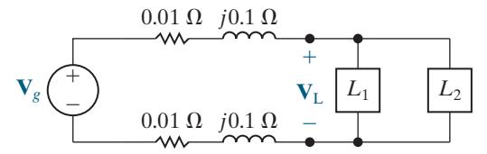

 **10.23** Find the phasor voltage **V***s* for the circuit in Fig. P10.23 if loads *L*1 and *L*2 are absorbing 15 kVA at 0.6 pf lagging and 6 kVA at 0.8 pf leading, respectively. Express **V***s* in polar form.

Figure P10.23

- **10.24** The three loads in the circuit in Fig. P10.24 can be described as follows: Load 1 is a 12 Ω resistor in series with a 15 mH inductor; Load 2 is a 16 *μ*F capacitor in series with an 80 Ω resistor; and Load 3 is a 400 Ω resistor in series with the parallel combination of a 20 H inductor and a 5 *μ*F capacitor. The frequency of the voltage source is 60 Hz.
  - a) Give the power factor and reactive factor of each load.
  - b) Give the power factor and reactive factor of the composite load seen by the voltage source.

## Figure P10.24

 **10.25** The three parallel loads in the circuit shown in Fig. P10.25 can be described as follows: Load 1 is absorbing an average power of 24 kW and reactive power of 18 kvars; Load 2 is absorbing an average power of 48 kW and generating reactive power of 30 kvars; Load 3 is a 60 Ω resistor in parallel with an inductor whose reactance is 480 . Ω Find the rms magnitude and the phase angle of **V***g* if **V** 2400 0 V(rms). *o* = °

- **10.26** The three loads in the circuit seen in [Fig. P10.26](#page-31-0) are described as follows: Load 1 is absorbing 1.8 kW and 600 VAR; Load 2 is absorbing 1.5 kVA at a power factor of 0.8 leading; Load 3 is a 12 Ω resistor in parallel with an inductance whose reactance is 48 . Ω
  - a) Calculate the average power and the magnetizing reactive power delivered by each source if **V V** 120 0 V(rms). *g g* 1 2 = = °

b) Check your calculations by showing your results are consistent with the requirements

$$\sum P_{\text{dev}} = \sum P_{\text{abs}};$$
  
 $\sum Q_{\text{dev}} = \sum Q_{\text{abs}}.$ 

### Figure P10.26

 **10.27** Suppose the circuit shown in Fig. P10.26 represents a residential distribution circuit in which the impedances of the service conductors are negligible and **V V** 120 0 V(rms). *g g* 1 2 = = ° The three loads in the circuit are *L*1 (a new refrigerator, an electric oven, and a microwave oven); *L*2 (a humidifier and a ceiling fan with four 75 W incandescent bulbs); and *L*3 (a clothes washer and a clothes dryer). Assume that all of these appliances are in operation at the same time. The service conductors are protected with 50 A (rms) circuit breakers. Will the service to this residence be interrupted? Why or why not?

 **10.28** The three loads in Assessment Problem 10.7 are fed from a line having a series impedance 0.01 + *j*0.08 Ω, as shown in Fig. P10.28.

- a) Calculate the rms value of the voltage (**V***s*) at the sending end of the line.
- b) Calculate the average and reactive powers associated with the line impedance.
- c) Calculate the average and reactive powers at the sending end of the line.
- d) Calculate the efficiency ( ) *η* of the line if the efficiency is defined as

$$\eta = (P_{\rm load}/P_{\rm sending\ end}) \times 100.$$

#### Figure P10.28

 **10.29** The three loads in the circuit seen in Fig. P10.29 are

$$S_1 = 5 + j2 \text{ kVA},$$
  
 $S_2 = 3.75 + j1.5 \text{ kVA},$   
 $S_3 = 8 + j0 \text{ kVA}.$ 

a) Calculate the complex power associated with each voltage source, **V***g*1 and **V***g*2.

b) Verify that the total real and reactive power delivered by the sources equals the total real and reactive power absorbed by the network.

### Figure P10.29

 **10.30** A factory has an electrical load of 1800 kW at a lagging power factor of 0.6. An additional variable power factor load is to be added to the factory. The new load will add 600 kW to the real power load of the factory. The power factor of the added load is to be adjusted so that the overall power factor of the factory is 0.96 lagging.

- a) Specify the reactive power associated with the added load.
- b) Does the added load absorb or deliver magnetizing vars?
- c) What is the power factor of the additional load?
- d) Assume that the voltage at the input to the factory is 4800 V(rms). What is the rms magnitude of the current into the factory before the variable power factor load is added?
- e) What is the rms magnitude of the current into the factory after the variable power factor load has been added?

 **10.31** Assume the factory described in Problem 10.30 is fed from a line having an impedance of 0.02 0.16 + Ω *j* . The voltage at the factory is maintained at 4800 V(rms).

- a) Find the average power loss in the line before and after the load is added.
- b) Find the magnitude of the voltage at the sending end of the line before and after the load is added.

 **10.32** A group of small appliances on a 60 Hz system requires 25 kVA at 0.96 pf lagging when operated at 125 V(rms). The impedance of the feeder supplying the appliances is 6 4 + Ω *j* 8 m . The voltage at the load end of the feeder is 125 V(rms).

- a) What is the rms magnitude of the voltage at the source end of the feeder?
- b) What is the average power loss in the feeder?
- c) What size capacitor (in microfarads) across the load end of the feeder is needed to improve the load power factor to unity?

- d) After the capacitor is installed, what is the rms magnitude of the voltage at the source end of the feeder if the load voltage is maintained at 125 V(rms)?
- e) What is the average power loss in the feeder for (d)?
- **10.33** a) Find the average power dissipated in the line in Fig. P10.33.
  - b) Find the capacitive reactance that when connected in parallel with the load will make the load look purely resistive.
  - c) What is the equivalent impedance of the load in (b)?
  - d) Find the average power dissipated in the line when the capacitive reactance is connected across the load.
  - e) Express the power loss in (d) as a percentage of the power loss found in (a).

 **10.34** The steady-state voltage drop between the load and the sending end of the line seen in Fig. P10.34 is excessive. A capacitor is placed in parallel with the 250 kVA load and is adjusted until the steadystate voltage at the sending end of the line has the same magnitude as the voltage at the load end, that is, 2500 V(rms). The 250 kVA load is operating at a power factor of 0.96 lag. Calculate the size of the capacitor in microfarads if the circuit is operating at 60 Hz. In selecting the capacitor, keep in mind the need to keep the power loss in the line at a reasonable level.

Figure P10.34

- **10.35** Consider the circuit described in Problem 9.78.
  - a) What is the rms magnitude of the voltage across the load impedance?
  - b) What percentage of the average power developed by the practical source is delivered to the load impedance?

- **10.36** a) Find the average power delivered to the 40 Ω resistor in the circuit in Fig. P10.36.
  - b) Find the average power developed by the ideal sinusoidal voltage source.
  - c) Find *Z*ab.
  - d) Show that the average power developed equals the average power dissipated.

### Figure P10.36

- **10.37** a) Find the six branch currents **I I** a f − in the circuit in Fig. P10.37.
  - b) Find the complex power in each branch of the circuit.
  - c) Check your calculations by verifying that the average power developed equals the average power dissipated.
  - d) Check your calculations by verifying that the magnetizing vars generated equal the magnetizing vars absorbed.

# Figure P10.37

- **10.38** a) Find the average power delivered by the sinusoidal current source in the circuit of Fig. P10.38.
  - b) Find the average power delivered to the 1 kΩ resistor.

### Figure P10.38

 **10.39** The sinusoidal voltage source in the circuit in [Fig. P10.39](#page-33-0) is developing an rms voltage of 680 V. The 80 Ω load in the circuit is absorbing 16 times as much average power as the 320 Ω load. The two loads are matched to the sinusoidal source that has an internal impedance of 136 0 ° Ωk .

- a) Specify the numerical values of *a*1 and *a*2.
- b) Calculate the power delivered to the 80 Ω load.
- c) Calculate the rms value of the voltage across the 320 Ω resistor.

### Figure P10.39

- **10.40** a) Find the average power dissipated in each resistor in the circuit in Fig. P10.40.
  - b) Check your answer by showing that the total power developed equals the total power absorbed.

Figure P10.40

# **Section 10.6**

- **10.41** The phasor voltage **V**ab in the circuit shown in Fig. P10.41 is 480 0 ° V(rms) when no external load is connected to the terminals a, b. When a load having a resistance of 100 Ω is connected across a, b, the value of **V**ab is 240 − *j*80 V(rms).
  - a) Find the impedance that should be connected across a, b for maximum average power transfer.
  - b) Find the maximum average power transferred to the load of (a).
  - c) Construct the impedance of part (a) using components from Appendix H if the source frequency is 250 rad/s.

Figure P10.41

- **10.42** Suppose an impedance equal to the conjugate of the Thévenin impedance is connected to the terminals c, d of the circuit shown in [Fig. P9.77.](#page--1-0)
  - a) Find the average power developed by the sinusoidal voltage source.
  - b) What percentage of the average power developed by the source is lost in the linear transformer?
- **10.43** Prove that if only the magnitude of the load impedance can be varied, the most average power is transferred to the load when *Z Z* . L T = h (*Hint:* In deriving the expression for the load's average power, write the load impedance (*Z*L) in the form *Z Z* cos s *j Z* in , L L L = +*θ θ* and note that only *Z*L is variable.)
- **10.44** a) Determine the load impedance for the circuit shown in Fig. P10.44 that will result in maximum average power being transferred to the load if *ω* = 10 krad s.
  - b) Determine the maximum average power delivered to the load from part (a) if *v* 90 cos10, 000 V*t* . *g* =
  - c) Repeat part (b) when *Z*L consists of two components from Appendix H whose values yield a maximum average power closest to the value calculated in part (a).

Figure P10.44

- **10.45** The load impedance *Z*L for the circuit shown in Fig. P10.45 is adjusted until maximum average power is delivered to *Z*L.
  - a) Find the maximum average power delivered to *Z*L.
  - b) What percentage of the total power developed in the circuit is delivered to *Z*L?

#### Figure P10.45

 **10.46** The variable resistor in the circuit shown in [Fig. P10.46](#page-34-0) is adjusted until the average power it absorbs is maximum.

- a) Find *R*.
- b) Find the maximum average power.
- c) Find the resistor in Appendix H that would have the most average power delivered to it.

- **10.47** The variable resistor *Ro* in the circuit shown in Fig. P10.47 is adjusted until maximum average power is delivered to *Ro*.
  - a) What is the value of *Ro* in ohms?
  - b) Calculate the average power delivered to *Ro*.
  - c) If *Ro* is replaced with a variable impedance *Zo*, what is the maximum average power that can be delivered to *Zo*?
  - d) In (c), what percentage of the circuit's developed power is delivered to the load *Zo*?

Figure P10.47

- **10.48** The sending-end voltage in the circuit seen in Fig. P10.48 is adjusted so that the load voltage is always 4800 V(rms). The variable capacitor is adjusted until the average power dissipated in the line resistance is minimum.
  - a) If the frequency of the sinusoidal source is 60 Hz, what is the value of the capacitance in microfarads?
  - b) If the capacitor is removed from the circuit, what percentage increase in the magnitude of **V***s* is necessary to maintain 4800 V(rms) at the load?
  - c) If the capacitor is removed from the circuit, what is the percentage increase in line loss?

### Figure P10.48

- **10.49** The peak amplitude of the sinusoidal voltage source in the circuit shown in Fig. P10.49 is 150 2 V and its period is 200 π *μ*s. The load resistor can be varied from 0 to 20 Ω and the load inductor can be varied from 1 to 8 mH.
  - a) Calculate the average power delivered to the load when *Ro* = Ω 10 and *L* 6 mH. *o* =
  - b) Determine the settings of *Ro* and *Lo* that will result in the most average power being transferred to *Ro*.
  - c) What is the average power in (b)? Is it greater than the power in (a)?
  - d) If there are no constraints on *Ro* and *Lo*, what is the maximum average power that can be delivered to a load?
  - e) What are the values of *Ro* and *Lo* for the condition of (d)?
  - f) Is the average power calculated in (d) larger than that calculated in (c)?

# Figure P10.49

**PSPICE MULTISIM**

- **10.50** a) Assume that *Ro* in Fig. P10.49 can be varied between 0 and 50 . Ω Repeat (b) and (c) of Problem 10.49. **PSPICE MULTISIM**
  - b) Is the new average power calculated in (a) greater than that found in Problem 10.49(a)?
  - c) Is the new average power calculated in (a) less than that found in 10.49(d)?
- **10.51** For the frequency-domain circuit in Fig. P10.51, calculate:
  - a) the rms magnitude of **V***o*;
  - b) the average power dissipated in the 100 Ω resistor;
  - c) the percentage of the average power generated by the ideal voltage source that is delivered to the 100 Ω load resistor.

-  **10.52** The 100 Ω resistor in the circuit in [Fig. P10.51](#page-34-0) is replaced with a variable impedance *Zo*. Assume *Zo* is adjusted for maximum average power transfer to *Zo*.
  - a) What is the maximum average power that can be delivered to *Zo*?
  - b) What is the average power developed by the ideal voltage source when maximum average power is delivered to *Zo*?
  - c) Choose single components from Appendix H to form an impedance that dissipates average power closest to the value in part (a). Assume the source frequency is 60 Hz. Calculate the resulting average power dissipated by this impedance.
- **10.53** a) Solve Example 10.12 if the polarity dot on the coil connected to terminal a is at the top. **PSPICE MULTISIM**
  - b) Solve Example 10.12 if the amplitude of the voltage source is reduced to 146 V(rms) and the turns ratio is reversed to 1:4.
- **10.54** a) Find the steady-state expression for the currents *i*g and *i*L in the circuit in Fig. P10.54 when = 70 cos 5000 V*t g v* . **PSPICE MULTISIM**
  - b) Find the coefficient of coupling.
  - c) Find the energy stored in the magnetically coupled coils at *t* = 100*π μ* s and *t* = 200*π μ* s.
  - d) Find the power delivered to the 30 Ω resistor.
  - e) If the 30 Ω resistor is replaced by a variable resistor *R*L, what value of *R*L will yield maximum average power transfer to *R*L?
  - f) What is the maximum average power in (e)?
  - g) Assume the 30 Ω resistor is replaced by a variable impedance *Z*L. What value of *Z*L will result in maximum average power transfer to *Z*L?
  - h) What is the maximum average power in (g)?

 **10.55** Find the impedance seen by the ideal voltage source in the circuit in Fig. P10.55 when *Zo* is adjusted for maximum average power transfer to *Zo*.

### Figure P10.55

- **10.56** The impedance *Z*L in the circuit in Fig. P10.56 is adjusted for maximum average power transfer to *Z*L. The internal impedance of the sinusoidal voltage source is 8 5 + Ω *j* 6 .
  - a) What is the maximum average power delivered to *Z*L?
  - b) What percentage of the average power delivered to the linear transformer is delivered to *Z*L?

### Figure P10.56

- **10.57** For the circuit in Fig. P10.57, 240 2 cos *v g* = 4000*t* V and *R*L = 140 Ω. Find
  - a) the rms magnitude of *vo;*
  - b) the average power delivered to *R*L;
  - c) the percentage of the average power generated by the ideal voltage source that is delivered to *R*L.

- **10.58** Assume the value of the load resistor, *R*L, in the circuit in Fig. P10.57 is adjustable.
  - a) Find the value of *R*L that maximizes the average power delivered to *R*L
  - b) Find the power delivered to *R*L when *R*L has the value found in (a).

- **10.59** The polarity dot on the 40 mH inductor in the circuit in [Fig. P10.57](#page-35-0) is reversed.
  - a) Find the value of *k* that makes *vo* equal to zero.
  - b) Find the power developed by the source when *k* has the value found in (a).
- **10.60** The sinusoidal voltage source in the circuit in Fig. P10.60 is operating at a frequency of 50 krad s. The variable capacitive reactance in the circuit is adjusted until the average power delivered to the 160 Ω resistor is as large as possible.
  - a) Find the value of *C* in nanofarads.
  - b) When *C* has the value found in (a), what is the average power delivered to the 160 Ω resistor?
  - c) Replace the 160 Ω resistor with a variable resistor *Ro*. Specify the value of *Ro* so that maximum average power is delivered to *Ro*.
  - d) What is the maximum average power that can be delivered to *Ro*?

 **10.61** Find the average power delivered to the 4 kΩ resistor in the circuit of Fig. P10.61.

# Figure P10.61

- **10.62** The ideal transformer connected to the 4 kΩ load in Problem 10.61 is replaced with an ideal transformer that has a turns ratio of 1: *a*.
  - a) What value of *a* results in maximum average power being delivered to the 4 kΩ resistor?
  - b) What is the maximum average power?

 **10.63** The variable load resistor *R*L in the circuit shown in Fig. P10.63 is adjusted for maximum average power transfer to *R*L. **PSPICE MULTISIM**

- a) Find the maximum average power.
- b) What percentage of the average power developed by the ideal voltage source is delivered to *R*L when *R*L is absorbing maximum average power?

c) Test your solution by showing that the power developed by the ideal voltage source equals the power dissipated in the circuit.

### Figure P10.63

- **10.64** a) If *N*1 equals 2520 turns, how many turns should be placed on the *N*2 winding of the ideal transformer in the circuit of Fig. P10.64 so that maximum average power is delivered to the 50 Ω load?
  - b) Find the average power delivered to the 50 Ω load.
  - c) Find the voltage **V**1.
  - d) What percentage of the power developed by the ideal current source is delivered to the 50 Ω resistor?

#### Figure P10.64

**PSPICE MULTISIM**

- **10.65** a) If *N*1 equals 1500 turns, how many turns should be placed on the *N*2 winding of the ideal transformer in the circuit seen in Fig. P10.65 so that maximum average power is delivered to the 3600 Ω load?
  - b) Find the average power delivered to the 3600 Ω resistor.
  - c) What percentage of the average power delivered by the ideal voltage source is dissipated in the linear transformer?

- **10.66** The load impedance *Z*L in the circuit in Fig. P10.66 is adjusted until maximum average power is transferred to *Z*L.
  - a) Specify the value of *Z*L if *N* 15, 000 turns 1 = and *N* 5000 turns 2 = .
  - b) Specify the values of **I**L and **V**L when *Z*L is absorbing maximum average power.

#### **Sections 10.1–10.6**

**PRACTICAL PERSPECTIVE**

- **10.67** a) Use the values in [Table 10.3](#page-25-0) to calculate the number of kilowatt-hours consumed in one month by a notebook computer AC adapter if every day the computer is charging for 6 hours and sleeping for 18 hours..
  - b) Repeat the calculation in part (a) assuming that the computer is charging for 6 hours and off for 18 hours.

- c) Repeat the calculation in part (a) assuming that the computer is charging for 6 hours and disconnected from the AC adapter for 18 hours, but the AC adapter remains plugged into the wall outlet.
- d) Repeat the calculation in part (a) assuming that the computer is charging for 6 hours and the AC adapter is unplugged from the wall outlet for 18 hours.

**PRACTICAL PERSPECTIVE**

- **10.68** a) Suppose you use your microwave oven for 20 minutes each day. The remaining time, the oven is ready with the door closed. Use the values in [Table 10.3](#page-25-0) to calculate the total number of kilowatt-hours used by the microwave oven in one month.
  - b) What percentage of the power used by the microwave oven in one month is consumed when the oven is ready with the door closed?

**PRACTICAL PERSPECTIVE**

 **10.69** Determine the amount of power, in watts, consumed by the transformer in [Fig. 10.30.](#page-26-0) Assume that the voltage source is ideal ( 0 *R* ) *s* = Ω , *R*1 = Ω 10 , and *L*1 = 180 mH. The frequency of the 120 V(rms) source is 60 Hz.

**PRACTICAL PERSPECTIVE**

 **10.70** Repeat Problem 10.69, but assume that the linear transformer has been improved so that *R*1 = Ω 80 m . All other values are unchanged.

**PRACTICAL PERSPECTIVE**

 **10.71** Repeat Problem 10.69 assuming that the linear transformer in [Fig. 10.30](#page-26-0) has been replaced by an ideal transformer with a turns ratio of 25:1. (*Hint:* You shouldn't need to make any calculations to determine the amount of power consumed.)