# University of Waterloo Department of Mechanical and Mechatronics Engineering **ECE 140 – Linear Circuits Final Examination – Winter 2025**

# SOLUTIONS

Date: April 9, 2025

Instructors: Section 1 – Derek Wright

Section 2 – Mike Cooper-Stachowsky

• **Exam duration: 150 minutes**

- **Closed book, double-sided letter-sized crib sheet allowed**
- **Clearly indicate final answers**
- **Show your work for part marks**
- **Make and clearly state any necessary assumptions**
- **Scientific calculators allowed (graphing is permitted)**

| Question | Marks |
|----------|-------|
| Q1       | 39    |
| Q2       | 10    |
| Q3       | 8     |
| Q4       | 10    |
| Q5       | 10    |
| Q6       | 6     |
| Total    | 83    |

## **Question 1 – Short Questions**

39 Marks

## Part a) [4 Marks]

Determine the voltages at nodes A and B,  $V_A$  and  $V_B$ .

$$V_{A} = 20 \text{ V}$$
 KCL @ A:  
 $V_{B} = 12 \text{ V}$   $5 = \frac{V_{A}}{5} + \frac{V_{A} - V_{B}}{8}$   
 $200 = 13V_{A} - 5V_{B}$ 

KCL @ B:

$$\frac{V_{\rm B} - V_{\rm A}}{8} + \frac{V_{\rm B} - 10}{2} = 0$$
$$5V_{\rm B} - V_{\rm A} = 40$$

#### Part b) [3 Marks]

Determine  $V_{\text{out}}$  and  $I_{\text{out}}$ .

$$V_{\text{out}} = 2.29 \text{ V}$$
  $I_{\text{out}} = 0 \text{ A since output open-circuit.}$   $I_{\text{out}} = 0 \text{ A}$   $V_{\text{out}} = 5 \frac{11}{11 + 13} = 2.29 \text{ V}$ 

No voltage drop across 187  $\Omega$  resistor since  $I_{\text{out}} = 0$  A.

## Part c) [6 Marks]

Given the oscilloscope plot of v(t), state the signal's peak voltage (the amplitude,  $V_{\rm pk} = V_{\rm m}$ ), RMS voltage ( $V_{\rm RMS}$ ), period ( $T_{\rm o}$ ), and frequency in Hz ( $f_{\rm o}$ ) and rad/s ( $\omega_{\rm o}$ ). Using the peak voltage (not RMS), write the phasor representation for this sinusoidal waveform, V, in polar notation, including the correct units.

| $V_{\rm m} =$   | $30 \text{ mV}_{pk}$                          |
|-----------------|-----------------------------------------------|
| $V_{\rm RMS} =$ | $V_{\rm m}/\sqrt{2} = 21.2 \mathrm{mV_{RMS}}$ |
| $T_0 =$         | 5 ms                                          |
| $f_0 =$         | $1/T_0 = 200 \text{ Hz}$                      |
| $\omega_0 =$    | $2\pi f_0 = 1.26 \mathrm{krad/s}$             |
| <i>V</i> =      | 30∠ – 90° mV                                  |

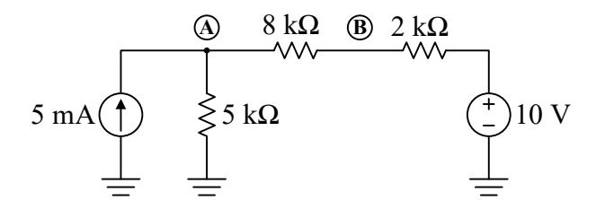

Solving

$$200 = 13V_{A} - (40 + V_{A})$$

$$240 = 12V_{A}$$

$$V_{A} = 20 \text{ V}$$

$$5V_{B} - 20 = 40$$

$$V_{B} = 12 \text{ V}$$

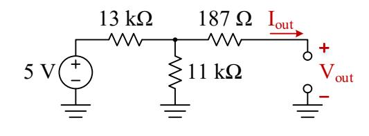

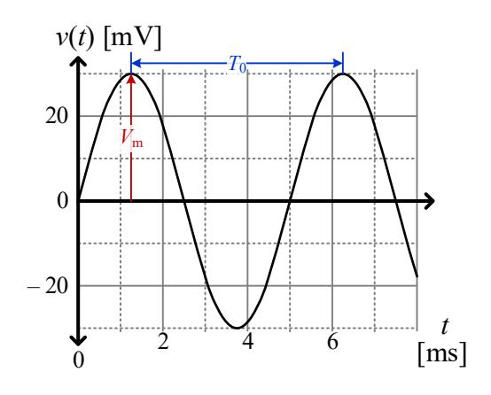

## Part d) [4 Marks]

Choose  $R_1$  and  $R_2$  so that  $V_{\text{ref}} = 1.2 \text{ V}$  and the total power dissipated by  $R_1$  and  $R_2$  does not exceed 1 mW. Demonstrate through calculation that the power requirement is met.

$$+3.3 \text{ V}$$

$$R_1$$

$$R_2$$

$$R_1 = 1.75R_2 (6.93 \text{ k}\Omega \text{ min})$$
  
 $R_2 = 3.96 \text{ k}\Omega \text{ min}$ 

#### Voltage constraint:

$$V_{\text{ref}} = 3.3 \frac{R_2}{R_1 + R_2}$$

$$1.2(R_1 + R_2) = 3.3R_2$$

$$R_1 = \frac{(3.3 - 1.2)R_2}{1.2} = \frac{2.1}{1.2}R_2 = 1.75R_2$$

#### **Power constraint:**

$$P_{\text{Total}} = P_{\text{R}_1} + P_{\text{R}_2} = \frac{V_{\text{Total}}^2}{R_{\text{Total}}} = \frac{3.3^2}{R_1 + R_2} \le 1 \text{ mW}$$
  

$$\therefore \frac{3.3^2}{1\text{m}} \le R_1 + R_2$$

$$R_1 + R_2 \ge 10.89 \text{ k}\Omega$$

At the lower limit, this leads to  $R_1 = 6.93 \text{ k}\Omega$ , and  $R_2 = 3.96 \text{ k}\Omega$ , so anything larger than these values that maintains the ratio is correct. It is also acceptable to choose a reasonable starting value and then demonstrate afterwards that the power requirement is met. For example,  $R_2 = 10 \text{ k}\Omega$  gives  $R_1 = 17.5 \text{ k}\Omega$ , then show that  $P_{\text{Total}} \leq 1 \text{ mW}$ .

## Part e) [3 Marks]

Determine the Thevenin equivalent circuit parameters,  $V_{Th}$  and  $R_{Th}$ , for node A with respect to node B.

$$V_{\rm Th} = 4.2 \, \mathrm{V}$$
 $R_{\rm Th} = 2.1 \, \Omega$ 

Use whatever approach you're most comfortable with. Here is simplification via source transforms:

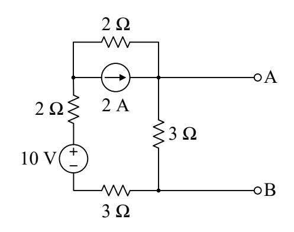

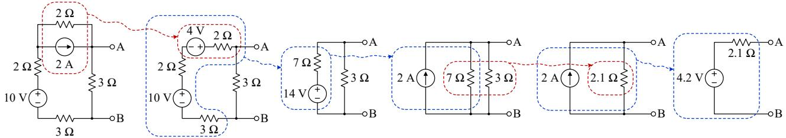

## Part f) [4 marks]

Determine the resistance  $R_f$ , to achieve a closed-loop gain  $A_{ideal} = 20$  [V/V]. Assuming that both resistors have a ±5% tolerance, determine the worst-case maximum and minimum gains,  $A_{\text{max}}$  and  $A_{\text{min}}$ .

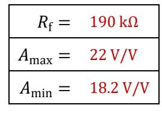

$$A_{\text{max}} = 22 \text{ V/V}$$
  $A = 1 + \frac{R_f}{R_i}$ ,  $R_f = (A - 1)R_i = (20 - 1) \times 10 \text{k} = 190 \text{ k}\Omega$ 
 $A_{\text{min}} = 18.2 \text{ V/V}$   $A_{\text{max}} = 1 + \frac{R_{f,\text{max}}}{R_{i,\text{min}}} = 1 + \frac{1.05 \times 190}{0.95 \times 10} = 22 \text{ V/V}$ ,

 $A_{\text{min}} = 1 + \frac{R_{f,\text{min}}}{R_{i,\text{max}}} = 1 + \frac{0.95 \times 190}{1.05 \times 10} = 18.2 \text{ V/V}$ .

## **Part g)** [4 marks]

A lab voltage supply is modelled as a Thevenin-equivalent circuit, as shown. When two different loads are connected one after the other (not shown), the following two operating points are observed:

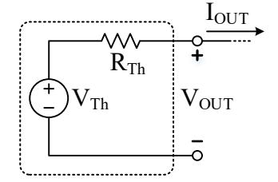

Vout

47 kΩ

–2.5 V

+5 V

4.7 kΩ 47 kΩ

• 
$$V_{\text{OUT}} = 3.298 \text{ V} @ I_{\text{OUT}} = 30 \text{ mA}$$

• 
$$V_{\text{OUT}} = 3.286 \text{ V} @ I_{\text{OUT}} = 270 \text{ mA}$$

Determine the Thevenin-equivalent voltage and resistance of the output.

$$V_{\rm Th} = 3.300 \,\mathrm{V}$$

$$R_{\rm Th} = 50 \,\mathrm{m}\Omega$$

$$R_{\rm Th} = \frac{\Delta V_{\rm OUT}}{\Delta I_{\rm OUT}} = \frac{12 \text{ mV}}{240 \text{ mA}} = 50 \text{ m}\Omega$$

If this wasn't apparent, you could use the KVL equation below with both data points to solve two equations in two unknowns. Th can be determined via KVL:

$$V_{\text{Th}} - I_{\text{OUT}} R_{\text{Th}} - V_{\text{OUT}} = 0$$
  
 $V_{\text{Th}} - 30 \text{m} \times 50 \text{m} - 3.298 = 0$   
 $\therefore V_{\text{Th}} = 3.300 \text{ V}$ 

# **Part h)** [6 Marks]

Determine the maximum and minimum allowable values of in-, in-,max and in-,min.

| 𝑉𝑉in-,max = | 2.25 V |
|----------------|--------|
| 𝑉𝑉in-,min = | 1.5 V  |

This is a difference amplifier:

$$V_{\text{out}} = \frac{R_{\text{f}}}{R_{\text{i}}} (V_{\text{in+}} - V_{\text{in-}}) = \frac{47}{4.7} (2 - V_{\text{in-}})$$
  
= 20 - 10 $V_{\text{in-}}$ 

When in-increases, out decreases, and vice versa. So, in-,max will be associated with the *minimum* allowable output voltage (−2.5 V) and in-,min will be associated with the maximum allowable output voltage (+5 V):

$$V_{\rm out,min} = -2.5 = 20 - 10V_{\rm in-,max}$$
,  $\therefore V_{\rm in-,max} = 2.25 \, \rm V$   
 $V_{\rm out,max} = 5 = 20 - 10V_{\rm in-,min}$ ,  $\therefore V_{\rm in-,min} = 1.5 \, \rm V$ 

## **Part i)** [5 Marks]

**Lab Safety:** Circle the most correct answer for each question.

- 1) What type of footwear is not allowed in the lab?
  - A. Sneakers
  - B. Running shoes
  - **C. Sandals**
  - D. Boots
- 2) Why is it dangerous to bring liquids into the lab?
  - **A. They can cause fire or electrocution.**
  - B. They could stain the lab manuals.
  - C. They can damage the breadboards.
  - D. It's just a general rule.

3) When preparing to measure current using a multimeter, which configuration is safe and correct?

4.7 kΩ

Vin–

+2 V

- A. Connect the meter in parallel with the powered circuit and set it to voltage mode.
- B. Connect the meter directly across any charged capacitors and set it to resistance mode.
- C. Connect the meter in parallel with the circuit component and set it to current mode.
- **D. Connect the meter in series with the powered circuit and set it to current mode.**

- 4) You notice a frayed power cable on your lab power supply. What should you do?
  - A. Wrap the frayed cable securely with electrical tape and continue using it.
  - B. Inform your lab instructor immediately and avoid using the equipment.
  - C. Switch the unit off periodically to prevent overheating.
  - D. Handle the cable carefully, avoiding direct contact with the frayed area.

- 5) Before changing components in your circuit, you must first:
  - A. Lower the voltage slightly to avoid large current spikes.
  - B. Turn off the power supply and discharge all capacitors.
  - C. Ground the negative terminal of your power supply to the lab bench.
  - D. Confirm the circuit is functioning correctly to avoid misdiagnosing faults.

## **Ouestion 2**

[10 Marks]

Find the unknown node voltages and circle the supernode.

$$V_{A} = 20 \text{ V}$$

$$V_{B} = 14 \text{ V}$$

$$V_{C} = 4 \text{ V}$$

$$V_{B} = V_{C} + 10$$

$$V_{C} = 10 \text{ V}$$

$$V_{C} = 10 \text{ V}$$

$$V_{C} = 10 \text{ V}$$

$$V_{C} = 10 \text{ V}$$

Supernode in red

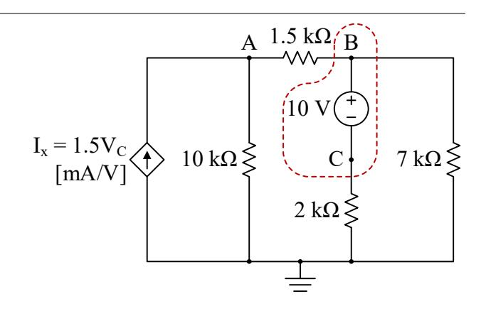

## **Question 3**

[8 Marks]

Determine  $V_A$ ,  $V_{out}$ ,  $I_1$ , and  $I_2$ .

| $V_{\rm A} =$   | -0.4 V |
|-----------------|--------|
| $V_{\rm out} =$ | -6.8 V |
| $I_1 =$         | 20 μΑ  |
| $I_2 =$         | 112 μΑ |

It's almost an inverting amplifier, but the feedback network looks too complicated to use  $A = -R_f/R_i$ . Since there's CLNF, start there. The opamp sets  $V_{-} = V_{+} = 0$  V. We can now do nodal at  $V_{-}$  and  $V_{A}$ :

KCL @ 
$$V_{-}$$
:
$$\frac{V_{-} - 0.12}{6} + \frac{V_{-} - V_{A}}{20} = 0$$
Since  $V_{-} = 0$  V:
$$-\frac{0.12}{6} - \frac{V_{A}}{20} = 0$$

$$\therefore V_{A} = -0.4 \text{ V}$$

EL @ 
$$V_{-}$$
:
$$\frac{V_{-} - 0.12}{6} + \frac{V_{-} - V_{A}}{20} = 0$$

$$\cot V_{-} = 0 \text{ V:}$$

$$-\frac{0.12}{6} - \frac{V_{A}}{20} = 0$$

$$\cot V_{A} = -0.4 \text{ V}$$

$$KCL @ V_{A}:$$

$$\frac{V_{A} - V_{-}}{20} + \frac{V_{A} - 0}{60} + \frac{V_{A} - V_{out}}{240} = 0$$

$$\frac{0.4}{20} + \frac{0.4}{60} + \frac{0.4 + V_{out}}{240} = 0$$

$$\therefore V_{out} = -6.8 \text{ V}$$

$$I_{1} = \frac{0.12 - 0}{6} = 20 \text{ } \mu\text{A}$$

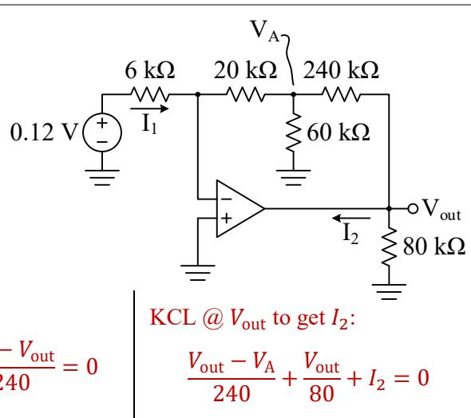

## **Question 4**

[10 Marks]

## Part a) [5 Marks]

Given  $\omega_0 = 25 \text{ krad/s}$ , determine the impedances of L and C ( $Z_L$ , and  $Z_C$ , respectively), and the equivalent impedance at node a with respect to node b,  $Z_{ab}$ .

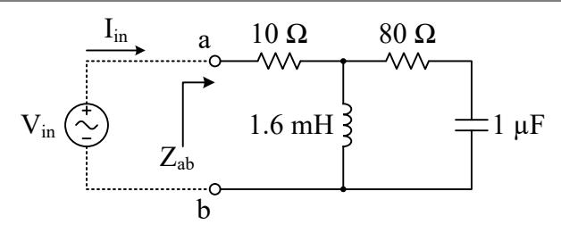

$$Z_{L} = j40 \Omega = 40 \angle 90^{\circ} \Omega$$

$$Z_{C} = -j40 \Omega = 40 \angle -90^{\circ} \Omega$$

$$Z_{ab} = 30 + j40 \Omega = 50 \angle 53^{\circ} \Omega$$

$$Z_{L} = j40 \Omega = 40 \angle 90^{\circ} \Omega$$

$$Z_{C} = -j40 \Omega = 40 \angle -90^{\circ} \Omega$$

$$Z_{L} = j\omega_{0}L = j \times 25k \times 1.6m = j40 \Omega = 40 \angle 90^{\circ} \Omega$$

$$Z_{C} = \frac{1}{j\omega_{0}C} = -\frac{j}{25k \times 1\mu} = -j40 \Omega = 40 \angle -90^{\circ} \Omega$$

$$\begin{split} Z_{ab} &= 10 + [Z_L \parallel (80 + Z_C)] \\ &= 10 + [j40 \parallel (80 - j40)] \\ &= 10 + \left(\frac{1}{j40} + \frac{1}{80 - j40}\right)^{-1} \\ &= 10 + \left(\frac{80 - j40 + j40}{j40(80 - j40)}\right)^{-1} \\ &= 10 + \frac{j40(80 - j40)}{80} \\ &= 10 + j20(2 - j) \\ &= 10 + j40 + 20 \\ &= 30 + j40 \Omega = 50 \angle 53^{\circ} \Omega \end{split}$$

## Part b) [2 Marks]

The voltage applied to node a is  $V_{\rm in}=10 \angle 0^{\circ}\, \rm V_{RMS}$ . Determine the current entering the circuit,  $I_{\rm in}$ .

$$I_{\text{in}} = 0.12 - \text{j}0.16 \text{ A} = 0.2\angle - 53^{\circ} \text{ A}$$
  $I_{\text{in}} = \frac{V_{\text{in}}}{Z_{\text{ab}}} = \frac{10\angle 0^{\circ}}{50\angle 53^{\circ}} = 0.12 - \text{j}0.16 \text{ A} = 0.2\angle - 53^{\circ} \text{ A}$ 

## Part c) [3 Marks]

Determine the real and reactive power at the input,  $P_{\rm in}$  and  $Q_{\rm in}$ , respectively. Then, express this as a complex power phasor,  $S_{in}$ . Be sure to include the correct units.

$$P_{\text{in}} = 1.2 \text{ W}$$
 $Q_{\text{in}} = 1.6 \text{ VAR}$ 
 $S_{\text{in}} = 1.2 + \text{j}1.6 \text{ VA} = 2 \angle 53^{\circ} \text{ VA}$ 

$$S_i = V_{in}I_{in}^* = 10(0.12 + j0.16) = 1.2 + j1.6 \text{ VA} = 2 \angle 53^\circ \text{ VA}$$

## **Question 5**

[10 Marks]

The Thevenin equivalent circuit of a 5 V USB charger output is shown in the dashed box of Figure a). A long cable with inductance  $L_{\text{Cable}}$  connects the charger output to a load,  $R_{\text{L}}$ .

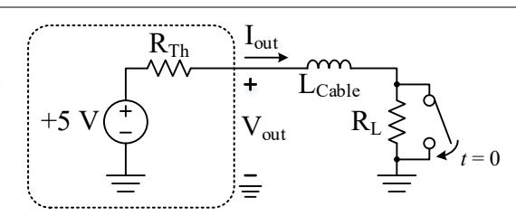

#### Part a) [4 Marks]

| $R_{\mathrm{Th}} =$ | 50 Ω     |
|---------------------|----------|
| $I_{\text{out}} =$  | 497.5 μΑ |

Ignore the switch for now. When no load is connected,  $V_{\rm out} = 5.000 \, \rm V$ . However,  $V_{\rm out}$  stabilizes at 4.975 V when a load  $R_{\rm L} = 10 \, \rm k\Omega$  is connected. Determine  $R_{\rm Th}$  and  $I_{\rm out}$ .

$$V_{\rm out} = V_{\rm Th} \frac{R_{\rm L}}{R_{\rm L} + R_{\rm Th}}, \therefore R_{\rm Th} = \frac{V_{\rm Th} R_{\rm L}}{V_{\rm out}} - R_{\rm L} = \frac{5 \times 10 \rm k}{4.975} - 10 \rm k = 50 \ \Omega$$

$$I_{\rm out} = \frac{V_{\rm out}}{R_{\rm L}} = \frac{4.975}{10 \rm k} = 497.5 \ \mu \rm A$$

## Part b) [6 Marks]

 $L_{\text{Cable}}$  is measured to be 4  $\mu$ H. A short occurs at time t = 0, modelled as a switch closing around  $R_{\text{L}}$ . Determine an expression for the output current,  $I_{\text{out}}(t)$ , valid for  $t \ge 0$ . Determine  $V_{\text{out}}(t = 100 \text{ ns})$ 

$$I_{\text{out}}(t) = 100 - 99.5e^{-\frac{t}{800}} \text{ [mA]}$$
  $I_{\text{i}} = 497.5 \,\mu\text{A}$   $I_{\text{f}} = I_{\text{sc}} = \frac{V_{\text{Th}}}{R_{\text{Th}}} = \frac{5}{50} = 100 \,\text{mA}$   $\tau = \frac{L_{\text{Cable}}}{R_{\text{Th}}} = \frac{4\mu}{50} = 80 \,\text{ns}$ 

$$\therefore I_{\text{out}}(t) = I_{\text{f}} + (I_{\text{i}} - I_{\text{f}})e^{-\frac{t}{\tau}} = 100 - 99.5e^{-\frac{t}{800}} \text{ [mA]}$$

Given this current, the output voltage is determined by the drop across  $R_{Th}$ :

$$I_{\text{out}}(t = 100 \text{ ns}) = 100 - 99.5e^{-\frac{100 \text{n}}{80 \text{n}}} \text{[mA]} = 71.5 \text{ mA}$$
  
 $V_{\text{out}}(t = 100 \text{ ns}) = V_{\text{Th}} - I_{\text{out}}(t = 100 \text{ ns}) R_{\text{Th}} = 5 - 71.5 \text{m} \times 50 = 1.425 \text{ V}$ 

## **Question 6**

[6 Marks]

A sensor generates a step output voltage signal,  $V_s = 0 \rightarrow 5$  V when a dangerous material falls during handling. The system must be immediately disabled when  $V_s$  exceeds 1.4 V with no more than a 3  $\mu$ s delay. An opamp comparator (LM393A) ensures there is minimal output delay once  $V_+ > V_-$ , however, the sensor's output resistance,  $R_s$ ,

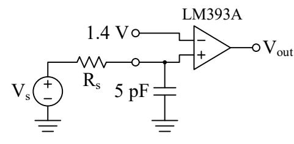

interacts with the comparator's 5 pF input capacitance to cause an RC switching delay.

 $R_{\rm s,max} = 1.83 \, {\rm M}\Omega$  Assuming that the sensor triggers  $(V_{\rm s} = 0 \rightarrow 5 \, {\rm V})$  at t = 0, determine the maximum allowable sensor output resistance,  $R_{\rm s,max}$ , so that the noninverting input voltage  $V_{+} = 1.4 \, {\rm V}$  at  $t = 3 \, {\rm \mu s}$ . Anything larger than this resistance causes a time constant that is too slow.

$$\begin{split} V_{\rm i} &= 0 \text{ V}, V_{\rm f} = 5 \text{ V}, \tau = R_{\rm S} C_{+} \\ V_{+}(t) &= V_{\rm f} + (V_{\rm i} - V_{\rm f}) e^{-\frac{t}{R_{\rm S} C_{+}}} = 5 - 5 e^{-\frac{t}{R_{\rm S} 5 \rm p}} \\ & \div 1.4 = 5 - 5 e^{-\frac{3 \mu}{R_{\rm S,max} \times 5 \rm p}} \\ e^{-\frac{600 \text{k}}{R_{\rm S,max}}} &= 0.72, \div R_{\rm S,max} = -\frac{600 \text{k}}{\ln 0.72} = 1.83 \text{ M}\Omega \end{split}$$