# ECE 192 Spring 2026 Comparison Methods – Part 1.

Presented by: Ivan Calero

ECE Department

## OUTLINE

- Introduction
- Type of projects
- Minimum Acceptable Rate of Return (MARR)
- Comparison Methods:
  - Present Worth.
  - Annual Worth.
  - Future Worth.
  - Payback Period.

## Introduction

- The idea of investing is giving up something valuable now for the expectation of receiving something of greater value later.
- However, not all investments opportunities should be taken:
  - If expected returns outweigh the costs, then the project (investment opportunity) may be pursued.
- Multiple projects in consideration:
  - Present Worth method (PW)
  - Annual Worth method (AW)
  - Future Worth method (FW)
  - Payback period method

## Introduction

- Several assumptions are made in the comparison methods:
  - Costs and benefits are always possible to be measured in terms of money.
  - Future cash flows are deterministic.
  - No inflation/deflation in cash flows (unless otherwise stated).
  - Sufficient funds available to implement all projects in consideration (unless otherwise stated).
  - Taxes are not applicable.
  - All investments have a cash flow at the start (upfront cost, initial cost, initial investment).
  - Cash generated by the project is reinvested in the project at rate that is equal to the discount rate (MARR), which does not change during the duration of the project.

## Type of Projects

- Projects may be categorized in three groups in terms of their connection with other projects:
  - Independent: Two projects are independent if the expected costs and expected benefits of each project do not depend on whether the other one is chosen:
    - For example, buying computer vs air conditioner; installing a new production line vs updating specialized financial software.
  - Mutually Exclusive: Projects which cannot be implemented at the same time, or would not make sense to do both:
    - For example, buying a computer of brand A vs brand B; two different plant designs for the same piece of land.
  - Related but not mutually exclusive: The expected cost and benefits of one project depend on whether the other is chosen:
    - For example, hiring one of two waiters for a restaurant (A and/or B), with two different level of experience.

#### **Type of Projects**

- Related but not mutually exclusive choices:
  - Do nothing.
  - Hire waiter A; more experienced, but demands higher wage. Faster attention, more tables per hour served, etc.
  - Hire waiter B; less experienced, but lower wage.
  - Hire both.
- Evaluation of related but not mutually exclusive projects can be simplified by combining them into mutually exclusive sets; e.g., four sets in the previous example.
- The total number of possible combinations (including do nothing) is  $2^n$ , where n is the number of individual projects.
- Potential combinations should be checked for feasibility.
- Special cases:
  - Resource constraints: a limit number of simultaneous projects can be implemented; e.g., installing *x* number of 2-MWwind turbines in a wind farm.
  - One project is contingent on another: Project A can be done alone, project A and B can be done together; but project B cannot be done by itself, hence, we say B is contingent on A. E.g., Installing a gas turbine with a recuperator.

## Minimum Acceptable Rate of Return (MARR)

- It is the minimum return, expressed as an interest rate, that a company is willing to obtain on an investment:
  - Projects earning at least the MARR are considered attractive because the money invested is earning as much as can be earned elsewhere.
- The MARR can also be viewed as the rate of return required to get investors to invest in a business (cost of capital).

# Net Present Worth (NPW) Analysis

- The Net Present Worth (NPW) method, also called Net Present Value (NPV), is one of the discounted cash flow techniques for project evaluation, which considers the time value of money.
- In the NPW criterion, the present worth of all cash inflows is compared against the worth of all cash outflows associated with an investment project.
- The difference between the present worth of these cash flows, referred to as the net present worth (NPW) or NPV, determines whether the project is an acceptable investment.
- The most convenient point at which to calculate the equivalent values, is often at time = 0.

# Net Present Worth (NPW) Analysis

- Procedure to calculate the NPW of a project:
  - Determine the interest rate, , the firm uses for investments.
  - Estimate the service life of the project, .
  - Estimate the cash inflow/outflow for each period, over the service life.
  - Determine the net cash flow in period , denoted by :

$$CF_k = Cash inflow_k - Cash outlfow_k$$

▪ Calculate the discounted cash flows at year zero using the interest rate :

$$CF_k^{(0)} = CF_k(P/F, i, k)$$

▪ Add all the discounted cash flows at year zero to find the Net Present Worth (NPW):

$$NPW(i) = \sum_{k=0}^{N} CF_k^{(0)}$$

▪ Project cash flows:

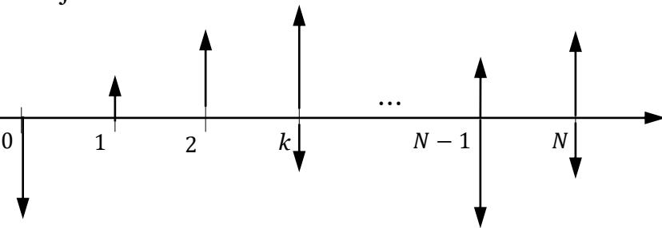

▪ Net cash flows before discounting:

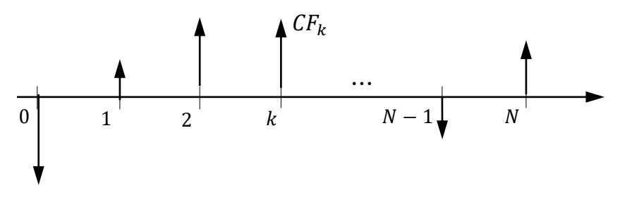

▪ Net Present Worth (NPW):

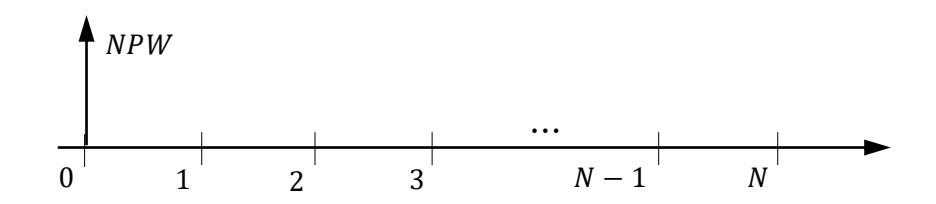

# Net Present Worth (NPW) Analysis

- Present Worth Comparisons:
  - Independent projects:
    - The alternative of investing money is "to do nothing".
    - Project is acceptable if the NPW is greater than zero.
  - Mutually Exclusive Projects (same service life):
    - Calculate the NPW of each project.
    - Project with greatest NPW is the preferred alternative because it is the one with the largest profit.
  - For related but not mutually exclusive projects, we first transform them into mutually exclusive projects, and proceed as explained in the last bullet.

# Annual Worth (AW) Analysis

- The AW represents a measure of project profitability as an equivalent annual value:
  - All receipts and disbursements are transformed to uniform series at the MARR.
- PW and AW yield the same conclusion, since any Present Amount can be converted into an Annuity using the capital recovery factor (/, , ); hence, = /, , .
- The reason for using AW instead of PW is that the concept of annual savings/payments/costs can be more easily grasped; especially when discussing annual costs.
- Sometimes mutually exclusive projects are compared in terms of their annual costs; in such case, the AW method is called Annual Equivalent Cost (AEC).

# Annual Worth (AW) Analysis

- To calculate the AW, convert single cash flows (initial investments, salvage value, etc.) or gradient series cash flows, to annuities using the corresponding compound factors, and add them up to the existing annuities.
- The annual equivalent of the initial investment and salvage value, over the life of the project, is called Capital Recovery Cost and is calculated as:

$$CR(i) = P(A/P, i, N) - S(A/F, i, N)$$

$$CR(i) = (P - S)(A/P, i, N) + iS$$

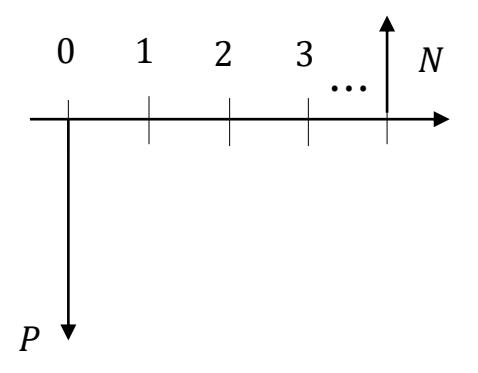

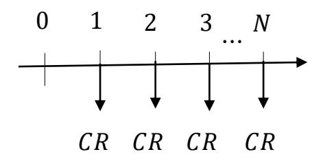

# Annual Worth (AW) Analysis

- Annual Worth Comparisons:
  - Independent projects:
    - The alternative of investing money is "to do nothing".
    - Project is acceptable if the AW is greater than zero.
  - Mutually Exclusive Projects (same service life):
    - Calculate the AW of each project.
    - Project with greatest AW is the preferred project because it is the one with the largest profit.
    - For Annual Equivalent Cost (AEC) comparisons, the project with the least annual cost is the preferred. Two conditions must hold for AEC comparisons:
      - All projects have the same major benefit.
      - Estimated value of the major benefit clearly outweighs the project costs, even it that estimate is imprecise.

# Future Worth (FW) Analysis

- Measures the surplus in an investment project at a time, other than = 0.
- This is particularly useful in an investment situation in which we need to compute the equivalent worth of a project at the end of its investment period; e.g., when money is save for future expense (retirement plan).
- The analysis and conclusions about the FW is the same as the NPW, being the only difference the computation of the FW value:

$$CF_k = \text{Cash inflow}_k - \text{Cash outlfow}_k$$

$$FW(i) = \sum_{k=0}^{N} CF_k (F/P, i, N-k)$$

# Comparison of Projects with Unequal Lives

- When making PW comparisons, alternatives must be evaluated considering the same time period in order to take into account the full benefits and costs of each alternative.
- If this is not the case, one of the following methods can be used:

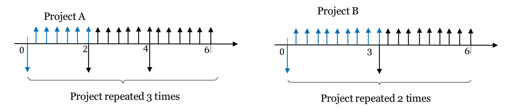

- Repeated lives method: Repeat each alternative to arrive at a common time period for all alternatives, using the least common multiple of the alternatives' service lives.
  - A key assumption in this method is that the all the cash flows (costs, benefits, installation cost, and salvage value) remain the same in the subsequent project cycles.
- Study period: Define a common period for all the alternatives (usually the smallest ), and consider the salvage value of all alternatives at .

▪ A mechanical engineer has decided to introduce automated materials-handling equipment for a production line. She must choose between building the equipment or buying equipment off the shelf. If the MARR is 9%, which alternative is better? The data of each alternative is as follows:

|                    | Alternative 1 | Alternative 2 (off-shelf) |
|--------------------|---------------|---------------------------|
| First cost (\$)    | 15,000        | 25,000                    |
| O&M cost (\$/year) | 6,400         | 5,625                     |
| Service life       | 10            | 15                        |

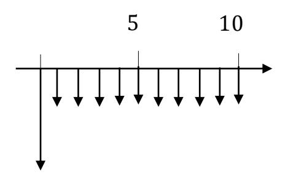

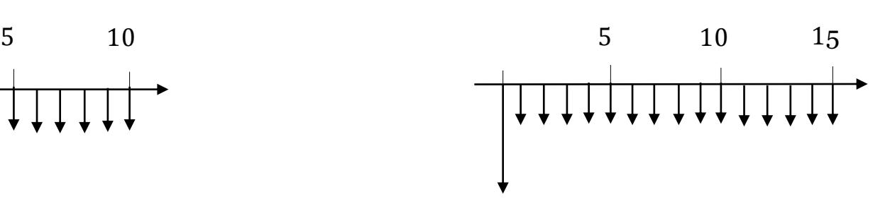

▪ Present Wroth without repeated live assumption:

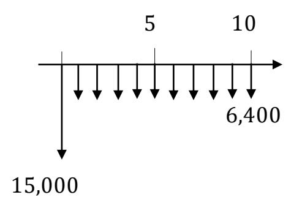

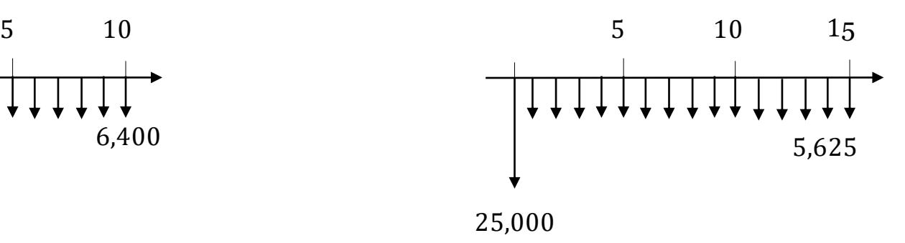

$$PW_1 = -15,000 - 6,400(P/A,9\%,10) = -\$56,073$$

$$PW_2 = -25,000 - 5,625(P/A, 9\%, 15) = -\$70,341$$

▪ Present Worth assuming repeated lives:

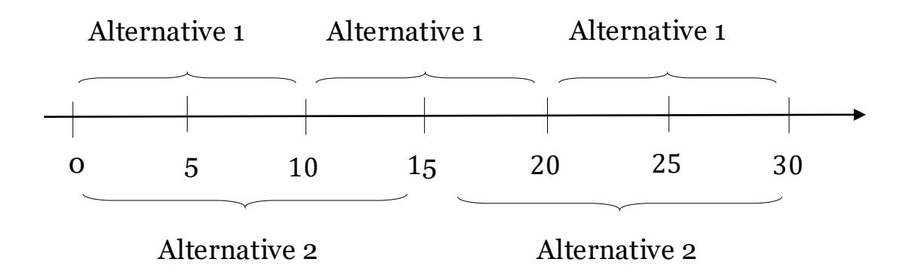

$$PW_1 = -15,000 - 15,000(P/F, 9\%, 10) - 15,000(P/F, 9\%, 20) - 6,400(P/A, 9\%, 30)$$
  
$$PW_1 = -\$89,760$$

$$PW_2 = -25,000 - 25,000(P/F, 9\%, 15) - 5,625(P/A, 9\%, 30)$$
  
$$PW_2 = -\$89,649$$

▪ Future Worth assuming repeated lives:

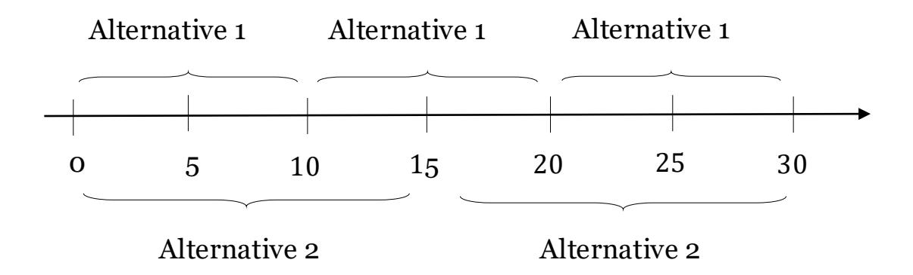

$$FW_1 = -15,000(F/P, 9\%, 30) - 15,000(F/P, 9\%, 20) - 15,000(F/P, 9\%, 10) - 6,400(F/A, 9\%, 30)$$
$$FW_1 = -\$ 1.263M$$

$$FW_2 = -25,000(F/P, 9\%, 30) - 25,000(F/P, 9\%, 15) - 5,625(F/A, 9\%, 30)$$
  
$$FW_2 = -\$1.189M$$

▪ Annual Worth assuming repeated lives:

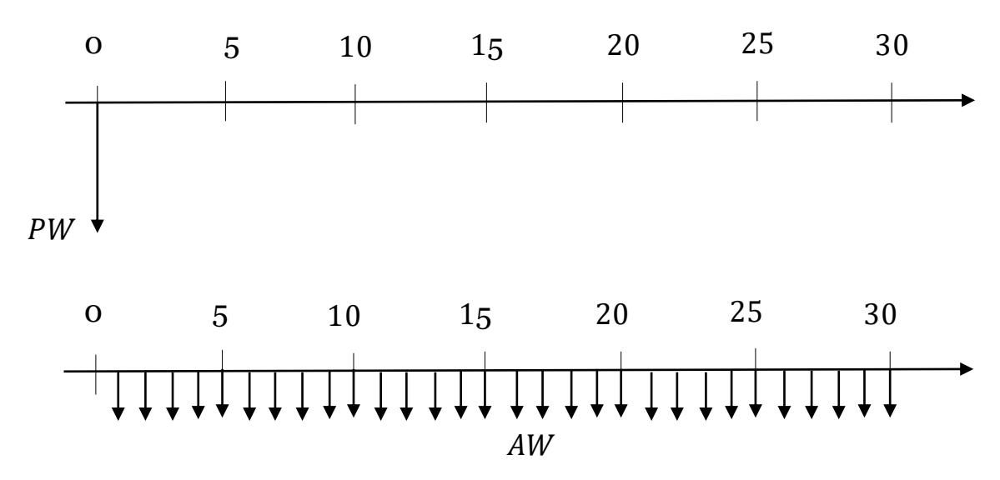

$$AW_1 = PW(1)(A/P, 9\%, 30) = -89,760(A/P, 9\%, 30)$$
  
$$AW_1 = -\$8,737$$

$$AW_2 = PW(2)(A/P, 9\%, 30) = -89,649(A/P, 9\%, 30)$$
  
 $AW_2 = -\$8,726$ 

- Assuming alternatives can be repeated indefinitely:
  - Since the annual costs of an alternative remain the same no matter how many times it is repeated, the least common multiple of the service lives is not necessary:

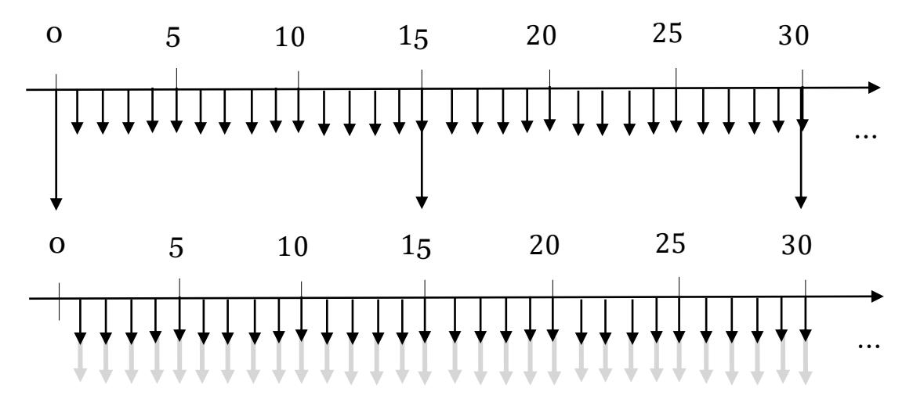

$$AW_1 = -15,000(A/P, 9\%, 10) - 6,400 = -\$8,737$$

$$AW_2 = -25,000(A/P, 9\%, 15) - 5,625 = -\$8,726$$

# Comparison of Projects with Unequal Lives

- Assuming repeated-lives does not hold; then use the study period method:
  - A salvage value of \$5,000 at = 10 (shortest service life of the two projects) is estimated for the off-the-shelf alternative (alternative 2), so that both can be comparable:

$$PW_1 = -15,000 - 6,400(P/A, 9\%, 10) = -\$56,073$$

$$PW_2 = -25,000 - 5,625(P/A,9\%,10) + 5,000(P/F,9\%,10) = -\$58,987$$

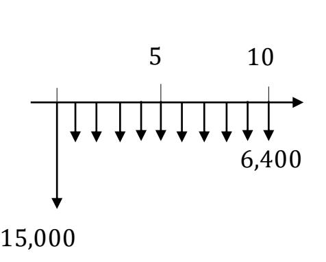

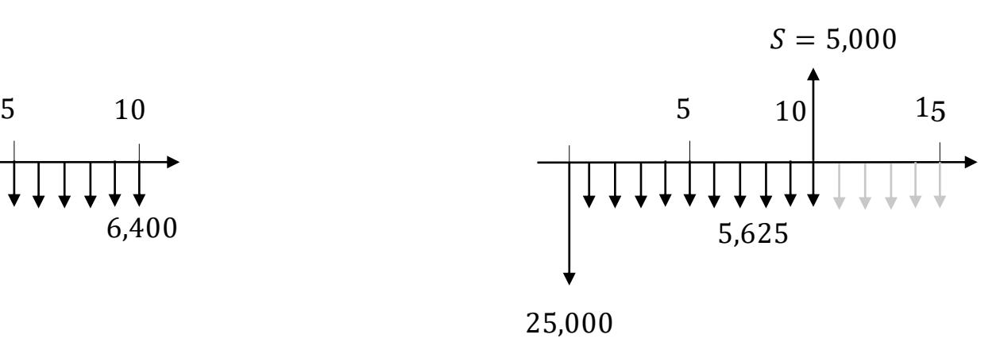

- Assuming repeated-lives does not hold; then use the study period method:
  - Instead of estimating the Salvage Value, one can **calculate** a salvage value that would make both alternatives equal.
  - Then, one can decide weather this calculated salvage value is above or below a reference (desired) salvage value ∗ (\$5,000 in this example).
  - If the calculation of is below ∗ , then the alternative for which is was found, is chosen.
  - If the calculation of is above ∗ , then the other option is chosen:

$$PW_1 = PW_2$$

$$-56,073 = -25,000 - 5,625(P/A, 9\%, 10) + S(P/F, 9\%, 10)$$

 = \$11,834 > ∗ ; alternative 1 is preferred

# Payback Period

- It is the simplest method of judging the economic viability of projects.
- It is a rough estimation of the time it takes for an investment to pay for itself, assuming that the receipts are same every year:

Payback period = 
$$\frac{\text{Initial Investment}}{\text{Annual Savigns}}$$

- The project with the shortest payback period is the preferred investment.
- If annual savings **are not constant**, the payback period is calculated by deducting each year of savings from the first cost until the first cost is recovered.
- Advantages:
  - Very easy to understand and calculate.
  - It accounts for the need of quick capital recovery.
- Drawbacks:
  - It discriminate against long-term projects.
  - Ignores the effect of time value of money (no interest rate considered).
  - Ignores expected service life.

- Calculate the payback period for the two projects discussed in slide 16, assuming that alternative 1 generates a constant revenue equal to \$10,000/year; while alternative 2, \$11,000/year.
- Solution:

Payback period1 = 
$$\frac{15,000}{10,000 - 6,400}$$
 = 4.16 years

Payback period2 = 
$$\frac{25,000}{11,000 - 5,625}$$
 = 4.65 years

# **Payback Period**

 Discounted Payback period is the number of years required to recover the investment from discounted cash flows:

Discounted Payback period = 
$$\frac{\text{First cost}}{\sum_{k=0}^{U} \frac{\text{Annual Savings}_k}{(1+i)^k}}$$

- Where *U* is the period at which the cumulative discounted Annual Savings equals the first cost.
- The project with the shortest pay back period is the preferred.

## REFERENCES

▪ N. M. Fraser, Jewles. E.M., and Pirnia, M., Engineering Economics: Financial Decision Making for Engineers, 6th ed., Pearson Canada, 2016.