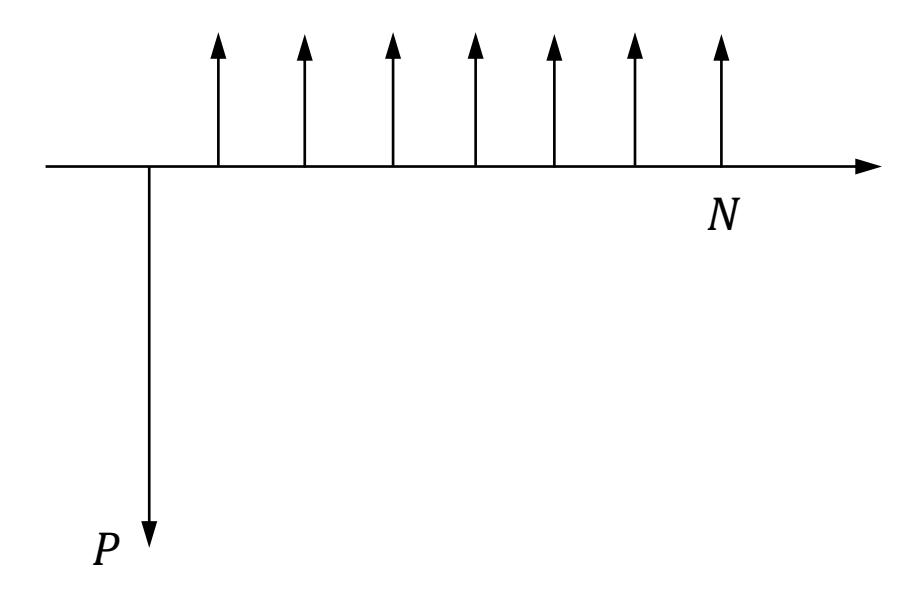
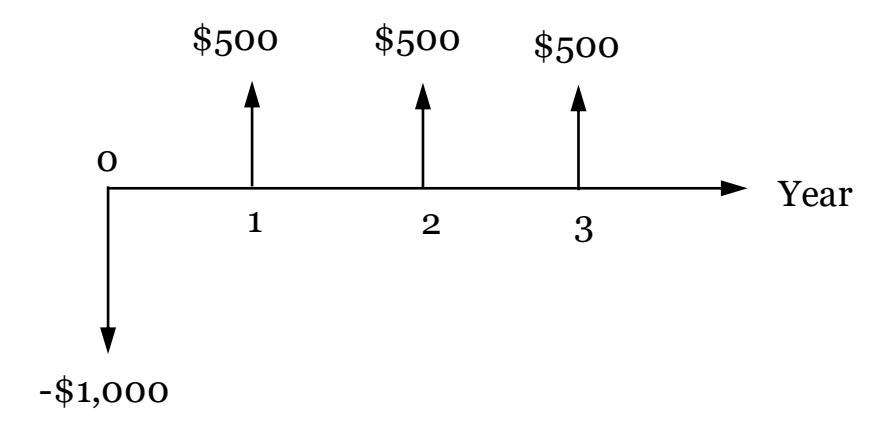
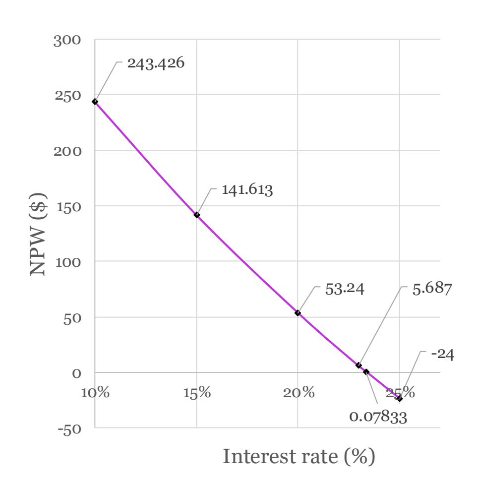
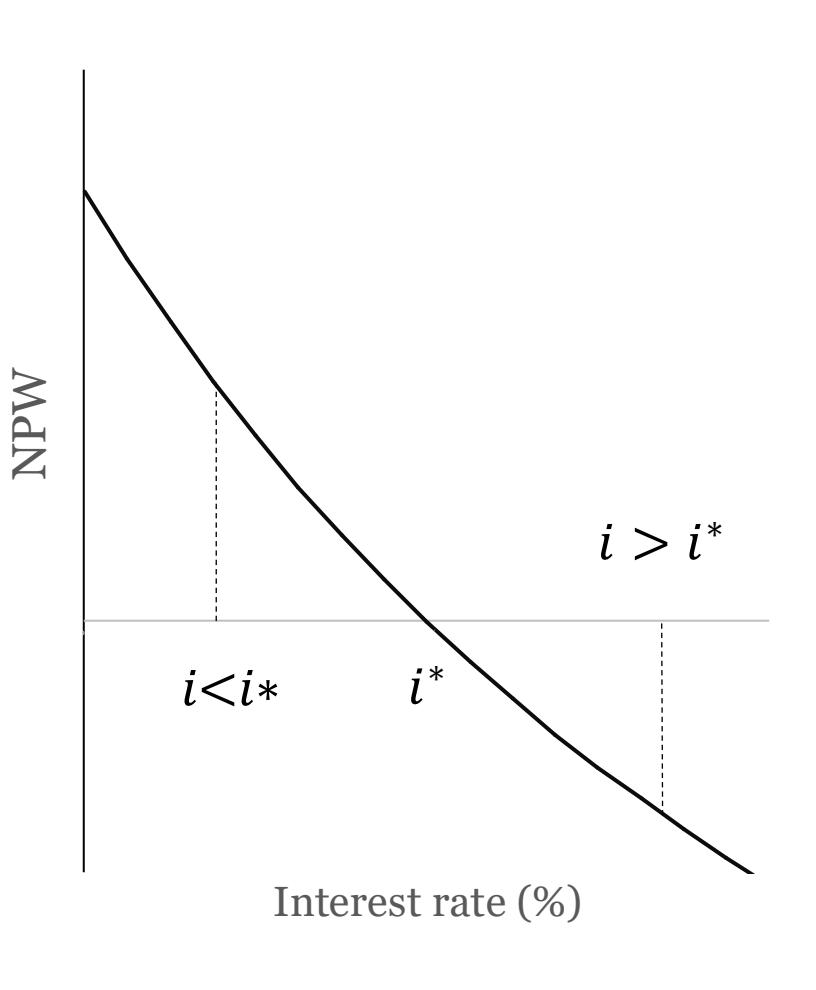
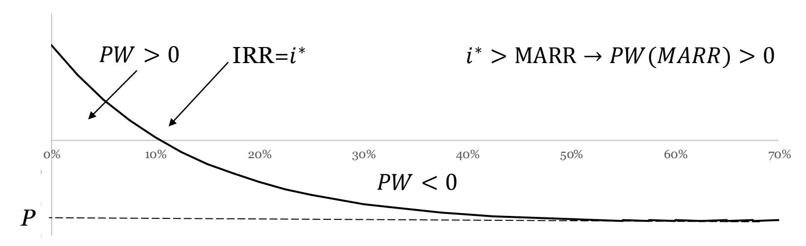
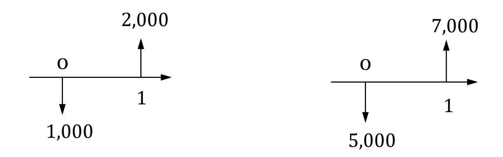
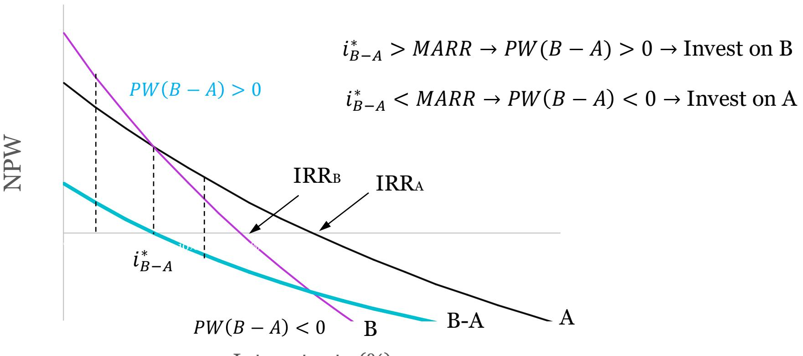
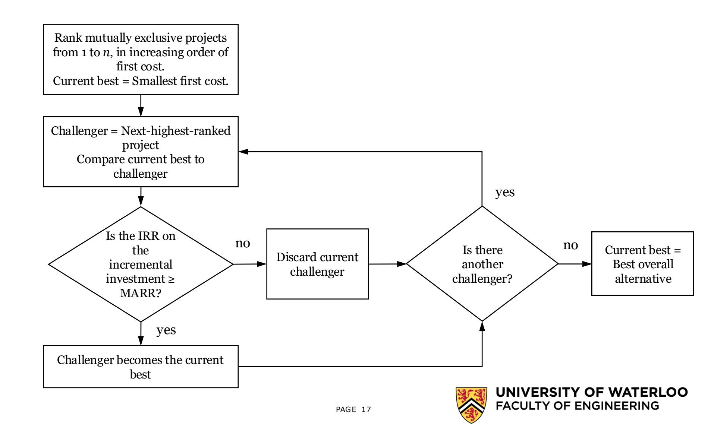

# ECE 192 Spring 2026 Comparison Methods – Part 2.

Presented by: Ivan Calero

ECE Department

### OUTILNE

- Internal Rate of Return (IRR)
  - Definitions
  - Calculation
  - IRR as a tool for projects comparison:
    - IRR for independent projects
    - IRR for mutually exclusive projects

### Introduction

- What is the Rate of Return of an investment?
  - The idea of investing is giving up something valuable now for the expectation of receiving something of greater value later.
  - The profitability of that investment can be measured as a rate of return per dollar invested, or interest rate.
  - The Rate of Return (RoR) is the net gain of an investment, measured as a proportion of the initial investment, over a specified time period.
  - For example:
    - An investment of \$1,000 that pays \$1,100 after one year, has a net profit of \$100, or RoR = 10%.

### Internal Rate of Return (IRR)

#### ▪ Definition:

- The rate of return usually calculated for a project is known as the Internal Rate of Return (IRR).
- The IRR on an investment is the interest rate ∗ that makes the present worth of the cash inflows be equal to the present worth of the cash outflows:

$$\sum_{k=0}^{N} \frac{R_k}{(1+i^*)^k} = \sum_{k=0}^{N} \frac{D_k}{(1+i^*)^k}$$

- Where:
  - : Cash inflow (receipts) in period
  - : Cash outflow (disbursements) in period
  - : Number of periods
  - ∗ : Internal rate of return

### Internal Rate of Return (IRR)

#### ▪ Definition cont.:

- The IRR is that interest rate at which a project breaks even.
- The word internal refers to the fact that the IRR depends only on the investment's own cash flows, while external factors such as inflation, risk, etc., are neglected.
- The IRR is usually positive, but could be negative, meaning that the project losses money.
- Unlike RoR, the IRR takes into account the time value of money.
- The IRR might require an iterative process to be computed, since an explicit expression for ∗ might not be found, especially for complex cash flows.

### Internal Rate of Return (IRR)

- Assumption:
  - The IRR assumes that the cash flows generated by the project, are reinvested at the IRR ∗ .

▪ Calculate the IRR of a project that has the following cash flow:

- Solution:
  - Calculating the net present worth:

$$-1,000 + \frac{500}{(1+i^*)^1} + \frac{500}{(1+i^*)^2} + \frac{500}{(1+i^*)^3} = 0$$

#### • Solution:

$$-1,000 + \frac{500}{(1+i^*)^1} + \frac{500}{(1+i^*)^2} + \frac{500}{(1+i^*)^3} = 0$$

| <b>i</b> * | $NPW(i^*) = 0$ |
|------------|----------------|
| 10%        | 243.42         |
| 15%        | 141.61         |
| 20%        | 53.24          |
| 25%        | -24.00         |
| 23%        | 5.68           |
| 23.37%     | 0.08           |

- The IRR can be used to decide whether a project should be accepted or not.
- In making this decision, the IRR must be compared with the Minimum Acceptable Rate of Return (MARR), which is the minimum return, expressed as an interest rate, that a company is willing to obtain on an investment.
- Projects earning at least the MARR are considered attractive because the money invested is earning as much as can be earned elsewhere.
- The decision of a project worthiness depends on the type of project being considered:
  - Independent projects
  - Mutually exclusive projects

- IRR for independent projects:
  - For  $i < i^*$ , a project is profitable since  $NPW(i < i^*) > 0$ .
  - For  $i > i^*$ , a project is not profitable since  $NPW(i > i^*) < 0$ .
  - Hence:
    - Accept all projects for which  $i^* > MARR$ ,
    - Reject those for which  $i^* < MARR$ .
  - Assumptions:
    - Projects with single IRR.
    - Projects with equal lives.
    - No budget constraints.

Present Worth

Interest rate (%)

$$NPW(i) = -P + \frac{CF_1}{(1+i)} + \frac{CF_2}{(1+i)^2} + \frac{CF_3}{(1+i)^3} + \dots + \frac{CF_N}{(1+i)^N}$$

$$NPW(i \to \infty) = \lim_{i \to \infty} \left( -P + \frac{CF_1}{(1+i)} + \frac{CF_2}{(1+i)^2} + \frac{CF_3}{(1+i)^3} + \dots + \frac{CF_N}{(1+i)^N} \right)$$

$$\to NPW(i \to \infty) = -P$$

- IRR for Mutually Exclusive Projects:
  - The project with the highest IRR may not be the preferred alternative:
    - The NPW, AW, NFW are absolute measures of investment worth, while IRR is a relative measure of the project worthiness.
    - A project with a lower IRR may generate more profit than a project with a larger IRR.
    - IRR and NPW may not yield the same conclusion with respect to the preferred project.
  - Make sure alternatives have the equal lives:
    - Study period or repeated lives method can be used if necessary.

▪ Consider two investments. The first costs \$1,000 today and pays \$2,000 in one year. The second costs \$5,000 today and pays \$7,000 in one year. Which is the preferred alternative? Assume a MARR of 10%.

|          | Investment 1 | Investment 2 |
|----------|--------------|--------------|
| IRR (%)  | 100          | 40           |
| NPW (\$) | 818          | 1,364        |

- IRR for Mutually Exclusive Projects:
  - If money is invested in the alternative with the least initial cost (Alternative 1), then one can determine if the incremental costs/benefits added of the alternative with the largest initial cost (Alternative 2) has a rate of return equal to or exciding the MARR.
  - If the rate of return of the incremental investment is larger than the MARR, then alternative 2 should be selected; otherwise, alternative 1 must be chosen.

$$-(5,000 - 1,000) + (7,000 - 2,000)(P/F, i, 1) = 0$$

$$-4,000 + \frac{5,000}{1+i^*} = 0$$

∗ = 25% > MARR → alternative 2 is better

▪ Kitchener Meat can buy a new meat slicer system for \$ 50,000. This saves \$11,000 per year in labour and operating costs. The same system with an automatic loader is \$68,000 and will save \$14,000 per year. The life of both systems is 8 years. Which one should be chosen? MARR=12%:

|                      | First Cost | Annual Savings |
|----------------------|------------|----------------|
| Do nothing           | 0          | 0              |
| Meat slicer alone    | 50,000     | 11,000         |
| Meat slicer + loader | 68,000     | 14,000         |

$$-50,000 + 11,000 (P/A, i^*, 8) = 0 \rightarrow i^* = 14.6\% > MARR$$

$$-68,000 + 14,000 (P/A, i^*, 8) = 0 \rightarrow i^* = 12.65\% > MARR$$

$$-(68,000 - 50,000) + (14,000 - 11,000)(P/A, i^*, 8) = 0 \rightarrow i^* = 7\% < MARR$$

▪ Project 1 is selected.

- IRR for Mutually Exclusive Projects:
  - Use incremental investment.

Interest rate (%)

# **IRR for Multiple Mutually Exclusive Projects**

### REFERENCES

▪ N. M. Fraser, Jewles. E.M., and Pirnia, M., Engineering Economics: Financial Decision Making for Engineers, 6th ed., Pearson Canada, 2016.