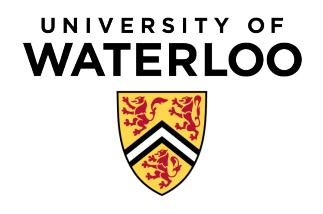

## ECE 192: Engineering Economics and Impact on Society Spring 2026 Comparison Methods Part 1 and 2 Tutorial 4

July 13th, 2026

## Solve the following problems:

- 1) A company is considering purchasing a small hydroelectric facility for \$800,000. The plant is expected to generate a net annual income of \$180,000 for the next 8 years. At the end of the 8 years, the facility must be decommissioned according to environmental regulations, which will cost \$600,000 more than any potential salvage value. Using a 10% annual interest rate, determine whether the project is financially desirable.
- 2) A piece of land may be purchased for \$610,000 to be strip-mined for the underlying coal. Annual net income will be \$200,000 for 10 years. At the end of the 10 years, the surface of the land will be restored as required by a federal law on strip mining. The reclamation will cost \$1.5 million more than the resale value of the land after it is restored. Using a 10% interest rate, determine whether the project is desirable.
- 3) Kool Karavans is considering three investment proposals, which can be treated as related but not mutually exclusive investments. The company can only invest UP TO two of these proposals. Each of them is characterized by an initial cost, annual savings over four years, and no salvage value, as illustrated in Table [1.](#page-0-0)

Table 1: Investment proposals for Kool Karavans (Problem 3).

| Proposal | First Cost (\$) | Annual Savings (\$) |
|----------|-----------------|---------------------|
| A        | 40,000          | 20,000              |
| B        | 110,000         | 30,000              |
| C        | 130,000         | 45,000              |

- a) Create a table with all possible investment proposal combinations (one or two investments) in increasing order of initial cost, including the do-nothing alternative, following the format of Table 2. *Hint*: Combine the initial investment or annual savings when two projects are executed together.
- b) If the MARR is 12%, which alternatives should Kool Karavans choose? Use either IRR or NPW to solve this problem.

Table 2: Format for the combination table required in Problem 3(a).

| Project | Proposal   | Net First Cost (\$) | Net Annual Saving (\$) |
|---------|------------|---------------------|------------------------|
| 1       | Do nothing | 0                   | 0                      |
| 2       | A          | 40,000              | 20,000                 |
| :       | :          | :                   | i i                    |

- 4) A manufacturing company must choose between two mutually exclusive machines to automate a packaging line. Machine A can be built in-house for a first cost of \$30,000, has an annual operating and maintenance (O&M) cost of \$8,000, and a service life of 5 years. Machine B can be purchased off-the-shelf for \$45,000, has an annual O&M cost of \$6,000, and a service life of 10 years. The MARR is 10%.
  - a) Using the annual worth method, and assuming each machine can be repeated indefinitely, determine which machine should be selected.
  - b) Suppose the repeated-lives assumption does not hold. Using a study period equal to the shorter service life, and assuming Machine B has an estimated salvage value of \$20,000 at the end of that period, determine which machine should be selected.
- 5) A print shop is evaluating two mutually exclusive presses, each with a service life of 8 years. The standard press has a first cost of \$55,000 and produces annual net savings of \$13,000. The high-capacity press has a first cost of \$80,000 and produces annual net savings of \$17,500. The MARR is 12%. Using the internal rate of return (IRR) method, determine which press should be selected. *Hint:* compute the IRR of each alternative, then analyze the IRR of the incremental investment.