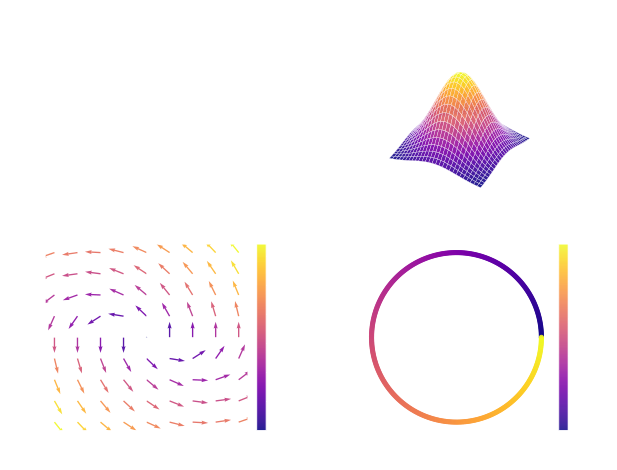
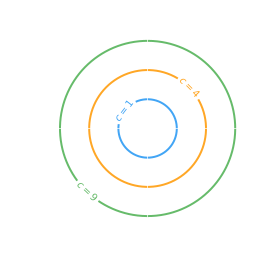
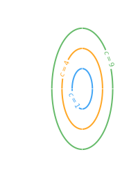

---

> [!abstract] Multivariable Calculus
> ## Multivariable Calculus

<u><strong style="color:#dab1da">Multivariable calculus</strong></u> — functions with **multiple inputs**.

$$f(x, y) = z$$

A set of variables $\{x, y\}$ is fed into a function $f$ and produces a scalar output $z$.

---

> [!info] Types of Functions
> ## Types of Functions

| Type | Mapping | Description | Example |
|------|---------|-------------|---------|
| Scalar function | $\mathbb{R} \to \mathbb{R}$ | Single input, single output | $y = x^3$ |
| Scalar field | $\mathbb{R}^n \to \mathbb{R}$ | Multiple inputs, single scalar output | $f(x_1, x_2) = x_1^2 + x_2^2$ |
| Vector field | $\mathbb{R}^n \to \mathbb{R}^n$ | Multiple inputs, vector output | $\mathbf{F}(x,y) = (-y, x)$ |
| Vector function | $\mathbb{R} \to \mathbb{R}^n$ | Single input, vector output | $f(x) = \begin{bmatrix} y_1 \\ y_2 \\ y_3 \end{bmatrix}$ |

---

> [!hint] Level Curves
> ## Level Curves (to plot functions)

<u><strong style="color:#dab1da">Level curves</strong></u> are like **height maps for mountains** — they plot the relationship between $x_1, x_2, \ldots, x_n$ at a given output value $f(\mathbf{x}) = Y \in M$, where $M$ is the image of $f$.

**Steps:**

$$\boxed{\text{Define image of } f} \longrightarrow \text{Pick } C \longrightarrow \boxed{\text{Draw relationship between } x_1, x_2, \ldots, x_n} \longrightarrow \text{Find patterns} \longrightarrow \underbrace{\text{Understand general shape of } f}_{\text{Conclusion ✓}}$$

---

> [!example] Level Curve Example 1
> ## Example 1 — $f(x,y) = x^2 + y^2$

Sketch the level curves of $f(x,y) = x^2 + y^2$.

> [!success]- Solution (Click to expand)
>
> **① Define the range:** $f(x,y) \in [0, \infty)$
>
> **② At $C = 0$:** $x^2 + y^2 = 0 \Rightarrow x = y = 0$ (single point)
>
> **③ At $C = 1$:** $x^2 + y^2 = 1 \Rightarrow$ circle at origin with $r = 1$
>
> **④ At $C = 4$:** $x^2 + y^2 = 4 \Rightarrow$ circle at origin with $r = 2$
>
> **Conclusion:** The shape of level curves are **circles centered at the origin**.
>
> 

---

> [!example] Level Curve Example 2
> ## Example 2 — $f(x,y) = 4x^2 + y^2$

Sketch the level curves of $f(x,y) = 4x^2 + y^2$.

> [!success]- Solution (Click to expand)
>
> **① Range:** $f(x,y) \in [0, \infty)$
>
> **② At $C = 0$:** $4x^2 + y^2 = 0 \Rightarrow x = y = 0$
>
> **③ At $C = 4$:** $4x^2 + y^2 = 4$
>
> $$\frac{x^2}{1} + \frac{y^2}{4} = 1$$
>
> This is an **ellipse** with semi-minor axis $a = 1$ (along $x$) and semi-major axis $b = 2$ (along $y$).
>
> **Conclusion:** The level curves are **concentric ellipses** centered at the origin, elongated along the $y$-axis.
>
> 
