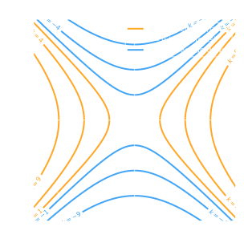

---

> [!abstract] Multivariable Calculus
> ## Multivariable Calculus

<u><strong style="color:#dab1da">Multivariable calculus</strong></u> — functions with **multiple inputs**.

$$f(x, y) = z$$

A set of variables $\{x, y\}$ is fed into a function $f$ and produces a scalar output $z$.

---

> [!info] Types of Functions
> ## Types of Functions

| Type            | Mapping                         | Description                           | Example                                                  |
| --------------- | ------------------------------- | ------------------------------------- | -------------------------------------------------------- |
| Scalar function | $\mathbb{R} \to \mathbb{R}$     | Single input, single output           | $y = x^3$                                                |
| Scalar field    | $\mathbb{R}^n \to \mathbb{R}$   | Multiple inputs, single scalar output | $f(x_1, x_2) = x_1^2 + x_2^2$                            |
| Vector field    | $\mathbb{R}^n \to \mathbb{R}^n$ | Multiple inputs, vector output        | $\mathbf{F}(x,y) = (-y, x)$                              |
| Vector function | $\mathbb{R} \to \mathbb{R}^n$   | Single input, vector output           | $f(x) = \begin{bmatrix} y_1 \\ y_2 \\ y_3 \end{bmatrix}$ |

---

> [!hint] Level Curves
> ## Level Curves (to plot functions)

<u><strong style="color:#dab1da">Level curves</strong></u> are like **height maps for mountains** — they plot the relationship between $x_1, x_2, \ldots, x_n$ at a given output value $f(\mathbf{x}) = Y \in M$, where $M$ is the image of $f$.

**Steps:**

![[1.1 - Level Curve Steps|100%]]

---

> [!example] Level Curve Example 1
> ## Example 1 — $f(x,y) = x^2 + y^2$

Sketch the level curves of $f(x,y) = x^2 + y^2$.

> [!success]- Solution (Click to expand)
>
> **① Define the range:** $f(x,y) \in [0, \infty)$
>
> **② At $C = 0$:** $x^2 + y^2 = 0 \Rightarrow x = y = 0$ (single point)
>
> **③ At $C = 1$:** $x^2 + y^2 = 1 \Rightarrow$ circle at origin with $r = 1$
>
> **④ At $C = 4$:** $x^2 + y^2 = 4 \Rightarrow$ circle at origin with $r = 2$
>
> **Conclusion:** The shape of level curves are **circles centered at the origin**.
>
> 

---

> [!example] Level Curve Example 2
> ## Example 2 — $f(x,y) = 4x^2 + y^2$

Sketch the level curves of $f(x,y) = 4x^2 + y^2$.

> [!success]- Solution (Click to expand)
>
> **① Range:** $f(x,y) \in [0, \infty)$
>
> **② At $C = 0$:** $4x^2 + y^2 = 0 \Rightarrow x = y = 0$
>
> **③ At $C = 4$:** $4x^2 + y^2 = 4$
>
> $$\frac{x^2}{1} + \frac{y^2}{4} = 1$$
>
> This is an **ellipse** with semi-minor axis $a = 1$ (along $x$) and semi-major axis $b = 2$ (along $y$).
>
> **Conclusion:** The level curves are **concentric ellipses** centered at the origin, elongated along the $y$-axis.
>
> 

---

> [!example] Level Curve Example 3
> ## Example 3 — $f(x,y) = x^2 - y^2$

Sketch the level curves of $f(x,y) = x^2 - y^2$.

> [!success]- Solution (Click to expand)
>
> The level curves satisfy $x^2 - y^2 = k$.
>
> **① Range:** $f(x,y) \in (-\infty, +\infty)$
>
> **② At $k = 0$:** $x^2 = y^2 \Rightarrow y = \pm x$ — two diagonal lines through the origin (asymptotes).
>
> **③ For $k > 0$:** The curve $x^2 - y^2 = k$ is a hyperbola opening **left and right**.
> Set $y = 0$: $x = \pm\sqrt{k}$ gives the $x$-intercepts. Draw branches asymptoting toward $y = \pm x$.
>
> **④ For $k < 0$:** Rewrite as $y^2 - x^2 = -k > 0$ — a hyperbola opening **upward and downward**.
> Set $x = 0$: $y = \pm\sqrt{-k}$ gives the $y$-intercepts.
>
> **To shade/label:** use **grayscale** to differentiate magnitude of $k$; use **color** to differentiate sign ($+/-$) of $k$.
>
> **Conclusion:** The level curves are **hyperbolas**. Positive $k$ opens left/right (orange); negative $k$ opens up/down (blue); $k = 0$ gives the asymptotic diagonals.
>
> 

---

> [!info] Limits of Multivariable Functions
> ## Limits of Multivariable Functions

The limit of $f(x,y)$ as $(x,y)$ approaches $(a,b)$:

$$\lim_{(x,y) \to (a,b)} f(x,y)$$

**How to disprove existence:** find two different paths to $(a,b)$ that yield **different** limit values. If such paths exist, the limit does **not** exist (jump discontinuity). Matching limits from two paths alone does not prove existence.

---

> [!example] Limit Example
> ## Example — Does $\displaystyle\lim_{(x,y)\to(0,0)} \frac{2x^2 y}{x^4 + y^2}$ exist?

> [!success]- Solution (Click to expand)
>
> **① Along the $x$-axis ($y = 0$):**
>
> $$\lim_{x \to 0} \frac{2x^2 \cdot 0}{x^4 + 0} = 0$$
>
> **② Along the $y$-axis ($x = 0$):**
>
> $$\lim_{y \to 0} \frac{0 \cdot y}{0 + y^2} = 0$$
>
> Both axes give $0$ — inconclusive, since matching paths cannot confirm existence.
>
> **③ Along the parabolic path $y = x^2$:**
>
> $$\lim_{x \to 0} \frac{2x^2 \cdot x^2}{x^4 + x^4} = \lim_{x \to 0} \frac{2x^4}{2x^4} = 1$$
>
> **Conclusion:** Path ③ gives $1 \neq 0$. The limits differ, so the limit **does not exist** — there is a jump discontinuity at the origin.
