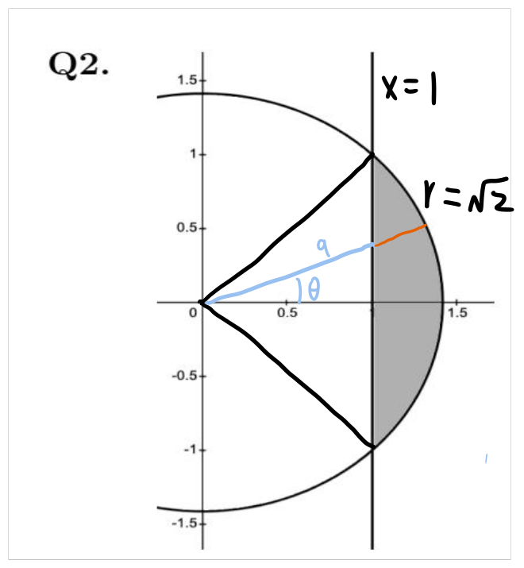
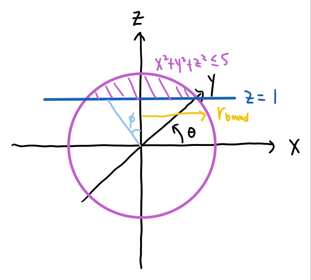

# MATH 119 Final Exam — Winter 2024

Transcribed from [[M119W24ExamSolns]] (`sources/M119W24ExamSolns.pdf`).
Each question shows only the statement; the official solution is folded underneath.

---

> [!example] Question 1
> ## Critical Points, Lagrange Multipliers, and Extrema on a Disc

Let $f(x,y) = 2x^2 + y^2 - 2y$.

**(a)** [3 marks] Find and classify the critical points of $f(x,y)$ using the Second Derivative Test.

**(b)** [3 marks] Subject to the constraint $x^2 + y^2 = 4$, use the method of Lagrange multipliers to determine the points $(x,y)$ for which the maximum and minimum values of $f(x,y)$ occur.

**(c)** [2 marks] On the region $x^2 + y^2 \le 4$, what are the maximum and minimum values of $f(x,y)$?

> [!success]- Solution (Click to expand)
> **(a)** We have $\vec{\nabla} f = (4x, 2y - 2)$, so the only critical point of $f$ occurs at $(0,1)$. To classify it, note that $f_{xx} = 4$, $f_{yy} = 2$, and $f_{xy} = 0$, so the Hessian is
>
> $$ H(x,y) = f_{xx}f_{yy} - f_{xy}^2 = 8 $$
>
> So $H(0,1) > 0$, and since $f_{xx}(0,1) > 0$ we conclude that $(0,1)$ is a local minimum.
>
> **(b)** Let $g(x,y) = x^2 + y^2$. Then $\vec{\nabla} g = (2x, 2y)$, and the Lagrange equations are
>
> $$
> \begin{cases}
> 4x = \lambda 2x \\
> 2y - 2 = \lambda 2y \\
> x^2 + y^2 = 4
> \end{cases}
> $$
>
> The first equation can be rewritten as $2x(2 - \lambda) = 0$, hence $x = 0$ or $\lambda = 2$.
>
> If $\lambda = 2$, the second equation gives $y = -1$ and then the third gives $x = \pm\sqrt{3}$, producing the points $(\pm\sqrt{3}, -1)$.
>
> If $x = 0$, the third equation immediately gives $y = \pm 2$, producing the points $(0, \pm 2)$.
>
> **(c)** Evaluating,
>
> $$ f(0,1) = -3, \qquad f(\pm\sqrt{3}, -1) = 9, \qquad f(0,2) = 0, \qquad f(0,-2) = 8 $$
>
> so the maximum value is $9$ and the minimum value is $-3$.

**(a)** Critical point: let $\nabla f(X, Y) = \langle 4X, 2Y-2 \rangle = \vec{0}$.  
Solve for $\langle X, Y \rangle = \boxed{\langle 0, 1 \rangle}$
Using curvature: $D = f_{xx} f_{yy} - (f_{xy})^2$
$$
= 4 \cdot 2 - 0 = 8 > 0 \implies \text{local extrema}
$$
Second derivative: $f_{xx} = 4 > 0 \implies \boxed{\text{local minimum}}$

**(b)** Let $g(X, Y) = X^2 + Y^2 = 4$, $\nabla g(X, Y) = \langle 2X, 2Y \rangle$
For local extremas, $\nabla g(X, Y) = \lambda \nabla f(X, Y)$
$$
\langle 2X, 2Y \rangle = \langle 4\lambda X, 2\lambda Y - 2\lambda \rangle
$$
$$
\begin{cases}
2X = 4\lambda X & (1) \\
2Y = 2\lambda Y - 2\lambda & (2) \\
X^2 + Y^2 = 4 & (3)
\end{cases}
$$
Consider both cases:
$$
\begin{cases}
\left(\lambda = \frac{1}{2}\right) \land (2) \implies Y = -1 \implies X = \pm\sqrt{3} \\
(X = 0) \land (3) \implies Y = \pm 2 \implies X = 0
\end{cases}
$$
This yields critical points:
$$
\begin{aligned}
f(\sqrt{3}, -1) &= 6 + 1 + 2 = \boxed{9} & f(-\sqrt{3}, -1) &= \boxed{9} \\
f(0, 2) &= 4 - 4 = \boxed{0} & f(0, -2) &= 8
\end{aligned}
$$
Local maximum occur at $\langle \pm\sqrt{3}, -1 \rangle$, local minimum occur at $(0, 2)$

**(c)** Edge max/min already computed, we consider inner region $X^2 + Y^2 < 4$
Local minimum $\langle 0, 1 \rangle$ lands in region:
$$
f(0, 1) = 1 - 2 = \boxed{-1}
$$
Therefore, the maximum and minimum values are:
$$
f_{\max} = f(\pm\sqrt{3}, -1) = 9 \qquad f_{\min} = f(0, 1) = -1
$$

---

> [!example] Question 2 — 6 marks
> ## Double Integral in Polar Coordinates

Consider the region $\mathcal{D}$ defined by the inequalities $x^2 + y^2 \le 2$ and $x \ge 1$ (the region $\mathcal{D}$ is the shaded area shown).

![[CE1B/MATH119-Calculus-2-for-Engineers/sources/M119W24ExamSolns/_page_0_Figure_13.jpeg|50%]]

By doing a double integral using polar coordinates, evaluate

$$ \iint_{\mathcal{D}} \frac{1}{(x^2 + y^2)^{3/2}}\,dA $$

> [!success]- Solution (Click to expand)
> The circle intersects the line at $x = 1$ and $y = \pm 1$ — therefore, on $\mathcal{D}$, we have $-\frac{\pi}{4} \le \theta \le \frac{\pi}{4}$. For a fixed $\theta$, the smaller $r$ value is determined by the line $x = 1$ and the larger $r$ value by the circle. In polar coordinates the line $x = 1$ has equation $r\cos(\theta) = 1$, so $r = \frac{1}{\cos(\theta)}$, and the largest $r$ value is $r = \sqrt{2}$. Note the integrand is $\frac{1}{(r^2)^{3/2}} = \frac{1}{r^3}$. We thus have
>
> $$
> \begin{aligned}
> \iint_{\mathcal{D}} \frac{1}{(x^2+y^2)^{3/2}}\,dA &= \int_{-\pi/4}^{\pi/4} \int_{r=1/\cos(\theta)}^{r=\sqrt{2}} \frac{1}{r^3}\,r\,dr\,d\theta \\
> &= -\int_{-\pi/4}^{\pi/4} \left[\frac{1}{r}\right]_{r=1/\cos(\theta)}^{r=\sqrt{2}} d\theta \\
> &= \int_{-\pi/4}^{\pi/4} \left[\cos(\theta) - \frac{1}{\sqrt{2}}\right] d\theta \\
> &= \left[\sin(\theta) - \frac{\theta}{\sqrt{2}}\right]_{-\pi/4}^{\pi/4} \\
> &= \sqrt{2} - \frac{\pi}{2\sqrt{2}}
> \end{aligned}
> $$

  

Connecting origin with bound $x=1$, let distance be $a$

$$
\cos\theta = \frac{1}{a} \implies a = \frac{1}{\cos\theta} = \sec\theta
$$

By inspection, $\theta \in [-45^\circ, 45^\circ]$

$$
\begin{aligned}
\iint_D \frac{1}{(x^2 + y^2)^{3/2}} \, dA &= \iint_D \frac{1}{(r^2)^{3/2}} \, dx \, dy \\
&= \iint_D \frac{1}{r^3} |J| \, dr \, d\theta \\
\text{(Using } |J| = r \text{)} &= \int_{-45^\circ}^{45^\circ} \int_a^r \frac{1}{r^2} \, dr \, d\theta \\
&= \int_{-45^\circ}^{45^\circ} \int_{\sec\theta}^{\sqrt{2}} \frac{1}{r^2} \, dr \, d\theta \\
&= \int_{-45^\circ}^{45^\circ} -\left.\frac{1}{r}\right|_{\sec\theta}^{\sqrt{2}} \, d\theta \\
&= \int_{-45^\circ}^{45^\circ} \left(\cos\theta - \frac{\sqrt{2}}{2}\right) \, d\theta \\
&= \left.\left(\sin\theta - \frac{\sqrt{2}}{2}\theta\right)\right|_{-45^\circ}^{45^\circ} \\
&= \boxed{\sqrt{2} - \frac{\sqrt{2}}{4}\pi}
\end{aligned}
$$

---

> [!example] Question 3 — 4 marks
> ## Volume in Cylindrical and Spherical Coordinates

![[CE1B/MATH119-Calculus-2-for-Engineers/sources/M119W24ExamSolns/_page_1_Picture_2.jpeg|40%]]

Let $\mathcal{D}$ be the region above the plane $z = 1$ and inside the solid sphere $x^2 + y^2 + z^2 \le 5$. Write down integrals, in each of cylindrical and spherical coordinates, that evaluate to the volume of $\mathcal{D}$. You do not need to evaluate these integrals.
*(Don't worry about "simplifying" an expression with $\sin^{-1}$ or $\cos^{-1}$ appearing in it.)*

> [!success]- Solution (Click to expand)
> Certainly $0 \le \theta \le 2\pi$. Consider the triangle whose bottom vertex is the centre of the sphere, whose top edge is the plane $z = 1$, and whose top-right vertex is where the plane meets the boundary of the sphere:
>
> ![[CE1B/MATH119-Calculus-2-for-Engineers/sources/M119W24ExamSolns/_page_1_Picture_5.jpeg|40%]]
>
> from which we see that $\cos(\phi_{\max}) = \frac{1}{\sqrt{5}}$. For $r$, the largest value we ever take is $\sqrt{5}$, and for a fixed $\phi$ the smallest value is determined by the plane $z = 1$, i.e. by $r\cos(\phi) = 1$. Thus, in spherical coordinates,
>
> $$ \text{Vol}(\mathcal{D}) = \int_0^{2\pi} \int_0^{\cos^{-1}(1/\sqrt{5})} \int_{1/\cos(\phi)}^{\sqrt{5}} r^2\sin(\phi)\,dr\,d\phi\,d\theta $$
>
> In cylindrical coordinates, again $0 \le \theta \le 2\pi$, and $r, z$ can be ordered either way. For $1 \le z \le \sqrt{5}$, $r_{\max}$ is determined by the sphere $x^2 + y^2 + z^2 = 5$, so
>
> $$ \text{Vol}(\mathcal{D}) = \int_0^{2\pi} \int_1^{\sqrt{5}} \int_0^{\sqrt{5-z^2}} r\,dr\,dz\,d\theta $$
>
> If we swap $r$ and $z$: the largest value of $r$ occurs where the boundary of the sphere hits the plane. Since $z = 1$ there, $1 + x^2 + y^2 = 5$ and therefore $r = 2$. For a fixed $r$ we have $1 \le z \le \sqrt{5 - r^2}$, and thus
>
> $$ \text{Vol}(\mathcal{D}) = \int_0^{2\pi} \int_0^{2} \int_1^{\sqrt{5-r^2}} r\,dz\,dr\,d\theta $$

  

Analyzing $r$ for cylinderal coordinate system;
$$
r_{\text{bound}}^2 + z^2 = \rho_{\text{sphere}}^2 \implies r_{\text{bound}} = \sqrt{\rho_{\text{sphere}}^2 - z^2}
$$
By inspection, $z \in [1, \sqrt{5}]$, $\theta \in [0, 2\pi]$, $r \in [0, r_{\text{bound}}]$
Write for cylinderal coordinate system, where $|J| = r$
$$
V = \iiint_D dV = \boxed{\int_0^{2\pi} \int_1^{\sqrt{5}} \int_0^{\sqrt{5 - z^2}} r \, dr \, dz \, d\theta}
$$

Analyzing $\phi$, we have
$$
\tan(\phi) = \frac{r}{z} \implies \phi \in [0, \tan^{-1}(\sqrt{5})]
$$
Inspecting $\rho$, have:
$$
\cos(\phi) = \frac{z}{\rho} \implies \rho \in [\sec(\phi), \sqrt{5}]
$$
Spherical coordinate system has $|J| = \rho^2 \sin(\phi)$, write:
$$
V = \iiint_D dV = \int_0^{2\pi} \int_0^{\tan^{-1}(\sqrt{5})} \int_{\sec(\phi)}^{\sqrt{5}} \rho^2 \sin(\phi) \, d\rho \, d\phi \, d\theta
$$

---

> [!example] Question 4 — 8 marks
> ## Convergence or Divergence

For each of the following series, determine if it converges or diverges.

**(a)** $\displaystyle\sum_{n=1}^{\infty} \frac{3n+1}{4n+119}$

**(b)** $\displaystyle\sum_{n=1}^{\infty} \frac{\sqrt{n+5}}{n^2 + 17n + \sin(n)}$

**(c)** $\displaystyle\sum_{n=1}^{\infty} \frac{(2n)!}{(n!)^2 \times 3^n}$

**(d)** $\displaystyle\sum_{n=3}^{\infty} \frac{1}{n\sqrt{\ln n}}$

> [!success]- Solution (Click to expand)
> **(a)** This diverges — lots of ways to do this, one way is the divergence test.
>
> **(b)** Converges. Use the LCT with $b_n = \frac{\sqrt{n}}{n^2}$ — we have $\lim_{n\to\infty}\frac{a_n}{b_n} = 1$, and $\sum_{n\ge 1} b_n$ converges by the $p$-series test.
>
> **(c)** Ratio test with $a_n = \frac{(2n)!}{(n!)^2 \times 3^n}$:
>
> $$
> \begin{aligned}
> \lim_{n\to\infty}\frac{a_{n+1}}{a_n} &= \lim_{n\to\infty} \frac{(2n+2)!}{((n+1)!)^2 3^{n+1}} \times \frac{(n!)^2 3^n}{(2n)!} \\
> &= \frac{1}{3}\lim_{n\to\infty} \frac{(2n+2)(2n+1)}{(n+1)^2} \\
> &= \frac{4}{3}
> \end{aligned}
> $$
>
> By the ratio test, the series diverges.
>
> **(d)** *Solution #1.* This diverges. Use the integral test with $f(x) = \frac{1}{x\sqrt{\ln x}}$, which is continuous, positive, and decreasing with $f(n) = a_n$. Thus the series converges if and only if $\int_3^{\infty} \frac{1}{x\sqrt{\ln x}}\,dx$ converges. Letting $u = \ln x$, so $du = \frac{1}{x}dx$,
>
> $$
> \begin{aligned}
> \int_3^{\infty} \frac{1}{x\sqrt{\ln x}}\,dx &= \lim_{c\to\infty} \int_{\ln 3}^{c} \frac{1}{\sqrt{u}}\,du \\
> &= \lim_{c\to\infty} \left[2u^{1/2}\right]_{\ln 3}^{c} \\
> &= 2\lim_{c\to\infty}\left[\sqrt{c} - \sqrt{\ln 3}\right] = \infty
> \end{aligned}
> $$
>
> The integral diverges, so the series does as well.
>
> *Solution #2.* A bit sketchier, but acceptable: in class it was shown that $\sum \frac{1}{n\ln n}$ diverges (by the integral test). Since $\frac{1}{n\ln n} \le \frac{1}{n\sqrt{\ln n}}$, the comparison test finishes it.

(a) Divergent by the **divergence test** :
$$
\lim_{n\to\infty} \frac{3n+1}{4n+119} = \frac{3}{4} \neq 0 \implies \sum_{n=1}^{\infty} \frac{3n+1}{4n+119} \text{ diverges}
$$

(b) Convergent by **Limit Comparison** with p-series :
$$
\lim_{n\to\infty} \frac{\sqrt{n+5}}{n^2+17n+\sin(n)} = \lim_{n\to\infty} \frac{\sqrt{n}}{n^2} = \frac{1}{n^p} \left(p=\frac{3}{2}\right)
$$
$$
p=\frac{3}{2} > 1 \implies \sum_{n=1}^{\infty} \frac{1}{n^p} \text{ converges} \iff \sum_{n=1}^{\infty} \frac{\sqrt{n+5}}{n^2+17n+\sin(n)} \text{ converges}
$$

(c) Divergent by the **Ratio Test** :
$$
\lim_{n\to\infty} \left|\frac{a_{n+1}}{a_n}\right| = \frac{(2n+2)(2n+1)}{(n+1)^2 \times 3} = \frac{4n^2+\cdots}{3n^2+\cdots} = \frac{4}{3} > 1 \implies \sum_{n=1}^{\infty} a_n \text{ diverges}
$$

(d) Divergent by the **Integral Test** :
Let $f(x) = \frac{1}{x\sqrt{\ln x}}$, observe that $\frac{d}{dx} \sqrt{\ln x} = \frac{1}{x} \cdot \frac{1}{2\sqrt{\ln x}}$, therefore:
$$
\int_3^{\infty} \frac{1}{x} \cdot \frac{1}{\sqrt{\ln x}} = \left. 2\sqrt{\ln x} \right|_{x=3}^{x=\infty} = \infty \implies \sum_{n=3}^{\infty} \frac{1}{n\sqrt{\ln(n)}} \text{ diverges}
$$

---

> [!example] Question 5 — 8 marks
> ## Radius and Interval of Convergence

Determine the radius of convergence and interval of convergence of the series

$$ \sum_{n=1}^{\infty} \frac{1}{3^n \times \sqrt{n}}(2x-4)^n $$

> [!success]- Solution (Click to expand)
> Let $a_n = \frac{2^n}{3^n\sqrt{n}}$. Then $\sum_{n=1}^{\infty} \frac{1}{3^n\sqrt{n}}(2x-4)^n = \sum_{n=1}^{\infty} a_n(x-2)^n$, and
>
> $$
> \begin{aligned}
> R &= \lim_{n\to\infty} \frac{a_n}{a_{n+1}} \\
> &= \lim_{n\to\infty} \frac{2^n}{3^n\sqrt{n}} \times \frac{3^{n+1}\sqrt{n+1}}{2^{n+1}} \\
> &= \frac{3}{2}\lim_{n\to\infty} \frac{\sqrt{n+1}}{\sqrt{n}} = \frac{3}{2}
> \end{aligned}
> $$
>
> Our endpoints are $2 \pm \frac{3}{2}$, which are $\frac{1}{2}$ and $\frac{7}{2}$.
>
> At $x = \frac{1}{2}$ the series is
>
> $$ \sum_{n=1}^{\infty} \frac{1}{3^n\sqrt{n}}\left(2\cdot\tfrac{1}{2} - 4\right)^n = \sum_{n=1}^{\infty} \frac{(-1)^n}{\sqrt{n}} $$
>
> which converges by the AST.
>
> At $x = \frac{7}{2}$ the series is
>
> $$ \sum_{n=1}^{\infty} \frac{1}{3^n\sqrt{n}}\left(2\cdot\tfrac{7}{2} - 4\right)^n = \sum_{n=1}^{\infty} \frac{1}{\sqrt{n}} $$
>
> which diverges as it is a $p$-series with $p < 1$.
>
> In summary, the interval of convergence is $\left[\frac{1}{2}, \frac{7}{2}\right)$.

$$
\sum_{n=1}^{\infty} \frac{1}{3^n \times \sqrt{n}} (2x-4)^n = \sum_{n=1}^{\infty} \frac{1}{3^n \sqrt{n}} u^n \quad (u = 2x-4)
$$
Has **radius of convergence** for $u$:
$$
R_u = \lim_{n \to \infty} \left| \frac{a_n}{a_{n+1}} \right| = \lim_{n \to \infty} \frac{3^{n+1} \sqrt{n+1}}{3^n \sqrt{n}} = \lim_{n \to \infty} 3 \sqrt{\frac{n+1}{n}} = 3
$$
**Checking edges:**
$$\begin{aligned}
u=-3 &\implies \sum_{n=1}^\infty \frac{1}{3^n \, \sqrt{n}} u^n = \sum_{n=1}^\infty (-1)^n \frac{3^n}{3^n \, \sqrt{n}} \implies \text{ Convergent by AST} \\
u=3 &\implies \sum_{n=1}^\infty \frac{1}{3^n \, \sqrt{n}} u^n = \sum_{n=1}^\infty \frac{3^n}{3^n \, \sqrt{n}} \implies \text{ Convergent by p-series } (p=\frac{1}{2})
\end{aligned}
$$
**Interval of convergence** for $u$ is $u \in [-3, 3)$. 
The **radius and interval convergence** of $x$, using $x = \frac{u+4}{2} = \frac{u}{2} + 2$, is:
$$R = \frac{1}{2} R_u = \frac{3}{2} \quad\quad x \in \left[\frac{1}{2}, \frac{7}{2}\right)$$

---

> [!example] Question 6
> ## Taylor Polynomial and Taylor's Inequality

Let $f(x) = xe^{-2x}$.

**(a)** [4 marks] Determine $T_{3,0}(x)$, the third-order Taylor polynomial of $f(x)$ centred at $0$ (also known as the third-order Maclaurin polynomial of $f(x)$).

**(b)** [4 marks] Use Taylor's inequality to determine an upper bound on the error associated with approximating $f\left(\frac{1}{10}\right)$ with $T_{3,0}\left(\frac{1}{10}\right)$.

> [!success]- Solution (Click to expand)
> **(a)** We know $T_{2,0}$ for $e^x$ is $1 + x + \frac{x^2}{2}$. Therefore $T_{2,0}$ for $e^{-2x}$ is $1 - 2x + 2x^2$, and $T_{3,0}$ for $xe^{-2x}$ is
>
> $$ T_{3,0}(x) = x - 2x^2 + 2x^3 $$
>
> **(b)** *Solution #1.* Begin by writing $e^x = 1 + x + \frac{x^2}{2} + R_{2,0}(x)$. Then
>
> $$ xe^{-2x} = x - 2x^2 + 2x^3 + xR_{2,0}(-2x) $$
>
> so we need an upper bound on $\left|\frac{1}{10}R_{2,0}\left(-\frac{2}{10}\right)\right|$. By Taylor's inequality, $\left|R_{2,0}\left(-\frac{2}{10}\right)\right| \le \frac{K}{6}\left|\frac{2}{10} - 0\right|^3$ where $\left|\frac{d^3}{dx^3}e^x\right| \le K$ on $\left[-\frac{2}{10}, 0\right]$. We can take $K = 1$, giving
>
> $$
> \begin{aligned}
> \left|f\left(\tfrac{1}{10}\right) - T_{3,0}\left(\tfrac{1}{10}\right)\right| &= \left|\tfrac{1}{10}R_{2,0}\left(-\tfrac{2}{10}\right)\right| \\
> &= \frac{1}{10}\left|R_{2,0}\left(-\tfrac{2}{10}\right)\right| \\
> &\le \frac{1}{10} \times \frac{1}{6} \times \frac{2^3}{10^3} = \frac{4}{3\times 10^4}
> \end{aligned}
> $$
>
> *Solution #2.* Same as #1, but backtracking the interval from $u = -2x$ gives $\left[-\frac{1}{10}, 0\right]$ instead of $\left[-\frac{2}{10}, 0\right]$. This doesn't change the answer, since the derivative function is increasing.
>
> *Solution #3.* Directly calculate
>
> $$
> \begin{aligned}
> f^{(1)}(x) &= e^{-2x} - 2xe^{-2x} = e^{-2x}(1 - 2x) \\
> f^{(2)}(x) &= -2e^{-2x}(1 - 2x) - 2e^{-2x} = e^{-2x}(4x - 4) \\
> f^{(3)}(x) &= -2e^{-2x}(4x - 4) + 4e^{-2x} = e^{-2x}(12 - 8x) \\
> f^{(4)}(x) &= -2e^{-2x}(12 - 8x) - 8e^{-2x} = e^{-2x}(16x - 32)
> \end{aligned}
> $$
>
> The function $|16x - 32|$ is decreasing and $e^{-2x}$ is decreasing, so on $\left[0, \frac{1}{10}\right]$,
>
> $$ |f^{(4)}(x)| \le \left|e^{-2(0)}\right| \times |16(0) - 32| = 32 $$
>
> Therefore, by Taylor's inequality, on $\left[0, \frac{1}{10}\right]$,
>
> $$ \left|f\left(\tfrac{1}{10}\right) - T_{3,0}\left(\tfrac{1}{10}\right)\right| \le \frac{32}{4!} \times \frac{1}{10^4} $$
>
> *Solution #4.* We have
>
> $$ xe^{-2x} = x\sum_{n=0}^{\infty} \frac{(-1)^n 2^n}{n!}x^n = \sum_{n=0}^{\infty} \frac{(-1)^n 2^n}{n!}x^{n+1} \implies \frac{1}{10}e^{-2/10} = \sum_{n=0}^{\infty} \frac{(-1)^n 2^n}{10^{n+1}n!} $$
>
> By the alternating series error bound, the error in approximating the number with $s_3$ is at most $\frac{2^4}{10^5\,4!}$. This does not receive full marks, since the question said to use Taylor's inequality.

**(a)**
$$
e^x = \sum_{n=0}^{\infty} \frac{x^n}{n!} = 1 + \frac{x^2}{2!} + \frac{x^3}{3!} + \dots \qquad e^{-2x} = 1 - 2x + \frac{4x^2}{2!} - \frac{8x^3}{3!} + \dots
$$
$$
T_{3,0}(x) = x - 2x^2 + \frac{4x^3}{2!}
$$

**(b)**
$$
f(x) = x \sum_{n=0}^{\infty} \frac{(-2x)^n}{n!} = x - 2x^2 + \frac{4x^3}{2!} + R_{3,0}(x)
$$
where $R_{3,0}(x) = x \sum_{n=3}^{\infty} \frac{(-2x)^n}{n!}$, and $\sum_{n=3}^{\infty} \frac{(-2x)^n}{n!}$ is $R_2$ for $e^{-2x}$
$$
|R_2| \le K \frac{x^3}{3!} \quad \text{where } \forall t \in \left[0, \frac{1}{10}\right], |(e^{-2t})'''| \le K.
$$
$|-8e^{-2t}| \le K$. and since $e^{-2t}$ is strictly decreasing, maximum occurs at $t=0$.

so $K = |-8e^0| = 8$
$$
|R_2| \le \frac{8}{3!} \left(\frac{1}{10}\right)^3 \implies R_{3,0}(x) = x R_2 \le \frac{8}{3!} 10^{-4}
$$

---

> [!example] Question 7
> ## Taylor Polynomial of an Integral, and Recognizing a Series

Let

$$ f(x) = \int_0^x \frac{t}{1 - \frac{t^2}{4}}\,dt $$

**(a)** [4 marks] Find the $6^{\text{th}}$-order Taylor polynomial of $f(x)$ centred at $0$.

**(b)** [2 marks] If $f(x)$ were written as a power series centred at $0$, what would its radius of convergence be?

**(c)** [2 marks] Find a real number $c$ such that $\displaystyle f(c) = \sum_{n=0}^{\infty} \frac{1}{3^{n+1}4^n(2n+2)}$.

> [!success]- Solution (Click to expand)
> **(a)** (Big-O notation is not required for full marks.) We have
>
> $$ \frac{1}{1-u} = 1 + u + u^2 + \mathcal{O}(u^3) $$
>
> and therefore
>
> $$ \frac{t}{1 - \frac{t^2}{4}} = t + \frac{t^3}{4} + \frac{t^5}{16} + \mathcal{O}(t^7) $$
>
> and hence
>
> $$ f(x) = \frac{x^2}{2} + \frac{x^4}{16} + \frac{x^6}{96} + \mathcal{O}(x^8) $$
>
> **(b)** The Taylor series of $\frac{1}{1-u}$ at $0$ converges if and only if $|u| < 1$. Replacing $u$ with $\frac{t^2}{4}$, this converges when $\left|\frac{t^2}{4}\right| < 1$, i.e. when $|t| < 2$. Since multiplying by $t$ and integrating doesn't change the radius of convergence, our new series also has $R = 2$.
>
> **(c)** We have
>
> $$
> \begin{aligned}
> f(x) &= \int_0^x \frac{t}{1 - \frac{t^2}{4}}\,dt \\
> &= \int_0^x t \sum_{n=0}^{\infty} \left(\frac{t^2}{4}\right)^n dt \\
> &= \int_0^x \sum_{n=0}^{\infty} \frac{1}{4^n}t^{2n+1}\,dt \\
> &= \sum_{n=0}^{\infty} \frac{1}{4^n(2n+2)}x^{2n+2}
> \end{aligned}
> $$
>
> from which we observe that
>
> $$ \sum_{n=0}^{\infty} \frac{1}{3^{n+1}4^n(2n+2)} = f\left(\frac{1}{\sqrt{3}}\right) = f\left(-\frac{1}{\sqrt{3}}\right) $$

---

> [!example] Question 8 — 6 marks
> ## Limits with Big-O Notation

Evaluate the following limits. Properly use $\mathcal{O}$ ("big O") notation to earn full marks.

**(a)** $\displaystyle\lim_{x\to 0} \frac{\sin(2x^2) - 2x^2}{x^6}$

**(b)** $\displaystyle\lim_{x\to 0} \left( \frac{\ln(1+x)}{x^2} - \frac{1}{x} \right)$

**(c)** $\displaystyle\lim_{x\to 0} \frac{1 - \sqrt{1 + x^{100}}}{1 - e^x}$

> [!success]- Solution (Click to expand)
> *(More terms are used below than are strictly needed — that is fine.)*
>
> **(a)** We have $\sin(x) = x - \frac{x^3}{6} + \frac{x^5}{120} + \mathcal{O}(x^7)$. Therefore
>
> $$ \sin(2x^2) = 2x^2 - \frac{8x^6}{6} + \frac{2^5x^{10}}{120} + \mathcal{O}(x^{12}) $$
>
> and so
>
> $$
> \begin{aligned}
> \lim_{x\to 0} \frac{\sin(2x^2) - 2x^2}{x^6} &= \lim_{x\to 0} \frac{2x^2 - \frac{8x^6}{6} + \frac{2^5x^{10}}{120} + \mathcal{O}(x^{12}) - 2x^2}{x^6} \\
> &= \lim_{x\to 0} \frac{-\frac{4}{3} + \mathcal{O}(x^4)}{1} = -\frac{4}{3}
> \end{aligned}
> $$
>
> **(b)** Since $\frac{d}{dx}\ln(1+x) = \frac{1}{1+x} = 1 - x + x^2 + \mathcal{O}(x^3)$, we have $\ln(1+x) = C + x - \frac{x^2}{2} + \frac{x^3}{3} + \mathcal{O}(x^4)$; plugging in $x = 0$ gives $C = 0$. Therefore
>
> $$
> \begin{aligned}
> \lim_{x\to 0}\left(\frac{\ln(1+x)}{x^2} - \frac{1}{x}\right) &= \lim_{x\to 0} \frac{\ln(1+x) - x}{x^2} \\
> &= \lim_{x\to 0} \frac{x - \frac{x^2}{2} + \frac{x^3}{3} + \mathcal{O}(x^4) - x}{x^2} \\
> &= \lim_{x\to 0} \frac{-\frac{x^2}{2} + \frac{x^3}{3} + \mathcal{O}(x^4)}{x^2} \\
> &= \lim_{x\to 0} \frac{-\frac{1}{2} + \frac{x}{3} + \mathcal{O}(x^2)}{1} = -\frac{1}{2}
> \end{aligned}
> $$
>
> **(c)** We have $\sqrt{1 + x^{100}} = (1 + x^{100})^{1/2} = 1 + \frac{1}{2}x^{100} - \frac{1}{8}x^{200} + \mathcal{O}(x^{300})$. Also $e^x = 1 + x + \frac{x^2}{2} + \mathcal{O}(x^3)$, and so
>
> $$
> \begin{aligned}
> \lim_{x\to 0} \frac{1 - \sqrt{1+x^{100}}}{1 - e^x} &= \lim_{x\to 0} \frac{1 - \left(1 + \frac{1}{2}x^{100} - \frac{1}{8}x^{200} + \mathcal{O}(x^{300})\right)}{1 - \left(1 + x + \frac{x^2}{2} + \mathcal{O}(x^3)\right)} \\
> &= \lim_{x\to 0} \frac{-\frac{1}{2}x^{100} + \mathcal{O}(x^{200})}{-x + \mathcal{O}(x^2)} \\
> &= \lim_{x\to 0} \frac{-\frac{1}{2}x^{99} + \mathcal{O}(x^{199})}{-1 + \mathcal{O}(x)} = 0
> \end{aligned}
> $$

**(a)**
First the expansion of $\sin(x^2)$:
$$
\sin(x) = \sum_{n=0}^{\infty} (-1)^n \frac{x^{2n+1}}{(2n+1)!} = x - \frac{x^3}{3!} + \frac{x^5}{5!} - \frac{x^7}{7!} + \dots
$$
$$
\sin(2x^2) = 2x^2 - \frac{2^3}{3!} x^6 + \frac{2^5}{5!} x^{10} - \frac{2^7}{7!} x^{14} + \dots
$$
Compute:
$$
\begin{aligned}
\lim_{x \to 0} \frac{\sin(2x^2) - 2x^2}{x^6} &= \lim_{x \to 0} \frac{2x^2 - \frac{8}{6} x^6 + O(x^{10}) - 2x^2}{x^6} \\
&= \lim_{x \to 0} \frac{-\frac{4}{3} x^6 + O(x^{10})}{x^6} \\
&= \lim_{x \to 0} -\frac{4}{3} + O(x^4) = -\frac{4}{3}
\end{aligned}
$$

**(b)**
First, expansion for $\ln(1+x)$:
$$
\ln(1+x) = \sum_{n=1}^{\infty} \frac{(-1)^{n-1} x^n}{n} = x - \frac{x^2}{2} + \frac{x^3}{3} - \frac{x^4}{4} + \dots
$$
Compute:
$$
\begin{aligned}
\lim_{x \to 0} \frac{\ln(1+x) - x}{x^2} &= \lim_{x \to 0} \frac{x - \frac{x^2}{2} + \frac{x^3}{3} - \frac{x^4}{4} + \dots - x}{x^2} \\
&= \lim_{x \to 0} \frac{x - \frac{x^2}{2} + O(x^3) - x}{x^2} \\
&= \lim_{x \to 0} \frac{-\frac{x^2}{2} + O(x^3)}{x^2} \\
&= \lim_{x \to 0} -\frac{1}{2} + O(x) \\
&= -\frac{1}{2}
\end{aligned}
$$

**(c)**
First expansion for $e^x$ and binomial series for $\sqrt{1+x^{100}} = (1+x^{100})^\alpha$: 
$$
e^x = \sum_{n=0}^{\infty} \frac{x^n}{n!} = 1 + x + \frac{x^2}{2} + \frac{x^3}{3!} + \dots
$$
$$
(1+x^{100})^{\frac{1}{2}} = 1 + \alpha x^{100} + \frac{\alpha(\alpha-1)}{2!} x^{200} + \frac{\alpha(\alpha-1)(\alpha-2)}{3!} x^{300} + \dots \quad \left(\alpha = \frac{1}{2}\right)
$$
$$
\begin{aligned}
\lim_{x \to 0} \, \frac{1 - \sqrt{1 + x^{100}}}{1 - e^x} &= \lim_{x \to 0} \frac{1 - (1 + \alpha x^{100} + O(x^{200}))}{1 - (1 + x + O(x^2))} \\
&= \lim_{x \to 0} \, \frac{\alpha x^{100} + O(x^{200})}{x + O(x^2)}\\
&= \lim_{x \to 0} \, 0 + O(x^{98}) = 0
\end{aligned}
$$

---

> [!example] Question 9
> ## Summing a Series, and Extracting Even Coefficients

These two questions are not related to each other.

**(a)** [4 marks] The series

$$ \frac{2}{3} - \frac{3}{3^3} + \frac{4}{3^5} - \frac{5}{3^7} + \frac{6}{3^9} - \frac{7}{3^{11}} + \cdots $$

converges. What value does it converge to?

**(b)** [4 marks] Suppose that $\sum_{n=0}^{\infty} a_n x^n$ has a radius of convergence $R > 0$ and that it converges to $f(x)$ on its interval of convergence. What function does $\sum_{n=0}^{\infty} a_{2n}x^{2n+1}$ converge to?
*(Your answer will depend on $f(x)$. For example, you would say that $\sum_{n=0}^{\infty} 2a_nx^n$ converges to $2f(x)$.)*

> [!success]- Solution (Click to expand)
> **(a)** *Solution #1.* Call the series $A$. Then
>
> $$ \frac{1}{9}A = \frac{2}{3^3} - \frac{3}{3^5} + \frac{4}{3^7} - \frac{5}{3^9} + \frac{6}{3^{11}} - \frac{7}{3^{13}} + \cdots $$
>
> We then have
>
> $$
> \begin{aligned}
> A + \frac{1}{9}A &= \frac{2}{3} - \frac{1}{3^3} + \frac{1}{3^5} - \frac{1}{3^7} + \cdots \\
> &= \frac{1}{3} + \frac{1}{3}\left[1 - \frac{1}{9} + \frac{1}{9^2} - \frac{1}{9^3} + \cdots\right] \\
> &= \frac{1}{3} + \frac{1}{3}\left[\frac{1}{1 + \frac{1}{9}}\right] = \frac{19}{30}
> \end{aligned}
> $$
>
> So $\frac{10}{9}A = \frac{19}{30}$, and thus $A = \frac{57}{100}$.
>
> *Solution #2.* Let $f(x) = \frac{1}{3}\sum_{n=0}^{\infty} \frac{(n+2)(-1)^n}{9^n}x^{n+1}$, so that $A = f(1)$. Note
>
> $$
> \begin{aligned}
> \int f(x)\,dx &= \int \frac{1}{3}\sum_{n=0}^{\infty} \frac{(n+2)(-1)^n}{9^n}x^{n+1}\,dx \\
> &= \frac{1}{3}\sum_{n=0}^{\infty} \int \frac{(n+2)(-1)^n}{9^n}x^{n+1}\,dx \\
> &= \left(\frac{1}{3}\sum_{n=0}^{\infty} \frac{(-1)^n}{9^n}x^{n+2}\right) + C \\
> &= \left(\frac{x^2}{3}\sum_{n=0}^{\infty}\left(-\frac{x}{9}\right)^n\right) + C \\
> &= \frac{x^2}{3}\times\frac{1}{1 - \left(-\frac{x}{9}\right)} + C = \frac{3x^2}{9+x} + C
> \end{aligned}
> $$
>
> Taking the derivative, $f(x) = \frac{3x^2 + 54x}{(9+x)^2}$, and therefore $f(1) = \frac{57}{100}$.
>
> *Solution #3.* We want to compute
>
> $$
> \begin{aligned}
> \sum_{i=0}^{\infty} \frac{(-1)^i(i+2)}{3^{2i+1}} &= \sum_{i=2}^{\infty} \frac{(-1)^i \cdot i}{3^{2i-3}} = \sum_{i=2}^{\infty} (-1)^i \cdot i \cdot 3^{-2i+3} \\
> &= \sum_{i=2}^{\infty} (-1)^i \cdot i \cdot (3^{-2})^{i-1}\cdot 3 = -3\sum_{i=2}^{\infty} i\left(-\frac{1}{9}\right)^{i-1}
> \end{aligned}
> $$
>
> Plugging $x = -\frac{1}{9}$ into $\frac{1}{(1-x)^2} = \sum_{i=1}^{\infty} ix^{i-1}$,
>
> $$ \sum_{i=0}^{\infty} \frac{(-1)^i(i+2)}{3^{2i+1}} = -3\left(\sum_{i=1}^{\infty} i\left(-\tfrac{1}{9}\right)^{i-1} - 1\right) = -3\left(\frac{1}{\left(1 + \frac{1}{9}\right)^2} - 1\right) = \frac{57}{100} $$
>
> **(b)** We have
>
> $$
> \begin{aligned}
> f(x) &= a_0 + a_1x + a_2x^2 + a_3x^3 + \cdots \\
> f(-x) &= a_0 - a_1x + a_2x^2 - a_3x^3 + \cdots
> \end{aligned}
> $$
>
> Therefore $f(x) + f(-x) = 2a_0 + 2a_2x^2 + 2a_4x^4 + \cdots$, and so
>
> $$ x\big(f(x) + f(-x)\big) = 2a_0x + 2a_2x^3 + 2a_4x^5 + \cdots = 2\sum_{n=0}^{\infty} a_{2n}x^{2n+1} $$
>
> and thus the desired series converges to $\frac{1}{2}x\big(f(x) + f(-x)\big)$.
